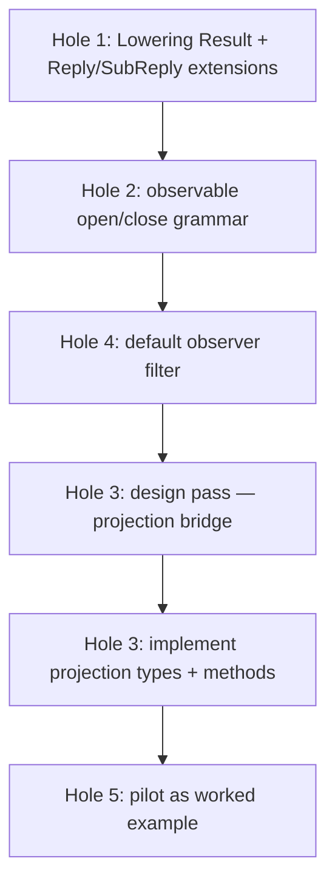

# 246 — Bundled fix design for the /244 holes, with examples

*Deep design report combining the alternatives from `/245` with
the operator's corrections in `/140`. Covers each of the five
holes from `/244` with the final shape, mechanical justification,
and a worked example. Plus the bigger-rethinks all settled. This
is the implementation-ready spec for the bundled fix — the next
designer/operator pair can read this and write code from it.*

## 0 · TL;DR

Five holes, five fixes:

| Hole | Final shape |
|---|---|
| 1 (typed rejection on wire) | `lower()` returns `Result<Vec<SemaOperation>, Self::Reply>`; executor encodes the Err as `Reply::Accepted` with `AcceptedOutcome::Aborted`, multi-op per-operation slots become `Invalidated` / `Failed { detail }` / `Skipped`. Kernel `Reply::Rejected` narrows to true frame-level failures only. |
| 2 (`Observe` verb collision) | `observable { open <Verb>(Filter); close <Verb>; … }`. Contract author names the open/close verbs; macro auto-emits the close-op's token payload type. |
| 3 (publish-bridge) | Crate-boundary projection: `signal-frame` owns observer subscription/fanout; `signal-executor` owns execution facts (`Operation`, `SemaEffect`); `Lowering` trait grows two associated types (`OperationEvent`, `SemaEffectEvent`) and two methods (`project_operation`, `project_sema_effect`) that bridge execution facts to channel event records. Macro-generated `<Channel>Lowering` skeleton trait wires the projection types to the contract's `observable { event … }` declarations at compile time. |
| 4 (filter-match impl trust) | `observable { … filter default; … }` triggers macro-generated closed-enum `ObserverFilter` with sensible variants (`All` / `OnlyOperations { kinds }` / `OnlySemaEffects { classes }`) and the auto-impl of the filter-match trait. Contract authors opt out (`filter <CustomType>;`) only when the defaults don't fit. |
| 5 (worked example) | Complete the `signal-repository-ledger` + `repository-ledger` pilot as the canonical Phase-3 reference — adopt the observable block, write the daemon `Lowering` impl, add one end-to-end observer-subscribe test. |

Work order: 1 → 2 → 4 → (design pass on 3) → 3 → 5.

## 1 · Hole 1 — Lowering returns the contract reply on rejection

### The shape

`Lowering` trait surface:

```rust
pub trait Lowering {
    type Operation: RequestPayload;
    type Reply;
    type EngineError;

    /// Lower one contract operation into the Sema operations it
    /// produces. On Err, the contract reply IS the rejection
    /// detail; the executor stops further lowering and produces
    /// an Aborted outcome.
    fn lower(
        &self,
        operation: &Self::Operation,
    ) -> Result<Vec<SemaOperation>, Self::Reply>;

    /// Build the per-op success reply from the Sema effects that
    /// were committed.
    fn reply_from_effects(
        &self,
        operation: &Self::Operation,
        effects: &[SemaEffect],
    ) -> Self::Reply;
}
```

Three associated types (down from four — `RejectionReason` is
gone). One Err-on-failure return shape.

### The `Reply` / `SubReply` extensions

`signal-frame::Reply<ReplyPayload>` grows an `AcceptedOutcome`:

```rust
pub enum Reply<ReplyPayload> {
    Accepted {
        outcome: AcceptedOutcome,
        per_operation: Vec<SubReply<ReplyPayload>>,
    },
    Rejected {
        reason: RequestRejectionReason,  // narrowed to true kernel failures
    },
}

pub enum AcceptedOutcome {
    Committed,
    Aborted {
        failed_at: usize,                       // op index that failed
        reason: OperationFailureReason,
    },
}

pub enum SubReply<ReplyPayload> {
    Ok(ReplyPayload),
    Invalidated,                                // earlier op; would have committed; rolled back
    Failed {
        reason: OperationFailureReason,
        detail: Option<ReplyPayload>,           // ← typed contract reply lives here
    },
    Skipped,                                    // later op; never executed
}

pub enum OperationFailureReason {
    DomainRejection,                            // Lowering returned Err
    EngineRejection,                            // SemaEngine returned Err
}
```

Kernel `Reply::Rejected { reason: Internal }` is reserved for
true frame-level failures (parse error, version skew). Domain
rejections never appear there.

### Executor::execute under the new shape

```rust
pub fn execute(
    &mut self,
    request: Request<L::Operation>,
) -> Reply<L::Reply> {
    let payloads: &NonEmpty<L::Operation> = request.payloads();
    let mut sema_ops: Vec<SemaOperation> = Vec::new();
    let mut sema_op_owners: Vec<usize> = Vec::new();  // op index for each sema op

    // 1. Lower every op. On the first Err, build the Aborted outcome
    //    with per-op slots: Invalidated for earlier, Failed for the
    //    failing op, Skipped for later.
    for (op_index, op) in payloads.iter().enumerate() {
        self.observers.publish_operation_received(op);
        match self.lowering.lower(op) {
            Ok(ops) => {
                sema_op_owners.extend(std::iter::repeat(op_index).take(ops.len()));
                sema_ops.extend(ops);
            }
            Err(contract_reply) => {
                let per_operation = build_aborted_replies(
                    payloads.len(),
                    op_index,
                    contract_reply,
                    OperationFailureReason::DomainRejection,
                );
                return Reply::Accepted {
                    outcome: AcceptedOutcome::Aborted {
                        failed_at: op_index,
                        reason: OperationFailureReason::DomainRejection,
                    },
                    per_operation,
                };
            }
        }
    }

    // 2. Atomic execute.
    let effects = match self.sema_engine.execute_atomic(sema_ops) {
        Ok(effects) => effects,
        Err(engine_error) => {
            // Build an EngineRejection-shaped Aborted outcome. The detail
            // slot is None because the engine error isn't a contract reply.
            return Reply::Accepted {
                outcome: AcceptedOutcome::Aborted {
                    failed_at: 0,  // all ops invalidated; pick the first as carrier
                    reason: OperationFailureReason::EngineRejection,
                },
                per_operation: vec![SubReply::Invalidated; payloads.len()],
            };
        }
    };

    // 3. Publish Sema effects to observers.
    for effect in &effects {
        self.observers.publish_sema_effect_emitted(effect);
    }

    // 4. Per-op success replies from effects, filtered by ownership.
    let per_operation: Vec<SubReply<L::Reply>> = payloads.iter().enumerate()
        .map(|(op_index, op)| {
            let op_effects: Vec<&SemaEffect> = sema_op_owners.iter()
                .zip(&effects)
                .filter_map(|(&owner, effect)| if owner == op_index { Some(effect) } else { None })
                .collect();
            SubReply::Ok(self.lowering.reply_from_effects(op, &op_effects))
        })
        .collect();

    Reply::Accepted {
        outcome: AcceptedOutcome::Committed,
        per_operation,
    }
}
```

Note the implicit ownership tracking — `sema_op_owners` maps each
Sema operation back to the request op that produced it. This
closes hole 13 from `/242` (implicit positional correlation) by
making correlation explicit and typed.

### Worked example — spirit, 3-op request with middle rejection

Inbound:

```nota
[(State first-statement)
 (State bad-statement-policy-violation)
 (Record entry-3)]
```

Lowering trace:

- `lower(State(first-statement))` → `Ok([SemaOperation::Assert(...)])`. `sema_ops = [Assert-first]`, `sema_op_owners = [0]`.
- `lower(State(bad-statement))` → `Err(SpiritReply::StateRejected(StateRejectionReason::PolicyDenied))`.
- Executor stops; builds Aborted reply.

Outbound:

```
Reply::Accepted {
    outcome: AcceptedOutcome::Aborted {
        failed_at: 1,
        reason: OperationFailureReason::DomainRejection,
    },
    per_operation: [
        SubReply::Invalidated,                            // op 0 — would have committed; rolled back
        SubReply::Failed {
            reason: OperationFailureReason::DomainRejection,
            detail: Some(SpiritReply::StateRejected(
                StateRejectionReason::PolicyDenied,
            )),
        },
        SubReply::Skipped,                                // op 2 — never executed
    ],
}
```

NOTA wire form:

```nota
(Accepted
    (Aborted 1 DomainRejection)
    [Invalidated
     (Failed DomainRejection (Some (StateRejected PolicyDenied)))
     Skipped])
```

The caller knows exactly which op failed, why (`PolicyDenied`),
and that ops 0 and 2 weren't committed.

## 2 · Hole 2 — Author-named observable verbs

### The shape

The observable block accepts contract-authored open/close verbs:

```rust
observable {
    open <OpenVerb>(<FilterType>);
    close <CloseVerb>;
    filter <FilterType>;                  // or `filter default;` (hole 4)
    event <EventType>;
    event <EventType>;
    // … more events …
}
```

Three things the macro auto-emits when this block is present:

1. `operation <OpenVerb>(<FilterType>) opens <Channel>ObserverStream`
2. `operation <CloseVerb>(<Channel>ObserverSubscriptionToken)` — close payload type is macro-determined; the contract author writes `close <Verb>;` with no payload
3. The `<Channel>ObserverStream` block with all declared events; the `<Channel>ObserverFilterMatch` trait; the `<Channel>ObserverSet`; the publish closures

### Worked example — spirit with Watch/Unwatch

Spirit's channel declaration:

```rust
signal_channel! {
    channel Spirit {
        operation State(Statement),
        operation Record(Entry),
        operation Observe(Selection),         // contract-author's own read verb — no collision
        operation Watch(Subscription) opens RecordStream,
        operation Unwatch(RecordSubscriptionToken),
        operation Query(Selection),
        // ...
    }
    reply SpiritReply { ... }
    observable {
        open Tap(SpiritObserverFilter);       // ← author picks Tap to avoid collision with Watch
        close Untap;
        filter default;                        // ← hole 4 — uses macro-generated standard filter
        event OperationReceived;
        event SemaEffectEmitted;
    }
}
```

The macro injects:

```rust
operation Tap(SpiritObserverFilter) opens SpiritObserverStream
operation Untap(SpiritObserverSubscriptionToken)

stream SpiritObserverStream {
    token SpiritObserverSubscriptionToken;
    opened SpiritObserverSubscriptionOpened;
    event OperationReceived;
    event SemaEffectEmitted;
    close SpiritObserverSubscriptionToken;
}
```

No collision with the contract's own `Observe(Selection)` or
`Watch(Subscription)` operations. The contract author chose
`Tap` for the debug-stream verb because the natural names were
taken by domain operations.

For a contract without those collisions, the typical choice is
`Watch`/`Unwatch`:

```rust
observable {
    open Watch(LedgerObserverFilter);
    close Unwatch;
    filter default;
    event OperationReceived;
    event SemaEffectEmitted;
}
```

Each contract picks the verbs that fit its domain. Cross-contract
reuse is fine; the receiver determines the effect per the
contract-locality principle (`intent/component-shape.nota`
2026-05-19T19:45Z).

## 3 · Hole 3 — Projection bridge across crate boundary

### The crate boundary problem

`signal-frame` cannot reference `signal_executor::SemaEffect` —
that would reverse the dependency (signal-executor → signal-frame
is the right direction; reversing creates a cycle).

But the macro in `signal-frame` generates publish closures that
take **channel-specific event records** (`OperationReceived`,
`SemaEffectEmitted`). The executor publishes **raw execution
facts** (`Operation`, `SemaEffect`).

Something has to project raw facts → channel event records. That
projection is contract-specific (each contract knows how its
`OperationReceived` is constructed from its `Operation`). So the
projection belongs in the daemon's `Lowering` impl, not in
either kernel crate.

### The shape

`Lowering` grows two associated types and two methods:

```rust
pub trait Lowering {
    type Operation: RequestPayload;
    type Reply;
    type EngineError;

    // New: projection types matching the contract's observable block.
    type OperationEvent;
    type SemaEffectEvent;

    fn lower(&self, op: &Self::Operation)
        -> Result<Vec<SemaOperation>, Self::Reply>;

    fn reply_from_effects(&self, op: &Self::Operation, effects: &[SemaEffect])
        -> Self::Reply;

    // New: project execution facts to channel event records.
    fn project_operation(&self, op: &Self::Operation) -> Self::OperationEvent;
    fn project_sema_effect(&self, effect: &SemaEffect) -> Self::SemaEffectEvent;
}
```

The executor's publish path becomes:

```rust
// Before lowering an op:
let event = self.lowering.project_operation(op);
self.observers.publish_operation_received(&event, |token, evt| {
    // wire delivery (daemon-provided closure)
});

// After committing each Sema effect:
let event = self.lowering.project_sema_effect(effect);
self.observers.publish_sema_effect_emitted(&event, |token, evt| {
    // wire delivery
});
```

The macro-generated `<Channel>ObserverSet::publish_*` closures
fire only when there are subscribed observers; the deliver
closure is the daemon's socket-layer wire callback.

### Macro-generated channel-specific Lowering skeleton

To prevent the contract author from mismatching projection types
to the observable declarations, the macro emits a
channel-specific trait alias:

```rust
// Macro-generated from `channel Spirit { … observable { event OperationReceived; event SemaEffectEmitted; } }`:
pub trait SpiritLowering: Lowering<
    Operation = SpiritOperation,
    Reply = SpiritReply,
    OperationEvent = OperationReceived,
    SemaEffectEvent = SemaEffectEmitted,
> {}

// Blanket impl over any matching Lowering:
impl<T> SpiritLowering for T where T: Lowering<
    Operation = SpiritOperation,
    Reply = SpiritReply,
    OperationEvent = OperationReceived,
    SemaEffectEvent = SemaEffectEmitted,
> {}
```

Daemons implement `Lowering` once; the type system checks the
projection types match the observable declarations at compile
time.

### Worked example — spirit's daemon

```rust
struct SpiritDaemonLowering {
    psyche_policy: PsychePolicy,
    statement_classifier: StatementClassifier,
    // …
}

impl Lowering for SpiritDaemonLowering {
    type Operation = SpiritOperation;
    type Reply = SpiritReply;
    type EngineError = SpiritEngineError;
    type OperationEvent = OperationReceived;
    type SemaEffectEvent = SemaEffectEmitted;

    fn lower(&self, op: &SpiritOperation) -> Result<Vec<SemaOperation>, SpiritReply> {
        match op {
            SpiritOperation::State(statement) => {
                if !self.psyche_policy.accepts(statement) {
                    return Err(SpiritReply::StateRejected(
                        StateRejectionReason::PolicyDenied,
                    ));
                }
                let entry = self.statement_classifier.classify(statement)?;
                Ok(vec![SemaOperation::Assert(entry.into_typed_record())])
            }
            // ...
        }
    }

    fn reply_from_effects(&self, op: &SpiritOperation, effects: &[SemaEffect]) -> SpiritReply {
        match op {
            SpiritOperation::State(_) => SpiritReply::Stated(
                StatementCaptured::from_effects(effects),
            ),
            // ...
        }
    }

    fn project_operation(&self, op: &SpiritOperation) -> OperationReceived {
        OperationReceived::new(op.kind(), self.timestamp_now())
    }

    fn project_sema_effect(&self, effect: &SemaEffect) -> SemaEffectEmitted {
        SemaEffectEmitted::new(effect.operation_class(), effect.outcome().clone())
    }
}
```

The daemon implements one trait. The macro-generated
`SpiritLowering` trait alias gives a compile-time check that the
projection types match `observable { event OperationReceived;
event SemaEffectEmitted; }`. If the daemon's `Lowering` impl has
mismatched `OperationEvent` or `SemaEffectEvent`, the daemon
doesn't satisfy `SpiritLowering` and the executor wiring fails
to compile.

### Why this isn't /245's "move ObserverChannel to signal-frame"

`/245`'s proposal was: move the `ObserverChannel` trait to
signal-frame, and the macro emits the impl. The mechanical
problem `/140` caught: the trait would need to reference
`SemaEffect`, which lives in signal-executor — backwards
dependency.

The fix: the projection happens in the *daemon's `Lowering`
impl* (signal-executor side). The trait's projection methods
return channel-specific event records (`OperationReceived`,
`SemaEffectEmitted`), which are contract-defined types. No
kernel crate needs to reference SemaEffect from the wrong side.

## 4 · Hole 4 — Default observer filter

### The grammar

```rust
observable {
    open <OpenVerb>(<FilterType>);
    close <CloseVerb>;
    filter default;                       // ← macro generates the filter type + impl
    event <EventType>;
    event <EventType>;
}
```

When `filter default;` appears, the macro generates:

```rust
pub enum ObserverFilter {
    All,
    OnlyOperations { kinds: Vec<<Channel>OperationKind> },
    OnlyEvents { event_kinds: Vec<ObserverEventKind> },
}

pub enum ObserverEventKind {
    OperationReceived,
    SemaEffectEmitted,
    // ... one per declared event ...
}

impl <Channel>ObserverFilterMatch for ObserverFilter {
    fn matches_operation_received(&self, event: &OperationReceived) -> bool {
        match self {
            Self::All => true,
            Self::OnlyOperations { kinds } => kinds.contains(&event.operation_kind()),
            Self::OnlyEvents { event_kinds } => event_kinds.contains(&ObserverEventKind::OperationReceived),
        }
    }
    fn matches_sema_effect_emitted(&self, event: &SemaEffectEmitted) -> bool { /* parallel */ }
}
```

A contract author who needs a custom predicate writes
`filter <CustomType>;` instead and provides the impl. Most
contracts use `default`.

### Worked example — spirit subscribing only to State operations

```rust
// Subscriber side
let filter = ObserverFilter::OnlyOperations {
    kinds: vec![SpiritOperationKind::State],
};
let subscription = spirit_client.tap(filter).await?;
while let Some(event) = subscription.next().await {
    // Only OperationReceived events for State ops; nothing else
    println!("psyche stated: {:?}", event);
}
```

The macro's filter-match generated impl filters server-side; the
subscriber only receives matching events. No subscriber-side
filtering needed for the common case.

## 5 · Hole 5 — Pilot as worked example

### The path

`signal-repository-ledger` already has the request/reply lifted
shape from `/124` (`operation Query(Query)`,
`reply Reply { QueryResult(QueryResult), … }`). Three remaining
steps to make it the canonical example:

1. **Add the observable block to signal-repository-ledger**:
   ```rust
   observable {
       open Watch(ObserverFilter);
       close Unwatch;
       filter default;
       event OperationReceived;
       event SemaEffectEmitted;
   }
   ```
2. **Implement `Lowering` for the repository-ledger daemon**:
   - `lower(Receive(...))` → `Assert(EventRecord)` (single Sema op).
   - `lower(Observe(...))` → `Assert(EventRecord)` (single Sema op).
   - `lower(Query(Query::RecentRepositories(...)))` → `Match(RecentRepositoryReadPlan)`.
   - etc.
3. **Add the end-to-end observer test**:
   ```rust
   #[test]
   fn observer_sees_receive_and_resulting_effect() -> Result<()> {
       let mut daemon = LedgerDaemon::start(test_engine())?;
       let mut observer = daemon.client().tap(ObserverFilter::All).await?;
       
       let receipt = daemon.client().receive(hook_notification_payload).await?;
       
       // Observer sees the OperationReceived first, then SemaEffectEmitted.
       let event_1 = observer.next().await?;
       assert_matches!(event_1, ObserverEvent::OperationReceived(_));
       let event_2 = observer.next().await?;
       assert_matches!(event_2, ObserverEvent::SemaEffectEmitted(_));
       
       // The receipt carries the typed contract reply.
       assert_matches!(receipt, SubReply::Ok(LedgerReply::Received(_)));
       Ok(())
   }
   ```

That test exercises every layer of the stack. Phase-3
components (signal-persona-spirit first) follow this pattern.

### What the example demonstrates

- Contract with `observable` block.
- Daemon implementing `Lowering` with all five new associated
  types.
- Executor wired into the daemon's socket loop.
- Observer subscription via the contract-named `Watch` (or
  `Tap`) verb.
- Event flow through the macro-generated publish closures.
- Typed contract reply on success.
- (If a Reject test is added) typed contract reply on
  domain rejection.

## 6 · Bigger rethinks — all settled

Per `/245` §6 and `/140` "Bigger Rethinks", four moves are
considered and declined for now:

| Rethink | Verdict | Reason |
|---|---|---|
| Universal observability (always-on) | Decline — keep opt-in | Small/leaf daemons shouldn't carry observer bookkeeping; bar for opting in should be low |
| Executor in the macro | Decline — keep `signal-executor` separate | Macro is already large; executor is runtime orchestration, not vocabulary emission |
| Drop kernel `Reply` | Decline — keep it, narrow it | Kernel needs a cross-contract shape for frame-level failures; narrow `Reply::Rejected` to true kernel-level failures only |
| Contract-extensible Sema verbs | Decline — wait for forced case | No current contract has proven the 6-verb spine is too tight |

## 7 · Implementation work order



Rationale for the order:

- **Hole 1 first** — touches signal-executor + signal-frame
  (`Reply` / `SubReply` extensions). Foundation for everything
  else. Smaller change than it looks (no projection types yet).
- **Hole 2 next** — pure macro grammar change in signal-frame.
  Independent of hole 1.
- **Hole 4 with hole 2** — same macro file, complementary
  grammar additions.
- **Hole 3 design pass** — the projection bridge needs one
  more design report (this report sketches the shape; the
  full mechanical spec for the trait associated types + macro
  generation of the `<Channel>Lowering` trait alias deserves
  its own detail report before implementation).
- **Hole 3 implement** — adds the two associated types + two
  methods to `Lowering`; updates `Executor::execute`.
- **Hole 5 last** — needs all four prior holes to settle so
  the pilot isn't built on transitional API.

## 8 · Estimated touch-points per crate

| Crate | Holes touching it | Touch-points |
|---|---|---|
| `signal-frame` | 1, 2, 3, 4 | `Reply`/`SubReply` enum extensions; macro grammar; macro emit; macro-generated `<Channel>Lowering` trait alias |
| `signal-executor` | 1, 3 | `Lowering` trait extension; `Executor::execute` rewrite |
| `signal-sema` | (none directly) | — |
| `signal-repository-ledger` | 2, 4, 5 | observable block; default filter; integration tests |
| `repository-ledger` | 5 | `Lowering` impl; observer adapter; end-to-end test |

Plus the macro-coordination check across `signal-frame` and
`signal-executor` to make sure the projection types align.

## 9 · References

- `reports/designer/244-hole-finding-after-243-implementations.md`
  — the original hole inventory.
- `reports/designer/245-design-alternatives-for-244-holes.md`
  — alternatives sketch; this report supersedes it for the
  practical spec.
- `reports/operator/140-signal-frame-executor-hole-analysis.md`
  — operator's analysis with crate-boundary correction on
  hole 3; the trigger for this bundled fix.
- `reports/designer/243-reply-naming-observer-hook-executor-trait.md`
  — the original three-design report; hole 1 and 3
  alternatives correct mechanical gaps in §1 and §3.
- `reports/designer/241-signal-architecture-migration-guide.md`
  — broader migration spec.
- `signal-frame` `1610be7c` + `b86442ac` — the observable
  block landing.
- `signal-executor` `57040d59` — the executor crate.
- `intent/component-shape.nota` 2026-05-19T20:00Z — observer
  hook is not security-sensitive (informs hole 4 default
  filter shape).
- `intent/naming.nota` — verb-form rule (informs hole 2
  grammar).
