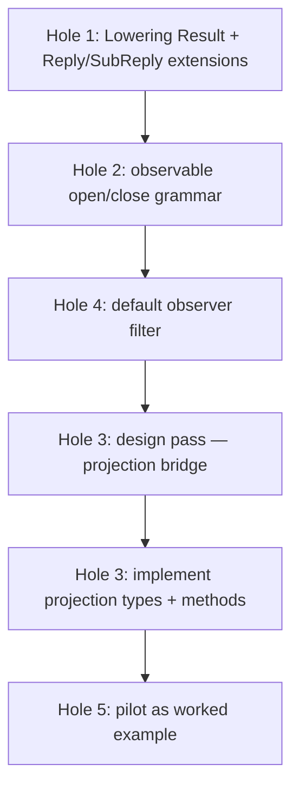

# 246 — Bundled fix design for the /244 holes, with examples

*v4. Adopts the three-layer model (Contract Operation / Component
Command / Sema Operation) per psyche affirmation 2026-05-20T02:00Z.
This is the implementation-ready spec for the bundled fix. Earlier
revisions: v1 at commit 8c5381e2 (separate ObservationProjection);
v2 at 048be316 (revised hole 3); v3 at fd255fab (split
AcceptedOutcome). v4 supersedes all earlier specs for the
load-bearing trait shapes; sections that didn't shift between v3
and v4 are unchanged.*

## 0 · TL;DR

Five holes, five fixes — all now expressed through the three-layer
model (see §0.5 below):

| Hole | Final shape |
|---|---|
| 1 (typed rejection on wire) | `Lowering` adopts a `Command` associated type; `lower()` returns `Result<OperationPlan<Self::Command>, Self::Reply>` — structural ownership, no `source_index` sidecar. Executor encodes lowering Err as `Reply::Accepted` with `AcceptedOutcome::OperationAborted { failed_at, reason: DomainRejection }`; multi-op slots become `Invalidated` / `Failed { detail }` / `Skipped`. Engine failures use `Reply::Accepted` with `AcceptedOutcome::BatchAborted { reason, retry, commit }` carrying generic execution metadata — no fake `failed_at`. Kernel `Reply::Rejected` narrows to true frame-level failures only (decode, version, malformed). `Lowering::EngineError` retires. |
| 2 (`Observe` verb collision) | `observable { … }` mandatory for persona components; macro injects standardized `Tap(ObserverFilter)` / `Untap(ObserverSubscriptionToken)` — no author override for persona. Domain contracts that want the verb `Tap` rename their domain verb. Non-persona small utilities don't declare an observable block at all. |
| 3 (publish-bridge) | `signal-frame` owns generic `ObserverFanout<OperationEvent, EffectEvent>` (no `SemaEffect` reference; no reverse dependency). `signal-executor` owns `ObservedLowering: Lowering` extension trait parameterized over the component's `Command` type; projection methods are `project_operation(&Self::Operation) -> Self::OperationEvent` and `project_effect(&ComponentEffect) -> Self::EffectEvent`. Daemons that don't observe impl `Lowering` only; observable daemons impl `ObservedLowering`. Macro-generated `<Channel>ObservedLowering` witness gives compile-time check. |
| 4 (filter-match impl trust) | `observable { … filter default; … }` triggers macro-generated closed-enum `ObserverFilter` with sensible variants. Contract authors opt out (`filter <CustomType>;`) only when defaults don't fit. |
| 5 (worked example) | Complete `signal-repository-ledger` + `repository-ledger` pilot as the canonical Phase-3 reference. |

Work order: foundation crates first (signal-sema as classification
vocabulary; signal-executor's `Lowering` / `OperationPlan` / `Command`
trait; signal-frame's `ObserverFanout` + mandatory observable);
then the pilot.

## 0.5 · The three-layer model

The spec rests on three distinct layers of operation language —
each owns a different concern and lives in a different home:

```text
Layer 1: Contract Operation  (external — what crosses the wire)
  - Domain language. Contract author names the public verbs.
  - Owned by signal-<component> contract crates.
  - Examples: SpiritOperation::State(Statement),
              LedgerOperation::Receive(HookNotification),
              MindOperation::Submit(Thought).

Layer 2: Component Command  (internal — what the daemon executes)
  - Per-component typed executable records.
  - Owned by each daemon.
  - Carry typed payloads the engine actually needs.
  - Examples: SpiritCommand::AssertEntry(Entry),
              LedgerCommand::RecordEvent(EventRecord),
              LedgerCommand::ReadRecentRepositories(ReadPlan).

Layer 3: Sema Operation  (cross-component — what observation sees)
  - Universal, payloadless state-action classification.
  - Owned by signal-sema.
  - Variants: Assert | Mutate | Retract | Match | Subscribe | Validate.
  - Used ONLY for observation/introspection; never executable.
```

Flow per request:

```
incoming signal frame
  → Contract Operation decoded (Layer 1)
    → Lowering converts to OperationPlan<Command>  (Layer 2)
      → CommandExecutor executes Commands against tables
        → ComponentEffect emitted
          → ToSemaOperation projects Command → Sema class (Layer 3)
            → SemaEffect emitted to observers
              → reply_from_effects builds Contract Reply (Layer 1)
                → outgoing signal frame
```

Two layers of observation:
- **Universal Sema classification** for cross-component patterns
  ("which components performed an Assert in the last hour?").
- **Component-specific events** for detailed introspection
  (`SpiritEvent::EntryAsserted { entry_id, statement_id }`).

Why three layers, not one or two:
- One layer (e.g., a giant SemaOperation enum carrying every
  possible payload) either bloats into a universal DSL or
  degenerates into `(verb, opaque-bytes)`.
- Two layers (no Component Command — Lowering produces Sema
  directly) forces Sema's payload to span every component's
  schema. Same trap.
- Three layers: each owns one concern. Universal class
  vocabulary at the observation layer; typed executable
  commands at the engine layer; domain verbs at the contract
  layer.

This is the load-bearing model. The trait shapes below all rest
on it.

## 1 · Hole 1 — Lowering returns the contract reply on rejection

### The shape

`Lowering` trait surface:

```rust
pub trait Lowering {
    type Operation: RequestPayload;
    type Reply;
    type Command;            // contract-local executable command type (Layer 2)
    type ComponentEffect;    // per-component effect produced by the engine

    /// Lower one contract operation into a typed OperationPlan of
    /// Component Commands. On Err, the contract reply IS the
    /// rejection detail; the executor stops further lowering and
    /// produces an OperationAborted outcome.
    fn lower(
        &self,
        operation: &Self::Operation,
    ) -> Result<OperationPlan<Self::Command>, Self::Reply>;

    /// Build the per-op success reply from the component effects
    /// that were committed for this operation.
    fn reply_from_effects(
        &self,
        operation: &Self::Operation,
        effects: &[Self::ComponentEffect],
    ) -> Self::Reply;
}

pub struct OperationPlan<Command> {
    pub commands: NonEmpty<Command>,
}

pub struct BatchPlan<Command> {
    pub operations: NonEmpty<OperationPlan<Command>>,
}
```

Ownership of which Sema operations a Command produces lives
**structurally** in the plan: one `OperationPlan` per source op,
each carrying that op's commands. The executor assembles a
`BatchPlan` from successive `lower()` calls; owner-index falls
out of the structure, no sidecar.

Component Commands project to Sema classes for observation via:

```rust
pub trait ToSemaOperation {
    fn to_sema_operation(&self) -> SemaOperation;
}
```

Each contract's Command enum impls `ToSemaOperation` —
matching variant to classification (`AssertEntry` → `Assert`;
`MatchEntries` → `Match`; etc.).

Four associated types in `Lowering`: `Operation` (Layer 1 — what
the contract receives), `Reply` (contract reply enum),
`Command` (Layer 2 — typed executable commands the daemon
produces), `ComponentEffect` (per-component effect produced by
the engine — used by `reply_from_effects` to build the success
reply). No `EngineError` — engine errors arise from the
component's `CommandExecutor`, which the executor framework
handles outside the `Lowering` trait surface.

### The `Reply` / `SubReply` extensions

`signal-frame::Reply<ReplyPayload>` grows an `AcceptedOutcome`:

```rust
pub enum Reply<ReplyPayload> {
    Accepted {
        outcome: AcceptedOutcome,
        per_operation: Vec<SubReply<ReplyPayload>>,
    },
    Rejected {
        reason: RequestRejectionReason,  // narrowed to true kernel failures
    },
}

pub enum AcceptedOutcome {
    Committed,
    OperationAborted {
        failed_at: usize,                       // op index that failed (real index, not faked)
        reason: OperationFailureReason,
    },
    BatchAborted {
        reason: BatchFailureReason,             // no op index — failure is at the batch level
        retry: RetryClassification,             // generic execution metadata (workspace-universal)
        commit: CommitStatus,                   // generic execution metadata
    },
}

pub enum SubReply<ReplyPayload> {
    Ok(ReplyPayload),
    Invalidated,                                // operation lowered but the batch did not commit
    Failed {
        reason: OperationFailureReason,
        detail: Option<ReplyPayload>,           // ← typed contract reply lives here
    },
    Skipped,                                    // later op; never lowered
}

pub enum OperationFailureReason {
    DomainRejection,                            // Lowering returned Err
}

pub enum BatchFailureReason {
    EngineRejected,                             // engine failed pre/during commit
    EngineUnavailable,                          // engine couldn't be reached
}

/// Whether the caller may retry the request as-is.
pub enum RetryClassification {
    Retryable,                                  // transient — e.g., lock contention, brief unavail
    NotRetryable,                               // permanent — schema/config/integrity failure
    Unknown,                                    // engine couldn't classify
}

/// Whether any state changed despite the failure.
pub enum CommitStatus {
    NotCommitted,                               // atomic rollback succeeded; no state changed
    Unknown,                                    // engine couldn't confirm — operator concern
    Partial,                                    // some effects landed; rare and worth log signal
}
```

Kernel `Reply::Rejected { reason: Internal }` is reserved for
true frame-level failures (parse error, version skew). Domain
rejections never appear there.

### Executor::execute under the new shape

```rust
pub fn execute(
    &mut self,
    request: Request<L::Operation>,
) -> Reply<L::Reply> {
    let payloads: &NonEmpty<L::Operation> = request.payloads();
    let mut sema_ops: Vec<SemaOperation> = Vec::new();
    let mut sema_op_owners: Vec<usize> = Vec::new();  // op index for each sema op

    // 1. Lower every op. On the first Err, build the Aborted outcome
    //    with per-op slots: Invalidated for earlier, Failed for the
    //    failing op, Skipped for later.
    for (op_index, op) in payloads.iter().enumerate() {
        self.observers.publish_operation_received(op);
        match self.lowering.lower(op) {
            Ok(ops) => {
                sema_op_owners.extend(std::iter::repeat(op_index).take(ops.len()));
                sema_ops.extend(ops);
            }
            Err(contract_reply) => {
                let per_operation = build_operation_aborted_replies(
                    payloads.len(),
                    op_index,
                    contract_reply,
                    OperationFailureReason::DomainRejection,
                );
                return Reply::Accepted {
                    outcome: AcceptedOutcome::OperationAborted {
                        failed_at: op_index,        // real index — this op produced the Err
                        reason: OperationFailureReason::DomainRejection,
                    },
                    per_operation,
                };
            }
        }
    }

    // 2. Atomic execute. Engine failure → BatchAborted (no fake failed_at),
    //    stays inside Reply::Accepted because the request WAS accepted and
    //    lowered; only the atomic commit failed. (Revised 2026-05-20 per
    //    /142: engine failure is post-acceptance; Reply::Rejected is
    //    reserved for pre-acceptance frame failures only.)
    let effects = match self.sema_engine.execute_atomic(sema_ops) {
        Ok(effects) => effects,
        Err(_engine_error) => {
            // Typed engine error stays daemon-side (logs); wire reply
            // carries BatchAborted with all ops Invalidated.
            // Engine classified the failure; carry the metadata.
            let (reason, retry, commit) = engine_error.classify();
            return Reply::Accepted {
                outcome: AcceptedOutcome::BatchAborted { reason, retry, commit },
                per_operation: vec![SubReply::Invalidated; payloads.len()],
            };
        }
    };

    // 3. Publish Sema effects to observers.
    for effect in &effects {
        self.observers.publish_sema_effect_emitted(effect);
    }

    // 4. Per-op success replies from effects, filtered by ownership.
    let per_operation: Vec<SubReply<L::Reply>> = payloads.iter().enumerate()
        .map(|(op_index, op)| {
            let op_effects: Vec<&SemaEffect> = sema_op_owners.iter()
                .zip(&effects)
                .filter_map(|(&owner, effect)| if owner == op_index { Some(effect) } else { None })
                .collect();
            SubReply::Ok(self.lowering.reply_from_effects(op, &op_effects))
        })
        .collect();

    Reply::Accepted {
        outcome: AcceptedOutcome::Committed,
        per_operation,
    }
}
```

Note the implicit ownership tracking — `sema_op_owners` maps each
Sema operation back to the request op that produced it. This
closes hole 13 from `/242` (implicit positional correlation) by
making correlation explicit and typed.

### Worked example — spirit, 3-op request with middle rejection

Inbound:

```nota
[(State first-statement)
 (State bad-statement-policy-violation)
 (Record entry-3)]
```

Lowering trace:

- `lower(State(first-statement))` → `Ok([SemaOperation::Assert(...)])`. `sema_ops = [Assert-first]`, `sema_op_owners = [0]`.
- `lower(State(bad-statement))` → `Err(SpiritReply::StateRejected(StateRejectionReason::PolicyDenied))`.
- Executor stops; builds Aborted reply.

Outbound:

```
Reply::Accepted {
    outcome: AcceptedOutcome::Aborted {
        failed_at: 1,
        reason: OperationFailureReason::DomainRejection,
    },
    per_operation: [
        SubReply::Invalidated,                            // op 0 — would have committed; rolled back
        SubReply::Failed {
            reason: OperationFailureReason::DomainRejection,
            detail: Some(SpiritReply::StateRejected(
                StateRejectionReason::PolicyDenied,
            )),
        },
        SubReply::Skipped,                                // op 2 — never executed
    ],
}
```

NOTA wire form:

```nota
(Accepted
    (Aborted 1 DomainRejection)
    [Invalidated
     (Failed DomainRejection (Some (StateRejected PolicyDenied)))
     Skipped])
```

The caller knows exactly which op failed, why (`PolicyDenied`),
and that ops 0 and 2 weren't committed.

### Documentation update on `SubReply::Invalidated`

`signal-frame`'s current `SubReply::Invalidated` doc leans
toward *"operation ran but its result is no longer
authoritative"* (per `/141` reading). Under this design, the
variant also covers *"operation was planned and lowered but
invalidated before commit because a sibling op rejected the
request."* Widen the doc to cover both cases, or introduce a
more precise variant if the wording feels too elastic.

## 2 · Hole 2 — Mandatory standardized observable surface

### The shape

The observable block is **mandatory for persona components**;
non-persona small utilities don't declare it. When present, the
macro injects the standard `Tap` / `Untap` observability verbs —
**no author override** for persona components. Domain contracts
that want the verb `Tap` rename their domain verb, not the
observability verb.

```rust
observable {
    filter <FilterType>;                  // or `filter default;` (hole 4)
    operation_event <OperationEventType>;
    effect_event <EffectEventType>;
}
```

The macro auto-emits when this block is present:

1. `operation Tap(<FilterType>) opens <Channel>ObserverStream` — standardized open verb.
2. `operation Untap(<Channel>ObserverSubscriptionToken)` — standardized close verb; payload is macro-owned.
3. The `<Channel>ObserverStream` block with the two declared events; the `<Channel>ObserverFilterMatch` trait; the `<Channel>ObserverSet`; the publish closures.

The previous draft (v2/v3) allowed contract-author-named open/close
verbs. Psyche affirmation 2026-05-20T02:00Z removed the override:
persona-introspect benefits from uniform vocabulary across every
persona daemon; the small cost is borne by contracts whose domain
verb collides with `Tap` (they pick a different domain verb).

### Worked example — spirit with Watch/Unwatch

Spirit's channel declaration:

```rust
signal_channel! {
    channel Spirit {
        operation State(Statement),
        operation Record(Entry),
        operation Observe(Selection),         // contract-author's own read verb — no collision
        operation Watch(Subscription) opens RecordStream,
        operation Unwatch(RecordSubscriptionToken),
        operation Query(Selection),
        // ...
    }
    reply SpiritReply { ... }
    observable {
        filter default;                        // ← hole 4 — uses macro-generated standard filter
        operation_event OperationReceived;
        effect_event SemaEffectEmitted;
    }
}
```

The macro injects (verbs are standardized; no author choice):

```rust
operation Tap(SpiritObserverFilter) opens SpiritObserverStream
operation Untap(SpiritObserverSubscriptionToken)

stream SpiritObserverStream {
    token SpiritObserverSubscriptionToken;
    opened SpiritObserverSubscriptionOpened;
    event OperationReceived;
    event SemaEffectEmitted;
    close SpiritObserverSubscriptionToken;
}
```

Spirit's own `Observe(Selection)` and `Watch(Subscription)`
domain operations coexist without collision because the
observability verbs are `Tap`/`Untap` — a name reserved by the
macro and not in spirit's domain vocabulary.

For a contract without those collisions, the typical choice is
`Watch`/`Unwatch`:

```rust
observable {
    open Watch(LedgerObserverFilter);
    close Unwatch;
    filter default;
    event OperationReceived;
    event SemaEffectEmitted;
}
```

Each contract picks the verbs that fit its domain. Cross-contract
reuse is fine; the receiver determines the effect per the
contract-locality principle (`intent/component-shape.nota`
2026-05-19T19:45Z).

## 3 · Hole 3 — Projection bridge across crate boundary

### The crate boundary problem

`signal-frame` cannot reference `signal_executor::SemaEffect` —
that would reverse the dependency (signal-executor → signal-frame
is the right direction; reversing creates a cycle).

But the macro in `signal-frame` generates publish closures that
take **channel-specific event records** (`OperationReceived`,
`SemaEffectEmitted`). The executor publishes **raw execution
facts** (`Operation`, `SemaEffect`).

Something has to project raw facts → channel event records. The
projection is contract-specific (each contract knows how its
`OperationReceived` is constructed from its `Operation`).

### The shape — extension trait + frame-side fanout

**(Revised 2026-05-20 after `/142` logic probe: extension trait
beats separate sibling trait + bridge struct. Same separation of
concerns; more idiomatic Rust; the probe demonstrated this
compiles without dependency cycles in
`/tmp/signal-frame-executor-246-probe/model.rs`.)**

Three pieces in three crates:

1. **`signal-frame`** owns a generic fanout primitive — small
   trait, no `SemaEffect` reference, no reverse dependency:

   ```rust
   pub trait ObserverFanout<OperationEvent, EffectEvent> {
       fn publish_operation(&mut self, event: OperationEvent);
       fn publish_effect(&mut self, event: EffectEvent);
   }
   ```

   The macro-emitted `<Channel>ObserverSet` impls
   `ObserverFanout<OperationReceived, SemaEffectEmitted>` (or
   whatever the contract's event types are). Token bookkeeping,
   filter routing, fanout-to-deliver-closures all stay in the
   macro-generated impl.

2. **`signal-executor`** owns `ObservedLowering` as an extension
   trait of `Lowering`, parameterized over the component's
   `Command` type — daemons that don't observe don't impl it at
   all. Projection inputs are the component's own operation and
   effect types (Layers 1 and 2), not raw SemaEffect:

   ```rust
   pub trait ObservedLowering: Lowering {
       type OperationEvent;
       type EffectEvent;

       fn project_operation(
           &self,
           operation: &Self::Operation,
       ) -> Self::OperationEvent;

       fn project_effect(
           &self,
           effect: &Self::ComponentEffect,
       ) -> Self::EffectEvent;
   }
   ```

   Both projection inputs are typed component-local values:
   `Self::Operation` (Layer 1, the contract operation) and
   `Self::ComponentEffect` (the per-component effect produced by
   the engine, NOT a universal SemaEffect — the universal
   classification happens via `ToSemaOperation` separately for
   cross-component patterns).

   The executor calls projection, then hands already-projected
   event records to the frame-side fanout:

   ```rust
   // Inside Executor::execute, before lowering each op (only when ObservedLowering):
   let event = self.lowering.project_operation(op);
   self.fanout.publish_operation(event);

   // After each ComponentEffect lands from the CommandExecutor:
   let event = self.lowering.project_effect(&effect);
   self.fanout.publish_effect(event);
   ```

   `Executor` has two parameterizations: `Executor<L, X>` where
   `L: Lowering` and `X: CommandExecutor<Command = L::Command>`
   (non-observable); and `Executor<L, X, F>` where
   `L: ObservedLowering` and
   `F: ObserverFanout<L::OperationEvent, L::EffectEvent>`. For
   persona components the second variant is the only valid
   shape — `Tap`/`Untap` is mandatory.

3. **The contract crate** owns the channel event record types
   (`OperationReceived`, `SemaEffectEmitted`, filter type),
   declared via the macro's `observable` block grammar:

   ```rust
   observable {
       filter default;                        // hole 4
       operation_event OperationReceived;
       effect_event SemaEffectEmitted;
   }
   ```

   The `operation_event` and `effect_event` grammar tells the
   macro which event record maps to which publication moment, so
   the `ObserverFanout` impl on `<Channel>ObserverSet` wires the
   right type to the right method. The standardized `Tap`/`Untap`
   verbs are macro-generated (per §2).

The macro also emits a channel-specific extension witness:

```rust
pub trait LedgerObservedLowering: ObservedLowering<
    Operation = LedgerOperation,
    Reply = LedgerReply,
    OperationEvent = OperationReceived,
    EffectEvent = SemaEffectEmitted,
> {}

impl<T> LedgerObservedLowering for T where T: ObservedLowering<
    Operation = LedgerOperation,
    Reply = LedgerReply,
    OperationEvent = OperationReceived,
    EffectEvent = SemaEffectEmitted,
> {}
```

A daemon whose `ObservedLowering` impl has wrong event types
fails to satisfy the channel-specific witness — compile-time
check that projection matches the contract's observable
declarations.

### Why this is more elegant than separate projection trait

`Lowering` is about **execution**; observation is an extension
of execution that adds projection. `ObservedLowering: Lowering`
expresses exactly that: "this thing does everything Lowering
does, PLUS provides projection." Non-observable daemons impl
`Lowering` only; observable daemons impl `ObservedLowering`,
which by definition satisfies `Lowering` too.

Three properties this gives:

- **Non-observable daemons pay nothing.** No associated types
  for events they don't emit; no methods to fill in.
- **Tests can require observation only when the contract
  declares `observable`.** A test that exercises the observer
  hook constrains its daemon type to `ObservedLowering`;
  daemons that don't are excluded at the type level.
- **One impl on the daemon's lowering type.** No second struct
  to instantiate (vs the separate-trait + bridge-struct shape
  in `/246-v2`'s earlier draft); no extra wiring at
  construction.

The `/142` logic probe (3 tests passing in
`/tmp/signal-frame-executor-246-probe/model.rs`) confirmed the
extension trait compiles cleanly without dependency cycles,
including the channel-specific witness check.

### Worked example — spirit's daemon

```rust
struct SpiritDaemon {
    psyche_policy: PsychePolicy,
    statement_classifier: StatementClassifier,
    timestamp_source: TimestampSource,
    // …
}

impl Lowering for SpiritDaemon {
    type Operation = SpiritOperation;
    type Reply = SpiritReply;

    fn lower(&self, op: &SpiritOperation) -> Result<Vec<SemaOperation>, SpiritReply> {
        match op {
            SpiritOperation::State(statement) => {
                if !self.psyche_policy.accepts(statement) {
                    return Err(SpiritReply::StateRejected(
                        StateRejectionReason::PolicyDenied,
                    ));
                }
                let entry = self.statement_classifier.classify(statement)?;
                Ok(vec![SemaOperation::Assert(entry.into_typed_record())])
            }
            // ...
        }
    }

    fn reply_from_effects(&self, op: &SpiritOperation, effects: &[SemaEffect]) -> SpiritReply {
        match op {
            SpiritOperation::State(_) => SpiritReply::Stated(
                StatementCaptured::from_effects(effects),
            ),
            // ...
        }
    }
}

// Extension: daemon opts in to observability by impl'ing ObservedLowering.
// A daemon without this impl simply can't be wired to an observable Executor.
impl ObservedLowering for SpiritDaemon {
    type OperationEvent = OperationReceived;
    type EffectEvent = SemaEffectEmitted;

    fn project_operation(&self, op: &SpiritOperation) -> OperationReceived {
        OperationReceived::new(op.kind(), self.timestamp_source.now())
    }

    fn project_sema_effect(&self, effect: &SemaEffect) -> SemaEffectEmitted {
        SemaEffectEmitted::new(effect.operation_class(), effect.outcome().clone())
    }
}
```

The daemon wires it together at construction:

```rust
let executor = Executor::observable(
    spirit_daemon,                // impls ObservedLowering
    sema_engine,
    SpiritObserverSet::new(),     // macro-generated; impls ObserverFanout<OperationReceived, SemaEffectEmitted>
);
```

The compile-time check fires if `SpiritDaemon`'s
`ObservedLowering` associated types don't match the contract's
`observable` declarations (`SpiritObservedLowering` trait alias
won't be satisfied).

### Why this isn't /245's "move ObserverChannel to signal-frame"

`/245`'s proposal: move the `ObserverChannel` trait to
signal-frame; the macro emits the impl. `/141` caught the
mechanical problem: the trait would reference
`signal_executor::SemaEffect`, which lives downstream of
signal-frame — backwards dependency.

This revision: `signal-executor` keeps both the
`ObserverChannel` trait AND the new `ObservationProjection`
trait AND the `FrameObserverBridge` struct. The macro-emitted
`<Channel>ObserverSet` impl an `ObservableSet` interface
that signal-executor's bridge composes over. No reverse
dependency.

## 4 · Hole 4 — Default observer filter

### The grammar

```rust
observable {
    open <OpenVerb>(<FilterType>);
    close <CloseVerb>;
    filter default;                       // ← macro generates the filter type + impl
    event <EventType>;
    event <EventType>;
}
```

When `filter default;` appears, the macro generates:

```rust
pub enum ObserverFilter {
    All,
    OnlyOperations { kinds: Vec<<Channel>OperationKind> },
    OnlyEvents { event_kinds: Vec<ObserverEventKind> },
}

pub enum ObserverEventKind {
    OperationReceived,
    SemaEffectEmitted,
    // ... one per declared event ...
}

impl <Channel>ObserverFilterMatch for ObserverFilter {
    fn matches_operation_received(&self, event: &OperationReceived) -> bool {
        match self {
            Self::All => true,
            Self::OnlyOperations { kinds } => kinds.contains(&event.operation_kind()),
            Self::OnlyEvents { event_kinds } => event_kinds.contains(&ObserverEventKind::OperationReceived),
        }
    }
    fn matches_sema_effect_emitted(&self, event: &SemaEffectEmitted) -> bool { /* parallel */ }
}
```

A contract author who needs a custom predicate writes
`filter <CustomType>;` instead and provides the impl. Most
contracts use `default`.

### Worked example — spirit subscribing only to State operations

```rust
// Subscriber side
let filter = ObserverFilter::OnlyOperations {
    kinds: vec![SpiritOperationKind::State],
};
let subscription = spirit_client.tap(filter).await?;
while let Some(event) = subscription.next().await {
    // Only OperationReceived events for State ops; nothing else
    println!("psyche stated: {:?}", event);
}
```

The macro's filter-match generated impl filters server-side; the
subscriber only receives matching events. No subscriber-side
filtering needed for the common case.

## 5 · Hole 5 — Pilot as worked example

### The path

`signal-repository-ledger` already has the request/reply lifted
shape from `/124` (`operation Query(Query)`,
`reply Reply { QueryResult(QueryResult), … }`). Three remaining
steps to make it the canonical example:

1. **Add the observable block to signal-repository-ledger**:
   ```rust
   observable {
       open Watch(ObserverFilter);
       close Unwatch;
       filter default;
       event OperationReceived;
       event SemaEffectEmitted;
   }
   ```
2. **Implement `Lowering` for the repository-ledger daemon**:
   - `lower(Receive(...))` → `Assert(EventRecord)` (single Sema op).
   - `lower(Observe(...))` → `Assert(EventRecord)` (single Sema op).
   - `lower(Query(Query::RecentRepositories(...)))` → `Match(RecentRepositoryReadPlan)`.
   - etc.
3. **Add the end-to-end observer test**:
   ```rust
   #[test]
   fn observer_sees_receive_and_resulting_effect() -> Result<()> {
       let mut daemon = LedgerDaemon::start(test_engine())?;
       let mut observer = daemon.client().tap(ObserverFilter::All).await?;
       
       let receipt = daemon.client().receive(hook_notification_payload).await?;
       
       // Observer sees the OperationReceived first, then SemaEffectEmitted.
       let event_1 = observer.next().await?;
       assert_matches!(event_1, ObserverEvent::OperationReceived(_));
       let event_2 = observer.next().await?;
       assert_matches!(event_2, ObserverEvent::SemaEffectEmitted(_));
       
       // The receipt carries the typed contract reply.
       assert_matches!(receipt, SubReply::Ok(LedgerReply::Received(_)));
       Ok(())
   }
   ```

That test exercises every layer of the stack. Phase-3
components (signal-persona-spirit first) follow this pattern.

### What the example demonstrates

- Contract with `observable` block.
- Daemon implementing `Lowering` with all five new associated
  types.
- Executor wired into the daemon's socket loop.
- Observer subscription via the contract-named `Watch` (or
  `Tap`) verb.
- Event flow through the macro-generated publish closures.
- Typed contract reply on success.
- (If a Reject test is added) typed contract reply on
  domain rejection.

## 6 · Bigger rethinks — all settled

Per `/245` §6 and `/140` "Bigger Rethinks", four moves are
considered and declined for now:

| Rethink | Verdict | Reason |
|---|---|---|
| Universal observability (always-on) | Decline — keep opt-in | Small/leaf daemons shouldn't carry observer bookkeeping; bar for opting in should be low |
| Executor in the macro | Decline — keep `signal-executor` separate | Macro is already large; executor is runtime orchestration, not vocabulary emission |
| Drop kernel `Reply` | Decline — keep it, narrow it | Kernel needs a cross-contract shape for frame-level failures; narrow `Reply::Rejected` to true kernel-level failures only |
| Contract-extensible Sema verbs | Decline — wait for forced case | No current contract has proven the 6-verb spine is too tight |

## 7 · Implementation work order



Rationale for the order:

- **Hole 1 first** — touches signal-executor + signal-frame
  (`Reply` / `SubReply` extensions). Foundation for everything
  else. Smaller change than it looks (no projection types yet).
- **Hole 2 next** — pure macro grammar change in signal-frame.
  Independent of hole 1.
- **Hole 4 with hole 2** — same macro file, complementary
  grammar additions.
- **Hole 3 design pass** — the projection bridge needs one
  more design report (this report sketches the shape; the
  full mechanical spec for the trait associated types + macro
  generation of the `<Channel>Lowering` trait alias deserves
  its own detail report before implementation).
- **Hole 3 implement** — adds the two associated types + two
  methods to `Lowering`; updates `Executor::execute`.
- **Hole 5 last** — needs all four prior holes to settle so
  the pilot isn't built on transitional API.

## 8 · Estimated touch-points per crate

| Crate | Holes touching it | Touch-points |
|---|---|---|
| `signal-frame` | 1, 2, 3, 4 | `Reply`/`SubReply` enum extensions; macro grammar; macro emit; macro-generated `<Channel>Lowering` trait alias |
| `signal-executor` | 1, 3 | `Lowering` trait extension; `Executor::execute` rewrite |
| `signal-sema` | (none directly) | — |
| `signal-repository-ledger` | 2, 4, 5 | observable block; default filter; integration tests |
| `repository-ledger` | 5 | `Lowering` impl; observer adapter; end-to-end test |

Plus the macro-coordination check across `signal-frame` and
`signal-executor` to make sure the projection types align.

## 9 · References

- `reports/designer/244-hole-finding-after-243-implementations.md`
  — the original hole inventory.
- `reports/designer/245-design-alternatives-for-244-holes.md`
  — alternatives sketch; this report supersedes it for the
  practical spec.
- `reports/operator/140-signal-frame-executor-hole-analysis.md`
  — operator's analysis with crate-boundary correction on
  hole 3; the trigger for this bundled fix.
- `reports/designer/243-reply-naming-observer-hook-executor-trait.md`
  — the original three-design report; hole 1 and 3
  alternatives correct mechanical gaps in §1 and §3.
- `reports/designer/241-signal-architecture-migration-guide.md`
  — broader migration spec.
- `signal-frame` `1610be7c` + `b86442ac` — the observable
  block landing.
- `signal-executor` `57040d59` — the executor crate.
- `intent/component-shape.nota` 2026-05-19T20:00Z — observer
  hook is not security-sensitive (informs hole 4 default
  filter shape).
- `intent/naming.nota` — verb-form rule (informs hole 2
  grammar).
