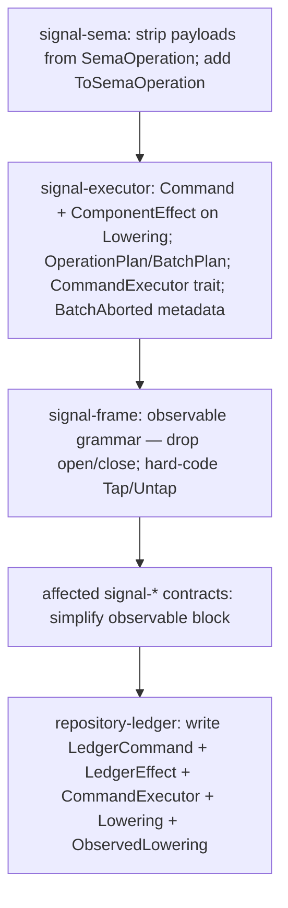

# 248 — Three-layer model: what changed, what to implement

*Operator-facing change report. Reads the diff between the v3 spec
(`/246-v3` at jj `fd255fab`) and the v4 spec (`/246-v4` at jj
`1e91325e`), names what's different, and lays out the implementation
work per crate. Pair this with `/246-v4` (the spec) and `/239` (the
broader migration plan).*

## 0 · TL;DR

Three-layer architecture affirmed by psyche 2026-05-20T02:00Z:

| Layer | Owns | Examples |
|---|---|---|
| **Contract Operation** | external request language | `LedgerOperation::Receive(HookNotification)`, `SpiritOperation::State(Statement)` |
| **Component Command** | internal executable language, per-daemon | `LedgerCommand::RecordEvent(EventRecord)`, `SpiritCommand::AssertEntry(Entry)` |
| **Sema Operation** | universal payloadless classification for observation | `SemaOperation::Assert`, `SemaOperation::Match`, etc. |

What this means for code: **`signal-sema::SemaOperation` becomes payloadless** (just the six variants). **`Lowering` adopts a `Command` associated type** and returns `Result<OperationPlan<Self::Command>, Self::Reply>`. **Each daemon defines its own Command enum + CommandExecutor**. **Commands project to Sema classes via a `ToSemaOperation` trait** for cross-component observation.

What stays from v3: `AcceptedOutcome::Committed | OperationAborted | BatchAborted`; `SubReply::Ok | Invalidated | Failed { detail } | Skipped`; `ObservedLowering: Lowering` extension trait; `ObserverFanout` in `signal-frame`.

What's new in v4 beyond the three-layer split: `BatchAborted` carries `retry` and `commit` metadata; `Tap`/`Untap` mandatory for persona components (no author override); macro grammar simplifies.

## 1 · The diff, by crate

### `signal-sema`

**Before (v3):** `SemaOperation` carried payloads — `SemaOperation::Match(ReadPlan { … })` etc. Was the universal execution language.

**After (v4):** `SemaOperation` is payloadless — pure classification enum:

```rust
pub enum SemaOperation {
    Assert,
    Mutate,
    Retract,
    Match,
    Subscribe,
    Validate,
}
```

`signal-sema` still owns `PatternField<T>`, `Slot<T>`, `Revision` — those are workspace-shared primitives that components use INSIDE their typed Commands (e.g., a Component Command might carry `Slot<Entry>` to identify a record). They're not part of `SemaOperation` itself.

`ToSemaOperation` trait lives here (or in signal-executor — designer's call; the trait is universal):

```rust
pub trait ToSemaOperation {
    fn to_sema_operation(&self) -> SemaOperation;
}
```

Component Commands impl this so the executor can project to Sema classes for observation.

**What to do**: strip payloads from `SemaOperation` variants. Add the `ToSemaOperation` trait. Update `ARCHITECTURE.md` to reflect classification-only role. Drop any tests that exercised payload-bearing SemaOperation.

### `signal-executor`

**Before (v3):** `Lowering` returned `Result<Vec<SemaOperation>, Self::Reply>`. Executor tracked `sema_op_owners: Vec<usize>` sidecar for owner-index. No Command associated type.

**After (v4):** `Lowering` has a `Command` associated type and a `ComponentEffect` associated type. Returns `OperationPlan<Self::Command>`:

```rust
pub trait Lowering {
    type Operation: RequestPayload;
    type Reply;
    type Command;             // Layer 2 — contract-local typed executable
    type ComponentEffect;     // per-component effect produced by the engine

    fn lower(
        &self,
        operation: &Self::Operation,
    ) -> Result<OperationPlan<Self::Command>, Self::Reply>;

    fn reply_from_effects(
        &self,
        operation: &Self::Operation,
        effects: &[Self::ComponentEffect],
    ) -> Self::Reply;
}

pub struct OperationPlan<Command> {
    pub commands: NonEmpty<Command>,
}

pub struct BatchPlan<Command> {
    pub operations: NonEmpty<OperationPlan<Command>>,
}
```

Structural ownership — one `OperationPlan` per source op; the executor assembles `BatchPlan` from successive `lower()` calls. No `sema_op_owners` sidecar.

`ObservedLowering` extension:

```rust
pub trait ObservedLowering: Lowering {
    type OperationEvent;
    type EffectEvent;

    fn project_operation(&self, operation: &Self::Operation) -> Self::OperationEvent;
    fn project_effect(&self, effect: &Self::ComponentEffect) -> Self::EffectEvent;
}
```

Projection inputs are now **typed component-local values** (`Self::Operation`, `Self::ComponentEffect`) — not the raw `SemaEffect` from v3. The universal classification happens via `ToSemaOperation` on the Command (separately, for cross-component patterns).

New trait: per-component `CommandExecutor`:

```rust
pub trait CommandExecutor {
    type Command;
    type Effect;
    type Error;

    fn execute_atomic_batch(
        &mut self,
        plan: BatchPlan<Self::Command>,
    ) -> Result<Vec<Self::Effect>, Self::Error>;
}
```

Each daemon impls `CommandExecutor` for its own Command type. The executor framework provides atomic boundaries, snapshots, redb transaction handling, failure classification — common across components — but the Command vocabulary stays component-local.

New `Executor` shape:

```rust
// Non-observable
pub struct Executor<L, X>
where
    L: Lowering,
    X: CommandExecutor<Command = L::Command, Effect = L::ComponentEffect>,
{ ... }

// Observable (mandatory for persona components)
pub struct ObservableExecutor<L, X, F>
where
    L: ObservedLowering,
    X: CommandExecutor<Command = L::Command, Effect = L::ComponentEffect>,
    F: ObserverFanout<L::OperationEvent, L::EffectEvent>,
{ ... }
```

`Executor::execute()` now:
1. Calls `lower()` per source op → collects `OperationPlan<Command>` into `BatchPlan<Command>`.
2. Publishes operation events via fanout (if observable).
3. Calls `executor.execute_atomic_batch(plan)` → gets `Vec<ComponentEffect>`.
4. Publishes effect events via fanout (if observable) — including the `ToSemaOperation` projection for the universal class label.
5. Calls `reply_from_effects` per source op (filtered to its effects).
6. Returns `Reply::Accepted` with `Committed` / `OperationAborted` / `BatchAborted` outcome.

`BatchAborted` grows generic execution metadata:

```rust
pub enum AcceptedOutcome {
    Committed,
    OperationAborted {
        failed_at: usize,
        reason: OperationFailureReason,
    },
    BatchAborted {
        reason: BatchFailureReason,
        retry: RetryClassification,
        commit: CommitStatus,
    },
}

pub enum BatchFailureReason {
    EngineRejected,
    EngineUnavailable,
}

pub enum RetryClassification {
    Retryable,
    NotRetryable,
    Unknown,
}

pub enum CommitStatus {
    NotCommitted,
    Unknown,
    Partial,
}
```

`SemaEffect` (if still in signal-executor) becomes vestigial for executor publication — replaced by per-component `ComponentEffect`. Either drop `SemaEffect` or narrow its role to the cross-component observation projection (a small typed record carrying `{ component_id, sema_class, record_kind, outcome }`).

**What to do**:
1. Add `Command` + `ComponentEffect` associated types to `Lowering`; change `lower()` signature.
2. Define `OperationPlan` and `BatchPlan` structs.
3. Update `ObservedLowering` projection to take `&Self::ComponentEffect` (not `&SemaEffect`).
4. Add the `CommandExecutor` trait.
5. Add `BatchAborted` metadata enums.
6. Rewrite `Executor::execute()` for the new flow.
7. Update tests (mock daemons need their own Command + Effect types; mock CommandExecutor).

### `signal-frame`

**Before (v3):** `observable` block accepted `open <Verb>(Filter); close <Verb>;` — author-named open/close verbs. Macro emitted `<Channel>ObserverSet` impling `ObserverFanout<OpEvt, EffEvt>`.

**After (v4):** `observable` block is **mandatory for persona components**; macro injects standardized `Tap`/`Untap` (no author override). The grammar simplifies:

```rust
observable {
    filter <FilterType>;              // or `filter default;` for the macro-generated default
    operation_event <OperationEventType>;
    effect_event <EffectEventType>;
}
```

Author drops the `open <Verb>(Filter)` and `close <Verb>` lines. Macro emits:

- `operation Tap(<FilterType>) opens <Channel>ObserverStream`
- `operation Untap(<Channel>ObserverSubscriptionToken)`
- The stream block, filter-match trait, ObserverSet, publish closures (unchanged).

Domain contracts whose own verbs would collide with `Tap` rename their domain verb. (Rare.)

`ObserverFanout` trait in `signal-frame` is unchanged — generic over `OperationEvent` / `EffectEvent`, no `SemaEffect` reference, no reverse dependency.

**What to do**:
1. Update the macro parser to remove `open`/`close` keywords for `observable` blocks (they're no longer accepted).
2. Hard-code `Tap`/`Untap` as the emitted verbs.
3. Update the macro tests + compile-fail fixtures (some collision tests become moot; new ones cover "contract author tries to declare a domain `Tap` verb").
4. Keep `ObserverFanout` unchanged.

### Component contracts (`signal-*`)

**Before (v3):** observable block had `open Watch(...) ; close Unwatch;` — author-named.

**After (v4):** observable block drops the open/close lines; standardized to Tap/Untap.

**What to do per affected `signal-*` contract**:
- Drop the `open <Verb>(Filter); close <Verb>;` lines from any existing `observable` block.
- If the contract has a domain `Tap` verb, rename it to something else (e.g., `Probe`, `Sample`, etc.).
- Update `MUST IMPLEMENT — signal architecture migration` notes to reflect the three-layer model: the contract crate defines `<Channel>Operation` (Layer 1) only. The Component Command type (Layer 2) lives in the daemon crate, not in the contract crate.

### Component daemon crates (e.g., `repository-ledger`, `persona-spirit`)

Each daemon now has substantial new work:

1. **Define its own Command enum** (Layer 2):
   ```rust
   pub enum LedgerCommand {
       RecordEvent(EventRecord),
       ReadRecentRepositories(RecentRepositoryReadPlan),
       // ...
   }
   ```
2. **Define its own ComponentEffect type**:
   ```rust
   pub enum LedgerEffect {
       EventRecorded { event_id: EventId, /* ... */ },
       RecentRepositoriesRead { rows: Vec<RecentRepository> },
       // ...
   }
   ```
3. **Impl `ToSemaOperation` on the Command type** for cross-component observation projection.
4. **Impl `Lowering`** with `type Command = LedgerCommand; type ComponentEffect = LedgerEffect;`.
5. **Impl `CommandExecutor`** — the daemon's own engine that knows its tables/indexes and executes its Commands atomically.
6. **Impl `ObservedLowering`** (if persona component; mandatory): project Operation to OperationReceived; project ComponentEffect to SemaEffectEmitted.
7. **Wire `ObservableExecutor` at startup**: pass the daemon's Lowering impl, its CommandExecutor, and the macro-generated `<Channel>ObserverSet`.

**What to do**: lots. The pilot (`repository-ledger`) is where this all gets built out and validated.

## 2 · Skill text already updated

`skills/contract-repo.md` §"Public contracts use contract-local
operation verbs" updated (commit `1e91325e`). The line *"Signal is
the workspace's typed binary communication fabric"* now reads:

> Signal carries typed contract messages across component
> boundaries. Sema names the universal state-action classes used
> for observation and introspection. Executable database commands
> are component-local typed records owned by each daemon.

Plus the three-layer table block. Read it for the canonical
discipline framing.

## 3 · Work order

Recommended implementation sequence:



Tests at each step. `nix flake check -L --max-jobs 0` on each
crate (uses the remote builder).

## 4 · ARCH file updates

Each affected crate's `ARCHITECTURE.md` should be updated alongside
the code:

- **`signal-sema/ARCHITECTURE.md`**: SemaOperation is the classification vocabulary; payload-bearing variants removed. PatternField/Slot/Revision remain as workspace-shared primitives used inside Component Commands.
- **`signal-executor/ARCHITECTURE.md`**: three-layer model overview; Command + ComponentEffect associated types; OperationPlan/BatchPlan; CommandExecutor trait; BatchAborted metadata model; ObservedLowering projection inputs are typed component values.
- **`signal-frame/ARCHITECTURE.md`**: observable grammar simplification; Tap/Untap standardized; ObserverFanout unchanged.
- **Pilot daemon's ARCHITECTURE.md** (`repository-ledger`): document the LedgerCommand enum, the LedgerEffect type, the CommandExecutor wiring.

Designer scope ends at the workspace surfaces (skills, intent,
designer reports). Per-repo ARCH files are owned by the operator
in coordination with the code changes — no separate designer
edits planned there.

## 5 · References

- `reports/designer/246-v4-bundled-fix-deep-design-with-examples.md` — the v4 spec.
- `reports/designer/247-radical-rethink-or-converge.md` — the convergence verdict.
- `reports/operator/142-signal-frame-executor-bundled-fix-logic-probe.md` — the code probe that confirmed v3 refinements.
- `reports/operator/143-signal-infrastructure-convergence-and-pilot-pivot.md` — operator's convergence affirmation.
- `intent/component-shape.nota` 2026-05-20T02:00Z — five settled decisions for the three-layer model.
- `skills/contract-repo.md` §"Public contracts use contract-local operation verbs" — the updated discipline framing.
- `https://github.com/LiGoldragon/signal-frame` — the macro home.
- `https://github.com/LiGoldragon/signal-sema` — the classification vocabulary home.
- `https://github.com/LiGoldragon/signal-executor` — the executor framework home.
