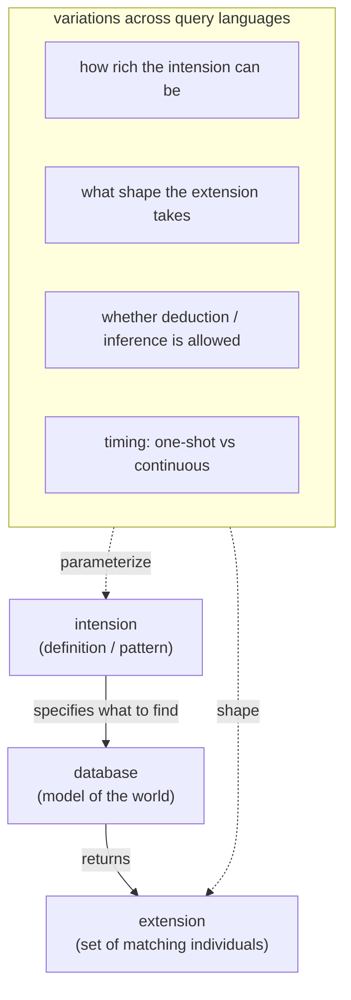
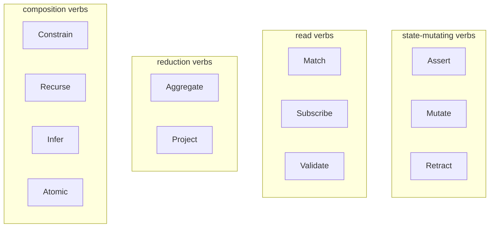
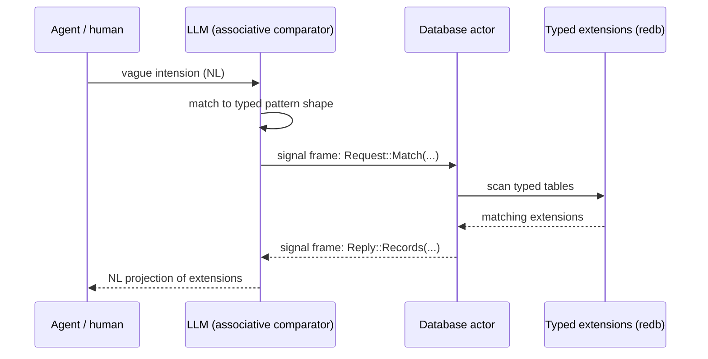

# What database languages are really for

Status: deep research synthesis
Author: Claude (designer)

The user asked me to step back from the per-language comparison
in report 24 and find the pattern behind what all these
database-language features are really doing. To research deeply,
including reading from the workspace's reference library at
`/home/li/Criopolis/library/` (per
`Criopolis/library/CLAUDE.md`).

What I read for this report:
- **Sowa, John F. (1984).** *Conceptual Structures: Information
  Processing in Mind and Machine.* Chapters 1–2 in detail
  (philosophical basis, psychological evidence). The chapter on
  database semantics (6.4–6.5) by reference. Sowa is the IBM
  knowledge-representation tradition's canonical synthesis;
  combines Aristotle, Peirce, Wittgenstein, modern AI.
- **Spivak, David I. (2014).** *Category Theory for the
  Sciences.* Introduction; chapter outlines for §2.3 (Ologs),
  §4.5 (Databases: schemas and instances), §5.4 (Categories
  and schemas are equivalent: **Cat ≃ Sch**).
- Reference texts I scanned but didn't read end-to-end:
  Aristotle's *Categories*, Frege's *On Sense and Reference*,
  Wittgenstein's *Philosophical Investigations*, Quine's *Two
  Dogmas of Empiricism*, Tarski's *Semantic Conception of
  Truth*. Their core ideas appear in Sowa as positions
  (extensionality, family resemblance, meaning postulates,
  semantic markers, T-schema) and I cite them via Sowa's
  framing.
- Training-data knowledge of: Codd's relational algebra (1970),
  description logics (ALC, SHOIN, SROIQ), OWL, Datalog
  semantics (least fixed point of Horn clauses), GraphQL
  subscriptions, Datomic, MongoDB.

A skill describing the library tooling and where the books live
will follow this report (per the user's instruction).

---

## 0 · TL;DR



**Every database query language solves one underlying problem:
specify an *intension*; receive the matching *extension*.**

The variations across SQL, Datalog, Cypher, SPARQL, GraphQL,
MongoDB, regex, and natural language are **dimensions** of how
the intension is expressed and how the extension is shaped:
- How rich is the pattern language? (Boolean predicate;
  recursive Horn clauses; description-logic axioms; first-order
  formulas; embedding-space distance.)
- What shape is the answer? (Full records; projected fields;
  aggregate scalar; derived structure.)
- Is inference allowed? (Just stored facts; deductive closure;
  plausible inference; statistical approximation.)
- What's the timing? (One-shot; continuous subscription;
  change-feed; time-travel.)

In a strictly-typed Sema-style world, these dimensions collapse
into a small **closed enum of query verbs**, each parameterized
by a typed record. The wire form is bounded — every query has a
fixed structural shape. The schema does the heavy lifting; the
parser stays small.

The 12 primitives this report names (Assert, Mutate, Retract,
Match, Subscribe, Validate, Aggregate, Project, Constrain,
Recurse, Infer, Atomic) cover the expressiveness of every
surveyed query language. Each is a typed record. The whole
"complex features" surface of database languages becomes
**closed structural composition** rather than open syntactic
construction.

The LLM angle: LLMs serve as Sowa's *associative comparator*,
the bridge from vague natural-language intent to precise typed
intensions. The database, given a strictly-typed world, can
then execute the typed query exactly. The LLM is not a
database; it's the lossy translator that makes the database
addressable in human language.

---

## 1 · The deep pattern

Sowa, opening *Conceptual Structures* with Aristotle's *"All
men by nature desire to know"*, lays out the meaning triangle
that comes from Ogden & Richards (1923) reading Aristotle's
*On Interpretation*:

```
              CONCEPT
            (intension)
             /      \
   symbolizes        refers to
           /          \
       SYMBOL --- stands for --- REFERENT
                                (extension)
```

A symbol (word, identifier, query expression) symbolizes a
concept (intension, definition, pattern), which refers to a
referent (extension, set of matching individuals). Database
queries are exactly this triangle in motion:
- **The query text** is a symbol.
- **The pattern it expresses** is the intension.
- **The result the database returns** is the extension.

A database, per Abrial (1974, quoted in Sowa §1.1), *"is a
model of an evolving physical world. The state of this model,
at a given instant, represents the knowledge it has acquired
from this world."* Knowledge is the model; the model holds
extensions; the query expresses the intension that picks out
the requested extensions.

This frame unifies every database language:
- **Regex over strings.** The string domain is "all sequences
  of bytes." A regex is an intension. The matching strings are
  the extension.
- **Glob over filenames.** Same shape.
- **SQL over rows.** The row domain is "all tuples in a
  relation." A `WHERE` clause is an intension.
- **Datalog over facts.** The fact domain is "all derived
  instances." A rule body is an intension that produces a head.
- **Cypher over graphs.** The graph domain is "all paths in a
  property graph." A `MATCH` clause is an intension.
- **SPARQL over triples.** Triple domain. Pattern = intension.
- **GraphQL over object trees.** Object domain. Selection set
  = intension shape that is also the extension shape.
- **MongoDB over documents.** Document domain. Object pattern
  = intension.
- **Natural language to a person.** Idea domain. Sentence =
  intension; the listener's understood meaning is the
  extension.
- **LLM prompt.** Latent-space domain. Prompt = intension; the
  generation is approximated extension.

The variations are not different *kinds* of activity. They are
the same activity (intension-to-extension) over different
**domain shapes** with different **expressive vocabularies for
intensions** and different **shapes of extension answers**.

---

## 2 · Sowa's frame: why intensions matter

Sowa is precise about what intensions and extensions are, drawing
on Tulving (1972), Carnap (1956), Quine (1960), and Aristotle
himself:

**Episodic vs semantic memory** (Tulving):
- Episodic memory: particular facts. *"Morris is an orange
  tomcat."* *"Charlie lost his wallet on the train."*
- Semantic memory: universal principles. *"All cats are
  animals."* *"Wallets are designed for carrying money."*

This maps to:
- Episodic = the database's stored extensions (the rows).
- Semantic = the schema, the meaning postulates, the deduction
  rules.

**The intension/extension distinction** (Carnap, after Frege):
- *Intension* of "mammal" = "warm-blooded animal vertebrate
  having hair and secreting milk for nourishing its young."
- *Extension* of "mammal" = the set of all mammals in the
  world.

Two terms with the same intension necessarily have the same
extension (`grandfather` ≡ `father of parent`). Two terms with
the same extension may have different intensions (`featherless
biped` and `animal with speech` happen to coincide on humans
but are defined differently).

**Analytic vs synthetic statements:**
- Analytic: truth follows from intensions. *"All dogs are
  animals."* No observation can falsify; it's a definitional
  truth.
- Synthetic: verified by observing extensions. *"Bette Davis
  starred in 'Gone with the Wind'."* (False, by the way; the
  example deliberately illustrates falsifiability.)

Sowa applies this to databases (citing Mealy 1967): *"Files of
data that describe things in the real world represent
extensions, and constraints in data dictionaries are meaning
postulates that define intensions. The statement 'Every
employee has a serial number' is analytic if it follows from
constraints in the data dictionary."*

This is exactly the strictly-typed-database vision the user
laid out. The schema is the meaning postulate. The closed enum
of types is the intensional ontology. The stored data is the
extensional fact. Queries are intensions; results are
extensions.

**The three definitional regimes** (§1.5 Primitives and
Prototypes):
- *Classical* (Aristotle): genus + differentiae + necessary and
  sufficient conditions. `Man = Rational + Animal`.
- *Probabilistic* (Mill, after Whewell): preponderance of
  features. *"Whatever resembles the genus Rose more than it
  resembles any other genus, does so because it possesses a
  greater number of the characters of that genus."*
- *Prototype* (Wittgenstein, family resemblance): defined by
  exemplars. *GAME* has no necessary common property; baseball
  is a game because it resembles other things called games.

Sowa argues for a hybrid: type hierarchies via classical
genus/differentia (where definable) + prototypes/schemata
(where not). Modern databases need both: the strict closed
enum (Aristotelian) for what's definable, and the probabilistic
or LLM-mediated approximation (prototype) for what isn't.

**The fundamental cognitive engine** (§2.2 Mechanisms of
Perception):
Perception, says Sowa, has two independent mechanisms:
- *Associative comparator*: associative retrieval, top-down
  match, stimulus constancy, distributed storage. The brain
  hashes percepts to memory.
- *Assembler*: combines percepts into wholes; reconstructs
  unfamiliar forms from parts.

These two — associative comparator and assembler — are the
foundations of what queries do, what databases optimize, and
what LLMs approximate. (The user's intuition that an LLM is "a
more advanced database engine" lands here. More on this in §6.)

---

## 3 · Spivak's frame: schemas are categories

Sowa gives the philosophical and cognitive grounding. Spivak
(*Category Theory for the Sciences*, 2014) gives the
mathematical structure.

The central result, proved in §5.4: **the category of categories
and the category of database schemas are equivalent — `Cat ≃ Sch`.**
A category is a database schema; a database schema is a
category.

Spivak's *olog* (ontology log) is the practical surface:
- **Boxes are types** (concepts in Sowa's terms; classes in
  ontology terms).
- **Arrows are typed functions** between them — single-valued
  relationships.
- **Diagrams commute** — composing arrows along different paths
  yields the same target.

```
[a person] --has as parent--> [a person]
[a person] --has as residence--> [a location]
[a location] --is in--> [a country]
```

This is *exactly* what a relational schema with foreign keys
represents. Spivak proves the equivalence formally: every
database schema (with relations, foreign keys, constraints)
corresponds to a category, and every category gives rise to a
schema.

Why this matters for the deep pattern:
- A query is then a **functor** — a structure-preserving map
  from the query schema (the pattern's category) to the data
  schema (the world's category).
- An aggregation is a **colimit** — a universal way of
  combining data along the schema's structure.
- A join is a **fiber product** (pullback in `Set`).
- A projection is a **functor** restricting the schema to a
  smaller diagram.
- Subscription is a **dynamic functor** — the same functor
  applied as data changes.

The categorical view makes the "complex features" of database
languages collapse into a small set of universal categorical
constructions: **products, coproducts, limits, colimits, pullbacks,
pushouts, functors, natural transformations**. SQL's joins,
SPARQL's basic graph patterns, GraphQL's nested selection
sets, Datalog's recursive rules — all expressible as
combinations of these.

Spivak's payoff is that "complex" is a category mistake. The
features look complex because the surface syntax is per-
language. Underneath, they're variations on a small set of
categorical operations.

This frame doesn't replace Sowa's — it complements it. Sowa
gives the meaning-of-meaning; Spivak gives the structure-of-
structure. Both point at the same conclusion: the **complexity
budget** for query languages should be small, and the
expressiveness comes from composing a closed set of operations
over a typed schema.

---

## 4 · Where the per-language complexity comes from

If the deep pattern is so simple, why are the languages so
varied?

The complexity is inherited from **what each language commits
to about the world's shape**:

| Language | World shape | Expressive intension | Extension shape |
|---|---|---|---|
| Regex | All strings | Finite-state pattern | Substring matches |
| SQL | Tuples in tables | Boolean predicate; joins | Projected rows |
| Datalog | Horn-clause facts | Recursive rule body | Set of derived facts |
| Cypher | Property graph | Path pattern with predicates | Projected node/relationship attributes |
| SPARQL | RDF triples | Basic graph patterns | Variable bindings |
| GraphQL | Typed object tree | Field selection | Mirrored tree of selected fields |
| MongoDB | JSON documents | Object pattern with `$`-operators | Projected documents |
| Description logic | Concepts + roles | Subsumption / ABox queries | Inferred individuals |
| OWL | DL + RDF | DL queries / SPARQL | Inferred triples |
| LLM prompt | Latent semantic space | Natural language | Approximated text |

Each language is a **commitment to a domain shape and a
matching intension vocabulary**. SQL committed to relations
because Codd showed in 1970 that relations are an algebraically
clean, finite-arity, set-theoretic foundation. Cypher committed
to graphs because Neo4j wanted to make path queries first-
class. MongoDB committed to documents because JSON was
already on the wire. Each language's *power* comes from
matching its domain shape's natural vocabulary; each language's
*friction* comes from the awkwardness of expressing things
outside its committed shape.

The complexity is real, but it's local. **No single language
is fundamentally complex; each is approximately right for its
domain, and each is approximately wrong for other domains.**

This is the source of the ecosystem's chaos: every project that
wants a different domain shape invents (or borrows) a different
language. This recurs because the underlying problem
(intension-to-extension over a typed world) is universal but the
domain commitments are not.

---

## 5 · The strictly-typed world

Now apply Sowa's intension/extension distinction to the user's
Sema-style vision: a world with **no strings as universal
containers**, with everything in a **closed taxonomy** of typed
kinds.

In this world:
- A "coat hanger" is not a string. It's `Hanger ∈
  HouseholdObject ∈ ManufacturedObject ∈ MetalObject ∈
  PhysicalObject` — a concept in a type hierarchy with explicit
  membership relations.
- The intension `MetalObject ∩ HouseholdObject` is a typed
  pattern: *"any object whose category lattice includes both
  these classes."*
- The extension is the set of stored individuals matching this
  intension.
- The query is a typed message: *"return all individuals whose
  category set contains both `MetalObject` and `HouseholdObject`."*

In a fully-typed world, **the domain shape is the type
lattice**. The natural query vocabulary is **set operations
over the typed kinds**:
- Intersection: `MetalObject ∩ HouseholdObject` — inhabits both.
- Union: `MetalObject ∪ WoodenObject` — inhabits either.
- Difference: `HouseholdObject - Decorative` — household but
  not decorative.
- Subsumption: `MetalObject ⊑ PhysicalObject` — every metal
  object is a physical object.
- Membership: `myKnife ∈ KitchenObject` — typed individual.

This is *description logic* without the awkwardness of OWL's
RDF-and-XML legacy. The set-algebraic operations on typed kinds
ARE the natural query vocabulary for a typed world.

Combined with positional records (à la nexus), each query is a
**typed message** specifying the set-algebraic intension and
the desired extension shape.

---

## 6 · LLM as the associative comparator

Sowa's *associative comparator* (§2.2) names the cognitive
mechanism that finds patterns in memory matching incoming
percepts. Its requirements:
- Associative retrieval (not address-based).
- Top-down match (overall pattern before details).
- Stimulus constancy (same object recognized at different
  scales).
- Distributed storage (no single point of failure).

These requirements describe both:
- A holographic memory (Lashley's hypothesis).
- A transformer-based language model (attention is associative
  retrieval; layers do top-down match; training distributes
  knowledge).

The user's framing — *"the LLM is really a more advanced
database engine"* — gets Sowa's framework right. **The LLM is
the associative comparator; the database is the assembler.**
Together, they form the perception-and-reasoning loop:
1. Human emits a vague intension in natural language.
2. LLM (associative comparator) matches the natural-language
   intension to typed-pattern intensions in the schema's space.
3. LLM produces a precise typed Query record.
4. Database (assembler) executes the typed query against
   stored extensions.
5. Database returns typed extensions.
6. LLM (associative comparator again) projects the typed
   extensions back to natural-language for the human.

This loop is exactly what's emerging in retrieval-augmented
generation, agentic database access, and natural-language SQL
systems. Sowa anticipated the architecture in 1984; modern AI
fills in the implementation.

In the strictly-typed Sema world, the loop becomes precise:
- The LLM's job is bounded: translate to a typed query
  intension. It cannot fabricate types because the schema is
  closed; if the LLM produces a non-existent kind, the
  validator rejects.
- The database's job is exact: typed pattern-match against
  typed extensions. No string fuzziness; no SQL injection; no
  ambiguous joins.
- The natural-language layer is *only* a frontend translator;
  the canonical form on the wire is rkyv-archived typed
  records.

The user's intuition that *"most of the time, or all the time,
the LLM will be right and the data will be there"* matches
Sowa's bidirectional reasoning: *"top-down reasoning is a
goal-directed process [...]; bottom-up reasoning is a data-
directed [...] process. The two approaches may be combined in
bidirectional reasoning."* The LLM's pattern-match is goal-
directed; the database's lookup is data-directed; the
combination is more powerful than either alone.

---

## 7 · The closed enum of query verbs

If every query is intension-to-extension, and the variations
are closed dimensions, then the complete query vocabulary is a
small closed enum. After surveying the languages of report 24
plus Sowa's and Spivak's frames, here is the full set:



### State-mutating verbs

| Verb | Intension shape | Extension change |
|---|---|---|
| **Assert** | A typed individual (concept + filled fields) | Add to extension; database assigns identity |
| **Mutate** | An identity + a new typed individual | Replace at identity; preserves slot |
| **Retract** | An identity | Remove from extension |

These three are Sowa's "edit" operations — they change what's
in the model. The intension says *what* should be there; the
database changes *what is* there.

### Read verbs

| Verb | Intension shape | Extension shape |
|---|---|---|
| **Match** | A pattern record (concept + binds + literals + wildcards) | Set of matching individuals |
| **Subscribe** | A pattern record + delivery mode | Stream: initial set + deltas |
| **Validate** | An intended state-mutating verb | Would-be outcome, no commit |

These three are pure-read. Match is one-shot; Subscribe is
continuous; Validate is dry-run.

### Reduction verbs

| Verb | Intension shape | Extension shape |
|---|---|---|
| **Aggregate** | A pattern + a closed-enum reduction (Count, Sum, Min, Max, Avg, First, GroupBy) | Single value or grouped values |
| **Project** | A pattern + a field-selector record | Sub-record of matching individuals |

These compose with Match/Subscribe. They reduce the extension
shape. SQL's `SELECT count(*)` is `Match + Aggregate(Count)`.
SQL's `SELECT name FROM users WHERE ...` is `Match + Project([Name])`.

### Composition verbs

| Verb | Intension shape | Extension shape |
|---|---|---|
| **Constrain** | A list of patterns + bind-unification rules | Cartesian product filtered by unification |
| **Recurse** | A base pattern + a recursive rule + termination | Fixpoint extension |
| **Infer** | A pattern + a rule set (Horn clauses or DL axioms) | Deductively closed extension |
| **Atomic** | A list of state-mutating verbs | All-or-nothing commit |

These are the advanced operations. Constrain is multi-pattern
join with bind unification (Datalog's killer feature). Recurse
is transitive closure / least fixpoint. Infer is description-
logic-style derivation. Atomic is transaction.

### Coverage check

Every feature surveyed in report 24 maps to a primitive +
parameter records:

| Feature | Verb composition |
|---|---|
| SQL `SELECT cols FROM table WHERE pred` | `Project(Match(table, pred), cols)` |
| SQL `SELECT count(*) FROM table WHERE pred` | `Aggregate(Match(table, pred), Count)` |
| SQL `SELECT a.x, b.y FROM a JOIN b ON ...` | `Project(Constrain([a-pat, b-pat], unify), [x, y])` |
| Datalog `:find ?x :where [?x :name ?n] [?x :age ?a]` | `Constrain([name-pat, age-pat], unify-on-x)` |
| Datalog recursive ancestor query | `Recurse(parent-pat, ancestor-rule, fixpoint-termination)` |
| Cypher `MATCH (a)-[:KNOWS]->(b) RETURN b.name` | `Project(Constrain([a-pat, edge-pat, b-pat], unify), [name])` |
| GraphQL nested selection | `Project(Match(...), nested-fields)` (recursive Project) |
| GraphQL `subscription { ... }` | `Subscribe(pat, mode)` |
| MongoDB `find({ age: { $gt: 21 } })` | `Match(user, age-gt-21)` (via predicate record `(GreaterThan @age 21)`) |
| OWL ABox query | `Infer(pat, ontology-axioms)` |
| Regex `^a.*b$` | `Match(string, regex-pat)` (regex IS a pattern record) |
| Cypher `LIMIT 10 OFFSET 20` | `Project(Match(...), pagination-cardinality)` |

12 verbs cover the surveyed surface. The complexity moves from
syntactic open-endedness (per-language operators and clauses)
to **composition of typed records** drawn from a closed enum.

---

## 8 · Each verb as a typed message — the structural shape

Here is the full closed Request enum, in nexus's structural-
minimum form (Tier 1 from report 23):

```rust
pub enum Request {
    // State-mutating
    Assert(AssertOperation),
    Mutate(MutateOperation),
    Retract(RetractOperation),

    // Read
    Match(MatchQuery),
    Subscribe(SubscribeQuery),
    Validate(ValidateRequest),

    // Reduction
    Aggregate(AggregateQuery),
    Project(ProjectQuery),

    // Composition
    Constrain(ConstrainQuery),
    Recurse(RecurseQuery),
    Infer(InferQuery),
    Atomic(AtomicBatch),
}
```

Each variant carries a typed payload with **bounded structural
shape**. Sample shapes (Rust pseudocode):

```rust
pub struct AssertOperation {
    pub kind: KindName,           // closed enum of domain kinds
    pub fields: TypedFields,      // positional, type-locked by kind
}

pub struct MatchQuery {
    pub pattern: PatternRecord,   // (Kind @bind1 _ literal …)
    pub bindings: BindingScope,   // closed-enum scope rules
}

pub struct AggregateQuery {
    pub pattern: PatternRecord,
    pub reduction: Reduction,
}

pub enum Reduction {
    Count,
    Sum(NumericFieldName),
    Max(OrderedFieldName),
    Min(OrderedFieldName),
    Avg(NumericFieldName),
    First(SortedFieldName),
    GroupBy(GroupingFieldName, Box<Reduction>),
}

pub struct ProjectQuery {
    pub pattern: PatternRecord,
    pub selector: FieldSelector,
    pub cardinality: Cardinality,  // All | Limit(u64) | Range(u64, u64)
}

pub enum FieldSelector {
    All,
    Fields(Vec<FieldName>),
    Nested(Vec<(FieldName, FieldSelector)>),  // for tree-shaped projection
}

pub struct ConstrainQuery {
    pub patterns: Vec<PatternRecord>,
    pub unification: UnificationRules,  // which bind names cross-unify
}

pub struct RecurseQuery {
    pub base: PatternRecord,
    pub recursive: PatternRecord,
    pub termination: Termination,  // Fixpoint | DepthLimit(u32) | Predicate(...)
}

pub struct InferQuery {
    pub pattern: PatternRecord,
    pub ruleset: RulesetReference,  // closed enum of registered rule sets
}

pub struct SubscribeQuery {
    pub pattern: PatternRecord,
    pub initial: InitialMode,        // ImmediateExtension | DeltasOnly
    pub buffering: BufferingMode,    // Drop | Block | Coalesce
}

pub struct AtomicBatch {
    pub operations: Vec<BatchOperation>,
}

pub enum BatchOperation {
    Assert(AssertOperation),
    Mutate(MutateOperation),
    Retract(RetractOperation),
}
```

Every record has a fixed field count (per its struct
definition); every enum has a closed variant set; every
PatternRecord has the schema-defined arity of its kind. The
size of any query is bounded by the schema's choices.

This is the answer to the user's question *"how would these
all be expressed as a typed message, as a data type that has
a reliable size and number of fields in a struct and a limited
number of enums and whatever fields and booleans and vectors
and so on?"* — **the entire query language collapses into ~12
typed Request variants and ~30 helper records**, all closed-
enum dispatched, all rkyv-encodable with bytecheck, all
positional in the nexus form.

The Request enum is the wire vocabulary. Adding a new query
shape (e.g., temporal queries) is a new variant in this enum,
not a new operator in a parser. The parser stays small.

---

## 9 · Database as actor — the message reframe

Step back from the verb list and consider the architectural
shape:



The database is an actor. Queries are typed messages. Replies
are typed messages. The wire form is rkyv. Subscriptions are
long-lived bidirectional message channels. There is no
"database protocol" separate from the actor message protocol;
the database's protocol IS the typed Request/Reply enum.

This is consistent with:
- ESSENCE.md §"Polling is forbidden" — subscriptions push;
  consumers don't poll.
- ESSENCE.md §"Behavior lives on types" — verbs belong to
  nouns; the database actor owns its state and the methods
  that touch it.
- The signal pattern (rkyv-on-wire) — typed, length-prefixed,
  schema-validated.

The radical reframe: **a database is not a program; it's a
participant in a typed conversation.** Every "query language"
is just a vocabulary for the conversation. The vocabulary that
fits a typed world is small (12 verbs) and structural (closed
enum + typed records).

---

## 10 · The vision, made concrete

In the user's words:

> *"In an ideal, fully constructed computer world, how would
> the computer ask for certain kinds of information, of data?
> Like it would say, of all the metal objects that are also
> household objects, right? It's going by category. It's a
> request, right? It's a targeted request."*

In the structural form:

```nexus
;; Ask for all individuals whose kind set contains both
;; MetalObject and HouseholdObject.
(Match (KindIntersection [MetalObject HouseholdObject]) Any)
```

That's it. One typed Request::Match record. The pattern is a
`KindIntersection` (a closed-enum variant of pattern record);
the cardinality is `Any` (no limit). The database scans its
typed extensions and returns matching individuals.

If the human asked in natural language *"what are all my metal
household objects?"*, an LLM would:
1. Parse the NL into a typed Request::Match record.
2. Submit it to the database.
3. Receive Reply::Records.
4. Project to NL for the human.

```nexus
;; The LLM-mediated path:
;; NL: "what are all my metal household objects?"
;; LLM produces:
(Match
  (Constrain
    [(KindIntersection [MetalObject HouseholdObject])
     (Owner @owner)
     (OwnerIs me)]
    {@owner unifies})
  Any)
;; Database returns:
;; [(Hanger slot-742) (Spoon slot-911) (Fork slot-912) ...]
;; LLM renders to NL:
;; "you have 3 hangers, 2 spoons, 1 fork, 4 knives, ..."
```

The clever lispy structural form is what makes this readable
from the LLM's side and parseable from the database's side.
There is no separate "natural language" layer that the database
runs; the database speaks the typed dialect. The LLM is the
translator.

Aggregate, project, subscribe, infer all compose:

```nexus
;; Count of metal household objects:
(Aggregate
  (KindIntersection [MetalObject HouseholdObject])
  Count)

;; Just the names of all metal household objects:
(Project
  (KindIntersection [MetalObject HouseholdObject])
  (Fields [name])
  All)

;; Notify me whenever a new metal household object is asserted:
(Subscribe
  (KindIntersection [MetalObject HouseholdObject])
  ImmediateExtension
  Block)

;; All things that are descendants of "PhysicalObject" via
;; the SubclassOf relation (recursive ontology query):
(Recurse
  (KindIs PhysicalObject)
  (SubclassOf @child @parent)
  Fixpoint)

;; What individuals are mammals, given the current ontology
;; rules (DL inference)?
(Infer
  (KindIs Mammal)
  StandardOntologyRules)
```

Every database-language feature this report has surveyed maps
into one of these primitive verbs + parameter records. Nothing
has been left out; nothing has been over-specified.

---

## 11 · Implications for nexus

Connecting back to the prior reports:

| Report | Decision | This report's bearing |
|---|---|---|
| 22 (state) | Drop `{ }` Shape and `{\| \|}` Constrain from spec | Confirmed for syntax; **but the *capability* of Project (was `{ }`) and Constrain (was `{\| \|}`) is real and belongs in the Request enum as record-kinds** |
| 22 | Predicate operators deferred; predicates as schema records | Confirmed; predicates compose as nested records inside patterns |
| 23 (structural minimum) | 3 delimiter pairs, sigil-free verbs | Confirmed; the verbs become record kinds (`Project`, `Aggregate`, etc.) |
| 24 (per-language survey) | Multi-pattern conjunction is a real gap | Confirmed; lands as `Constrain` record |

Concrete recommendations for nexus's spec going forward:
1. **Land all 12 verbs** as Request enum variants. The first 7
   (Assert/Mutate/Retract/Match/Subscribe/Validate/Atomic) are
   in flight per reports 22 and 23. Add Aggregate, Project,
   Constrain, Recurse, Infer.
2. **Aggregate's reduction is a closed enum** of statistical
   operations. Don't spec arbitrary user-defined aggregations
   yet; that's an LLM-or-host-language concern.
3. **Project's selector is a structural record**, not a syntax.
   It can be flat (`Fields [a b c]`) or nested (`Nested [(a Inner) (b Inner)]`)
   for tree-shaped projection à la GraphQL.
4. **Constrain's unification rules are a typed record**: which
   bind names cross-unify between which patterns. This makes
   Datalog-style joins first-class.
5. **Recurse and Infer can be M2+** — they're the most expressive
   and least urgently needed.
6. **Subscribe's initial mode** must default to
   `ImmediateExtension` (per push-not-pull reconciliation in
   report 22 §5).

These recommendations are nexus's path from "barebones M0
protocol" to "full database query language" without changing
the parser. The whole expressiveness comes from the Request
enum's variants and their parameter records.

---

## 12 · Where nexus is genuinely doing something new

After this depth of research, the parts of nexus that I
believe are genuinely novel (vs. assembled-from-priors) are:

1. **Closed-enum verb dispatch with no parser involvement.**
   Every other surveyed language commits new keywords or
   operators when adding new verbs. Nexus adds a new variant
   to the Request enum; the parser doesn't change. This is
   what makes the *parser is small; new typed kinds are the
   central activity* discipline genuinely workable. Spivak's
   `Cat ≃ Sch` equivalence is *implicitly* this: schemas
   evolve by adding objects/morphisms (= types/variants), not
   by changing the categorical machinery. Nexus makes that
   explicit at the wire.
2. **Bind-name-must-equal-schema-field-name.** Eliminates the
   alias indirection that every other surveyed language pays.
   Sowa's perception model is consistent with this: percepts
   carry their identity by *position* in the schema, not by
   author-supplied names.
3. **Records-as-positional-typed-composites with the schema
   carrying types.** Every text peer keys fields by name;
   nexus's choice mirrors capnp/rkyv binary form, with the
   schema doing the heavy lifting. Spivak's olog boxes are
   types; nexus records are inhabitants of olog boxes.
4. **The mechanical-translation rule.** Every nexus text
   construct has exactly one typed signal form, and vice
   versa. This is Sowa's mapping-language-to-conceptual-graphs
   discipline made literal: text is a literal reading of the
   typed structure; the typed structure is the canonical form
   of meaning.

Everything else (subscriptions, asserts, joins, projections)
nexus is borrowing — and that's fine. The originality is in
the **structural commitment** that makes the borrowed parts
cohere.

---

## 13 · What's next

For this design space to close completely, three pieces of work
remain:

1. **Specify the closed Request enum at the spec level** in
   `nexus/spec/grammar.md` — adding Aggregate, Project,
   Constrain, Recurse, Infer alongside the existing seven.
   Each gets a typed parameter shape.
2. **Predicate-records design.** Sowa's *meaning postulates*
   are predicates; in our typed-record world they are records
   like `(Adult @age)`, `(GreaterThan @age 21)`, `(InRange @age
   18 65)`. A canonical set of basic predicates needs to land,
   plus the convention for extending them per-domain.
3. **Sema's typed-kind hierarchy.** The strictly-typed world
   the user described needs the actual taxonomy. This is
   ongoing work in the Criome ecosystem and isn't a Persona
   concern, but the contract crate (`signal-persona`) borrows
   from whatever sema settles on.

A possible follow-up report (if the user wants) is the
**predicate-record design**: enumerating the closed set of
basic predicates (comparison, range, set membership, regex-as-
pattern-record, etc.) and showing how they compose without ever
becoming syntactic operators in the parser.

---

## 14 · The library — where books are

Per the user's instruction: the workspace's research library is
at `/home/li/Criopolis/library/`. It is curated by author and
language (`en/`, `fr/`, `de/`, `el/`, `la/`, `sa/`). Binary
files (PDF, EPUB, DJVU) are gitignored locally; each book is
indexed by its Anna's Archive MD5 hash in
`Criopolis/library/bibliography.md`.

The CLI tool is **`annas`**, a Go binary built in this
workspace's nix store and not currently on PATH. To use:

```sh
# Find the binary (nix store path varies between rebuilds):
find /nix/store -maxdepth 2 -name annas -type f 2>/dev/null

# Or with environment configured:
export ANNAS_SECRET_KEY=<api-key-from-annas-archive-donation>
export ANNAS_DOWNLOAD_PATH=/home/li/Criopolis/library/<lang>/<author>/

# Search:
annas book-search "category theory for sciences"

# Download by MD5:
annas book-download <md5-hash> "filename.pdf"
```

A workspace skill `~/primary/skills/library.md` will be created
to document this in the canonical place (per ESSENCE §"Rules
find their level" — workspace tooling lives in workspace
skills).

For this report's research, I read directly from the existing
local copies in `Criopolis/library/en/john-sowa/` (Sowa) and
`Criopolis/library/en/david-spivak/` (Spivak). I scanned indices
for Aristotle, Frege, Quine, Wittgenstein, Tarski.

---

## 15 · See also

- **Sowa, J. F. (1984).** *Conceptual Structures: Information
  Processing in Mind and Machine.* Addison-Wesley.
  Chapter 1 (Philosophical Basis), Chapter 2 (Psychological
  Evidence), Chapter 6 (§6.4 Database Semantics, §6.5 Database
  Inference). Local:
  `~/Criopolis/library/en/john-sowa/conceptual-structures.pdf`
- **Spivak, D. I. (2014).** *Category Theory for the Sciences.*
  MIT Press. Especially §2.3 Ologs, §4.5 Databases: schemas
  and instances, §5.4 `Cat ≃ Sch`. Local:
  `~/Criopolis/library/en/david-spivak/category-theory-for-sciences.pdf`
- **Aristotle, *Categories*.** The original ten categories.
  Local: `~/Criopolis/library/en/aristotle/categories-edghill-gutenberg.epub`
- **Frege, G. (1892).** *On Sense and Reference.* Sense vs
  reference; the foundational distinction Sowa builds on.
  Local: `~/Criopolis/library/en/gottlob-frege/on-sense-and-reference-blackwell.pdf`
- **Wittgenstein, L. (1953).** *Philosophical Investigations.*
  Family resemblance; rejection of essentialist definitions.
  Local: `~/Criopolis/library/en/wittgenstein/philosophical-investigations.epub`
- **Quine, W. V. O. (1951).** *Two Dogmas of Empiricism.*
  Critique of analytic/synthetic distinction; ontological
  commitment.
  Local: `~/Criopolis/library/en/w-v-o-quine/two-dogmas-empiricism.pdf`
- **Tarski, A.** *Semantic Conception of Truth.* T-schema;
  model-theoretic semantics.
  Local: `~/Criopolis/library/en/alfred-tarski/semantic-conception-truth-foundations-semantics.pdf`
- **Codd, E. F. (1970).** *A Relational Model of Data for
  Large Shared Data Banks.* (Reference; the relational
  algebra origin.)
- **Guarino, N. (ed., 1998).** *Formal Ontology in Information
  Systems.* (Reference; ontology engineering.)
  Local: `~/Criopolis/library/en/nicola-guarino/handbook-on-ontologies.pdf`

Internal:
- `~/primary/reports/designer/22-nexus-state-of-the-language.md`
  — operational state and gaps.
- `~/primary/reports/designer/23-nexus-structural-minimum.md`
  — structural minimum form.
- `~/primary/reports/designer/24-nexus-among-database-languages.md`
  — per-language comparison this report synthesizes.
- `~/primary/reports/designer/21-persona-on-nexus.md` —
  Persona's adoption; the verbs in this report are what
  Persona's contract crate carries.
- `~/primary/skills/contract-repo.md` — the workspace pattern
  for shared rkyv contract crates.
- `~/primary/ESSENCE.md` §"Polling is forbidden", §"Behavior
  lives on types", §"Rules find their level".

---

*End report.*
