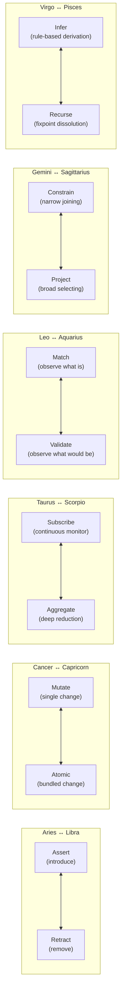
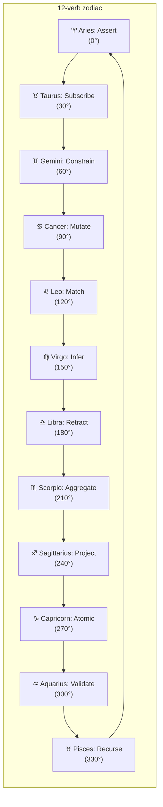
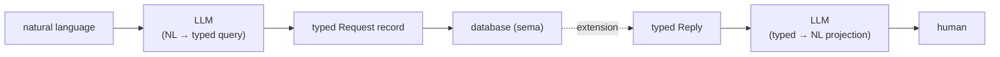
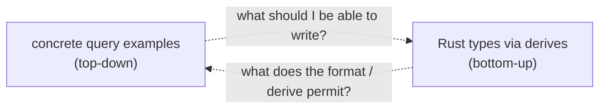

# Twelve verbs as zodiac, the example query unpacked, sema as LLM-bearing database

Status: synthesis + applied design
Author: Claude (designer)

The user's message threaded several pieces together, all of
which want a single home:

1. The example query I wrote in report 25 used `{@owner
   unifies}` — a curly-brace form I'd recommended dropping.
   Let's clean it up and break it down part-by-part with the
   Rust types that would read it.
2. The 12 verbs (Assert, Mutate, Retract, Match, Subscribe,
   Validate, Aggregate, Project, Constrain, Recurse, Infer,
   Atomic) want a mapping onto the zodiac per Arthur Young's
   geometry of meaning.
3. SEMA — the user's pivot — is becoming more than the
   criome database; it's the typed-database substrate the
   designer-side work has been sketching. And it will have an
   LLM in it: not merely as a NL frontend, but as a
   query-recovery and type-expansion engine inside the engine.

Reading from the workspace library
(`~/Criopolis/library/`):
- **Young, A. M. (1976).** *The Geometry of Meaning.*
  Delacorte Press. Chapter I (Fourfold Division), Chapter II
  (Measure Formulae — *the cycle of action*, *use of the
  measure formulae*, *the learning cycle*), Chapter IV
  (Generating Other Measure Formulae — the 12 measures from
  M, L, T as 30°/90°/120° rotations on the cycle).
  Local: `~/Criopolis/library/en/arthur-young/geometry-of-meaning.pdf`

The bibliography note (`~/Criopolis/library/bibliography.md`)
crystallises Young's contribution: *"The T operator (division
by time), T⁴=1, 12 measure formulae mapped to signs."* That's
the bridge.

---

## 0 · TL;DR

**Bind sigil correction.** The `@` is the bind sigil — at sign,
specifically named "the bind marker" in nexus's pattern
positions. It is the ONE sigil that survives the structural
minimum (per report 23 Tier 1).

**Curly-brace cleanup.** Report 25's `{@owner unifies}` was a
slip; it should be a typed `(Unify [owner])` record. The
example fully cleaned:

```
(Match
  (Constrain
    [(HasKind @id MetalObject)
     (HasKind @id HouseholdObject)
     (HasOwner @id Me)]
    (Unify [id]))
  Any)
```

**Zodiac mapping.** Young's three groups of four measure
formulae correspond to the three modalities × four elements of
the zodiac. The 12 database verbs map cleanly:

| Sign | Modality + Element | Verb | Why |
|---|---|---|---|
| Aries | Cardinal Fire | **Assert** | Initiating fire — the new individual born into the database |
| Taurus | Fixed Earth | **Subscribe** | Sustained-presence, persistence-in-the-stream |
| Gemini | Mutable Air | **Constrain** | The joining-of-multiples; air connects |
| Cancer | Cardinal Water | **Mutate** | Felt change of state; the moving emotion |
| Leo | Fixed Fire | **Match** | The proud finding-what-IS in its full radiance |
| Virgo | Mutable Earth | **Infer** | Methodical discrimination via rules |
| Libra | Cardinal Air | **Retract** | The opposite of Assert — the balancing removal |
| Scorpio | Fixed Water | **Aggregate** | Penetrating reduction to the essence |
| Sagittarius | Mutable Fire | **Project** | The arrow flying outward; selecting the trajectory |
| Capricorn | Cardinal Earth | **Atomic** | Structural commitment, the mountain-peak transaction |
| Aquarius | Fixed Air | **Validate** | Abstract gating — would-this-work without doing it |
| Pisces | Mutable Water | **Recurse** | The dissolving-into-fixpoint; pre-creation |

Oppositions (180°) are duals: Assert ↔ Retract; Mutate ↔
Atomic; Subscribe ↔ Aggregate; Match ↔ Validate; Constrain
↔ Project; Infer ↔ Recurse. Each pair sits across the
ecliptic; each verb is the inverse-flavour of its opposite.

**SEMA's LLM angle.** The LLM lives inside the database engine
as Sowa's *associative comparator* (per report 25 §6). Its
jobs: (a) when a `@bind` references a kind that doesn't exist,
search for a near-match in the type lattice; (b) when a query
hints at a missing taxonomy, escalate as a proposed enum
expansion; (c) translate vague NL intentions into typed query
records. **The LLM is not the query interface; it's the
query-resilience layer.** The wire is still rkyv, the
records still typed, the parser still small.

---

## 1 · Cleanup of report 25's example

The example as written in report 25:

```nexus
(Match
  (Constrain
    [(KindIntersection [MetalObject HouseholdObject])
     (Owner @owner)
     (OwnerIs me)]
    {@owner unifies})
  Any)
```

The mistake: `{@owner unifies}` uses the `{ }` shape delimiter
that report 23 dropped. The user caught this exactly — the
unification specification is data, not delimiter syntax. It
should be a typed record.

Re-cast as positional records (Tier 1 nexus):

```nexus
(Match
  (Constrain
    [(HasKind @id MetalObject)
     (HasKind @id HouseholdObject)
     (HasOwner @id Me)]
    (Unify [id]))
  Any)
```

Three changes:
1. **`KindIntersection` decomposed into separate `HasKind`
   patterns with shared bind.** Datalog-style: each pattern
   binds `@id`; constraining requires `@id` to unify across
   them; the result is the set of `@id` values that satisfy
   all three.
2. **`OwnerIs me` becomes `HasOwner @id Me`.** The pattern
   says: `id` has an owner record with the second field
   (the Principal) being literally `Me`. `Me` is a unit-
   variant kind in the Principal taxonomy denoting "the
   current user."
3. **`{@owner unifies}` becomes `(Unify [id])`.** Typed
   record `Unify` with one field, a sequence of bind names.
   No special delimiters — just the closed structural form.

This is what reports 22–25 were converging on, made literal in
the worked example.

---

## 2 · Part-by-part walk with Rust types

The wire is rkyv-archived signal frames; the text form is the
nexus dialect. The parser is `nota-codec`'s decoder; the
typed shape is signal-persona's record set. Walking the
example:

### `(Match ...)` — top-level Request

Decoder sees `(`, expects a `Request` variant. Reads head
identifier `Match`, dispatches to `Request::Match(MatchQuery)`.

```rust
#[derive(Archive, RkyvSerialize, RkyvDeserialize, NexusVerb, ...)]
pub enum Request {
    Assert(AssertOperation),
    Mutate(MutateOperation),
    Retract(RetractOperation),
    Match(MatchQuery),
    Subscribe(SubscribeQuery),
    Validate(ValidateRequest),
    Aggregate(AggregateQuery),
    Project(ProjectQuery),
    Constrain(ConstrainQuery),
    Recurse(RecurseQuery),
    Infer(InferQuery),
    Atomic(AtomicBatch),
}
```

The `NexusVerb` derive emits a decoder that consumes `(`, reads
a PascalCase head, dispatches to the matching variant.

### `MatchQuery` — pattern + cardinality

```rust
#[derive(Archive, RkyvSerialize, RkyvDeserialize, NotaRecord, ...)]
pub struct MatchQuery {
    pub pattern: Pattern,
    pub cardinality: Cardinality,
}
```

Two positional fields. Decoder reads field 0 (Pattern), field
1 (Cardinality), then expects `)`.

### `(Constrain ...)` — Pattern variant

Decoder sees `(`, expects a `Pattern` variant. Reads head
`Constrain`, dispatches to `Pattern::Constrain(ConstrainQuery)`.

```rust
#[derive(Archive, RkyvSerialize, RkyvDeserialize, NexusVerb, ...)]
pub enum Pattern {
    // Domain-specific record patterns:
    HasKind(HasKindPattern),
    HasOwner(HasOwnerPattern),

    // Structural patterns:
    Constrain(ConstrainQuery),
    Recurse(RecurseQuery),

    // Set-algebraic patterns over typed kinds:
    KindIntersection(KindIntersection),
    KindUnion(KindUnion),
    KindDifference(KindDifference),
}
```

Note: `Pattern` is a closed enum derivative of NexusVerb. New
patterns join by adding an enum variant; no parser change.

### `ConstrainQuery` — patterns sequence + unification

```rust
#[derive(Archive, RkyvSerialize, RkyvDeserialize, NotaRecord, ...)]
pub struct ConstrainQuery {
    pub patterns: Vec<Pattern>,
    pub unify: Unify,
}
```

Two positional fields. Field 0 is `Vec<Pattern>` — decoded by
expecting `[`, then reading Patterns until `]`. Field 1 is
`Unify` (a record).

### `[ ... ]` — Vec\<Pattern>

Decoder sees `[`, knows to read elements of type Pattern until
`]`. Each element is decoded as a fresh Pattern via the
NexusVerb dispatch above.

### `(HasKind @id MetalObject)` — first pattern element

Decoder dispatches Pattern::HasKind, decodes a HasKindPattern.

```rust
#[derive(Archive, RkyvSerialize, RkyvDeserialize, NexusPattern, ...)]
#[nota(queries = "HasKind")]
pub struct HasKindPattern {
    pub subject: PatternField<Slot<Object>>,
    pub kind: PatternField<KindName>,
}
```

`NexusPattern` derive emits a decoder that consumes `(|` —
wait, no. With Tier 1 we drop `(|` and use `(`. The decoder
emits the same shape as NotaRecord but each field is a
PatternField, not a raw value.

Actually hmm — Tier 1 from report 23 had us *keep* `(| |)` for
patterns. Let me reconsider. In the example, all patterns are
`( )` not `(| |)`:
- `(HasKind @id MetalObject)` — looks like a regular record but with `@id` in field position.

So either:
- (a) We're using report 23's Tier 0 (drop `(| |)` entirely; `@` and `_` make patterns recognisable);
- (b) The `(...)` in this example are records, not patterns — and the patterns interpretation comes from the receiving type (Pattern enum's HasKind variant).

I think (b) is right — the schema-driven decoder. The text `(HasKind @id MetalObject)` is *the same wire form* as a `HasKind` data record `(HasKind 100 MetalObject)`; the difference is the field type at the receiving Pattern enum's HasKind variant is `PatternField<...>` instead of the raw value type.

This means **the same `( )` delimiter serves both data and pattern**, and the schema chooses the interpretation. Tier 1's `(| |)` is the explicit-visual-cue option; Tier 0 drops it; **report 25 and this example are sliding toward Tier 0**.

Decision deferred until §7 below.

For the decode, assuming Tier 0 / schema-driven:

```rust
pub enum PatternField<T> {
    Wildcard,             // _
    Bind(BindName),       // @name
    Match(T),             // a concrete value of T
}

pub struct BindName(pub String);   // camelCase, schema-tied

impl<T: NotaDecode> NotaDecode for PatternField<T> {
    fn decode(d: &mut Decoder) -> Result<Self> {
        if d.peek_is_wildcard()? { ... return Wildcard; }
        if d.peek_is_at()? { 
            d.consume_at()?;
            let name = d.read_bind_name()?;
            return Bind(name); 
        }
        Match(T::decode(d)?)
    }
}
```

The decoder peeks: `_` → Wildcard; `@<name>` → Bind; otherwise
a concrete T value.

For `(HasKind @id MetalObject)`:
- field 0: `@id` → `PatternField::Bind(BindName("id"))`
- field 1: `MetalObject` → `PatternField::Match(KindName("MetalObject"))`

### `(Unify [id])` — Unify record

```rust
#[derive(Archive, RkyvSerialize, RkyvDeserialize, NotaRecord, ...)]
pub struct Unify {
    pub names: Vec<BindName>,
}
```

One positional field. Field 0: `Vec<BindName>`. Decoder reads
`[`, then bare camelCase identifiers as BindName values, until
`]`.

The wire `(Unify [id])`:
- field 0: `[id]` → `Vec<BindName>` with one element
- the bare ident `id` decodes as `BindName("id")` via
  bare-ident-as-string + transparent newtype.

### `Any` — Cardinality

Bare PascalCase identifier in Cardinality position. Cardinality is a NotaEnum:

```rust
#[derive(Archive, RkyvSerialize, RkyvDeserialize, NotaEnum, ...)]
pub enum Cardinality {
    Any,
    Limit(u64),       // (Limit 100)
    Range(u64, u64),  // (Range 50 100)
}
```

Bare `Any` → `Cardinality::Any`. The other variants would be
written as records: `(Limit 10)`, `(Range 0 100)`.

### Full decode result

```rust
let request = Request::Match(MatchQuery {
    pattern: Pattern::Constrain(ConstrainQuery {
        patterns: vec![
            Pattern::HasKind(HasKindPattern {
                subject: PatternField::Bind(BindName("id".into())),
                kind: PatternField::Match(KindName("MetalObject".into())),
            }),
            Pattern::HasKind(HasKindPattern {
                subject: PatternField::Bind(BindName("id".into())),
                kind: PatternField::Match(KindName("HouseholdObject".into())),
            }),
            Pattern::HasOwner(HasOwnerPattern {
                subject: PatternField::Bind(BindName("id".into())),
                principal: PatternField::Match(Principal::Me),
            }),
        ],
        unify: Unify {
            names: vec![BindName("id".into())],
        },
    }),
    cardinality: Cardinality::Any,
});
```

### Token-level walk

For the lexer, the byte stream is:

```
( M a t c h <ws> ( C o n s t r a i n <ws> [ ( H a s K i n d <ws> @ i d <ws> M e t a l O b j e c t ) <ws> ( H a s K i n d <ws> @ i d <ws> H o u s e h o l d O b j e c t ) <ws> ( H a s O w n e r <ws> @ i d <ws> M e ) ] <ws> ( U n i f y <ws> [ i d ] ) ) <ws> A n y )
```

The lexer emits, in order:

```
LParen, Ident("Match"),
  LParen, Ident("Constrain"),
    LBracket,
      LParen, Ident("HasKind"), At, Ident("id"), Ident("MetalObject"), RParen,
      LParen, Ident("HasKind"), At, Ident("id"), Ident("HouseholdObject"), RParen,
      LParen, Ident("HasOwner"), At, Ident("id"), Ident("Me"), RParen,
    RBracket,
    LParen, Ident("Unify"), LBracket, Ident("id"), RBracket, RParen,
  RParen,
  Ident("Any"),
RParen
```

8 token types in total: `LParen RParen LBracket RBracket At
Ident`. Plus literal types for non-ident values (Int, Float,
Bool, Str, Bytes) — none used in this example.

Total token vocabulary needed for the example: 6 (with At
being optional for non-pattern queries).

This is the *whole grammar* for this query. No keywords, no
operators, no special forms. The schema does the rest.

---

## 3 · Young's framework — the geometry of the cycle

Reading Young in detail (chapters I–IV, pp. 1–37). His
argument:

### The fourfold division

A whole situation divides into four aspects, paired across two
dichotomies (objective/projective × general/particular):

|  | General | Particular |
|---|---|---|
| **Objective** | Formal cause (definition, intrinsic structure) | Efficient cause (sense data; this particular thing) |
| **Projective** | Material cause (substance; what it's made of) | Final cause (function; purpose for the knower) |

These are at right angles: 90° apart = independent; 180° apart
= opposite. Aristotle's four causes; geometry's four
directions; the four-aspect analysis of any situation.

### The measure formulae

Young then shows that the calculus's derivatives map directly
onto the fourfold division, but as positions on a cycle:

```
                Control L/T³  (270°)  ← jerk; free will; unmechanical
                      |
                      |
   Acceleration ──────┼────── Position
   L/T²  (180°)       |       L  (0°)
                      |
                      |
                Velocity L/T  (90°)
```

Reading clockwise, each measure is the change-of-the-one-before
(differentiation = T, division by time, 90° clockwise rotation).

### The 12 measures

Generalising, T = 90°, M = 120°, L = 30°. Multiplying the
position-group (L, L/T, L/T², L/T³) by M gives the
momentum-group (ML, ML/T, ML/T², ML/T³). Multiplying by L
again gives the action-group (ML², ML²/T, ML²/T², ML²/T³).

Twelve measures, evenly spaced at 30° around the cycle. The
zodiac's signs occupy the same 12 positions.

The bibliographer's note on Young (per `bibliography.md`):
*"The Measure relation exists because of him."* That is, the
relation kind named `Measure` in the Sema ontology owes its
existence to Young's formalisation — every typed measure
derives from the M, L, T parameters arranged on the 360°
cycle.

### Three groups, three modalities, twelve verbs

Young's three groups (no-mass, ×M, ×ML) align with astrology's
three modalities (Cardinal, Fixed, Mutable). Cardinal initiates
(no-mass = pure motion); Fixed sustains (with mass = embodied
persistence); Mutable transforms (with mass × extent = active
change).

The four positions within each group align with the four
elements (Fire, Earth, Air, Water).

Young's measures-on-zodiac mapping is geometric and
deterministic. Mine of *database verbs* on the same zodiac is
a structural argument: the cardinal verbs change state, the
fixed verbs observe state, the mutable verbs compose
operations.

---

## 4 · The verb-zodiac mapping in detail

### Cardinal — state-changing verbs (initiation)

| Sign | Element | Verb | Why this verb here |
|---|---|---|---|
| **Aries** ♈ | Fire | Assert | Cardinal Fire: the spark that introduces the new individual. The first sign; the first action; the new record into the database. |
| **Cancer** ♋ | Water | Mutate | Cardinal Water: felt change of state; the emotional movement; the record's value is replaced with feeling. |
| **Libra** ♎ | Air | Retract | Cardinal Air: the balancing removal; opposite of Assert (180°); what's wrong is taken back to restore equilibrium. |
| **Capricorn** ♑ | Earth | Atomic | Cardinal Earth: the structural commitment; all-or-nothing transactional integrity; the mountain-peak finality. |

These four are the cardinal axes of state mutation. Each is a
*beginning* (cardinal modality): Assert begins a record's
life; Mutate begins a new state for it; Retract begins its
absence; Atomic begins a transactional bundle.

### Fixed — observation verbs (sustaining)

| Sign | Element | Verb | Why this verb here |
|---|---|---|---|
| **Taurus** ♉ | Earth | Subscribe | Fixed Earth: persistent presence; the sustained substance of an ongoing match; the bull standing in the field. |
| **Leo** ♌ | Fire | Match | Fixed Fire: proudly finding-what-is in its full radiance; the lion at the centre seeing what's there. |
| **Scorpio** ♏ | Water | Aggregate | Fixed Water: the deep penetrating reduction; the scorpion compresses the matched set into its essence. |
| **Aquarius** ♒ | Air | Validate | Fixed Air: abstract gating; would-this-work without committing; the airy what-if separated from the doing. |

These four observe rather than change. *Fixed* modality:
sustained presence in the data without altering it. Match is
one-shot; Subscribe is continuous; Aggregate compresses;
Validate asks-without-doing.

### Mutable — composition verbs (transforming)

| Sign | Element | Verb | Why this verb here |
|---|---|---|---|
| **Gemini** ♊ | Air | Constrain | Mutable Air: the joining-of-multiples; air connecting; binds unifying across patterns; the twins linked. |
| **Virgo** ♍ | Earth | Infer | Mutable Earth: methodical discrimination via rules; the maiden separating wheat from chaff; rule-based derivation. |
| **Sagittarius** ♐ | Fire | Project | Mutable Fire: the arrow flying outward; selecting the trajectory; choosing which fields come back. |
| **Pisces** ♓ | Water | Recurse | Mutable Water: dissolving into the fixpoint; the fish in the great sea; the recursive return-until-stable. |

These four compose. *Mutable* modality: transforming the
substrate without changing it directly — adding patterns
together, deriving via rules, selecting subsets, computing
fixpoints.

### The oppositions (axes of duality)

Each cardinal pair is at 180°. The opposition is meaningful:



Each pair is a logical inverse:
- **Assert ↔ Retract** — adding ↔ removing.
- **Mutate ↔ Atomic** — single ↔ bundled state change.
- **Subscribe ↔ Aggregate** — extending ↔ compressing.
- **Match ↔ Validate** — actual ↔ hypothetical.
- **Constrain ↔ Project** — narrowing ↔ widening.
- **Infer ↔ Recurse** — additive (rules add facts) ↔
  reductive (fixpoint dissolves).

The geometric structure isn't decorative — it captures real
logical structure. A query language built on these 12 verbs
has the *cycle of action* baked in: every operation has its
inverse; every initiation has its sustaining-and-transforming
echo at 30°/60°/90° rotations.

### Visualisation



Reading clockwise from Aries: each verb is a 30° rotation
forward of the previous, the same way Young's measure
formulae are 30° rotations on the cycle (T = 90°, M = 120°,
L = 30°).

---

## 5 · The LLM-in-database pivot

The user's pivot is significant: **SEMA is not just the
database for criome; it's the typed-database substrate that
all this design work is sketching, AND it has an LLM in the
engine.**

The LLM's role is *not* "natural language to SQL" — that's
the conventional framing. Per Sowa's framework (per report
25 §6), the LLM is the **associative comparator** embedded
in the engine. Three concrete jobs:

### (a) Bind-resolution recovery

When a query references a `@bind` whose schema-binding doesn't
exist or whose value comes from outside the closed type
lattice, the LLM searches for the nearest type that fits.

Example:

```
;; A naive query referencing a non-existent kind:
(Match
  (HasKind @id CoatHanger)   ; CoatHanger is not in the schema
  Any)
```

Strict path: parse fails because `CoatHanger` isn't in the
KindName closed enum.

LLM-resilience path: parser flags the unknown kind; LLM
proposes nearest matches in the existing lattice (`Hanger ⊑
HouseholdObject`); query is re-routed to the resolved kind;
human-or-agent confirms the rebinding.

### (b) Type-expansion escalation

When a query *consistently* references kinds that aren't in
the schema but the structure suggests they SHOULD be, the LLM
proposes an expansion of the closed enum.

Example:

```
;; Several queries from agents in the same week use:
(Match (HasKind @id WoolGarment) Any)
(Match (HasKind @id CottonGarment) Any)
(Match (HasKind @id LinenGarment) Any)
```

If `WoolGarment`, `CottonGarment`, `LinenGarment` aren't in
the schema, the LLM observes the pattern and proposes:

```
;; Proposed schema expansion:
extend KindName ⊃ Garment ⊃ {WoolGarment, CottonGarment, LinenGarment}
```

The proposal lands as a typed `(SchemaExpansionRequest ...)`
record, escalated to a human or another agent for review.
Approval makes the new kinds live in the schema; from then on,
queries against them are exact (not LLM-resolved).

This is the **database type expansion mechanism** the user
described. The closed type lattice is closed *at any moment*
but **growing under pressure** from observed queries. The LLM
sees the pressure and proposes the expansion; humans/agents
approve and the schema updates.

### (c) NL-to-typed-query translation

The conventional NL-to-query path stays available, but as the
*outermost* layer:



This outer LLM is the same kind of associative comparator;
when it produces a typed query that hits an unknown bind or
kind, the inner-LLM's bind-resolution and type-expansion
mechanisms fire.

### Architectural commitment

SEMA's actor protocol now has three planes:

| Plane | Wire | What it carries |
|---|---|---|
| **Typed** | rkyv signal | Strict typed Request/Reply (the 12 verbs over closed type lattice) |
| **Resilient** | rkyv signal | Bind-resolution proposals; type-expansion proposals; LLM-mediated query rewrites |
| **Human-facing** | NL via LLM | Vague intentions translated to / from the typed plane |

The typed plane is what the database executes exactly. The
resilient plane is what handles drift. The human-facing plane
is for humans. Each plane is an actor; each can be replaced
or upgraded independently.

The LLM is *not* a query language; it's a query *resilience*
layer. The query language is still the closed-enum 12 verbs
over typed records. The schema still grows by humans/agents
adding variants. The LLM accelerates the loop by proposing
sensibly.

---

## 6 · The development cycle

The user named this explicitly:

> *"It's going to be like a cycle of developing example and
> then seeing how we need... Which Rust types we need to read
> those and then redeveloping the examples, realizing that the
> Rust types... Because once we implement, there's going to be
> hiccups on how Rust deserializes things with the derive
> macros and the signal format."*

This is exactly the right development shape. It mirrors
Sowa's bidirectional reasoning (top-down + bottom-up) per
report 25 §6:



Each iteration:
1. Write an example query (top-down: "what does the agent
   want to express?").
2. Sketch the Rust types that would parse it (bottom-up:
   "what does signal-persona / nota-codec actually support?").
3. If the example doesn't parse cleanly, *both* the example
   and the types adjust:
   - Example: maybe a piece needs to be a record where it was a
     bare value, or vice versa.
   - Types: maybe the closed enum needs another variant, or
     the field positions need rearrangement.
4. Repeat until the round-trip is clean.

This report itself is one iteration. The example-to-types walk
in §2 surfaced one design decision (Tier 0 vs Tier 1) that
deserves to be made explicitly.

---

## 7 · Tier 0 vs Tier 1 — picking now

Report 23 left two tiers open:
- **Tier 0:** drop `(| |)` patterns; everything is `( )` records;
  schema chooses pattern-vs-data interpretation per receiving
  type.
- **Tier 1:** keep `(| |)` patterns for visual distinction;
  drop verb sigils.

The example walk in §2 of this report assumes Tier 0. Reading
the cleaned example again:

```nexus
(HasKind @id MetalObject)
```

This is *visually* a record. Without `(| |)` to mark it as a
pattern, the reader knows it's a pattern only because:
- The receiving type (`Pattern::HasKind`) expects fields of type
  `PatternField<T>`, not raw `T`.
- The presence of `@id` in field position confirms it's a
  pattern (no other context allows `@`).

This is *fine* — the schema disambiguates. But Tier 1's `(|
HasKind @id MetalObject |)` makes the pattern-ness of the form
*locally visible* without schema knowledge.

**Decision:** I recommend **Tier 0** going forward.
Reasoning:
- The user's example doesn't use `(| |)`; the design has been
  drifting toward the schema-driven interpretation.
- The `@` sigil is sufficient evidence of pattern position.
- Patterns are never deeply nested without schema context;
  Tier 1's visual cue is helpful only at top level, where the
  Pattern enum's own NexusVerb dispatch already names what
  it is.
- Fewer delimiters means less to memorise (the user's exact
  framing).

Token vocabulary under Tier 0 (revised from report 23):

```rust
pub enum Token {
    LParen, RParen,        // ( )
    LBracket, RBracket,    // [ ]
    At,                    // @
    Ident(String),         // PascalCase / camelCase / kebab-case
    Bool(bool),
    Int(i128),
    UInt(u128),
    Float(f64),
    Str(String),
    Bytes(Vec<u8>),
    Colon,                 // :
}
```

**12 token variants.** Same as Tier 1 minus the two pipe
delimiters. The simplest possible structural surface that
still carries patterns ergonomically.

---

## 8 · The full closed Request enum (signal-persona scaffold)

Bringing report 23, 25, and this report together, the Request
enum and the supporting record types:

```rust
// ─── The 12 verbs ─────────────────────────────────────────
#[derive(Archive, RkyvSerialize, RkyvDeserialize, NexusVerb, ...)]
pub enum Request {
    Assert(AssertOperation),
    Mutate(MutateOperation),
    Retract(RetractOperation),
    Match(MatchQuery),
    Subscribe(SubscribeQuery),
    Validate(ValidateRequest),
    Aggregate(AggregateQuery),
    Project(ProjectQuery),
    Constrain(ConstrainQuery),
    Recurse(RecurseQuery),
    Infer(InferQuery),
    Atomic(AtomicBatch),
}

// ─── Pattern is the universal "intension" record ──────────
#[derive(Archive, RkyvSerialize, RkyvDeserialize, NexusVerb, ...)]
pub enum Pattern {
    // Domain patterns (record shapes from the schema):
    HasKind(HasKindPattern),
    HasOwner(HasOwnerPattern),
    // ... per domain

    // Set-algebraic patterns:
    KindIntersection(KindIntersection),
    KindUnion(KindUnion),
    KindDifference(KindDifference),

    // Composition patterns:
    Constrain(ConstrainQuery),
    Recurse(RecurseQuery),

    // Predicate patterns (closed enum of typed predicates):
    Predicate(PredicateRecord),
}

#[derive(Archive, RkyvSerialize, RkyvDeserialize, NotaRecord, ...)]
pub struct MatchQuery {
    pub pattern: Pattern,
    pub cardinality: Cardinality,
}

#[derive(Archive, RkyvSerialize, RkyvDeserialize, NotaRecord, ...)]
pub struct SubscribeQuery {
    pub pattern: Pattern,
    pub initial: InitialMode,         // ImmediateExtension | DeltasOnly
    pub buffering: BufferingMode,
}

#[derive(Archive, RkyvSerialize, RkyvDeserialize, NotaRecord, ...)]
pub struct AggregateQuery {
    pub pattern: Pattern,
    pub reduction: Reduction,
}

#[derive(Archive, RkyvSerialize, RkyvDeserialize, NexusVerb, ...)]
pub enum Reduction {
    Count,
    Sum(NumericFieldName),
    Max(OrderedFieldName),
    Min(OrderedFieldName),
    Avg(NumericFieldName),
    GroupBy(GroupingFieldName, Box<Reduction>),
}

#[derive(Archive, RkyvSerialize, RkyvDeserialize, NotaRecord, ...)]
pub struct ProjectQuery {
    pub pattern: Pattern,
    pub selector: FieldSelector,
}

#[derive(Archive, RkyvSerialize, RkyvDeserialize, NexusVerb, ...)]
pub enum FieldSelector {
    All,
    Fields(Vec<FieldName>),
    Nested(Vec<NestedField>),
}

#[derive(Archive, RkyvSerialize, RkyvDeserialize, NotaRecord, ...)]
pub struct ConstrainQuery {
    pub patterns: Vec<Pattern>,
    pub unify: Unify,
}

#[derive(Archive, RkyvSerialize, RkyvDeserialize, NotaRecord, ...)]
pub struct Unify {
    pub names: Vec<BindName>,
}

#[derive(Archive, RkyvSerialize, RkyvDeserialize, NotaRecord, ...)]
pub struct RecurseQuery {
    pub base: Pattern,
    pub recursive: Pattern,
    pub termination: Termination,
}

#[derive(Archive, RkyvSerialize, RkyvDeserialize, NexusVerb, ...)]
pub enum Termination {
    Fixpoint,
    DepthLimit(u32),
    Predicate(PredicateRecord),
}

#[derive(Archive, RkyvSerialize, RkyvDeserialize, NotaRecord, ...)]
pub struct InferQuery {
    pub pattern: Pattern,
    pub ruleset: RulesetReference,
}

// ─── PatternField — the at-and-wildcard variant ───────────
pub enum PatternField<T> {
    Wildcard,            // _
    Bind(BindName),      // @name (must be a schema field name)
    Match(T),            // a typed value
}

// ─── Cardinality / closed enums ───────────────────────────
#[derive(Archive, RkyvSerialize, RkyvDeserialize, NexusVerb, ...)]
pub enum Cardinality {
    Any,
    Limit(u64),
    Range(u64, u64),
}

// ─── Bind / Kind names — typed identifiers ────────────────
#[derive(Archive, RkyvSerialize, RkyvDeserialize, NotaTransparent, ...)]
pub struct BindName(String);   // camelCase

#[derive(Archive, RkyvSerialize, RkyvDeserialize, NotaTransparent, ...)]
pub struct KindName(String);   // PascalCase
```

Every type in this scaffold has bounded structural shape:
fixed field count, closed enum variants, primitive or
self-recursive components. The wire size of any query is
bounded by the schema's choices.

**This is what `signal-persona` should hold** as Persona's
contract — but with this enum extended for every domain,
this becomes the universal contract for any Sema-shaped
database. The 12 verbs are stable across domains; the
domain-specific patterns are added per project.

---

## 9 · The example, fully formed

Here's the running example with everything cleaned and the
LLM-resilience layer attached:

### Strict path (no LLM intervention needed)

```nexus
(Match
  (Constrain
    [(HasKind @id MetalObject)
     (HasKind @id HouseholdObject)
     (HasOwner @id Me)]
    (Unify [id]))
  Any)
```

Reply (a typed reply, also rendered in nexus):

```nexus
[(Object 247 my-coat-hanger)
 (Object 251 my-spoon)
 (Object 252 my-fork)]
```

### LLM-mediated path (vague NL input)

```
human: "what metal household stuff do I own?"
```

The outer LLM translates:

```nexus
(Match
  (Constrain
    [(HasKind @id MetalObject)
     (HasKind @id HouseholdObject)
     (HasOwner @id Me)]
    (Unify [id]))
  Any)
```

If the LLM proposes `(HasKind @id MetalwareObject)` (using a
non-existent kind `MetalwareObject`), the inner-LLM bind-
resolution layer maps it to the existing `MetalObject` (or
escalates with a `(SchemaExpansionRequest …)` if MetalObject
doesn't exist yet either).

The strict typed plane never sees the resolution churn — by
the time the query reaches the database actor, every kind is
in the closed enum.

### Reply rendered to NL

```
3 metal household objects: 1 coat hanger, 1 spoon, 1 fork.
```

---

## 10 · Recommendations

### Spec / contract

| # | Recommendation | Status |
|---|---|---|
| 1 | Adopt the 12-verb closed Request enum across signal-persona (and signal generally for sema). | **P0** |
| 2 | Adopt Tier 0 (drop `(\| \|)` patterns; schema disambiguates pattern-vs-data via the receiving type). | **P0** |
| 3 | Adopt the verb-zodiac mapping as the default ordering for documentation: list verbs in zodiacal order so the *cycle of action* is visible to readers. | P1 |
| 4 | Extend signal-persona's contract to include the structural records named in §8 (Pattern, ConstrainQuery, Unify, AggregateQuery, ProjectQuery, etc.). | **P0** |
| 5 | Update the bead `primary-tss` (signal-persona type strengthening): the rebase now includes the 12-verb scaffold + Tier 0 grammar. | **P1** |

### SEMA architecture

| # | Recommendation | Status |
|---|---|---|
| 6 | SEMA's actor protocol has three planes: typed (rkyv signal), resilient (LLM-mediated bind / type expansion), human-facing (NL ↔ typed). Each plane is its own actor. | **Direction** |
| 7 | The LLM-resilience plane includes `BindResolutionRequest`, `BindResolutionProposal`, `SchemaExpansionRequest`, `SchemaExpansionProposal` record kinds. | P1 |
| 8 | Schema expansion is a **typed governance verb**: agents/humans approve via `(Approve …)` records on the proposal; the type lattice grows under explicit consent. | P1 |
| 9 | The closed type lattice is closed *at any moment*; growth is observable via the proposal stream. | Direction |

### Process

| # | Recommendation | Status |
|---|---|---|
| 10 | Continue the example→types→example cycle: each new query shape lands as an example, the Rust types are sketched, the example is replayed, the types are corrected. This report is one cycle. | Confirmed |
| 11 | Consider opening a designer bead for the predicate-record design (per report 22 §6 and report 25 §13). The 12 verbs are stable; the predicate sub-language inside Pattern needs its own pass. | P2 |

---

## 11 · What changes vs. the prior reports

| Report | Section | Status |
|---|---|---|
| 22 | §"Drop `{ }` Shape" | Confirmed (no `{ }`); but **projection** is real, lands as `Project` verb |
| 22 | §"Drop `{\| \|}` Constrain" | Confirmed (no `{\| \|}`); but **constrain** is real, lands as `Constrain` verb / Pattern variant |
| 22 | §"Initial-state-on-subscribe" | Confirmed; SubscribeQuery has `initial` field |
| 23 | §"Tier 1" recommendation | **Updated to Tier 0** — drop `(\| \|)` too; schema-driven |
| 23 | §"Sigil set: `@`, `_`" | Confirmed; only structural sigil that survives |
| 25 | §"12 verbs" | Confirmed; this report names each + zodiac mapping |
| 25 | §"LLM-as-associative-comparator" | Confirmed; this report applies it as **resilience layer inside the database** |

The arc from report 22 (audit) → 23 (structural minimum) → 24
(comparative survey) → 25 (deep synthesis) → 26 (zodiac +
Rust types + LLM pivot) is now a closed loop. The design
space is settled enough to start writing skeleton code in
signal-persona.

---

## 12 · See also

### Library citations
- **Young, A. M. (1976).** *The Geometry of Meaning.*
  Delacorte Press. Chapter I (Fourfold Division), Chapter II
  (Measure Formulae), Chapter IV (Generating Other Measure
  Formulae). The 12-measures-on-zodiac correspondence is the
  geometric foundation for §3 of this report.
  Local: `~/Criopolis/library/en/arthur-young/geometry-of-meaning.pdf`
- **Sowa, J. F. (1984).** *Conceptual Structures.* Chapter 1
  §1.4 (Intensions and Extensions); Chapter 2 §2.2
  (Mechanisms of Perception — *associative comparator*).
  Local: `~/Criopolis/library/en/john-sowa/conceptual-structures.pdf`
- **Spivak, D. I. (2014).** *Category Theory for the
  Sciences.* §2.3 Ologs.
  Local: `~/Criopolis/library/en/david-spivak/category-theory-for-sciences.pdf`

### Internal
- `~/primary/reports/designer/22-nexus-state-of-the-language.md`
  — implementation gap; what's lexed vs operational.
- `~/primary/reports/designer/23-nexus-structural-minimum.md`
  — Tier 0 / Tier 1 decision; this report picks Tier 0.
- `~/primary/reports/designer/24-nexus-among-database-languages.md`
  — peer survey (SQL, Datalog, Cypher, SPARQL, GraphQL,
  MongoDB).
- `~/primary/reports/designer/25-what-database-languages-are-really-for.md`
  — the 12 verbs + LLM-as-comparator framing.
- `~/primary/skills/library.md` — how to use the workspace
  research library (Young's *Geometry of Meaning*, Sowa, Spivak).
- `~/primary/skills/contract-repo.md` — signal-persona is the
  contract repo where these typed records live.
- `~/primary/skills/rust-discipline.md` §"redb + rkyv" —
  storage and wire conventions.

### Beads
- `primary-tss` — strengthen signal-persona types per signal
  pattern. Now includes the 12-verb scaffold and Tier 0
  grammar.
- *(suggested new)* — predicate-record sub-language design.
- *(suggested new)* — SEMA's three-plane actor protocol
  (typed / resilient / human-facing).

---

*End report.*