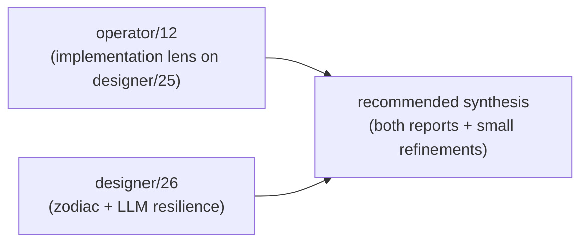

# Critique of operator/12 — universal message implementation

Status: critique + alignment with designer/26
Author: Claude (designer)

Operator landed `~/primary/reports/operator/12-universal-message-implementation.md`
in response to designer/25, before reading designer/26. This is
my critique. The headline: **operator/12's analysis is solid;
on every major decision it converges with designer/26**, which
hadn't yet landed when operator wrote. Two operator/12
refinements deserve adoption upstream; one operator/12 timing
choice deserves discussion. Below is the structured pass.

---

## 0 · TL;DR



- **Convergence on every major decision.** Match (not Query),
  initial-extension Subscribe, signal kernel/domain split,
  closed enums first, Persona pauses custom protocol, Sema
  reusable, evolutionary string-typing.
- **Two operator/12 contributions designer/26 should adopt.**
  The "evolutionary correctness ladder" (string → newtype →
  closed enum → typed semantic lattice) and the
  domain-parameterized parser shape (`Parser<Domain>`,
  `Renderer<Domain>`) are real refinements.
- **One open question.** Operator/12's M0–M4 implementation
  ladder ends with `Recurse`/`Infer` last. Designer/26 hasn't
  staged the verbs; both reports agree these are M2+ work,
  but the precise scheduling within each milestone is worth
  agreeing on before any code lands.
- **What designer/26 adds (that operator should now read).**
  Tier 0 grammar decision (drop `(\| \|)`); LLM-as-resilience
  layer inside Sema (bind-resolution + type-expansion
  proposals); the zodiac mapping (less load-bearing for
  implementation but useful for documentation order); the
  example-walked-with-Rust-types in operator/12's request.

---

## 1 · What operator/12 got right

Substantive endorsements, point by point:

### a. *"The Sema protocol and the actor protocol become the same thing"* (§1)

This is the right framing — and it's the implementation
consequence of report 25's *database-as-actor* thesis (§9 of
25). Operator names it sharply: a Sema instance is a stateful
actor; its messages are typed requests; its replies are typed
extensions / diagnostics / subscription events. There's no
separate "database protocol" beyond the actor message protocol.

### b. SEMA as reusable substrate (§4)

Operator captures the user's pivot exactly: SEMA is the
database substrate; Criome has a Sema; Persona has a Sema;
future systems can have their own. The terminology cleanup
table in §4 is a contribution — not just renaming, but the
right framing for what each thing is:

| Old wording | New wording (operator/12) |
|---|---|
| `persona-store` as a bespoke store | Persona's Sema instance |
| sema as Criome's database | Sema as the reusable database substrate |
| domain database actor | Sema actor with a domain vocabulary |

This is the durable terminology going forward. Adopt.

### c. *"Do not implement generic records first"* (§5)

Operator/12 §5 is a sharp warning: report 25's `KindName +
TypedFields` pseudocode is **explanatory compression**, not an
implementation guide. The first Rust pass should be **closed
enums per domain**, not a runtime-typed generic record
representation. *"A generic `KindName` representation can
exist later as schema-as-data or introspection, but it should
not be the primary execution wire before `prism`/schema
tooling can prove it is typed enough."* This is correct and
the discipline of report 25 §"closed enums" was perhaps too
soft about this. Operator's framing is sharper; adopt.

### d. The kernel/domain split (§3)

Operator names the seam clearly:

| Layer | Owns |
|---|---|
| `signal` kernel | Frame, handshake, auth, version, generic envelope, universal verb names |
| domain contract | record kinds, query kinds, per-verb operation enums, records reply enum |
| Sema actor | validation, redb storage, subscription fanout, inference |
| nexus translator | text parser/renderer for a domain's contract |

Designer/26 §8 has the closed Request enum but conflated the
kernel/domain split — operator/12 names it explicitly. The
key insight: the universal verbs name the verb (Assert, Match,
…); the domain layer names the per-verb payload. Frame and
handshake live in the kernel; record kinds live in the
domain contract.

This is the right architecture. Adopt.

### e. The implementation ladder (§6)

Operator stages the 12 verbs across milestones M0–M4:

| Milestone | Verbs |
|---|---|
| M0 | Assert / Mutate / Retract / Match / Validate / Atomic |
| M1 | Subscribe with initial extension |
| M2 | Project / Aggregate |
| M3 | Constrain |
| M4 | Recurse / Infer |

This is sensible scheduling. M0 is what current `signal` mostly
already has (with a Query→Match rename). M1 lands the
push-not-pull discipline correctly (initial extension). M2
shapes storage APIs around projection/aggregation needs. M3
introduces multi-pattern joins. M4 requires rule engines.

Designer/26 didn't stage the verbs; this is operator/12's
contribution. Adopt as the implementation order.

### f. Match vs Query rename (§7, §12)

Operator confirms the naming should change to Match, with a
short compatibility window if current criome code/tests need
incremental migration. Aligns with designer/22, 24, 25, 26.

### g. Subscribe initial extension default (§7, §12)

Operator confirms: `ImmediateExtension` is the default;
`DeltasOnly` is opt-in. Aligns with designer/22 §5 and
designer/26 §8 (`SubscribeQuery { pattern, initial,
buffering }`).

### h. Persona pauses custom protocol work (§8, §12)

Operator: *"`signal-persona` becomes a record-kind crate and
`persona-store` becomes the first implementation home for
Persona's Sema actor unless the repo is renamed. The old
bespoke `message` protocol should not advance."* Aligns with
designer/21, 26. Persona's verbs are nexus's universal verbs;
Persona's contribution is record kinds.

---

## 2 · Where operator/12 and designer/26 align (operator hadn't read 26 yet)

| Question | operator/12 | designer/26 | Aligned? |
|---|---|---|---|
| Match vs Query | rename to Match | rename to Match (§11) | ✓ |
| Subscribe initial mode | ImmediateExtension default | ImmediateExtension default (§8) | ✓ |
| Drop `{ }` Shape syntax | yes | yes (§7) | ✓ |
| Drop `{\| \|}` Constrain syntax | yes (verbs as records) | yes (§7) | ✓ |
| 12 verbs as the closed Request enum | yes (§6 ladder) | yes (§8 full enum) | ✓ |
| Closed enums per domain, not generic KindName | yes (§5) | yes (§5 §10) | ✓ — operator's framing sharper |
| signal kernel/domain split | yes, prefer Option B | implicit in §8 | ✓ — operator's framing sharper |
| Persona uses universal verbs not custom | yes (§8, §12) | yes (entire arc 21–26) | ✓ |
| Sema is reusable substrate | yes (§4) | yes (§5, §10) | ✓ |
| String-bearing records OK during evolution | yes (§4) | implicit (§5 typed lattice) | ✓ — operator's framing sharper |

Every major decision is convergent. The two reports were
written from different angles (implementation vs synthesis)
and arrive at the same conclusions. That's the most credible
form of agreement: independent paths landing in the same
place.

---

## 3 · Refinements operator/12 brings — adopt these

Two pieces operator/12 names that designer/26 doesn't (and
should incorporate):

### a. The evolutionary correctness ladder

Operator/12 §4:

```
String field → validated newtype → closed enum → typed semantic lattice
```

This is the migration discipline for moving an existing
domain from string-bearing records to the fully-typed Sema
ideal. It says: don't block on full taxonomy; the work
proceeds incrementally. Each field starts where it can (a
string), tightens to a newtype that validates, then to a
closed enum once the variants are known, then takes its place
in the typed semantic lattice.

This is operator/12's most useful original contribution. The
direction is the user's vision (no strings); the path is
operator's articulation.

**Adopt** as a workspace skill addition — probably in
`skills/rust-discipline.md` §"Persistent state" or as a new
short skill `skills/typed-evolution.md`. The principle is
language-agnostic but applies most strongly to Rust schemas
in signal-style contract repos.

### b. Domain-parameterized translator

Operator/12 §9:

```
Parser<Domain>
Renderer<Domain>
```

The text translator (nexus daemon) should be parameterised by
domain, not registry-of-strings. Adding a record kind updates:

1. The domain contract enum;
2. The parser arm for that record head;
3. The renderer arm for that record/reply shape;
4. Round-trip tests.

Designer/26 §2 walks the example with concrete Rust types but
doesn't name this generality. Operator's `Parser<Domain>` /
`Renderer<Domain>` is the right shape — it makes nexus a
library, not a daemon-specific thing. Each Sema actor pairs
with its own parser/renderer instantiation parameterised over
its domain's contract.

**Adopt** as the nexus implementation shape. Likely a trait:

```rust
trait Domain {
    type Request;
    type Reply;
    // dispatch tables emitted by NexusVerb derive
}

struct Parser<D: Domain> { ... }
struct Renderer<D: Domain> { ... }
```

(Skeleton-as-design only — the actual trait shape lands in
the Rust crate.)

---

## 4 · What designer/26 adds — operator should integrate when reading

Operator hadn't read 26 when they wrote 12. Here's what 26
adds that operator/12 doesn't address:

### a. Tier 0 grammar decision (designer/26 §7)

Designer/22, 23, 24 left two tiers open: Tier 0 (drop `(| |)`
patterns; schema disambiguates) vs Tier 1 (keep `(| |)` for
visual distinction). Designer/26 picks **Tier 0** based on the
clean example walk in §2 of 26. Operator/12 implicitly assumes
patterns are records (not piped delimiters) but doesn't name
the decision.

**Recommendation:** confirm Tier 0 in operator's next
implementation pass. The token vocabulary becomes 12 variants
(LParen, RParen, LBracket, RBracket, At, Ident, Bool, Int,
UInt, Float, Str, Bytes, plus Colon for the path syntax). No
piped delimiters anywhere.

### b. The LLM-as-resilience layer (designer/26 §5)

Designer/26 introduces a substantive new concept: the LLM
embedded in Sema as Sowa's *associative comparator* (per
designer/25 §6). Three jobs:

1. **Bind-resolution recovery** — when `@bind` references a
   kind that doesn't exist, the LLM proposes the nearest
   existing kind in the lattice.
2. **Type-expansion escalation** — when queries consistently
   reference missing kinds, the LLM escalates a typed
   `(SchemaExpansionRequest …)` proposal for human/agent
   approval.
3. **NL-to-typed translation** — outer LLM translates vague
   intentions to typed Request records.

Operator/12's strict typed plane is correct as the
implementation kernel. The LLM-resilience plane is **separate**
— a peer plane that handles drift without contaminating the
typed plane. The implementation doesn't need to start with
LLM resilience; it needs to leave room for it.

**Recommendation:** in operator/12's M0 implementation, the
strict typed plane is what lands. But the design should not
foreclose the resilience plane — i.e., the parser should be
able to surface unknown-kind errors as structured data
(`UnknownKind { input: String, candidates: Vec<KindName> }`)
rather than fatal errors, so the LLM-resilience actor can
intercept them later without changes to the typed plane.

### c. Zodiac mapping (designer/26 §3–4)

Less load-bearing for implementation. The mapping aligns the
12 verbs to Young's *Geometry of Meaning* — three groups of
four, three modalities × four elements. Useful as
**documentation order** (list the verbs zodiacally in spec
docs and READMEs so the cycle of action is visible to
readers) but doesn't change implementation.

**Recommendation:** documentation only. Operator's M0–M4
ladder is the implementation order.

### d. Bind sigil cleanup (designer/26 §1)

Designer/25's example used `{@owner unifies}` — a curly-brace
unification spec. Designer/26 §1 corrects this: the
unification is a typed record `(Unify [id])`. Operator/12
implicitly endorses the cleanup but doesn't name it.

The example as cleaned (designer/26 §1):

```
(Match
  (Constrain
    [(HasKind @id MetalObject)
     (HasKind @id HouseholdObject)
     (HasOwner @id Me)]
    (Unify [id]))
  Any)
```

This is the canonical example shape going forward. Operator's
implementation should target this form.

---

## 5 · Open question: signal kernel split timing

Operator/12 §3 prefers Option B: extract a kernel
(`signal-core` or similar) that the existing `signal` (now
re-cast as the criome domain contract) and `signal-persona`
both depend on. Operator's reasoning: *"if the current
`signal` API is already used by Criome: create or extract a
kernel layer."*

Designer/26 implicitly assumes a kernel/domain split but
doesn't address timing. Two reasonable options:

| Option | Mechanism | Trade |
|---|---|---|
| **B-now** | Extract `signal-core` immediately; rename/reduce existing `signal` to be the criome-domain crate; new `signal-persona` depends only on `signal-core` | Cleanest end-state; high churn now (criome's deps shift) |
| **B-deferred** | Keep `signal` as both kernel + criome contract for now; let `signal-persona` depend on `signal` directly with the understanding that `signal`'s contract role will be extracted later | Lower churn now; carries an architectural debt; requires careful boundary discipline within `signal` |

I lean toward **B-now** for the same reason operator/12 does:
the longer the kernel-and-domain stay conflated, the more
implicit dependencies cement them together. The cost of the
extraction grows with delay.

**Recommendation:** extract the kernel immediately, before
Persona's Sema actor lands. Operator's M0 should land as:

1. Create `signal-core` with Frame, handshake, auth, version,
   the universal `Request<DomainPayload>` envelope shape.
2. Reduce `signal` to be the criome domain contract crate
   that depends on `signal-core` for kernel pieces and
   provides `SemaCriomeRequest = Request<CriomePayload>`.
3. `signal-persona` becomes a domain crate depending on
   `signal-core` and providing `SemaPersonaRequest =
   Request<PersonaPayload>`.

This is one extra refactor day; it pays back across every
future Sema instance.

---

## 6 · Recommended synthesis — concrete next steps

Combining operator/12's implementation lens, designer/26's
synthesis, and the convergent decisions:

### Phase 0 — spec & contract

| Step | Output | Source |
|---|---|---|
| 0a | Update nexus spec to record-shaped Project/Aggregate/Constrain (drop `{ }`, `{\| \|}`); confirm Tier 0 (no `(\| \|)`); 12 variants in token vocabulary | operator/12 §7 + designer/26 §7 |
| 0b | Extract `signal-core` (kernel: Frame, handshake, auth, version, `Request<DomainPayload>` envelope) | operator/12 §3 (Option B-now) |
| 0c | Reduce `signal` to be criome's domain contract; depends on `signal-core` | operator/12 §11 step 4 |
| 0d | Rebase `signal-persona` on `signal-core`; provide `PersonaPayload` enum with the 12 universal verbs over Persona's record kinds | designer/26 §8 + operator/12 §8 |

### Phase 1 — minimal Sema

| Step | Output | Source |
|---|---|---|
| 1a | `signal-core` parser/renderer trait `Domain` and `Parser<D>`/`Renderer<D>` | operator/12 §9 |
| 1b | M0 verbs in PersonaPayload: Assert / Mutate / Retract / Match / Validate / Atomic | operator/12 §6 |
| 1c | Rename Query → Match; remove sigil-dispatched Mutate/Retract/etc.; verbs are records | designer/22 §6 + operator/12 §7 |
| 1d | First Persona Sema actor: assert/match Message + Delivery records | operator/12 §11 step 6 |

### Phase 2 — push-not-pull subscriptions

| Step | Output | Source |
|---|---|---|
| 2a | M1: Subscribe with InitialMode (default ImmediateExtension) | operator/12 §6 + designer/26 §8 |
| 2b | router subscribes to `*( Match Delivery Pending )`; reacts on initial extension + deltas | operator/12 §8 sequence diagram |

### Phase 3 — reduction primitives

| Step | Output | Source |
|---|---|---|
| 3a | M2: Project + Aggregate | operator/12 §6 |
| 3b | Reduction enum (Count, Sum, Max, Min, Avg, GroupBy) | designer/26 §8 |

### Phase 4 — composition

| Step | Output | Source |
|---|---|---|
| 4a | M3: Constrain (with Unify record for cross-pattern bind unification) | operator/12 §6 + designer/26 §8 |
| 4b | Multi-pattern joins exercised in Persona test (sample: ownership + kind + binding patterns) | designer/26 §9 |

### Phase 5+ — derivation engines

| Step | Output | Source |
|---|---|---|
| 5a | M4: Recurse + Infer (rule engines, termination policy) | operator/12 §6 |
| 5b | LLM-resilience plane (bind-resolution + type-expansion proposals) | designer/26 §5 |

### Skill updates

| Skill | Update | Source |
|---|---|---|
| `~/primary/skills/rust-discipline.md` | Add §"Evolutionary correctness ladder" — the string → newtype → enum → lattice migration discipline | operator/12 §4 |
| `~/primary/skills/contract-repo.md` | Note `Parser<Domain>` / `Renderer<Domain>` as the canonical shape; the parser is *not* a runtime registry | operator/12 §9 |
| `~/primary/skills/contract-repo.md` | Note kernel-vs-domain split: signal-core kernel + per-domain contract crates | operator/12 §3 |

---

## 7 · Status tracking

The arc 22→23→24→25→26→27 (designer) plus 9→10→11→12 (operator)
now closes on a coherent design + implementation plan.

| Bead | Action |
|---|---|
| `primary-tss` | Update description: now spans (1) signal-core extraction, (2) Persona contract on universal verbs, (3) M0–M4 ladder per operator/12 §6 |
| New bead | "Add evolutionary correctness ladder to skills/rust-discipline.md" — designer-actionable |
| New bead | "Document Parser<Domain> / Renderer<Domain> shape in skills/contract-repo.md" — designer-actionable |

---

## 8 · Closing

Operator/12 is a strong implementation-side companion to
designer/25–26. The convergence on every major decision (Match,
ImmediateExtension, signal kernel split, closed enums first,
Persona pauses, Sema reusable, evolutionary string-typing) is
the credible kind: independent angles arriving in the same
place. Two refinements (the evolutionary correctness ladder
and the `Parser<Domain>` shape) deserve to land in workspace
skills. The Tier 0 decision and LLM-resilience layer from
designer/26 should fold into operator's next pass without
disrupting the M0 ladder. The kernel-split timing favours
**now** rather than **later** — extract `signal-core` before
Persona's Sema actor commits to the current shape.

The design space is settled enough to start writing code.

---

## 9 · See also

- `~/primary/reports/operator/12-universal-message-implementation.md`
  — the report under critique.
- `~/primary/reports/designer/26-twelve-verbs-as-zodiac.md`
  — what operator/12 didn't yet have access to; the
  alignment is documented in §2 above.
- `~/primary/reports/designer/25-what-database-languages-are-really-for.md`
  — the synthesis operator/12 was responding to.
- `~/primary/reports/designer/23-nexus-structural-minimum.md`
  §"Tier 0 vs Tier 1" — the grammar decision designer/26 §7
  closed.
- `~/primary/skills/contract-repo.md` — receives operator/12's
  refinements per §6 of this report.
- `~/primary/skills/rust-discipline.md` — receives the
  evolutionary correctness ladder.
- `~/primary/skills/reporting.md` — newly updated to require
  workspace-wide numbering (this report is the first under the
  new rule).

---

*End report.*
