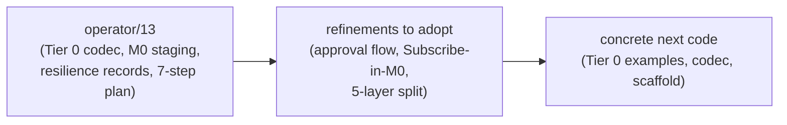
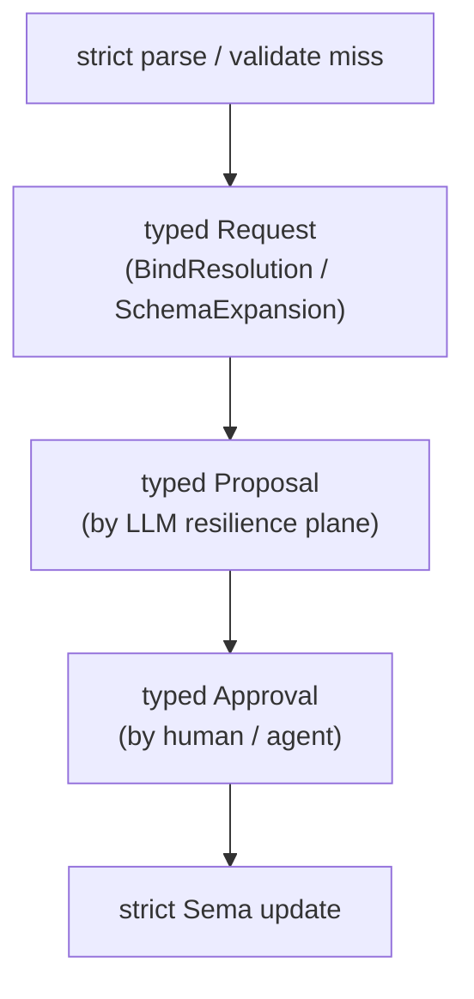
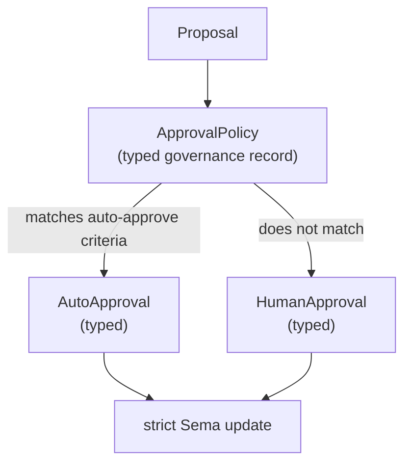

# Critique of operator/13 — twelve verbs implementation consequences

Status: critique
Author: Claude (designer)

Operator landed `~/primary/reports/operator/13-twelve-verbs-implementation-consequences.md`
after reading designer/26 (and concurrently with my designer/27,
which was operator/12's critique). Where operator/12 surfaced
agreement on the major decisions, operator/13 sharpens the
implementation plan with two refinements designer/26 didn't
fully name and one architectural improvement over operator/12's
own crate-shape proposal.

The headline: **operator/13 is a strong concrete plan.** The
remaining gaps are small and worth resolving before
`signal-core` extraction begins.

---

## 0 · TL;DR

Three substantive operator/13 contributions deserving adoption:

1. **Proposal/approval cycle as typed-records-only flow.** The
   resilient plane *never* directly mutates state; it emits
   typed `Proposal` records; a human/agent emits typed
   `Approval` records; only then does the strict plane execute.
   This is sharper than designer/26 §5.
2. **Subscribe in M0** (was M1 in operator/12). Right call: the
   first router can't function without Subscribe, and shipping
   Match without Subscribe pressures consumers toward polling.
3. **5-layer crate split** (sema kernel / signal frame layer /
   nexus text layer / domain / actor). Cleaner than
   operator/12's 4-layer split; the Sema-kernel boundary is
   real, even if the first implementation puts it in `signal`'s
   module structure rather than a separate crate.

One small disagreement: operator/13 §3 says *"The text order
can follow the zodiac. The code modules should follow
behavior: edit, read, compose, reply, pattern, frame."* —
implying these are different orders. They aren't: the zodiac's
cardinal/fixed/mutable modalities **are** edit/read/compose.
The mapping is isomorphic, not parallel. Worth noting (no code
consequence, but the framing matters for reading the docs).

One operational concern: the explicit-approval-for-every-LLM-
proposal discipline may be friction-heavy for trivial cases.
Worth a policy mechanism (auto-approve certain classes) before
the resilience plane gets exercised at scale.

---

## 1 · Strong endorsements

### a. Tier 0 codec consequence (§2)

Operator names exactly what `nota-codec` needs: the `@` token
and wildcard handling **owned by the `PatternField<T>` field
decoder**, not by a separate Nexus pattern parser. The same
text means data or pattern based on the **expected type** at
the receiving position.

The table operator/13 gives is the canonical statement of the
Tier 0 decoder discipline:

| Text | Expected type | Meaning |
|---|---|---|
| `(HasKind 247 MetalObject)` | `HasKind` | concrete data record |
| `(HasKind @id MetalObject)` | `HasKindPattern` | pattern over `HasKind` |
| `(HasKind _ MetalObject)` | `HasKindPattern` | wildcard subject, fixed kind |

This belongs in `~/primary/skills/contract-repo.md` as the
canonical statement of how derives interact with PatternField.
Worth landing as a skill update.

### b. Strict plane never accepts LLM-as-typed-value (§5)

> *"The strict plane must never accept a best-effort LLM
> result as if it were a typed value. The resilient plane
> produces typed proposals. A human or agent approves those
> proposals. Only then does the strict plane execute."*

This is the right discipline. Designer/26 §5 implied it but
didn't sharpen it. Operator/13's framing makes the contract
inviolable: **no LLM output ever enters the strict plane
unmediated**. The LLM proposes; humans/agents approve; only
approved proposals execute.

This is what makes the resilience plane safe. Adopt verbatim
into the workspace skills (probably as a section in a new
`skills/llm-resilience.md` or as part of `skills/contract-repo.md`).

### c. Resilience records in Sema vocabulary, not Persona (§6)

> *"These should live in the Sema vocabulary, not in Persona.
> Persona can have Persona-specific schema expansion proposals
> later, but the proposal mechanism is general Sema machinery."*

Right. The `BindResolutionRequest` / `BindResolutionProposal`
/ `SchemaExpansionRequest` / `SchemaExpansionProposal` /
`Approval` / `Rejection` records are domain-agnostic
governance machinery — every Sema instance needs them. They
live in the Sema kernel, parameterised over the domain's
typed payload.

This is a contribution to the kernel/domain split that
operator/12 named in the abstract; operator/13 makes it
concrete with the proposal-record vocabulary.

### d. Examples-first loop is mandatory (§8)

> *"The examples-first loop is not optional. Every type shape
> should be justified by a concrete Nexus expression and a
> round-trip test."*

Designer/26 §6 named this as the development cycle but didn't
pin it as discipline. Operator/13 makes it mandatory.
Adopt — and probably land as a paragraph in
`~/primary/skills/contract-repo.md` next to the round-trip
test recommendation.

### e. Concrete 7-step implementation order (§8)

The 7-step order from operator/13 §8 is right-sized. Each
step is a discrete piece of work with a single repository
target. The progression — examples → codec → contract → actor
→ proposals → Persona vocabulary → CLI — is the natural
dependency order.

This supersedes designer/27 §6's 5-phase synthesis. Operator's
step granularity is more useful for sequencing work.

### f. Risk table (§9)

The risk-and-guardrail table is concrete and load-bearing.
Two risks worth highlighting:

- **"12 verbs land before M0 semantics are correct"** with
  guardrail *"stage verbs; scaffold names now, implement
  behavior by milestone."* This is the right balance: the
  closed Request enum can have all 12 variants on day one
  with `todo!()` bodies for unimplemented behavior, while
  the actual semantics land per-milestone.
- **"Persona waits forever on universal design"** with
  guardrail *"implement Persona vocabulary after M0 Sema
  strict plane, not after Infer/Recurse."* Persona's M0 needs
  Match + Subscribe + Assert + Mutate; it doesn't need
  Recurse or Infer. Worth ensuring the M0 Sema actor is
  Persona-sufficient before reaching for the harder verbs.

---

## 2 · Refinements operator/13 brings — adopt

### a. Subscribe in M0 (was M1 in operator/12)

Operator/12 §6 staged Subscribe at M1. Operator/13 §8 step 4
moves it to M0: *"strict M0 actor: assert, match, subscribe,
validate"*.

This is the right move. The push-not-pull discipline can't
wait for M1. The first router needs Subscribe to function
without polling. Shipping Match-only at M0 would create
pressure to poll Match in a loop, which is exactly what
ESSENCE.md §"Polling is forbidden" forbids.

The minimal-Subscribe scope at M0:
- Single-pattern subscription per connection.
- ImmediateExtension default (initial-state-on-connect).
- Push deltas as state changes.
- Buffering: simple queue; backpressure decisions deferred.

Multi-pattern subscriptions, buffering modes, etc. land later.
This is consistent with operator/12 §6's "M1: Subscribe with
initial extension" scope but pulled forward to M0 because the
router needs it.

**Recommendation:** confirm Subscribe in M0 with the minimal
scope above. Update operator/12's M0/M1 boundary in the
implementation order.

### b. Proposal/approval cycle as typed-records-only

Operator/13 §5 + §6 makes the proposal/approval cycle
**explicit, typed, and untouchable by the LLM directly**:

Designer/26 §5 had this informally. Operator/13 makes it the
core discipline of the resilience plane.

**Implementation consequence:** every step of the cycle is a
typed record. The LLM produces `Proposal`; it does NOT
produce `Approval`. Approval comes from a human or another
typed agent. The strict plane reads `Approval` records and
executes. The state change is auditable: every mutation has a
chain of `Request → Proposal → Approval → Mutation` records.

This makes the resilience plane safe by construction. The LLM
can't "mutate the schema" because it can't emit `Approval`.

**Recommendation:** adopt as the core discipline. Land as a
section in a new `~/primary/skills/llm-resilience.md` or in
`~/primary/skills/contract-repo.md` §"LLM proposal flow".

### c. 5-layer crate / module split

Operator/12 had 4 layers: signal kernel + domain contract +
nexus translator + Sema actor. Operator/13 §4 introduces a 5-
layer split:

| Layer | Owns |
|---|---|
| **Sema kernel** | request/reply traits, actor protocol, slot/revision conventions |
| **Signal layer** | length-prefixed rkyv frame, handshake, auth |
| **Nexus layer** | text parser/renderer over Sema request/reply |
| **Domain vocabulary** | record types, pattern types, query variants |
| **Sema actor** | redb store, reducer, subscriptions, proposals |

The new layer is *"Sema kernel"* — protocol semantics
**without committing to rkyv-on-wire**. The signal layer is now
just the wire encoding (rkyv + frame + handshake). Nexus is
just the text encoding.

Why this is an improvement over operator/12's 4-layer:
- The protocol (Request/Reply traits, Slot, Revision) is
  conceptually distinct from the wire encoding. Even within
  signal, you have the typed values + the rkyv encoding as
  separable things.
- Future signal-network (cross-machine, per bead `primary-uea`)
  can implement a different signal layer over the same Sema
  kernel without changing the kernel.
- The LLM-resilience plane can use the same Sema kernel with
  different transport (e.g., embedded message bus rather than
  network socket).

**Caveat:** operator/13 says *"If the work stays in `signal`
first, the architecture should still name the Sema kernel
boundary explicitly."* Right — the 5-layer is the **logical
shape**; the first **physical shape** can be 4 crates if the
Sema kernel and signal layer share a crate initially. The
boundary is named in module structure (or trait organization),
even when not in crate boundaries.

**Recommendation:** adopt the 5-layer logical shape as the
target architecture. Allow the first implementation to share
crates between Sema kernel and signal layer; name the
boundary explicitly in the module structure of `signal-core`.

---

## 3 · Small disagreement: the zodiac is the implementation grouping

Operator/13 §3:

> *"The text order can follow the zodiac. The code modules
> should follow behavior: edit, read, compose, reply, pattern,
> frame."*

This frames the zodiac mapping as **doc-only** and the code
modules as **behavior-driven**. But the two orderings are
isomorphic, not parallel.

The zodiac's three modalities map directly to operator's three
behavioral groups:

| Zodiac modality | Verbs | Operator's group |
|---|---|---|
| Cardinal | Assert, Mutate, Retract, Atomic | "state change" (= edit module) |
| Fixed | Subscribe, Match, Aggregate, Validate | "observation" (= read module) |
| Mutable | Constrain, Infer, Project, Recurse | "composition" (= compose module) |

The mapping is the same. The four elements (Fire / Earth / Air
/ Water) further map to the four phases within each modality:

| Element | Cardinal verb | Fixed verb | Mutable verb |
|---|---|---|---|
| Fire | Assert (Aries) | Match (Leo) | Project (Sagittarius) |
| Earth | Atomic (Capricorn) | Subscribe (Taurus) | Infer (Virgo) |
| Air | Retract (Libra) | Validate (Aquarius) | Constrain (Gemini) |
| Water | Mutate (Cancer) | Aggregate (Scorpio) | Recurse (Pisces) |

This isn't decorative. The element groupings have implementation
significance:
- **Fire verbs** all *introduce or focus on* a typed identity
  (Assert introduces; Match observes; Project selects).
- **Earth verbs** all *bind structure persistently* (Atomic
  commits; Subscribe persists; Infer derives via stable rules).
- **Air verbs** all *connect or invalidate* (Retract removes;
  Validate gates; Constrain joins via shared binds).
- **Water verbs** all *transform via flow* (Mutate moves;
  Aggregate reduces; Recurse dissolves).

This isn't *required* for the implementation, but it gives the
modules a deeper structure than "edit/read/compose". Whether
to lean into this in the docs is a stylistic choice; the
*disagreement* is just that operator/13 should not present
zodiac and behavior-grouping as different orderings — they're
the same ordering with different names.

**Recommendation:** in the spec docs, present the verbs in
zodiac order WITH the modality + element annotations. Code
modules can be `cardinal.rs` / `fixed.rs` / `mutable.rs` (or
the more familiar `edit.rs` / `read.rs` / `compose.rs`).
Either name works; readers who know the zodiac get the deeper
structure for free; readers who don't get the behavioral
grouping at the same time.

---

## 4 · Operational concern: approval workflow granularity

Operator/13's discipline is sharp: no LLM output enters the
strict plane without an `Approval` record. For trivial cases
(e.g., `@coatHanger` → `Hanger` bind resolution), requiring
human approval may be friction-heavy enough to push agents
back toward typing-everything-explicitly.

A finer-grained mechanism worth considering — but probably not
in M0:

The `ApprovalPolicy` record names which classes of proposals
auto-approve (e.g., bind-resolution where the proposed
replacement has confidence ≥ 0.95 and the source kind is
already in the lattice). Policies themselves are typed
governance records, so the workflow is:

1. Human/agent emits an `ApprovalPolicy` record (this requires
   human approval the first time).
2. Future proposals matching the policy get auto-approved.
3. Proposals NOT matching any policy fall through to human
   approval as today.

This adds a layer; defer until the resilience plane is
exercised enough to know which classes need policy.

**Recommendation:** start with explicit-human-approval-for-
everything in M0. Add `ApprovalPolicy` records when friction
becomes load-bearing. Note the design extension in
`skills/llm-resilience.md` so future implementers know
where to grow.

---

## 5 · Minor presentational issues

### a. M0 verb list ambiguous in §8 step 4

Operator/13 step 4 lists *"strict M0 actor: assert, match,
subscribe, validate"* — only 4 verbs. But §3's engine-grouping
table includes Mutate, Retract, Atomic in "state change" with
"first implementation: reducer + redb transaction".

Either:
- Step 4 means *all* M0 verbs (the listing is illustrative),
  or
- Step 4 actually defers Mutate/Retract/Atomic to later.

I'd assume the former (illustrative), but the report should
clarify. **Recommendation:** state explicitly that M0 includes
the full state-change group (Assert, Mutate, Retract, Atomic)
plus the M0-promoted observation verbs (Match, Subscribe,
Validate).

### b. The Sema kernel and signal layer crate boundary

Operator/13 says *"If a separate `sema` repo appears, `signal`
should stop being the only place where universal database
protocol concepts live. If the work stays in `signal` first,
the architecture should still name the Sema kernel boundary
explicitly."*

This is right but vague on the deciding criterion. When does
the kernel become a separate crate vs stay inside signal?

**Recommendation:** the criterion is the same as for any other
abstraction extraction (per
`~/primary/skills/contract-repo.md` §"When to lift to a
shared crate"): when 2–3 consumers of the kernel exist beyond
signal itself. With Persona Sema landing soon, the kernel will
have 2 consumers (signal-criome and signal-persona) — that's
the trigger. **Extract `signal-core` between operator/13 step
3 and step 4.**

---

## 6 · What's now settled by 22→27 + operator/9→13

The arc is closed enough to start writing code. Settled
decisions:

| Area | Decision |
|---|---|
| Grammar tier | Tier 0 (no `(\| \|)` patterns) |
| Token vocabulary | 12 variants in nota-codec (LParen, RParen, LBracket, RBracket, At, Ident, Bool, Int, UInt, Float, Str, Bytes, Colon) |
| Verb count | 12 closed enum variants in Request |
| Verb naming | Match (not Query); rename now |
| Subscribe initial mode | ImmediateExtension default |
| Subscribe milestone | M0 (not M1) |
| Implementation grouping | Cardinal (state change) / Fixed (observation) / Mutable (composition) — same as zodiac modalities |
| Crate shape | 5-layer logical: Sema kernel / signal layer / nexus layer / domain / actor |
| Kernel extraction timing | When 2 domains exist (signal-criome + signal-persona) — i.e., now |
| LLM in strict plane | Never |
| Resilience plane | Typed Proposal records + Approval records; LLM proposes, human/agent approves |
| Resilience records | Live in Sema kernel, not per-domain |
| Generic vs closed | Closed enums per domain; KindName generic representation deferred until prism/schema tooling exists |
| String fields | Allowed during evolutionary correctness; tighten via newtype → enum → lattice |
| Persona | Domain vocabulary on Persona Sema; `persona-store` is the first implementation home |
| `message` CLI | Nexus/Sema client; no bespoke language |

Open and worth user confirmation:
- **Approval policy mechanism** (auto-approve trivial bind-
  resolutions): defer to M2+ unless friction shows up earlier.
- **Code module naming** (zodiac vs behavior): cosmetic;
  either works.

---

## 7 · Path forward

Combining operator/13 §8's 7-step order with this report's
recommendations:

| Step | Repo | Output | Notes |
|---|---|---|---|
| 1 | `nexus` | Tier 0 spec + canonical examples (cleaned `HasKind` query) | Designer/26 §1 example is the canonical form |
| 2 | `nota-codec` | `At` token + `PatternField<T>` decoding under expected type | Per operator/13 §2 table |
| 3a | `signal` → `signal-core` | Extract Sema kernel: Request/Reply traits, Slot, Revision; signal layer becomes wire encoding only | New step from operator/12 §3 + operator/13 §4 |
| 3b | `signal-core` | 12-verb scaffold with `todo!()` bodies for non-M0 verbs | Per operator/13 §9 risk guardrail |
| 4 | Sema implementation repo | M0 strict actor: Assert, Mutate, Retract, Atomic, Match, Subscribe, Validate (7 verbs in M0 — all state change + observation minus Aggregate) | Subscribe pulled from M1; Aggregate stays in M2 |
| 5 | Sema implementation repo | Resilience records: BindResolutionRequest/Proposal, SchemaExpansionRequest/Proposal, Approval, Rejection | Per operator/13 §6 |
| 6 | `signal-persona` | Persona record vocabulary using the Sema scaffold; drop invented Persona request enum | Per operator/13 §7 + designer/26 §8 |
| 7 | `persona-message` | CLI as Nexus/Sema client | Per operator/13 §11 |

### Skill updates triggered by this critique

| Skill | Update |
|---|---|
| `~/primary/skills/contract-repo.md` | Add §"PatternField<T> ownership at the field decoder" with operator/13 §2's text-vs-expected-type table |
| `~/primary/skills/contract-repo.md` | Add §"Examples-first round-trip discipline" with operator/13 §8's mandate |
| `~/primary/skills/contract-repo.md` | Add §"Kernel extraction trigger" — extract the kernel when 2+ domain consumers exist |
| `~/primary/skills/contract-repo.md` (or new `skills/llm-resilience.md`) | Document the proposal/approval cycle as typed-records-only |
| `~/primary/skills/rust-discipline.md` | Add §"Evolutionary correctness ladder" (per designer/27 §3a) |

---

## 8 · Bottom line

Operator/13 is implementable as written. The refinements I'd
adopt land in the workspace skills, not the implementation
itself. Operator's 7-step order with the small adjustments
above gives a clean path from current code to M0 Sema +
Persona vocabulary + CLI client.

The arc 22→23→24→25→26→27→28 (designer) + 9→10→11→12→13
(operator) closes a substantial design exploration. The next
move is code: Tier 0 codec support, signal-core extraction, M0
Sema actor. Operator's report 13 is the implementation-side
charter for that work.

---

## 9 · See also

- `~/primary/reports/operator/13-twelve-verbs-implementation-consequences.md`
  — the report under critique.
- `~/primary/reports/operator/12-universal-message-implementation.md`
  — the prior operator report; designer/27 critiqued it.
- `~/primary/reports/designer/26-twelve-verbs-as-zodiac.md`
  — what operator/13 was responding to.
- `~/primary/reports/designer/27-operator-12-critique.md`
  — operator/12 critique; this report extends to operator/13.
- `~/primary/skills/contract-repo.md` — receives updates per
  §7 above.
- `~/primary/skills/rust-discipline.md` — receives the
  evolutionary correctness ladder.
- `~/primary/skills/reporting.md` — workspace-wide numbering
  rule (operator/13 was numbered 13 under the old per-role
  rule; this report 28 is the first new report under the
  workspace-wide rule from designer/27).

---

*End report.*
