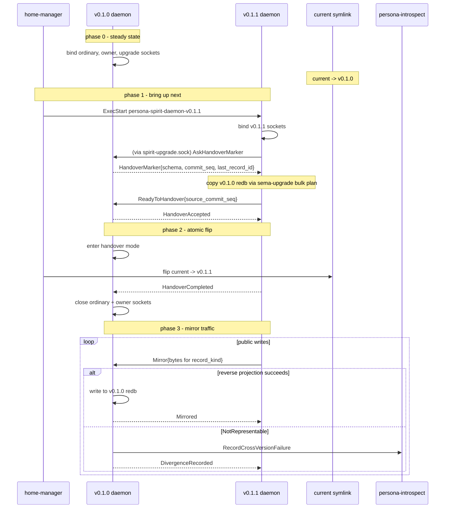

# 285 - VersionProjection trait and handover protocol specification

*Designer specification absorbing operator corrections logged as
spirit records 191-193: (1) upgrade and downgrade are one
projection relation, not two traits; (2) version handover is an
explicit daemon-to-daemon protocol, not Unix socket sharing;
(3) post-handover main is private-upgrade-writable only.
Supersedes the per-type Migration trait framing in /284 wherever
they differ. The missing design piece this report nails down is
the per-operation compatibility policy — the trait converts types;
the policy decides what to DO with the conversion.*

## TL;DR

One trait, `VersionProjection<Source, Target>`, lives in a new
workspace-universal crate `version-projection` peer to
`signal-sema`; the same trait projects upgrades and downgrades by
swapping the type parameters. Per-component policy decides per
public operation whether to mirror, divergence-record, or reject
the projection result. Handover is an explicit daemon protocol on
a per-version private upgrade socket (0600, named by version
string): next asks main for the handover marker (schema hash,
commit sequence, write counter, last record id), main enters
handover mode, the active-version selector flips, next becomes
public, main becomes private-upgrade-writable. Cross-version
recovery routes failed messages into persona-introspect; a
compile-time `MigrationIndex` finds the right historical signal-X
library to decode the bytes.

## 1. VersionProjection trait — placement and signature

### 1.1 Crate placement

**Decision: new dedicated crate `version-projection`, peer to
`signal-sema`.** Rejected: `signal-sema` (muddles its
no-executable-code invariant); `sema-engine` (projection applies
to wire-only types that never persist); `signal-core` (record 161
keeps the namespace but reviving it for one trait is less honest);
`migration` (the relation is bidirectional, that name suggests
one-way). The new crate sits at signal-sema's tier:
workspace-universal vocabulary, no Persona-specific content, no
daemon, no socket, no redb. Submodules: `projection.rs` (trait +
`Projected`), `policy.rs`, `dispatch.rs`, `index.rs`
(MigrationIndex), `version.rs` (ContractVersion = Blake3 hash per
/279), `handover.rs`. The companion contract crate
`signal-version-handover` ships beside it (sibling triad-shape
contract; every component daemon imports it as a peer client per
`skills/component-triad.md` carve-out 3). No
`owner-signal-version-handover` ships today (deferred — §9).

### 1.2 Trait signature

```rust
// version-projection/src/projection.rs

/// Bidirectional projection between two versions of one logical
/// type. One impl for `(Source, Target)` projects forward; the
/// inverse impl for `(Target, Source)` projects backward.
/// Component policy decides direction at each call site.
pub trait VersionProjection<Source, Target> {
    type Error;
    fn project(source: Source) -> Result<Target, Self::Error>;
}

/// Marker on every projected type.
pub trait Projected: Sized {
    const CONTRACT_VERSION: ContractVersion;
    fn component() -> ComponentName;
}

/// Blanket identity self-projection — covers the no-migration
/// diagonal for every type the generator emits Projected for.
pub struct Identity;
impl<T: Projected> VersionProjection<T, T> for Identity {
    type Error = std::convert::Infallible;
    fn project(value: T) -> Result<T, Self::Error> { Ok(value) }
}

pub enum ProjectionError {
    /// Source has no representation in Target. Per-op policy
    /// decides between DivergenceRecord and Reject.
    NotRepresentable { source: String, target: String },
    TransformFailed(String),
    DirectionNotImplemented,
}
```

### 1.3 Generics vs associated types

Generic type parameters (not an associated `type Next`) — same
trait carries forward AND reverse impls (opposite parameter
orders), and supports multiple adjacent versions per Source. Cost:
no `dyn VersionProjection` — fine because the `MigrationIndex` is
compile-time per `skills/component-triad.md` §"Compile-time module
index".

### 1.4 How a type binds Target

A type doesn't bind to one Target. Each `(Source, Target)` is a
separate impl. The schema generator (/279 §6b) emits `Projected`
for every type; the blanket `VersionProjection<T, T>` for
`Identity` covers self-projection. Hand-written `(Source, Target)`
impls live in the frozen historical crate when an adjacent version
pair needs them. State A (no migration) ships zero per-type
override code; the blanket impl monomorphises to `Ok(self)`.

### 1.5 Error type strategy

`ProjectionError::NotRepresentable` is the typed signal
distinguishing "main genuinely cannot represent this" from "the
code blew up." Per-operation policy (§2) reads this to choose
between `DivergenceRecord` and `Reject`. Other variants always
reject.

## 2. Per-operation compatibility policy

The load-bearing contribution of this spec. The trait converts
types; the policy decides what to do with the result.

### 2.1 Primitives

```rust
// version-projection/src/policy.rs

pub enum OperationKind {
    AppendWrite,    // Submit, Record (Assert)
    MutateWrite,    // Mutate
    RetractWrite,   // Retract
    Match,          // Observe, Query
    Subscribe,      // Watch
    Tap,            // universal observability
}

pub enum WritePolicy {
    Mirror,              // next does op; main mirrors via reverse
                         //   projection; fallback to
                         //   DivergenceRecord on NotRepresentable
    DivergenceRecord,    // next does op; main records divergence
                         //   via persona-introspect (records 180/182)
    Reject,              // next refuses; CLI returns error
}

pub enum ReadPolicy {
    ActiveProjectsResponse,    // active answers; project back if
                               //   caller expects other shape
    DualQueryMerge,            // query both; merge client-side
    ActiveOnly,                // active version only
}

pub enum SubscribePolicy {
    ResumeAgainstNext,         // resume; project deltas
    TerminateAtHandover,       // break; caller reconnects
}

pub struct PerOperationPolicy {
    pub write_policy: WritePolicy,
    pub read_policy: ReadPolicy,
    pub subscribe_policy: SubscribePolicy,
}

pub struct ComponentPolicy {
    pub component: ComponentName,
    pub operations: Vec<(OperationKind, PerOperationPolicy)>,
}
```

### 2.2 Where policy lives

**Per-component literal in the runtime crate
(`<component>/src/version_policy.rs`).** Rejected: contract-macro
generation; the policy is runtime behaviour, not vocabulary. The
contract crate stays pure; co-locating policy with the actor that
enforces it preserves the triad shape.

### 2.3 Per-operation matrix for Spirit (worked example)

| Operation | Class | Write | Read | Subscribe |
|---|---|---|---|---|
| `State(Statement)` | AppendWrite | Mirror | n/a | n/a |
| `Record(Entry)` | AppendWrite | Mirror w/ Divergence fallback | n/a | n/a |
| `Observe(Records)` | Match | n/a | ActiveProjectsResponse | n/a |
| `Observe(Topics)` (new variant) | Match | n/a | ActiveOnly (next only) | n/a |
| `Watch(Subscription)` | Subscribe | n/a | n/a | TerminateAtHandover |
| `Unwatch(Token)` | Retract | Mirror | n/a | n/a |
| `Tap` / `Untap` | Tap | n/a | n/a | each daemon emits own stream |

`Record(Entry)` is the Mirror-with-Divergence-fallback case:
reverse projection succeeds on conformant Magnitude rungs (main
mirrors) and returns `NotRepresentable` on widened rungs (main
divergence-records). `Observe(Topics)` is the `Reject`-class case:
the variant doesn't exist in main's contract at all.

### 2.4 Divergence vs reject taxonomy

`DivergenceRecord` answers when **main can't represent the result
but the operation is well-formed under next** — caller intent
survives via persona-introspect (record 184). `Reject` answers
when **the operation has no main contract equivalent at all**.
`Reject` is structural (shape doesn't fit); `DivergenceRecord` is
semantic (shape fits but value doesn't represent).

## 3. Handover protocol — daemon-to-daemon dance

### 3.1 Premise — sockets don't duplicate

Per record 192, multiple `accept()` on one Unix listener spread
connections across processes (load balancing), NOT broadcast. A
single shared socket can't deliver each request to both daemons.
Clean shape: per-version public sockets plus a per-version private
upgrade socket, with an explicit handover protocol over the
latter.

### 3.2 Per-version socket layout

```text
~/.local/state/persona-spirit/
  v0.1.0/
    spirit.sock                # versioned public ordinary, 0600
    spirit-owner.sock          # versioned public owner, 0600
    spirit-upgrade.sock        # private upgrade traffic, 0600
    persona-spirit.redb        # v0.1.0 layout
  v0.1.1/
    spirit.sock
    spirit-owner.sock
    spirit-upgrade.sock
    persona-spirit.redb        # v0.1.1 layout
  current -> v0.1.1            # active-version selector
```

The `current` symlink and the user-profile bare `spirit ->
spirit-vX.Y.Z` wrapper symlink (per /278) are the two active-
version selectors; home-manager activation maintains both
declaratively. One `home-manager switch` retargets both atomically.

### 3.3 Handover sequence



### 3.4 HandoverMarker wire shape

```rust
// signal-version-handover/src/lib.rs
signal_channel! {
    channel VersionHandover {
        operation AskHandoverMarker(MarkerRequest),
        operation ReadyToHandover(ReadinessReport),
        operation HandoverCompleted(CompletionReport),
        operation Mirror(MirrorPayload),
        operation Divergence(DivergencePayload),
        operation RecoverFromFailure(RecoveryRequest),
    }
    reply Reply {
        HandoverMarkerReported(HandoverMarker),
        HandoverAccepted(HandoverAcceptance),
        HandoverFinalized(HandoverFinalization),
        Mirrored(MirrorAcknowledgement),
        DivergenceRecorded(DivergenceAcknowledgement),
        Recovered(RecoveryResult),
        HandoverRejected(HandoverRejection),
    }
}

pub struct HandoverMarker {
    pub component: ComponentName,
    pub schema_hash: ContractVersion,   // /279 §4
    pub commit_sequence: u64,           // /273 §3 high-water mark
    pub write_counter: u64,
    pub last_record_id: Option<u64>,    // append-only stream tail
    pub recorded_at_date: Date,
    pub recorded_at_time: Time,
}
```

Load-bearing fields: `schema_hash` confirms version pair;
`commit_sequence` (per /273 §3 — sema-engine high-water mark)
lets next verify main hasn't accepted writes between snapshot and
switch; `write_counter` cross-checks; `last_record_id` lets
append-only streams resume gap-free. Until sema-engine grows the
counter, the first cutover uses stop-old / freeze-write / migrate
/ start-new (operator's implemented v0.1.0 → v0.1.1 dance); the
protocol is forward-compatible.

### 3.5 Verify-before-commit

Between `AskHandoverMarker` and `HandoverAccepted`, main keeps
serving public traffic. Next's `ReadyToHandover` carries the
source-commit-sequence observed at snapshot time. Main compares
against its current sequence: equal → proceed; main's higher →
`HandoverRejected` with a delta pointer; next reruns and retries.

### 3.6 Handover mode

After main commits to handover, it refuses writes on `spirit.sock`
and `spirit-owner.sock`, then closes both listeners. Only
`spirit-upgrade.sock` stays bound. Per record 193, this is the
"private-upgrade-writable only" state — the only writes main ever
accepts again come from next via Mirror or Divergence payloads.

## 4. Private upgrade socket

**Naming.** Handwritten version-string suffix
(`spirit-upgrade.sock` inside the `v0.1.0/` subdirectory), NOT
hash-of-schema. Hash paths are opaque, rebuild on every contract
edit, and break home-manager `ExecStart` lines. Same vocabulary
`deployedVersions` already uses per /278.

**Permissions.** 0600 (process-private), same owner UID. Both
daemons run under the persona owner's UID; group-share (0660)
helps only with a separate next UID (not the persona model). 0666
would leak to peer components.

**Wire format.** Separate `signal-version-handover` contract, NOT
a private-upgrade marker on the ordinary signal envelope. A marker
would muddle ordinary and upgrade traffic in one channel. Each
triad daemon binds three listener actors (ordinary + owner +
upgrade), each speaking its own contract.

## 5. CLI dispatch and active-version selector

**Routing lives in wrapper-side resolution (home-manager
symlink), NOT in the thin CLI binary.** Per /278 home-manager
generates per-version wrappers; each sets `PERSONA_SPIRIT_SOCKET`
env vars to its version's directory and execs the matching
`spirit` binary. Reasons: the single-argument rule (binary takes
one NOTA arg, version-dispatch would need a config field); per-
version Nix store paths (wrapper picks which to exec); triad
invariant 1 (each suffixed wrapper hits exactly one daemon socket
pair).

**Selector mechanism.** Two home-manager-managed symlinks:
`~/.nix-profile/bin/spirit -> spirit-v<current>` (user profile)
and `~/.local/state/persona-spirit/current -> v<current>/` (state
directory). `config.persona-spirit.currentDefault` drives both;
one `home-manager switch` retargets atomically.

**Missing-next error semantics.**

| Scenario | CLI behaviour | Log |
|---|---|---|
| Bare `spirit` resolves to v<X>; daemon-v<X> dead | Transport error to stderr; nonzero exit | None |
| Resolves to v<X> in handover mode | v<X> replies `HandoverInProgress`; CLI prints "retry against spirit-v<next>" | `MissingNext` per record 178 in persona-introspect |
| Explicit `spirit-vX.Y.Z` not deployed | Wrapper's `exec` fails | None |

## 6. Cross-version recovery via persona-introspect

### 6.1 New operations

Per record 184, persona-introspect is the home for cross-version
error logs. Four new operations and one new typed table:

```rust
// signal-persona-introspect (additions to existing channel)
operation RecordCrossVersionFailure(CrossVersionFailure),
operation DecodeCrossVersionFailure(DecodeRequest),
operation TapCrossVersionFailures(FailureFilter),
operation UntapCrossVersionFailures(SubscriptionToken),

pub struct CrossVersionFailure {
    pub component: ComponentName,
    pub producing_version: ContractVersion,
    pub receiving_version: ContractVersion,
    pub failure_class: FailureClass,
    /// Original message bytes encoded under producing_version.
    pub original_message_bytes: Vec<u8>,
    pub recovery_attempt: RecoveryAttempt,
    pub recorded_at_date: Date,
    pub recorded_at_time: Time,
}

pub enum FailureClass {
    Divergence(DivergenceReason),        // records 180/182
    CatastrophicNextFailure,             // record 183
    MissingNext,                         // record 178
    HandoverRejected,                    // commit-seq drift, etc.
}
```

### 6.2 Decode helper

`DecodeCrossVersionFailure(DecodeRequest)` takes a failure id and
target version; persona-introspect looks up the matching
historical signal-X library via the MigrationIndex (§6.3) and
returns decoded NOTA. Lets a recovery agent (operator or automated
flow) read the original and decide what to do.

### 6.3 MigrationIndex — compile-time signal-X library lookup

```rust
// version-projection/src/index.rs
pub struct MigrationIndexEntry {
    pub component: ComponentName,
    pub contract_version: ContractVersion,
    pub decode: fn(bytes: &[u8], kind: RecordKind)
                  -> Result<String, DecodeError>,
}

pub struct MigrationIndex { pub entries: Vec<MigrationIndexEntry> }
```

`MigrationIndex::prototype()` is a `Vec` literal with one row per
co-installed signal-X crate (current + every frozen sibling). The
index is built once at startup; lookup is `O(n)` over a small
vector. Adding a new frozen historical crate adds one row.

### 6.4 Tap consumers (closes /249 Gap #4)

Per /249 every component exposes Tap/Untap. The cross-version
failure stream gets first-class subscription via
`TapCrossVersionFailures(FailureFilter)` — the substrate for an
operator dashboard showing migration health in real time.
Implementation per `skills/subscription-lifecycle.md`.

## 7. Per-repo discipline

### 7.1 Each signal-X repo ships

| Discipline | Mechanism |
|---|---|
| Stable rkyv schema per release | Git tag = frozen contract version; no post-tag layout changes. |
| `CONTRACT_VERSION` constant | Generator emits at top of `src/lib.rs`. |
| `Projected` impl per type | Generator emits; blanket covers self-projection. |
| Hand-written `VersionProjection` impls | In the frozen historical crate (links to current crate as a dep). |
| `decode_to_nota` helper | `pub fn decode_to_nota(bytes: &[u8], kind: RecordKind) -> Result<String, DecodeError>`. |
| Round-trip tested | `tests/round_trip.rs` per `skills/component-triad.md`. |

### 7.2 Sibling repo per historical version

**Sibling repository, NOT sub-crate.** Per
`skills/micro-components.md`, a historical version is a different
capability snapshot; sub-crating would couple its release cycle
and force feature flags for linkage. Naming:
`signal-<component>-v<major>-<minor>-<patch>`. Current crate keeps
the unversioned name (tracks HEAD). New version ships: clone prior
tag, rename crate, hand-write forward + reverse projection impls,
add to MigrationIndex, add Cargo dep in `persona-introspect`.
Then frozen.

### 7.3 Schema-version hash binding

Per /279 §6b the generator emits `CONTRACT_VERSION` at build time
and every type in one signal-X crate shares one (the hash binds
to the whole component schema). The `Projected` impl reads the
same const.

## 8. Worked example — Spirit 0.1.0 to 0.1.1

### 8.1 Forward and reverse projections in the frozen crate

The frozen `signal-persona-spirit-v0-1-0` crate ships the v0.1.0
shapes (`Certainty` is the closed 3-rung enum) plus two
projection impls — `SpiritEntryForward` maps `Certainty →
Magnitude` (always `Ok`); `SpiritEntryReverse` maps `Magnitude →
Certainty` (succeeds on `Maximum / Medium / Minimum`, returns
`NotRepresentable { source: "High/VeryHigh/...", target:
"Certainty (closed 3-rung set)" }` on widened rungs). The full
chain already exists in
`sema-upgrade/src/migrations/persona_spirit/version_0_1_0_to_0_1_1.rs`'s
`current_shape` submodule; the frozen crate absorbs that code
into the projection impls. The bulk migration plan (per /270)
reuses the *forward* impl; the handover mirror path (§3.3) uses
the *reverse* impl.

### 8.2 Per-operation policy literal

Per the §2.3 table, `persona-spirit/src/version_policy.rs` emits
one `ComponentPolicy` whose `operations` vector carries one
`(OperationKind, PerOperationPolicy)` row per public operation —
`AppendWrite` → `Mirror / ActiveOnly / TerminateAtHandover`;
`Match` → `Reject / ActiveProjectsResponse / TerminateAtHandover`;
`Subscribe` → `Reject / ActiveOnly / TerminateAtHandover`; `Tap` →
`Mirror / ActiveOnly / TerminateAtHandover`.

### 8.3 Catastrophic next-failure scenario

A caller sends `Record(Entry { certainty: High })` to v0.1.1;
v0.1.1 begins local commit and crashes before commit completes.
Main detects next absence via heartbeat, reads the latest pending
Mirror payload from its upgrade-socket replay log, tries
`SpiritEntryReverse::project` — `Magnitude::High` does not map to
`Certainty`, so projection returns `NotRepresentable`. Main calls
`RecordCrossVersionFailure(CrossVersionFailure {
  failure_class: CatastrophicNextFailure,
  original_message_bytes: <rkyv v0.1.1 bytes>, ... })` against
persona-introspect, which writes to the `cross_version_failures`
table.

Later, an operator runs `DecodeCrossVersionFailure(id=42,
target=v0.1.1)`; persona-introspect looks up
`signal-persona-spirit`'s current crate via the MigrationIndex
and replies `CrossVersionFailureDecoded { decoded_nota: "(Record
(Entry ...))" }`. The "upgrade-socket replay log" is main's
durable record of every Mirror payload; on crash, main re-reads
the most recent payload and attempts partial-apply via reverse
projection per record 183.

## 9. Open questions

*Under consideration, not committed; per `skills/architecture-
editor.md` §"Carrying uncertainty".*

- **Crate name `version-projection`.** Alternatives: `migration`
  (suggests one-way), `compatibility-projection` (verbose). Lean:
  `version-projection`. Confirm with psyche.

- **`signal-version-handover` as separate triad contract.**
  Alternative: collapse into `version-projection`. Lean: separate;
  wire shape needs round-trip tests in a per-crate boundary.
  Confirm when a second component needs handover.

- **`owner-signal-version-handover`.** Not shipped today. Future:
  force-flip active version, force rollback, quarantine
  misbehaving next. Overlaps with sema-upgrade owner contract
  (/270 §7). Lean: defer until sema-upgrade owner contract ships.

- **Subscribe policy.** §2.3 picks `TerminateAtHandover`.
  Alternative: `ResumeAgainstNext` projects deltas per delivery.
  Lean: terminate; reconnect cost is small and per-delta
  projection isn't worth building until a real long-lived
  subscriber demands it.

- **Per-operation policy declaration site.** §2.2 picks runtime
  crate. Alternative: contract-macro generation from operation
  annotations. Lean: runtime crate until similarity across
  components justifies promotion.

- **Mirror payload shape.** §3.4 uses `payload_bytes: Vec<u8>` +
  `record_kind`. Alternative: typed enum holding the archived
  type directly. Lean: bytes; typed enum forces `version-
  projection` to import every signal-X crate. Confirm when a
  second component needs handover.

- **commit_sequence in sema-engine.** Per /273 §3 sema-engine
  needs a durable monotonic commit counter for live-copy cutover.
  First v0.1.0 → v0.1.1 uses stop-old / start-new; from the
  second cutover the counter is the precondition for zero-
  downtime handover. Separate sema-engine work item.

- **PeerCheck on each working contract (per /284 §3.1).** This
  spec uses `signal-version-handover` as the single discovery
  contract. Lean: drop PeerCheck from working contracts. The
  /279 §6c inspect-socket pre-bind path remains for hash
  discovery.

- **Active-version selector for system-scope components.** Same
  shape as /278's user-scope (`~/.local/state/<component>/`) but
  rooted at `/etc/<component>/`. Document per component.

- **Tap consumer dashboard.** §6.4 names that Tap exists; doesn't
  sketch the dashboard. Separate operator-facing tool design.

## See also

**Intent records (via spirit).** 164 (per-type version migration);
177 (peer-check); 178 (multi-version dispatch protocol);
180 (cant-do-at-all acceptable); 181 (main/next vocabulary);
182 (partial-support = divergence); 183 (catastrophic next-failure
recovery); 184 (persona-introspect cross-version log home);
185 (per-repo data-type discipline); 186 (cross-daemon cutover
can be atomic by protocol); 187 (main/next branches); 188-189
(designer specifies); 191 (one projection relation, bidirectional);
192 (explicit daemon handover protocol); 193 (post-handover main
is private-upgrade-writable only).

**Designer reports.** /263 (schema spec language); /270 (sema-
upgrade triad — this spec's handover protocol complements its
bulk plan); /273 (schema-migration synthesis; commit-sequence;
type-family split); /278 (multi-version daemon coexistence at
home-manager); /279 (NOTA schema language + version hash);
/284 (per-type Migration trait — this report supersedes the
trait shape but inherits MigrationIndex, frozen-sibling-crate,
and cross-version-recovery framing).

**Operator reports.** 151 (Spirit deployed version + schema
migration); 153 (intent questions after /273/274); 154 (Spirit
versioned daemon cutover); 155 (double-daemon deployment check);
156 (v0.1.1 staging and remaining cutover gap).

**Skill files.** `skills/spirit-cli.md` §"Substrate migration
discipline"; `skills/component-triad.md` §"The single argument
rule", §"Compile-time module index"; `skills/architecture-
editor.md` §"Carrying uncertainty".

**Source repos read.**
`/git/github.com/LiGoldragon/signal-sema/`,
`/git/github.com/LiGoldragon/signal-persona-spirit/`,
`/git/github.com/LiGoldragon/sema-upgrade/`,
`/git/github.com/LiGoldragon/CriomOS-home/modules/home/profiles/min/spirit.nix`.
