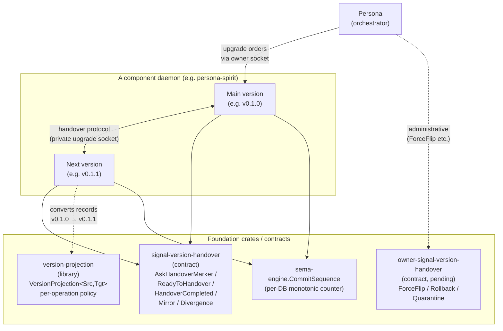
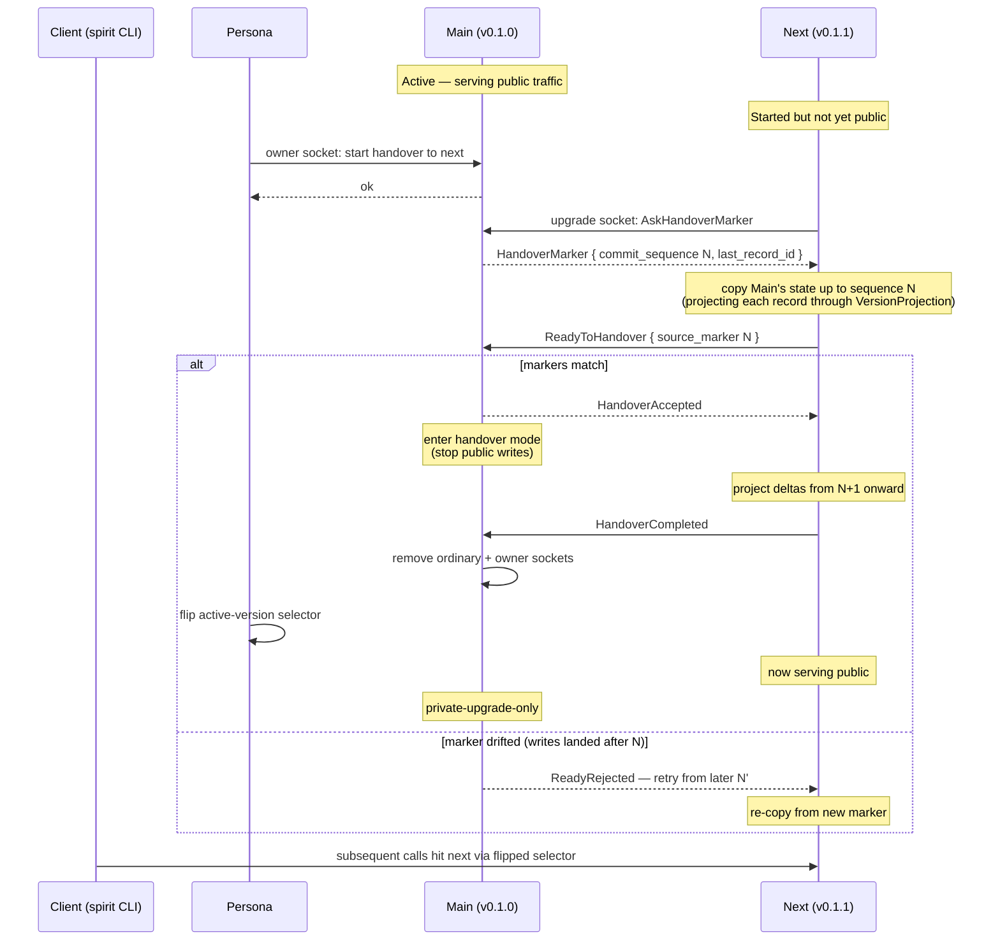
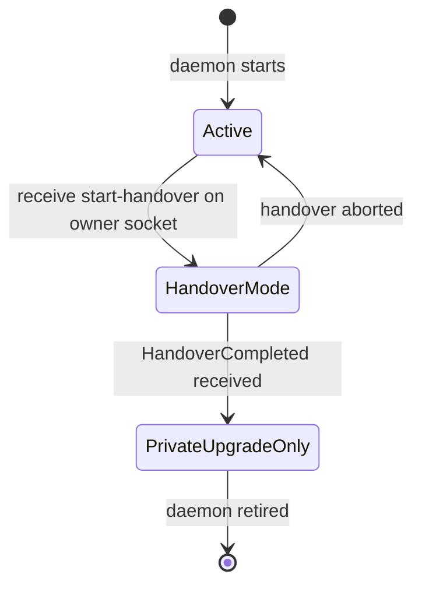

# 287 - Version handover component — visual explanation

**Status:** absorbed into the upgrade triad per `/318` Wave-4; `upgrade` daemon + `signal-upgrade` + `owner-signal-upgrade` are on disk. This report preserves the visual reference shape.

*Reference explanation of the version-handover stack: what each
piece does, how they fit together, and what the protocol looks
like end-to-end. Written for future agents (or operators) who need
to understand the architecture without re-reading /285 + operator
/158 + /160 + /161 piecemeal. Per psyche 2026-05-22.*

## TL;DR

Six pieces fit together to upgrade a running component daemon to a
new version of its data shape without losing writes and without
downtime. The library (`version-projection`) holds the conversion
trait; the contract (`signal-version-handover`) carries the
daemon-to-daemon protocol; the storage layer (`sema-engine`)
exposes the commit high-water mark needed for write replay; the
orchestrator (Persona) drives the protocol and flips the
selector. Each component daemon listens on three sockets (ordinary
public, owner administrative, private upgrade); the upgrade socket
is the wire for the protocol.

## §1 The big picture



## §2 Socket layout per component daemon

Every component daemon — persona-spirit today, future persona-mind,
persona-router, etc. — listens on **three sockets**:

```text
component-daemon (e.g. persona-spirit v0.1.0)
  │
  ├── ordinary socket          ← signal-<component>          (public traffic)
  ├── owner socket             ← owner-signal-<component>    (administrative + upgrade orders)
  └── private upgrade socket   ← signal-version-handover     (daemon-to-daemon handover wire)
```

The **private upgrade socket** is the new addition (operator/161
landed it on persona-spirit at commit `40c0c93e`). Only sister
daemons of the same component (main ↔ next) talk on it — and
Persona drives the handover orchestration over it
indirectly via the daemon's owner socket.

## §3 The handover protocol



## §4 Main daemon state machine



State semantics:

- **Active** — ordinary + owner + upgrade sockets all serving;
  public writes accepted; this is the steady-state.
- **HandoverMode** — ordinary + owner sockets still serving reads;
  public writes paused; upgrade socket exchanging with next.
- **PrivateUpgradeOnly** — ordinary + owner sockets removed; only
  upgrade socket open; receives mirror writes from next if old-compat
  reads are still in use.

## §5 What each piece does

| Piece | Role |
|---|---|
| **`version-projection` crate** | Holds the `VersionProjection<Source, Target>` trait + per-operation policy types (`WritePolicy` / `ReadPolicy` / `SubscribePolicy`). Per-type code converts records from one version to another. Bidirectional: the same trait projects forward AND backward by swapping `Source` and `Target`. Blanket `Identity` impl covers the no-migration diagonal trivially. |
| **`signal-version-handover` contract** | The wire protocol carried over the private upgrade socket. Operations: `AskHandoverMarker`, `ReadyToHandover`, `HandoverCompleted`, `Mirror` (delta writes from next back to current during overlap), `Divergence` (records main cannot replicate), `RecoverFromFailure`. |
| **`owner-signal-version-handover` contract** *(pending — bead `primary-7kge`)* | Administrative authority verbs: `ForceFlip` (override the protocol), `Rollback` (revert a recent handover), `Quarantine` (mark a daemon as not-eligible-for-upgrade). Carried over Persona's owner socket. |
| **`sema-engine.CommitSequence`** | The database high-water mark — a per-database monotonic counter that every successful write transaction increments. Lets next prove "every write up to N is durable in current," so it can copy + replay-from-N+1 without losing in-flight writes. Failed commits do not advance it. |
| **Component daemon — current side** | Owns its `<component>.redb`. Listens on ordinary + owner + private upgrade sockets. Responds to `AskHandoverMarker` with its current marker. Enters handover mode when next signals `ReadyToHandover`. Closes its public sockets after `HandoverCompleted`. |
| **Component daemon — next side** | Owns its own `<component>.redb` at the new schema. Copies state from current via the upgrade socket, projecting each record through `VersionProjection`. Becomes public after the selector flip. |
| **Persona** *(pending — bead `primary-a5hu`)* | The upgrade orchestrator. Receives upgrade orders on its OWN owner socket (per spirit record 210). Starts next-version daemons. Sends `start-handover` commands on target component's owner socket. Drives the protocol. Owns the active-version selector (replacing the prior CriomOS-home symlink mechanism per record 209). |

## §6 Data flow phases

```text
Phase 1 — Pre-handover (Active)

  client → [ordinary socket] → current daemon → current.redb


Phase 2 — During handover (HandoverMode)

  client → [ordinary socket] → current daemon → blocked (no public writes)
  next   → [upgrade socket]  → current daemon: AskHandoverMarker
  current → next:                                HandoverMarker { N }
  next   → next.redb:                            copy current.redb @ N
                                                 (projecting via VersionProjection)
  next   → [upgrade socket]  → current daemon:   ReadyToHandover


Phase 3 — Post-handover (PrivateUpgradeOnly + Next-Public)

  client → [ordinary socket on next] → next daemon → next.redb
  (selector flipped by Persona)
  next   → [upgrade socket on main] → main.redb: mirror writes
                                                  (if old-compat reads needed)
```

## §7 Concrete example — Spirit v0.1.0 → v0.1.1 (Magnitude widening)

What's actually happening for the live Spirit cutover:

1. **Before**: production has Spirit v0.1.0 daemon serving public
   traffic. Its database holds records with `Certainty` (3-variant
   enum: `Maximum` / `Medium` / `Minimum`).
2. **Operator landed in this session**:
   - `version-projection`, `signal-version-handover`,
     `sema-engine.CommitSequence`, `sema-upgrade` handover prototype
     (operator/158).
   - `spirit-smart-handover-sandbox` end-to-end test — 217-record
     migration proven (operator/160).
   - `persona-spirit-daemon` v0.1.1 now owns the private upgrade
     socket and handles `AskHandoverMarker` / `ReadyToHandover` /
     `HandoverCompleted` with real semantics (operator/161,
     `persona-spirit@40c0c93e`).
3. **Remaining work to do the production cutover**:
   - **Retrofit v0.1.0** so it also has the upgrade socket
     (maintenance build, same database schema — just adds the
     protocol code).
   - **Build Persona** in production so it can orchestrate
     the selector flip.
   - **Implement mirror payload application** on the upgrade socket
     (currently sandbox-only).
   - **Replace the temporary external `sema-upgrade-handover-temporary`
     runner** with real daemon-to-daemon socket exchanges (now
     possible because v0.1.1 has the real upgrade socket).
4. **Run the protocol**: Persona tells Spirit v0.1.0's owner
   socket "hand over to v0.1.1." v0.1.1 asks v0.1.0 for the
   `commit_sequence` marker N (sandbox just got 218). v0.1.1 copies
   v0.1.0's database, projecting each `Entry`'s `Certainty` field into
   the new `Magnitude` (7-variant enum). v0.1.1 reports
   `ReadyToHandover`. v0.1.0 stops accepting public writes. v0.1.1
   catches up any writes N+1…, reports `HandoverCompleted`. v0.1.0
   closes its public sockets. Persona flips the selector.
   v0.1.1 now serves public traffic; v0.1.0 sits with only its upgrade
   socket open in case it's needed for old-compat.
5. **After**: the seven `High` intent records that were stuck in the
   file substrate finally land cleanly in v0.1.1's database. No data
   lost during cutover.

The whole point is that **writes never stop**, and the database
**never has to be migrated as a blocking operation while users wait**.
The protocol does the work in the background; clients only see the
selector flip at the end, which is atomic.

## See also

- `reports/designer/285-versionprojection-trait-and-handover-protocol-specification.md` — the canonical spec this report explains
- `reports/operator/158-version-handover-foundation-implementation-2026-05-22.md` — foundation crates landed
- `reports/operator/160-spirit-smart-handover-sandbox-test-2026-05-22.md` — protocol proven end-to-end in sandbox
- `reports/operator/161-spirit-private-handover-socket-2026-05-22.md` — daemon-owned upgrade socket landed
- Spirit records 164, 177-186, 191-193, 194-196, 203, 206-210, 213-214 — the architectural decisions captured during the session
- Bead `primary-x3ci` — Spirit cutover
- Bead `primary-a5hu` — Persona epic (includes selector-flip orchestration)
- Bead `primary-7kge` — `owner-signal-version-handover` contract
- Bead `primary-ib5n` — canonical sema-upgrade + nota-schema-language architecture merge
