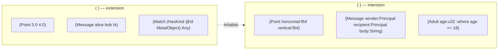
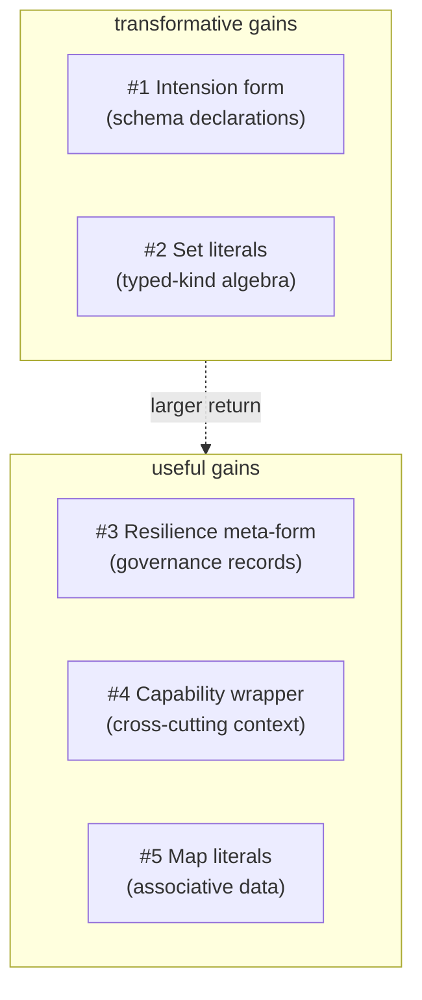

# Curly brackets reconsidered — what `{ }` could give us

Status: brainstorming + recommendation
Author: Claude (designer)

The user observed that `{ }` is currently a dead delimiter —
nota originally reserved it; nexus tried to use it for shape
projection (dropped); my tier-0 recommendation in report 23
dropped it entirely. That's a waste of a token. The user
asked me to brainstorm wide, then present five strong
proposals: where would `{ }` give the **greatest return** in
elegance, expressive power, and clarity, without breaking the
"no deep lookahead" parsing constraint?

Drawing on the workspace research library — Sowa's
intension/extension distinction (Conceptual Structures §1.4),
Spivak's ologs (Category Theory for the Sciences §2.3), and
the design arc of reports 22–28 — and going wide on
brainstorming first.

---

## 0 · TL;DR

**Recommendation: `{ }` is the intension form.** Where `( )`
denotes an instantiated typed record (the *extension* — *what
data IS*), `{ }` denotes a schema declaration, type definition,
or kind-of-thing description (the *intension* — *what types
ARE*). This makes Sowa's deepest distinction syntactically
visible at every text boundary.



Strong runners-up (numbered #2–#5 below): set literals
(`{MetalObject HouseholdObject}` for typed-kind set algebra);
resilience-plane meta-form (`{BindResolutionProposal …}` for
proposal records distinct from strict-plane data); capability
/ context wrappers (`{cap:my-token (Assert …)}` for signed
envelopes); map / KV literals (`{key value key value}` for
genuinely associative data).

The five proposals are not mutually exclusive — but the
deepest ones (intension form, set literals) commit `{ }` to a
specific semantic role and the others would need different
syntax. The recommendation picks **intension form** as the
single deep commitment.

---

## 1 · Why `{ }` is potentially valuable

`( )` and `[ ]` together cover **structured composite values**
and **ordered collections**. They cover the entire space of
"data records and lists." But the language has at least one
other dimension that's currently expressed awkwardly:

- **Schema-as-data**: how do you write a schema declaration on
  the wire? Currently we don't — schemas live in Rust derives,
  not in nexus text.
- **Typed governance records**: how do you visually
  distinguish strict-plane data from resilience-plane
  proposals?
- **Set algebra over typed kinds**: how do you write
  `MetalObject ∩ HouseholdObject` as a typed value?
- **Signed envelopes**: how do you wrap a request in a
  capability without polluting the request's structure?
- **Genuinely associative data**: when keys aren't positional?

Each of these is a **real expressive gap**. The question is
which one is the deepest — which would be the most beautiful
and most transformative use of the curly bracket.

The constraint: max 2-character lookahead. `{` is 1 char;
`{|` would be 2 chars (still acceptable but conflicts with the
old constrain syntax). I'll consider only `{` ↔ `}` for this
report.

---

## 2 · Going wide — the full brainstorm

Before narrowing to five, here's the wide list. Most are
small or specialized; the strong ones get full treatment in
§3.

| # | Use | Example | Strong? |
|---|---|---|---|
| 1 | **Intension form / schema declaration** | `{Point horizontal:f64 vertical:f64}` | **Strong** |
| 2 | **Set literals (typed-kind algebra)** | `{MetalObject HouseholdObject}` | **Strong** |
| 3 | **Map / KV literals** | `{name "Alice" age 30}` | Strong |
| 4 | **Resilience-plane meta-form** | `{BindResolutionProposal …}` | **Strong** |
| 5 | **Capability / context wrapper** | `{cap:my-token (Assert …)}` | Strong |
| 6 | **Olog / functor declaration** | `{Person owns Object}` | Specialization of #1 |
| 7 | **Closed-enum declaration** | `{Color Red Green Blue}` | Specialization of #1 |
| 8 | **Path / navigation expression** | `{p :address :city}` | Could be record |
| 9 | **Quotation / unevaluated form** | `{(form)}` | Nexus doesn't evaluate |
| 10 | **Type ascription** | `{value :Type}` | Schema already determines type |
| 11 | **Optional / nullable wrapper** | `{value}` | Already use `None` sentinel |
| 12 | **Probability / confidence wrapper** | `{0.95 (HasKind …)}` | Niche; can be a record |
| 13 | **Time / temporal context** | `{at 2026-01-01 (Match …)}` | Use a record `(AsOf …)` |
| 14 | **Subscription template** | `{(Match …)}` for streaming | Already have Subscribe verb |
| 15 | **Group / scope block** | `{ records … }` for transactions | Already have Atomic verb |
| 16 | **Annotation / metadata sidechain** | `{level:high code:E0042 …}` | Could be sub-record or map |
| 17 | **Versioning wrapper** | `{v:2 (record)}` | Schema-versioning is the right home |
| 18 | **Capability namespace** | `{Geometry Point Line Circle}` | Schema-org concern |
| 19 | **Currying / partial application** | `{Point horizontal:3.0}` | Convert to pattern |
| 20 | **Bag / multiset** | `{a a b}` | Use sequence with semantics |

The five strong candidates each get a dedicated section
below.

---

## 3 · The five proposals — deep dive

### Proposal #1 — Intension form (schema declarations)

The deepest move. `{ }` denotes the **definition** of a kind;
`( )` denotes an **instance** of a kind. Sowa's
intension/extension split made syntactically visible.

#### Surface

```nexus
;; The intension — declaring the Point kind:
{Point horizontal:f64 vertical:f64}

;; The extension — instantiating Points:
(Point 3.0 4.0)
(Point 5.0 12.0)

;; Intension for a closed enum:
{Color Red Green Blue}

;; Intension with a where-clause (predicate definition):
{Adult age:u32 :where age >= 18}

;; Intension with an inheritance arrow (olog-style):
{Mammal :is Animal}
{Cat :is Mammal hair:Bool whiskers:Bool}

;; Intension for a query type:
{HasKindPattern subject:PatternField<Slot> kind:PatternField<KindName>}
```

#### What's gained

1. **Schema-as-data on the wire.** Schemas can be
   transmitted, archived, proposed, approved — all as typed
   records. The `SchemaExpansionProposal` records
   operator/13 §6 proposes become natural:

   ```nexus
   (SchemaExpansionProposal
     {WoolGarment :is Garment fiber:Fiber pattern:WeavePattern}
     {CottonGarment :is Garment fiber:Fiber thread_count:u32})
   ```

   The proposal carries the schema declaration directly. The
   approval workflow operates on typed records that *contain*
   typed schema declarations.

2. **Sowa's distinction visible.** Intensions and extensions
   look different at every text boundary. A reader can tell
   "this is a definition" vs "this is data" just from the
   delimiter. Documentation that mixes both stays clear.

3. **Spivak's ologs become text-natural.** An olog box (a
   typed concept) is a `{ }` form. Olog arrows
   (`Person --owns--> Object`) become `{owns from:Person to:Object}`
   relation-records. The whole categorical-data-modeling
   apparatus has a natural wire form.

4. **Predicate definitions get first-class syntax.**
   Per report 25 §11, predicates should be schema records
   like `(Adult @age)` rather than syntactic operators. The
   intension form gives those predicates a definition syntax:
   `{Adult age:u32 :where age >= 18}`. The predicate's
   *meaning* is in `{ }`; its *use* is in `( )`.

5. **Closed-enum declarations get clean syntax.** Currently
   we declare closed enums in Rust source and the schema is
   implicit on the wire. With intension form: `{Color Red Green Blue}`
   is the wire form of the enum declaration; `(Cell 3 Red)`
   is the wire form of an instance referencing the enum.

#### Cost

1. **Field-name syntax.** `{Point horizontal:f64 vertical:f64}`
   uses `:` between field name and type. The `:` is currently
   the path separator in nota (`Char:Upper:A`). Disambiguation
   is possible via context (the `{ }` form is its own parse
   mode), but it's a slight overload. Could use `=` instead
   (`{Point horizontal=f64 vertical=f64}`), reusing the
   bind-alias `=` that we never landed.

2. **Two parser modes.** The lexer treats `{ }` as a delimiter
   pair; the decoder enters a "declaration mode" when it hits
   `{`. Schema-driven disambiguation of `:` (path vs type-of)
   becomes load-bearing.

3. **Semantic specification.** What can a `{ }` form contain?
   Just field declarations? Or also `:where` predicates?
   Inheritance? Initial values? Each addition is a closed
   enum variant in the SchemaDeclaration record kind.

#### Parsing complexity

Modest. The lexer adds `LBrace` and `RBrace` tokens. The
decoder reads `{` → expects a head identifier (PascalCase) →
expects field declarations (camelCase ident, then `:` or `=`
or path-separator-disambiguated, then a type) → expects `}`.
2-char lookahead suffices.

#### Why this is the deepest

The intension/extension distinction is the **most fundamental
duality** in knowledge representation. Every thinker the
workspace library cites — Aristotle, Frege, Sowa, Spivak,
Carnap, Tarski — has it as a load-bearing axis. Nexus would
be the first text format in regular use that **makes the
distinction syntactic** rather than relegating it to schemas
and ontologies that live elsewhere.

The user's own vision (typed lattice, no strings, predicate
records, schema growth via approval) all sit inside the
intension/extension framework. Making `{ }` the intension
form aligns the grammar with the philosophy.

---

### Proposal #2 — Set literals (typed-kind set algebra)

The user's example in report 25 §10 — *"all metal household
objects"* — naturally renders as `MetalObject ∩
HouseholdObject`. If `{ }` is the set delimiter, the syntax
becomes:

```nexus
;; A set of typed kinds:
{MetalObject HouseholdObject}

;; Used as the pattern in a Match:
(Match {MetalObject HouseholdObject} Any)

;; Set algebra in patterns:
(KindIntersection {MetalObject HouseholdObject})
(KindUnion {MetalObject WoodenObject})
(KindDifference {HouseholdObject Decorative})
```

#### What's gained

1. **Set algebra over typed kinds becomes the natural query
   language.** This is the user's vision (report 25 §5) made
   syntactic. Where `[a b c]` is "the sequence of a, b, c"
   (ordered, possibly duplicated), `{a b c}` is "the set of
   a, b, c" (unordered, deduplicated).

2. **Typed lattices read naturally.** A query for all
   subkinds of `PhysicalObject` becomes
   `(SubkindsOf PhysicalObject) ⊑ {LivingObject ManufacturedObject NaturalObject …}`.

3. **Distinct from sequences semantically.** A consumer
   reading the wire knows: `{}` = unordered+unique; `[]` =
   ordered+possibly-duplicated. The Rust types align: `BTreeSet<T>`
   for `{}`, `Vec<T>` for `[]`.

#### Cost

1. **Limits other uses.** If `{}` is set literals, then
   intension form can't share the syntax. Sets and intensions
   are both first-class candidates; only one can occupy the
   delimiter.

2. **Set semantics imply ordering choice.** rkyv archives
   sorted sets; the wire form needs a canonical ordering
   (typically lexicographic on the rkyv-encoding). This is
   tractable but adds a serialization rule.

3. **Type-uniformity.** A set must be of one type; mixed-type
   sets need a sum-type. Same constraint sequences have, but
   maybe more visually surprising.

#### Parsing complexity

Trivial. `{a b c}` is a sequence-shaped form with `{` `}`
delimiters. Decoder reads elements until `}`.

#### Why this is strong but second-place

The user's "set algebra over typed kinds" vision is real, but
**it's a special case of the broader query-pattern surface**.
A set of kinds can be expressed as a sequence whose receiving
type is `BTreeSet<KindName>` — schema-driven semantics, no
new delimiter needed. The `[]` form already handles it.

Intension form, by contrast, has *no other reasonable
expression*. We currently can't write schemas as data at all.
The structural gap is bigger.

That said: if the user prefers set-syntax for aesthetic
reasons (the math notation `{a, b, c}` reads naturally), this
is a strong second-place choice.

---

### Proposal #3 — Resilience-plane meta-form (proposal records)

Per operator/13 §6, the resilience plane uses typed
governance records: `BindResolutionRequest`, `Proposal`,
`Approval`, `Rejection`, etc. These are **categorically
different** from strict-plane data records — they describe
the conversation about state, not the state itself.

`{ }` could mark them visually:

```nexus
;; Strict-plane data:
(Match (HasKind @id CoatHanger) Any)

;; Resilience-plane response when CoatHanger isn't in the lattice:
{BindResolutionRequest
  source:CoatHanger
  candidates:[Hanger ClothesHanger ManufacturedHanger]
  reason:UnknownKind}

;; Resilience-plane proposal:
{BindResolutionProposal
  request:<request-id>
  resolved:Hanger
  confidence:0.95}

;; Approval:
{Approval target:<proposal-id> approver:Me}
```

#### What's gained

1. **Visual distinction between strict and resilient planes.**
   Reading a wire log, the eye separates strict `(record)`
   forms from resilience `{governance}` forms instantly.

2. **Audit trail readability.** A governance trail —
   `Request → Proposal → Approval → Mutation` — has every
   non-strict step in `{}` and the final mutation in `()`.
   The shape of the audit log carries semantic meaning.

3. **Discipline enforcement.** A typed component can refuse
   to process strict-plane records that arrive in `{}` form
   (or vice versa). The grammar prevents accidental
   cross-plane confusion.

#### Cost

1. **Plane membership becomes syntactic, not just typed.**
   Right now operator/13 puts the resilience records in the
   Sema kernel; the strict/resilient distinction is which
   record kinds are loaded into which actors. With `{}`, the
   distinction is also at the wire level. This couples the
   wire form to the architectural decomposition — which is a
   stronger commitment than necessary.

2. **Governance records aren't fundamentally different.**
   They're records about records. Treating them syntactically
   distinct from data records is a stylistic choice, not a
   structural one. The same records could be in `()` and
   carry their own dispatch via the head identifier.

3. **No clean rule for boundary cases.** What about the
   `Rejection` record carrying a reason that references a
   strict-plane kind? Mixed forms get awkward.

#### Parsing complexity

Trivial — `{ }` is a record-shaped delimiter pair with
different semantics.

#### Why this is strong but third-place

Useful, but **the gain is mostly aesthetic** — visually
separating planes. The structural decomposition operator/13
recommends already keeps planes apart at the typed-Rust
level; the wire-form distinction is a nice-to-have rather
than load-bearing.

If the user values the visual distinction strongly, this is a
real candidate. Otherwise, intension form gives more.

---

### Proposal #4 — Capability / context wrapper

Some requests need to carry **environmental context**: a
capability token, a transaction time, a signing key, a
priority hint. Currently these would either go in the Frame
envelope (signal kernel) or be additional fields on every
verb (cluttering domain records).

`{ }` could be a **wrap form** for context:

```nexus
;; A request with a capability:
{cap:my-token (Assert (Message alice bob hi))}

;; A request as-of a specific time (time-travel query):
{at:2026-01-01 (Match (HasKind @id MetalObject) Any)}

;; A request with priority hint:
{priority:urgent (Mutate (Delivery 247 Pending))}

;; A signed request (for cross-machine signal-network):
{signed-by:alice key:#deadbeef… (Assert …)}
```

The wrap is a *prefix* form: `{context (record)}` means "the
record, in this context."

#### What's gained

1. **Cross-cutting concerns separate from verb structure.**
   Capabilities, time, priority, signing — all of these
   apply to many verbs but aren't part of any verb's
   essential structure. A wrap form keeps them out.

2. **Composable.** Wraps nest:
   `{cap:my-token {at:2026-01-01 (Match …)}}` reads as
   "with my-token, as of 2026-01-01, match …"

3. **Generalizes the Frame envelope.** Frame already wraps
   the request body with auth. Extending Frame's role to a
   first-class wrap construct keeps the kernel symmetric:
   the wrap layer can be unwrapped one context at a time.

#### Cost

1. **Boundary blurring.** Currently the Frame is the
   transport layer; the request is the application layer.
   A wrap form blurs this — wraps are application-layer
   contexts that look like Frame extensions. The Sema kernel
   may not want the application layer carrying transport-like
   concerns.

2. **Closed enum of wraps required.** Without a closed enum,
   any record could be a wrap, which makes the Sema actor's
   dispatch harder. With a closed enum (`Cap`, `At`, `Priority`,
   `SignedBy`, …), wraps become a typed extension point.

3. **Could be records.** `(WithCap my-token (Assert …))` does
   the same thing in `()` form. The gain over records is
   visual — the wrap reads as "context, then content"
   versus "type, then field, then field."

#### Parsing complexity

Modest. The decoder reads `{` → expects a context-key /
context-record → expects an inner record → expects `}`.

#### Why this is strong but fourth-place

Useful for cross-machine signaling (per bead `primary-uea`)
and for governance contexts. But the same shape works as
records `(WithCap …)`. The visual gain is real but small.

Also: this conflicts with intension form (#1). If `{}` is
intension, it can't also be wrap. Intension wins on depth.

---

### Proposal #5 — Map / KV literals

For genuinely associative data — configuration, headers,
metadata — positional records require remembering the schema
order, and sequences-of-pairs are awkward.

```nexus
;; Map literal:
{name "Alice" age 30 email alice@example.com}

;; Or with sigils for clarity:
{:name "Alice" :age 30 :email alice@example.com}

;; Used in a record:
(Person {name "Alice" age 30 email alice@example.com})

;; Headers in a request:
(Match (HasKind @id MetalObject) Any {limit 10 offset 20})
```

#### What's gained

1. **Truly associative data is awkward in records.** Records
   force a positional schema. Configuration objects,
   open-ended metadata, and similar structures are more
   natural with `{key value}` pairs.

2. **Familiar shape.** Most modern data formats (JSON,
   CBOR, YAML, BSON) use curly braces for maps. Readers
   bring intuition.

3. **Closes a real expressive gap.** Currently
   `[("k" v) ("k" v)]` (sequence of pairs) is the only way
   to express a map; it doesn't visually distinguish from
   any other sequence-of-tuples and requires the schema to
   know it's a map.

#### Cost

1. **Field-name proliferation.** Maps have keys; nexus's
   discipline is positional records with schema-named
   fields. A map syntax brings open-ended keys back into the
   wire — which the no-keywords / position-is-identity
   discipline was designed to avoid.

2. **JSON drift risk.** If `{}` looks like JSON, the
   discipline that nexus is *not* JSON (positional, typed,
   schema-driven) gets visually undermined.

3. **Same as wire-level case as records.** The Rust type
   `HashMap<K, V>` archives via rkyv; on the wire it's already
   a sequence of pairs. The text form doesn't need to be
   visually distinct — the schema knows it's a map.

#### Parsing complexity

Modest. Decoder reads `{` → repeated (key, value) pairs →
`}`. The pairs alternate token types; first-token-decidable.

#### Why this is strong but fifth-place

Real but **uses the curly bracket on a small problem**. Most
maps in nexus are short metadata blocks; the existing
sequence-of-pairs is awkward but workable. Intension form,
set literals, and resilience meta-form all give bigger
returns on the same delimiter.

---

## 4 · Comparing the five — where is the greatest gain?



| Proposal | Depth | Reach | Conflict-free | Workspace fit |
|---|---|---|---|---|
| #1 Intension form | Highest — Sowa's foundational distinction | Touches every type definition + every governance record | Conflicts with #2, #3, #4 | Aligns with sema's whole vision |
| #2 Set literals | Moderate — set algebra is elegant | Touches kind queries + lattice operations | Conflicts with #1, #3, #4 | Aligns with user's "metal household objects" example |
| #3 Resilience meta-form | Moderate — visual plane distinction | Touches governance records only | Conflicts with #1, #2, #4 | Adds aesthetic clarity to operator/13's plane discipline |
| #4 Capability wrapper | Moderate — handles cross-cutting concerns | Touches request envelope + signed-network | Conflicts with #1, #2, #3 | Useful for `signal-network` (bead `primary-uea`) |
| #5 Map literals | Low — closes a small gap | Touches metadata blocks + headers | Compatible with all (smaller scope) | Familiar but undersells the delimiter |

The five aren't compatible — only one can be the canonical
meaning of `{ }`. The decision is: which is the deepest gain?

---

## 5 · Recommendation: intension form (#1)

### The case

The intension/extension distinction is **the foundational
duality** of every knowledge representation framework cited
in the workspace library. Sowa builds his entire conceptual-
graph theory on it (Chapter 1 §1.4). Frege's *On Sense and
Reference* makes it the axis of meaning. Carnap's meaning
postulates are intensions; Mealy applied this to databases
in 1967. Spivak's ologs are intensional structures; instances
are extensional.

The user's whole sema vision — typed lattice, no strings,
schema-as-data, predicate-records, LLM-resilience proposals
— sits entirely inside this duality. Making `{ }` the
intension form aligns the grammar with the philosophy.

### What it enables

1. **Schemas on the wire.** Every Sema instance can transmit
   its own schema; remote instances can verify compatibility
   by comparing schema declarations.
2. **Schema-expansion proposals are natural.**
   `(SchemaExpansionProposal {NewKind field:Type …})` reads
   without ceremony. The proposal *carries* the schema; it
   doesn't *describe* it.
3. **Predicate definitions are first-class.**
   `{Adult age:u32 :where age >= 18}` is the canonical
   form of a predicate. Reuse via `(Adult @age)` is the
   instantiation.
4. **Olog notation in text.** Every olog box `{Box}` is an
   intension form; arrows `{Box1 :is Box2}` declare
   subtyping. Spivak's ologs become a wire format.
5. **Closed-enum declarations on the wire.**
   `{Color Red Green Blue}` declares an enum; instances
   reference variants positionally.

### What it doesn't break

- Existing nexus parses unchanged — `( )` and `[ ]` keep
  their roles.
- The structural minimum stays small — adding `{ }` brings
  the delimiter count to 3 pairs.
- Tier 0 stays Tier 0 — no piped delimiters return.
- The parser stays first-token-decidable; max 2-char
  lookahead.

### What it changes

- New decoder mode for intensional records (field-name + `:` +
  type-or-where-clause syntax).
- One closed enum addition: `SchemaDeclaration` record kind.
- Spec update to nexus and nota: `{ }` is the intension
  delimiter pair, distinct from `( )` extension.

### What it costs

- One additional context-sensitive parse rule (the
  field-name + `:` syntax inside `{ }`).
- A modest amount of new spec writing.

The cost is small; the gain is large. Recommendation: adopt
**intension form** as the meaning of `{ }`.

---

## 6 · Concrete spec sketch

### Token additions to `nota-codec/lexer.rs`

```rust
pub enum Token {
    // existing
    LParen, RParen,
    LBracket, RBracket,
    At, Colon,
    Ident(String),
    Bool(bool), Int(i128), UInt(u128), Float(f64),
    Str(String), Bytes(Vec<u8>),

    // new for intension form
    LBrace, RBrace,
}
```

13 token variants (was 12). Still well under any complexity
threshold.

### New record kind in signal-core

```rust
/// An intension declaration — what a kind IS.
#[derive(Archive, RkyvSerialize, RkyvDeserialize, NotaRecord)]
pub struct SchemaDeclaration {
    pub kind: KindName,
    pub fields: Vec<FieldDeclaration>,
    pub inheritance: Vec<KindName>,
    pub where_clause: Option<PredicateExpr>,
}

#[derive(Archive, RkyvSerialize, RkyvDeserialize, NotaRecord)]
pub struct FieldDeclaration {
    pub name: BindName,    // the field's schema-tied name (camelCase)
    pub field_type: KindName,
}
```

The `{ }` delimiter pair is decoded into a
`SchemaDeclaration`. The `:` between field name and type is
disambiguated by parse context — the `{ }` form's decoder
expects field declarations, so `:` is the type-of separator.
The path-syntax `:` (`Char:Upper:A`) only occurs inside `( )`
data records.

### Examples in the canonical form

```nexus
;; Declarations (intensions):
{Point horizontal:f64 vertical:f64}
{Color Red Green Blue}
{Mammal :is Animal}
{Cat :is Mammal hair:Bool whiskers:Bool}
{Adult age:u32 :where age >= 18}

;; Instances (extensions):
(Point 3.0 4.0)
(Cell 3 Red)
(Cat fluffy true true)

;; Mixing: a SchemaExpansionProposal carrying a declaration:
(SchemaExpansionProposal
  {WoolGarment :is Garment fiber:Fiber pattern:WeavePattern})

;; Mixing: a Match query targeting a typed kind whose schema is local:
(Match (HasKind @id Adult) Any)
```

Note that `{Adult …}` declares; `Adult` (bare PascalCase) in
a value position references the declared kind. The
declaration is one-shot at schema-establishment time;
references happen everywhere.

---

## 7 · The four runners-up and how they survive

If `{ }` is intension form, the other proposals need
alternative syntax:

### #2 Set literals → use `[]` with set-typed receiving position

```nexus
;; Sequence of kinds, but the receiving type is BTreeSet<KindName>:
(KindIntersection [MetalObject HouseholdObject])
```

The Rust type at the receiving position determines whether
the sequence is treated as a set, a list, or a multiset.
Schema-driven; no new syntax.

### #3 Resilience meta-form → use record naming convention

```nexus
;; Resilience records all live in a SemaProposal namespace:
(BindResolutionProposal …)
(Approval …)
```

The visual distinction comes from the head ident's namespace
(per `:` path syntax: `(SemaProposal:BindResolution …)`)
rather than from a different delimiter.

### #4 Capability wrapper → use a `(WithContext …)` record

```nexus
(WithContext (Capability my-token) (Assert …))
(WithContext (AsOf 2026-01-01) (Match …))
```

Verbose but explicit. Wraps stay in `()` form, dispatched by
the `WithContext` head ident.

### #5 Map literals → use `[]` with map-typed receiving position

```nexus
;; Sequence of pairs, but the receiving type is BTreeMap<K, V>:
(Person [(name "Alice") (age 30)])
```

Awkward but functional. If maps prove painful enough in
practice, a future spec revision could add a fourth delimiter
pair (`<>` is unused per Tier 0).

---

## 8 · Parsing complexity check

Adding `{ }` as the intension form:

- **Lexer:** add `LBrace`/`RBrace` tokens; one new byte-class
  branch (`b'{' → LBrace`). Trivially handled.
- **Decoder:** add `expect_intension_open` /
  `expect_intension_end` and a `decode_field_declaration`
  helper that reads `name: Type` syntax. The `:` inside
  `{ }` is the type-of separator; the `:` inside `( )` is
  the path separator. The decoder knows which mode it's in.
- **Lookahead:** `{` is 1 char; no piped variants needed.
  No deeper than 2-char anywhere.
- **Round-trip:** schema declarations are NotaRecord-derived
  via `SchemaDeclaration`; existing derive machinery handles
  encode/decode.

No change to first-token-decidable parsing. No new dialect
distinction. Tier 0 grammar with one more delimiter pair.

---

## 9 · Beauty check

Reading typed nexus text under the proposed grammar:

```nexus
;; Schema declaration — the intension:
{Person name:String age:u32 email:Email}
{Email :is String :where matches "^.+@.+$"}

;; Instances — the extensions:
(Person Alice 30 "alice@example.com")
(Person Bob 35 "bob@example.com")

;; Query for the extensions:
(Match (Person @name @age @email) Any)

;; Schema-expansion proposal:
(SchemaExpansionProposal
  {Garment fiber:Fiber pattern:WeavePattern})

;; Resilience flow:
(BindResolutionRequest source:UnknownKind:CoatHanger
                       candidates:[Hanger ClothesHanger])
(BindResolutionProposal request:#xyz resolved:Hanger)
(Approval proposal:#xyz approver:Me)

;; The mutation that finally executes:
(Match (HasKind @id Hanger) Any)
```

Every declaration is `{}`; every datum is `()`; every
collection is `[]`. The grammar reads. A reader who
understands the three delimiter pairs can parse any nexus
text without further syntactic knowledge.

The user's own example, with intensions made visible:

```nexus
;; The schema (declared once):
{HasKind subject:Slot kind:KindName}
{HasOwner subject:Slot principal:Principal}
{Constrain patterns:[Pattern] unify:Unify}
{MatchQuery pattern:Pattern cardinality:Cardinality}

;; The query (instantiating types):
(Match
  (Constrain
    [(HasKind @id MetalObject)
     (HasKind @id HouseholdObject)
     (HasOwner @id Me)]
    (Unify [id]))
  Any)
```

The reader sees: types are declared in `{}`; queries are
written in `()`. The cognitive load drops; the discipline
gets clearer.

---

## 10 · Recommendation summary

Make `{ }` the **intension form** — a delimiter for
schema declarations, type definitions, and definitional
predicates. This:

- Makes Sowa's intension/extension distinction syntactically
  visible.
- Aligns nexus with Spivak's olog framework.
- Gives schema-as-data its natural wire form.
- Makes `SchemaExpansionProposal` records read as proposals
  carrying schemas rather than describing them.
- Provides a first-class definition syntax for predicates,
  closed enums, and inheritance.
- Costs one additional decoder mode and 13 (was 12) token
  variants.
- Doesn't break Tier 0 grammar; doesn't add piped delimiters;
  doesn't introduce keywords.

The four runners-up (set literals, resilience meta-form,
capability wrappers, map literals) survive via schema-driven
interpretation of `[]` or via `()` records with naming
conventions. None of them is harmed by the choice; intension
form takes the deepest gain.

---

## 11 · See also

### Library
- **Sowa, J. F. (1984).** *Conceptual Structures.* §1.4
  Intensions and Extensions; the meaning triangle (symbol /
  concept / referent).
  Local: `~/Criopolis/library/en/john-sowa/conceptual-structures.pdf`
- **Spivak, D. I. (2014).** *Category Theory for the
  Sciences.* §2.3 Ologs; §4.5 Databases as schemas.
  Local: `~/Criopolis/library/en/david-spivak/category-theory-for-sciences.pdf`
- **Frege, G. (1892).** *On Sense and Reference.* The
  Bedeutung/Sinn distinction Sowa builds on.
  Local: `~/Criopolis/library/en/gottlob-frege/on-sense-and-reference-blackwell.pdf`

### Internal
- `~/primary/reports/designer/22-nexus-state-of-the-language.md`
  — the original drop of `{ }` shape; this report
  reconsiders.
- `~/primary/reports/designer/23-nexus-structural-minimum.md`
  — the Tier 0 / Tier 1 decision; this report extends Tier 0
  with a third delimiter.
- `~/primary/reports/designer/25-what-database-languages-are-really-for.md`
  — the intension/extension framework this report makes
  syntactic.
- `~/primary/reports/designer/26-twelve-verbs-as-zodiac.md`
  — the full enum scaffold; intensional declarations decode
  into `SchemaDeclaration` records.
- `~/primary/reports/operator/13-twelve-verbs-implementation-consequences.md`
  — operator's resilience-plane proposal records (one
  natural carrier for `{ }` form).
- `~/primary/reports/designer/28-operator-13-critique.md`
  — the integrated implementation plan; intension form
  lands as a Phase 0 spec update.

---

*End report.*
