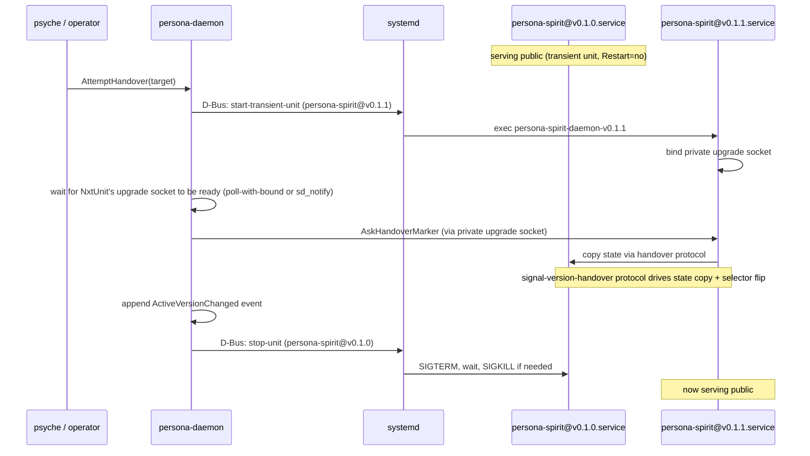

# 291 - Persona + systemd: should Persona use systemd units to manage component daemons?

*Designer analysis for psyche question 2026-05-22: "persona will be a
permissioned system daemon. should it use systemd units to manage the
daemons?" Spirit record 223 captures the system-daemon constraint;
this report sketches the trade-offs and recommends a hybrid.*

## TL;DR

**Yes, with the hybrid Persona ARCH §1.7 already contemplates**:
systemd starts the outer `persona-daemon` as a NixOS system unit;
for component daemons spawned by Persona, the production launcher
backend becomes **systemd-transient-units** (replacing the current
`DirectProcessLauncher`); the direct-fork backend stays for
development/integration sandboxes (`persona-dev-stack`). The upgrade
protocol (signal-version-handover) does NOT conflict with
systemd-transient-units — Persona keeps full orchestration control;
systemd provides standard sandboxing / cgroups / journald / restart.

## §1 What Persona ARCH §1.7 already says

The existing persona ARCH lines 706-718 explicitly contemplate this
direction:

> Component process supervision belongs behind an actor boundary.
> The manager may first use a direct child-process backend, but it
> should be driven by a data-bearing Kameo launcher/supervisor actor
> that owns child handles, process groups, readiness state, restart
> state, stop order, and lifecycle events. ... If systemd features
> become load-bearing for component children, the same launcher
> boundary may gain a systemd transient-unit backend with
> EngineId-scoped unit names, explicit unit properties, cgroup
> cleanup, resource accounting, credentials, sandboxing, journald
> visibility, and readiness/watchdog integration.

The launcher actor surface is already designed to support multiple
backends. The choice between `DirectProcessLauncher` (today) and a
future `SystemdTransientUnitLauncher` is a backend selection — the
manager's supervision protocol (over Unix sockets via
`signal-persona::SupervisionRequest`) doesn't change.

## §2 What systemd gives

| Feature | Direct-fork (today) | systemd-transient-unit |
|---|---|---|
| Process lifecycle (start/stop/restart) | Persona-owned via `DirectProcessLauncher` + child-exit watcher tasks | systemd-owned; Persona issues `start-transient-unit` / `stop-unit` via D-Bus |
| cgroup limits + resource accounting | manual; Persona would need to wire cgroups itself | first-class; declare in transient-unit properties |
| Sandboxing (`PrivateTmp`, `ProtectSystem`, etc.) | manual; spawn envelope would need to mint these | first-class via unit properties |
| journald logging | manual; child writes wherever envelope tells it | first-class; standard `journalctl --unit=<name>` access |
| readiness via `sd_notify` | not used; supervision socket does its own ready protocol | available; could complement supervision socket |
| restart policy on crash | Persona's `EngineSupervisor` actor handles this | systemd's `Restart=` directive handles this |
| operator visibility via `systemctl` | indirect — operator goes through `persona` CLI | direct — `systemctl --user list-units 'persona-engine-*'` works |
| D-Bus dependency | none | required |
| transient-unit teardown ordering | Persona writes it directly | systemd handles via dependency declarations |

The cost is the D-Bus dependency. Persona needs a sustained
connection to systemd to issue `start-transient-unit` / `stop-unit`
operations. For a permissioned system daemon running as the
`persona` system user, this is acceptable.

## §3 Does systemd conflict with the upgrade protocol?

No, with a small constraint: the transient unit's `Restart=` policy
must be `no` during the handover window (or the protocol's
finalization needs to coordinate with systemd's restart count).

Walk-through of an upgrade with systemd-transient-units:

Persona keeps the orchestration control. systemd just runs the
processes. The handover protocol exchange (private upgrade socket)
is entirely Persona-controlled and doesn't touch systemd.

## §4 Trade-off compared to direct-fork

| Concern | Direct-fork (current) | systemd-transient-unit |
|---|---|---|
| Latency to spawn child | low (one `fork()` + `exec()`) | higher (D-Bus round-trip + systemd transient-unit creation) — measured in low-ms |
| Reliability of teardown | Persona-managed; if Persona crashes between fork and signal, orphan possible | systemd's child-management handles orphans even if Persona crashes |
| Audit / observability | spawn envelope file + supervision-socket events | spawn envelope + systemd journal + `systemd-cgls` |
| Test isolation in development | trivial — direct-fork in sandbox runs in process | needs `--user` systemd or a separate test approach |
| Production sandboxing | manual (would have to wire cgroups, namespaces, etc.) | declarative via unit properties |
| Crash recovery of child | Persona's restart actor | systemd's `Restart=` directive (or `Restart=no` if Persona owns it) |
| Operator inspection | through `persona` CLI | through `persona` CLI **plus** `systemctl`/`journalctl` |

For a **permissioned production daemon**, the systemd-side wins on
sandboxing, journald, cgroups, and operator visibility — all
substantial. For **development**, direct-fork stays simpler.

## §5 Recommendation: hybrid

1. **Persona itself**: a NixOS systemd unit (`persona.service`,
   `User=persona`, `Group=persona`, dependencies on the right
   sockets). Standard system-daemon install. This is uncontroversial.
2. **Production component daemons spawned by Persona**:
   `SystemdTransientUnitLauncher` backend. Engine-id-scoped unit
   names (`persona-engine-<engine-id>-<component>.service` as transient
   units). Unit properties declare cgroup limits + sandboxing.
   `Restart=no` during the handover window (Persona owns restart);
   reverts to `Restart=on-failure` after handover completes.
3. **Development component daemons** (in `persona-dev-stack`):
   `DirectProcessLauncher` stays. Sandbox runs run in process; fast
   iteration; no systemd dependency for tests.
4. **Backend selection**: configuration on the manager actor at
   startup time. Production NixOS module sets
   `PERSONA_LAUNCHER_BACKEND=systemd-transient`; development scripts
   default to `direct-fork`.

Both backends implement the same `LauncherActor` trait (per
`persona/src/launcher.rs` or equivalent — actual file path is
operator's call). The supervision protocol over Unix sockets stays
unchanged.

## §6 Implementation order

Three slices (each a separate bead under `primary-a5hu` epic, or
file-and-go):

1. **Slice A**: Wire `persona.service` as a NixOS module. Persona
   starts via systemd as the outer process. This unblocks the
   "permissioned system daemon" framing concretely. Probably 1 day
   for system-specialist.
2. **Slice B**: Implement `SystemdTransientUnitLauncher` as a new
   backend alongside `DirectProcessLauncher`. Both backends remain;
   selection is config-driven. Likely 1 week for operator (or
   system-specialist if the D-Bus integration touches privileged
   surfaces).
3. **Slice C**: Smoke-test the upgrade protocol via transient units.
   Confirm Persona's orchestration still works when next-daemon is
   spawned via systemd. Confirm the `Restart=no` window doesn't
   interact badly with `HandoverCompleted` reception.

Slice A is independent of the upgrade protocol; can land any time.
Slices B and C are a unit; slice C verifies B.

## §7 What's NOT changing

- The supervision protocol (over Unix sockets via
  `signal-persona::SupervisionRequest`) is unchanged. The launcher
  backend doesn't see Signal traffic; only `LauncherActor` and
  child-handle ownership change.
- The upgrade protocol (signal-version-handover) is unchanged. It
  runs over the private upgrade socket regardless of how the daemon
  was spawned.
- `signal-persona::SpawnEnvelope` is unchanged. Both backends write
  the envelope file before the child starts; the child reads it the
  same way.
- The `ResolvedComponentLaunch` Rust struct stays. It carries
  executable path, argv, environment, etc. Both backends consume it;
  one forks directly, the other constructs a transient-unit
  description from it.

## §8 Open questions / unknowns

- **D-Bus integration shape in Persona**. Likely `zbus` crate
  (workspace-Rust-native; per record 155 pure-Rust preference).
  System bus or session bus? Almost certainly system bus given
  Persona's privileged position.
- **systemd version requirements**. Transient units have been
  stable since systemd 235 or so; CriomOS systemd version is well
  past that — no concern but worth verifying.
- **cgroup v2 vs v1**. Transient units' cgroup story is cleaner
  under v2; CriomOS uses v2 (default since systemd 232+) so no
  concern.
- **Watchdog / health monitoring**. Persona's supervision-socket
  protocol already does this. Should `Watchdog=` directives layer
  on top (defence in depth), or stay only in Persona? Lean: stay
  only in Persona — the supervision socket is more semantic than
  systemd's watchdog ping.
- **Failure cross-talk during handover**. If systemd kills next-unit
  for OOM during state copy, the handover protocol should detect
  via the socket dying. Persona's existing recovery
  (`RecoverFromFailure` per persona-spirit@e5dadc24 + persona@f82d180e)
  handles this case; verify in slice C.

## See also

- `~/primary/reports/designer/287-version-handover-component-explained.md` — the canonical handover visual
- `~/primary/reports/designer/290-persona-arch-diff-suggestions-2026-05-22.md` — recent persona ARCH diff
- `/git/.../persona/ARCHITECTURE.md` §1.5 (engine manager model) + §1.7 (startup strategy) — the design surface this report sits inside
- Spirit record 223 (this session): persona-permissioned-system-daemon
- Spirit records 208, 209, 210 — persona-engine-as-upgrade-orchestrator
- Recent operator landings:
  - `persona-spirit@e5dadc24` — RecoverFromFailure returns failed readiness window to Active
  - `persona@f82d180e` — Persona calls RecoverFromFailure if completion fails after readiness
  - `persona@d93c6d54` — DriveVersionHandover records UpgradePrepared before socket I/O
