*Kind: Synthesis · Topic: designer-lane-top-issues · Date: 2026-05-22*

# 292 — Designer-lane top issues + proposed solutions

*Per psyche 2026-05-22: "do a visual of like the most important issues with the proposed solutions of what he was mostly working on … two or three things … do good research on how things are working now and especially is there a new library that involves this that has been updated or panning design that we could incorporate." Designer counterpart to `reports/second-designer/154-effect-emitted-and-public-routing-designs-2026-05-22.md`. Spirit records 200-246 absorbed; visual constraint per record 243.*

## TL;DR

Three issues are most load-bearing in the designer lane right now. **(1) Strategic drift on `primary-c2da` (the /249 gap-closure epic)**: psyche set this as the primary designer focus in record 166, but the session went into migration architecture (`primary-ib5n`, `primary-yp6k`, Persona) instead — 24 of 35 gaps are still open. Lean: explicit psyche call between "ratify drift" (record 204+205 reprioritised toward mind+orchestrate anyway, so finish the migration first) vs "return to gap closure now". **(2) `primary-a5hu` (Persona epic) is too broad to be one bead**: it carries five separable axes with no internal definition-of-done per axis. Lean: decompose into five sub-beads with the existing scope items as their charters; keep the parent as an umbrella. **(3) Vocabulary divergence — settled-but-not-applied**: records 181 (main/next), 215/216 (Persona naming), 199/240 (engine-management Axis 2 socket rename) all decided, none applied across the architecture surface. Lean: a one-shot mechanical sweep, not a thinking task. External library finding worth surfacing: **winnow 1.0.0** (released 2026-03-17) and **kameo 0.16** (new `Scheduler` actor + libp2p `Behaviour`) and **unitbus** (Rust SDK for systemd transient units over DBus, candidate building block for the `UnitController` systemd backend per record 240).

# Issue 1 — `primary-c2da` (/249 gap closure) is the primary focus per record 166 but hasn't started

## §1.1 The problem

Spirit record 166 (workspace Decision, Maximum certainty) set `/249` gap closure as the **primary designer focus next sessions**. The gap analysis in `reports/designer/249-component-intent-gap-analysis.md` inventoried 35 gaps across the persona ecosystem; per `/282` only 3 closed, 8 partial, 24 still open. Subsequent session work focused on migration architecture (Spirit smart handover, Persona, version-handover protocol, schema-spec language) — load-bearing work, but not what record 166 named.

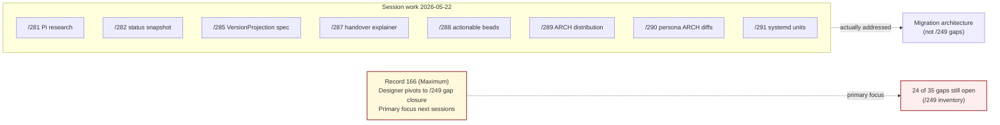

## §1.2 Why it's load-bearing

Two forces are in tension. Record 166 is Maximum certainty and recent. Records 204 (persona Decision: priority destinations are persona-mind + persona-orchestrate; Spirit→Mind owner contract DEFERRED) and 205 (persona Principle: sema-upgrade is structural prerequisite for any deployed persona component) — captured AFTER 166 — quietly reprioritised: mind+orchestrate first, gap-closure shape narrows. Bead `primary-c2da`'s NOTES section captured this internal pivot, but the bead is still `not started`.

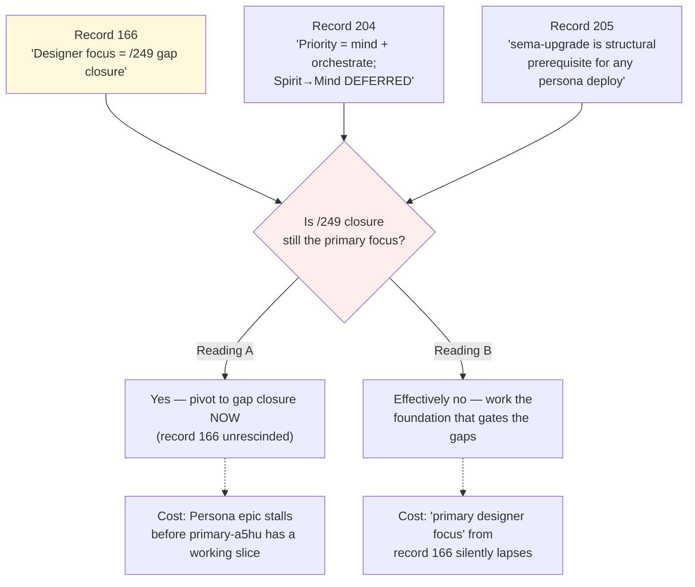

## §1.3 Candidate designs

### Design A — Explicit rescission of record 166

The psyche issues a Correction record: "Record 166 is superseded by the priority shift in records 204+205. Designer focuses on whatever the Persona slice needs (architecture for mind / orchestrate / supervised-component lifecycle). The /249 gap surface returns to focus after sema-upgrade + Persona land in production."

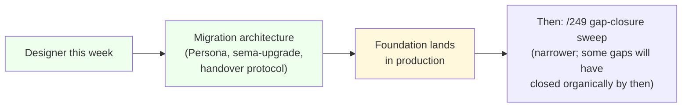

- Honest about what the session is doing
- Aligns workspace narrative with priority records 204/205
- Treats /249 as a follow-up sweep against a more-settled foundation
- Risk: gap closure keeps slipping; the "primary focus" honoured-in-the-breach pattern repeats
- Risk: a gap that should have been closed before sema-upgrade lands (e.g. Gap #3 persona INTENT.md, Gap #5 engine-manager triad-status) stays open

### Design B — Strict return to /249 gap closure NOW

Designer pauses migration-architecture report production, opens `/249`, picks the 5-7 highest-blocking-weight open gaps (Gaps 1, 2, 3, 5, 9, 11, 15 per /249 §13), and works each one to a psyche-clarification + manifestation pair.

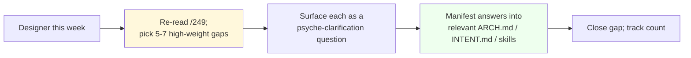

- Honors record 166 literally
- Forces psyche-clarification on the open architectural questions (Gap #1 Spirit→mind verb set; Gap #5 engine-manager triad-status; Gap #9 owner-signal emergence rules) — these are unblockers for downstream work
- Reduces total cognitive load on future migration work because the gaps stop accumulating
- Risk: blocks on psyche bandwidth for 5-7 clarifications
- Risk: some gaps depend on landed migration (Gap #29 memory_graph transitional shape can't close until typed mind graph exists)

### Design C — Hybrid: gap-as-side-channel during migration work

Designer continues migration-architecture work as primary, but **whenever a migration report would touch a /249 gap**, the report carries an explicit "Closes Gap #N" annotation and manifests the gap closure as part of its substance. Already partially happening — `/291` (systemd units) effectively addresses parts of Gap #5 (engine-manager triad-status); `/285` (VersionProjection spec) effectively addresses parts of Gap #11 (Mutate-chain partial-failure).

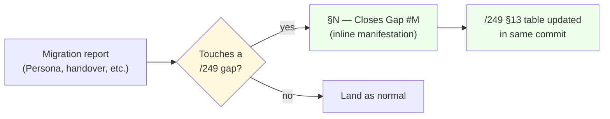

- Combines both forces — migration progresses, gaps close opportunistically
- Honors both record 166 ("gap closure") and records 204/205 ("priority is mind+orchestrate via migration")
- Already partially the de-facto state; just needs explicit accounting
- Risk: gaps that no migration report touches (Gap #6 system unpause, Gap #19 engine-per-spirit, Gap #28 auth identifier naming) keep slipping
- Risk: "opportunistic" becomes "rarely"

## §1.4 Designer recommendation

**Design C (hybrid) for the next 2-3 sessions, then Design A (explicit rescission, return to gap closure as Design B after Persona has a working slice).**

The reasoning: the priority pivot in records 204+205 is real and recent (same session, captured by other agents); record 166's "primary focus" framing was authored before the priority shift. Continuing migration work with explicit gap-tracking honors both. After Persona + sema-upgrade reach production, the gap surface will have narrowed organically (some gaps close as side effects), and the remaining gaps will fall into clearer high/medium/low rebalance. The psyche then explicitly chooses A (formal rescission) and the gap closure becomes the new primary focus on a smaller, more-actionable surface.

If psyche prefers Design B (strict return now): designer pauses /288's recommended pickups (`primary-ib5n`, `primary-yp6k`, `primary-094p`) and works the 5-7 high-weight gaps as psyche-clarification questions. Migration architecture pauses; second-designer + operator continue migration without designer's input on architectural decisions.

If psyche prefers Design A (explicit rescission now): designer file a Correction record explicitly retiring 166's framing and the bead `primary-c2da` gets parked or retired.

## §1.5 Open psyche-attention item

The bead `primary-c2da` itself is at risk of becoming a "primary focus that nobody is working on" — a workspace-noise pattern that erodes the credibility of the "primary focus" framing for future records. Either it gets honored (Design B), formally rescinded (Design A), or its scope gets narrowed and integrated (Design C). The current state — open, P1, labelled `primary-focus`, untouched — is the worst of the three.

# Issue 2 — `primary-a5hu` (Persona epic) is too broad to be one bead

## §2.1 The problem

Bead `primary-a5hu` — second-operator: build out Persona — port persona-* components to signal-executor v4 + add upgrade orchestration — carries a scope statement with five separable axes, four landed-dependency-crates, and four DoD items. The scope as written is more like a small repository's worth of work than a single bead. The risk is that "in-flight" never reaches "done" because there's no internal milestone structure; partial progress on one axis is indistinguishable from no progress because none of the axes have their own definition-of-done.

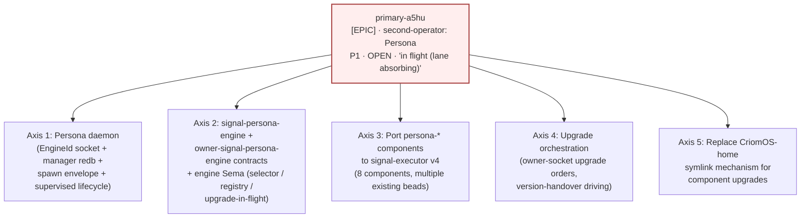

Each axis has different dependencies, different load-bearing decisions still open, and likely different ideal owners — yet they're all under one bead label.

## §2.2 Why it's load-bearing

Two structural reasons:

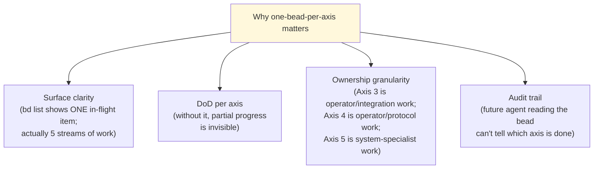

The bead has already started absorbing sub-scopes (the NOTES section mentions filing a separate systemd-transient-unit sub-bead). This is the workspace's way of telling itself: the bead is too big.

## §2.3 Candidate designs

### Design A — Decompose into five sub-beads under `primary-a5hu` as epic parent

`primary-a5hu` becomes the umbrella epic; each axis becomes a sub-bead (using the existing dotted-decimal convention `primary-a5hu.1` through `.5`, or fresh UIDs with `parent: primary-a5hu` link). Each sub-bead has its own DoD, priority, label, and ownership. Existing beads (`primary-c620` orchestrate executor migration, etc.) get linked under the appropriate axis sub-bead.

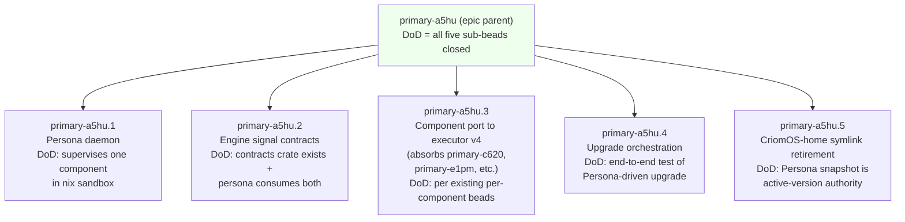

- Each axis trackable independently in `bd list`
- Per-axis DoD prevents the "partial-but-can't-tell" pathology
- Existing per-component beads (`primary-c620`, `primary-e1pm`, `primary-hj4`, etc.) link cleanly under Axis 3 without re-filing
- Risk: bead noise — 5 new sub-beads where there was 1
- Risk: cross-axis dependencies (Axis 4 needs Axis 1 + Axis 2) must be encoded as `blocks/blocked-by` links

### Design B — Promote each axis to its own peer bead; retire the umbrella

Each axis becomes a free-standing P1 bead with its own scope; `primary-a5hu` retires with a NOTES pointer to the successors. No epic-parent linkage; the lane-coordination level (orchestrate or second-operator's per-session reports) carries the cross-axis context.

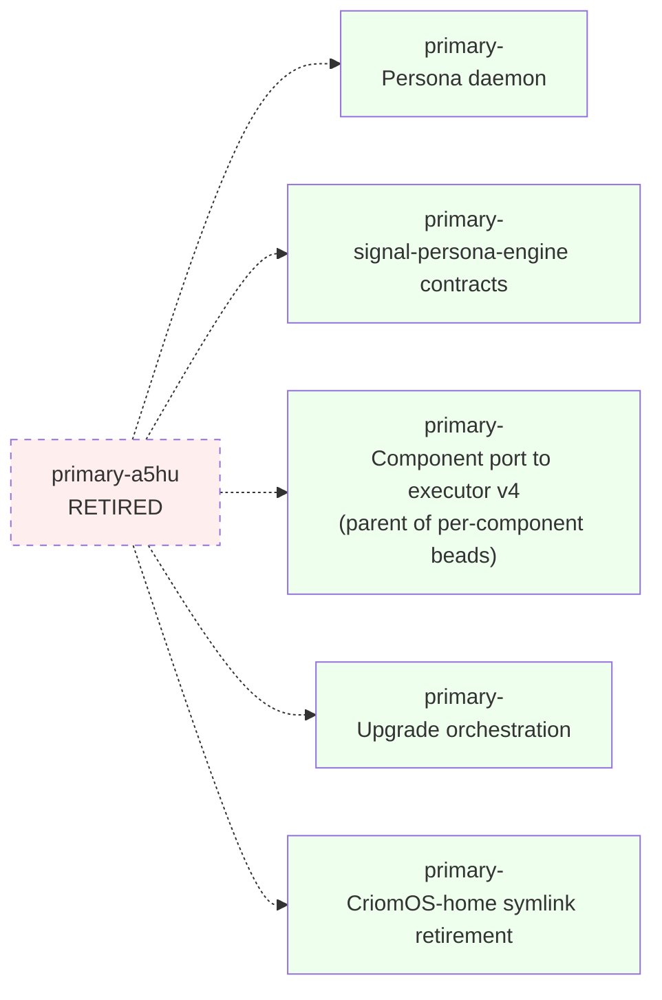

- Simpler bead structure (no parent/child)
- Each bead is a real unit of work without "what does the parent want" ambiguity
- Risk: loses the "this is all one coherent direction" framing — the Persona epic IS a coherent thing
- Risk: cross-bead context spread across many surfaces

### Design C — Keep `primary-a5hu` as-is, add internal milestone tracking inside the bead's NOTES

The bead stays one bead, but its NOTES section grows a milestone table: each axis has a row with status (planned / partial / done) and a per-milestone witness. Existing per-component beads stay linked via NOTES comments.

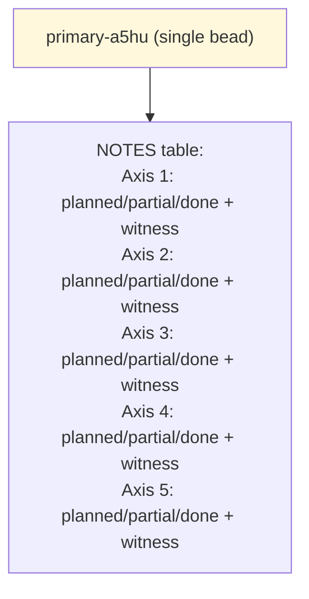

- Minimal disruption — no new beads filed
- Bead's NOTES is the existing milestone surface
- Risk: NOTES is plain-text; not queryable by `bd ready` / `bd list`
- Risk: the per-axis status drifts because nobody else looks at the NOTES — invisible from the outside
- Risk: doesn't help with the surface-clarity problem at all

## §2.4 Comparison

| Concern | Design A — sub-beads | Design B — peer beads | Design C — milestone NOTES |
|---|---|---|---|
| `bd list` clarity | 5 trackable items | 5 trackable items | 1 item, hidden state |
| Per-axis DoD | Yes (each sub-bead) | Yes (each peer bead) | Notional only |
| Existing per-component beads | Link under sub-bead | Link under peer bead | Stay independent |
| Cross-axis dependencies | Encoded as bead links | Encoded as bead links | Manual in NOTES |
| Epic coherence | Preserved (parent shows the whole) | Lost | Preserved |
| Filing cost | 5 new sub-beads | 5 new beads + retire 1 | Zero new beads |
| Ownership granularity | Per-axis owner labels | Per-axis owner labels | Single owner label |

## §2.5 Designer recommendation

**Design A (decompose into five sub-beads under the epic parent).**

The reasoning:

- The "5 axes, 1 bead" shape is already showing strain — the NOTES section is doing milestone-tracking work that the bead structure should do
- Existing dotted-decimal sub-bead pattern (`primary-36iq.1` through `.5` for the bracket-string NOTA migration; `primary-hj4.1` and `.1.4` for mind subscriptions) is the workspace's idiom for exactly this case
- The epic parent preserves "this is one direction" framing
- Per-axis DoD makes "in-flight" measurable
- Axis 3 (component port to executor v4) IS already an aggregator over existing per-component beads — making it explicit as `primary-a5hu.3` with the per-component beads as its blocks-on cleans up the dependency surface

Suggested decomposition with concrete DoD per sub-bead:

```text
primary-a5hu.1 — Persona daemon
  DoD: persona-daemon binary builds; supervises one persona-* in nix sandbox;
       passes manager_redb event-log + snapshot-rebuild Nix witness.

primary-a5hu.2 — signal-persona-engine + owner-signal-persona-engine contracts
  DoD: both contract crates exist with rkyv-encodable types; persona-daemon
       binds engine sockets and handles the engine-management verb set + owner
       verb set; one round-trip witness test per contract.

primary-a5hu.3 — Port persona-* components to signal-executor v4 (umbrella)
  DoD: all per-component port beads closed (primary-c620, primary-e1pm,
       primary-9os, primary-aunn, primary-gu7t, primary-qjdp, primary-li7a,
       primary-21gn, primary-krbi). One witness binary per component
       confirming executor v4 acceptance.

primary-a5hu.4 — Upgrade orchestration end-to-end
  DoD: persona-daemon receives an upgrade order on owner socket, drives
       version-handover protocol against a supervised component, flips
       active-version selector; integration smoke test passes.

primary-a5hu.5 — CriomOS-home symlink retirement
  DoD: CriomOS-home redeploys only on persona-daemon updates; per-component
       version selection lives in persona-daemon's snapshot table;
       documentation in CriomOS-home/skills.md updated.
```

If psyche prefers Design B (peer beads, retire parent): designer files 5 new beads and the parent retires with cross-links. Per-axis context spreads but each bead becomes a fully self-contained unit. Probably acceptable but loses the "this is all one Persona" anchor.

If psyche prefers Design C (milestone NOTES only): no work to file, but the surface-clarity gap remains and "in-flight" continues to mean nothing measurable for this bead.

# Issue 3 — Vocabulary divergence: decided in spirit, unapplied in workspace

## §3.1 The problem

Three vocabulary decisions are settled in spirit records (Maximum certainty) and unapplied across the architecture surface. The longer they stay unapplied, the more new reports + new ARCH text accumulate against the OLD vocabulary and need re-edit later.

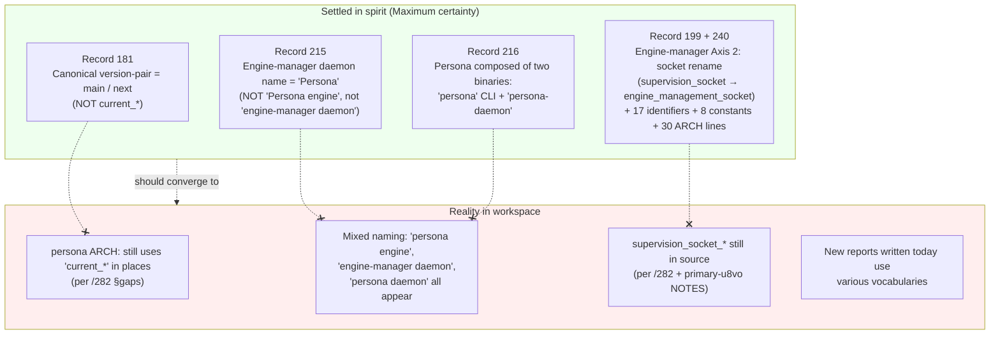

## §3.2 Why it's load-bearing

The cost grows quadratically with delay because every new report (designer/second-designer/third-designer/operator) lands content using whichever vocabulary felt natural at write-time, and the larger the unapplied surface gets, the harder a one-shot sweep becomes.

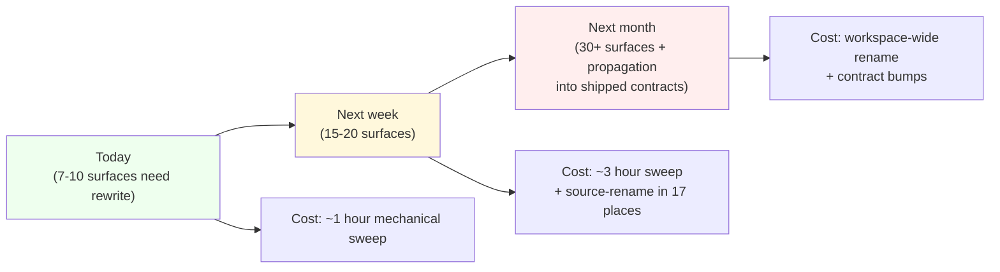

The current state is more like "Now" than "Soon", which is good — the sweep is still cheap. But the trajectory is the wrong direction.

## §3.3 Candidate designs

### Design A — One-shot mechanical sweep, single commit per vocabulary axis

Designer (or designer-assistant) runs three focused sweeps:

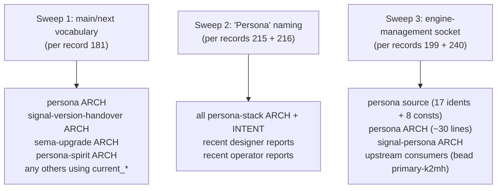

- Mechanical work; not a thinking task
- Cheap NOW; gets more expensive over time
- Sweep 3 (socket rename) blocks on operator's Axis-2 land-or-defer decision per `/282` Open critical point 4
- Each sweep is a discrete commit; easy to review

### Design B — Lazy convergence: every new report + ARCH edit uses the new vocabulary; old surfaces convert when next-touched

No upfront sweep. Designer + agents writing new content use only the canonical vocabulary; whenever an existing surface (ARCH / report) gets touched for any reason, the touching agent also fixes vocabulary in the same edit.

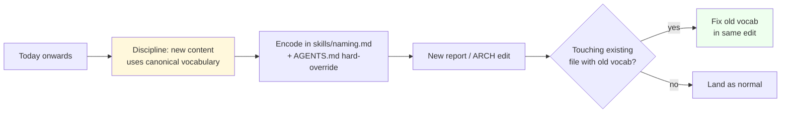

- No coordinated effort; happens incrementally
- Risk: surfaces that never get touched stay wrong forever
- Risk: enforcement depends on agents remembering — even with skills encoding
- Risk: vocabulary drift remains visible to readers indefinitely

### Design C — Encode in skills + a one-day lint task

Vocabulary discipline gets encoded as a checked rule in `skills/naming.md` (existing skill, already carries some naming rules). A small lint task runs across `reports/**`, `**/ARCHITECTURE.md`, and `**/INTENT.md` listing every occurrence of the OLD vocabulary; the report itself IS the input for Design A (the one-shot sweep). The lint task can then re-run after each sweep commit to verify convergence.

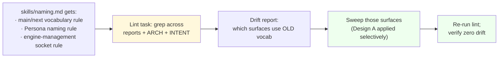

- Tool-assisted; the discipline is verifiable
- Skill encoding makes future drift detectable
- Risk: lint task is yet-another-tool; needs writing
- Risk: requires consistent grep patterns across enough variants — fragile

## §3.4 Designer recommendation

**Design A (one-shot mechanical sweep), with Design C's skill-encoding as the durable surface against future drift.**

The reasoning:

- Cost is cheapest now; trajectory worsens linearly
- Mechanical, not architectural — no decisions needed, just disciplined application of existing decisions
- Three discrete commits (one per axis) are easy to review and easy to back out if anything breaks
- Sweep 3 (socket rename) needs operator's land-or-defer call first (per /282 §"Engine-manager Axis 2") — that decision is a separate question, but the OTHER two sweeps don't depend on it
- skills/naming.md update lands alongside Sweep 1 to prevent future drift on the freshly-canonical surface

If psyche prefers Design B (lazy convergence): no upfront cost, but the workspace carries vocabulary drift indefinitely on surfaces that don't get touched. Probably acceptable if the long-term plan is workspace-wide ARCH rewrite anyway, but the principle "settled-but-not-applied is debt" should be encoded somewhere.

If psyche prefers Design C (lint-driven sweep): adds tooling overhead before the work; only worth it if the team plans more vocabulary-axis sweeps in the future (and there will be more — the `current_*` / `main`/`next` axis is one of several pending vocabulary corrections per intent log).

## §3.5 Research grounding — external libraries with recent updates

The vocabulary sweep itself is mechanical (no external library needed), but the **broader research surface** for the designer lane intersects three recently-updated Rust crates:

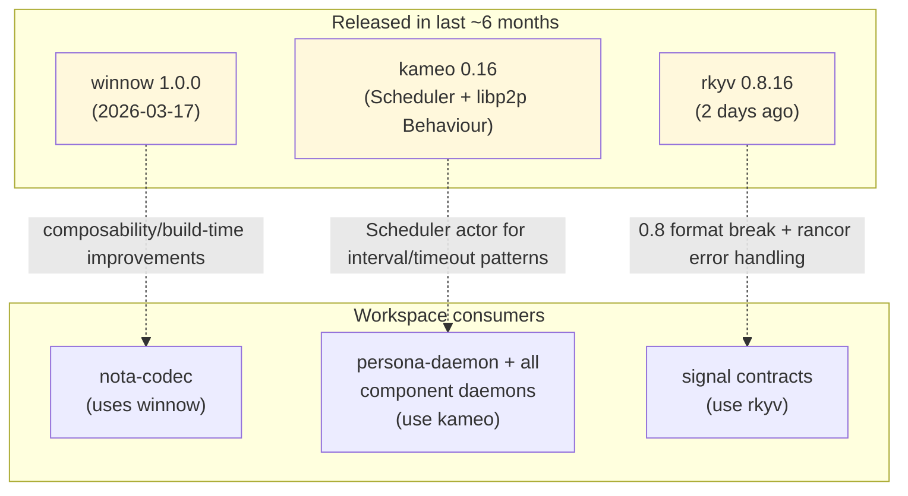

- **winnow 1.0.0** (released 2026-03-17): The "first stable release" framing means stability of API surface from here on. nota-codec depends on winnow per `skills/nota-design.md`; verifying the workspace is on 1.0.x (not 0.7.x) is a small chore worth scheduling as part of the bracket-string NOTA migration (`primary-36iq`).
- **kameo 0.16**: New `Scheduler` actor lets actors schedule messages at intervals / after timeouts. This is directly relevant to **subscription-lifecycle keep-alive**, **handover-protocol drain timeouts** (per /154 §2.6 Q2), and **Persona's bounded-reachability-probe** (per persona ARCH carve-out from push-not-pull). Worth surfacing for the next persona-engine implementation slice.
- **rkyv 0.8.16** (released this week): The 0.8 line is API-incompatible with 0.7. Workspace check: are signal-* contracts on 0.7 or 0.8? If 0.7, this is a forthcoming migration. The new `rancor` error handling lets contracts express failures more precisely — relevant to **EffectEmitted** payloads per second-designer/154.

A fourth relevant library worth flagging — not yet a workspace dependency:

- **unitbus** (Rust SDK for systemd transient units over DBus, `lvillis/unitbus`): purpose-built for "control units/jobs over the system D-Bus (systemctl-like), run transient one-shot tasks". This is the exact shape per record 240 (Persona uses systemd template units; `UnitController` trait with systemd-D-Bus backend). The workspace currently lacks an implementation crate for the systemd backend; either workspace writes one directly against `zbus_systemd` (per /291) or wraps `unitbus`. Worth a designer/operator look as part of `primary-a5hu.4` (upgrade orchestration).

# §4 Combined recommendation summary

| Issue | Recommendation | Spirit capture suggestion |
|---|---|---|
| 1. /249 gap closure deferred | Design C (hybrid: migration-with-explicit-gap-tracking) for now; Design A (explicit rescission) once Persona has a working slice | Decision (Medium): "/249 gap closure operates as side-channel to migration architecture for the next 2-3 sessions; primary focus is migration work per records 204+205; record 166 framing transitions to side-channel during this window" |
| 2. `primary-a5hu` too broad | Design A (decompose into five sub-beads) | Decision (Medium) — workflow choice, not architectural; bead-management call rather than spirit-record-worthy unless psyche wants the workspace-wide "epic = umbrella, axes = sub-beads" pattern formalised |
| 3. Vocabulary divergence | Design A (one-shot sweep) + Design C's skill-encoding | Decision (Maximum): "Settled-vocabulary records (181, 215, 216, 199, 240, etc.) MUST be applied within one session of capture; skills/naming.md carries the canonical vocabulary registry; the workspace treats divergence as bugs to sweep, not soft preferences" |

A combined session would: decompose `primary-a5hu` into five sub-beads (Issue 2 = mechanical, low risk), run the three vocabulary sweeps (Issue 3 = mechanical, low risk), and then defer the strategic choice on Issue 1 to a psyche decision. The two mechanical Issues clear in a few hours; the strategic Issue 1 deserves a psyche-attention moment.

# §5 Open psyche-attention items

The three issues above each carry exactly one psyche-attention question:

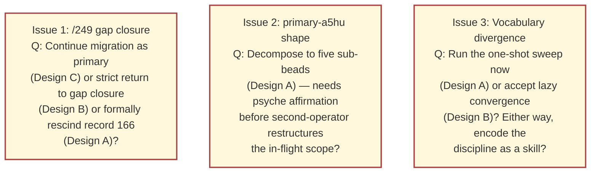

Issue 1 is the most psyche-load-bearing (strategic direction). Issues 2 and 3 are largely mechanical and can proceed with light affirmation.

# §6 See also

- `reports/designer/249-component-intent-gap-analysis.md` — the 35-gap inventory; central to Issue 1 (`primary-c2da` charter)
- `reports/designer/282-workspace-implementation-status.md` — current-state snapshot; Issue 1 status table + Issue 3 vocabulary drift catalogue
- `reports/designer/286-session-audit-2026-05-22.md` — what landed this session; corroborates Issue 1's "session went into migration"
- `reports/designer/288-actionable-beads-2026-05-22.md` — bead inventory; Issue 2's `primary-a5hu` and Issue 1's `primary-c2da` both featured
- `reports/designer/291-persona-systemd-units-for-daemon-management.md` — systemd backend design; Issue 3's `UnitController` rename scope + library-research grounding for unitbus / zbus_systemd
- `reports/second-designer/152-persona-engine-architecture-overview/` — meta-report; Issue 2's Persona scope context
- `reports/second-designer/153-refresh-after-prime-systemd-followups-2026-05-22.md` — refresh; carries the priority-pivot framing relevant to Issue 1
- `reports/second-designer/154-effect-emitted-and-public-routing-designs-2026-05-22.md` — exemplar shape; the design template this report follows
- Spirit records 166 (designer pivot to /249), 199 + 240 (engine-management socket rename), 181 (main/next), 204 + 205 (priority shift), 208 + 209 + 210 (Persona takes upgrade authority), 215 + 216 (Persona naming), 238 + 239 (Persona as permissioned system daemon)
- Bead `primary-a5hu` (Persona epic) — Issue 2 subject
- Bead `primary-c2da` (/249 gap-closure sweep) — Issue 1 subject
- External libraries: `winnow 1.0.0`, `kameo 0.16`, `rkyv 0.8.16`, `unitbus` / `zbus_systemd`
