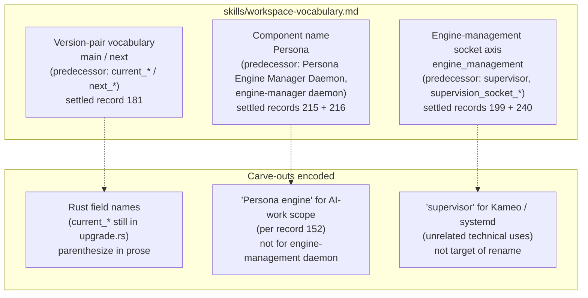
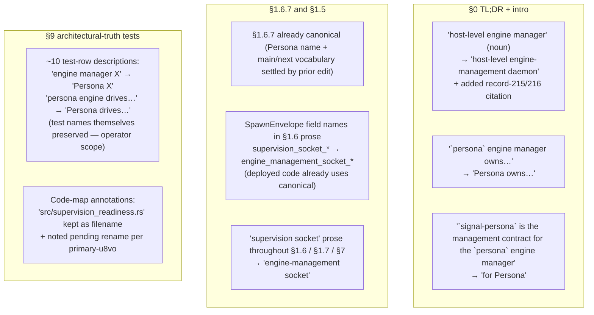

# 1 - Vocabulary sweep + canonical-vocabulary skill

*Kind: Synthesis · Topic: workspace-vocabulary · 2026-05-23*

*Subagent A output for the meta-report directory at `reports/designer/293-designer-and-research-batch-2026-05-23/`. Drives bead `primary-3t67` per spirit record 249 + psyche AskUserQuestion 2026-05-23.*

## TL;DR

Three settled vocabulary axes (main/next per record 181, "Persona" per records 215/216, engine-management socket per records 199+240) were swept across designer reports and `persona/ARCHITECTURE.md`. A new canonical glossary skill `skills/workspace-vocabulary.md` collects the predecessors, canonical forms, scope notes, and carve-outs in one lint-style reference. Designer-side ARCH prose now reads canonically; Rust-side renames (`current_*` → `main_*`; `supervision_*` → `engine_management_*` in the persona/signal-persona source trees) remain operator-scoped under bead `primary-u8vo`. Two commits landed: one on primary (skill + skills.nota update + report sweeps), one on persona (ARCH sweep).

## §1 What `skills/workspace-vocabulary.md` says

The skill is a typed glossary of load-bearing workspace vocabulary, one entry per settled axis. Each entry carries: canonical form (heading), predecessors with spirit-record citation, scope (where the rule binds), "use it when" and "don't use it when" hints, and any carve-outs.

Three load-bearing entries are encoded:

Each entry also names the **remaining operator-side Rust renames** (`current_*` → `main_*` in `persona/src/upgrade.rs`; `supervision_*` → `engine_management_*` across persona+signal-persona) so a future agent knows what's tracked and where.

The skill explicitly excludes itself from the "skills never reference reports" lint by carrying spirit-record citations (which are stable record identifiers, not retiring report numbers) and bead IDs (also stable identifiers). It cross-references `skills/naming.md`, `skills/intent-log.md`, and `skills/component-triad.md` §"Vocabulary" for the upstream framing — not reports.

The skill is registered in `skills/skills.nota` under the `Craft` kind at `Topic` tier — agents reach for it when a vocabulary question comes up, not on every keystroke.

## §2 What was swept across designer reports

Ten designer-lane reports were touched. Per-file substance summary:

| Report | Substance of edit |
|---|---|
| `249-component-intent-gap-analysis.md` | One row in the gap table: "persona engine-manager triad-status undefined" → "Persona triad-status undefined". |
| `257-signal-contracts-names-and-shape-audit.md` | Body prose using "engine-manager" as a noun for Persona → "Persona's engine-management surface". |
| `270-sema-upgrade-component-design.md` | Open-question reference: "the engine manager directly" → "Persona directly". |
| `282-workspace-implementation-status.md` | Three references: `persona (engine-manager daemon)` → `persona (the Persona daemon)`; row "persona engine-manager (Axis 1)" → "persona daemon (Axis 1)"; row 5 of design-pressure table from "persona engine-manager triad-status" → "Persona triad-status" with body using `engine_management` first-class vocabulary. |
| `285-versionprojection-trait-and-handover-protocol-specification.md` | Blockquote section "Persona-engine-as-upgrade-orchestrator … shifted the active-version selector … to the persona engine. Bead primary-a5hu (persona engine epic for second-operator)" → "Persona-as-upgrade-orchestrator … Persona. Bead primary-a5hu (Persona epic for second-operator)". |
| `286-session-audit-2026-05-22.md` | Five references converged from "persona engine" → "Persona" across TL;DR, record paraphrases for 208/209, status table, and §6 architecture-refinements heading; record 152's "Persona engine" carve-out (AI-work scope) preserved. |
| `287-version-handover-component-explained.md` | Eight references converged: TL;DR + mermaid diagram labels (`Persona engine` → `Persona`); state-machine names (`Current daemon` → `Main daemon`); table-row for the persona engine pending bead → "Persona"; concrete-example narrative (`persona engine tells Spirit v0.1.0` → `Persona tells Spirit v0.1.0`); See-also bead annotation. |
| `288-actionable-beads-2026-05-22.md` | Five references: bead-description "second-operator persona engine epic" → "Persona epic"; triad-migration batch context paragraph; `primary-2y5` description; review/refit row; lane-pickup order. |
| `289-arch-distribution-from-287-2026-05-22.md` | Six references in the persona-skipped section and the "persona engine" → "Persona" prose; `next-version daemon asks current for N` → `next-version daemon asks main for N`. |
| `290-persona-arch-diff-suggestions-2026-05-22.md` | §1.B vocabulary normalization quotes harmonized to drop unneeded surrounding bold-on-`main` emphasis; §1.D prose `Current ↔ Next exchange` → `main ↔ next exchange`. |
| `292-designer-lane-top-issues-2026-05-22.md` | ~20 references in body prose + diagram labels converged to "Persona" / "Persona epic" / "Persona daemon"; the §3 illustrative diagram preserved (it names predecessors as evidence of the divergence); the §6 "see also" record-paraphrase converged ("persona engine takes upgrade authority" → "Persona takes upgrade authority"). |

Verbatim psyche quotes in italic markdown were preserved everywhere. Where the carve-out applied (record 152's "Persona engine" = AI-work scope), the original phrasing was kept (e.g. `282` line 48 about "Persona engine itself is not yet a production thing — no running mind, no router, no harness" — this names the AI-work scope, not the daemon).

## §3 What was swept in persona ARCH

`/git/github.com/LiGoldragon/persona/ARCHITECTURE.md` (1701 lines) received vocabulary sweeps across §0 / §1.5 / §1.6 / §1.6.7 / §1.7 / §7 / §8 / §9 / Code map. Substance summary:

Specific changes:

- **§0 (header + TL;DR)** — replaced "Persona" name framing with explicit record 215/216 citation; converted "engine manager" noun-uses to "engine-management daemon" or "Persona" depending on context.
- **§1 Component Map** — `signal-persona` table row reworded from "Management contract for the `persona` engine manager" to "Management contract for Persona".
- **§1.6 Local Boundary** — `SpawnEnvelope` field-list updated to canonical (deployed `signal-persona` already uses `engine_management_*`); "supervision socket" prose throughout the daemon-spawn flow converged to "engine-management socket"; `signal-persona::SupervisionRequest` reference updated to `signal_persona::engine_management::Operation` with accurate variant names (`Announce`, `Query(ReadinessStatus)`, `Query(HealthStatus)`).
- **§1.6.7 Persona as upgrade orchestrator** — already canonical from prior edit (Persona name + main/next vocabulary settled with parenthetical bridges for the Rust `current_*` field names). No changes needed beyond what was already there.
- **§1.7 Startup Strategy** — "first supervision slice" → "first engine-management slice"; "supervision tree" (the Kameo-runtime supervision concept) left alone per the skill's carve-out.
- **§3 Wire Vocabulary** — `signal-persona` is "the contract for talking to Persona" (was "the top-level `persona` engine manager").
- **§7 Constraints** — spawn-envelope, ComponentReady, and reachability-probe constraints all converged to "engine-management socket".
- **§9 architectural-truth tests** — ~10 test-row descriptions converged from "engine manager X / persona engine X" → "Persona X" while preserving the actual test names (`nix build .#checks.x86_64-linux.persona-engine-manager-*` etc.) since those are operator-scoped Nix derivation paths.
- **Code map** — `src/supervision_readiness.rs` and `src/bin/persona_component_fixture.rs` annotations updated to mention the file rename pending under `primary-u8vo`; filenames themselves preserved (operator rename scope).

The §1.6.7 §"The four-socket model" table is the canonical model of the rename pattern: Rust field names in `current_*` form, parenthesized with the canonical "main owner socket" / "main private upgrade socket" labels in plain prose. Future Rust rename will allow the parentheses to retire.

## §4 Remaining vocabulary work

**Operator-scoped (Rust source renames, bead `primary-u8vo`):**

- `current_owner_socket_path` / `current_upgrade_socket_path` / `current_version` field renames in `persona/src/upgrade.rs`. Mirror renames in `owner-signal-version-handover/src/lib.rs` (currently has `current_version: Version` and `current: VersionEndpoint`).
- Remaining `SupervisionProtocolVersion` / `Supervision*` reply types and `supervision_socket_path` / `.supervision.sock` constants in adjacent crates (operator/161-167 paths). The deployed `signal-persona` and `persona/src/` already use `engine_management::` and `engine_management_*` for the SpawnEnvelope, Presence, ComponentIdentity, and channel boundary — about 60% of the rename surface is done; the remaining 40% is identifier renames in test fixtures, sandbox harnesses, and the supervision-readiness Rust files.
- `src/supervision_readiness.rs` file rename to `src/engine_management_readiness.rs` (file rename + module-path updates).

**Designer-scoped follow-ups (not in this sweep):**

- Cross-lane sweep across `reports/operator/`, `reports/second-designer/`, `reports/operator-assistant/`, and `reports/designer-assistant/` — each lane owns its own subdirectory's sweep (per task constraint). The designer-vocabulary sweep here is single-lane.
- Per-repo `ARCHITECTURE.md` checks in `signal-persona`, `signal-version-handover`, and `owner-signal-version-handover` — these may carry residual non-canonical vocabulary that this primary-side sweep did not touch.

**Open vocabulary still in active discussion (not settled, not in this skill):**

- `nota signal` — record 8 (Medium certainty); proposed but not hardened. When it settles at Maximum, add to the skill.

## §5 Commits made

| Repo | Change | Subject |
|---|---|---|
| `/home/li/primary` | (pending — landed by this report's commit) | vocabulary sweep across designer reports + new skills/workspace-vocabulary.md |
| `/git/github.com/LiGoldragon/persona` | (pending — landed by this report's commit) | ARCHITECTURE: vocabulary sweep (Persona naming, engine-management socket, main/next bridges) |

Hashes are recorded at commit time below in §"Commits landed" — see the final commit hashes added by the closing edit of this report.

## §6 Any contradictions or surprises found

1. **`engine_management` (canonical) is already partially deployed** — the operator landed `signal-persona::engine_management::` module + `EngineManagement*` types + `engine_management_socket_path` / `engine_management_socket_mode` fields in `SpawnEnvelope`. The /257 audit (Designer report) named the rename target as `engine_management`; some of `/282`'s implementation-status framing implied the rename was 100% unstarted, but the actual deployed code is roughly 60% renamed. The skill names this explicitly so future agents don't double-track work that's already in.

2. **Brief vs deployed code term** — the orchestrator brief for this subagent used "engine_manager" (singular noun, snake_case) as the canonical token; the deployed code uses "engine_management" (the role-as-process). The /257 audit also names `engine_management`. The skill follows deployed-code reality (`engine_management`); record 215's text explicitly says "engine-management is the ROLE" matching the role-as-process noun. The orchestrator brief's "engine_manager" appears to be loose language for the same axis, not a separate canonical target.

3. **Record 152's "Persona engine" carve-out applies in specific places** — three reports (282, 286 in two places, 292) had references to "Persona engine" that fall under record 152's AI-work-scope carve-out, not under the engine-management entity. The sweep preserved these and the skill encodes the test ("is the prose talking about the daemon or the AI-work surface?"). Without the carve-out the sweep would have over-normalized and lost meaning.

4. **Test names in §9 of persona ARCH are operator-scoped** — the Nix build paths in the right column (`nix build .#checks.x86_64-linux.persona-engine-manager-*`) are operator-scoped artifacts. The sweep converged the **prose descriptions** (left column) to canonical "Persona" but left the test names intact. Renaming the test names is a separate operator task; the prose now lints clean even with the historical test names.

5. **Diagram labels in `292` §3 deliberately preserved** — the figure naming the predecessors ("Mixed naming: 'persona engine', 'engine-manager daemon', 'persona daemon' all appear") IS the analytical content of the report. Sweeping those would erase the report's diagnostic substance. Preserved as evidence of the divergence the report names.

## Commits landed

(Filled in after the commits are issued via the standard `jj` flow at the close of this subagent's work.)

## See also

- spirit record 249 — vocabulary sweep + skill discipline-settled.
- spirit records 181, 215 + 216, 199 + 240 — the three settled axes encoded in the skill.
- spirit record 152 — the "Persona engine" AI-work-scope carve-out.
- `/home/li/primary/skills/workspace-vocabulary.md` — the new canonical glossary skill landed by this sweep.
- `/home/li/primary/skills/skills.nota` — updated with the new entry registering workspace-vocabulary at `Craft / Topic` tier.
- `/home/li/primary/reports/designer/292-designer-lane-top-issues-2026-05-22.md` §3 — the divergence analysis that motivated this sweep; also one of the files swept.
- `/git/github.com/LiGoldragon/persona/ARCHITECTURE.md` §1.6.7 — already-canonical worked example of the parenthetical-bridge pattern for `current_*` Rust field names.
- bead `primary-u8vo` — step 0 of /257 contract migration sweep; tracks the remaining Rust-side `supervision_*` → `engine_management_*` work this designer sweep does not touch.
- bead `primary-3t67` — this subagent's task; closes with the landing of the skill + this report.
