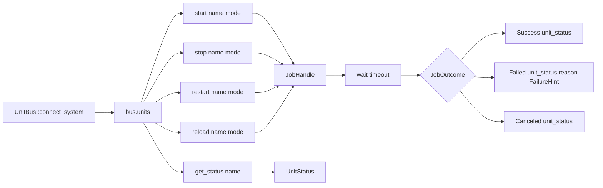

# 2 - `unitbus` research for the SystemdTransientUnitLauncher backend

*Subagent B output, session
`reports/designer/293-designer-and-research-batch-2026-05-23/`. Drives
bead `primary-lm9o`; informs the implementer of bead `primary-a5hu.4`
(SystemdTransientUnitLauncher). Spirit records 240, 250, /292 §3.5.*

## TL;DR

`lvillis/unitbus` is a single-author, MIT-licensed, ~7-month-old Rust
SDK at version **0.1.8** (released 2026-04-23, edition 2024, msrv
1.95). Its public surface — `UnitBus::connect_system()`,
`Units::{start, stop, restart, reload, get_status}`,
`Tasks::run(TaskSpec) -> TaskHandle`, `JobHandle::wait(timeout) ->
JobOutcome`, `TaskHandle::wait(timeout) -> TaskResult` — maps almost
one-to-one onto the `UnitController` and transient-task shapes
called for by record 240 and `primary-a5hu.4`. **Recommendation:
adopt `unitbus` behind a thin internal `UnitController` trait** for
slice B, but vendor a copy (or pin a git revision) until upstream
gains a second contributor or a tagged 0.2 with stability commitments.
Hand-rolled `zbus` against `org.freedesktop.systemd1` is feasible
(~600-1200 LOC for our subset) but reinvents work `unitbus` has
already done correctly — including JobRemoved signal handling,
unit-status property decoding, transient-unit naming, and
`StartTransientUnit` aux-properties.

## §1 What `unitbus` is

| Fact | Value |
|---|---|
| Repository | `https://github.com/lvillis/unitbus` |
| Crate | `unitbus` on crates.io |
| Latest version | 0.1.8 |
| Released (latest) | 2026-04-23 |
| Created | 2026-01-02 |
| Last push | 2026-04-23 |
| License | MIT |
| Author | `lvillis` (solo) |
| Stars / forks / issues | 0 / 0 / 0 |
| Rust edition | 2024 |
| MSRV | 1.95 |
| Build deps (default) | `zbus 5.14`, `futures-lite`, `futures-util`, `thiserror`, `sdjournal`, `blocking`, `async-io` |
| Optional runtimes | `rt-async-io` (default), `rt-tokio` |
| Categories | `os::linux-apis` |
| Tests | `tests/integration_linux.rs` (~13 KB; one file, Linux-gated) |

Stated scope from `lib.rs`:

> "unitbus is a Rust SDK for Linux systemd: control units/jobs via
> the system D-Bus (systemctl-like), run one-shot transient tasks,
> and query journald logs (default: pure Rust backend). It is
> designed as a control-plane foundation for traditional deployments
> (non-Kubernetes) and CD/agent tooling."

Source code organisation (under `src/`):

- `bus.rs` (~11 KB) — D-Bus connection wrapper around `zbus`.
- `units.rs` (~37 KB) — `Units`, `Tasks`, `Config` handles; the bulk
  of the work.
- `manager.rs`, `observe.rs`, `journal/`, `capabilities.rs`,
  `fsutil.rs`, `blocking_api.rs`.
- `types/` — typed snapshots: `UnitStatus`, `JobOutcome`,
  `FailureHint`, `TaskSpec`, `TaskResult`, `ServiceUnitSpec`,
  `Properties`.

Internal hygiene signals: `#![forbid(unsafe_code)]` and
`#![deny(clippy::{unwrap_used, expect_used, panic, todo, unimplemented,
dbg_macro})]`. All public types are `#[non_exhaustive]`. This is more
defensive than typical 0.1.x crates.

Tag history (commit `9481906`, 2026-04-23): 0.1.1 → 0.1.2 → 0.1.4 →
0.1.5 → 0.1.6 → 0.1.7 → 0.1.8, with 0.1.3 missing on the tag stream
(probably yanked). Recent commits show steady feature work: 0.1.6
added "manager APIs and unit properties", 0.1.7 added "manage service
unit files", 0.1.8 is a deps bump.

## §2 API surface for the SystemdTransientUnitLauncher use case

Spirit record 240 calls for an internal `UnitController` trait that
abstracts unit lifecycle. The systemd backend (`primary-a5hu.4`)
needs three families of operations:

1. **Persistent unit control** for the eventual `persona.service`
   self-management path (start, stop, restart, status of named units).
2. **Transient unit launch** for component daemons spawned per
   engine-id (the actual `SystemdTransientUnitLauncher` semantics).
3. **Job-completion waiting** with a normalised success/failure
   outcome.

`unitbus` covers all three.

### 2.1 Persistent unit control



Verbatim signatures from `src/units.rs`:

```rust
pub async fn start(&self, unit: &str, mode: UnitStartMode) -> Result<JobHandle>;
pub async fn stop(&self, unit: &str, mode: UnitStartMode) -> Result<JobHandle>;
pub async fn restart(&self, unit: &str, mode: UnitStartMode) -> Result<JobHandle>;
pub async fn reload(&self, unit: &str, mode: UnitStartMode) -> Result<JobHandle>;
pub async fn get_status(&self, unit: &str) -> Result<UnitStatus>;
```

`JobOutcome` (from `src/types/unit.rs`):

```rust
pub enum JobOutcome {
    Success { unit_status: UnitStatus },
    Failed  { unit_status: UnitStatus, reason: FailureHint },
    Canceled{ unit_status: UnitStatus },
}
pub enum FailureHint {
    NotLoaded { load_state: LoadState },
    ExecMainFailed { exec_main_code: i32, exec_main_status: i32 },
    UnitFailed { result: Option<String> },
    JobFailed { result: String },
    UnexpectedState { active_state: ActiveState, sub_state: Option<String> },
    Unknown,
}
```

That `FailureHint` enum is exactly the diagnostic shape Persona will
want to feed into its supervision-event log — `unitbus` already does
the property-readback after JobRemoved to distinguish "service
started then failed at runtime" from "systemd never managed to run
it". Re-implementing that classification by hand is not free.

### 2.2 Transient unit launch (`tasks` feature)

```rust
pub struct TaskSpec {
    pub argv: Vec<String>,
    pub env: BTreeMap<String, String>,
    pub workdir: Option<String>,
    pub timeout: Duration,        // also applied as TimeoutStartUSec
    pub name_hint: Option<String>,
}
pub struct TaskHandle {
    pub unit: String,    // unitbus-<ts>-<nonce>.service
    pub job_path: String,
    // …
}
pub struct TaskResult {
    pub unit_status: UnitStatus,
    pub exit_status: Option<i32>,
    pub signal: Option<i32>,
}

// Usage:
let bus  = UnitBus::connect_system().await?;
let task = bus.tasks().run(spec).await?;
let res  = task.wait(Duration::from_secs(30)).await?;
```

This is the **exact shape Persona needs** for engine-id-scoped
component daemons. The naming hint (`name_hint`) lets us set it to
`persona-engine-<engine-id>-<component>` so the resulting transient
unit becomes
`unitbus-<ts>-persona-engine-<engine-id>-<component>.service`
(or we wrap and pre-sanitise to match /291's stated
`persona-engine-<engine-id>-<component>.service` form — `unitbus`
forces the `unitbus-` prefix on auto-named transients, which is a
small naming-convention friction point worth confirming with upstream
or patching via the `ServiceUnitSpec` path).

Gap in `TaskSpec` vs Persona's needs:

- No direct knob for `Restart=no` (relevant during /291's handover
  window where Persona owns restart). `unitbus` exposes `ServiceUnitSpec`
  for config-file generation but the **transient** path uses
  hardcoded properties internally. The implementer should check
  `src/units.rs:782+` (the `Tasks::run` body) for which aux-properties
  unitbus sets, and either submit upstream PR or fork — this is the
  single biggest fit risk.
- No direct knob for cgroup limits, sandboxing, or `RuntimeMaxUSec`.
  Same notes apply — likely a small upstream PR or a vendored
  modification.

### 2.3 Trait sketch

```rust
#[async_trait]
pub trait UnitController: Send + Sync {
    async fn start_persistent(&self, unit: &str) -> Result<UnitOutcome>;
    async fn stop_persistent(&self, unit: &str) -> Result<UnitOutcome>;
    async fn restart_persistent(&self, unit: &str) -> Result<UnitOutcome>;
    async fn status(&self, unit: &str) -> Result<UnitStatusSnapshot>;

    async fn launch_transient(&self, spec: TransientLaunchSpec)
        -> Result<TransientHandle>;
    async fn wait_transient(&self, handle: TransientHandle, deadline: Duration)
        -> Result<TransientOutcome>;
}
```

A `unitbus`-backed `SystemdTransientUnitController` is a thin shim:
each trait method delegates to one `unitbus` call and translates
`unitbus::Error` → workspace `Error`, `JobOutcome` →
`UnitOutcome`. Probably **80-150 LOC** of pure translation glue.

## §3 Comparison to hand-rolled `zbus`

| Dimension | `unitbus` adoption | Hand-rolled `zbus_systemd` / `zbus` |
|---|---|---|
| LOC for slice B | ~80-150 (shim layer) | ~600-1200 (D-Bus proxies + job-watcher + property decoding + error classification + transient-unit naming) |
| Compile-time deps added | `unitbus` (transitively pulls `zbus 5.14`, `futures-lite`, `thiserror`, `sdjournal`, `blocking`, `async-io`) | `zbus 5.x` + `zbus_systemd` (or hand-written proxy macros) + same async ecosystem |
| Runtime selection | feature-flag (`rt-async-io` vs `rt-tokio`) — matches workspace pattern | full control |
| JobRemoved signal handling | done internally by `unitbus` | must implement (signal subscription, match-rule, route to per-job waiters) — this is the trickiest part of a hand-roll |
| UnitStatus property decoding | done; `UnitStatus`, `Properties`, `LoadState`, `ActiveState` typed | must hand-decode `a{sv}` property bags |
| FailureHint classification | done; readback after JobRemoved | must implement |
| Transient unit naming | done (auto `unitbus-<ts>-<nonce>-<hint>.service`) | trivial to roll |
| Aux-property control (cgroup, Restart=, sandbox) | partial — wrap via `ServiceUnitSpec` for persistent units; transient path is opaque without source patch | full control |
| Operator inspection (`systemctl status`, `journalctl`) | identical — both produce real systemd units | identical |
| Cross-platform compile | `unitbus` returns `Error::BackendUnavailable` cleanly on non-Linux | we'd need to add `cfg(target_os = "linux")` gates ourselves |
| Maintenance load on workspace | small (track `unitbus` releases; one upstream PR ceiling for aux-property tweaks) | larger (own all the D-Bus surface; carry the proxy-keep-current cost when zbus or systemd change) |

LOC estimate for the hand-rolled path is grounded in:

- `lvillis/unitbus` itself is ~75 KB of Rust across `bus.rs` + `units.rs`
  + `types/unit.rs` (the subset of `unitbus` that maps onto our needs).
  We don't need the journal, config, observe, or capabilities surface,
  so a focused workspace implementation is maybe 35-50% of that. That
  gives the ~600-1200 LOC band.
- `zbus_systemd` provides the proxy stubs for the daemon-side API but
  not the JobRemoved-routing or unit-status-readback choreography
  Persona actually needs. The latter is the hard part.

## §4 Maintenance posture

**Facts:**

- Single author (`lvillis`), no other committers visible in recent history.
- 0 stars, 0 forks, 0 issues on GitHub. The crate isn't yet
  discovered; not necessarily a quality signal but is a maintenance
  signal — no external pressure or contribution flow.
- Active for ~4 months (created 2026-01-02, last push 2026-04-23).
- Eight tagged releases in that window — steady cadence (~bi-weekly).
- Recent commits mix release-chore with substantive feature work:
  manager APIs (0.1.6), service unit files (0.1.7), deps bump (0.1.8).
- `tests/integration_linux.rs` exists (~13 KB, one file) — suggests
  some integration coverage, though unit-test depth across `units.rs`
  is not separately visible.
- Strict internal hygiene: `forbid(unsafe_code)`, hard-deny on
  `unwrap`/`expect`/`panic`/`todo`. More disciplined than typical
  0.1.x crates.
- Public types are `#[non_exhaustive]` — versioning is considered.
- Categories on crates.io are correct (`os::linux-apis`); description
  is precise.

**Smell-test conclusion:** the crate is **young but well-built**. The
maintenance risk is the **bus-factor of one**: if `lvillis` stops, we
inherit. The countervailing data point is that what `unitbus` does is
**not a moving target** — it wraps stable systemd D-Bus surface
(`org.freedesktop.systemd1.Manager.StartTransientUnit` has been stable
since systemd 220, 2015). A frozen, working `unitbus` is still useful;
the maintenance burden if upstream stalls is much lower than for
crates wrapping rapidly-evolving surfaces.

## §5 Recommendation

**Adopt `unitbus` for slice B (`primary-a5hu.4`)** behind a workspace-
internal `UnitController` trait, **with two safeguards**:

1. **Pin a specific version** (currently 0.1.8) in `Cargo.toml`; do
   not `^0.1` it. Upgrade deliberately.
2. **Keep the trait boundary firm**. The workspace owns the
   `UnitController` trait, `TransientLaunchSpec`, `UnitOutcome`,
   `TransientOutcome`, and `UnitStatusSnapshot` — those are workspace
   types, not re-exports of `unitbus::JobOutcome` etc. If we have to
   swap to hand-rolled later, only the shim file changes; all callers
   in Persona keep working.

Tertiary safeguard, conditional on the aux-property gap (§2.2): if
the transient path needs `Restart=no`, cgroup limits, or sandboxing
properties that aren't reachable through `unitbus::Tasks::run` as of
0.1.8, file one upstream PR (the change is small — propagate
`additional_properties: Vec<(String, Value)>` from `TaskSpec` into the
`StartTransientUnit` call). If `lvillis` is unresponsive within ~2
weeks, vendor `unitbus` into `repos/persona/vendor/unitbus/` under
its MIT license. Don't fork-and-publish — vendoring sidesteps the
ecosystem-pollution concern.

The hand-rolled alternative is **defensible but more expensive**:
~600-1200 LOC, plus the JobRemoved signal-routing logic which is
genuinely tricky to get right and is the most likely place a
hand-roll subtly mishandles edge cases (job lost mid-flight, unit
fails after success-job-signal, two concurrent jobs on the same
unit). `unitbus` has presumably already debugged these — though the
integration test depth doesn't conclusively prove it.

**Slice ordering implication for `primary-a5hu.4`:** the implementer
can land slice B in roughly the timeline /291 estimated (1 week of
operator/system-specialist time) **only if** they adopt `unitbus`.
A hand-rolled path is closer to 2-3 weeks counting the JobRemoved
work and the property-decoding correctness work.

## §6 Risks + open questions

**Risks:**

1. **Bus-factor of one on upstream.** Mitigation: vendor on first
   sign of stall; the underlying systemd surface is stable so a
   frozen vendored copy stays useful.
2. **Aux-property gap on `TaskSpec`** (no Restart=, cgroup, sandbox
   knobs visible in the public type). Mitigation: upstream PR or
   vendor. Cost-of-vendor is small.
3. **Transient unit naming convention.** `unitbus` forces a
   `unitbus-<ts>-<nonce>-` prefix on auto-named transients. Persona
   may want full naming control (`persona-engine-<engine-id>-<component>.service`).
   Possibly addressable via `ServiceUnitSpec` path; needs
   implementer confirmation against `src/units.rs:782+`.
4. **Edition 2024 + MSRV 1.95.** Confirm workspace toolchain is at
   that level. (Likely fine for a 2026-05 workspace.)
5. **`zbus 5.14` transitive pin.** If the workspace already pins
   `zbus` somewhere via `signal-*` or similar, version-skew checks
   are in order.

**Open questions not determinable from public sources:**

- **How does `Tasks::run` actually translate `TaskSpec` to D-Bus
  aux-properties?** Need to read `src/units.rs:782+` (the body of
  `Tasks::run`) to confirm the property list, then judge whether
  Persona's needs slot in. Source is public; implementer reads
  during slice B's planning phase.
- **Integration test coverage of failure cases.** One test file
  (~13 KB) suggests basic happy-path coverage; depth on
  cancellation, signal-loss, timeout paths is unknown without
  reading the test.
- **Behaviour under PolicyKit.** `unitbus`'s README states
  permissioned operations require root or PolicyKit. Persona will
  likely run as a system daemon (root-like), so this is probably a
  non-issue — but the operator-mode permissions story should be
  confirmed.
- **Concurrency safety of multiple in-flight jobs on the same
  unit.** Not visible from API surface; implementer should test or
  read source.

## See also

- `/home/li/primary/reports/designer/291-persona-systemd-units-for-daemon-management.md` — original §4-§6 framing of the systemd-transient backend choice + `LauncherActor` trait shape
- `/home/li/primary/reports/designer/292-designer-lane-top-issues-2026-05-22.md` §3.5 + line 503 — where `unitbus` was first surfaced as a candidate
- `/home/li/primary/reports/designer/293-designer-and-research-batch-2026-05-23/0-frame-and-method.md` — session frame
- Spirit records 199/240 (engine-manager rename + `UnitController` framing), 250 (research-bead disposition), 248 (a5hu decomposition into a5hu.1-.5)
- Beads: `primary-lm9o` (this research), `primary-a5hu.4` (downstream implementation slice)
- External: `https://github.com/lvillis/unitbus`, `https://docs.rs/unitbus`, `https://crates.io/crates/unitbus`
