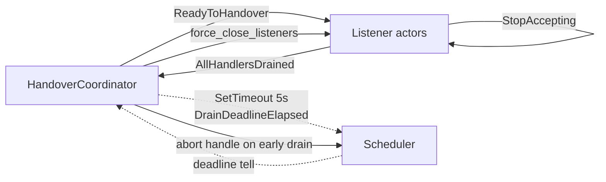
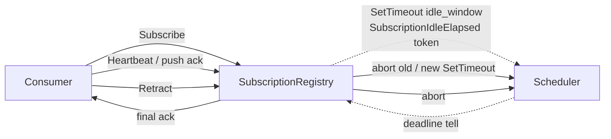
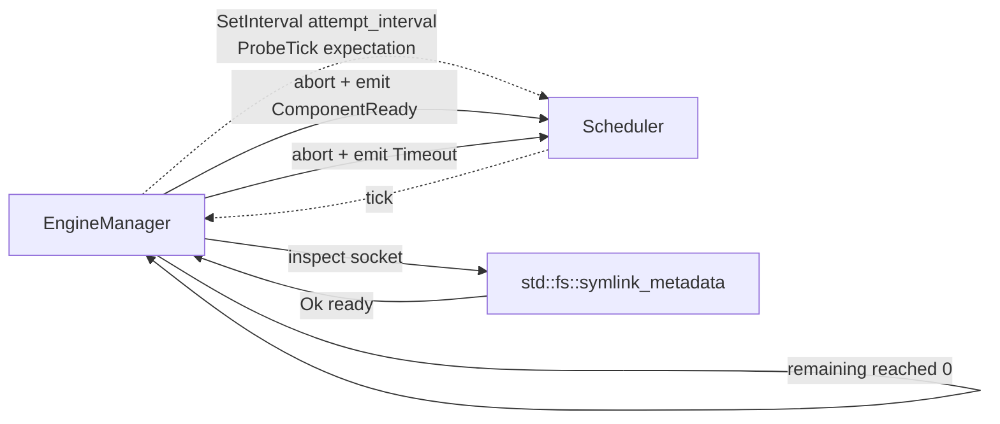

# 293/3 — kameo 0.16 Scheduler research

*Subagent C in the meta-report-directory session (spirit record 231).
Bead `primary-e4oq`; charter from /292 §3.5 plus spirit record 250.*

## TL;DR

The Scheduler actor lives in `kameo_actors` (the actors helper
crate), not in the kameo core. It was **added in kameo 0.19** (PR
#251, 2025-11-06), **not 0.16** as the /292 §3.5 note stated —
0.16's headline change was removing the `Mailbox` generic and the
mailbox-spawn rework; Scheduler arrived three minor versions later.
The workspace pins kameo `0.20.0` (per `skills/kameo.md` §"Maturity
and pinning"), so the Scheduler is already on the pinned surface —
no version bump required to adopt. Its API surface is small and
matches Tokio's `sleep` / `interval` semantics: `SetTimeout` and
`SetInterval` messages return `AbortHandle` for cancellation. **Adopt
case-by-case, not blanket**: the Scheduler is the right shape for
the **subscription keep-alive** use case (a long-lived clock per
subscriber, cancellable on retract); a poor fit for the **handover
drain timeout** (one-shot select-race already idiomatic with
`tokio::time::sleep` + `tokio::select!`); a marginal fit for the
**reachability probe** (the loop carries retry logic the Scheduler
doesn't simplify). The workspace's only current concrete need is
recommendation **case 2 (subscription keep-alive)**; defer the
other two until concrete pain emerges.

## §1 What kameo 0.16 ships

Per upstream changelog (GitHub `tqwewe/kameo`, CHANGELOG.md):

**0.16.0 — 2025-03-28**. The simplification release.

- Removed the `type Mailbox` associated type from the `Actor`
  trait. Mailbox is now specified at spawn via
  `spawn_with_mailbox(args, mailbox::bounded(n))`. Default
  bounded(64).
- Removed `MessageSend`, `TryMessageSend`, etc. trait impls in
  favour of inherent `.send()` / `.try_send()` / `.blocking_send()`
  on request types.
- Pool and PubSub actors moved out of core into the new
  `kameo_actors` helper crate.
- ActorPool: round-robin replaced by least-connections.
- New `prelude` module; `Actor::next` method; `on_message` hook
  on the `Actor` trait.

**The Scheduler is not in 0.16.** It was added in **0.19.0**
(2025-11-10) via PR #251 — closing issue #238 "Time operations
inside actors." The implementation was inspired by a code snippet
from @yawor. **0.20.0** (2026-04-07) — the workspace's pinned
baseline — carries the Scheduler unchanged from 0.19.

The /292 §3.5 attribution to 0.16 was a one-version-band lookup
error; the substantive lead — that kameo's actor crate now ships a
Scheduler relevant to the workspace's timeout use cases — is correct.

## §2 Scheduler API surface

From `actors/src/scheduler.rs` on `tqwewe/kameo@main` (read via
GitHub web view, accurate as of 2026-05-23):

```rust
// kameo_actors::scheduler

#[derive(Default)]
pub struct Scheduler {
    tasks: JoinSet<()>,
}

impl Scheduler {
    pub fn new() -> Self { ... }
}

// One-shot
pub struct SetTimeout<A: Actor, M> {
    actor_ref: WeakActorRef<A>,
    deadline:  Instant,
    msg:       M,
}

impl<A: Actor, M> SetTimeout<A, M> {
    pub fn new(actor_ref: WeakActorRef<A>, duration: Duration, msg: M) -> Self;
}

// Repeating
pub struct SetInterval<A: Actor, T> {
    actor_ref: WeakActorRef<A>,
    interval:  Interval,
    msg:       T,
}

impl<A: Actor, T> SetInterval<A, T> {
    pub fn new(actor_ref: WeakActorRef<A>, period: Duration, msg: T) -> Self;
    pub fn start_delay(self, duration: Duration) -> Self;
    pub fn set_missed_tick_behaviour(self, behaviour: MissedTickBehavior) -> Self;
}

// Both messages reply with AbortHandle
impl<A: Actor + Message<M>, M: Send + 'static> Message<SetTimeout<A, M>>  for Scheduler {
    type Reply = AbortHandle;
}
impl<A: Actor + Message<T>, T: Send + Clone + 'static> Message<SetInterval<A, T>> for Scheduler {
    type Reply = AbortHandle;
}
```

Load-bearing properties:

1. **Single shared scheduler per process is fine.** The Scheduler
   owns a `tokio::task::JoinSet<()>` and each scheduled call
   spawns one task inside it; multiple actors share one
   Scheduler instance without contention beyond the JoinSet's
   internal locking.
2. **Cancellation is per-schedule.** `ask(SetTimeout::new(...))`
   replies with a `tokio::task::AbortHandle`. The caller stores
   the handle and calls `.abort()` to cancel before fire.
   `SetInterval`'s `AbortHandle` cancels the entire repeating
   loop.
3. **Target is held weakly.** The target is `WeakActorRef<A>`
   — the schedule does not extend the actor's life. When the
   target actor stops, the scheduled message silently fails to
   deliver (the weak-ref upgrade returns `None`); the JoinSet
   task exits.
4. **The fired message is a normal `tell`.** No reply path; the
   scheduler invokes `target.tell(msg)` when the deadline
   elapses. Handlers that need a reply must arrange one
   themselves (e.g. message carries a `oneshot::Sender`).
5. **Interval honours `MissedTickBehavior`.** Defaults to
   Tokio's `Burst`; `Delay` and `Skip` are configurable per
   schedule via `set_missed_tick_behaviour()`. `start_delay` sets
   an initial offset before the first tick.

Canonical pattern from upstream doc-comments (paraphrased):

```rust
use kameo_actors::scheduler::{Scheduler, SetInterval, SetTimeout};
use std::time::Duration;

let scheduler = Scheduler::spawn(Scheduler::new());
let counter   = Counter::spawn(Counter::default());

// fire-every-100ms
let interval_handle = scheduler
    .ask(SetInterval::new(
        counter.downgrade(),
        Duration::from_millis(100),
        Increment(1),
    ))
    .await?;

// fire-once-after-5s
let timeout_handle = scheduler
    .ask(SetTimeout::new(
        counter.downgrade(),
        Duration::from_secs(5),
        DeadlineElapsed,
    ))
    .await?;

// later: cancel
interval_handle.abort();
timeout_handle.abort();
```

## §3 Mapping to workspace use cases

### §3.1 Handover drain timeout (per /285 §2.2)

Setting: at `ReadyToHandover`, the old daemon stops accepting new
connections on `spirit.sock` / `spirit-owner.sock` and gives
in-flight handlers a bounded window (~5s) to drain before closing
the listeners. The next daemon binds those FDs at
`HandoverCompleted - drain_window`.

**Sketch with Scheduler**:

```rust
// inside the handover-coordinator actor
async fn enter_handover_mode(&mut self, ctx: &mut Context<Self, ...>) {
    // tell each listener actor to stop accepting
    self.ordinary_listener.tell(StopAccepting).await?;
    self.owner_listener.tell(StopAccepting).await?;

    // schedule the close-listeners deadline
    let drain_handle = self.scheduler
        .ask(SetTimeout::new(
            ctx.actor_ref().downgrade(),
            self.drain_window,             // Duration::from_secs(5)
            DrainDeadlineElapsed,
        ))
        .await?;
    self.drain_abort = Some(drain_handle);
}

impl Message<AllHandlersDrained> for HandoverCoordinator {
    async fn handle(&mut self, _: AllHandlersDrained, _ctx: ...) -> () {
        // drained early; cancel the deadline
        if let Some(handle) = self.drain_abort.take() {
            handle.abort();
        }
        self.close_listeners().await;
    }
}

impl Message<DrainDeadlineElapsed> for HandoverCoordinator {
    async fn handle(&mut self, _: DrainDeadlineElapsed, _ctx: ...) -> () {
        // deadline hit; force-close any laggards
        self.force_close_listeners().await;
    }
}
```

**Assessment: marginal**. The pattern works but adds one indirection
hop (handler -> Scheduler -> deferred tell -> handler) over the
idiomatic single-handler `tokio::select!` between an
`AllHandlersDrained` oneshot and a `tokio::time::sleep` future. The
Scheduler adoption costs a per-component Scheduler actor and an
`AbortHandle` field on the coordinator — and recovers neither
brevity nor expressiveness. **Not worth adopting for this case.**



### §3.2 Subscription keep-alive (per `skills/subscription-lifecycle.md`)

Setting: a typed subscription is long-lived — the consumer opens it
once and the producer pushes typed deltas. The producer wants to
**evict idle subscribers** whose consumer side has gone silent (no
`Retract`, no socket close — process hung, network partition,
etc.). The keep-alive is per-subscription, cancelled cleanly on
explicit `Retract`.

**Sketch with Scheduler**:

```rust
// inside the subscription-registry actor
impl Message<Subscribe> for SubscriptionRegistry {
    async fn handle(&mut self, msg: Subscribe, ctx: ...) -> Reply {
        let token = self.allocate_token();
        let subscriber = Subscriber {
            token, ...,
            keep_alive_abort: None,
        };

        // start the idle-eviction clock; the message carries the token
        // so the handler knows which subscription elapsed.
        let handle = self.scheduler
            .ask(SetTimeout::new(
                ctx.actor_ref().downgrade(),
                self.idle_window,                       // e.g. 60s
                SubscriptionIdleElapsed(token),
            ))
            .await?;
        subscriber.keep_alive_abort = Some(handle);

        self.subscribers.insert(token, subscriber);
        ...
    }
}

impl Message<HeartbeatReceived> for SubscriptionRegistry {
    async fn handle(&mut self, msg: HeartbeatReceived, ctx: ...) -> () {
        let Some(sub) = self.subscribers.get_mut(&msg.token) else { return };
        if let Some(handle) = sub.keep_alive_abort.take() {
            handle.abort();                              // cancel old timer
        }
        let new_handle = self.scheduler
            .ask(SetTimeout::new(
                ctx.actor_ref().downgrade(),
                self.idle_window,
                SubscriptionIdleElapsed(msg.token),
            ))
            .await?;
        sub.keep_alive_abort = Some(new_handle);
    }
}

impl Message<Retract> for SubscriptionRegistry {
    async fn handle(&mut self, msg: Retract, ctx: ...) -> Reply {
        if let Some(mut sub) = self.subscribers.remove(&msg.token) {
            if let Some(handle) = sub.keep_alive_abort.take() {
                handle.abort();
            }
            ...
        }
        ...
    }
}

impl Message<SubscriptionIdleElapsed> for SubscriptionRegistry {
    async fn handle(&mut self, msg: SubscriptionIdleElapsed, ctx: ...) -> () {
        let Some(sub) = self.subscribers.remove(&msg.token) else { return };
        // emit final retraction events, append IdleEviction trace, etc.
        ...
    }
}
```

**Assessment: good fit, adopt**. This is exactly the shape the
upstream issue #238 names — per-entity timers that the actor
manages alongside its own state, with explicit cancellation on
"liveness signal received." Hand-rolled, the alternative is to
either run one `tokio::time::sleep` per subscription
(`tokio::spawn`-and-track inside the actor — works, but is the
exact "burn through `spawn_blocking` per call" smell `skills/kameo.md`
§"Blocking-plane templates" Template 2 warns about, except for
timer tasks), or maintain a single sorted deadline heap inside the
actor with `tokio::select!` on its earliest deadline — manageable
but a non-trivial code body to maintain. The Scheduler externalises
both: one Scheduler actor handles N subscribers' clocks; each
subscriber holds a per-token `AbortHandle`; reset is "abort old,
schedule new." Plus the producer never pays the
not-in-the-mailbox-during-the-sleep cost of a per-handler timer.



### §3.3 Persona reachability probe (per persona ARCH §1.7)

Setting: at startup, the engine-manager probes each child's
domain socket — *"is the bound socket at this path, with the
requested mode?"* The probe is a **bounded** loop: N attempts at
fixed interval, each calls `std::fs::symlink_metadata` and inspects
file-type + mode. Success appends `ComponentReady`; exhaustion
returns a typed `ComponentReadinessTimeout`. Live code:
`persona/src/readiness.rs` lines 30–64 and
`persona/src/supervision_readiness.rs` lines 41–64.

**Sketch with Scheduler**:

The probe is fundamentally retry-with-backoff over a synchronous
syscall. The Scheduler does not naturally help: `SetInterval`
*would* deliver `Probe(expectation)` to the manager every
`attempt_interval`, but the manager has to inspect-and-decide on
each tick anyway. A naive sketch would look like:

```rust
impl Message<StartReadinessProbe> for EngineManager {
    async fn handle(&mut self, msg: StartReadinessProbe, ctx: ...) -> () {
        let handle = self.scheduler
            .ask(SetInterval::new(
                ctx.actor_ref().downgrade(),
                self.attempt_interval,
                ProbeTick(msg.expectation.clone()),
            ).set_missed_tick_behaviour(MissedTickBehavior::Delay))
            .await?;
        self.probes.insert(msg.expectation.component, ProbeState {
            handle,
            remaining: msg.attempt_count,
            expectation: msg.expectation,
        });
    }
}

impl Message<ProbeTick> for EngineManager {
    async fn handle(&mut self, msg: ProbeTick, ctx: ...) -> () {
        let Some(state) = self.probes.get_mut(&msg.expectation.component) else { return };
        match inspect(&state.expectation) {
            Ok(Some(ready)) => {
                state.handle.abort();
                self.probes.remove(&msg.expectation.component);
                self.emit_ready(ready);
            }
            Ok(None) | Err(_) => {
                state.remaining -= 1;
                if state.remaining == 0 {
                    state.handle.abort();
                    self.probes.remove(&msg.expectation.component);
                    self.emit_timeout(...);
                }
            }
        }
    }
}
```

**Assessment: marginal**. This works and may even be cleaner than
the current inline-loop in `ComponentSocketReadiness::verify`,
*because* the probe state moves from "inline-locals inside an
async fn" to "actor-owned record in `self.probes: HashMap<...,
ProbeState>`" — making concurrent probes for multiple components
naturally non-interfering on the manager actor's mailbox. The
present hand-rolled shape (one `async fn verify` per child,
`tokio::time::sleep` between attempts) already concurrent-by-default
when each child's verify is spawned independently, but it pays a
running-future-per-child cost during the probe window. **Adoption
is a refactor of moderate cost for moderate clarity gain — defer
until the probe code grows another responsibility (per-child probe
metrics, structured retry-count traces) and the inline form
becomes load-bearing to maintain.**



## §4 Comparison to current ad-hoc patterns

Across the workspace's Rust surface, the only meaningful timeout
patterns today are:

| Site | Pattern | Shape |
|---|---|---|
| `persona/src/readiness.rs` | `tokio::time::sleep(attempt_interval)` between probe attempts inside a bounded loop | inline retry |
| `persona/src/supervision_readiness.rs` | same | inline retry |
| `persona/src/direct_process.rs` | `tokio::time::sleep(graceful_timeout)` raced via `tokio::select!` against a `oneshot::Receiver<StopComponentReceipt>` | select-race |
| `chroma/src/theme.rs` | `tokio::time::timeout(Duration, future).await` around `tokio::process` subprocess | bounded-future |
| `chronos/src/daemon.rs` | similar bounded-future | bounded-future |

No subscription keep-alive lives in workspace code today; the
discipline is documented (`skills/subscription-lifecycle.md`) but
the producers that maintain subscriber state — Spirit's record
streams, Persona-mind's note streams — currently either route
through transport reachability (the consumer's TCP/Unix-socket
close is the eviction signal) or don't yet have explicit idle
eviction. So §3.2's case is **the first real workspace need** for
the Scheduler shape.

**Cost of switching, per case**:

| Case | Cost | Benefit |
|---|---|---|
| §3.1 drain timeout | Add a Scheduler actor to the handover-coordinator's actor tree; convert the `tokio::select!` into two `Message<T>` impls. **~30 lines net**. | Mostly cosmetic; the select-race shape stays readable. |
| §3.2 subscription keep-alive | Add a Scheduler per subscription-bearing component; one `AbortHandle` field per subscriber; four small handlers. **~80 lines for first adoption**, **~20 lines per additional subscription kind**. | Externalised, cancellable, per-entity timer state. Avoids hand-rolling either a per-subscription tokio task or a per-component deadline heap. |
| §3.3 reachability probe | Convert `ComponentSocketReadiness::verify` from `async fn` + inline loop to actor-owned `probes: HashMap`. **~60 lines net**, plus a shape change. | Marginal — the inline form is concrete and uncontended. |

The dominant cost across the three is the conceptual hop:
"timeout" moves from a local-variable future to a separate actor
sending a typed message back. For one-shot cases that's added
indirection; for per-entity multi-timer cases that's clarification.

## §5 Recommendation

**Case-by-case, adopt only §3.2 in the near term.**

- **§3.2 subscription keep-alive — adopt.** Adoption is targeted
  (the first subscription producer that grows idle-eviction
  discipline). The Scheduler is the right shape: per-subscriber
  timer, cheap cancel-and-reset on liveness, externalised from the
  actor's own mailbox-shape. Carry it into Spirit's record-stream
  subscribers and Persona-mind's note-stream subscribers as those
  grow keep-alive policy. Document in
  `skills/subscription-lifecycle.md` as the canonical timer
  mechanism for idle-eviction.

- **§3.1 handover drain — wait.** The select-race shape in
  `direct_process.rs::await_stop_receipt` is already idiomatic and
  the handover coordinator will have the same pattern. Revisit if
  the drain logic grows two-deadline structure (e.g., a 5s
  graceful + 30s SIGKILL escalation as a tree of deadlines, not
  one).

- **§3.3 reachability probe — wait.** The hand-rolled retry loops
  in `readiness.rs` / `supervision_readiness.rs` are 30 lines
  each, both bounded, both unit-tested. The Scheduler form is a
  refactor for moderate clarity gain. Revisit if probe state
  grows per-attempt structured metrics or if probe orchestration
  needs to multiplex multiple children's clocks against shared
  budget.

**Workspace mechanism update**: add a one-paragraph §"Scheduling
deferred messages" section to `skills/kameo.md` that names
`kameo_actors::scheduler::Scheduler` as the canonical mechanism for
per-entity timer state inside an actor, distinct from the
`tokio::select!`-with-`tokio::time::sleep` pattern used for
one-shot select-races. The distinction is: "if you need N
independent cancellable timers, one Scheduler; if you need one
deadline raced against one event, `tokio::select!` is still
correct."

## §6 Risks + open questions

1. **Weak-ref delivery is silent.** `SetTimeout`'s target is
   `WeakActorRef<A>`; if the target has stopped between schedule
   and fire, the message is silently dropped. Subscription
   keep-alive is safe (the subscription is gone anyway); handover
   drain would be safe (the coordinator outlives the listeners by
   design). Document this discipline if Scheduler adoption widens.

2. **One Scheduler per component vs one per process.** The
   Scheduler is process-local. A single shared Scheduler is fine
   from a contention standpoint, but couples lifecycle: if the
   shared Scheduler dies (panic in its `next()` loop, OOM in its
   JoinSet), every timer in the process is gone. Per-component
   Schedulers under each component's supervisor are robust;
   process-shared is leaner. **Open**: which shape does the
   workspace prefer? Recommend per-component, supervised by the
   component's root supervisor, until a concrete pain point
   surfaces.

3. **`MissedTickBehavior` semantics for keep-alive.** `SetInterval`
   for keep-alive should use `MissedTickBehavior::Delay` (not
   `Burst`) — otherwise a backlogged actor will receive a flood
   of `IdleCheckTick`s on resume. For the §3.2 sketch, `SetTimeout`
   reset-on-heartbeat already handles this; verify if any future
   adoption uses `SetInterval` for liveness.

4. **PR #251 attribution.** The upstream Scheduler was inspired by
   a snippet from @yawor, not a clean-slate design. The API
   surface is minimal but matches Tokio's `sleep` / `interval`
   shape literally — not a rich job-scheduler abstraction (no cron,
   no priority queues, no resume-after-restart). Workspace use
   cases must not assume more than the API offers.

5. **/292 §3.5 version-band correction.** The Scheduler arrived in
   0.19, not 0.16. The workspace's `skills/kameo.md` already
   pins 0.20 and says "actively developed, small enough that API
   churn between minor versions is real" — that warning is
   confirmed: minor versions land features in subsidiary crates
   too, not just kameo core. Suggest a one-line correction note
   in /292's §3.5 paragraph during the next maintenance pass on
   that report.

6. **`kameo_actors` is a separate crate dependency.** Adopting
   Scheduler means adding `kameo_actors = "0.5"` (or matching
   workspace pin) to the component's `Cargo.toml`. The crate
   bundles Scheduler with Pool, PubSub, Broker, MessageBus, and
   MessageQueue — each behind no feature flag (as of latest
   inspection), so the bin gets all of them. Confirm if this is
   acceptable bloat, or argue upstream for per-actor features.

## See also

- `https://github.com/tqwewe/kameo/blob/main/actors/src/scheduler.rs`
  — upstream source.
- `https://github.com/tqwewe/kameo/pull/251` — the PR that added
  the Scheduler.
- `https://github.com/tqwewe/kameo/issues/238` — the issue
  ("Time operations inside actors") that motivated it.
- `https://docs.rs/kameo_actors/latest/kameo_actors/scheduler/index.html`
  — rendered rustdoc.
- `/home/li/primary/skills/kameo.md` — the workspace's pinned
  kameo discipline; the natural home for a §"Scheduling deferred
  messages" addition.
- `/home/li/primary/skills/subscription-lifecycle.md` — the
  subscription FSM that case §3.2 lives inside.
- `/home/li/primary/reports/designer/285-versionprojection-trait-and-handover-protocol-specification.md`
  §3.3 — the handover drain context (case §3.1).
- `/home/li/primary/repos/persona/ARCHITECTURE.md` §"Bounded
  reachability probe" — the probe carve-out (case §3.3).
- `/home/li/primary/repos/persona/src/readiness.rs`,
  `supervision_readiness.rs`, `direct_process.rs` — current
  ad-hoc timeout sites named in §4.
- `/home/li/primary/reports/designer/292-designer-lane-top-issues-2026-05-22.md`
  §3.5 — the originating mention; carries the 0.16/0.19 version
  inaccuracy noted in §6.4.
