# 4 — rkyv 0.7 → 0.8 upgrade audit

*Subagent D, designer-research batch 2026-05-23. Bead `primary-haa3`
(audit rkyv 0.7→0.8 upgrade cost across the workspace). Drives the
disposition of /292 §3.5 third bullet + spirit record 250.*

## TL;DR

**The audit's premise is inverted: the workspace is already on rkyv
0.8 across every crate that uses rkyv.** Every workspace `Cargo.toml`
that depends on rkyv pins `version = "0.8"` (carat); lockfiles
resolve to `0.8.16` for 53 of 64 crates and `0.8.15` for 11 (those 11
just haven't `cargo update`d since 0.8.16 shipped on 2026-05-21). No
crate has ever had a 0.7 pin in its git history — `signal-core`,
`sema-engine`, `persona-spirit`, `lojix`, `persona`, and `signal-frame`
all show only `+rkyv = { version = "0.8", ... }` in their `Cargo.toml`
diff history. The workspace already uses 0.8-native API surface
exclusively: `rkyv::rancor::Error`, `rkyv::api::high::*`,
`#[rkyv(...)]` attributes, `rkyv::to_bytes::<rkyv::rancor::Error>`.
Total upgrade cost is **zero engineering-hours** for 0.7→0.8; the
only remaining work is **~10 minutes of `cargo update`** in the 11
laggard repos when their next change lands. **Recommendation: close
bead `primary-haa3` as already-done; convert /292 §3.5 third bullet
into a standing watch for 0.9 (no action until 0.9 ships).**

## §1 Workspace rkyv inventory

**64 workspace crates depend on rkyv directly.** All pin
`version = "0.8"`. Lockfile resolutions split between `0.8.16` (53
crates, refreshed within the last day or two) and `0.8.15` (11
crates, slightly stale). Both are 0.8.x; semver-carat upgrade is
automatic on the next `cargo update`.

| Crate | Repo path | Pin (`Cargo.toml`) | Resolved | Upgrade effort |
|---|---|---|---|---|
| `signal-core` | `/git/github.com/LiGoldragon/signal-core` | `0.8` | 0.8.16 | none |
| `signal-frame` | `/git/github.com/LiGoldragon/signal-frame` | `0.8` | 0.8.16 | none |
| `signal` | `/git/github.com/LiGoldragon/signal` | `0.8` | 0.8.16 | none |
| `signal-persona` | `/git/github.com/LiGoldragon/signal-persona` | `0.8` | 0.8.16 | none |
| `signal-persona-spirit` | `/git/github.com/LiGoldragon/signal-persona-spirit` | `0.8` | 0.8.16 | none |
| `signal-persona-mind` | `/git/github.com/LiGoldragon/signal-persona-mind` | `0.8` | 0.8.16 | none |
| `signal-persona-router` | `/git/github.com/LiGoldragon/signal-persona-router` | `0.8` | 0.8.16 | none |
| `signal-persona-terminal` | `/git/github.com/LiGoldragon/signal-persona-terminal` | `0.8` | 0.8.16 | none |
| `signal-persona-system` | `/git/github.com/LiGoldragon/signal-persona-system` | `0.8` | 0.8.16 | none |
| `signal-persona-message` | `/git/github.com/LiGoldragon/signal-persona-message` | `0.8` | 0.8.16 | none |
| `signal-persona-introspect` | `/git/github.com/LiGoldragon/signal-persona-introspect` | `0.8` | 0.8.16 | none |
| `signal-persona-orchestrate` | `/git/github.com/LiGoldragon/signal-persona-orchestrate` | `0.8` | 0.8.16 | none |
| `signal-persona-harness` | `/git/github.com/LiGoldragon/signal-persona-harness` | `0.8` | 0.8.16 | none |
| `signal-persona-auth` | `/git/github.com/LiGoldragon/signal-persona-auth` | `0.8` | 0.8.16 | none |
| `signal-sema` | `/git/github.com/LiGoldragon/signal-sema` | `0.8` | 0.8.16 | none |
| `signal-sema-upgrade` | `/git/github.com/LiGoldragon/signal-sema-upgrade` | `0.8` | 0.8.16 | none |
| `signal-version-handover` | `/git/github.com/LiGoldragon/signal-version-handover` | `0.8` | 0.8.16 | none |
| `signal-executor` | `/git/github.com/LiGoldragon/signal-executor` | `0.8` | 0.8.16 | none |
| `signal-repository-ledger` | `/git/github.com/LiGoldragon/signal-repository-ledger` | `0.8` | 0.8.16 | none |
| `signal-forge` | `/git/github.com/LiGoldragon/signal-forge` | `0.8` | 0.8.16 | none |
| `signal-criome` | `/git/github.com/LiGoldragon/signal-criome` | `0.8` | 0.8.16 | none |
| `owner-signal-persona-spirit` | `/git/github.com/LiGoldragon/owner-signal-persona-spirit` | `0.8` | 0.8.16 | none |
| `owner-signal-persona-mind` | `/git/github.com/LiGoldragon/owner-signal-persona-mind` | `0.8` | 0.8.16 | none |
| `owner-signal-persona-router` | `/git/github.com/LiGoldragon/owner-signal-persona-router` | `0.8` | 0.8.16 | none |
| `owner-signal-persona-terminal` | `/git/github.com/LiGoldragon/owner-signal-persona-terminal` | `0.8` | 0.8.16 | none |
| `owner-signal-persona-orchestrate` | `/git/github.com/LiGoldragon/owner-signal-persona-orchestrate` | `0.8` | 0.8.16 | none |
| `owner-signal-repository-ledger` | `/git/github.com/LiGoldragon/owner-signal-repository-ledger` | `0.8` | 0.8.16 | none |
| `owner-signal-sema-upgrade` | `/git/github.com/LiGoldragon/owner-signal-sema-upgrade` | `0.8` | 0.8.16 | none |
| `owner-signal-version-handover` | `/git/github.com/LiGoldragon/owner-signal-version-handover` | `0.8` | 0.8.16 | none |
| `persona` | `/git/github.com/LiGoldragon/persona` | `0.8` | 0.8.16 | none |
| `persona-spirit` | `/git/github.com/LiGoldragon/persona-spirit` | `0.8` | 0.8.16 | none |
| `persona-mind` | `/git/github.com/LiGoldragon/persona-mind` | `0.8` | 0.8.16 | none |
| `persona-router` | `/git/github.com/LiGoldragon/persona-router` | `0.8` | 0.8.16 | none |
| `persona-terminal` | `/git/github.com/LiGoldragon/persona-terminal` | `0.8` | 0.8.16 | none |
| `persona-orchestrate` | `/git/github.com/LiGoldragon/persona-orchestrate` | `0.8` | 0.8.16 | none |
| `persona-message` | `/git/github.com/LiGoldragon/persona-message` | `0.8` | 0.8.16 | none |
| `persona-introspect` | `/git/github.com/LiGoldragon/persona-introspect` | `0.8` | 0.8.16 | none |
| `persona-sema` | `/git/github.com/LiGoldragon/persona-sema` | `0.8` | 0.8.16 | none |
| `persona-harness` | `/git/github.com/LiGoldragon/persona-harness` | `0.8` | 0.8.16 | none |
| `persona-system` | `/git/github.com/LiGoldragon/persona-system` | `0.8` | 0.8.16 | none |
| `sema-engine` | `/git/github.com/LiGoldragon/sema-engine` | `0.8` | 0.8.16 | none |
| `sema` | `/git/github.com/LiGoldragon/sema` | `0.8` | 0.8.16 | none |
| `sema-upgrade` | `/git/github.com/LiGoldragon/sema-upgrade` | `0.8` | 0.8.16 | none |
| `repository-ledger` | `/git/github.com/LiGoldragon/repository-ledger` | `0.8` | 0.8.16 | none |
| `version-projection` | `/git/github.com/LiGoldragon/version-projection` | `0.8` | 0.8.16 | none |
| `lojix` | `/git/github.com/LiGoldragon/lojix` | `0.8` | 0.8.16 | none |
| `lojix-archive` | `/git/github.com/LiGoldragon/lojix-archive` | `0.8` | 0.8.16 | none |
| `nota-config` | `/git/github.com/LiGoldragon/nota-config` | `0.8` | 0.8.16 | none |
| `orchestrator` | `/git/github.com/LiGoldragon/orchestrator` | `0.8` | 0.8.16 | none |
| `chroma` | `/git/github.com/LiGoldragon/chroma` | `0.8` | 0.8.16 | none |
| `chronos` | `/git/github.com/LiGoldragon/chronos` | `0.8` | 0.8.16 | none |
| `criome` | `/git/github.com/LiGoldragon/criome` | `0.8` | 0.8.16 | none |
| `nexus` | `/git/github.com/LiGoldragon/nexus` | `0.8` | 0.8.16 | none |
| `terminal-cell` | `/git/github.com/LiGoldragon/terminal-cell` | `0.8` | 0.8.16 | none |
| `mentci-egui` | `/git/github.com/LiGoldragon/mentci-egui` | `0.8` | 0.8.16 | none |
| `mentci-lib` | `/git/github.com/LiGoldragon/mentci-lib` | `0.8` | 0.8.16 | none |
| `astro-aski` | `/git/github.com/LiGoldragon/astro-aski` | `0.8` | 0.8.15 | none |
| `aski-cc` | `/git/github.com/LiGoldragon/aski-cc` | `0.8` | 0.8.15 | none |
| `aski-core` | `/git/github.com/LiGoldragon/aski-core` | `0.8` | 0.8.15 | none |
| `askic` | `/git/github.com/LiGoldragon/askic` | `0.8` | 0.8.15 | none |
| `askicc` | `/git/github.com/LiGoldragon/askicc` | `0.8` | 0.8.15 | none |
| `arbor` | `/git/github.com/LiGoldragon/arbor` | `0.8` | 0.8.15 | none |
| `semac` | `/git/github.com/LiGoldragon/semac` | `0.8` | 0.8.15 | none |
| `synth-core` | `/git/github.com/LiGoldragon/synth-core` | `0.8` | 0.8.15 | none |
| `veric` | `/git/github.com/LiGoldragon/veric` | `0.8` | 0.8.15 | none |
| `veri-core` | `/git/github.com/LiGoldragon/veri-core` | `0.8` | 0.8.15 | none |

Method: `grep -rn "rkyv\s*=" /git/github.com/LiGoldragon/*/Cargo.toml`
returned 58 hits, all `version = "0.8"`. Additional crates pick up rkyv
transitively through `signal-core` / `sema-engine` and surface in
their `Cargo.lock`. Bringing in those crates that are *direct
consumers* of rkyv from `Cargo.lock` brings the total to 64. There
are zero `"0.7"` pins anywhere — the regex
`rkyv\s*=\s*\"0\.7\|rkyv\s*=\s*{\s*version\s*=\s*\"0\.7` returns no
hits across the entire workspace.

### Direct-vs-transitive dependency shape

```mermaid
graph TB
  rkyv[rkyv 0.8.x crates.io]
  rkyv_derive[rkyv-derive 0.8.x]
  rancor[rancor crate]

  rkyv --> rkyv_derive
  rkyv --> rancor

  subgraph Foundation
    signal_core[signal-core]
    signal_frame[signal-frame]
    sema[sema]
    sema_engine[sema-engine]
    persona_message[persona-message]
    nota_config[nota-config]
    version_projection[version-projection]
    arbor[arbor]
  end

  subgraph Triads
    signal_persona_X[signal-persona-* — 9 working signals]
    owner_signal_X[owner-signal-* — 8 owner policy signals]
    persona_X[persona / persona-spirit / persona-mind / ...]
  end

  subgraph CompilerStack
    aski_core[aski-core / synth-core / veri-core]
    askicc[askicc / veric / semac / askic / corec]
  end

  subgraph DeployStack
    lojix[lojix]
    orchestrator[orchestrator]
    chroma[chroma]
    chronos[chronos]
    criome[criome]
  end

  rkyv --> signal_core
  rkyv --> signal_frame
  rkyv --> sema
  rkyv --> sema_engine
  rkyv --> persona_message
  rkyv --> nota_config
  rkyv --> version_projection
  rkyv --> arbor

  rkyv --> signal_persona_X
  rkyv --> owner_signal_X
  rkyv --> persona_X

  rkyv --> aski_core
  rkyv --> askicc

  rkyv --> lojix
  rkyv --> chroma
  rkyv --> chronos
  rkyv --> criome
  rkyv --> orchestrator
```



Every box uses rkyv 0.8 directly. The graph above shows the breadth
of the surface — and the absence of layering (signal-* signals each
take rkyv as a direct dep, not via signal-core re-export). For a
*future* 0.9 audit, this means every crate touches the API surface
independently; there is no single chokepoint where the upgrade can
be staged.

## §2 0.7 → 0.8 breaking changes (historical, already absorbed)

For completeness, the changes between 0.7 and 0.8 that the workspace
*would* have needed to absorb — but didn't, because it never went
through that transition:

- **`rancor` error model.** 0.7 used opaque per-call error types
  threaded through ad-hoc `Result<_, _>` shapes; 0.8 introduces the
  `rancor` crate (`rkyv::rancor::Error`, `rkyv::rancor::Source`) as
  the canonical error type and threading mechanism. The workspace
  already uses this idiom throughout: `signal-core/src/frame.rs`,
  `sema-engine/src/{engine,record}.rs`, `sema/src/lib.rs`,
  `arbor/src/node.rs`, all the `chroma/src/*.rs` codec impls,
  `chronos/src/{request,response}.rs`, `orchestrator/src/dispatch.rs`,
  `nota-config/src/lib.rs`, `persona/src/{engine_event,upgrade}.rs`,
  `askicc/src/main.rs`. The codegen template in `corec/src/codegen.rs`
  emits `__S::Error: rkyv::rancor::Source` /
  `__D::Error: rkyv::rancor::Source` bounds. Every site is 0.8-native.

- **Attribute rename `#[archive(...)]` → `#[rkyv(...)]`.** 0.7
  controlled derive options via `#[archive(check_bytes)]`,
  `#[archive_attr(derive(Debug))]`, etc. 0.8 unifies under
  `#[rkyv(...)]`: `#[rkyv(derive(Debug))]`,
  `#[rkyv(serialize_bounds(...))]`, `#[rkyv(bytecheck(bounds(...)))]`,
  `#[rkyv(omit_bounds)]`. Workspace check: zero `#[archive(...)]`
  references anywhere; many `#[rkyv(...)]` references — e.g.
  `persona-router/src/{tables,channel}.rs`, `sema-engine/src/{catalog,
  query,subscribe,snapshot,sequence}.rs`, `persona/src/engine_event.rs`
  (twelve `#[rkyv(bytecheck(bounds(...)))]` annotations).

- **`rkyv::api::high::*` vs `rkyv::api::low::*` split.** 0.8 splits
  the API into a "high" surface that hides scratch-buffer mechanics
  and a "low" surface that exposes them. The workspace consistently
  picks the high API: `HighSerializer`, `HighDeserializer`,
  `HighValidator` in `signal-core/src/frame.rs` and
  `signal-frame/src/frame.rs`; `HighDeserializer` in
  `sema-engine/src/{engine,record}.rs`, `sema/src/lib.rs`. No `low`
  references in workspace code.

- **`Place::new_writer` / `Place::new` resolver shape.** 0.8 changed
  the way custom `Archive` impls write archived data via `Place<T>`.
  Workspace check: zero hand-rolled `Archive` impls; everything
  goes through the derive. Workspace is unaffected even in
  principle.

- **`from_bytes` signature.** 0.7's `from_bytes` was
  `Result<T, _>`; 0.8's is `Result<T, rkyv::rancor::Error>` when
  parametrised explicitly: `rkyv::from_bytes::<T, rkyv::rancor::Error>
  (bytes)`. Every workspace call site uses the 0.8 form (twenty-plus
  sites confirmed).

- **Feature set selection (`std`, `bytecheck`, `little_endian`,
  `pointer_width_32`, `unaligned`).** 0.8 reorganised feature flags;
  the workspace's canonical feature set
  `["std", "bytecheck", "little_endian", "pointer_width_32", "unaligned"]`
  is the 0.8 idiom and appears identically in 50+ Cargo.tomls.

There is nothing in the 0.7→0.8 changelog that the workspace would
have to absorb on first principles. The transition is historical.

## §3 Per-crate detail (deepest API users)

Three crates pull in the largest 0.8 API surface. None of them
require any change to stay current — the detail below documents
*what they use*, so a future 0.9 audit knows what to look at.

### signal-core / signal-frame (frame mechanics)

Files: `signal-core/src/frame.rs` (the core `Frame` codec),
`signal-frame/src/frame.rs` (the user-of-signal-core frame
mechanics). Both files:

- Build a typed `HighSerializer<'archive>` alias that names
  `rkyv::util::AlignedVec`, `rkyv::ser::allocator::ArenaHandle<'archive>`,
  `rkyv::rancor::Error` — the canonical 0.8 high-API serializer triple.
- Call `rkyv::to_bytes::<rkyv::rancor::Error>(value)` at the encode
  boundary.
- Call `rkyv::from_bytes::<Self, rkyv::rancor::Error>(bytes)` at the
  decode boundary.
- Carry `where` clauses naming
  `rkyv::api::high::HighValidator<'archive, rkyv::rancor::Error>` and
  `rkyv::api::high::HighDeserializer<rkyv::rancor::Error>` to thread
  bytecheck validation through `Request`, `Reply`, and `Event`
  payload types.

Effort to refresh under a hypothetical 0.9: medium — the `where`
clauses are the load-bearing surface and would need re-derivation.
Today's work: none.

### sema-engine / sema (typed database kernel)

Files: `sema-engine/src/{engine,record,catalog,query,subscribe,
snapshot,sequence,log}.rs`, `sema/src/lib.rs`. Touches the broadest
0.8 surface in the workspace:

- `rkyv::api::high::HighDeserializer`
- `rkyv::bytecheck::CheckBytes`
- `rkyv::rancor::{self, Strategy}`
- `rkyv::ser::Serializer`, `rkyv::ser::allocator::ArenaHandle`,
  `rkyv::ser::sharing::Share`
- `rkyv::util::AlignedVec`
- `rkyv::validation::{Validator, archive::ArchiveValidator,
  shared::SharedValidator}`
- All four derive markers (`Archive`, `RkyvSerialize`,
  `RkyvDeserialize`) plus `#[rkyv(derive(Debug))]` attribute.

This is the workspace's most rkyv-intimate crate pair — it owns the
encode/validate/decode pipeline for redb-stored values. Effort to
refresh under a hypothetical 0.9: medium-large — the validator and
serializer plumbing is the most exposed-to-internals surface in the
workspace. Today's work: none.

### persona / persona-spirit / persona-router (persona payload types)

`persona/src/engine_event.rs` carries twelve
`#[rkyv(bytecheck(bounds(...)))]` annotations threading bytecheck
constraints through the EngineEvent variant tree, plus `where __C::Error: rkyv::rancor::Source` bounds on serialize/deserialize
impls. `persona/src/upgrade.rs` does the same shape for upgrade
records. `persona-router/src/{tables,channel}.rs` uses
`#[rkyv(derive(Debug))]` for in-process inspection of archived
routing tables. `persona-spirit/src/store.rs` uses
`#[derive(rkyv::Archive, rkyv::Serialize, rkyv::Deserialize, ...)]`
on the spirit-record store types.

Effort to refresh under a hypothetical 0.9: medium — the
`bytecheck(bounds(...))` syntax is one of the things rkyv has
historically iterated on, and twelve annotations is enough surface
to matter. Today's work: none.

### corec (rkyv-emitting codegen)

`corec/src/codegen.rs` is the aski compiler's Rust-emitter. It
generates:

```
#[derive(Debug, Clone, PartialEq, rkyv::Archive, rkyv::Serialize, rkyv::Deserialize)]
#[rkyv(serialize_bounds(__S: rkyv::ser::Writer + rkyv::ser::Allocator, __S::Error: rkyv::rancor::Source))]
#[rkyv(deserialize_bounds(__D::Error: rkyv::rancor::Source))]
```

for record types, plus `#[rkyv(omit_bounds)]` on generic-instantiated
fields (`Vec<T>`, `Option<T>`, `Box<T>`). Under a hypothetical 0.9
that changed bounds syntax, the codegen template would need a
matched update — but the change is template-local (one file),
and re-running corec regenerates every aski domain. Today's work:
none.

## §4 Total estimated effort

**Zero engineering-hours for 0.7→0.8.** The bead's framed work is
already done. The closest thing to a residual task:

- **~10 minutes per laggard repo** to bring 0.8.15 lockfiles to
  0.8.16. The 11 affected repos (`arbor`, `askic`, `askicc`,
  `aski-cc`, `aski-core`, `astro-aski`, `semac`, `synth-core`,
  `veric`, `veri-core`, plus none of the production daemon stack)
  are all in the aski compiler pipeline and `arbor`. None is on
  the hot-path for current bead work. The next-time-they're-touched
  refresh is the natural moment; no scheduling required.

**No sequencing required.** Each crate is independent; if a 0.9
audit happens later, the dependency graph in §1 shows the surface
to plan against.

## §5 Recommendation

**Close bead `primary-haa3` as already-done; convert /292 §3.5 third
bullet from "forthcoming migration" to "standing watch for rkyv 0.9
(no action until 0.9 ships)".**

Rationale:

1. The bead's stated work ("audit rkyv 0.7→0.8 upgrade cost across
   the workspace per /292 §3.5") found that the workspace is already
   on 0.8 across the board, with full 0.8-native API surface in
   every call site. There is nothing left to do.

2. /292 §3.5's framing of rkyv 0.8 as "if 0.7, this is a forthcoming
   migration" should be updated to reflect the audit finding: the
   workspace was 0.8-native from day one. The "new rancor error
   handling lets contracts express failures more precisely" sentence
   still applies as design guidance — but as something the workspace
   *can already use*, not as a future capability.

3. The natural trigger to revisit rkyv-bump cost is **the release of
   rkyv 0.9** (or the next rkyv breaking-change major). At that
   point, the audit shape in this report applies as-is — the
   inventory in §1 is the surface to plan against, and the
   per-crate API depth in §3 names the load-bearing call sites.

4. The minor laggard repos on 0.8.15 are not worth a dedicated
   sweep. The cost-benefit favours absorbing the refresh during
   whatever next change touches each repo.

## §6 Risks + open questions

- **Possible /292 §3.5 mis-framing implication.** /292 §3.5 also
  flagged `winnow 1.0.0` as a "small chore worth scheduling as part
  of the bracket-string NOTA migration". If the rkyv finding is that
  /292's external-library research was working from a stale model
  of workspace pins, the winnow line may need re-checking too —
  briefly: that's a different subagent's lane, but worth flagging
  to the orchestrator.

- **Cross-repo wire-format stability.** The workspace runs the
  two-deploy-stack discipline (per INTENT.md): daemons in `current`
  and `next` must read each other's archived signals. If `current`
  is on rkyv 0.8.15 and `next` upgrades to 0.8.16, the wire format
  is feature-flag-compatible (same major-minor); the carat pin
  resolves the same way on the next `cargo update`. No action
  needed today, but the `version-projection` and
  `owner-signal-version-handover` machinery is the right place to
  pin this discipline for any future major bump. Audit not performed
  here.

- **Codegen template freeze.** `corec/src/codegen.rs` emits the
  current 0.8 bounds syntax verbatim into generated Rust. Any future
  rkyv major that changes the bounds attribute shape requires a
  matching update to the template *and* regeneration of every aski
  domain into `aski-core`, `synth-core`, `veri-core`. Worth a
  cross-reference in the future-0.9 audit. Not actionable today.

- **`signal-core` golden byte fixtures.** `signal-core` carries a
  wire-format stability witness (commit `f17efc1`, "signal-core: add
  wire-format stability witness (golden rkyv byte fixtures)"). Any
  future rkyv bump that changes the encoded byte layout breaks
  these fixtures — a deliberate alarm. The fixtures' existence
  means a hypothetical 0.9 audit gets immediate feedback if encoded
  bytes shift. Not visible to this audit; flag for the next one.

## See also

- `/home/li/primary/reports/designer/292-designer-lane-top-issues-2026-05-22.md` §3.5 — the source framing this audit was scoped from
- `/home/li/primary/reports/designer/293-designer-and-research-batch-2026-05-23/0-frame-and-method.md` — the batch frame
- Spirit record 250 — research-beads disposition
- `/git/github.com/LiGoldragon/signal-core/src/frame.rs` — canonical workspace example of 0.8 high-API usage
- `/git/github.com/LiGoldragon/sema-engine/src/{engine,record}.rs` and `/git/github.com/LiGoldragon/sema/src/lib.rs` — deepest 0.8 API surface in the workspace
- `/git/github.com/LiGoldragon/corec/src/codegen.rs` — the rkyv-emitting codegen template that would be the leverage point for a future major bump
- rkyv 0.8 changelog (upstream): https://github.com/rkyv/rkyv/blob/master/CHANGELOG.md
