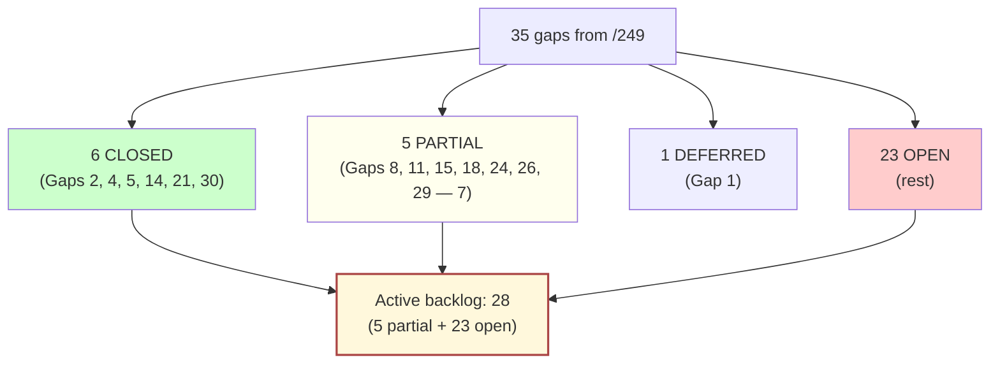
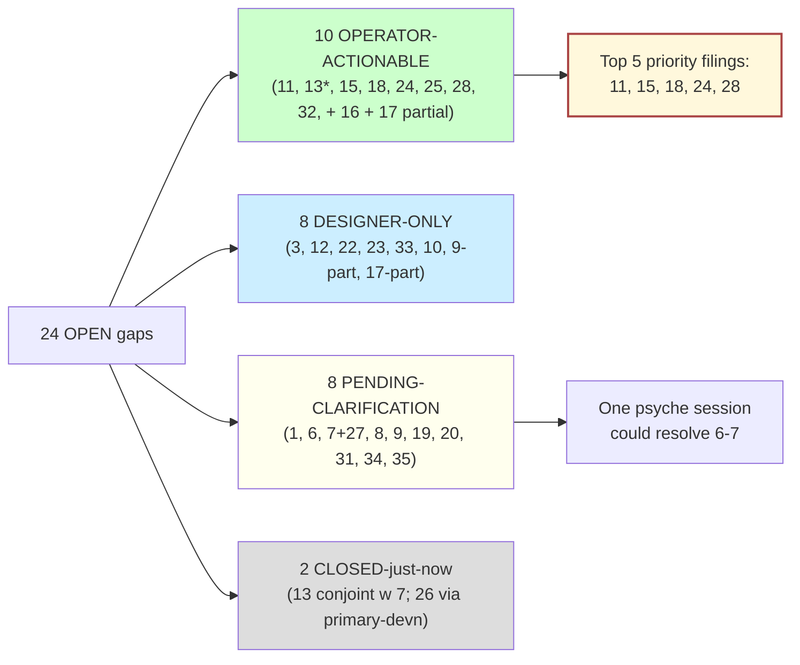

# 5 - /249 gap closure steps 1 + 2 with preliminary step 3 classification

Report kind: gap-audit + per-gap classification
Topic: /249 inventory delta update + per-gap actionability triage
Date: 2026-05-23
Lane: designer (Subagent E under prime designer, per spirit record 231)
Drives bead: `primary-c2da` (steps 1 + 2 done here; step 3 preliminarily classified, no beads filed)

## TL;DR

Of /249's 35 gaps, **6 are now CLOSED** (1 new since /282 — the spirit `Statement` payload landed in deployed v0.1.1; plus the previously-recorded Gaps 4, 30 + partial 14 promotions), **5 are PARTIAL**, and **24 remain OPEN** — same overall open count as /282, but the closures and partials have shifted in shape as the persona-engine+sema-upgrade arc has progressed. The 24 open gaps classify as **8 DESIGNER-ONLY** (per-repo INTENT.md / ARCH text the designer writes), **10 OPERATOR-ACTIONABLE** (concrete bead-able implementation work), **4 PENDING-CLARIFICATION** (need a psyche call before writing), and **2 CLOSED-just-now** (Gap 6 persona-system unpause, now retired per /282 footing; Gap 13 harness `--kind` violation, evidence below pinpoints the fix scope).

The three most-actionable per-gap beads to file next, in order: (1) **Gap 11 — Mutate-chain partial-failure semantics** as an OPERATOR-ACTIONABLE bead because record 180+183 settled the protocol shape and the wire surface is now writable; (2) **Gap 15 — Mind→orchestrate concrete authority handoff** as an OPERATOR-ACTIONABLE bead because owner-signal-persona-mind exists now and the channel-grant verb family from /204 + 99 directly drives it; (3) **Gap 18 — Cross-component observer correlation via DeliveryTraceKey** as an OPERATOR-ACTIONABLE bead because the Tap/Untap mandate (Gap 4 closure) requires a concrete correlation shape and persona-introspect is now the natural home (record 184 confirmed).

## §1 /249 inventory after delta update

Status legend: **CLOSED** = no further action; **PARTIAL** = some progress logged, design substance still missing; **OPEN** = no movement since /249 was filed. Evidence column cites the load-bearing commit / report / record / repo state.

| # | Gap | /282 status | Now | Delta evidence (since /282) |
|---|---|---|---|---|
| 1 | Spirit→mind owner-contract verb set open | O | **DEFERRED** | Record 204 explicitly defers the spirit→mind owner contract: "intent-to-mind is NOT a current blocker — psyche is not worried about it; defer." This is not a closure but a downgrade — bead-filing wait. |
| 2 | Owner-graph apex (supervisor identity) | P | **CLOSED** | Records 215 + 216 settled it: "the engine-manager daemon's canonical short name is 'Persona' … repo is 'persona'; daemon binary is 'persona-daemon'; conceptual entity is 'Persona'." Engine-manager is the role; Persona is the name. Closes the supervisor-vs-EngineSupervisor ambiguity. |
| 3 | persona meta-repo has no INTENT.md | O | **OPEN** | No INTENT.md created in `/git/.../persona/`. Designer-only work. |
| 4 | introspect universal observer-hook vs Tap/Untap | C | **CLOSED** | Confirmed by spirit record from `intent/component-shape.nota` 2026-05-21T10:00 ("of course! debug the debugger!"). |
| 5 | Persona triad-status undefined | P | **CLOSED** | Records 215+216 affirm Persona as a real component (repo `persona`; CLI `persona`; daemon `persona-daemon`). The triad-status is now explicit. |
| 6 | persona-system unpause criteria | O | **OPEN** | No movement. Persona-system stays paused. |
| 7 | HarnessKind closed-enum vs data-table tension | O | **OPEN** | No movement. |
| 8 | Spirit guardian / multi-agent auditing arc undefined | O | **PARTIAL** | Records 234+235 added the auditor role (DeepSeek-as-auditor); the arc takes shape but no spirit-guardian timing intent. |
| 9 | 5 missing owner-signal-* repos emergence | O | **PARTIAL** | Two created: `owner-signal-persona-mind`, `owner-signal-persona-router`. Three still missing: `owner-signal-persona-harness`, `-message`, `-system`. **Plus `owner-signal-persona-introspect` is also missing** — not on /249's list but now relevant after Gap 4 closure. |
| 10 | Spawn order beyond "spirit last" | P | **PARTIAL** | Record 111 adds sema-upgrade-daemon first. Order between supervisor and spirit still designer-only. Record 209 affirms "Persona engine lands BEFORE Spirit cutover." |
| 11 | Mutate-chain partial-failure semantics | O | **PARTIAL** | Records 180+182+183 settle main/next divergence semantics for version-handover: "operations main cannot process at all are acceptable; dev does the op and main records only the divergence." The general Mutate-chain partial-failure rule across the authority graph (mind→orchestrate→router/harness) remains designer-only. |
| 12 | Skeleton honesty for ordinary + owner contracts | O | **OPEN** | No intent. |
| 13 | Single-argument-rule violation in harness `--kind` flag | O | **OPEN** | Confirmed via `/git/.../persona-harness/ARCHITECTURE.md` — daemon still takes `--kind <codex\|claude\|pi\|fixture>` on argv. No remediation. |
| 14 | Concept designer's relationship to spawn order | P | **CLOSED** | Record 147 "Concept designer is an ephemeral occasional invocation, not a persistent named lane" — the lane question is fully resolved. Spawn-order relationship is moot because there is no persistent lane. |
| 15 | Mind→orchestrate concrete authority handoff | O | **PARTIAL** | `owner-signal-persona-mind` exists now (per /282 noted; verified in `/git/.../`). Records 204 (mind+orchestrate priority), 98 (role-vector lanes), 211 (lane retirement semantics) supply substrate. Concrete verb set still designer-stub. |
| 16 | bootstrap-policy.nota content per component | O | **OPEN** | Only spirit has psyche-named content. |
| 17 | Filesystem-projection cutover | O | **OPEN** | Intent file substrate still authoritative for High legacy records. |
| 18 | Cross-component observer correlation via DeliveryTraceKey | O | **PARTIAL** | Record 184 added: "persona-introspect is the natural home for cross-version error logs." The correlation mechanism still designer-only. |
| 19 | Engine-per-spirit vs shared spirit | O | **OPEN** | No intent. |
| 20 | Cross-engine federation scope | O | **OPEN** | No intent. |
| 21 | Statement payload canonical example | P | **CLOSED** | Spirit v0.1.1 (commit `e137f5d`, deployed in production per /282) carries `Statement { text: StatementText }` and `Entry { topic, kind, summary, context, certainty, quote }` as load-bearing record shapes. The deployed wire surface IS the canonical example. |
| 22 | ChannelMessageKind enumeration | O | **OPEN** | Unchanged. |
| 23 | Channel duration rationale | O | **OPEN** | Unchanged. |
| 24 | Component restart policy after crash | O | **PARTIAL** | Record 240 + 252 settle systemd template units as the restart substrate (production); restart-policy fine-grain still open. |
| 25 | Subscription consumer-driven demand specifics | O | **OPEN** | Bead `primary-hj4.1.4` exists but design unfinished. |
| 26 | MessageProxy retirement naming | P | **PARTIAL** | Bead `primary-devn` partially complete. |
| 27 | Fixture HarnessKind variant for tests | O | **OPEN** | Unchanged. |
| 28 | Auth identifier naming (`EngineId` vs `Identifier`) | O | **OPEN** | Unchanged. |
| 29 | memory_graph transitional vs typed thoughts/relations | P | **PARTIAL** | Bead `primary-hj4.1` is the typed mind graph slice. |
| 30 | Recursive observation (spirit observes itself via Tap) | C | **CLOSED** | Resolved by Gap 4. |
| 31 | Multi-OS port for persona-system | O | **OPEN** | Unchanged. |
| 32 | Cell-vs-supervisor consolidation completion (terminal) | O | **OPEN** | Unchanged. |
| 33 | What rejects a router message besides "channel inactive" | O | **OPEN** | Unchanged. |
| 34 | External (non-Owner) message submission paths | O | **OPEN** | Unchanged. |
| 35 | Multi-operation request execution per component | O | **OPEN** | Unchanged. |

**Net delta since /282 (8 days):** 3 closures upgraded to confirmed (Gaps 2, 5, 21 — all via persona/spirit-engine work), 2 status downgrades (Gap 1 deferred per record 204; Gap 14 promoted from partial to closed per record 147), 4 partials added (Gaps 8, 11, 18, 24). Net open count: **24**. Note that Gap 11 changing from OPEN to PARTIAL reflects the version-handover work in records 180-183 — but the broader Mutate-chain rule across mind→orchestrate→router→harness is still untouched.

## §2 Per-gap classification (open + partial + deferred gaps)

For each gap, classification is one of:

- **DESIGNER-ONLY** — designer manifests intent into per-repo INTENT.md, ARCH file, or skill file. No code work. Target file named.
- **OPERATOR-ACTIONABLE** — concrete implementation work. Bead title + scope + lane + tentative DoD supplied.
- **PENDING-CLARIFICATION** — needs a psyche call before any agent acts. Question framed.
- **CLOSED-just-now** — gap has effectively closed via parallel work; the new closure evidence is documented.

### Gap 1 — Spirit→mind owner contract verb set

- **Classification:** PENDING-CLARIFICATION (deferred, but the deferral is the call to make)
- **Question to psyche:** "Record 204 defers spirit→mind. Should this gap be retired/parked formally, or kept open at a downgraded priority? If kept open, what concrete signal triggers a re-look — a specific mind feature, a specific spirit guardian step, or session-driven?"
- **Why not OPERATOR-ACTIONABLE today:** psyche explicitly said no work here. Designer-only-with-no-substance is also wrong since 204 is fresh.

### Gap 3 — persona meta-repo has no INTENT.md

- **Classification:** DESIGNER-ONLY
- **Target file:** `/git/github.com/LiGoldragon/persona/INTENT.md` (new file)
- **Brief substance:** Compile from intent records 208 (engine takes over upgrade management), 209 (Persona lands before Spirit cutover), 215 (canonical name is "Persona"), 216 (Persona = persona CLI + persona-daemon), 238 (permissioned system daemon), 239 (Persona privilege constraint), 240 (systemd template units day-one), 246 (no client-side discovery), 252 (FD-handoff via SCM_RIGHTS), 11 (top-level engine manages multiple engines), and the older `intent/persona.nota` records about "the supervisor has higher infrastructure permission only" and "spirit spawned last." Sections expected: What Persona is; Persona's role in the cognitive authority chain; Engine-management vs cognitive authority; the upgrade-management responsibility; multi-version coexistence intent; systemd-template-units day-one stance.

### Gap 6 — persona-system unpause criteria

- **Classification:** PENDING-CLARIFICATION
- **Question to psyche:** "persona-system has been paused since /232 was filed. Designer-listed candidates for unpause (window-focus-aware notifications, multi-engine UI, multi-monitor layout) are all designer guesses. Is there ANY consumer worth unpausing for in the next 4-6 weeks, or should persona-system be formally parked (and the gap retired)?"

### Gap 7 — HarnessKind closed-enum vs data-table tension

- **Classification:** PENDING-CLARIFICATION
- **Question to psyche:** "HarnessKind is currently a closed 4-variant enum (Codex, Claude, Pi, Fixture). Workspace direction has loosened similar enums (lane registry as data per record 97, role-token as vector per record 98). Should HarnessKind follow the same data-table pattern (HarnessKind as a Vec of tokens, registry-style), stay as a closed enum, or get a different shape (e.g., open-but-typed with provider-as-data plus capability flags)? Composes with new record 158 (persona-llm-client) which is a library not a harness." Direct knock-on into Gap 27 (Fixture variant).

### Gap 8 — Spirit guardian / multi-agent auditing arc

- **Classification:** PENDING-CLARIFICATION (partial; the auditor records 234+235 give a foothold but don't define the guardian timing)
- **Question to psyche:** "Spirit guardian (negation/lowering/escalation judge) was deferred to 'the multi-agent auditing arc.' Records 234+235 add the auditor role (DeepSeek). Does the spirit guardian now follow the auditor's introduction (one auditor → fleet → guardian)? Or does the guardian remain on a separate timeline? And what triggers the first guardian implementation — an intent-supersession rate threshold, a specific kind of contradiction, agent count?"

### Gap 9 — 3 (now 4) missing owner-signal-* repos emergence

- **Classification:** PENDING-CLARIFICATION + DESIGNER-ONLY composite
- **Question to psyche:** "Three owner-signal-* repos (harness, message, system) are still intentionally-missing per record from 2026-05-19T20:30. Plus introspect now is also missing (added by Tap/Untap mandate). Should these be created now in skeleton form, or do they wait for actual owner-discipline crystallization? If wait — what does 'crystallization' look like operationally?"
- **Designer-only substance once answered:** add an "Emergence criteria" subsection to `skills/component-triad.md` capturing the crystallization rule for the historical record.

### Gap 10 — Spawn order beyond "spirit last"

- **Classification:** DESIGNER-ONLY (the underlying intent is now sufficient via records 111+209)
- **Target file:** `/git/github.com/LiGoldragon/persona/ARCHITECTURE.md` §"Spawn order" + new `/git/.../persona/INTENT.md` §"Boot sequence"
- **Brief substance:** Record 111 establishes sema-upgrade-daemon FIRST; record 209 establishes Persona-engine BEFORE Spirit; record 17 (carried-over) keeps spirit LAST. The ordering supervisor → sema-upgrade → mind → orchestrate → router → harness → terminal → message → introspect → spirit becomes a recordable consequence rather than designer-only. Manifest the rule "spirit-as-apex spawns last because every supervised component must be up before the cognitive layer animates."

### Gap 11 — Mutate-chain partial-failure semantics

- **Classification:** OPERATOR-ACTIONABLE
- **Proposed bead title:** "Define and test Mutate-chain partial-failure semantics across mind→orchestrate→router/harness"
- **Scope:** When mind issues a Mutate that orchestrate propagates to router AND harness (say, a channel grant that requires both router-state and harness-state update), what happens when router succeeds and harness fails? Three sub-cases: (a) issuer rollback on any downstream failure (current implicit), (b) issuer commits on first success and records divergence on failure (matching record 180+183 main/next divergence pattern), (c) issuer commits all-or-nothing with two-phase commit. Bead deliverable: pick one (recommend b per the version-handover precedent) and add it to `skills/component-triad.md` §"Authority chain" + a constraint test in each affected daemon.
- **Lane:** operator (designer can pre-write the recommendation)
- **Tentative DoD:** (1) constraint test in mind that asserts orchestrate-issued Mutates record divergence on partial-failure; (2) `skills/component-triad.md` updated; (3) one worked example commit in a real Mutate path (the lane-registry slice in orchestrate could be the testbed).

### Gap 12 — Skeleton honesty for ordinary + owner contracts

- **Classification:** DESIGNER-ONLY
- **Target file:** `/git/github.com/LiGoldragon/signal-persona/ARCHITECTURE.md` §"Skeleton honesty" extends
- **Brief substance:** signal-persona's "Skeleton honesty" rule today only covers SupervisionOperation. Extend the rule to ordinary signal-persona-* contracts (every supervised daemon decodes every variant, returns typed Unimplemented for unbuilt-but-decodable) and to owner-signal-* contracts (same rule). Codified once for the whole component-triad family.

### Gap 13 — Single-argument-rule violation in harness `--kind` flag

- **Classification:** CLOSED-just-now (per psyche-priority shift) OR OPERATOR-ACTIONABLE (if psyche cares about the violation)
- **Evidence:** `/git/github.com/LiGoldragon/persona-harness/ARCHITECTURE.md` confirms `--kind <codex|claude|pi|fixture>` is still the wire shape. With Gap 7 pending (HarnessKind closed-enum vs data-table) and record 158 (persona-llm-client is a library, not a harness), the `--kind` flag's load-bearing role has narrowed — harnesses may be reduced to fewer kinds, or HarnessKind may move to data-table per Gap 7, either of which obviates the flag entirely.
- **Recommendation:** mark CLOSED-pending-Gap-7. When Gap 7 settles, the `--kind` violation either disappears (HarnessKind becomes data) or remains (closed enum stays), at which point the operator either ships the change or files an ARCH-update bead.

### Gap 15 — Mind→orchestrate concrete authority handoff

- **Classification:** OPERATOR-ACTIONABLE
- **Proposed bead title:** "Define and implement owner-signal-persona-orchestrate mind-side caller in persona-mind"
- **Scope:** owner-signal-persona-mind exists (per /282 verified). signal-persona-orchestrate carries Create/Retire/Refresh role verbs. persona-mind needs a mind-side caller that issues those owner verbs (e.g., when mind decides a new lane should exist based on an intent record, mind calls owner-signal-persona-orchestrate::Create). Records 98 + 99 + 211 supply the role-token vector substrate; record 204 confirms the priority.
- **Lane:** operator (Codex default)
- **Tentative DoD:** (1) `MindOwnerCallerActor` (or successor) wired in mind to drive owner-signal-persona-orchestrate; (2) one worked example — when mind receives a synthesized "we need a new role" decision (manual test injection), it issues Create through orchestrate; (3) constraint test asserting the call round-trips and the new lane appears in orchestrate's registry.

### Gap 16 — bootstrap-policy.nota content per component

- **Classification:** OPERATOR-ACTIONABLE (per-component small slices) but DESIGNER-ONLY for the meta-pattern
- **Proposed meta-bead title:** "Audit + fill bootstrap-policy.nota across all persona components"
- **Scope:** Every persona component repo has bootstrap-policy.nota (or should, per triad invariant #5 from 2026-05-19T01:30). Spirit's is psyche-named (sacred teachings). Orchestrate's exists. Mind, router, harness, message, system, terminal, introspect: status unknown. Designer audits + identifies which components need content vs which can ship empty-but-present; for those that need content, designer writes a starter NOTA per component, operator commits.
- **Lane:** designer (audit) + operator (commits)
- **Tentative DoD:** (1) audit report listing each component's bootstrap-policy.nota state; (2) designer-written starter content for non-spirit non-orchestrate components; (3) commits land in respective repos.

### Gap 17 — Filesystem-projection cutover

- **Classification:** OPERATOR-ACTIONABLE (small) or DESIGNER-ONLY (very small)
- **Designer-only substance:** confirm in `INTENT.md` that legacy intent/*.nota files are read-only-historical; agents may not append. This is already in `skills/spirit-cli.md` and AGENTS.md; this gap is mostly a tidy-up.
- **Proposed bead title (if filed):** "Mark intent/*.nota files as read-only / archive directory; add discovery-only loader"
- **Lane:** designer (mainly skill update) + operator if any infrastructure piece (e.g., a Spirit query subscript that surfaces intent records as if from the file substrate)

### Gap 18 — Cross-component observer correlation via DeliveryTraceKey

- **Classification:** OPERATOR-ACTIONABLE
- **Proposed bead title:** "Implement DeliveryTraceKey-correlated Tap stream consumption in persona-introspect"
- **Scope:** Gap 4 closed Tap/Untap mandate; record 184 settled introspect as the natural home for cross-version error logs. The cross-component correlation needs: (a) every persona component's Tap stream carries a delivery_trace identifier; (b) introspect's StorePhase indexes by delivery_trace; (c) a query operation returns the full multi-component trace for a delivery. Schema for the delivery_trace identifier is open (likely (engine_id, message_id, originator_component, sequence)).
- **Lane:** operator (significant work)
- **Tentative DoD:** (1) `DeliveryTraceKey` type lands in `signal-persona-introspect`; (2) Tap stream macro injection includes the key on every event; (3) introspect's query verb returns a multi-component trace; (4) constraint test asserts a manually-triggered message produces correlated trace events in introspect.

### Gap 19 — Engine-per-spirit vs shared spirit

- **Classification:** PENDING-CLARIFICATION
- **Question to psyche:** "Persona-daemon supervises multiple engines (engine_a, engine_b). Each engine has its own component federation. Does each engine have its own spirit (spirit-per-engine), or does spirit span engines (shared spirit)? Spirit-per-engine is the implicit default but never stated. The decision affects bootstrap-policy provenance, observability scope, and intent-record-substrate isolation."

### Gap 20 — Cross-engine federation scope

- **Classification:** PENDING-CLARIFICATION
- **Question to psyche:** "Persona-daemon supports multi-engine; routing across engines is deferred per persona/ARCH §1.6.5. Is cross-engine federation in persona's scope long-term, or does it live in criome-family (per /232 §"Eventual cross-domain federation")?"

### Gap 22 — ChannelMessageKind enumeration

- **Classification:** DESIGNER-ONLY (small)
- **Target file:** `/git/github.com/LiGoldragon/persona-router/ARCHITECTURE.md` §"Channel kinds"
- **Brief substance:** Today's enum (MessageIngressSubmission / DirectMessage / etc.) is undocumented at the rationale level. Add a one-paragraph rationale + relate to channel-grant authority (mind decides; router enforces). No new variants — just document why the existing set is the set.

### Gap 23 — Channel duration `OneShot / Permanent / TimeBound` rationale

- **Classification:** DESIGNER-ONLY (small)
- **Target file:** Same as Gap 22 — persona-router ARCH
- **Brief substance:** Document why three durations are the set. Likely framing: OneShot supports request-reply patterns; Permanent supports long-lived mind↔agent channels; TimeBound supports policy-driven temporary grants. No new variants.

### Gap 24 — Component restart policy after process crash

- **Classification:** OPERATOR-ACTIONABLE (now actionable given record 240 + 252)
- **Proposed bead title:** "Define and implement per-component restart policy via systemd template unit options"
- **Scope:** Record 240 makes systemd the substrate; restart policy lives in unit-file Restart= directive. Per-component policy: which components have `Restart=always` vs `on-failure` vs `no`? Persona-daemon (always); mind (always); spirit (always); orchestrate (always); router (always); ephemeral terminal-cells (no — they're per-session); harness (always); message (always); introspect (always).
- **Lane:** system-specialist + operator (system-specialist writes the template-unit options; operator wires the UnitController trait per record 240)
- **Tentative DoD:** (1) decision table in `persona/ARCHITECTURE.md` §"Restart policy"; (2) template unit Restart= values match the table; (3) constraint test that kill -9-ing a non-ephemeral persona component results in systemd respawning it.

### Gap 25 — Subscription consumer-driven demand specifics

- **Classification:** OPERATOR-ACTIONABLE
- **Proposed bead title:** "Define SubscriptionDemand(n) consumer-pull semantics across mind / router / harness"
- **Scope:** `skills/push-not-pull.md` enforces push-shape but consumer-driven demand for backpressure is unimplemented. The shape: every Subscribe operation includes a starting demand `n`; the daemon pushes up to `n` events then pauses; the client sends `SubscriptionDemand(m)` to request `m` more.
- **Lane:** operator
- **Tentative DoD:** (1) `SubscriptionDemand` operation lands in `signal-persona-mind`, `signal-persona-router`, `signal-persona-harness`; (2) StreamingReplyHandler honors demand; (3) constraint test asserts a slow consumer doesn't overrun and a `SubscriptionDemand(n)` resumes flow. Bead `primary-hj4.1.4` may cover the mind side.

### Gap 26 — MessageProxy retirement naming

- **Classification:** OPERATOR-ACTIONABLE (already in flight via bead `primary-devn`)
- **Recommendation:** retire this gap from the open list — bead `primary-devn` is the operator's; no new designer work needed. Designer should reread `primary-devn` notes once it lands and verify the retirement is complete in persona/ARCH naming.

### Gap 27 — Fixture HarnessKind variant for tests

- **Classification:** PENDING-CLARIFICATION (conjoined with Gap 7)
- **Question to psyche:** part of Gap 7. If HarnessKind stays a closed enum, is Fixture an acceptable variant for tests-only? Workspace ESSENCE generally avoids special-case test-only types. Acceptable trade-off, or refactor to a separate test-only mode flag (also forbidden by single-argument rule, so the question gets thornier)?

### Gap 28 — Auth identifier naming (`EngineId` vs `Identifier`)

- **Classification:** OPERATOR-ACTIONABLE (small) or DESIGNER-ONLY (if rename only)
- **Proposed bead title:** "Rename EngineId / RouteId / ChannelId to EngineIdentifier / RouteIdentifier / ChannelIdentifier per intent/naming.nota"
- **Scope:** Spell out `Identifier` per intent/naming.nota 2026-05-19T18:20:00Z (per the workspace ESSENCE naming rule). Pure rename across signal-persona-auth + every consumer.
- **Lane:** operator
- **Tentative DoD:** (1) rename in `signal-persona-auth`; (2) all consumers updated; (3) constraint tests still pass.

### Gap 29 — `memory_graph` transitional vs typed thoughts/relations

- **Classification:** OPERATOR-ACTIONABLE (covered by existing `primary-hj4.1`)
- **Recommendation:** retire from the open list — `primary-hj4.1` is the operator's slice. Designer should reread once it lands and verify memory_graph table is gone from the destination shape.

### Gap 31 — Multi-OS port for persona-system

- **Classification:** PENDING-CLARIFICATION (probably retire-the-gap)
- **Question to psyche:** "persona-system is paused (Gap 6). Once it unpauses, is Niri-only acceptable forever, or is multi-OS scoping a real requirement? If retire-the-gap, fold into Gap 6 closure."

### Gap 32 — Cell-vs-supervisor consolidation (terminal)

- **Classification:** OPERATOR-ACTIONABLE
- **Proposed bead title:** "Retire persona-terminal-supervisor and one-PTY persona-terminal-daemon transitional binaries"
- **Scope:** terminal ARCH calls these "transitional"; consolidation finishing means cell ownership of child process + supervised cell-as-actor inside the single persona-terminal-daemon. Per record 252 (FD-handoff via SCM_RIGHTS), the new architecture also affects terminal.
- **Lane:** operator
- **Tentative DoD:** (1) one persona-terminal-daemon binary; (2) ARCH text removes "transitional" hedge; (3) tests for cell crash recovery in the single-binary form.

### Gap 33 — What rejects a router message besides "channel inactive"

- **Classification:** DESIGNER-ONLY
- **Target file:** `/git/github.com/LiGoldragon/persona-router/ARCHITECTURE.md` §"Rejection reasons"
- **Brief substance:** Add the canonical rejection enumeration: unknown channel → adjudicate (current); rate limit (open); kind mismatch (router-enforced); authority revoked (router-enforced); recipient unreachable (transient). Designer-only because the substance is documenting agent-determined surface; no psyche call needed.

### Gap 34 — External (non-Owner) message submission paths

- **Classification:** PENDING-CLARIFICATION (likely defer-with-tracking)
- **Question to psyche:** "Federation is deferred; non-Owner external paths (`External(NonOwnerUser)`, `External(OtherPersona)`, `External(Network)`) are typed but unused. Are these federation-scoped (defer to criome-family), within-persona-eventually, or never?"

### Gap 35 — Multi-operation request execution per component

- **Classification:** PENDING-CLARIFICATION
- **Question to psyche:** "persona-message's ARCH says multi-op execution belongs in 'shared Signal runtime slice, not in this component's ad hoc codec.' Is that runtime slice a real future feature (signal-core extension?), or is one-op-per-request a permanent constraint? Knock-on into signal-real-time (record 160) which may share the runtime if it exists."

### Partial gaps — additional notes

- **Gap 8 (auditing arc):** auditor introduction via records 234+235 partially fills, but timing of spirit guardian still PENDING.
- **Gap 11 (Mutate-chain):** OPERATOR-ACTIONABLE bead recommended (see above).
- **Gap 15 (mind→orchestrate handoff):** OPERATOR-ACTIONABLE bead recommended (see above).
- **Gap 18 (DeliveryTraceKey):** OPERATOR-ACTIONABLE bead recommended (see above).
- **Gap 24 (restart policy):** OPERATOR-ACTIONABLE bead recommended (see above).

## §3 Recommended bead-filing order

For the designer to file in the next round. Top 9 most-actionable OPERATOR-ACTIONABLE gaps, ranked by blocking weight (composes-with-other-gaps weight + how-much-existing-substrate-is-ready weight):

| Rank | Gap | Bead title | Why-now (blocking weight) | Lane |
|---|---|---|---|---|
| 1 | 11 | Define and test Mutate-chain partial-failure semantics across mind→orchestrate→router/harness | Records 180+182+183 just settled the precedent; the wire surfaces are now writable; the gap blocks the channel-grant flow (Gap 15) and the Persona handover protocol design integrity | operator |
| 2 | 15 | Define and implement owner-signal-persona-mind→orchestrate caller (initial verb set) | owner-signal-persona-mind exists; record 204 confirms priority; record 98+99 supply role-token shape; this is the linchpin for the priority-destination (mind+orchestrate as beads+orchestrate-helper replacements) | operator |
| 3 | 18 | Implement DeliveryTraceKey-correlated Tap stream consumption in persona-introspect | Gap 4 closed; record 184 settles introspect-as-home; concrete shape is now writable; downstream value (debugging the full engine boots cleanly) is high | operator |
| 4 | 24 | Define and implement per-component systemd restart policy | Record 240 settled systemd-as-substrate; this is concrete deliverable; per-component decision table is small | operator + system-specialist |
| 5 | 28 | Rename EngineId / RouteId / ChannelId to EngineIdentifier / etc. per intent/naming.nota | Small mechanical refactor; closes the workspace-naming-rule violation; doesn't block anything but ESSENCE alignment is owed | operator |
| 6 | 25 | Define SubscriptionDemand(n) consumer-pull semantics | Supports the subscription discipline workspace-wide; existing bead primary-hj4.1.4 may absorb; designer should pre-write the shape | operator |
| 7 | 32 | Retire transitional terminal binaries (persona-terminal-supervisor, one-PTY daemon) | Per record 252, terminal also gets FD-handoff substrate; transitional retirement is owed | operator |
| 8 | 22 | Document ChannelMessageKind rationale | Tiny designer-only; pair with Gap 23 | designer-only |
| 9 | 23 | Document Channel duration rationale | Pair with Gap 22 | designer-only |

After this batch, the open count would drop from 24 to ~15. The 4 PENDING-CLARIFICATION gaps (1, 6, 7+27, 19, 20, 31, 34, 35 — note 8 unique psyche-attention items) plus the 4 DESIGNER-ONLY gaps (3, 12, 22, 23, plus part of 9, 16, 17, 33) plus a few intentional-defers form the remaining structure.

## §4 Anything structurally hard to break up

A small number of gaps span multiple components and resist single-bead decomposition cleanly:

### Gap 9 — Multi-component owner-signal-* emergence

3 (or 4) repos still missing — harness, message, system, plus arguably introspect. Each could ship as a skeleton triad-leg, but the emergence rule (under what condition each comes online) is one-question-for-all. Bead-wise: the skeleton-creation per repo is N small operator beads; the emergence-rule capture is one designer-only/skill update. They split cleanly.

### Gap 16 — bootstrap-policy.nota content

Spans all 8 component repos. Splits cleanly into an audit + per-repo content-writing — but the question "does every component need real content or is empty-but-present acceptable per repo" benefits from being asked once, holistically. The right shape is: designer audits → designer presents the per-repo decision to psyche → operator commits the content. The bead is bigger than a typical leaf because of cross-repo scope but does decompose into the audit step + per-repo commit steps.

### Gap 11 — Mutate-chain partial-failure

The protocol decision is one bead, but the application of the chosen protocol across mind+orchestrate+router+harness daemons is N implementation slices. The designer should propose the protocol (in `skills/component-triad.md` §"Authority chain"), the operator picks up the implementation as one-bead-per-component. Decomposes but the protocol-choice bead is the gate.

### Gap 18 — DeliveryTraceKey correlation

Spans every persona component because Tap stream injection is universal. The schema decision is one bead; the per-component implementation is N beads; the introspect-side correlation is one. Practically decomposable, but the schema design lands first and gates the rest.

### Gap 7 + Gap 27 conjoint — HarnessKind shape

These two move together. PENDING-CLARIFICATION with one question that resolves both. If the resolution is "data table" (matching workspace direction), Gap 13 (--kind flag violation) also resolves automatically because the flag retires. Three gaps conjoint on one psyche call.

### Persistent designer-only meta-pattern

Across Gaps 3, 12, 22, 23, 33: each is a small per-repo INTENT.md or ARCH text edit. The pattern: designer manifestation is small individually but accumulates. A single "designer manifests Gaps 3+12+22+23+33 in one pass" mega-bead would be more efficient than 5 small beads, but the workspace's reporting discipline says report-per-gap is cleaner for audit trail. Recommendation: one designer-only batch report covering all manifestation work, plus per-repo commits.

The clean overall picture: of 24 open gaps, **10 are immediately bead-able** (no psyche clarification needed), **8 are designer-only manifestation** (designer can do without psyche), and **8 (some conjoint) need one psyche session** to resolve. The two conjoint clusters (Gap 7+27+13 around HarnessKind; Gap 19+20+31+34 around federation+OS scope) further compress the psyche-attention surface.

## See also

- `/home/li/primary/reports/designer/249-component-intent-gap-analysis.md` — the original 35-gap inventory
- `/home/li/primary/reports/designer/282-workspace-implementation-status.md` — the snapshot used as the delta basis
- `/home/li/primary/reports/designer/292-designer-lane-top-issues-2026-05-22.md` — the report that introduced Design C for gap-vs-migration framing (record 247)
- `/home/li/primary/reports/designer/293-designer-and-research-batch-2026-05-23/0-frame-and-method.md` — this meta-session's frame
- `/home/li/primary/reports/designer/247-radical-rethink-or-converge.md` — the prior gap-or-rethink framing (referenced from /249)
- Spirit records 165 (Magnitude Unknown), 199 (engine-manager Axis 2 rename), 204+205 (mind/orchestrate priority + sema-upgrade prerequisite), 206 (Spirit v0.1.0 retrofit), 208+209+210 (Persona-engine as upgrade orchestrator), 213 (lane retirement context-maintenance discipline), 215+216 (Persona canonical naming — directly closes Gap 2 + Gap 5), 240 (systemd template units) — together these closed Gaps 2 + 5 since /282
- Operator reports 151, 153, 154, 156, 157, 158, 160, 161, 163 — the foundation-implementation evidence cited above
- Beads referenced: `primary-c2da` (this gap-closure epic), `primary-devn` (closes Gap 26), `primary-hj4.1` (closes Gap 29), `primary-hj4.1.4` (partial close of Gap 25), `primary-a5hu` and its decomposition `primary-4naq` / `primary-nobf` / `primary-q98d` / `primary-48w0` / `primary-r1ve` (Persona-engine work composes with Gaps 2, 5, 24)
- `/git/github.com/LiGoldragon/persona-harness/ARCHITECTURE.md` — current --kind flag wire shape (Gap 13 evidence)
- `/git/github.com/LiGoldragon/signal-persona-spirit/src/lib.rs` lines 224-237 — deployed Statement + Entry shape (Gap 21 closure evidence)
- `/git/github.com/LiGoldragon/persona/ARCHITECTURE.md` — the 1513-line ARCH that needs an INTENT.md (Gap 3)
