# 294 — Most important gaps with full context + solutions (visual)

*Kind: Design · Topic: gap-elaboration-and-candidate-solutions · 2026-05-23*

*Per psyche 2026-05-23: "make a visual report of the most important
gaps with full context, examples, solutions, all with visuals." Builds
on /293/5 (Subagent E's gap classification) which identified the Top 3
operator-actionable gaps plus the two pending-clarification clusters.*

## TL;DR

Four gaps elaborated with mermaid visuals throughout. **Gap 11**
(Mutate-chain partial-failure semantics) — recommend Design B
(record-divergence, mirror version-handover precedent from spirit
records 180+183). **Gap 15** (Mind→orchestrate concrete handoff) —
recommend Design A (initial three-verb set Create / Retire / Refresh
matching the existing `owner-signal-persona-orchestrate` surface).
**Gap 18** (DeliveryTraceKey-correlated Tap consumption) — recommend
Design B (four-field key with hop-index, indexed in persona-introspect's
StorePhase). **HarnessKind cluster** (Gap 7 + 27 + 13 conjoint) —
recommend Design C (closed-enum-stays-closed with documented inclusion
criterion); one psyche call closes three gaps. Two of the four
recommendations are bead-fileable for operator immediately after
psyche affirms.

# Gap 11 — Mutate-chain partial-failure semantics

## §11.1 The problem

A `Mutate` from mind can require BOTH router-side and harness-side
state changes (e.g. a channel-grant adds a `Channel` row in router
AND a harness-side acknowledgement). The chain runs mind →
orchestrate → (router, harness). What happens when router succeeds
but harness fails?

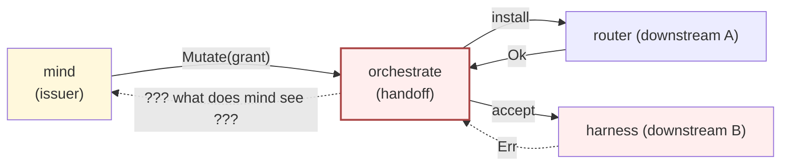

`skills/component-triad.md` §"Authority chain" says the issuer
"transitions its own state from possibly-mutated to now-mutated on
the confirmation, and only then proceeds." Confirmation from WHICH
downstream? Both? Either? The skill is silent on partial failure.

## §11.2 Why it's important

Multiple in-flight slices depend on this rule being explicit:

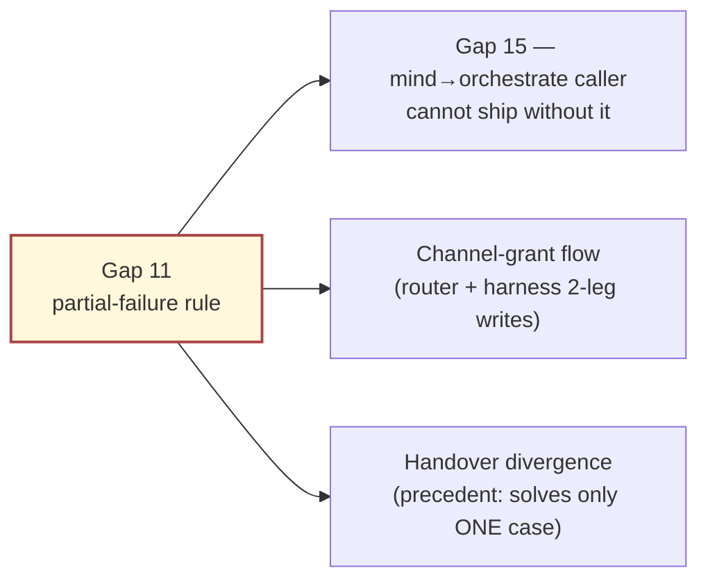

Records 180 + 182 + 183 settled the version-handover precedent
("operations main cannot process at all are acceptable; dev does
the op and main records only the divergence") but the GENERAL rule
across mind→orchestrate→router/harness is designer-only today.

## §11.3 Example — broken today

A psyche-driven channel grant runs mind → orchestrate → router
(succeeds) → harness (fails). Today's outcome is unclear:

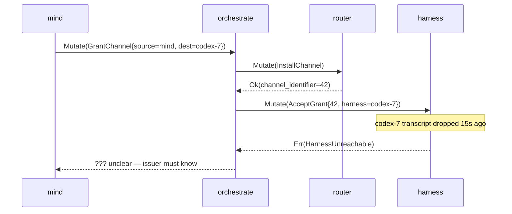

After the gap closes, mind sees exactly one of three typed answers
(§11.4).

## §11.4 Candidate designs

### Design A — Rollback (two-phase commit)

Orchestrate buffers each downstream success, commits only when all
downstreams ack; on failure, orchestrate issues compensating
`Retract*` verbs. Mind sees a single `Atomic` reply (Ok or Err).

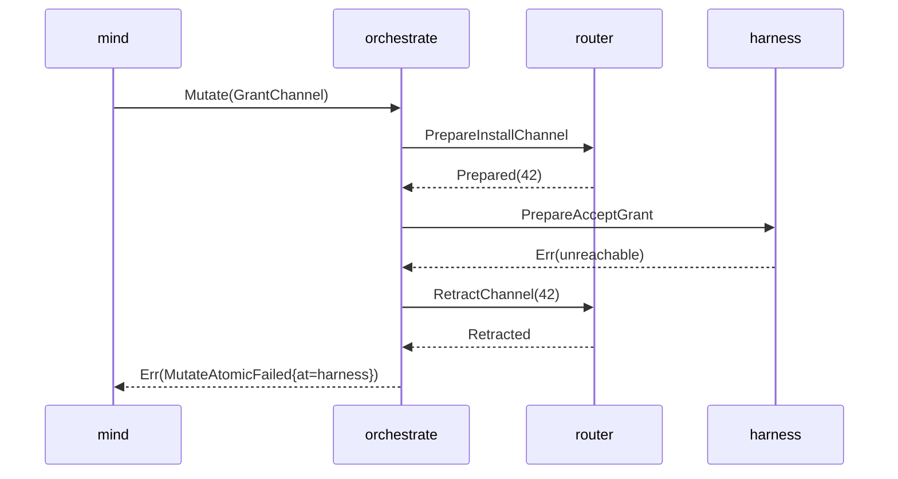

- Mind sees clean all-or-nothing semantics
- Two-phase commit cost on every Mutate (latency + protocol surface)
- Compensation verbs multiply the surface (every Mutate gets a Retract)
- Doesn't compose with the version-handover precedent (record-divergence, not rollback)

### Design B — Record-divergence (the version-handover precedent)

Orchestrate commits each downstream success as final; mind sees
`PartialApplied{succeeded, failed}` and records the divergence. This
mirrors records 180+183: "do the op and main records only the
divergence."

```mermaid
sequenceDiagram
    participant mind as mind
    participant orch as orchestrate
    participant rtr as router
    participant hrn as harness

    mind->>orch: Mutate(GrantChannel)
    orch->>rtr: InstallChannel
    rtr-->>orch: Ok(42)
    Note over rtr: channel 42 INSTALLED (durable)
    orch->>hrn: AcceptGrant
    hrn-->>orch: Err(unreachable)
    orch-->>mind: PartialApplied{succeeded=[router(42)], failed=[harness:unreachable]}
    Note over mind: divergence recorded in work-graph; retry later via ReAcceptGrant(42)
```

- Composes with already-settled handover precedent (records 180/183)
- No protocol-surface inflation (no Prepare/Retract verb pairs)
- Latency-optimal (each downstream commits independently)
- Mind has to plan retries (added complexity in choreography)
- Router CAN have orphaned state for a window

### Design C — Eager-commit-then-best-effort

Orchestrate commits the first downstream eagerly; failures in
downstream B are logged but mind sees `Ok` for the operation as a
whole. Recovery happens via retry loops in each downstream.

- Lowest latency from mind's view (one round-trip, one Ok)
- Hides partial-failure from the issuer (the very thing mind needs to plan around)
- Adds poll-shape to harness recovery (violates `skills/push-not-pull.md`)
- Diverges from the version-handover precedent

## §11.5 Designer recommendation

**Design B — record-divergence.** Reasoning:

- Composes with the already-settled handover precedent (records
  180+183). One pattern across both mutate-chain partial-failure
  and main↔next divergence.
- No protocol-surface inflation. Doesn't double the verb set.
- Honest with mind — the issuer learns about the partial state and
  is the right place to plan retries (mind already owns
  ChoreographyPolicy per its ARCH §3).

**Bead title (operator-actionable, fileable after psyche affirms):**
*"Define Mutate-chain partial-failure as record-divergence across
mind→orchestrate→router/harness, with first constraint test in
orchestrate"*

DoD draft:

- `skills/component-triad.md` §"Authority chain" gains a
  "Partial-failure shape" subsection naming Design B
- Reply types in signal-persona-orchestrate gain
  `PartialApplied{succeeded, failed}` variant
- One constraint test in persona-orchestrate that injects a
  downstream-B failure and asserts the typed `PartialApplied`
  result reaches a test harness standing in for mind

# Gap 15 — Mind→orchestrate concrete authority handoff

## §15.1 The problem

Mind decides; orchestrate enacts. When mind concludes "a new role
needs to exist," mind must call into orchestrate. Today
`owner-signal-persona-orchestrate` exposes `Create / Retire /
Refresh` verbs — but persona-mind has NO mind-side caller.

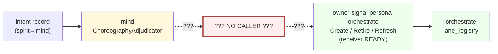

The receiver side is typed and shipped; the gap is the caller in
persona-mind.

## §15.2 Why it's important

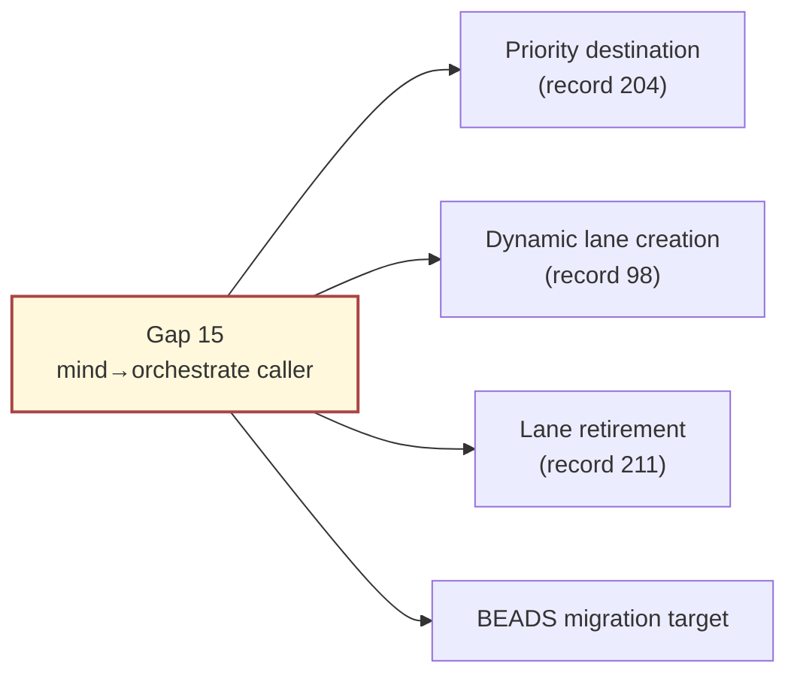

Record 204 explicitly named mind+orchestrate as the priority
destination for what `tools/orchestrate` and BEADS do today. This
caller is the linchpin.

## §15.3 Examples — what today vs after

A psyche statement "need designer-assistant on /287" arrives in
mind via spirit. Today the decision dies in mind's dispatch trace;
after closure it lands as a real lane row.

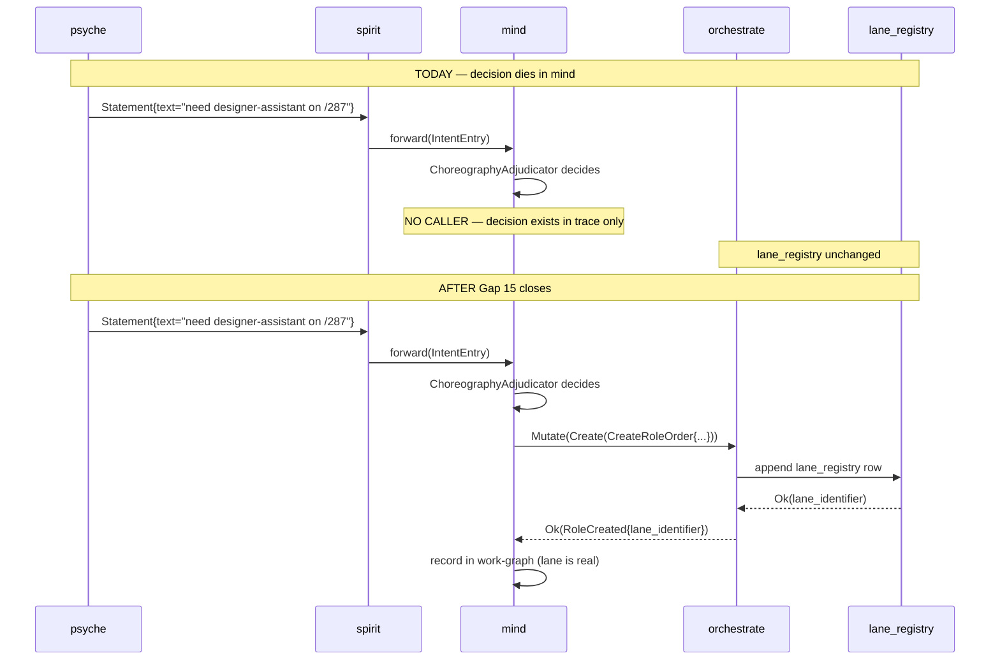

## §15.4 Candidate designs

### Design A — Three-verb initial set (matches receiver)

Mind ships a `MindOrchestrateCaller` actor with exactly the three
already-shipped owner verbs: `Create`, `Retire`, `Refresh`. Mind
invokes them when ChoreographyAdjudicator emits a matching decision.

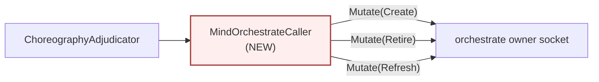

- Receiver side is already shipped and typed
- Minimal surface (matches what exists); three concrete tests
- Doesn't anticipate future verbs (e.g. ChannelGrant)
- Expansion is additive as orchestrate's verb set grows

### Design B — Full intended verb set up front

Mind ships a caller that includes future verbs orchestrate will
need (channel grants, supervision-policy mutations, scope
acquisitions) — bigger surface from day one; orchestrate's verb
set fills in over time.

- Mind's view of orchestrate's surface is complete from day one
- Calling code calls Unimplemented-returning verbs (waste motion)
- Adds skeleton-honesty load on orchestrate (operator pays the work earlier)
- Mind's caller risks drift from what orchestrate actually supports

### Design C — Decision-shape-driven (caller adapts)

Mind's ChoreographyAdjudicator produces typed `MindDecision`
variants; a generic `OrchestrateCallerAdapter` maps each variant
to the matching orchestrate verb dynamically. New decisions add a
mapping row, not a new caller.

- Decouples mind's domain reasoning from the wire shape
- Generic mapper adds indirection complexity
- Risks losing type safety at the mapping boundary
- Premature abstraction for a 3-verb start

## §15.5 Designer recommendation

**Design A — three-verb initial set matching receiver.** Reasoning:

- Receiver side already typed and shipped (Create/Retire/Refresh
  in `owner-signal-persona-orchestrate`)
- Smallest workable slice; matches "components ship in raw form
  first; integration after"
- Concrete testable scope (one constraint test per verb)
- Design A doesn't preclude Design B as steady-state; it just
  doesn't try to anticipate it

**Bead title (operator-actionable):**
*"Implement MindOrchestrateCaller with Create / Retire / Refresh
verb support in persona-mind, driven by ChoreographyAdjudicator
decisions"*

DoD draft:

- `MindOrchestrateCaller` actor in persona-mind owning the client
  connection to orchestrate's owner socket
- ChoreographyAdjudicator emits typed
  `OrchestrateDecision::Create(CreateRoleOrder) | Retire(Retirement) | Refresh(RefreshRepositoryIndexOrder)`
- Caller invokes via the existing `OwnerOrchestrateRequest` surface
- One constraint test per verb (manual injection; assert reply
  round-trips and lane_registry observes the change)

# Gap 18 — DeliveryTraceKey-correlated Tap consumption

## §18.1 The problem

Gap 4 closure mandated `Tap`/`Untap` on every persona component. A
single delivery passes through multiple hops; each emits Tap events.
**No identifier today correlates events across hops** — introspect
sees N un-joined event streams.

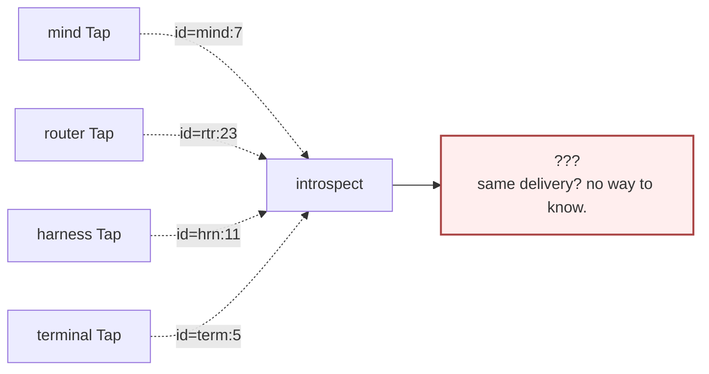

Record 184 named introspect as the natural home for cross-version
error logs; the cross-hop correlation key has no defined shape.

## §18.2 Why it's important

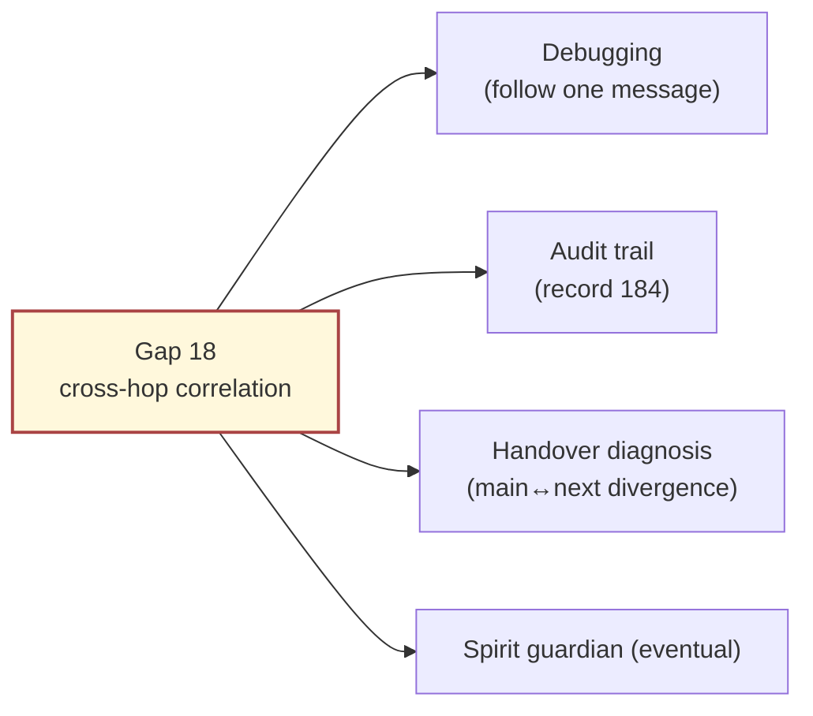

A daemon emitting Tap events whose consumers can't correlate them
is partially-functional observability — a developer hitting a
multi-hop failure today can read introspect's stream but cannot
answer "what happened to message M as it went through the engine?"

## §18.3 Example — broken today vs fixed after

A user submits a message that should reach a Codex agent through
message → mind → router → harness. The harness fails to accept.
The operator wants to know which hop dropped it.

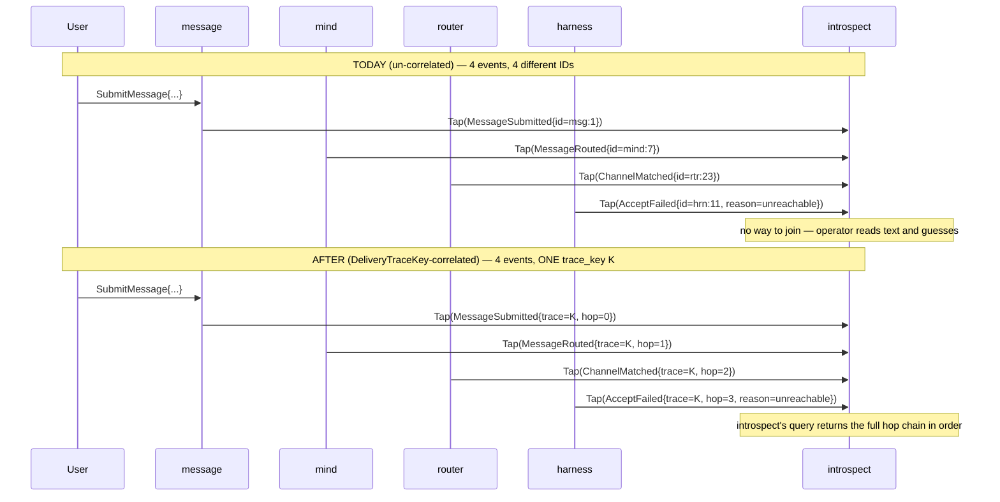

## §18.4 Candidate designs

### Design A — Three-field key (engine, message_id, originator)

`DeliveryTraceKey = (engine_identifier, message_identifier,
originator_component)`. Uniquely identifies a delivery because
(engine, message) is monotonic and originator names where the chain
started. Hops are inferred from event order.

- Compact key (three fields)
- Hop order inferred from event timestamps (clock-drift risk)
- Composes well with existing `message_identifier` in signal-persona-message
- Originator may not always be known (System-originated events?)

### Design B — Four-field key with hop-index

`DeliveryTraceKey = (engine_identifier, message_identifier,
originator_component, hop_index)`. Join key is the first three;
order key is the fourth.

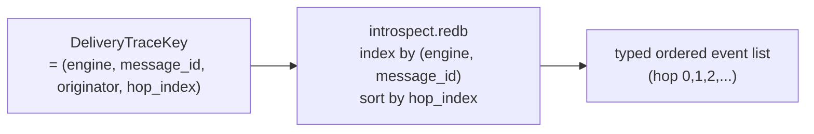

- Deterministic ordering (no clock dependency)
- Slightly larger key
- Hop_index minting: originator emits hop=0; downstream increments
- Composes with MessageOriginStamper (which already mints originator)

### Design C — Opaque correlation token

`DeliveryTraceKey = OpaqueCorrelationIdentifier(bytes)`. Originator
mints a random identifier; downstream daemons pass it through
unchanged. Introspect indexes by the opaque value.

- Simplest key shape
- No semantic meaning; no hop ordering without additional event metadata
- Loses cross-engine debuggability (no engine_identifier in key, can't filter "all deliveries in engine X")

## §18.5 Designer recommendation

**Design B — four-field key with hop-index.** Reasoning:

- Deterministic ordering (no clock dependency, no per-hop sort
  guessing in introspect)
- Composes with existing primitives (message_identifier from
  signal-persona-message; originator from MessageOriginStamper)
- Provides cross-engine filterability (engine_identifier in key)
- Hop_index is cheap to mint (incremented at each component boundary)

**Bead title (operator-actionable):**
*"Implement DeliveryTraceKey four-field correlation with Tap stream
indexing in persona-introspect"*

DoD draft:

- `DeliveryTraceKey` type in `signal-persona-introspect` with
  four fields (engine, message_id, originator, hop_index)
- Tap stream macro injection writes the key on every event
- Hop_index minting: originator emits hop=0; each downstream
  daemon increments
- introspect.redb StorePhase indexes by (engine, message_id);
  query verb returns hop-ordered events
- Constraint test that manually triggers a 4-hop message
  produces 4 correlated events in introspect with hop_index
  0,1,2,3 in order

# Gap 7 + 27 + 13 — HarnessKind cluster

These three gaps move together. **One psyche decision resolves all
three.** Treating as a conjoint cluster is essential — answering
them separately produces inconsistent triplets.

## §C.1 The problem (joint)

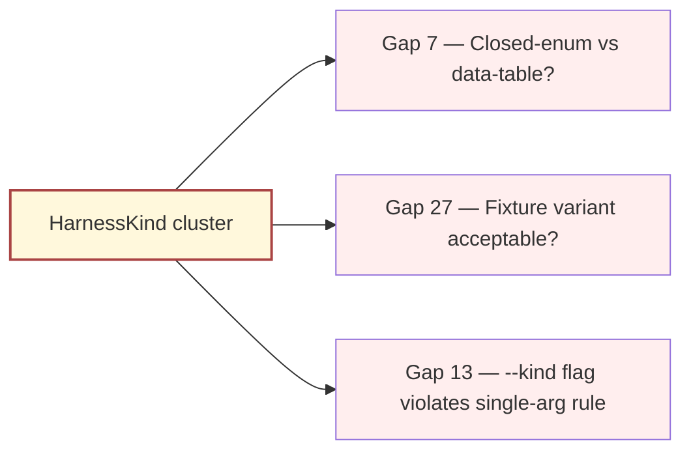

The three are inter-locked: if HarnessKind moves to a data table
(Gap 7), Fixture becomes a registry row (Gap 27 collapses) and the
`--kind` flag retires because the kind is data, not argv-driven
(Gap 13 collapses). If HarnessKind stays closed, all three remain
load-bearing.

## §C.2 Why it's important

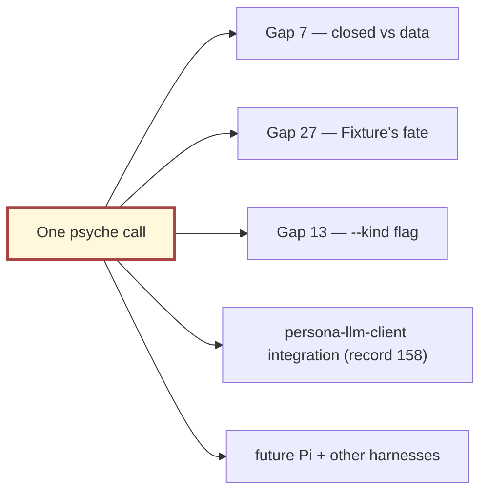

High leverage: one psyche call settles three gaps and shapes two
downstream lines of work.

## §C.3 Candidate designs

### Design A — Data-table conversion (mirror RoleName→LaneRegistry)

HarnessKind becomes a data table in persona-orchestrate (or in a
new `harness_registry` table). New harness kinds add a row. The
daemon reads its kind from its NOTA config (which carries the
`harness_kind_identifier`).

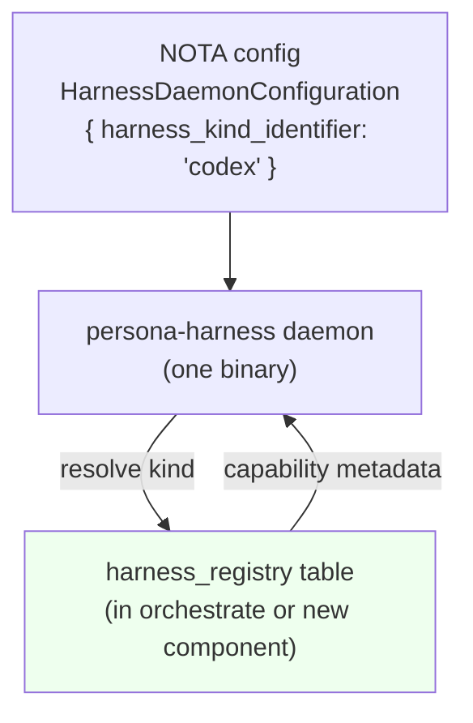

- Composes with the RoleName→LaneRegistry precedent (workspace direction)
- New kinds (e.g. persona-llm-client per record 158, future Pi variants) add rows, no schema bump
- Retires `--kind` flag naturally (kind comes from NOTA config) — Gap 13 closes
- Fixture becomes a registry row (Gap 27 closes; Fixture is data not a closed-enum-variant)
- Loses compile-time exhaustiveness on kind-specific code paths
- Some kind-specific behavior may not fit a generic capability table

### Design B — Open-but-typed (provider + capabilities)

HarnessKind splits into `HarnessProvider` (Anthropic / OpenAI /
Local / etc.) plus a `CapabilityFlags` bitset. The daemon reads
provider from NOTA config; capabilities derive from provider lookup
in a small static table.

- Compiled capability table (some compile-time safety)
- Provider enum is shorter and less likely to grow than per-product enum
- Still a closed enum at the provider level — doesn't fully retire the tension, just shifts it
- New providers still require schema bump

### Design C — Closed-enum-stays-closed (documented criterion)

HarnessKind stays closed with the four current variants. ARCH gains
a "Closed-enum criterion" subsection documenting WHY closed.
Fixture stays. `--kind` flag retires in favor of a NOTA-config
field `harness_kind` (still typed; not argv-driven).

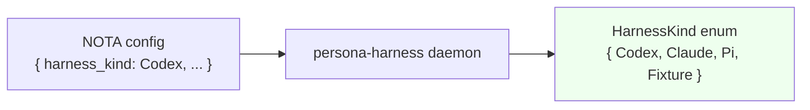

- Preserves compile-time exhaustiveness
- New kinds = coordinated schema bump (per `intent/persona.nota` 2026-05-19T15:04:19Z)
- Retires `--kind` flag — Gap 13 closes regardless of enum-vs-data
- Fixture stays a variant — Gap 27 requires explicit psyche affirmation
- Doesn't compose with RoleName→LaneRegistry precedent

## §C.4 Designer recommendation

**Design C — closed-enum-stays-closed with NOTA config carrying
the kind.** Reasoning:

- HarnessKind differs fundamentally from RoleName: RoleName was
  always "user-meaningful identifier"; HarnessKind drives
  compile-time-typed code (Codex transcripts have specific shapes
  Claude transcripts don't share). Closed-enum preserves the
  compile-time discipline.
- Persona-llm-client (record 158) is a LIBRARY not a harness;
  HarnessKind doesn't grow to include it. The closed list is more
  stable than the gap analysis suggests.
- Single-argument-rule violation (Gap 13) closes regardless of
  enum-vs-data: `--kind` moves to NOTA config in any world.
- Fixture's fate (Gap 27) needs explicit affirmation that
  test-only variants are acceptable when the alternative is a
  separate test mode.

If psyche prefers Design A (data-table) — viable but commits to
runtime-resolved kind-specific behavior; a real shape shift, not
just a schema change. Design B delays the closed-enum question
rather than answering it.

**Composite spirit capture (if Design C):**

- *Decision (Medium):* HarnessKind stays a closed enum; growth by
  coordinated schema bump.
- *Clarification (Medium):* Fixture is an acceptable closed-enum
  variant under the closed-enum-prototype-readiness discipline.
- *Correction (Medium):* The `--kind` argv flag is a
  single-argument-rule violation; move into HarnessDaemonConfiguration.

If Design C, only Gap 13 produces a bead (the flag-to-NOTA
migration); Gaps 7 + 27 close via ARCH text edits.

**Bead title (operator-actionable, conditional on Design C):**
*"Retire persona-harness --kind flag in favor of harness_kind
field in HarnessDaemonConfiguration NOTA argument"*

# §5 Combined recommendation summary

| Gap | Recommendation | Lane | Spirit-capture | Bead-name (if operator-actionable) |
|---|---|---|---|---|
| 11 — Mutate-chain partial-failure | Design B (record-divergence; mirror handover precedent) | operator (after psyche affirms) | Decision (Medium): record-divergence as the rule across mind→orchestrate→router/harness | *"Define Mutate-chain partial-failure as record-divergence across mind→orchestrate→router/harness, with first constraint test in orchestrate"* |
| 15 — Mind→orchestrate handoff | Design A (initial three-verb set matching receiver) | operator | Decision (Medium): MindOrchestrateCaller starts at three verbs (Create / Retire / Refresh) | *"Implement MindOrchestrateCaller with Create / Retire / Refresh verb support in persona-mind, driven by ChoreographyAdjudicator decisions"* |
| 18 — DeliveryTraceKey | Design B (four-field key with hop-index) | operator | Decision (Medium): four-field DeliveryTraceKey; hop_index minted at each component | *"Implement DeliveryTraceKey four-field correlation with Tap stream indexing in persona-introspect"* |
| 7+27+13 — HarnessKind cluster | Design C (closed-enum stays; kind moves to NOTA config) | operator (--kind retire is the only code work) | Decision (Medium) + Clarification (Medium) + Correction (Medium) — three records, one psyche call | *"Retire persona-harness --kind flag in favor of harness_kind field in HarnessDaemonConfiguration NOTA argument"* |

Four gaps elaborated; four recommendations; three discrete
operator-actionable beads (the HarnessKind cluster collapses into
one bead because two of its three sub-gaps close via ARCH edits).

# §6 Where each design lands

| Gap | Permanent home(s) |
|---|---|
| 11 | `skills/component-triad.md` §"Authority chain" (new "Partial-failure shape" subsection) + persona-orchestrate ARCH §"Reply types" |
| 15 | persona-mind ARCH §"MindOrchestrateCaller" + persona-orchestrate ARCH §"Caller integration" |
| 18 | persona-introspect ARCH §"DeliveryTraceKey schema" + signal-persona-introspect ARCH §"Key type definition" + `skills/component-triad.md` §"Observability" (hop_index minting rule) |
| 7+27+13 | persona-harness ARCH §"Closed-enum criterion" + §"Single-arg-rule compliance" + signal-persona-harness ARCH §"HarnessDaemonConfiguration" (adds `harness_kind` field) + `skills/component-triad.md` §"Single argument rule" (no carve-out for `--kind`) |

All four recommendations have clear permanent homes — per-repo ARCH
files for implementation, `skills/component-triad.md` for
cross-cutting discipline. No report destined to live indefinitely.

# See also

- `~/primary/reports/designer/249-component-intent-gap-analysis.md`
  — the original 35-gap inventory this report elaborates four of.
- `~/primary/reports/designer/293-designer-and-research-batch-2026-05-23/5-gap-closure-step-1-2.md`
  — Subagent E's classification picking the top-3
  operator-actionable gaps and the HarnessKind cluster.
- `~/primary/reports/second-designer/154-effect-emitted-and-public-routing-designs-2026-05-22.md`
  — the exemplar shape (problem + multiple candidate designs each
  with mermaid + analysis + recommendation).
- Spirit records 180 + 182 + 183 — version-handover record-divergence
  precedent (Gap 11 Design B).
- Spirit records 98 + 99 + 204 + 211 — role-vector lanes and
  mind+orchestrate priority (Gap 15 Design A).
- Spirit record 184 — introspect as natural home for cross-version
  error logs (Gap 18).
- `~/primary/skills/component-triad.md` — permanent home for Gap
  11's partial-failure rule and Gap 13's single-argument rule.
- `~/primary/skills/mermaid.md` — 8.8-safe Mermaid form used here.
- `~/primary/skills/reporting.md` §"Visuals are Mermaid only" —
  no-ASCII-text-block rule.
- `~/primary/skills/workspace-vocabulary.md` — canonical main/next,
  Persona, engine_management.
