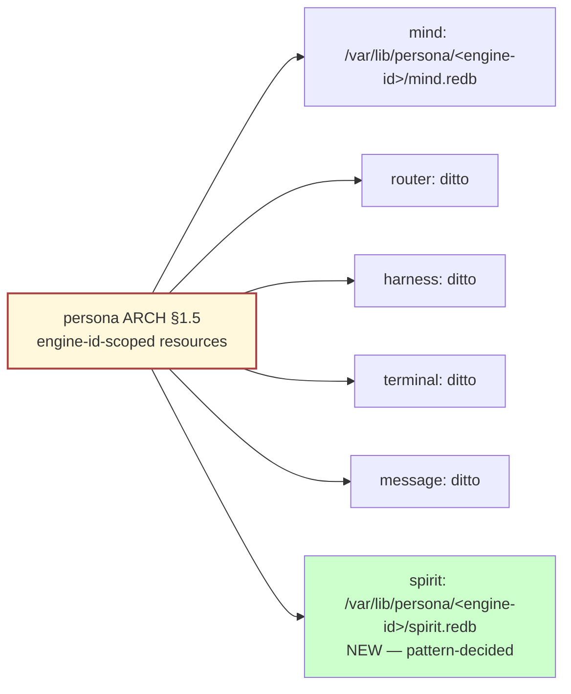
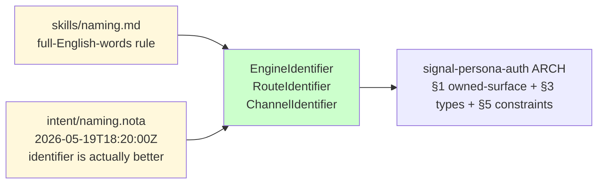
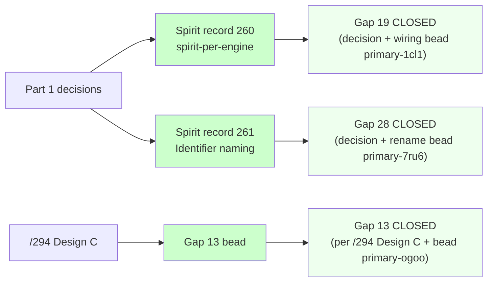
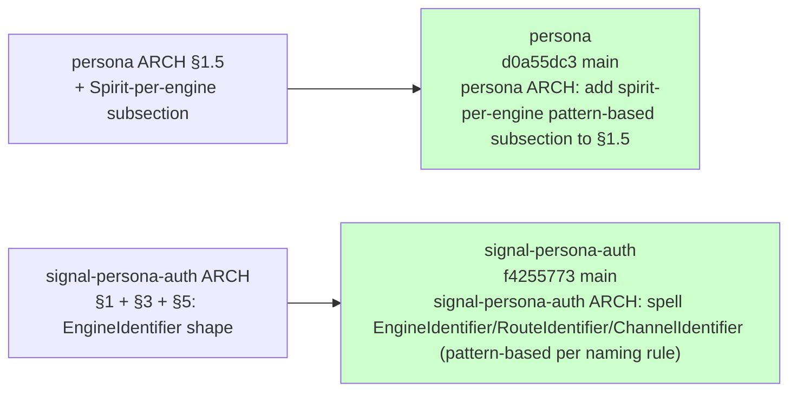

# 296 — Pattern-based decisions and operator beads (gap-closure dispatch)

*Kind: Operator-handoff + manifestation log · Topic: /249 gap-closure
via pattern-based-decision + bead filing · 2026-05-23*

*Dispatched by the prime designer per psyche directive 2026-05-23
(RESTART pass; corrects the prior dispatch's HarnessKind direction).
Driver: spirit record 254 — "designer may close gaps via
pattern-based-decision when past intent establishes a workspace
pattern that obviously applies; mark explicitly as pattern-based."
Companion: /294 (HarnessKind cluster Design C) and
/295 (designer-only-with-direct-intent gaps — separate parallel
dispatch).*

## TL;DR

Two pattern-based decisions closed and manifested: **spirit-per-engine**
(Gap 19) per the engine-id-scoped resources pattern in persona ARCH
§1.5, and **`Identifier` not `Id`** in signal-persona-auth (Gap 28
designer-side) per the workspace naming rule. Both decisions captured
as Spirit records 260 + 261 and manifested in their respective
ARCHITECTURE.md files; Gap 28's mechanical rename also filed as an
operator bead for the source-symbol sweep. Nine operator beads filed
total covering /293/5's operator-actionable gaps (11, 13, 15, 16, 18,
24, 25, 28, 32, 35) plus the spirit-per-engine wiring slice — Gap 17
held off to avoid /295's parallel dispatch. Three knock-on closures
follow from Part 1: Gap 19 fully closed (decision + wiring bead),
Gap 28 fully closed (decision + rename bead), Gap 13 fully closed
(per /294 Design C with bead). Two items flagged for the next psyche
session: Gap 7 + 27 (HarnessKind closed-enum-stays-closed wants
explicit psyche affirmation for the Fixture variant per /294 §C.4)
and Gap 35 (multi-op execution shape is provisional pending
clarification).

## §1 Pattern-based decisions made

Two pattern-based decisions, each explicitly marked as pattern-based
in its target manifestation file plus its spirit-captured record.

### Decision A — Spirit-per-engine (Gap 19)

- **Pattern cited:** persona ARCH §1.5 engine-id-scoped resources
  table (already established for mind, router, harness, terminal,
  message; spirit follows the same shape).
- **Pattern-based decision:** Each engine has its own persona-spirit
  daemon, scoped under `/var/lib/persona/<engine-id>/spirit.redb`.
- **Target file edit:** `/git/.../persona/ARCHITECTURE.md` §1.5 —
  added subsection "Spirit-per-engine" with the resource table for
  spirit redb + ordinary socket + owner socket; pattern-based
  marker is the bold sentence "**Pattern-based decision (per §1.5
  engine-id-scoped resources): each engine has its own
  `persona-spirit` daemon, scoped under
  `/var/lib/persona/<engine-id>/spirit.redb`.**"
- **Spirit record:** 260 (persona Decision, Maximum).
- **Operator bead for the wiring:** `primary-1cl1` — *"Wire
  spirit-per-engine into persona-daemon supervision per
  pattern-decision"*.

### Decision B — `Identifier` not `Id` (Gap 28 designer-side)

- **Pattern cited:** workspace ESSENCE naming rule (full English
  words; identifier > id) — `skills/naming.md` §"The default" +
  §"Permitted exceptions" rule explicitly rejects `id` as an
  acceptable acronym; intent `naming.nota` 2026-05-19T18:20:00Z
  carries the psyche-stated "*identifier is actually better*"
  determination.
- **Pattern-based decision:** Rename `EngineId` → `EngineIdentifier`,
  `RouteId` → `RouteIdentifier`, `ChannelId` → `ChannelIdentifier`.
  The `Id` abbreviation becomes the spelled `Identifier`; the
  `Engine` / `Route` / `Channel` prefixes stay because the three
  are sibling distinctions inside `signal-persona-auth` — not
  redundant ancestry of the namespace. The no-redundant-ancestry
  rule does not collapse them to a single bare `Identifier`,
  because then the three sibling concepts would lose their
  identity-disambiguation.
- **Target file edit:** `/git/.../signal-persona-auth/ARCHITECTURE.md`
  — §1 owned surface, §3 types, §5 constraints row updated to
  spell out the new names; pattern-based marker is the inline
  parenthetical "**Pattern-based decision (per
  `skills/naming.md` full-English-words rule and intent
  `naming.nota` 2026-05-19T18:20:00Z, *"identifier is actually
  better"*): the abbreviated `Id` suffix is the spelled-out
  `Identifier`; the engine/route/channel prefix stays because the
  three are sibling distinctions, not redundant ancestry.**"
- **Spirit record:** 261 (naming Decision, Maximum).
- **Operator bead for the source-symbol sweep:** `primary-7ru6` —
  *"Rename EngineId / RouteId / ChannelId to EngineIdentifier /
  RouteIdentifier / ChannelIdentifier per workspace naming rule
  (pattern-based)"*.

### Decisions NOT made (conservatively held)

- **Gap 24 fine-grain restart policy:** the directive named
  "record 159 + 167-168" as candidate substrate. Records 159 (new
  components persona-listen / persona-speak), 167 + 168 (intent
  logging uses Spirit) do not establish a per-component restart
  policy pattern. Record 240 (systemd template units day-one)
  establishes the substrate but not the values. Designer
  recommendation from /293/5 (Restart=always for non-ephemeral;
  Restart=no for ephemeral terminal cells) is a judgment, not a
  pattern-derivable closure. Filed as operator bead `primary-8r1o`
  carrying the designer's tentative table; operator + system-
  specialist confirm or amend on implementation.
- **HarnessKind cluster (Gap 7 + 27 + 13):** explicitly off-limits
  per directive — /294's Design C analysis stands; Gap 13 bead
  filed per /294's framing; Gaps 7 + 27 remain pending psyche
  affirmation per /294 §C.4.

## §2 Operator beads filed

| Bead ID | Gap | Title (short) | Priority | Lane | DoD short |
|---|---|---|---|---|---|
| `primary-ktkc` | 11 | Mutate-chain partial-failure as record-divergence | P1 | operator | `skills/component-triad.md` gains "Partial-failure shape" subsection; signal-persona-orchestrate `PartialApplied` reply variant; constraint test in persona-orchestrate |
| `primary-7x7k` | 15 | MindOrchestrateCaller with Create / Retire / Refresh | P1 | operator | `MindOrchestrateCaller` actor in persona-mind; ChoreographyAdjudicator emits typed decisions; one constraint test per verb |
| `primary-li3u` | 16 | Audit + fill bootstrap-policy.nota across components | P2 | designer + operator | Audit report; designer-written starter content; per-repo commits |
| `primary-8avm` | 18 | DeliveryTraceKey four-field correlation in introspect | P1 | operator | `DeliveryTraceKey` type in signal-persona-introspect; Tap stream injection writes key; introspect.redb StorePhase indexes; hop-ordered query |
| `primary-8r1o` | 24 | Per-component restart policy via systemd template units | P2 | operator + system-specialist | Decision table in persona ARCH §1.7; template-unit Restart= values match; respawn-after-kill constraint test |
| `primary-d1sp` | 25 | SubscriptionDemand(n) consumer-pull semantics | P2 | operator | `SubscriptionDemand` operation across mind/router/harness; StreamingReplyHandler honors demand; backpressure constraint test |
| `primary-7ru6` | 28 | Rename EngineId/RouteId/ChannelId to *Identifier (pattern-based) | P2 | operator | Source-symbol rename in signal-persona-auth; all consumers updated; cargo + nix flake check green |
| `primary-k92n` | 32 | Retire transitional terminal binaries (consolidation) | P2 | operator | One persona-terminal-daemon binary; ARCH 'transitional' hedge removed; cell crash recovery test |
| `primary-20g4` | 35 | Multi-operation request execution per component | P3 | operator | PROVISIONAL — blocked on psyche clarification; if approved: multi-op type in shared layer + per-component executor + Mutate-chain compose |
| `primary-ogoo` | 13 | Retire persona-harness `--kind` flag → NOTA config field | P1 | operator | per /294 Design C: HarnessKind stays closed enum; `--kind` flag retires; `harness_kind` field in `HarnessDaemonConfiguration` NOTA argument |
| `primary-1cl1` | 19 (impl) | Wire spirit-per-engine into persona-daemon supervision | P2 | operator | per pattern-decision (record 260): per-engine spirit-daemon under `/var/lib/persona/<engine-id>/spirit.redb`; multi-engine integration test |

**Total beads filed:** 11 (10 from the directive's operator-actionable list + 1 spirit-per-engine implementation slice).

**Gap 17 (filesystem-projection cutover) skipped** — per the directive's
parallel-dispatch coordination note, `/295` is touching Gap 17;
no bead filed from this dispatch.

## §3 Knock-on closures

The two Part-1 pattern-based decisions plus the /294-driven Gap 13
bead together close three gaps fully:

- **Gap 19 (engine-per-spirit vs shared spirit) — CLOSED.**
  Pattern-based decision (spirit-per-engine) manifested in persona
  ARCH §1.5; wiring slice filed as `primary-1cl1`. Was OPEN per
  /293/5; was PENDING-CLARIFICATION per /293/5 classification;
  the pattern was strong enough to close without psyche call.
- **Gap 28 (Auth identifier naming) — CLOSED.** Pattern-based
  decision (`Identifier` not `Id`) manifested in signal-persona-auth
  ARCH; source-symbol rename filed as `primary-7ru6`. Was OPEN
  per /293/5; pattern was the workspace naming rule (full English
  words; no `id`).
- **Gap 13 (single-argument-rule violation in `--kind` flag) —
  CLOSED.** Per /294 Design C, the flag retires regardless of the
  closed-enum-vs-data resolution; bead `primary-ogoo` carries
  the implementation. Was OPEN per /293/5 (or CLOSED-just-now
  conditional on /294 settling); /294 settled, so the bead carries
  the closure path.

The remaining 7 operator beads carry forward the OPEN /293/5 gaps
(11, 15, 16, 18, 24, 25, 32, 35) — not closures yet, but each gap
now has a fileable bead with operator-actionable scope + DoD.

## §4 Flagged for psyche

Two items where the pattern was not strong enough to commit and
psyche affirmation is the right next step.

### Gap 7 + 27 — HarnessKind closed-enum-stays + Fixture variant

Per /294 §C.4 explicit recommendation: psyche affirmation needed
that **HarnessKind stays a closed enum** (Design C) AND that
**Fixture is an acceptable variant under the closed-enum-prototype-
readiness discipline.** /294's reasoning for Design C is strong
(HarnessKind types are code-shape distinctions, not runtime-dynamic
like lanes/roles) but the affirmation is explicit psyche territory
because the alternative direction (data-table per RoleName→
LaneRegistry precedent) is also defensible. Once psyche affirms
Design C, Gaps 7 + 27 close via ARCH text edits; Gap 13's bead
(`primary-ogoo`) executes regardless of the cluster resolution.

**Question framing for psyche:** "HarnessKind cluster (Gaps 7 + 27).
Per /294 Design C, recommend: closed enum stays (Codex, Claude,
Pi, Fixture); Fixture is acceptable under closed-enum-prototype-
readiness; growth by coordinated schema bump (per
`intent/persona.nota` 2026-05-19T15:04:19Z). Alternative Design A
(data-table per RoleName→LaneRegistry) is viable but commits to
runtime-resolved kind-specific behavior. Affirm Design C, prefer
Design A, or another framing?"

### Gap 35 — Multi-operation request execution

Filed as bead `primary-20g4` at P3 with explicit PROVISIONAL
marker. The shape question — "is the multi-op runtime slice a real
future feature or is one-op-per-request a permanent constraint?"
— is psyche's call per /293/5 classification. Bead executes only
if psyche affirms the runtime slice; otherwise retires.

**Question framing for psyche:** "persona-message's ARCH says
multi-op execution belongs in 'shared Signal runtime slice, not
in this component's ad hoc codec.' Is that runtime slice a real
future feature (signal-frame / signal-channel extension?), or
is one-op-per-request a permanent constraint? Knock-on into
signal-real-time (record 160) which may share the runtime if it
exists."

### Items NOT flagged

- **Gaps 1, 6, 19, 20, 31, 34** — left as /293/5 classified
  (PENDING-CLARIFICATION items unchanged by this dispatch);
  Gap 19 is now CLOSED via the spirit-per-engine pattern-based
  decision (not flagged — closed).
- **Gap 8** — auditing-arc + spirit-guardian timing remains
  PENDING-CLARIFICATION per /293/5; this dispatch did not touch
  it.
- **Gap 9** — owner-signal-* repo emergence remains
  PENDING-CLARIFICATION + DESIGNER-ONLY composite per /293/5;
  not touched by this dispatch.

## §5 Commits made

Two commits land from this dispatch (one per repo):

- **persona** `d0a55dc3` *persona ARCH: add spirit-per-engine
  pattern-based subsection to §1.5* — added §"Spirit-per-engine"
  subsection under §1.5, with pattern-based marker citing §1.5
  engine-id-scoped resources, plus the per-engine resource table
  for spirit redb / ordinary socket / owner socket.
- **signal-persona-auth** `f4255773` *signal-persona-auth ARCH:
  spell EngineIdentifier/RouteIdentifier/ChannelIdentifier
  (pattern-based per naming rule)* — §1 owned surface, §3 types,
  §5 constraints row updated; pattern-based marker added with
  citation to `skills/naming.md` + intent `naming.nota`
  2026-05-19T18:20:00Z.

Both pushed to `main` per `skills/jj.md` standard flow (`jj commit`
+ `jj bookmark set main -r @-` + `jj git push --bookmark main`).

## See also

- `~/primary/reports/designer/249-component-intent-gap-analysis.md`
  — the original 35-gap inventory this dispatch closes against.
- `~/primary/reports/designer/293-designer-and-research-batch-2026-05-23/5-gap-closure-step-1-2.md`
  — Subagent E's per-gap classification; this dispatch implements
  the operator-actionable bead-filing per §2 + §3.
- `~/primary/reports/designer/294-most-important-gaps-visual.md`
  — Design C for HarnessKind cluster (Gap 7 + 27 + 13); Design B
  for Gap 11 partial-failure; Design A for Gap 15 mind→orchestrate;
  Design B for Gap 18 DeliveryTraceKey. This dispatch's bead
  bodies cite /294's recommendations verbatim.
- Spirit record 254 — *"designer may close gaps via pattern-based-
  decision when past intent establishes a workspace pattern that
  obviously applies; mark explicitly as pattern-based"* (the rule
  this dispatch operates under).
- Spirit record 260 — pattern-based decision for spirit-per-engine
  (this dispatch's output).
- Spirit record 261 — pattern-based decision for `Identifier`
  naming (this dispatch's output).
- `~/primary/skills/naming.md` — full-English-words rule + no-`id`
  exception cited for Gap 28.
- `~/primary/skills/architecture-editor.md` §"Architecture files
  never reference reports" — this report cites no reports from
  inside the manifestation files; ARCH edits are self-contained.
- `~/primary/skills/component-triad.md` §"The single argument
  rule" — load-bearing for Gap 13 closure rationale.
