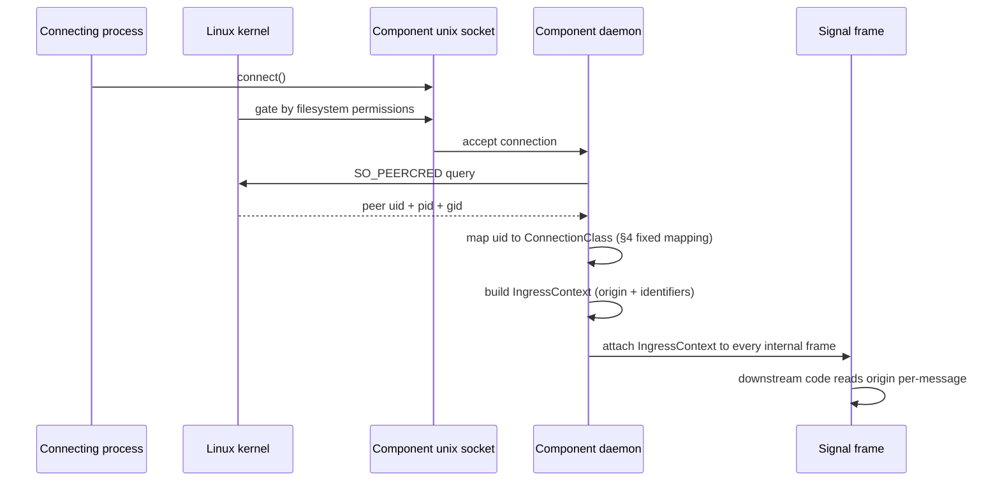

# 297 — signal-persona-auth — mechanism + rename direction

*Kind: Design · Topic: signal-persona-auth-rename · 2026-05-23*

*Psyche flagged the crate name 2026-05-23: "the name is auth, not
authentication. I dont know what auth is, and if it's not
authentication, then it shouldnt be called that." Captured as spirit
intent record 262 (naming, Correction, Maximum). This report names
what the crate actually does, why the current name violates the
workspace naming rule on two counts, and proposes rename candidates
for psyche approval.*

## What the crate actually is

`signal-persona-auth` is a **types-only contract crate** for
Persona ingress provenance — typed records describing *where a
request entered the engine* and *what known route/channel labels
are attached to that ingress*. The TL;DR in
`repos/signal-persona-auth/ARCHITECTURE.md` opens with the line:
"This crate is deliberately not an authentication library."

What it owns (per ARCH §1 "Owned surface"):

- `EngineIdentifier`, `RouteIdentifier`, `ChannelIdentifier` —
  typed namespace nouns; not security tokens.
- `ComponentName` — closed enum of supervised local component
  principals.
- `ConnectionClass` — closed enum of ingress classes: `Owner`,
  `NonOwnerUser(Uid)`, `System`, `OtherPersona`, `Network`.
- `OwnerIdentity` — engine ownership recorded from local system
  context.
- `MessageOrigin` — `Internal(ComponentName)` or
  `External(ConnectionClass)`.
- `IngressContext` — the bundle attached to a Signal frame.

What it explicitly is NOT (per ARCH §8 "Non-goals"): no in-band
signing, no runtime permission checks, no component socket
ownership, no routing policy, no storage.

## How the mechanism actually works

Trust is **OS-level**, not protocol-level. The crate provides the
typed vocabulary the daemon uses to record kernel-supplied facts.

The mapping (per ARCH §4) is contract-stable:

- On `message.sock` (the only user-writable socket in the engine):
  `uid == engine_owner_uid` → `ConnectionClass::Owner`; else →
  `ConnectionClass::NonOwnerUser(Uid)`.
- On internal mode-0600 sockets (only persona-user processes can
  connect; the kernel rejects other uids before the accept loop
  runs): `uid == persona_system_uid` →
  `Internal(component_name from spawn envelope)`.

There is no challenge/response, no token, no signature. The
connecting process already proved it is a particular uid by virtue
of the kernel having let it write to the socket (filesystem ACLs
gate that) and report its credentials via SO_PEERCRED.

## How downstream contracts use it

Other contract crates import its typed records and attach them to
their own request/reply payloads:

- `signal-persona-message` requires `IngressContext` on its
  ingress operations so the handling code knows "this came from
  the owner via message.sock" vs "this came from persona-mind
  via an internal route socket."
- `signal-persona` requires `OwnerIdentity` on its `SpawnEnvelope`
  so spawned components know their engine owner.

The crate is types-only — no `signal_channel!` declaration, no
contract verbs. Other contracts compose its nouns.

## Why the current name violates two rules at once

The naming discipline lives in `ESSENCE.md §Naming` +
`skills/naming.md`:

1. **Spell every identifier as a full English word.** "Auth" is an
   abbreviation; abbreviations are forbidden unless they have
   fully passed into general English (CPU qualifies; auth does not).
2. **Names mean what they say.** A name that suggests one thing
   while the thing carries another sets up a misleading mental
   model. "Auth" is the universal software-ecosystem convention
   for "authentication"; the ARCH's first line saying
   "deliberately not an authentication library" IS the smell that
   the name is wrong.

Spirit record 262 (naming, Correction, Maximum) captures both
counts.

## Rename candidates

| Candidate | What it suggests | Tradeoff |
|---|---|---|
| `signal-persona-ingress` | Where requests enter the engine | Closest match to ARCH §0 wording ("typed provenance records for Persona ingress"); generic enough to cover `MessageOrigin` + `ConnectionClass` + identifiers; reads as place-of-entry |
| `signal-persona-origin` | Where requests came from | Tighter; mirrors the type name `MessageOrigin` directly; reads as "what the crate is about" without the "where things enter" framing |
| `signal-persona-provenance` | Typed record of how the request got here | Most precise term; "provenance" is the academic word for this pattern; might be less discoverable for new agents |

Recommendation: **`signal-persona-ingress`** matches the ARCH §0
framing and stays close to vocabulary already used in the workspace
(`IngressContext`, internal-vs-external ingress classes).

## Consequences of the rename

A workspace-wide source-level rename touches:

- The crate's own `Cargo.toml` name + directory name
- Every `Cargo.toml` that depends on it
- Every `use signal_persona_auth::` in the workspace
- ARCH files that name it (`signal-persona`, `signal-persona-message`,
  `persona`, `signal-persona-auth` itself)
- Skill files that reference it (likely few)
- This report and any sibling reports

This is bead-shaped (operator pickup). It is parallel to the
already-filed source-level Identifier rename under bead
`primary-7ru6` (EngineId → EngineIdentifier etc., per spirit
record 261). The two could bundle into one rename pass.

## Open for psyche

- Pick a rename target from the candidates above (or name a
  different one).
- Confirm whether the rename bundles with bead `primary-7ru6` (the
  already-filed Identifier source-level rename — one pass covering
  both the type-shape rename and the crate name) or files as a
  separate bead.

## See also

- `repos/signal-persona-auth/ARCHITECTURE.md` — the crate's own
  architecture
- `ESSENCE.md §Naming` — the workspace naming rule the current
  name violates
- `skills/naming.md` — the full naming discipline including
  worked examples
- Spirit record 262 — the correction captured in this session
- Bead `primary-7ru6` — already-filed Identifier source-level
  rename (candidate bundle target)
