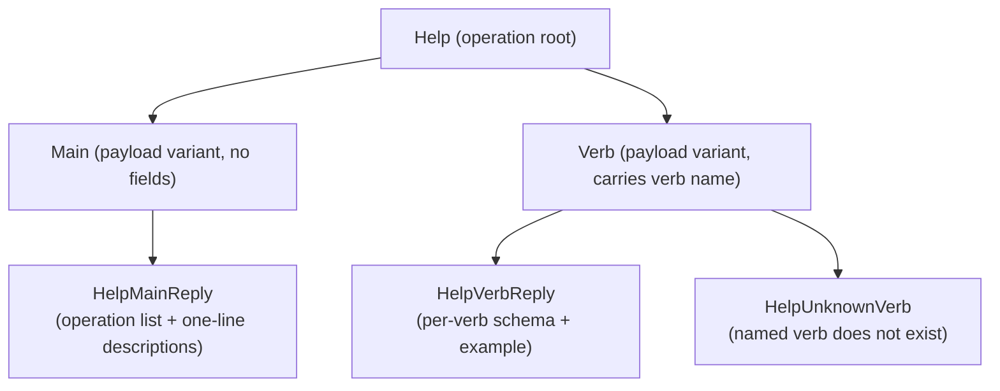
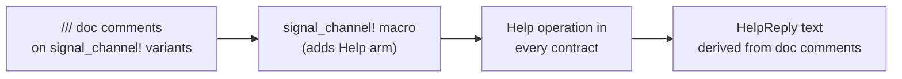

# 298 — Help operations in every component

*Kind: Design · Topic: help-operations · 2026-05-23*

*Psyche 2026-05-23: "we should have a (Help Main) and (Help Verb)
in components, we could maybe wire the help documentation in the
macros." Captured as spirit intent record 263 (component-shape,
Decision, Maximum). This report names the shape of the Help
operations, proposes auto-injection via the signal-channel macro,
and surfaces open design questions for psyche confirmation.*

## Why Help operations

The workspace forbids flag-based help — every component binary
takes exactly one NOTA argument per `skills/component-triad.md`
§"The single argument rule". So `--help` is not a path. Discovery
has to happen through the same NOTA channel as every other
operation.

`(Help Main)` and `(Help Verb)` are the discovery surface every
component carries:

- **`(Help Main)`** — top-level discovery. Returns the list of
  operations the component supports, a one-line description of
  each, and the canonical NOTA shape for invoking them.
- **`(Help (Verb name))`** — verb-level detail. Returns the full
  typed schema for one operation: payload fields, types,
  descriptions, an example invocation, and the reply shape.

The Help operations match the same rules as every other operation:
positional NOTA records, single-argument, daemon-side
implementation, typed reply. No flags, no special parsing.

## Shape — operation root + payload variants



In NOTA text form:

- `(Help Main)` — Help operation; Main variant.
- `(Help (Verb "Record"))` — Help operation; Verb variant carrying
  the operation name as a string.

The reply is a typed `HelpReply` (or the closed-set above) carrying
structured help text. The CLI's job is to print it.

## Auto-injection via the signal-channel macro

The cleanest direction is **auto-injection** — the
`signal_channel!` macro that declares every signal contract gets
a new arm that emits the Help operation automatically. Every
contract picks it up on the next rebuild; no per-contract
boilerplate.

The macro derives help text from the existing Rust doc comments
on operation variants. The contract declaration already carries
this prose; the macro just exposes it through a NOTA op.



Concretely, a contract declaration like

```rust
signal_channel! {
    Operation {
        /// Record a new intent entry. Daemon stamps date/time.
        Record(IntentRecord),
        /// Observe stored records; filter by topic and/or kind.
        Observe(Query),
    }
}
```

makes `(Help Main)` return the operation list with `Record` and
`Observe` plus their one-line descriptions, and
`(Help (Verb "Record"))` return the full `IntentRecord` schema
with its field-level doc comments.

This keeps help **always-fresh** — it's derived from the same
declarations that define the contract; there is no separate help
text to maintain in sync.

## Where the machinery lives

| Piece | Home |
|---|---|
| `Help` operation enum + payload variants | Auto-injected by `signal_channel!` macro into every contract; no contract-side code |
| `HelpReply` type | Kernel layer (`signal-frame`) so every contract shares the same reply shape |
| Doc-comment extraction | Macro-level; reads `///` annotations on operation variants and payload fields at compile time |
| Schema serialisation | Macro emits `to_help_text` impls on payload types; the daemon calls them when handling `(Help (Verb name))` |
| Daemon handler | One arm added to every component daemon's request loop; routes `Help` operations to the auto-generated implementation |

Exact crate paths in the workspace need verification at
implementation time; the conceptual shape is what's pinned here.

## CLI passthrough — no special-casing

The thin CLI is the daemon's first client. It takes a NOTA arg,
sends it to the daemon, prints the reply. For `(Help Main)` or
`(Help (Verb name))`, the CLI does the same thing — pass it
through, print the typed reply as text.

There is no need for a CLI-side help feature; the daemon owns
the help machinery. The thin CLI just routes. This matches the
single-argument rule and avoids the temptation to add a
CLI-only `--help` shortcut.

## Open for psyche

- **Layer placement.** Auto-injected by `signal_channel!` at the
  macro layer (recommended; every contract gets Help for free),
  or per-contract declaration (more explicit but repetitive)?
- **`(Help Verb)` granularity.** Just the operation's one-line
  description, or full payload schema (field names, types, doc
  comments, example invocations)? The latter is more useful but
  requires the macro to traverse payload type definitions.
- **Reply type home.** `HelpReply` shared at the kernel layer
  (`signal-frame`) so every contract uses the same reply shape,
  or per-contract local types (more isolated but redundant)?
- **Binaries without a daemon.** Standalone NOTA-arg tools that
  don't talk to a daemon — do they get Help too via a shared
  NOTA-arg-parser library? Or is this daemon-backed only? Most
  workspace binaries are daemon-backed; standalone NOTA-arg tools
  are rare.
- **`(Help (Verb name))` for unknown verbs.** Reply with a typed
  `HelpUnknownVerb` (closed-set), or include the available
  verb names so the caller can correct? Recommended: include the
  list — it's the discovery affordance the operation is meant for.

## Implementation scope

The change is **operator-shaped** and bead-shaped. The work, once
the open questions resolve:

1. Add the Help arm to `signal_channel!`. One macro change.
2. Add `HelpReply` family to the kernel layer. One type addition.
3. Wire the auto-generated handler into the component daemon's
   request loop. One pattern, applied to each daemon.
4. Existing signal contracts pick it up on rebuild. No per-contract
   edits needed.
5. CLIs pick it up via passthrough. No CLI-side edits needed.

The cost scales with the number of component daemons (each needs
the handler wire-in), not the number of operations.

## See also

- `skills/component-triad.md` §"The single argument rule" — why
  no `--help` flag is permitted; every binary takes one NOTA arg.
- `skills/nota-design.md` — positional NOTA records, no labeled
  arguments.
- Spirit record 263 — the Help-operations decision captured in
  this session.
- `signal_channel!` macro — the workspace's signal-contract
  declaration mechanism; exact crate path to be verified at
  implementation.
