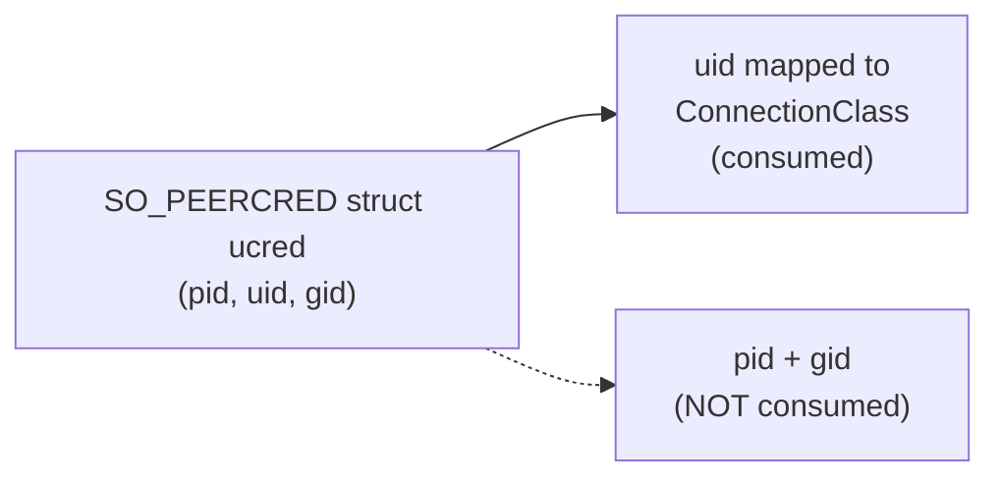
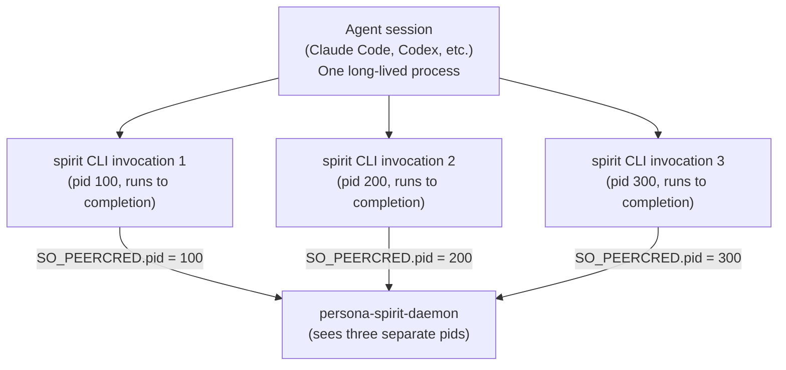

# 299 — signal-persona-origin: what it documents, and per-process / per-agent identity

*Kind: Design · Topic: origin-process-identity · 2026-05-23*

*Psyche 2026-05-23: "what is signal-persona-origin (thats the name
we'll use) documenting exactly? (SO_PEERCRED?) - is that a per-process
identifier, which would let us identify agents specifically?" The
rename to `signal-persona-origin` is decided per spirit record 264.
This report answers what the crate documents, where SO_PEERCRED fits
in, and what is available vs missing if the psyche wants agent-level
identification.*

## What signal-persona-origin documents

Three categories of origin facts attached to every connection that
crosses the daemon's accept boundary:

1. **Kernel-supplied peer credentials** — read at the moment of
   accept() via `SO_PEERCRED`. The crate's typed records carry a
   derived classification (`ConnectionClass`), not the raw kernel
   struct.
2. **Local trust boundary** — which socket the connection arrived
   on (the per-engine `message.sock`, the owner socket, an
   internal route socket). The socket's filesystem permissions
   are how the kernel decided the connecting process was allowed
   to connect at all.
3. **Spawn-envelope identifiers** — for internal connections, the
   component name that persona-daemon passed in the spawn envelope.
   This is how the daemon knows "the persona-user process talking
   to me is persona-mind specifically", not some other persona-user
   process.

The crate abstracts these three categories into a single
`IngressContext` bundle that downstream code reads per-message.

## SO_PEERCRED — what it actually returns

`SO_PEERCRED` is a Linux socket option that a daemon queries on an
accepted connection. The kernel returns a `struct ucred`:

| Field | Meaning | Granularity |
|---|---|---|
| `pid` | The connecting process's pid at connect() time | per-process (one CLI invocation = one pid) |
| `uid` | The connecting process's effective uid | per-user |
| `gid` | The connecting process's effective gid | per-group |

So yes — SO_PEERCRED carries a per-process identifier. The kernel
populates this when the process calls `connect()`; the daemon
queries it when it `accept()`s. It is **forge-proof against the
connecting process** — a process cannot lie about its own
pid/uid/gid to the kernel.

## What the current crate consumes

Per `signal-persona-origin/ARCHITECTURE.md` §4 (formerly
signal-persona-auth pre-rename), the `ConnectionClass` mapping
consumes **only `uid`** today:

The mapping is:

- On `message.sock`: `uid == engine_owner_uid` → `Owner`; else →
  `NonOwnerUser(Uid)`.
- On internal mode-0600 sockets: `uid == persona_system_uid` →
  `Internal(component_name from spawn envelope)`.

The `pid` is available from the kernel but the typed records do
not currently carry it. The spawn envelope — separate from
SO_PEERCRED — is what tells the daemon WHICH internal component
is connecting. The kernel's `uid` check just confirms "this is
SOME persona-user process"; the envelope says "specifically
persona-mind".

## Process identity vs agent identity — the gap

The psyche's question: "is that a per-process identifier, which
would let us identify agents specifically?"

The honest answer is **process ≠ agent**, and the gap matters:

The daemon sees three separate processes (three pids) but they all
came from one agent session. SO_PEERCRED identifies the **CLI
invocation**, not the agent. Agent-level identity therefore
requires something **more than** kernel credentials alone.

## Three options for closing the gap

If agent-level identity is needed, three approaches:

| Option | Mechanism | Strength | Weakness |
|---|---|---|---|
| **1. Per-CLI-invocation pid tagging** | Extend `ConnectionClass` to include the pid: `Internal(component_name, pid)` | Kernel-verified; cheap to add | Only correlates within one CLI run; cannot tie two CLI runs to the same agent |
| **2. Agent self-id in NOTA** | Agent passes an opaque `agent-id` field in every NOTA argument; daemon records it in `IngressContext` | True agent-level identity across many CLI invocations | Agent has to carry the identifier itself; kernel does not verify NOTA contents — an agent can fake its id |
| **3. Long-lived agent socket** | The agent (not the CLI) connects directly to the daemon over a long-lived socket; SO_PEERCRED.pid identifies the agent process for the duration | Kernel-verified, true agent-level, supports push delivery | Breaks the current "CLI is the daemon's first client" pattern — the agent becomes a client too |

Option 3 is the cleanest architecturally if agent identity is
load-bearing, but it is also the largest design extension.

## What this would actually be USED for

Agent identity is meaningful only in proportion to what the daemon
DOES with it. Possible uses, each with different requirements:

- **Audit trail.** "Which agent recorded this intent?" — Option 2
  is enough. The agent is trusted to identify itself honestly
  for audit purposes.
- **Per-agent state isolation.** Each agent has its own
  scratchpad / view / subscription — needs persistent identity
  (Option 2 or 3) plus a daemon-side map from agent-id to state.
- **Push notifications / subscriptions.** This agent wants to
  be notified when its in-flight tasks complete — needs Option 3
  (long-lived socket) so the daemon can push back over an open
  connection.
- **Rate limiting / quotas.** Per-agent budgets — needs durable
  agent identity (Option 2 or 3) plus a quota store.

Without knowing the use case, picking between options is
premature. The current ARCH is sufficient where **user-level
identity is enough** (Owner vs NonOwnerUser is enough security;
internal components are distinguished by component-name from
spawn envelope, not by individual agent).

## Open for psyche

- **Is agent-level identity needed?** If yes, what is it for —
  audit, per-agent state, subscription delivery, quotas, something
  else? The use case picks the option.
- **If yes:** Option 1 (pid in ConnectionClass), Option 2 (agent
  self-id in NOTA), or Option 3 (long-lived agent socket)?
- **Per-CLI-invocation tagging without agent-level identity** —
  would a pid field in `ConnectionClass` be useful on its own?
  It lets the daemon correlate "these three operations all came
  from one CLI run" (potentially useful for transactional
  behavior or batched intent recording), without any agent-level
  story.

## See also

- `signal-persona-origin/ARCHITECTURE.md` (post-rename) §4 — the
  current uid-only mapping.
- `reports/designer/297-design-signal-persona-auth-rename.md` —
  the rename direction (resolved to `signal-persona-origin` per
  spirit record 264).
- Spirit record 262 — the original naming correction that
  triggered the rename.
- Spirit record 264 — the chosen rename target.
- `man 7 unix` §"SCM_CREDENTIALS" / `SO_PEERCRED` — kernel
  documentation for the underlying mechanism.
