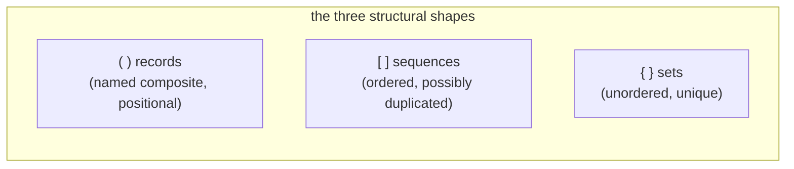

# Curly brackets — set literals (the structural use)

Status: corrects and supersedes report 29
Author: Claude (designer)

The user caught a category mistake in report 29. My
"intension form" proposal — `{Point horizontal:f64 vertical:f64}`
as a schema declaration — embedded a **verb** (declaring) into
the **delimiter**. That's exactly what nexus rules out:
**every operation lives on a record's head identifier; delimiters
define structure only.** I was painted back into the
"programming language" corner — treating `{ }` as if it could
carry semantic meaning ("this is a definition" / "this is data")
the way Lisp's quote operator carries meaning.

Re-doing the question correctly: **what is the most useful
purely-structural shape that `{ }` could denote, given that
`( )` is records and `[ ]` is sequences?**

The answer is **set literals**. `{ }` denotes an unordered,
unique-element collection. This is a structural shape distinct
from records and sequences; it carries no operational meaning;
it lets set algebra read naturally; and it preserves the
"everything is a request via record head identifier" discipline.

This report supersedes report 29. Cross-references in
surviving reports are updated; the brainstorming substance
that was useful in 29 (the wide list of candidates) is
preserved here in §3.

---

## 0 · TL;DR



`{ }` denotes a **set** — unordered, unique elements. The
schema (receiving Rust type) determines the element type.
Examples:

```nexus
;; A set of typed kind names:
{MetalObject HouseholdObject Owned}

;; Used in set-algebra over typed kinds:
(KindIntersection {MetalObject HouseholdObject})
(KindUnion {MetalObject WoodenObject})

;; A Unify record with a set of bind names:
(Unify {id owner})

;; A set of patterns where order of conjunction doesn't matter:
(Constrain
  {(HasKind @id MetalObject)
   (HasKind @id HouseholdObject)
   (HasOwner @id Me)}
  (Unify {id}))

;; Empty set:
{}
```

That's it. No verb meaning. No "definition vs. data"
distinction. Pure structure.

---

## 1 · The principle that report 29 violated

Nexus's discipline:

- **Delimiters define structure** — what kind of *container*
  this is.
- **Head identifiers define meaning** — what kind of *thing*
  this is.
- **Schema (receiving type) determines interpretation** —
  data vs. pattern, set vs. list-with-set-semantics, what
  fields exist.

`( )` doesn't mean "record"; it means "named-positional-
composite container". The head identifier names what kind of
container it is. `(Match …)` is a Match; `(Point …)` is a
Point.

`[ ]` doesn't mean "list"; it means "ordered collection
container". The receiving type names what kind of collection
it is — `Vec<T>`, `&[T]`, etc.

Neither delimiter encodes verbs or operational distinctions.
A reader of nexus text can identify the **shape** of a value
from its delimiter; the **meaning** comes from context (head
ident or receiving type).

Report 29's intension form broke this. `{Point horizontal:f64
vertical:f64}` made the delimiter mean "this is a schema
declaration" — a syntactic verb. That's the same anti-pattern
as old nexus's `~( )` for mutate, `!( )` for retract: putting
operations into delimiters. Report 23 dropped those for
exactly this reason.

The correct way to declare a schema is the same as the
correct way to do anything else in nexus: **a typed record
with a head identifier**. Something like:

```nexus
(SchemaDeclaration Point [(Field horizontal f64) (Field vertical f64)])
```

— a record whose head identifier (`SchemaDeclaration`) names
what's being done. That request gets typed-dispatched and
processed by the Sema kernel just like any other request.
The delimiters stay structural; the meaning lives on the head
ident.

So: `{ }` should *not* mean "schema." It should denote a
**structural shape** that records and sequences don't already
cover.

---

## 2 · The principle stated

A clean statement of the rule, for the future:

> Delimiters denote container shape. They never carry operational
> or semantic meaning. New meaning enters the language as new
> record kinds (closed enum variants in the Request enum or in
> domain-specific Pattern enums); the parser stays small.

This is a corollary of "every Nexus expression is a request"
— *every* expression is a structural form whose meaning is
determined by its head identifier and receiving type, not by
its delimiter pair.

Worth landing in a workspace skill. Probably
`~/primary/skills/contract-repo.md` or
`~/primary/skills/language-design.md`. (Suggested update at
the end of this report.)

---

## 3 · The structural candidates

Re-running the brainstorm under the structural-only filter,
the candidates fall into three buckets:

### Already covered (rejected as redundant)

| Candidate | Shape | Why redundant |
|---|---|---|
| Tuple (anonymous record) | named-positional-composite without head | nexus forbids anonymous tuples (per `skills/rust-discipline.md` §"One object in, one object out") |
| Pair | 2-element collection | a sequence of 2 or a 2-field record covers it |
| Empty wrapper | one-element container | nexus has `None` sentinel for absence |

### Verb-shaped (rejected — what report 29 fell into)

| Candidate | Why rejected |
|---|---|
| Intension form / schema declaration | Encodes "declaring" as syntax. Use a `(SchemaDeclaration …)` record. |
| Resilience-plane meta-form | Encodes "this is a governance record" as syntax. Use head-ident namespace conventions. |
| Capability / context wrapper | Encodes "with-context" as syntax. Use a `(WithContext …)` record. |
| Quotation / unevaluated form | Encodes "as data, not verb" as syntax. Nexus has no eval anyway. |
| Subscription template | Encodes "streaming" as syntax. Use the `Subscribe` verb. |

### Structural and not redundant

| Candidate | Shape | Distinct from `[ ]`? |
|---|---|---|
| **Set** | unordered, unique-element collection | Yes — uniqueness + unordered semantics |
| **Multiset / bag** | unordered, count-bearing collection | Yes — unordered, but allows duplicates with counts |
| **Map / dictionary** | key-value association | Yes — keys are first-class, not positional |
| **Graph (nodes + edges)** | structural relation network | Could fit; very ambitious |
| **Partition / equivalence classes** | nested unordered groupings | Niche; `{{a b} {c} {d e}}` |

The strongest pure-structural candidates are **set**, **map**,
**multiset**.

---

## 4 · Why set wins among the structural candidates

### Set vs. multiset

A multiset is a set with element counts. The structural shape
is "unordered with counts". This is a small refinement of set
— most uses don't need counts, and when they do, a set of
`(value, count)` pairs covers it.

Multisets are also rare in typed databases. The user's vision
(set algebra over typed kinds) is plain sets. **Set wins.**

### Set vs. map

A map has keys. Nexus's discipline is **positional, schema-
driven, no field names in the wire**. Maps reintroduce keyed
access — exactly what the schema was meant to subsume.

Maps could be expressed as a sequence of `(key value)` pairs
(`[(name "Alice") (age 30)]`) where the receiving type is
`BTreeMap<K, V>`. The schema knows it's a map. No new
delimiter needed.

The user has been firm: nexus is positional. Adopting map
literals as `{ }` would soften that discipline. **Set wins.**

### Set as the answer

A set:

- Has a structural shape (unordered, unique) distinct from
  sequences and records.
- Doesn't introduce keys; elements are positional in the
  conceptual sense (membership is the only relation).
- Aligns with the user's set-algebra-over-typed-kinds vision
  (per report 25 §10).
- Is what the user wrote naturally in the original example:
  `{MetalObject HouseholdObject}` *was* the intuitive form
  for "the set of these two kinds."
- Has direct rkyv backing (`BTreeSet<T>`) and a canonical
  encoding (sorted by canonical-byte order of element).

Set is the answer.

---

## 5 · What set literals enable

### a. Set algebra over typed kinds reads naturally

The user's report 25 §10 example becomes:

```nexus
;; "All metal household objects":
(Match (KindIntersection {MetalObject HouseholdObject}) Any)

;; "Metal or wooden objects":
(Match (KindUnion {MetalObject WoodenObject}) Any)

;; "Household objects that aren't decorative":
(Match (KindDifference HouseholdObject {Decorative}) Any)

;; "Subkinds of PhysicalObject":
(Match (SubkindsOf PhysicalObject) Any)
;; ...returns a Set<KindName> in the reply
```

The query matches the math. The set-algebraic primitives
(`KindIntersection`, `KindUnion`, `KindDifference`) take
`Set<KindName>` arguments naturally; the wire form makes the
set explicit.

### b. Unify records become semantically correct

Currently report 26 wrote `(Unify [id])` — a *sequence* of
bind names. But unification is a *set* operation: order
doesn't matter; duplicates are meaningless. The right form:

```nexus
(Unify {id})
(Unify {id owner})
```

The receiver knows it's `Set<BindName>`; the wire form
matches the semantics.

### c. Constrain's pattern list could be a set

If multi-pattern conjunction is order-independent (which it
mathematically is — `A AND B = B AND A`), then the patterns
inside `Constrain` are a *set* of patterns:

```nexus
(Constrain
  {(HasKind @id MetalObject)
   (HasKind @id HouseholdObject)
   (HasOwner @id Me)}
  (Unify {id}))
```

The wire form makes it visually clear: this is a set of
patterns to be conjoined; no order is implied.

(Whether `Constrain` *should* take a set or a sequence is a
semantic design choice; the structural form follows the
choice. Sets read better when order is genuinely irrelevant.)

### d. Set membership in patterns

```nexus
;; Pattern: any individual whose kind set contains all of these:
(KindsContain {MetalObject HouseholdObject})

;; Pattern: any individual in this set of identities:
(IdentityIn {alice bob carol})
```

### e. Empty set has a clean form

```nexus
{}
```

Empty sequence is `[]`; empty set is `{}`. Both are useful.

---

## 6 · Spec impact

### Lexer

```rust
pub enum Token {
    // existing
    LParen, RParen,
    LBracket, RBracket,
    At, Colon,
    Ident(String),
    Bool(bool), Int(i128), UInt(u128), Float(f64),
    Str(String), Bytes(Vec<u8>),

    // new
    LBrace, RBrace,
}
```

13 token variants (was 12 in Tier 0). One new byte-class
branch in `next_token`: `b'{' → LBrace`, `b'}' → RBrace`.
First-token-decidable; max 2-char lookahead unchanged.

### Decoder

A new `expect_set_start` / `expect_set_end` pair (mirrors
`expect_seq_start` / `expect_seq_end`):

```rust
impl<'input> Decoder<'input> {
    pub fn expect_set_start(&mut self) -> Result<()> {
        match self.next_token()? {
            Token::LBrace => Ok(()),
            other => Err(Error::UnexpectedToken {
                expected: "`{` opening a set",
                got: other,
            }),
        }
    }

    pub fn expect_set_end(&mut self) -> Result<()> {
        match self.next_token()? {
            Token::RBrace => Ok(()),
            other => Err(Error::UnexpectedToken {
                expected: "`}` closing a set",
                got: other,
            }),
        }
    }

    pub fn peek_is_set_end(&mut self) -> Result<bool> {
        let token = self.next_token()?;
        let is_end = matches!(&token, Token::RBrace);
        self.pushback.push_front(token);
        Ok(is_end)
    }
}
```

### Encoder

```rust
impl Encoder {
    pub fn start_set(&mut self) -> Result<()> {
        self.write_separator_if_needed();
        self.output.push('{');
        self.needs_space = false;
        Ok(())
    }

    pub fn end_set(&mut self) -> Result<()> {
        self.output.push('}');
        self.needs_space = true;
        Ok(())
    }
}
```

### Trait impl

`BTreeSet<T>: NotaDecode + NotaEncode` for any `T:
NotaDecode + NotaEncode`. Implementation:

```rust
impl<T> NotaDecode for BTreeSet<T>
where
    T: NotaDecode + Ord,
{
    fn decode(d: &mut Decoder) -> Result<Self> {
        d.expect_set_start()?;
        let mut set = BTreeSet::new();
        while !d.peek_is_set_end()? {
            set.insert(T::decode(d)?);
        }
        d.expect_set_end()?;
        Ok(set)
    }
}

impl<T> NotaEncode for BTreeSet<T>
where
    T: NotaEncode,
{
    fn encode(&self, e: &mut Encoder) -> Result<()> {
        e.start_set()?;
        for item in self {
            // BTreeSet iterates in sorted order, so the wire
            // form is canonical without an explicit sort.
            item.encode(e)?;
        }
        e.end_set()?;
        Ok(())
    }
}
```

Canonical form: `BTreeSet<T>` iteration is in sorted order
(by `T: Ord`); the encoder writes elements in iteration
order. This gives a deterministic wire form without an
explicit "sort before encode" step.

### Round-trip behavior

A `BTreeSet<KindName>` round-trips through the wire form:

```rust
let set: BTreeSet<KindName> = ["MetalObject", "HouseholdObject"]
    .iter().map(|s| KindName::from(*s)).collect();
let text = encode(&set);  // "{HouseholdObject MetalObject}"
let decoded: BTreeSet<KindName> = decode(&text)?;
assert_eq!(set, decoded);
```

Note: `MetalObject` came after `HouseholdObject` in encoding
because the set is canonically sorted. This is the right
default — semantic equality of sets has no order.

### What stays unchanged

- `( )` records — unchanged.
- `[ ]` sequences — unchanged.
- `(| |)` — still dropped (Tier 0 stands).
- `{| |}` — still dropped (constrain syntax was rejected).
- Sigils — only `@` for binds in pattern position.
- 12-verb closed enum — unchanged.
- Token vocabulary — was 12; now 13.

---

## 7 · The lesson

This is the second time in this design exploration where I
slid into "design as programming language" thinking. First
in the original `(| Point @h @v |) { @h }` reading (treating
`{ @h }` as a postfix projection). Now in proposing `{ }` as
schema-declaration syntax.

The pattern: I look at a free delimiter and reach for a
**verb** to put on it. The user's principle is that delimiters
**don't carry verbs** — verbs go on record head identifiers.

A short rule that captures this, worth saving in a skill:

> **Delimiters define structure; head identifiers define
> meaning.** New meaning enters the language as new record
> kinds, not as new delimiter pairs. When a delimiter pair is
> "free", the question is what *structural shape* would be
> useful, not what *operation* it could encode.

I'll suggest this go into `~/primary/skills/contract-repo.md`
or `~/primary/skills/language-design.md` as a follow-up, so
the rule is durable across sessions.

---

## 8 · What gets reverted from the prior reports

### Report 22 §6 — drop `{ }` Shape

Stays mostly correct, but the recommendation now refines:
**`{ }` is reclaimed as set literals**, not for shape
projection. The Shape-projection use case (selecting
fields from a query result) lands as a `Project` verb
record, per report 26 §8.

### Report 23 §7 — Tier 1 keeps `(| |)`; Tier 0 drops it

Tier 0 stays. With set literals, the delimiter count goes
from 2 (Tier 0 record + sequence) to 3 (record + sequence +
set). `(| |)` patterns stay dropped — schema-driven pattern
disambiguation still works.

### Report 26 §1 — `(Unify [id])`

Becomes `(Unify {id})` — a set, not a sequence. Same
correction applies wherever Unify appears in subsequent
reports.

### Report 26 §8 — full Request enum

Adds: `BTreeSet<T>` becomes the canonical type for
order-independent collections. `Unify::names: Vec<BindName>`
becomes `Unify::names: BTreeSet<BindName>`. Pattern lists
inside `Constrain` may also become sets (semantic decision;
both work).

### Report 29 — superseded entirely

Deleted in the same commit that lands this report. The
brainstorming content that was useful (the wide list of
20 candidates) is preserved in §3 above; the recommendation
is corrected here.

---

## 9 · Recommendation

**Adopt `{ }` as the set-literal delimiter.** Update the
nexus spec: 3 delimiter pairs (`( ) [ ] { }`), 13 token
variants in nota-codec, decoder support for `BTreeSet<T>`.

**Concurrent skill update:** add to either
`skills/contract-repo.md` or `skills/language-design.md`:

> **Delimiters define structure; head identifiers define
> meaning.** When a delimiter pair is unused, ask what
> *structural shape* it could denote (records, sequences,
> sets, maps, …) — not what *operation* it could encode.
> Operations belong on record head identifiers; the parser
> stays small as new operations are added.

This rule prevents future iterations of the same mistake.

---

## 10 · Open question (small)

Should `Constrain`'s patterns be a *set* (order-independent
conjunction) or a *sequence* (ordered)? Both work
mathematically; sets read more cleanly. My weak preference
is set, but operator's M0 implementation could pick either —
the wire form is what matters and that's a one-token diff.

Defer to operator's call when implementing.

---

## 11 · See also

### Library
- **Spivak, D. I. (2014).** *Category Theory for the
  Sciences.* §2.1 Sets and functions — sets as the
  foundational structural primitive.
  Local: `~/Criopolis/library/en/david-spivak/category-theory-for-sciences.pdf`
- **Sowa, J. F. (1984).** *Conceptual Structures.* §1.5
  Primitives and Prototypes — Aristotle's categories
  include "Quantity" (which subsumes set membership) as a
  primitive.
  Local: `~/Criopolis/library/en/john-sowa/conceptual-structures.pdf`

### Internal
- `~/primary/reports/designer/22-nexus-state-of-the-language.md`
  §6 — original drop of `{ }` Shape; this report reclaims
  the delimiter for sets, not shapes.
- `~/primary/reports/designer/23-nexus-structural-minimum.md`
  — Tier 0 grammar; the third delimiter is added here.
- `~/primary/reports/designer/25-what-database-languages-are-really-for.md`
  §10 — set algebra over typed kinds; this report makes the
  syntax match.
- `~/primary/reports/designer/26-twelve-verbs-as-zodiac.md`
  §1 — the running example; `Unify [id]` becomes
  `Unify {id}` per §8 above.
- `~/primary/reports/designer/28-operator-13-critique.md`
  §6 — the settled-decisions table; this report adds one row
  (set literals as 13th token).
- ~~`~/primary/reports/designer/29-curly-brackets-reconsidered.md`~~
  — superseded by this report; deleted in the landing
  commit.

---

*End report.*
