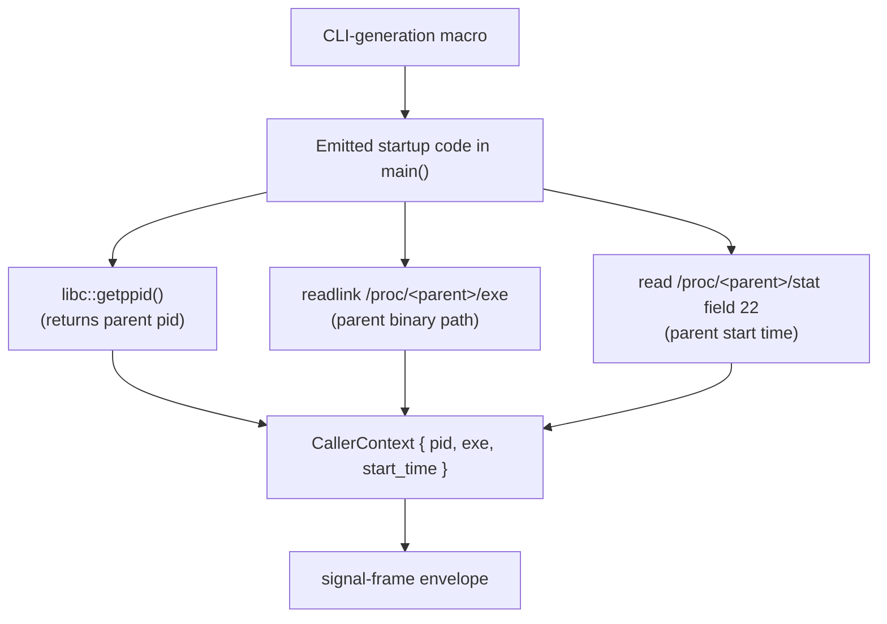
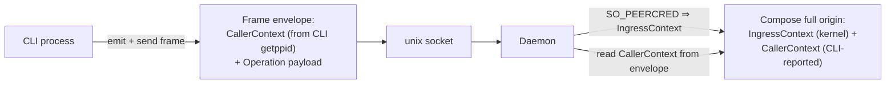

# 300 — CLI macro auto-injects CallerContext (parent pid) into persona-origin

*Kind: Design · Topic: caller-context-injection · 2026-05-23*

*Psyche 2026-05-23: "can our cli's macro write some code that picks
up the caller's pid (ostensibly with persona-origin?)" Captured as
spirit intent record 265 (component-shape, Decision, Medium). Yes —
this is feasible and clean. The CLI-generation macro emits startup
code that captures the parent process's pid (and optional metadata)
via `getppid()` + `/proc/<parent>/*`, bundles it into a
`CallerContext` field carried in the signal-frame envelope, and the
daemon receives two complementary origin tiers — kernel-verified
`IngressContext` (authoritative) + CLI-self-reported `CallerContext`
(advisory) — composed into the full provenance record.*

## The hypothesis

The CLI is the daemon's first client. It already takes a NOTA
argument and sends it to the daemon over a unix socket. The
hypothesis: the CLI macro can also emit code that captures the
**caller's pid** — the process that invoked the CLI, typically
the agent — and includes it in the outgoing request.

The caller's pid is one syscall away (`getppid()`); the macro can
do this in a handful of generated lines per CLI binary, parallel
to the auto-injection pattern proposed for Help operations in
`reports/designer/298-design-help-operations-in-components.md`.

## Mechanism — `getppid()` and `/proc`

The CLI-generation macro emits startup code that captures
parent-process facts at the moment the CLI binary launches:

Three pieces of parent-process information, each cheap to capture:

| Field | How read | Why useful |
|---|---|---|
| `pid` | `libc::getppid()` syscall | Identifies the parent process |
| `executable` (optional) | `readlink /proc/<pid>/exe` | Names the parent binary (e.g. `/path/to/claude-code`); disambiguates which agent harness invoked the CLI |
| `start_time` (optional) | parse `/proc/<pid>/stat` field 22 | Guards against pid reuse over time — an old pid 100 ≠ a new pid 100 with a different start time |

`executable` and `start_time` are advisory and may fail to read
(permission denied, parent already exited); the CLI carries them
only when available.

## Where the data lives — `CallerContext` in the frame envelope

The signal-frame envelope already carries per-frame metadata.
Adding an optional `CallerContext` field is the right placement —
every contract gets it for free via the envelope, parallel to
how `IngressContext` is attached on the daemon side.

## Two-tier origin model

The daemon now sees two complementary origin sources, with
different trust properties:

| Tier | Source | Trust | Granularity |
|---|---|---|---|
| `IngressContext` | Daemon reads `SO_PEERCRED` at `accept()` | **Kernel-verified** — the connecting process cannot lie about itself | Per-connection (CLI invocation) |
| `CallerContext` | CLI reads `getppid()` + `/proc` and includes it in the frame | **Self-reported** — the CLI's macro emits honest code, but the CLI itself is just code | Per-caller (agent-level, best-effort) |

The pair is **kernel-anchored CLI identity** (authoritative) plus
**CLI-self-reported parent identity** (advisory). The daemon
composes both into the full provenance record.

## Trust model — why advisory is fine

The natural concern: "if the CLI reports its own parent pid, can
a hostile process spoof it?"

The trust gradient:

- **Authoritative tier** (`IngressContext`) — kernel-verified. A
  connecting process cannot lie to the kernel about its own
  uid/pid/gid. **Use this for security decisions** (Owner vs
  NonOwnerUser, Internal vs External).
- **Advisory tier** (`CallerContext`) — CLI-self-reported. An
  attacker replacing the CLI binary (or implementing a custom NOTA
  client) can set CallerContext to anything. **But**: an attacker
  who can do that is **already running as persona-user (or
  owner)** — they passed the kernel's uid check. At that point
  they have bigger options than spoofing a parent pid field.

Discipline:

- **Security gates** read `IngressContext`. Never `CallerContext`.
- **Audit, correlation, per-agent state** read `CallerContext`.
  These are non-security uses; advisory is enough.

## What downstream code gets

Per-caller visibility opens up at least these use cases without
extending the connection pattern:

- **Audit log entries** carry "this intent was recorded by
  caller pid=12345, executable=`claude-code`,
  ingress=`Internal(persona-mind)`".
- **Correlation across CLI invocations** — three operations from
  the same agent share the same `CallerContext.pid` +
  `start_time`, so an observer can group them into a single
  agent-session view.
- **Per-agent state (best-effort)** — the daemon keeps a hashmap
  keyed by `(CallerContext.pid, start_time)` → state, opening
  per-agent scratchpads without changing the request/reply
  connection pattern.

Push notifications and subscriptions still need a long-lived
agent socket per
`reports/designer/299-design-origin-process-and-agent-identity.md`
§"Three options" Option 3 — `CallerContext` alone is
request/reply only.

## Where the macro lives

The CLI-generation macro — the one that takes a contract crate
and emits a binary's `main()` — is where the auto-injection lands.
The macro already generates:

- NOTA argument parsing
- Socket connection
- Frame send + reply receive
- Reply printing

Adding the `CallerContext` capture is one new step in the
generated `main()`. Every CLI in the workspace picks it up on
the next rebuild — no per-CLI edits.

Exact crate name for the CLI-generation macro needs verification
against repo state (likely `signal-cli-macro` or similar);
implementation pins the path.

## Naming the new types

Per `ESSENCE.md §Naming` (full English words, no ancestry):

- `CallerContext` — the bundle (PascalCase, top-level type)
- `caller_pid: ProcessIdentifier` — not `pid: Pid`
- `caller_executable: Option<PathBuf>` — not `caller_exe`
- `caller_start_time: Option<SystemTime>` — not `caller_start`

Where `ProcessIdentifier` is the typed newtype wrapper over the
kernel `pid_t` value, mirroring the `EngineIdentifier` /
`RouteIdentifier` / `ChannelIdentifier` shape from spirit record
261 + the rename direction in /299.

## Open for psyche

- **`CallerContext` field set.** Just pid, or pid + executable
  + start_time? Recommended: all three — start_time guards
  against pid reuse over time; executable identifies the agent
  harness.
- **Required vs optional.** Is `CallerContext` required on every
  frame from a CLI (every CLI is parented), or optional (the
  macro best-efforts and emits None if `getppid` returns 1 — the
  init process, meaning the CLI was reparented and the
  relationship is no longer informative)?
- **Where exactly does the type live?**
  - Option A: `signal-persona-origin` (alongside `IngressContext`).
    Keeps all origin-related types in one place.
  - Option B: `signal-frame` (alongside the envelope itself).
    Every contract gets `CallerContext` without depending on
    `signal-persona-origin`. Argument for Option B if frame-level
    metadata is the right placement.
- **CLI-only or also other clients?** Some daemons connect to
  each other directly (no CLI in between). Do those daemon-to-
  daemon connections also carry `CallerContext`, or is it
  CLI-only? Recommendation: any non-CLI client populates
  `CallerContext` according to its own getppid semantics; the
  type is universal but `None` when not applicable.
- **Long-lived agent socket** (Option 3 from /299). If push
  notifications become a target, that still wants designing
  separately — `CallerContext` doesn't replace it, it
  complements it.

## Implementation scope

Operator-shaped and bead-shaped, gated on psyche confirmation
of the open questions above:

1. Add `CallerContext` type to `signal-persona-origin` or
   `signal-frame` (depending on the layer placement question).
2. Extend the signal-frame envelope with the optional
   `CallerContext` field.
3. Add the auto-injection step to the CLI-generation macro.
4. Daemon accept loop reads `CallerContext` from the envelope
   and merges it with the kernel-derived `IngressContext`.
5. Existing CLIs pick up the new behaviour on rebuild — no
   per-CLI edits.
6. Daemons get `CallerContext` available in their handlers —
   per-daemon usage is opt-in (audit log writes pick it up;
   security gates ignore it).

## See also

- `reports/designer/297-design-signal-persona-auth-rename.md` —
  the rename to `signal-persona-origin`.
- `reports/designer/298-design-help-operations-in-components.md`
  — the parallel auto-injection pattern (Help operations) this
  report extends.
- `reports/designer/299-design-origin-process-and-agent-identity.md`
  — the per-process / per-agent identity analysis this report
  builds on.
- Spirit record 265 — the CLI-macro caller-pid direction
  captured this session.
- `man 2 getppid` — kernel documentation for the parent-pid
  syscall.
- `proc(5)` §`/proc/[pid]/exe` and §`/proc/[pid]/stat` — kernel
  documentation for the metadata sources.
