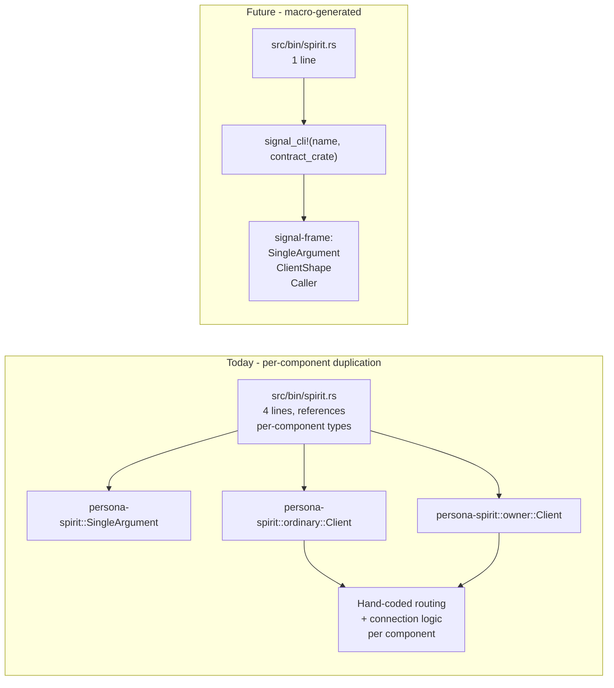
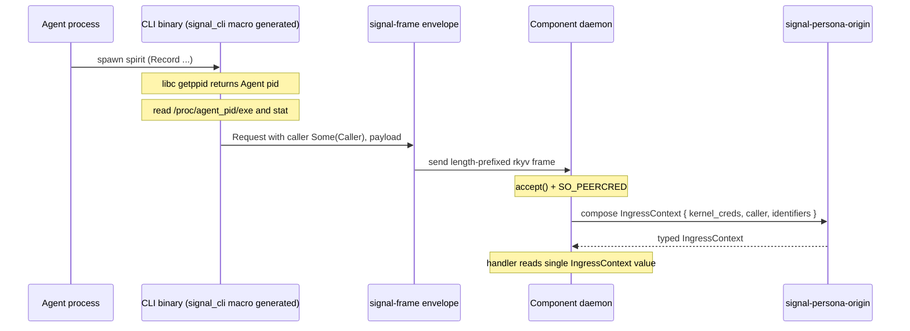

# 301 — Elegant signal_cli! macro with auto-injected Caller

*Kind: Design · Topic: elegant-cli-shape · 2026-05-23*

*Psyche 2026-05-23: "show me the most elegant design we can make
to make writing cli's easy and give them this capability
(forwarding the pid of the cli caller through persona-origin)."
Captured as spirit record 266 (component-shape, Decision, Maximum).
This report proposes the apex shape: one-line CLI binaries via an
expanded `signal_cli!` macro that emits the full `main()`, with
Caller populated from `getppid()` and carried on the frame's
`Request<P>` envelope; the daemon composes Caller + SO_PEERCRED
into the typed `IngressContext` in signal-persona-origin.*

## Destination — one line per CLI binary

A new CLI for any component becomes one file, one line:

```rust
// persona-spirit/src/bin/spirit.rs
signal_frame::signal_cli!(spirit, signal_persona_spirit);
```

That is the entire `main.rs` of every component's CLI in the
workspace. No imports, no `Client` struct, no argument-parsing
glue, no socket discovery — all of it lives in the macro.

What the macro auto-injects on expansion:

- NOTA argument parsing (the SingleArgument shape that lives in
  persona-spirit today, lifted to signal-frame)
- Working vs owner socket routing (the existing route-table in
  `signal-frame/src/command_line.rs`)
- Socket discovery via env vars (named by convention from the
  binary name: `PERSONA_SPIRIT_SOCKET`, `PERSONA_SPIRIT_OWNER_SOCKET`)
- Connection establishment
- Frame envelope construction with `Caller` populated from
  `libc::getppid()` plus optional `/proc/<pid>/{exe,stat}` reads
- Send + receive + print reply
- Exit-code mapping (success / parse error / transport error / daemon error)

## Today vs the new shape



Per-component duplication (every component reimplements
SingleArgument, ordinary::Client, owner::Client, route logic)
collapses into one macro plus shared signal-frame types.

## What `signal_cli!` expands to

The macro takes a binary name and a contract crate; emits a
conceptual sketch like:

```rust
fn main() -> std::process::ExitCode {
    use signal_frame::{SingleArgument, Caller, ClientShape};
    use signal_persona_spirit::{ordinary, owner};

    let argument = match SingleArgument::from_environment() {
        Ok(a) => a,
        Err(e) => { eprintln!("{e}"); return ExitCode::from(64); }
    };
    let caller = Caller::from_kernel();
    let socket = SocketSelector::<ordinary::Operation, owner::Operation>
        ::route(&argument);
    let mut client = ClientShape::connect(socket)?;
    let reply = client.exchange(caller, argument.payload)?;
    println!("{reply}");
    ExitCode::SUCCESS
}
```

The user never writes any of this. They write the one-line macro
invocation and get the working CLI binary.

## Caller placement — on `Request<P>` in signal-frame

The cleanest placement for the Caller field is on the existing
`Request<RequestPayload>` wrapper in `signal-frame/src/request.rs`.
Today that wrapper carries only the payload; the new shape carries
Caller as an optional sibling:

```rust
// signal-frame/src/request.rs (new shape)
pub struct Request<RequestPayload> {
    pub caller: Option<Caller>,
    pub payload: RequestPayload,
}

// signal-frame/src/caller.rs (new module)
pub struct Caller {
    pub pid: ProcessIdentifier,
    pub executable: Option<PathBuf>,
    pub start_time: Option<SystemTime>,
}

impl Caller {
    /// Capture the caller from libc::getppid() and /proc.
    /// Returns None if getppid() is the init process
    /// (we were reparented, the relationship is not informative).
    pub fn from_kernel() -> Option<Self> { /* ... */ }
}
```

This puts Caller at the FRAME level — every contract uses it
without depending on signal-persona-origin — and
signal-persona-origin still owns the Persona-domain
`IngressContext` that composes it with SO_PEERCRED.

## Caller flow — from macro through to daemon



## Daemon side — typed composition

For the daemon-side handler, the goal is a SINGLE composed origin
value (no manual stitching). The `signal-persona-origin` crate (the
rename target from signal-persona-auth per spirit record 264) owns
the composition:

```rust
// signal-persona-origin (post-rename)
pub struct IngressContext {
    // From SO_PEERCRED (kernel-verified, authoritative)
    pub connection_class: ConnectionClass,
    // Persona-domain identifiers (from spawn envelope + socket)
    pub engine: EngineIdentifier,
    pub route: Option<RouteIdentifier>,
    pub channel: Option<ChannelIdentifier>,
    // From Request.caller (CLI-self-reported, advisory)
    pub caller: Option<Caller>,
}
```

The handler reads one composed value. The two trust tiers
(kernel-verified vs CLI-self-reported) sit side by side; the
discipline lives in signal-persona-origin's ARCH §"Trust gradient"
(added with the rename + Caller landing).

## Where each piece lives

| Crate | Owns | Why |
|---|---|---|
| `signal-frame` | `Caller` type, `Request.caller` field, expanded `signal_cli!` macro, `SingleArgument`, `ClientShape` | Kernel-level types and ergonomics; every contract already depends on signal-frame |
| `signal-persona-origin` | `IngressContext`, `ConnectionClass`, `ComponentName`, `OwnerIdentity`, `MessageOrigin`, SO_PEERCRED → ConnectionClass mapping | Persona-domain projections built on signal-frame primitives |
| Each component's `signal-<comp>` crate | `signal_channel!` contract declaration (unchanged) | Contract vocabulary, per-contract |
| Each component's `<comp>` crate | `src/bin/<name>.rs` one-line macro invocation; daemon-side handler logic (unchanged) | Implementation, per-component |

`signal-persona-origin` depends on `signal-frame` (already true);
`signal-frame` does not depend on `signal-persona-origin`. The
dependency direction stays clean — Persona builds on frame
primitives, not the other way around.

## What writing a CLI looks like, end-to-end

Three artifacts per component:

| File | Content | Lines |
|---|---|---|
| `signal-<comp>/src/lib.rs` | `signal_channel!` declares the contract | (unchanged) |
| `<comp>/src/lib.rs` | Daemon-side handlers | (unchanged) |
| `<comp>/src/bin/<name>.rs` | `signal_cli!(<name>, signal_<comp>);` | **1** |

Cargo's auto-discovered `[[bin]]` picks up `src/bin/<name>.rs`
without any Cargo.toml edit. The component's flake.nix already
declares the binary as an output (today's pattern).

## Knock-ons across the workspace

Once `signal_cli!` lands its expanded form:

- Existing per-component `SingleArgument` and `Client` types
  retire in favor of signal-frame versions. One PR per component
  reduces each CLI to one line.
- The pattern proven for `spirit` repeats for every other
  component's CLI: `persona-mind`, `persona-orchestrate`,
  `persona-terminal`, `forge`, `sema`, `nexus`, etc.
- Future components ship a CLI with one line of Rust plus the
  contract crate.
- Caller-context tagging arrives in every daemon for free with the
  same change.

This is the **second elegance pivot in the workspace's macro
layer** — the first was Help operations (`reports/designer/298-design-help-operations-in-components.md`).
Both pivots auto-inject universal capabilities at the macro layer;
both make components more uniform; both reduce per-component
boilerplate to declarations. A pattern is emerging: the macro
layer is where universal cross-component capabilities live.

## Open for psyche

- **One macro form or two?**
  - Option A (recommended): single `signal_cli!(name, contract_crate)`
    derives working and owner from `contract_crate::ordinary` and
    `contract_crate::owner` by convention.
  - Option B: explicit `signal_cli! { name, working: ..., owner: ... }`
    more verbose but more explicit. Useful for non-default layouts.
  - Recommendation: A by default; B available for edge cases.
- **Caller field on Request — required or optional?**
  Recommendation: `Option<Caller>` because daemon-to-daemon traffic
  over non-CLI paths may not populate it, and tests don't either.
  Required (always `Some`) would force a synthetic placeholder
  everywhere a non-CLI client exists.
- **Caller capture failure modes.** `getppid()` returns 1 (init) if
  the CLI was reparented. Skip the Caller (return `None`), or
  populate with `pid=1` and let the daemon decide? Recommendation:
  skip (return `None`) — pid=1 is not informative.
- **Cross-platform reads.** `/proc/<pid>/exe` and `/proc/<pid>/stat`
  are Linux-specific. For non-Linux ports, the macro emits a
  best-effort no-op (Caller with pid only, no executable or
  start_time). Recommendation: Linux-only for now; cross-platform
  when needed.
- **Parallel `signal_daemon!` macro.** Should the daemon binary
  also be reduced to one line via a sibling macro? The daemon side
  is more complex (actor runtime, state, handlers), so probably a
  bigger follow-up design — but the consistency would be elegant.

## Implementation scope

The foundation work is small and bead-shaped:

1. Add `Caller` type to signal-frame (~30 LOC, new module
   `signal-frame/src/caller.rs`).
2. Add `caller` field to `Request<P>` (~5 LOC, cascades through
   every Archive/rkyv derive).
3. Move `SingleArgument` from persona-spirit to signal-frame
   (~50 LOC, plus per-component imports update).
4. Add `ClientShape` generic helper to signal-frame (~100 LOC).
5. Extend the existing `signal_cli!` macro to generate the full
   `main()` (~50 LOC of `macro_rules!`).

Total foundation: ~200 LOC, single PR.

Per-component migration (one PR per existing CLI binary):

- Replace `src/bin/<name>.rs` with one-line `signal_cli!`
  invocation.
- Retire per-component `SingleArgument` / `Client` types in
  favor of signal-frame versions.
- Verify the binary still works end-to-end via existing tests.

Each component: ~1 hour, mostly verification. Components today:
`persona-spirit` (proven first), then `persona-mind`,
`persona-orchestrate`, `persona-router`, `persona-terminal`,
`persona-message`, `forge`, `sema`, etc.

## See also

- `reports/designer/300-design-cli-macro-caller-context-injection.md`
  — the per-CLI Caller proposal this report builds on.
- `reports/designer/299-design-origin-process-and-agent-identity.md`
  — the SO_PEERCRED + agent-identity analysis.
- `reports/designer/298-design-help-operations-in-components.md`
  — the parallel auto-injection pattern (Help operations).
- `reports/designer/297-design-signal-persona-auth-rename.md` —
  the rename to signal-persona-origin.
- Spirit record 266 — the elegant-shape decision captured this
  session.
- `/git/github.com/LiGoldragon/signal-frame/src/command_line.rs`
  — the existing minimal `signal_cli!` macro to be expanded.
- `/git/github.com/LiGoldragon/signal-frame/src/frame.rs` — the
  envelope structure where `Request<P>` lives.
- `/git/github.com/LiGoldragon/signal-frame/src/request.rs` —
  the `Request<P>` wrapper that gains the `caller` field.
- `/git/github.com/LiGoldragon/persona-spirit/src/bin/spirit.rs`
  — the current 4-line CLI to be reduced to 1 line.
- `/git/github.com/LiGoldragon/persona-spirit/src/argument.rs` —
  `SingleArgument` to be lifted to signal-frame.
