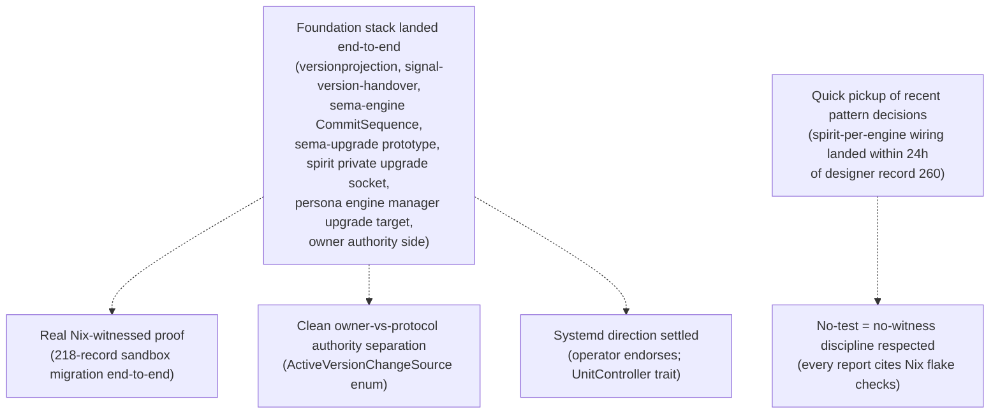
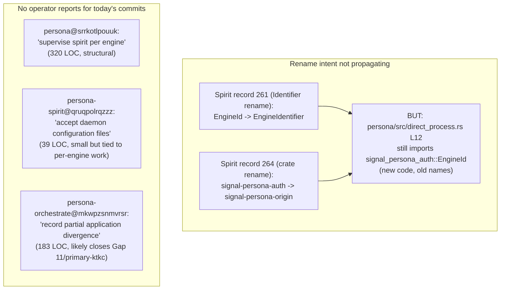
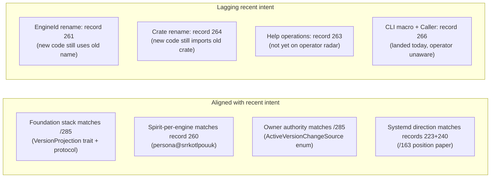

# 302 — Audit of recent operator work — 2026-05-23

*Kind: Audit · Topic: operator-recent-work · 2026-05-23*

*Psyche 2026-05-23: "audit and critique latest work by operator."
This audit covers operator reports /157–/163 (May 22) plus the
May 23 commits across persona, persona-spirit, persona-orchestrate,
persona-mind, sema-engine, version-projection, and
signal-version-handover. Verdict: foundation stack landed end-to-end
with strong Nix witnesses, but recent rename intent has not
propagated and today's three structural commits landed without
matching operator reports.*

## Scope of audit

Reports read (all operator, 2026-05-22):

| Report | Title | Substance |
|---|---|---|
| /157 | version-projection refresh + question rollover | Bead pointer hygiene; 15 open questions for the operator |
| /158 | Version-handover foundation implementation | version-projection, signal-version-handover, sema-engine CommitSequence, sema-upgrade prototype landed |
| /159 | Persona engine upgrade foundation | Engine-manager upgrade target model, PrepareUpgrade/CompleteUpgrade, active-version snapshot |
| /160 | Spirit smart-handover sandbox test | End-to-end sandbox proven with 217-record migration |
| /161 | Spirit private handover socket | persona-spirit-daemon now owns the private upgrade socket; 218-record sandbox |
| /162 | Persona owner version-handover authority | owner-signal-version-handover contract; ForceFlip/Rollback/Quarantine wired into Persona |
| /163 | Persona systemd component management position | Operator endorses systemd-backed UnitController abstraction (no code) |

Commits inspected (2026-05-23, no matching operator report):

| Repo | Commit | Title | Size |
|---|---|---|---|
| `persona` | `srrkotlpouuk` | supervise spirit per engine | 320 LOC across 13 files |
| `persona-spirit` | `qruqpolrqzzz` | accept daemon configuration files | 39 LOC across 2 files |
| `persona-orchestrate` | `mkwpzsnmvrsr` | record partial application divergence | 183 LOC across 8 files (new `src/divergence.rs`) |
| `persona-mind`, `sema-engine`, `version-projection`, `signal-version-handover` | various | refresh nota codec pin / bracket-string deps | Maintenance |

## Strengths

1. **Coordinated foundation landing across 7+ repos in ~24h** with
   passing tests at every step. version-projection,
   signal-version-handover, sema-engine CommitSequence,
   sema-upgrade prototype, spirit private upgrade socket, persona
   engine manager upgrade target, owner authority side — all
   landed. This is unusually tight cross-repo execution.

2. **Genuine end-to-end Nix witness** — /160 + /161 prove the
   smart-handover protocol with 217 then 218 actual records
   migrated through Spirit v0.1.0 → v0.1.1 in a sandbox. Not a
   unit-test simulation — real daemons, real database, real
   protocol exchange.

3. **`ActiveVersionChangeSource` enum is a high-quality structural
   choice** (/162). Separating `HandoverMarker { commit_sequence }`
   from `ForceFlip { reason }` from `Rollback { reason }` keeps
   protocol-complete handover and owner-override as distinct
   typed facts. A force-flip can't fake a commit sequence; the
   audit trail keeps the two sources legible. This is the kind
   of design choice that pays off years downstream.

4. **Systemd direction settled cleanly** (/163). Operator
   endorses systemd as production substrate; proposes
   `UnitController` trait with systemd-D-Bus backend in
   production + direct-fork backend in tests/sandbox.
   Aligns with spirit records 223 + 240.

5. **Spirit-per-engine wiring landed within 24h** of the designer
   pattern-decision (spirit record 260, manifested in persona ARCH
   §1.5 by /296 v2, bead primary-1cl1). Today's persona commit
   "supervise spirit per engine" closes that loop — quick
   pickup of recent pattern decisions.

6. **Discipline on Nix-witnessed verification** — every report
   cites `nix flake check --option max-jobs 0 -L` and per-test
   Nix witnesses. The "no test = no witness" discipline holds.

## Weaknesses and drift

1. **Rename intent has not propagated to new code.**
   Spirit record 261 (2026-05-22) decided
   `EngineId → EngineIdentifier` and siblings; spirit record 264
   (today) decided `signal-persona-auth → signal-persona-origin`.
   Both renames are queued under bead `primary-7ru6` for an
   operator pass. **But**: today's `persona/src/direct_process.rs`
   line 12 still imports `signal_persona_auth::EngineId` — new
   code being written with the **old** names AFTER the rename
   decision. The bead exists; the discipline of not using the
   old names in new code while the rename is queued has slipped.
   **Recommendation**: when a rename bead is filed, new code in
   the affected import path should pause on the old name OR the
   rename should be expedited before the next landing in that
   surface.

2. **Three structural commits today landed without operator
   reports.** Per `skills/reporting.md` §"When to write a report
   vs answer in chat" the commit message IS the report for
   routine implementation work. But:
   - `persona@srrkotlpouuk` (320 LOC, 13 files, new
     `direct_process.rs` module, ARCH update, multiple test
     files) is **structural**, not routine. It closes
     bead `primary-1cl1` (spirit-per-engine wiring, designer
     pattern decision). A 1-line operator chat entry tying
     commit to bead + intent record 260 would close the loop
     for future agents.
   - `persona-orchestrate@mkwpzsnmvrsr` (183 LOC, new
     `src/divergence.rs`, tables + ledger tests, ARCH update)
     likely closes bead `primary-ktkc` (Gap 11 Mutate-chain
     partial-failure → record-divergence, per /294 Design B).
     Again, no operator report or chat-line links the commit to
     the bead. The alignment is great; the **trace evidence is
     missing**.
   - `persona-spirit@qruqpolrqzzz` (39 LOC) is genuinely small
     and ties to the per-engine work — commit-as-report is fine
     here.

3. **`sema-upgrade-handover-temporary` still used despite
   /161 landing the real upgrade socket.** /161 explicitly
   flagged this as the next slice: replace the temporary
   one-argument protocol runner with real daemon-to-daemon
   exchanges. The bead and the path forward are clear; the
   work just hasn't happened yet. **Status**: known-deferred,
   not drift.

4. **Mirror payload application missing across the stack.** Both
   /158 and /161 list it. The protocol can exchange handover
   markers but cannot mirror writes from next back to current
   during the handover overlap window. Critical for true
   zero-downtime — old daemon needs to see new writes if
   old-compat reads are still in use. **Status**: known-deferred,
   not drift; should be the next foundation slice.

5. **Spirit v0.1.0 retrofit not done — the bootstrap problem
   remains.** Every recent report (/157 through /161) lists
   "retrofit deployed v0.1.0 with private upgrade socket" or
   "maintenance build of v0.1.0" as missing. The first
   production cutover (v0.1.0 → v0.1.1) can't use the smart-
   handover protocol because v0.1.0 doesn't have the protocol
   code. /157 acknowledged the dilemma: do the first cutover
   the old stop/freeze/migrate/start way, OR retrofit v0.1.0 to
   the protocol-aware shape first. **Decision still pending**.
   This is the single biggest "what's missing to ship" item.

6. **Active-version selector home — report wording lags code.**
   /161 still says "connect the active-version selector flip in
   CriomOS-home" but spirit records 209 + 210 say **Persona**
   owns the selector now (CriomOS-home is no longer the
   orchestrator). The implementation in /159 + /162 actually
   puts the active-version snapshot in Persona's manager_store
   (correctly). So **code is right; report prose is stale.**
   Worth updating the wording in the next operator iteration.

7. **/157's 15 open questions never explicitly closed.** Several
   have been answered by intervening work (commit_sequence
   shipped per /158, owner-signal-version-handover shipped per
   /162, sema-upgrade bootstrap is the prototype path per /160),
   but no follow-up report tracks "questions answered since
   /157, questions still open." Future agents reading /157 see
   15 open questions; they have to cross-reference /158–/163 to
   figure out which are now settled. A short "questions ledger"
   entry would help.

8. **Beads not closing as work lands.** `primary-a5hu` (Persona
   epic), `primary-x3ci` (Spirit cutover), `primary-2y5`
   (EngineId socket setup) appear still active despite
   significant sub-work landing. Per the workspace pattern
   (record 248 decomposed primary-a5hu into 5 sub-beads
   a5hu.1–.5), the discipline is to decompose epics as work
   progresses; instead the epics keep accumulating. **Operator
   should be more aggressive about decomposing-and-closing as
   foundation slices land.**

## Cross-check against current intent

The lagging items are not operator failures — they are recent
designer decisions (some within the last few hours) that haven't
been seen yet. The flag is to **expedite the rename bead
(`primary-7ru6`)** since other landings keep referencing the old
names. Each new commit using `EngineId` is another rename touchpoint
to fix later.

## Quality observations on the structural choices

- The `ActiveVersionChangeSource` enum (/162) is **the
  best individual design choice in this slice**. It refuses to
  fake a commit sequence for force-flips and rollbacks, which
  preserves the audit-trail honesty long-term.
- The `Target` upgrade record (/159) with current/next versions
  plus their owner/upgrade sockets is **a typed primitive that
  carries forward**. Future upgrades use the same Target shape.
- The sandbox app pattern (/160) of "real daemons + real database
  + real protocol exchange in a Nix sandbox" is **a reusable
  testing primitive** worth naming as a workspace pattern.
  Every component triad migration should follow this shape.
- `direct_process.rs` (in today's persona commit) appears to
  separate the in-process spawn path from the eventual systemd
  path — consistent with /163's `UnitController` direction.
  Good abstraction shape.

## What's missing to ship

In order of urgency:

1. **Spirit v0.1.0 retrofit decision.** Either retrofit the
   deployed v0.1.0 with the protocol code (and rebuild +
   redeploy), or commit to a one-time stop/freeze/migrate/start
   cutover for the first v0.1.0 → v0.1.1 transition. Both are
   acceptable; the indecision is the blocker. **Recommendation**:
   psyche pick one explicitly.
2. **Mirror payload application** on the upgrade socket. Needed
   for true zero-downtime if old-compat reads are in use.
3. **Real daemon-to-daemon socket exchanges** replacing
   `sema-upgrade-handover-temporary`. The persona-spirit private
   upgrade socket exists; the exchange runner needs to be
   rewired to use it.
4. **Rename pass** for `EngineId → EngineIdentifier` siblings
   and `signal-persona-auth → signal-persona-origin` (bead
   `primary-7ru6`, plus a new bead for the crate rename
   pending psyche bundle/separate confirmation).

## Recommendations

For the operator's next session:

- **Spend 10 minutes filing a "questions answered since /157"
  ledger** as a short operator report. Closes the loop on the
  15 open questions; future agents don't have to cross-reference.
- **Operator chat-line per commit when no full report is
  written.** Even one line — "persona@srrkotlpouuk closes
  primary-1cl1 per spirit record 260; spirit-per-engine
  supervision" — keeps the intent → bead → commit chain
  legible.
- **Decompose `primary-a5hu` and `primary-x3ci`** into the
  remaining sub-work after each foundation slice. The epics
  shouldn't accumulate; they should shrink as sub-beads close.
- **Pause new uses of `EngineId` / `signal_persona_auth`**
  while the rename bead is queued. If the rename can't be
  expedited, at minimum the import surface in NEW code should
  switch to the new names (with a one-line type alias bridging
  during the transition).
- **The systemd direction (/163) should land as a follow-up
  design report or `persona/ARCHITECTURE.md` §"Process
  supervision" section** so the operator's position paper
  doesn't sit only in `reports/operator/`. (Designer-shaped;
  could be done by me.)

For the designer side (me) next:

- **File the rename bead for `signal-persona-auth →
  signal-persona-origin`** (or bundle into primary-7ru6 per the
  open question in /297). The longer it sits unfiled, the more
  new commits will use the old crate name.
- **Land the systemd UnitController direction in
  `persona/ARCHITECTURE.md`** as a follow-up to /291 and /163.

## See also

- `reports/operator/157-163` — the audited slice
- `reports/designer/285-versionprojection-trait-and-handover-protocol-specification.md`
  — the canonical handover spec the operator implemented
- `reports/designer/293-designer-and-research-batch-2026-05-23/`
  — the parallel designer meta-report this audit complements
- Spirit records 260 (spirit-per-engine), 261 (Identifier
  rename), 264 (signal-persona-origin), 266 (signal_cli! +
  Caller) — the recent intent layer the operator should align
  next landings against
