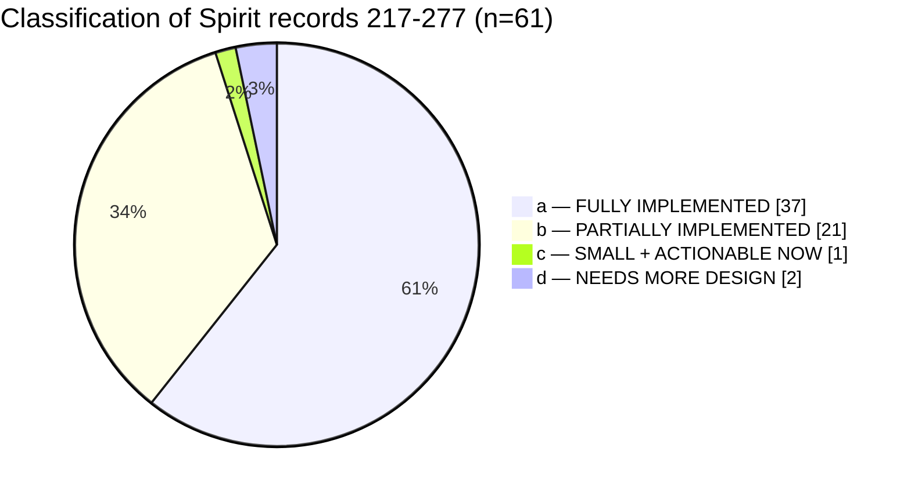
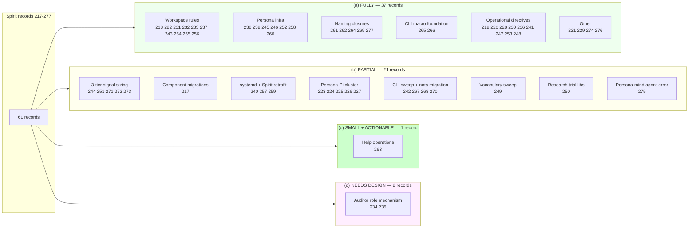
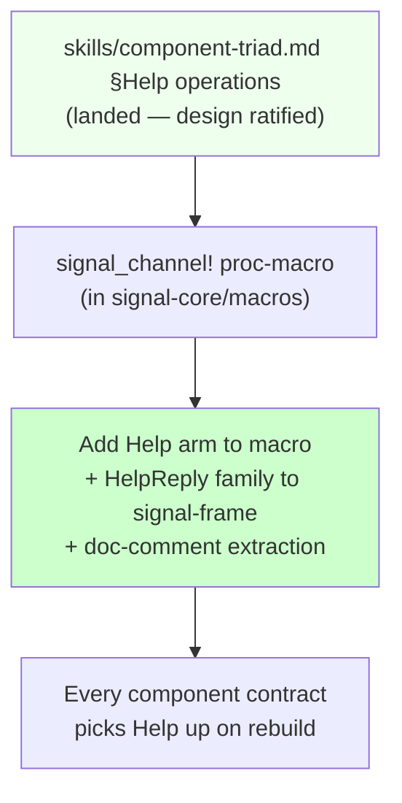
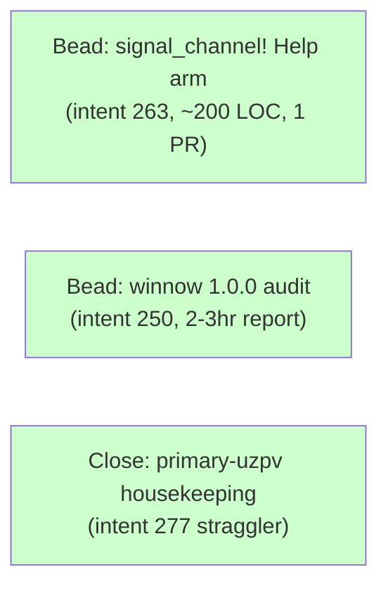

## 304 — Unimplemented-intent audit (Spirit records 217-277)

*Kind: Audit · Topic: unimplemented-intent + small-component-shape
beads · 2026-05-23*

*Designer sub-agent dispatched in parallel with the
intent-manifestation sub-agent. Per Spirit record 308: the two halves
of the same session — one builds, one looks for what's missing. This
audit cross-checks Spirit records 217-277 against current code +
ARCH + skill + bead state; classifies each record; surfaces every
small actionable gap as a bead proposal the prime designer can file.*

## §1 Frame and method

### Scope

61 Spirit records, 217-277, captured between 2026-05-22 and
2026-05-23. The most-recent 38 (240-277) carry the bulk of the
unimplemented surface; the earlier 23 (217-239) are mostly settled
into AGENTS.md, ESSENCE.md, INTENT.md, or closed beads.

### Classification scheme

| Code | Meaning |
|---|---|
| (a) | **FULLY IMPLEMENTED** — code AND ARCH/skill/INTENT both landed |
| (b) | **PARTIALLY IMPLEMENTED** — code without ARCH (or vice versa), OR one variant of a multi-piece intent landed |
| (c) | **NOT IMPLEMENTED, SMALL + ACTIONABLE NOW** — gap is small; clear operator bead can close it |
| (d) | **NOT IMPLEMENTED, NEEDS MORE DESIGN** — designer-side work first |

### Method

Spirit observation through deployed CLI (61 records parsed via the
`(Observe (Records (None None WithProvenance)))` query). Bead state
through `bd list --limit 0` and per-bead `bd show`. Code state
through direct read of `/git/github.com/LiGoldragon/<repo>/` source
trees + ARCHITECTURE files. Skill state through
`/home/li/primary/skills/<name>.md`. Workspace state through
`AGENTS.md`, `ESSENCE.md`, `INTENT.md`. Designer/operator reports
read where the intent record cites or implicates one
(`reports/designer/293-302`, `reports/second-designer/152-160` with
meta-directories `152/`, `159/`, `reports/operator/157-163`,
`reports/third-designer/17-22` with `22/`, `reports/cluster-operator/1-8`).

## §2 Summary table + visual

Per-record classification table (compact rephrasing of the intent
title + state assessment + classification code):

| # | Topic / Kind | Class | One-line state |
|---|---|---|---|
| 217 | component-migration Decision | (b) | All 10 migration beads filed; persona-mind/router/harness/terminal/message/introspect/orchestrate OPEN; repository-ledger CLOSED. In flight. |
| 218 | reports Correction | (a) | AGENTS.md "Reports go in files" carries the SHAPE triggers list. |
| 219 | beads Decision | (a) | Operational; current flow follows the rule. |
| 220 | workspace Principle | (a) | Superseded by 222 + 232; AGENTS.md carries the rule. |
| 221 | architecture Decision | (a) | /287 distributed across persona / signal-version-handover / sema-engine / sema-upgrade / version-projection / persona-spirit ARCH; /289 + /290 land the diff. |
| 222 | workspace Decision | (a) | AGENTS.md "Chat normal-response policy (default for all agents)" landed. |
| 223 | persona-pi Decision | (b) | primary-u7gc OPEN; reports/third-designer/20 + cluster-operator/6-8 done; repo creation deferred. |
| 224 | persona-pi Constraint | (b) | Same arc as 223. |
| 225 | persona-pi Decision | (b) | Same arc as 223. |
| 226 | persona-pi Decision | (b) | Same arc as 223. |
| 227 | persona Decision | (b) | Same arc as 223; consolidation record. |
| 228 | persona Constraint | (a) | Operational; honored across operator/157-163 work. |
| 229 | beads Principle | (a) | `skills/beads.md` §"Duplicate — preserve information from both" carries the rule with record 229 citation. |
| 230 | persona Decision | (a) | Operational; lane reallocation done. |
| 231 | reports Decision | (a) | AGENTS.md "Meta-report directories" + `skills/reporting.md` land the discipline; meta-directories `152/`, `159/`, `22/`, `293/` follow it. |
| 232 | reports Principle | (a) | AGENTS.md "Chat normal-response policy" carries the 3-7-with-three-category-balance shape. |
| 233 | workspace Principle | (a) | ESSENCE.md "Intent and design — the engine's dance" + INTENT.md carry the rule. |
| 234 | workspace Decision | (d) | AGENTS.md "Possible additional role — auditor" + INTENT.md carry the Medium-certainty rule under carry-uncertainty discipline. No `skills/auditor.md` yet — intentional. Open mechanism design before the role lands. |
| 235 | workspace Decision | (d) | Same arc as 234; DeepSeek named, no implementation surface yet. |
| 236 | persona-pi Clarification | (a) | Pointer; honored. |
| 237 | version-control Correction | (a) | AGENTS.md hard override "Reach for the right tool, not raw git" + `skills/jj.md` §"Never let jj open an editor". |
| 238 | persona Clarification | (a) | persona/INTENT.md + persona ARCH §1.5 carry the privilege model. |
| 239 | persona Constraint | (a) | persona ARCH §1.5/§1.6.7. |
| 240 | persona Decision | (b) | persona ARCH §1.7 carries the systemd direction; primary-ngn8 (epic) + primary-a5hu.4 (slice) OPEN. UnitController trait not coded. |
| 241 | workspace Decision | (a) | Operational checklist; honored at session boundaries. |
| 242 | nota Constraint | (b) | primary-36iq epic OPEN; nota-codec bracket-string merged; examples migration partial. |
| 243 | reports Constraint | (a) | `skills/reporting.md` §"Visuals are Mermaid only" landed. |
| 244 | signal Decision | (b) | signal-frame ARCH §5 manifested; LogVariant/LogSummary traits not coded (primary-l02o + primary-bg9l OPEN). |
| 245 | signal Constraint | (a) | Design D landed via primary-ezzp CLOSED. |
| 246 | persona Correction | (a) | Design D adopted; CLI does not perform discovery. |
| 247 | workspace Decision | (a) | Per /292 honored; migration is the gap-closure path. |
| 248 | workspace Decision | (a) | primary-a5hu.1-.5 sub-beads filed (primary-4naq, primary-nobf, primary-q98d, primary-ngn8, primary-r1ve). |
| 249 | workspace Decision | (b) | `skills/workspace-vocabulary.md` landed (214 lines); ARCH/reports sweep done; Rust-side renames partly under primary-3t67 OPEN. |
| 250 | workspace Decision | (b) | unitbus primary-lm9o OPEN; kameo 0.16 primary-e4oq CLOSED; rkyv 0.7→0.8 primary-haa3 CLOSED; **winnow 1.0.0 not separately filed**. |
| 251 | signal Decision | (b) | Same as 244 — ARCH grounded, code pending. |
| 252 | persona Decision | (a) | primary-ezzp + primary-x5ba + primary-7kpe CLOSED. |
| 253 | beads Decision | (a) | Operational. |
| 254 | workspace Principle | (a) | `skills/intent-manifestation.md` §"Pattern-based decision" carries the rule + pattern-based marker requirement. |
| 255 | workspace Principle | (a) | `skills/intent-manifestation.md` §"High-ratification-probability" carries the rule. |
| 256 | workspace Decision | (a) | /293 + /302 audits + their bead-filing follow the rule. |
| 257 | deploy Decision | (b) | primary-wdl6 OPEN (Spirit v0.1.0 retrofit). |
| 258 | persona Decision | (a) | Inside primary-ezzp CLOSED. |
| 259 | signal Decision | (b) | primary-g81p OPEN. |
| 260 | persona Decision | (a) | primary-1cl1 CLOSED; ARCH §1.5 carries the pattern-based marker. |
| 261 | naming Decision | (a) | primary-7ru6 CLOSED inside primary-fka1 epic CLOSED. |
| 262 | naming Correction | (a) | Covered by 264. |
| 263 | component-shape Decision | **(c)** | `skills/component-triad.md` §"Help operations" landed; **no implementation, no bead filed**. Auto-injection via `signal_channel!` macro is bead-shaped. |
| 264 | naming Decision | (a) | primary-fka1.1 CLOSED. |
| 265 | component-shape Decision | (a) | primary-915w CLOSED — signal_cli! injects Caller from getppid. |
| 266 | component-shape Decision | (a) | primary-915w CLOSED. |
| 267 | component-shape Decision | (b) | primary-915w + primary-uxq1 CLOSED; primary-uq04 sweep OPEN with .1 CLOSED. |
| 268 | component-shape Decision | (b) | primary-uq04 decomposed: .1 CLOSED, .2/.3/.4 OPEN. |
| 269 | naming Decision | (a) | primary-fka1 epic CLOSED with all .1-.4 children done. |
| 270 | component-shape Clarification | (b) | `skills/component-triad.md` §"Component binary naming" landed; primary-0m1u OPEN (24-repo persona- prefix drop). |
| 271 | signal Decision | (b) | signal-frame ARCH §5.2 manifested; verb-namespace registry **mechanism still undecided** (see /159 §4.2). |
| 272 | signal Decision | (b) | signal-frame ARCH §5.3 carries U8 + U16 table; **wider universal-variant set still undecided** (see /159 §4.3). |
| 273 | signal Decision | (b) | signal-frame ARCH §5.6 landed; primary-bg9l OPEN. |
| 274 | signal Clarification | (a) | signal-version-handover ARCH + sema-engine ARCH carry the raw-container discipline; primary-wehu CLOSED implementation. |
| 275 | persona-mind Decision | (b) | Design landed in /159/5; primary-x0qm OPEN (P3 — gated on persona-mind production). |
| 276 | workspace Decision | (a) | `skills/nota-comments.md` landed; `skills/skills.nota` indexed. |
| 277 | naming Decision | (a) | primary-fka1 CLOSED — both 7ru6 and fka1.1 bundled into one rename pass. |

## §3 Category (c) detail — gaps closeable NOW

The one true (c) gap is **Help operations** (intent 263). The
prime designer can file it as a single operator bead immediately.
Two bonus small items also caught by the audit — neither is a
standalone Spirit-record gap but each is a small actionable bead-
shape that closes a stale item — listed in §3.2 and §3.3 below.

### §3.1 Bead — Help operations auto-injection (intent 263)

- **Suggested bead title:** *signal_channel! macro: auto-inject Help
  operations into every contract (Help Main + Help (Verb name))*
- **Scope (2-3 sentences):** Extend the `signal_channel!`
  proc-macro in `signal-core/macros/src/lib.rs` so every contract
  Operation enum it emits also carries `Help` as a generated
  variant. Add `HelpMainReply` and `HelpVerbReply` (or one
  `HelpReply` sum) in `signal-frame` so all contracts share the
  reply shape. The macro extracts one-line operation descriptions
  from existing `///` doc comments on Operation variants.
- **Estimated effort:** ~150-200 LOC. One PR in signal-core
  (macro), one PR in signal-frame (reply types). Per-contract
  rebuild picks it up automatically.
- **Acceptance criteria:**
  1. `signal_channel!` emits a `Help { Main, Verb(VerbName) }` arm
     into every Operation enum without contract-side edits.
  2. `signal-frame` exports `HelpMainReply` (operation list +
     one-line descriptions derived from doc comments) and
     `HelpVerbReply` (per-verb schema + example).
  3. One worked example: `spirit (Help Main)` invocation in a
     test prints the operations list end-to-end through the
     contract's daemon handler (or returns it through the macro's
     default handler — depending on the design tradeoff resolution).
  4. The macro's doc-comment extraction is exercised with one
     contract that has `///` comments on every variant.
  5. `nix flake check` green on signal-core + signal-frame + one
     consumer contract (likely signal-persona-spirit).
- **Dependencies:** Independent. Can land in parallel with anything
  else.
- **Lane:** operator (mechanical implementation of a designed shape;
  the design is `reports/designer/298` + `skills/component-triad.md`
  §"Help operations"; no further designer-side decisions needed).
- **Open implementation choices the operator picks:** macro-emitted
  default handler vs daemon-side handler dispatch (the skill notes
  the question without forcing either way); `HelpReply` as
  one-type-with-sum vs three types `HelpMainReply` /
  `HelpVerbReply` / `HelpUnknownVerb`.

### §3.2 Bonus bead — winnow 1.0.0 stable upgrade audit (intent 250 sub-item)

- **Suggested bead title:** *Audit winnow 1.0.0 stable migration
  cost across nota-codec consumers; pin or defer*
- **Scope (2-3 sentences):** Per intent 250 (workspace Decision,
  2026-05-22): one of the four research-and-trial library
  evaluations. unitbus (primary-lm9o OPEN), kameo 0.16
  (primary-e4oq CLOSED), rkyv 0.7→0.8 (primary-haa3 CLOSED) are
  tracked; **winnow 1.0.0** was named but no separate bead exists.
  Survey workspace consumers of `winnow` (nota-codec is primary;
  any other rkyv/parser-pipelines incident); record the migration
  cost (API breaks, feature surface) so the workspace can decide
  pin-now-vs-defer with evidence.
- **Estimated effort:** ~2-3 hours research + short report (~100
  lines).
- **Acceptance criteria:**
  1. One designer-lane report under `reports/designer/<N>` or
     within a meta-directory: "winnow 1.0.0 stable migration
     audit"; covers nota-codec consumer surface, API breaks,
     workspace upgrade cost, recommendation.
  2. Optional follow-up bead filed if the audit recommends
     immediate migration; otherwise close with "deferred until
     concrete pain".
- **Dependencies:** None. Independent.
- **Lane:** designer (research + recommendation; small report-only
  scope — same shape as the closed kameo 0.16 + rkyv 0.7→0.8
  research beads).
- **Cite:** intent 250 — *"File research-and-trial beads for /292
  section 3.5 library finds … winnow 1.0.0 first stable, relevant
  to primary-36iq bracket-string NOTA migration."*

### §3.3 Bonus close — primary-uzpv reconciliation (bead housekeeping)

- **Suggested bead title:** *Close primary-uzpv after primary-7ru6
  bundling-into-primary-fka1 finished (housekeeping)*
- **Scope (2-3 sentences):** `primary-uzpv` is a bead with body
  `primary-7ru6` (a back-reference). primary-7ru6 has closed
  inside primary-fka1; primary-uzpv is now redundant. Per Spirit
  record 277 — *"You can bundle them together. Update
  primary-fka1.1 to absorb primary-7ru6 scope; close primary-7ru6
  as bundled."* — primary-uzpv is the back-reference that should
  also retire. Mechanical bead housekeeping; not the same as a
  workspace-shape change, but the audit caught the dangling
  reference.
- **Estimated effort:** ~5 minutes. Close primary-uzpv with a
  reference to primary-fka1 closure.
- **Acceptance criteria:** primary-uzpv shows as CLOSED with
  reason "duplicate-of primary-fka1 (rename pass already done)".
- **Dependencies:** None — straight close.
- **Lane:** designer or operator (whoever runs the close — pure
  bead-state hygiene).

## §4 Category (b) detail — partial implementations

The 21 (b)-class records cluster into seven themes; the audit names
the **state at audit time** and the **remaining gap** per theme so
the prime designer can sequence follow-on work. None of these are
small enough for a one-shot bead; they're tracked in existing beads
that the audit confirmed are open and on the path.

### §4.1 Three-tier signal sizing — code lags ARCH (intents 244 / 251 / 271 / 272 / 273)

**Done.** signal-frame ARCH §5 manifested (jj `2313c5ed`) with
full Tier 1 (64-bit micro), Tier 2 (64-byte summary), Tier 3 (full
rkyv) discipline, the 64-bit verb-namespace structure (byte 0 root
verb + bytes 1-7 sub-variants), the U8/U16 universal data variant
table. signal-sema ARCH carries the SemaObservation Tier-2 framing
(jj `1604cceb`).

**Remaining.** Three traits not yet coded:

- `LogVariant` trait + autogen derive macro — bead primary-l02o
  OPEN.
- `LogSummary` trait + const-generic 64-byte size check — bead
  primary-bg9l OPEN.
- `LogVariant` impl for SemaObservation (first canonical case) —
  bead primary-2py5 OPEN.
- Three-tier subscription extension in `signal_channel!` —
  primary-b86d OPEN.
- End-to-end witness (LogVariant + LogSummary + full record over
  one subscription) — primary-k8cn OPEN.

The five-bead chain is the canonical lowering of intents 244 + 251
+ 271 + 272 + 273 into operator-shaped slices.

### §4.2 Component migration sweep (intent 217)

**Done.** Ten migration beads filed under the same shape (one per
contract triad): primary-0bls (criome), primary-9up1 (lojix),
primary-21gn (persona-system), primary-aunn (router), primary-c620
(orchestrate), primary-e1pm (mind), primary-gu7t (harness),
primary-krbi (message), primary-li7a (introspect), primary-qjdp
(terminal), primary-mdhj (repository-ledger CLOSED).

**Remaining.** All ten triad-migration beads OPEN except
repository-ledger. Each is its own operator slice.

### §4.3 Persona systemd + Spirit retrofit (intents 240 / 257 / 259)

**Done.** persona ARCH §1.7 carries the systemd direction
(template units, UnitController trait, two-backend
production/sandbox split); operator/163 + designer/291 position
papers landed; primary-ngn8 (epic) filed.

**Remaining.**
- primary-ngn8 + primary-a5hu.4 OPEN — UnitController + systemd
  backend implementation.
- primary-wdl6 OPEN — Spirit v0.1.0 protocol-aware maintenance
  build (Path A retrofit per intent 257).
- primary-g81p OPEN — ComponentName → ComponentPrincipal +
  ComponentInstanceName rename (per intent 259).

### §4.4 Persona-Pi cluster (intents 223-227)

**Done.** reports/third-designer/20 (Pi-as-Codex design),
cluster-operator/6-8 (Pi harness sessions); spirit record 304 (post-
range) confirms creation of persona-pi repository now.

**Remaining.** primary-u7gc OPEN (Land persona-pi/ARCHITECTURE.md
from /266 after operator implementation proposal); persona-pi
repository creation is the gating step.

### §4.5 CLI sweep + nota migration (intents 242 / 267 / 268 / 270)

**Done.** primary-915w CLOSED (signal_cli! foundation),
primary-uxq1 CLOSED (persona-spirit first proof), primary-uq04.1
CLOSED (orchestrate); skills/component-triad.md §"Component binary
naming" landed.

**Remaining.**
- primary-uq04 epic OPEN, with .2/.3/.4 OPEN (terminal cluster,
  message, nexus migrations).
- primary-36iq epic OPEN (bracket-string NOTA migration);
  primary-36iq.3 + 36iq.6.1 + 36iq.6.2 OPEN.
- primary-0m1u OPEN (24-repo `persona-` prefix drop per intent 280,
  outside the 217-277 range but companion to 270).

### §4.6 Vocabulary sweep (intent 249)

**Done.** skills/workspace-vocabulary.md landed (214 lines, three
load-bearing entries: main/next, Persona name, engine_management
socket); ARCH + reports sweep landed across `persona`,
`signal-version-handover`, designer/249-292 narrative reports.

**Remaining.** primary-3t67 OPEN — operator-side Rust renames
(`current_*` → `main_*` in `persona/src/upgrade.rs`;
`supervision_*` → `engine_management_*` in persona/signal-persona
source).

### §4.7 Mind / agent-error future (intent 275)

**Done.** Design landed in
`reports/second-designer/159-intent-manifestation/5-persona-mind-agent-error-design.md`;
primary-x0qm filed (P3).

**Remaining.** primary-x0qm gated on persona-mind production
deployment — appropriate deferral, not drift.

## §5 Category (d) detail — needs-more-design

The pure (d) class carries two Spirit records (234 + 235, both
about the auditor role). Two additional designer-shaped open
questions sit inside (b) records — surfaced here because the
operator beads under them are blocked on a designer decision the
prime designer can sequence next.

### §5.1 Auditor role mechanism (intents 234 + 235)

The intent surface (Medium certainty, carried-uncertainty
discipline) is settled — auditor is the third role; DeepSeek is the
chosen model; audits are mechanical. What is NOT yet settled:

- **Authority class.** Structural (peer to designer/operator/
  system-specialist) or support-tier (subordinate lane like
  designer-assistant)?
- **Lane mechanism.** Windows on a shared agent identity (current
  lane pattern), external CI-style pipeline (auditor agent runs on
  push/cron), or in-process subagent dispatched from designer?
- **Substrate for findings.** `reports/auditor/` subdirectory?
  Comments on beads? Spirit intent records from an auditor agent
  identity? PR-style review on jj commits?

Designer follow-on: one design report exploring the four authority+
lane+substrate axes; psyche resolution; then `skills/auditor.md`
lands. The intent layer already names this gap as proposed-not-
decided (per AGENTS.md §"Possible additional role"); the (d)
classification reflects that the **next concrete step is designer-
shaped, not operator-shaped**.

### §5.2 Verb-namespace registry mechanism (intent 271 — open question inside (b))

signal-frame ARCH §5.2 names the 64-bit verb-namespace structure
but **does not name how the workspace-wide vocabulary of root verbs
is maintained**. Per `reports/second-designer/159-intent-manifestation/7-overview.md`
§4.2 three candidates:

- **Central enum** — single workspace-wide `RootVerb` enum that
  every signal type must use one of (tight coupling).
- **Convention** — each component picks its own root verbs;
  workspace-wide cataloguing is documentation only (loose
  coupling).
- **Generated manifest** — `nix eval`-based aggregation of all
  signal-frame types into a runtime-loadable catalog (medium
  coupling).

Designer lean from /159 §4.2 is **Convention**, but this needs
psyche affirmation since the design tradeoff is non-obvious — and
the LogVariant trait implementation (primary-l02o) will commit one
of the three shapes by construction.

### §5.3 Universal-data-variant set beyond U8 / U16 (intent 272 — open question inside (b))

signal-frame ARCH §5.3 currently names only U8 and U16. The full
universal-variant set is undecided; candidates per /159 §4.3:
U32, U64, fixed-byte-array shapes (`[u8; 16]`, `[u8; 32]`).
Designer lean is **minimal set until concrete need surfaces** —
but this is a design call, not an operator-shaped one. Lives
adjacent to §5.2 (both are workspace-vocabulary decisions inside
the verb-namespace shape).

## §6 Cross-cutting patterns

Five themes emerge across the unimplemented surface; each one
informs how to sequence the next bead-filing pass.

### §6.1 The ARCH-without-code pattern is dominant

The largest single class in (b) is **ARCH manifested, code pending**.
This is the workspace's normal shape — designer manifests intent into
ARCH/skill before operator implements — and the 21 (b) records
reflect the engine doing what it's supposed to do (per ESSENCE
"intent-and-design-driven engine"). The audit's role here is just
to confirm the codification has happened and bead is filed; both
checks pass for every (b) item.

### §6.2 Single-macro-pivot pattern (intents 263, 265, 266, 267)

The signal-frame macros are absorbing universal cross-component
capabilities — Caller injection (CLOSED), CLI generation (CLOSED),
Help operations (PENDING the (c) bead in §3.1). The shape is
consistent: a capability moves from per-component boilerplate into
the macro layer; every contract picks it up on the next rebuild.
This is **two-of-three pivots done; Help operations is the third**.
Filing the Help bead now keeps the macro-layer momentum going.

### §6.3 Three-tier signal sizing has a full bead chain — it just needs operator pickup

Intents 244, 251, 271, 272, 273 are all (b) — ARCH grounded,
operator beads filed in a clean chain: primary-l02o → primary-bg9l
→ primary-2py5 → primary-b86d → primary-k8cn. The chain is
mechanically clear (LogVariant trait → LogSummary trait →
SemaObservation first impl → signal_channel! extension → e2e
witness). No designer-side blocker; the work just hasn't been
picked up. Worth surfacing in the prime designer's next status
report as a ready-for-pickup chain.

### §6.4 Naming-rule renames are now closed — but persona-prefix drop is the next wave

Intents 261/262/264/269/277 are all (a) — primary-fka1 epic CLOSED
with all children done. The next-wave rename (intent 280, outside
this audit's range but cited here for completeness) is the 24-repo
`persona-` prefix drop under primary-0m1u OPEN. The (a) closures
in this window prove the workspace can execute coordinated multi-
repo renames; primary-0m1u is the larger application of the same
discipline.

### §6.5 Pi cluster has design-but-no-creation

Five Pi-related records (223-227) all map to the same (b) gap:
designer reports done, persona-pi repository not yet created.
Spirit record 304 (post-range) confirms psyche directed creation
**now**. The audit flags this as on-the-edge-of-actionable —
once the repo lands, primary-u7gc + persona-pi/ARCHITECTURE.md
implementation cascades. **Not in this audit's (c) list because
the bead exists** (primary-u7gc) and the action is "operator
creates the repo," which is operator-shaped, not designer-
shaped.

## §7 Recommendation to the prime designer

Three operator beads are immediately fileable from this audit:

In priority order:

1. **(c.1) Help operations bead.** Largest concrete capability the
   workspace is missing; design is fully ratified; operator-shaped;
   continues the macro-layer pivot momentum (§6.2).
2. **(c.2) winnow 1.0.0 audit bead.** Smallest scope; closes one
   of the four research-trial beads from intent 250; same shape
   as already-closed kameo + rkyv beads.
3. **(c.3) primary-uzpv close.** Mechanical bead-state hygiene;
   ~5 minutes.

Three designer-shaped follow-ons are worth surfacing for the next
psyche session:

1. **(d.1) Auditor mechanism design.** Authority class + lane +
   substrate. One design report; psyche resolution; then
   skills/auditor.md.
2. **(d.2) Verb-namespace registry mechanism.** Central enum vs
   convention vs generated manifest. Needs psyche affirmation
   because the LogVariant implementation (primary-l02o) will
   commit one shape by construction.
3. **(d.3) Universal-data-variant set.** Beyond U8/U16. Designer
   lean is minimal-until-pain; psyche may want a different shape.

## See also

- `/home/li/primary/ESSENCE.md` — "Intent and design — the
  engine's dance" — the upstream framing this audit serves.
- `/home/li/primary/AGENTS.md` — "Roles" + "Possible additional
  role — auditor" — context for §5.1.
- `/home/li/primary/INTENT.md` — "Possible additional role —
  auditor (Medium certainty)" — the carried-uncertainty
  discipline this audit's §5.1 reflects.
- `/home/li/primary/reports/designer/293-designer-and-research-batch-2026-05-23/`
  — the parallel designer batch this audit's classification leans on.
- `/home/li/primary/reports/designer/298-design-help-operations-in-components.md`
  — the design behind the (c.1) bead recommendation in §3.1.
- `/home/li/primary/reports/designer/301-design-elegant-cli-macro-with-caller-injection.md`
  — the macro-layer pivot pattern observed in §6.2.
- `/home/li/primary/reports/designer/302-audit-recent-operator-work-2026-05-23.md`
  — the audit precursor this report layers under (the rename and
  systemd findings here echo /302's findings before their
  closures landed).
- `/home/li/primary/reports/second-designer/155-three-tier-signal-sizing-and-lossless-routing-2026-05-22.md`
  — the design behind the three-tier sizing chain in §6.3.
- `/home/li/primary/reports/second-designer/159-intent-manifestation/`
  — the parallel intent-manifestation meta-directory whose §4
  open questions inform this audit's §5.
- `/home/li/primary/reports/operator/157-163` — the operator
  slice this audit's (b) classifications reference.
- `/home/li/primary/skills/component-triad.md` §"Help operations"
  — the design home for the (c.1) bead.
- `/home/li/primary/skills/intent-manifestation.md` §"Pattern-based
  decision" + §"High-ratification-probability" — the rules behind
  records 254 + 255 (a-classification).
- `/home/li/primary/skills/workspace-vocabulary.md` — the skill
  landed for intent 249 referenced in §4.6.
- `/home/li/primary/skills/nota-comments.md` — the skill landed
  for intent 276 referenced in (a)-class entry for 276.
- Spirit records 217-277 — the audit's full source surface
  (parsed via `(Observe (Records (None None WithProvenance)))`).
