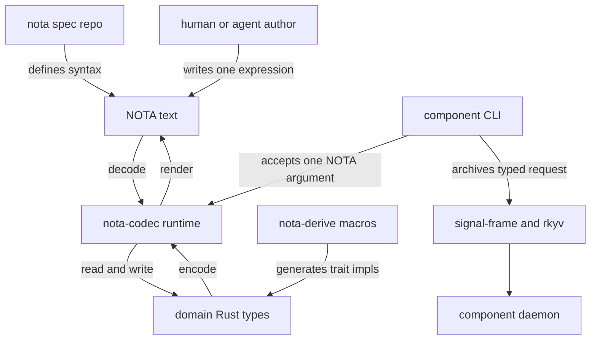

# 305 — NOTA and nota-codec user guide

## Purpose

This report explains NOTA from the outside in: what a user writes,
what a Rust author derives, which library owns each layer, and how
components should expose NOTA at their human-facing edges.

The short version:

**NOTA is typed positional text.** The schema says what each position
means; the text writes values in that order. There are no labeled
fields, no flags, no JSON-style object syntax, no tuples, and no hidden
defaults. The payoff is dense, stable, grep-able text whose structure
maps directly to typed Rust records and enums.

## System Map



The repositories have clean roles:

- `nota` is the spec-only syntax repo. It defines delimiters,
  identifiers, strings, records, sequences, maps, comments, byte
  literals, reserved tokens, and the grammar discipline.
- `nota-codec` is the public Rust crate users depend on. It owns
  `Lexer`, `Token`, `Decoder`, `Encoder`, `NotaEncode`,
  `NotaDecode`, `NotaMapKey`, `Path`, typed `Error`, primitive and
  container impls, and re-exports the derives.
- `nota-derive` is the proc-macro crate. Rust requires proc macros to
  live separately, but users normally get its macros through
  `nota-codec`.
- `nota-config` is the startup helper for binaries that take exactly
  one configuration source: inline NOTA, a `.nota` file, or a `.rkyv`
  file.
- `signal-*` contract crates own component operation/reply/event
  types. NOTA is their authored/debug projection; daemon-to-daemon
  runtime traffic is Signal/rkyv, not NOTA text.

## The User Model

At every value position, ask:

1. What type does the schema expect here?
2. Which delimiter or token form represents that value?

The three structural delimiter pairs are:

```nota
(...)  ;; record: struct fields or data-carrying enum variant
[...]  ;; compact sequence family: vector or string-like value
{...}  ;; map: flat key value key value stream
```

Square brackets are best understood as a compact sequence family.
At a `String`-like position they are a compact character sequence:

```nota
[he said 'yes']
```

At a collection position they are a sequence of typed elements:

```nota
[TailnetClient (NixBuilder None)]
```

The schema position tells the reader which collection-like use is in
play. That is not an exception to NOTA; it is the point of typed
positional text.

## Records

Structs are untagged positional records:

```nota
(operator skills/operator.md Apex [Implementation as craft.])
```

The Rust schema carries the field names. The text does not repeat
them. For a schema like:

```rust
pub struct Skill {
    pub name: String,
    pub path: nota_codec::Path,
    pub tier: Tier,
    pub description: String,
}
```

the NOTA record writes the four values in field order. It does not
write `(Skill ...)` unless `Skill` is an enum variant at that position.

Wrong shapes:

```nota
(Skill operator skills/operator.md Apex [Implementation as craft.])
(Skill (name operator) (path skills/operator.md) (tier Apex))
```

The first turns `Skill` into an enum variant tag. The second imports
labeled-field syntax from other formats. NOTA records are positional.

## Enums

PascalCase belongs to enums. There are exactly three value-position
cases:

```nota
TailnetClient
```

Bare PascalCase is a non-data-carrying unit variant.

```nota
(NixBuilder (Some 8))
```

Parenthesized PascalCase is a data-carrying variant. The variant name
is the first token; its fields follow positionally.

```nota
(alice)
```

A parenthesized record without a leading PascalCase token is a struct.
The struct type comes from the schema position.

Mixed enums are normal:

```rust
#[derive(NotaEnum)]
pub enum ServiceKind {
    TailnetClient,
    NixBuilder { maximum_jobs: Option<u32> },
    PersonaDevelopment(Vec<String>),
}
```

```nota
TailnetClient
(NixBuilder (Some 8))
(PersonaDevelopment [agent runtime])
```

Common mistakes:

```nota
(TailnetClient)      ;; wrong: unit variants are bare
NixBuilder           ;; wrong: data variants carry fields in a record
[TailnetClient ...]  ;; valid only if this position is a Vec<ServiceKind>
```

## Options And Completeness

`Option<T>` is a normal enum shape:

```nota
None
(Some zeus)
(Some [prometheus])
```

Every field declared by a record schema appears in the text. There is
no tail omission, no implicit `None`, and no defaulted positional
field.

For a record shaped as:

```nota
(Deploy <action> <builder?> <substituters?>)
```

valid values include:

```nota
(Deploy switch (Some zeus) (Some [prometheus]))
(Deploy switch None (Some [prometheus]))
(Deploy switch None None)
```

Invalid values include:

```nota
(Deploy switch)
(Deploy switch (Some zeus))
```

When a schema gains a new field, existing files migrate to carry the
new position explicitly, often as `None`, `[]`, or a closed variant
that names the old behavior.

## Strings And Paths

The canonical authored string form is bracket strings:

```nota
[hello world]
[we're ready]
[he said 'yes']
[quote "yes"]
[array[0\]]
```

Use block strings for multiline text:

```nota
[|
  line one
  line two
|]
```

Block strings dedent common indentation when the content starts with a
newline. They are for paragraphs, certificates, policies, or examples.

Bare camelCase and kebab-case tokens are accepted at `String`
positions:

```nota
nota-codec
fooBar
with_underscore
```

Use brackets for PascalCase string content, spaces, non-ASCII,
leading digits, `None` as content, `:` content, and path-shaped
content at a `String` position:

```nota
[User]
[01-intro.md]
[None]
[skills/operator.md]
```

`Path` is a distinct schema type. At a `Path` position, common
filesystem shapes can be bare:

```nota
skills/operator.md
./request.nota
/etc/hosts
../bar
```

The same token at a `String` position is rejected unless bracketed.
That rejection is useful: it forces the schema to say whether the
field is ordinary text or path-shaped data.

Legacy double-quoted strings still decode during migration. New
authored examples should not teach them as the normal form.

## Maps

Maps use braces, not vectors of entry records:

```nota
{host localhost port 8080}
{User 100 Admin 200}
{./local.nota 2 skills/operator.md 1}
```

Odd positions are key text. Even positions are values. A bare
PascalCase map key is valid because the map delimiter has already
said "this token is key text", not a unit enum variant.

Invalid map habits:

```nota
[(Entry host localhost)]  ;; vector of enum variants, not a map
[(host localhost)]        ;; vector of structs, not a map
{[with space] 1}          ;; whitespace keys are rejected
```

In Rust, map keys must be scalar key-slot types: `String`,
`nota_codec::Path`, or a string-like newtype implementing
`NotaMapKey`.

```rust
#[derive(NotaMapKey, Debug, Clone, PartialEq, Eq, PartialOrd, Ord, Hash)]
pub struct NodeName(String);

#[derive(NotaRecord, Debug, Clone, PartialEq, Eq)]
pub struct Cluster {
    pub nodes: std::collections::BTreeMap<NodeName, Service>,
}
```

The wire remains `{node value ...}`. The Rust type carries the stronger
meaning.

## The Rust User Surface

A normal Rust user depends on `nota-codec`:

```rust
use nota_codec::{
    Decoder, Encoder, NotaDecode, NotaEncode, NotaEnum, NotaMapKey,
    NotaRecord, NotaTransparent, NotaTryTransparent,
};
```

The derive choices are:

| Derive | Use for | Wire shape |
|---|---|---|
| `NotaRecord` | named-field structs | `(field0 field1 ...)` |
| `NotaEnum` | closed enums, including mixed unit/data variants | `Variant` or `(Variant fields...)` |
| `NotaTransparent` | infallible single-field newtypes | inner value |
| `NotaTryTransparent` | validating single-field newtypes | inner value plus decode validation |
| `NotaMapKey` | string-like map key newtypes | one map-key token |

Example:

```rust
use std::collections::BTreeMap;
use nota_codec::{
    Decoder, Encoder, NotaDecode, NotaEncode, NotaEnum, NotaMapKey,
    NotaRecord, NotaTransparent,
};

#[derive(NotaTransparent, Debug, Clone, PartialEq, Eq)]
pub struct Label(String);

#[derive(NotaMapKey, Debug, Clone, PartialEq, Eq, PartialOrd, Ord, Hash)]
pub struct NodeName(String);

#[derive(NotaEnum, Debug, Clone, PartialEq, Eq)]
pub enum ServiceKind {
    TailnetClient,
    NixBuilder { maximum_jobs: Option<u32> },
    PersonaDevelopment(Vec<String>),
}

#[derive(NotaRecord, Debug, Clone, PartialEq, Eq)]
pub struct Service {
    pub label: Label,
    pub kind: ServiceKind,
}

#[derive(NotaRecord, Debug, Clone, PartialEq, Eq)]
pub struct Cluster {
    pub nodes: BTreeMap<NodeName, Service>,
}

fn round_trip(service: Service) -> nota_codec::Result<Service> {
    let mut encoder = Encoder::new();
    service.encode(&mut encoder)?;
    let text = encoder.into_string();

    let mut decoder = Decoder::new(&text);
    Service::decode(&mut decoder)
}
```

`NotaRecord` uses declaration order. `NotaEnum` makes the enum variant
set closed. `NotaTransparent` keeps domain distinctions in Rust while
using the inner value in text. `NotaTryTransparent` puts validation at
the decode boundary.

## Errors As Guidance

`nota-codec` has typed errors rather than one stringly "custom" error.
The common ones are user-teaching signals:

| Error | Usually means | Fix |
|---|---|---|
| `LabeledFieldShape` | You wrote `(Type (field value) ...)` | Write positional fields |
| `PascalCaseAtStringPosition` | You wrote bare `User` as a string | Write `[User]` or make the type an enum |
| `PathShapedTokenInStringPosition` | You wrote `skills/file.md` in a `String` slot | Use `Path` or write `[skills/file.md]` |
| `UnitVariantInRecordForm` | You wrote `(Variant)` | Write `Variant` |
| `DataVariantWithoutRecord` | You wrote `Variant` for a payload variant | Write `(Variant fields...)` |
| `UnknownVariant` | Variant is not in the Rust enum | Fix spelling or schema |
| `DuplicateMapKey` | Same key text appears twice | Make keys unique |
| `MapKeyContainsWhitespace` | Map key is free-form prose | Use a different key or a vector of records |
| `UnexpectedEnd` | Record is short | Add the missing explicit positions |

Compile-time derive failures are also part of the user surface.
`NotaEnum` rejects unsupported tuple-like shapes; `NotaMapKey` rejects
record-shaped keys; Rust tuples have no blanket codec impl. Those are
design feedback, not missing convenience.

## Component Usage

Component binaries use NOTA as the human-facing invocation language.
The rule is one argument:

```sh
component "(Operation field0 field1)"
component ./request.nota
component ./request.rkyv
```

No flags, no subcommands, no `--config`. If a binary needs more input,
the request/config record gets another typed field or variant.

Bracket strings are the practical shell win:

```sh
component "(Say [we're ready])"
lojix-cli "(CheckHostKeyMaterial goldragon tiger [/tmp/operator's datom.nota])"
```

The whole NOTA message can sit inside shell double quotes while the
text inside can use apostrophes naturally. For content that is awkward
in the chosen shell quoting style, use a `.nota` file.

Runtime component traffic should not become ad-hoc NOTA sockets.
The component shape is:

- CLI accepts one NOTA request source.
- CLI decodes to a typed request.
- CLI sends Signal/rkyv to its daemon.
- Daemon replies with typed Signal/rkyv.
- CLI renders one NOTA reply or typed error for the human.

`nota-config` handles startup configuration with the same discipline:
exactly one source, decoded into one typed configuration record.

## Testing Guidance

Tests should name the constraint they protect, not just the syntax
feature:

- `nota_argument_accepts_apostrophe_text_without_quote_delimiters`
- `source_path_with_apostrophe_must_not_require_quote_delimiters`
- `error_messages_with_apostrophes_do_not_require_quote_delimiters`
- `daemon_configuration_round_trips_through_nota_text`
- `contract_crate_has_no_runtime_dependencies`

Final evidence should be Nix-owned: `nix flake check` or named
`checks.<system>.<constraint>` outputs. Plain `cargo test` is useful
inner-loop feedback, not final workspace evidence unless Nix exposes
it as a check.

For contract crates, prove both projections when both matter:

- NOTA round-trip for CLI/debug examples.
- rkyv or Signal-frame round-trip for daemon runtime wire.

## Migration Guidance

For authored NOTA, migrate quotation-mark strings to bracket strings
where practical:

```nota
"we're ready"                 ;; legacy authored form
[we're ready]                 ;; normal authored form

"/tmp/operator's datom.nota"  ;; legacy authored form
[/tmp/operator's datom.nota]  ;; normal authored form
```

Do not confuse host-language string literals with NOTA string
delimiters. A Rust test still writes a Rust string literal around the
whole NOTA example; the migration target is the NOTA content inside it.

For derives, migrate old `NotaSum` and `NotaUnitEnum` references to
`NotaEnum`. `NotaEnum` covers unit variants, data-carrying variants,
and mixed enums. Empty struct variants should become unit variants.
Multi-field tuple variants should become named-field struct variants.

## Author Checklist

1. Define the Rust schema first: named-field structs, closed enums,
   transparent newtypes, and scalar map-key newtypes.
2. Use `NotaRecord` for structs and `NotaEnum` for variant sets.
3. Keep every record complete. Write `None` explicitly for absent
   optionals.
4. Use bracket strings for normal authored prose and shell-friendly
   examples.
5. Use `Path` for path data, not a loose `String`.
6. Use `{key value ...}` maps only for unique scalar keys.
7. Put domain distinctions in the schema, not in comments.
8. Make component CLIs accept one NOTA request source and reject extra
   argv/trailing tokens.
9. Use Nix-owned, constraint-named tests for user-facing behavior.

## Subreports

- `1-user-notation-model.md` explains the human notation model and
  common authoring mistakes.
- `2-rust-codec-and-derive-architecture.md` explains `nota-codec`,
  `nota-derive`, derives, examples, and error guidance.
- `3-component-usage-and-tests.md` explains component CLI/config use,
  bracket-string migration, and Nix-backed testing patterns.
