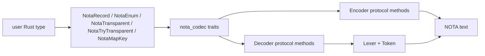

# Rust codec and derive architecture

*Kind: Research - Topic: nota-codec - 2026-05-23*

## Claim

Rust users should treat `nota-codec` as the single public crate: it
owns the runtime `Decoder`, `Encoder`, lexer tokens, public traits,
typed errors, `Path`, blanket primitive/container impls, and re-exports
all derives. `nota-derive` is the proc-macro implementation crate that
Rust requires to be separate; users normally never depend on it
directly.

The split is mechanical but important:



## Syntax versus codec responsibility

NOTA syntax supplies the textual forms: records use `( )`, sequences
use `[ ]`, maps use `{ }`, comments start with `;;`, byte literals use
`#`, unit enum variants are bare PascalCase, data-carrying variants
are `(Variant fields...)`, and structs are untagged positional
records. Optional absence is the explicit unit variant `None`; optional
presence is `(Some inner)`. There is no omitted field shape.

`nota-codec` implements tokenization and typed read/write behavior for
that syntax. It decides, from schema position, whether `[` opens a
sequence or a bracket string, whether a bare token is acceptable as
`String` or `Path`, and which typed `Error` variant to return.

`nota-derive` maps Rust shapes to those runtime protocol calls. It
does not define syntax and does not own domain record kinds. Domain
crates decide which Rust records and enums exist; the derives only
make their declared shapes encode and decode.

The low-level public API is still useful when a caller is building a
top-level dispatcher or a custom scalar: `Lexer::next_token()` exposes
raw tokens, `Decoder` reads primitive literals and delimiters, `Encoder`
writes primitive literals and delimiters, `Path` provides the typed
UTF-8 filesystem-path scalar, and `nota_codec::Result<T>` carries the
crate's typed `Error`.

## User surface

Common imports:

```rust
use std::collections::BTreeMap;
use nota_codec::{
    Decoder, Encoder, NotaDecode, NotaEncode, NotaEnum, NotaMapKey,
    NotaRecord, NotaTransparent,
};

#[derive(NotaTransparent, Debug, Clone, PartialEq, Eq)]
pub struct Label(String);

#[derive(NotaMapKey, Debug, Clone, PartialEq, Eq, PartialOrd, Ord, Hash)]
pub struct NodeName(String);

impl NodeName {
    pub fn new(value: impl Into<String>) -> Self {
        Self(value.into())
    }
}

#[derive(NotaEnum, Debug, Clone, PartialEq, Eq)]
pub enum ServiceKind {
    TailnetClient,
    Builder { maximum_jobs: Option<u32> },
    Development(Vec<String>),
}

#[derive(NotaRecord, Debug, Clone, PartialEq, Eq)]
pub struct Service {
    pub label: Label,
    pub kind: ServiceKind,
}

#[derive(NotaRecord, Debug, Clone, PartialEq, Eq)]
pub struct Cluster {
    pub nodes: BTreeMap<NodeName, Service>,
}

fn example() -> nota_codec::Result<()> {
    let service = Service {
        label: Label("main service".to_string()),
        kind: ServiceKind::Builder { maximum_jobs: Some(8) },
    };

    let mut encoder = Encoder::new();
    service.encode(&mut encoder)?;
    let text = encoder.into_string();
    assert_eq!(text, "([main service] (Builder (Some 8)))");

    let mut decoder = Decoder::new(&text);
    let recovered = Service::decode(&mut decoder)?;
    assert_eq!(recovered, service);

    let mut nodes = BTreeMap::new();
    nodes.insert(NodeName::new("Zeus"), service);
    let cluster = Cluster { nodes };

    let mut encoder = Encoder::new();
    cluster.encode(&mut encoder)?;
    assert_eq!(
        encoder.into_string(),
        "({Zeus ([main service] (Builder (Some 8)))})",
    );

    Ok(())
}
```

This example covers the core derive mapping:

- `Service` is a `NotaRecord`, so it is a tagless struct record:
  `([main service] (Builder (Some 8)))`, not `(Service ...)`.
- `ServiceKind` is a mixed `NotaEnum`: `TailnetClient` is bare,
  `Builder { maximum_jobs: Some(8) }` is `(Builder (Some 8))`, and
  `Development(vec!["runtime"])` is `(Development [runtime])`.
- `NodeName` is a custom scalar map key. A `BTreeMap<NodeName, Service>`
  encodes as `{key value key value}`, sorted by projected key text.
- `Label` is a transparent string-like newtype. It uses the inner
  `String` wire form: bare for strict camel/kebab identifiers, bracket
  strings for spaces or unsafe characters, and block strings for safe
  multiline content.

If construction is fallible, use `NotaTryTransparent` instead of
`NotaTransparent`. The type must expose `Self::try_new(inner) ->
Result<Self, E>` where `E: Display`; decode errors become
`Error::Validation { type_name, message }`. If a transparent newtype
also needs to be a map key, it needs `NotaMapKey` too; `NotaTransparent`
does not imply map-key eligibility.

## Encoding and decoding shapes

`NotaRecord` supports named-field structs and unit structs. Named-field
structs encode as positional records in declaration order. Unit structs
encode as `()`. Tuple structs are not records; a single-field tuple
struct is a transparent newtype, and multi-field Rust tuples have no
blanket codec impl.

`NotaEnum` supports unit variants, single-field tuple variants, and
named-field struct variants. Unit variants encode as bare PascalCase.
Data-carrying variants encode as tagged records. Empty tuple variants,
empty struct variants, and multi-field tuple variants are rejected at
derive time because they do not provide the field-name structure NOTA
expects.

`Option<T>` is just the standard enum shape in codec form: `None` or
`(Some inner)`. A record short on fields errors, even when the missing
field type is `Option<T>`. This all-fields-explicit rule is the load-
bearing migration behavior.

`Vec<T>`, `BTreeSet<T>`, and `HashSet<T>` use sequence brackets. Sets
and hash maps are encoded deterministically by sorting. `BTreeMap<K,V>`
and `HashMap<K,V>` use flat map braces and require `K: NotaMapKey`;
values use `NotaEncode` and `NotaDecode`.

`String`, `Path`, and map keys are string-like but not interchangeable.
Bare PascalCase at a `String` position is an enum-looking token and is
rejected. Path-shaped bare tokens such as `skills/operator.md` are
accepted at `Path` positions but rejected at `String` positions unless
delimited. Map-key positions accept PascalCase as key text because the
map delimiter already fixes the role of the token.

## Common errors and avoidance

`LabeledFieldShape` appears when a record is written like
`(Edge (from 100) (to 200))`. Write positional NOTA instead:
`(100 200)`.

`PascalCaseAtStringPosition` appears when string content is written as
bare `Foo`. Delimit it as `[Foo]` or `"Foo"`, or make the field an enum
if `Foo` is meant to be a variant.

`PathShapedTokenInStringPosition` appears when a `String` field receives
bare `skills/operator.md`. Use `nota_codec::Path` for path data or
delimit the string as `[skills/operator.md]`.

`DataVariantWithoutRecord`, `UnitVariantInRecordForm`, and
`UnknownVariant` come from enum-shape mismatches. Unit variants are bare;
data variants are parenthesized; variant names must be in the Rust enum.

`UnexpectedEnd` or `UnexpectedToken` often means a record is short, a
delimiter is wrong, or an optional field was omitted. Every field must
appear, and absent options must be written as `None`.

`DuplicateMapKey` and `MapKeyContainsWhitespace` come from the flat map
shape. Map key text must be single-token text and unique after
projection through `NotaMapKey::as_map_key`.

Compile-time derive errors protect unsupported Rust shapes: map keys
must implement `NotaMapKey`, `NotaMapKey` derives only for single-field
string-like tuple structs, `NotaEnum` rejects multi-field tuple
variants, and Rust tuples have no blanket codec impl.

## Practical guidance for Rust users

Depend on `nota-codec`, import the derive macros and the
`NotaEncode`/`NotaDecode` traits, derive on your domain types, then use
`Encoder::new()` plus `value.encode(&mut encoder)?` to render and
`Decoder::new(text)` plus `Type::decode(&mut decoder)?` to parse. For
top-level user input, call `decoder.peek_token()?` after the expected
value if the caller must reject trailing tokens.

Use `NotaRecord` for positional schema records, `NotaEnum` for closed
variant dispatch, `NotaTransparent` or `NotaTryTransparent` for
single-value domain newtypes, and `NotaMapKey` only for scalar identity
types that are valid as map keys. Avoid serde-shaped expectations:
serde defaults, labeled fields, string tags, and omitted optionals are
outside this codec's contract.
