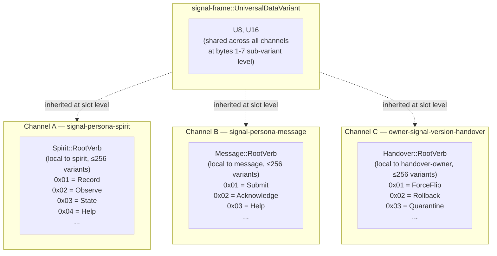
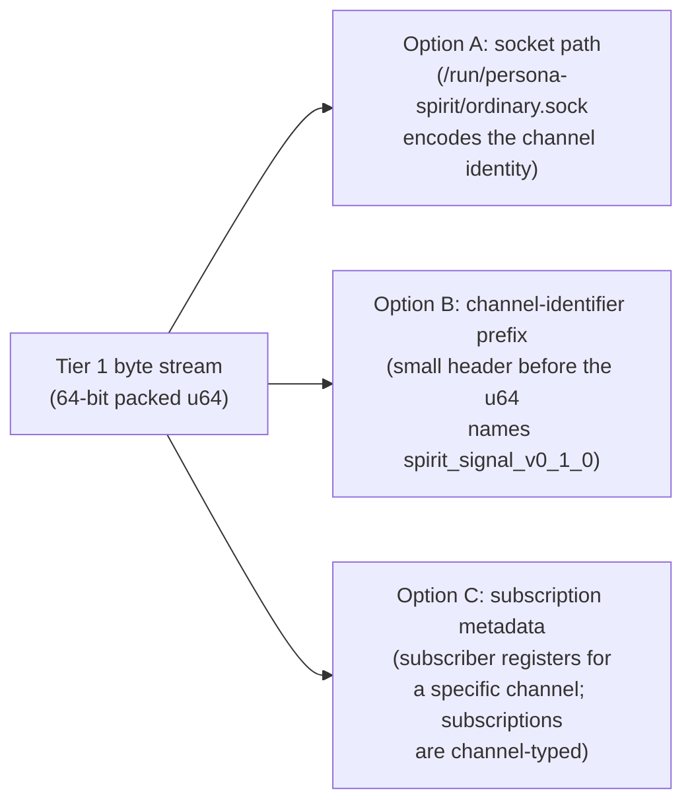
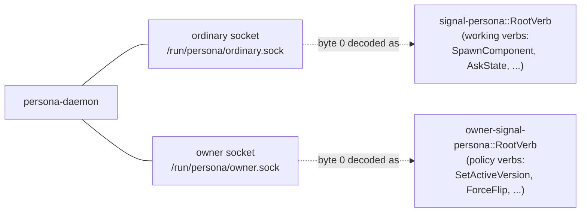
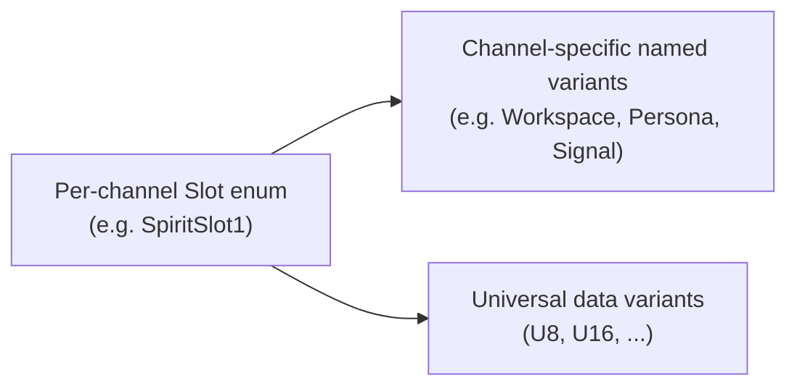
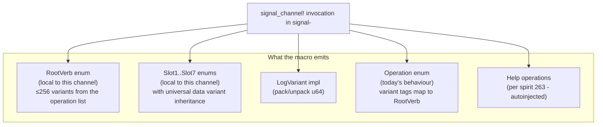
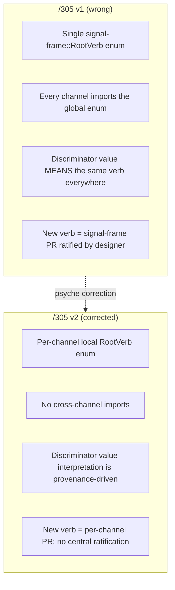

# 305-v2 — Per-component namespacing for the 64-bit signal object

**Status:** per-component namespacing landed in `signal-frame/ARCHITECTURE.md §5.2`; this report preserves the per-component-vs-workspace-wide rationale.

*Kind: Design · Topic: 64-bit-signal-namespacing · 2026-05-23*

*Psyche corrected the prior version's central-enum framing per
spirit record 326: "It's just going to be per component. We're going
to know what it is. So there's no universal namespace. Because each
namespace is unique. So it might use common data types. But, you
know, its root objects are going to be unique. So every log is logged
differently depending on where it came from. Right, so it's by
provenance." This v2 supersedes the prior /305 (which proposed a
workspace-wide `signal-frame::RootVerb` central enum — wrong shape).*

## §1 The correction in one paragraph

The prior /305 designed a single workspace-wide `RootVerb` enum
imported by every channel. The psyche corrected: **the 64-bit
object's byte 0 is per-channel**, not workspace-wide. Each contract
crate (each socket / each channel) declares its OWN ~256-variant
root verb enum. The decoder reads byte 0 IN THE CONTEXT of the
provenance — the consumer always knows which channel a log came
from, so the same byte value (e.g. `0x01`) means different verbs on
different channels and that is FINE. There is no global registry,
no central import, no cross-channel collision risk. Provenance
solves what a global enum would have.

What's still shared: the **universal data variants** (`U8`, `U16`,
and future primitives) sit in bytes 1-7 (sub-variant slots) and ARE
inherited by every channel's slot enums. The sharing happens at the
sub-variant level, not at the root-verb level.

## §2 Per-component namespacing model



Each channel's `RootVerb` enum is named locally (e.g.
`spirit_signal::RootVerb`, `message_signal::RootVerb`,
`handover_owner_signal::RootVerb`). Each carries up to 256 variants
for that channel's verbs. The same byte value `0x01` decodes as
`Record` on a spirit log, `Submit` on a message log, `ForceFlip` on
a handover-owner log. The decoder reads the log envelope's
provenance to know which RootVerb to interpret byte 0 against.

## §3 What provenance is + where it lives

Provenance answers "which channel did this Tier 1 byte stream come
from?" The log envelope carries it. Three natural carriers:



Recommendation: **Option C (subscription metadata)** for in-process
+ same-host streams; Option A is a fallback discovery surface; Option
B only if cross-host stream multiplexing becomes a thing. Today,
subscribers attach to specific channels via `signal_channel!`'s
`observable` block; the channel is known at subscription time; no
envelope-level provenance bytes needed.

## §4 The two channels per triad — ordinary vs owner

Every component triad has TWO contract crates:

- `signal-<component>` — ordinary working signal
- `owner-signal-<component>` — owner-only policy signal

**Each is its own channel with its own RootVerb namespace.**
Persona's ordinary socket carries `signal_persona::RootVerb` verbs;
persona's owner socket carries `owner_signal_persona::RootVerb`
verbs. Different namespaces, different sockets, same component.



## §5 Exploration — owner → meta rename (Medium certainty)

Per spirit record 326 verbatim: *"I was thinking of changing owner
to meta. The meta signal, the meta socket. Which is even more broad
than owner. But Rust decided, RustLang decided on owner."*

The rename would change every `owner-signal-<component>` →
`meta-signal-<component>` and every `OwnerIdentity` → `MetaIdentity`
or similar. Motivation: "meta" is broader than "owner" — captures
the sense of administrative/policy authority more generally, not
specifically as ownership.

Tension: Rust's standard vocabulary uses "owner" (ownership type
system; `Arc`/`Rc` ownership semantics; etc.). Workspace adopting
"meta" creates terminological friction with the Rust ecosystem.

Held as exploration (Medium certainty). If the rename lands, it
becomes a workspace-wide pass similar to the persona-prefix removal
(bead `primary-0m1u`). For this report: continue using "owner" as
the canonical term; flag "meta" as the alternative the psyche is
weighing.

## §6 Universal data variants in bytes 1-7

The psyche kept universals shared. They live in the SUB-VARIANT
slots (bytes 1-7), not byte 0:



Each slot enum (`Slot1`...`Slot7` per channel) inherits the
universal data variants. The decoder for a slot byte first checks
"is this a named variant for this channel's slot enum?" then "is
it a universal data variant?" — the discriminant ranges are
disjoint:

| Range | Meaning |
|---|---|
| `0x00`-`0x7F` (128 values) | Channel-specific named variants for this slot |
| `0x80`-`0xFD` (126 values) | Reserved for future universals |
| `0xFE` | `U8` width-2 (slot + next slot = U8 value) |
| `0xFF` | `U16` width-3 (slot + next 2 slots = U16 value) |

Multi-byte universals consume contiguous slots: `U16` in slot 2
consumes slots 3+4 too. Parser invariant holds across channels:
the WIDTH of `U16` is universal; channels just declare their own
named variants in the low range.

Or — simpler — universals get FIXED discriminants reserved across
channels:

- `U8` = always `0xFE` (any slot's enum interprets `0xFE` as U8)
- `U16` = always `0xFF`
- Future universals fill `0xFD`, `0xFC`, ... working down

Each channel's slot enum gets named variants only in `0x00`-`0xFD`
(254 named variants per slot — plenty). Operator can pick which
form when implementing.

## §7 Macro shape — what `signal_channel!` emits per channel



Macro input shape:

```rust
signal_channel! {
    operation Operation {
        #[log_variant(root = Record, slot1 = Workspace, slot2 = Decision, slot3 = Maximum)]
        Record { topic: Topic, kind: Kind, certainty: Magnitude, /* ... */ },

        #[log_variant(root = Observe, slot1 = QueryShape)]
        Observe(Query),

        #[log_variant(root = State)]
        State(StatementText),
    }

    slot_enum Slot1 = TopicArea {
        Workspace, Persona, Signal, ComponentShape, Naming, Reports, /* ... */
    }

    slot_enum Slot2 = StatementKind {
        Decision, Principle, Correction, Clarification, Constraint,
    }

    slot_enum Slot3 = MagnitudeKind {
        Minimum, VeryLow, Low, Medium, High, VeryHigh, Maximum,
    }
}
```

What the macro emits:

- `RootVerb` enum local to this channel: variants are `Record`,
  `Observe`, `State`, plus auto-injected `HelpMain`/`HelpVerb` from
  primary-8r1j (or another root verb name for Help — TBD).
- `Slot1`/`Slot2`/`Slot3` enums local to this channel, with the
  universal data variants inherited.
- `LogVariant` impl that packs `(root, slot1, slot2, ..., slot7)`
  into a `u64` using the channel's local discriminants.

No cross-channel imports. Each channel is self-contained at the
verb-namespace level.

## §8 NOTA text-form mapping (per-channel)

Per channel, the NOTA operation IS the verb-namespace structure
written in text:

| NOTA text on persona-spirit channel | Tier 1 packing |
|---|---|
| `(Record (workspace Decision "summary" Maximum "quote"))` | byte 0 = `Spirit::RootVerb::Record`; byte 1 = `Spirit::Slot1::Workspace`; byte 2 = `Spirit::Slot2::Decision`; byte 3 = `Spirit::Slot3::Maximum`; bytes 4-7 unused |
| `(Observe (Records ((Some "spirit") None SummaryOnly)))` | byte 0 = `Spirit::RootVerb::Observe`; byte 1 = `Spirit::Slot1::Records`; rest unused (filters in Tier 3 only) |
| `(Help Main)` | byte 0 = `Spirit::RootVerb::Help` (or `HelpMain`); byte 1 = `Spirit::Slot1::Main` |

The SAME NOTA verb name (e.g. `Help`) on a different channel decodes
to that channel's local `RootVerb::Help` (a different discriminant
value). The CONSUMER doesn't care — the rendered NOTA text is the
human surface; the byte packing is the internal Tier 1 form.

## §9 Indexer / logger implications

The Tier 1 promise was "fast indexing, histogram-friendly,
group-by-byte-0 gives root-verb counts." With per-channel
namespaces, the indexer needs the **subscription channel type** to
make those queries meaningful:


Cross-channel queries ("how many `Record`-like operations across
the whole workspace today?") need to subscribe to each channel
separately and decode each with its own RootVerb. The "Record" verb
on spirit IS NOT the same byte as "Submit" on message — even if
both feel like writes — because the namespaces are independent.

This is a feature, not a bug: cross-channel rollup is a semantic
aggregation (the rollup-er names which verbs count as "writes" per
channel), not a byte-level scan.

## §10 Comparison — what /305 v1 had wrong



Key shifts:

| Aspect | v1 (wrong) | v2 (corrected) |
|---|---|---|
| Root verb home | Central in signal-frame | Local to each channel's signal-X crate |
| Cross-channel verb meaning | Same byte = same verb | Same byte = different verbs (provenance keys decoder) |
| Registry mechanism | Designer-ratified central PR | None — each channel autonomous |
| Universal data variants | Same (shared sub-variant inheritance) | Same (shared sub-variant inheritance) |
| Macro emit | Pull from `signal_frame::RootVerb` | Emit local `RootVerb` from operation list |
| New-verb cost | Central enum PR + cross-channel coordination | Channel-local; no coordination |

The corrected shape is **simpler** (no central enum to maintain),
**more autonomous** (channels are independent), and **safer at scale**
(no cross-channel collision risk — there's nothing to collide). The
trade-off: cross-channel byte-level rollup queries need semantic
mapping (the rollup-er knows "verb `0x01` on spirit channel" + "verb
`0x07` on message channel" both count as "writes"). That's
acceptable because semantic rollup is the right level for cross-
channel analytics anyway.

## §11 Open questions for psyche

- **Owner → meta rename.** Captured as Medium-certainty exploration
  (spirit 326 verbatim). Pursue (workspace-wide rename pass like
  persona-prefix removal) or hold (keep "owner" given Rust's term
  precedence)? My lean: hold — Rust ecosystem alignment is
  load-bearing for new contributors; the term clash isn't worth
  the rename churn.
- **Universal data variant discriminant scheme.** §6 sketched two
  options: width-based (variable-width universals consume contiguous
  slots; named variants `0x00`-`0x7F`; universals `0xFE`/`0xFF`) OR
  fixed-top-discriminants (`U8 = 0xFE`, `U16 = 0xFF`, named in the
  remaining 254). Which?
- **Help as a root verb across channels.** Spirit record 263 says
  every component gets `(Help Main)` + `(Help (Verb name))`. With
  per-channel root verbs, `Help` IS a variant in every channel's
  local RootVerb enum (auto-injected by the macro). The discriminant
  VALUE differs per channel, but the variant NAME is shared by
  macro convention. Confirm this is the expected shape?
- **Subscriber-side provenance carrying.** §3 recommended Option C
  (subscription metadata) over A (socket path) or B (envelope
  prefix). For in-process subscribers this is trivial. For
  cross-host (e.g. cluster ingestion of Tier 1 streams from many
  daemons), do we need an explicit channel-identifier prefix in the
  stream? Recommend defer until cross-host streaming is real.
- **256-variant boundary per channel.** Some channels (e.g.
  persona-router with many operations) may approach the 256-variant
  ceiling. When a channel runs out of root verbs, what happens?
  Recommendation: ceiling is a design smell — if a channel needs
  300 verbs, the channel itself is overgrown and wants splitting.

## §12 What lands next + bead reconciliation

- `primary-l02o` (signal-frame: LogVariant trait + autogen derive
  macro, P1 OPEN) now has corrected scope: the macro emits a
  CHANNEL-LOCAL RootVerb enum, not a wrapper around a central one.
  Bead body may need update; operator can adjust at pickup.
- `primary-bg9l` (signal-frame: LogSummary trait + 64-byte size
  check, P1 OPEN) is unchanged by this correction — Tier 2 doesn't
  involve the RootVerb structure.
- `primary-2py5` (signal-sema: LogVariant impl for SemaObservation,
  P2 OPEN) is unchanged in shape — the channel-local RootVerb for
  SemaObservation is just `signal_sema::RootVerb` per the corrected
  model.
- `primary-8r1j` (Help operations auto-injection, P1 OPEN, just
  filed) needs a note: Help is auto-injected as a variant in EACH
  channel's local RootVerb, not as a workspace-wide root verb.
- `signal-frame/ARCHITECTURE.md §5.2` text needs a correction —
  current ARCH says "verb-space is a single enum, shared across
  the workspace". This is wrong per the corrected model. A
  follow-up edit to signal-frame ARCH supersedes the central-enum
  framing.

## See also

- `signal-frame/ARCHITECTURE.md §5` — three-tier sizing + verb-namespace
  bit layout (manifested by second-designer 2026-05-23; §5.2 text
  needs a correction per this report)
- `reports/second-designer/159-intent-manifestation/1-signal-verb-namespace-arch.md`
  — the original manifestation that landed the bit layout (correct
  on layout; needs follow-up on the central-enum framing it inherited)
- `reports/second-designer/155-three-tier-signal-sizing-and-lossless-routing-2026-05-22.md`
  Part 1 — original three-tier design
- Spirit records 244 (three-tier sizing), 251 (Part 1 ratified),
  271 (verb-namespace structure), 272 (universal data variants),
  273 (extended tier), 323 (focus capture), 326 (per-component
  correction that drives v2)
- Beads `primary-l02o`, `primary-bg9l`, `primary-2py5`,
  `primary-b86d`, `primary-k8cn`, `primary-8r1j`
- Predecessor `305-design-64bit-signal-root-verb-namespacing-mechanism.md`
  — deleted in same commit per supersession discipline
