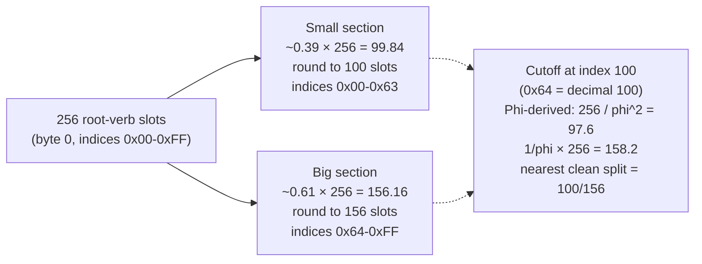
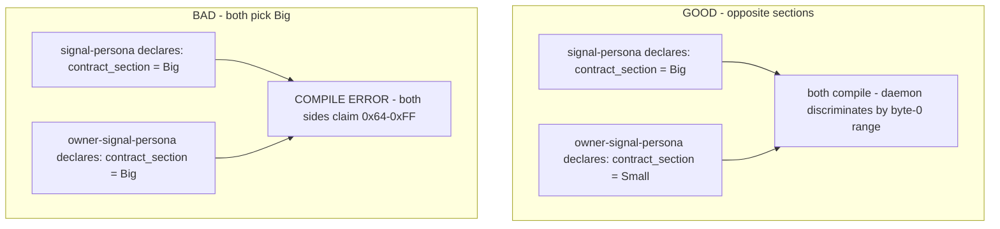
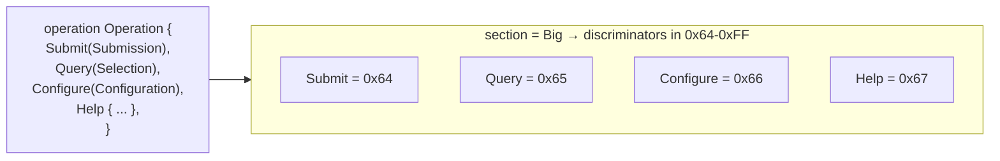
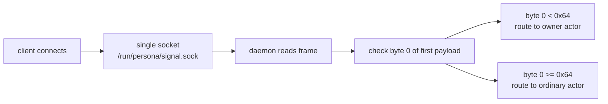
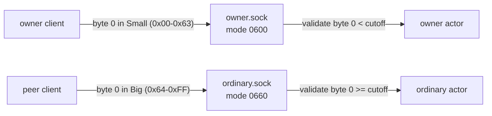

# 307 — Golden-ratio split of the byte-0 root-verb namespace
#       (and the single-socket potential consequence)

*Kind: Design · Topic: signal-namespacing · 2026-05-23*

*Psyche 2026-05-23 (spirit record 327): the 256-variant byte-0
namespace is too big for one component's root verbs alone. Split by
golden ratio (~0.39 / 0.61) into two sections. Owner contract claims
one section; public/ordinary contract claims the other. Macro
enforces compile-time agreement — if both contracts pick the same
side, it does not compile. Default: owner=small, public=big. This
report fixes the exact split point, sketches the macro mechanism,
and analyses the single-socket consequence that emerges when byte 0
itself encodes ordinary-vs-owner.*

*This extends `reports/designer/305-v2-design-64bit-signal-per-component-namespacing.md`;
read 305-v2 first for the per-component model.*

## §1 The exact split — `OwnerSmall` 0x00-0x63, `PublicBig` 0x64-0xFF

### §1.1 The math



`Phi = (1 + sqrt(5)) / 2 ~= 1.6180`. The golden ratio's two parts
are `1/Phi ~= 0.6180` (big) and `1/Phi^2 ~= 0.3820` (small). Applied
to 256:

- `256 * 0.3820 = 97.79`  (small section target)
- `256 * 0.6180 = 158.21` (big section target)

Two natural cutoffs:

| Cut | Small range | Big range | Small / 256 | Big / 256 | Notes |
|---|---|---|---|---|---|
| **100 / 156** | 0x00-0x63 | 0x64-0xFF | 0.391 | 0.609 | rounded decimal, +0.009 from true golden small |
| 98 / 158 | 0x00-0x61 | 0x62-0xFF | 0.383 | 0.617 | closer to mathematical golden |
| 64 / 192 | 0x00-0x3F | 0x40-0xFF | 0.250 | 0.750 | power-of-2 aligned, NOT golden |
| 96 / 160 | 0x00-0x5F | 0x60-0xFF | 0.375 | 0.625 | 3/8 vs 5/8, power-of-2-friendlier |

### §1.2 Canonical choice — 100 / 156, cutoff at decimal 100 (0x64)

**Pick 100 / 156.** Three reasons:

1. **Decimal-readable.** A human auditing a Tier 1 stream sees byte
   value `0x42` and converts: `0x42 = 66`, which is `< 100`, so this
   is an OwnerSmall variant. The cutoff `100` is easy to remember
   and easy to perform mental decimal-vs-section checks against.
   `0x64` (the hex form of 100) is less memorable than `0x40` or
   `0x80`, but the **decimal** cutoff is the human-facing form and
   `100` wins on memorability.
2. **Closest to golden of the two decimal-clean options.** 100/156
   gives `0.391 / 0.609` vs the mathematical `0.382 / 0.618`; the
   error is 0.009 on the small side. 98/158 is closer (`0.383 /
   0.617`) but 98 is not a memorable cutoff.
3. **Not a power of 2 — and that is the point.** Power-of-2 splits
   (64/192, 128/128) are obvious shortcuts the macro will be tempted
   to fall back on; encoding the split decimally as 100/156 keeps
   the rationale explicit. If we wanted power-of-2 we would just
   split 128/128, lose the golden-ratio shape, and lose the
   asymmetry that motivated the split in the first place (owner
   contracts have fewer verbs than public contracts).

**Reject the power-of-2 temptation.** A future agent will ask "why
isn't this 64/192 or 128/128?" The answer: the workspace's typical
owner contract carries ~10-30 policy verbs; the public contract
carries ~30-80 operation verbs. 100 / 156 gives the public side a
~50% bigger room without making either side cramped. A 50/50 split
wastes ~50 slots on the owner side that the public side could use;
a 25/75 split (64/192) gives owner contracts almost no growth room.
Golden ratio is the proportionality that nature reaches for under
asymmetric pressure — and the asymmetry here (more public verbs
than owner verbs) is real.

### §1.3 Symbolic names

The two sections get symbolic constants exported from
`signal-frame`:

```rust
pub const NAMESPACE_SMALL_FIRST: u8 = 0x00;
pub const NAMESPACE_SMALL_LAST: u8  = 0x63;   // decimal 99
pub const NAMESPACE_BIG_FIRST: u8   = 0x64;   // decimal 100
pub const NAMESPACE_BIG_LAST: u8    = 0xFF;   // decimal 255
pub const NAMESPACE_CUTOFF: u8      = 0x64;   // first byte of big

pub enum NamespaceSection {
    Small,  // 0x00-0x63 - 100 slots
    Big,    // 0x64-0xFF - 156 slots
}

impl NamespaceSection {
    pub const fn classify(byte_zero: u8) -> Self {
        if byte_zero < NAMESPACE_CUTOFF { Self::Small } else { Self::Big }
    }
}
```

The classification is a single `<` compare — fast enough for hot
dispatch paths.

## §2 Macro mechanism — compile-time agreement enforcement

### §2.1 The collision the macro must catch



The two contract crates compile separately. Neither sees the
other's source. The challenge: how does each crate's compilation
detect that the *paired* crate has claimed the same section?

### §2.2 Mechanism — the daemon crate is the witness site

**The collision check lives in the daemon crate, not in either
contract crate.** Each contract crate independently declares its
section as a const at type level. The daemon crate (which depends
on both `signal-<comp>` and `owner-signal-<comp>`) gets a static
assertion that the two sections differ:

```rust
// In signal-persona/src/lib.rs (the public/ordinary contract)
signal_channel! {
    contract_section: NamespaceSection::Big,  // explicit declaration
    operation Operation { ... }
}
// Macro emits:
pub const CONTRACT_SECTION: NamespaceSection = NamespaceSection::Big;

// In owner-signal-persona/src/lib.rs (the owner contract)
signal_channel! {
    contract_section: NamespaceSection::Small,  // explicit declaration
    operation Operation { ... }
}
// Macro emits:
pub const CONTRACT_SECTION: NamespaceSection = NamespaceSection::Small;

// In persona/src/lib.rs (the daemon crate, depends on both)
use signal_persona;
use owner_signal_persona;

const _: () = assert!(
    !matches!(
        (signal_persona::CONTRACT_SECTION, owner_signal_persona::CONTRACT_SECTION),
        (NamespaceSection::Big, NamespaceSection::Big)
        | (NamespaceSection::Small, NamespaceSection::Small)
    ),
    "signal-persona and owner-signal-persona both claim the same byte-0 \
     namespace section; one must take Small, the other Big"
);
```

This assertion runs at *daemon* compile-time. The contract crates
themselves compile freely (a contract crate may be consumed by
other contract crates or by libraries that have no opinion about
section pairing). The triad's daemon is the natural assertion site
because that is where the two contracts meet and must coexist.

**Helper macro** — wrap the assertion in a one-line invocation that
the daemon crate calls:

```rust
// signal-frame exports this macro
signal_frame::assert_triad_sections!(
    signal_persona,
    owner_signal_persona,
);
```

Macro expands to the `assert!` above. One line per daemon. The
error message names both contracts so the operator knows which
to flip.

### §2.3 Alternative — workspace-level manifest (rejected)

An alternative was a workspace-level manifest file listing each
triad's section assignment. Rejected because:

- It adds a third source of truth (the manifest) alongside the
  two contract crates. Three sources can disagree.
- It puts contract metadata outside the contract crate — operators
  expect to find a contract's wire-level facts inside the contract
  crate, not in a top-level manifest.
- It does not catch the error at the *site where the type bug
  matters*. The daemon is where dispatch happens; an assertion
  in the daemon means dispatch code can rely on the invariant.

### §2.4 What gets emitted per contract

Each `signal_channel!` invocation now emits, in addition to its
existing `RootVerb` enum and slot enums (per /305-v2):

- `pub const CONTRACT_SECTION: NamespaceSection` — the declared
  section.
- `pub const ROOT_VERB_FIRST: u8` — the lowest allowed
  discriminator (0x00 if Small, 0x64 if Big).
- `pub const ROOT_VERB_LAST: u8` — the highest allowed
  discriminator (0x63 if Small, 0xFF if Big).
- `pub const ROOT_VERB_COUNT: u8` — the section's variant count
  (100 if Small, 156 if Big).
- Automatic `#[repr(u8)]` allocation of each `RootVerb` variant
  into the declared range. Variants are auto-numbered starting at
  `ROOT_VERB_FIRST`; manual `= N` annotations are checked to fall
  within `[ROOT_VERB_FIRST, ROOT_VERB_LAST]`.

A contract that exceeds its section's variant count fails to
compile with a clear error: `signal-persona declares section Big
(156 slots) but Operation has 187 variants; either reduce the
operation count, split the contract, or pick a workspace
reallocation`.

## §3 Default and override

### §3.1 Default — owner=Small, public=Big

Most components have **more public verbs than owner verbs**. The
public surface has growth pressure (each new feature is usually a
new public verb); the owner surface stays small (a handful of
policy verbs that change rarely). Default reflects this asymmetry:

```rust
// macro default if contract_section is omitted
signal_channel! {
    // no contract_section line
    operation Operation { ... }
}
// Macro infers from crate name:
//   crate starts with "owner-" or "owner_" -> Small
//   else                                   -> Big
```

The macro reads `CARGO_PKG_NAME` (a compile-time env var available
inside proc-macros). If the package name starts with `owner-` or
`owner_signal_`, default to `Small`. Otherwise default to `Big`.

**This makes the default invisible in most contracts.** A
contributor writing `signal-persona` doesn't think about
sections; the macro picks `Big`. A contributor writing
`owner-signal-persona` doesn't think about sections; the macro
picks `Small`. The compile-time assertion in the daemon catches
the rare double-Big or double-Small case.

### §3.2 Override — explicit `contract_section:` line

A component with more owner verbs than public verbs overrides:

```rust
// In signal-tiny-public-component (only 3 public verbs)
signal_channel! {
    contract_section: NamespaceSection::Small,  // override default
    operation Operation { ... }
}

// In owner-signal-tiny-public-component (40 owner policy verbs)
signal_channel! {
    contract_section: NamespaceSection::Big,    // override default
    operation Operation { ... }
}
```

Both override the default. The daemon's assertion still validates
they disagree.

### §3.3 Why per-contract attribute, not workspace-level

The override is per-contract because **the component owner is the
one who knows which side carries more verbs**. A workspace-level
policy file would force a central decision per component; a
per-contract attribute lets the component author pick at the
contract crate. The daemon assertion catches mistakes.

A workspace-level *table* in `protocols/active-repositories.md`
can mirror the per-contract declarations for human reference, but
it is not the source of truth — the contract crate is.

## §4 Per-contract variant index range — the macro allocates within bounds

### §4.1 Automatic allocation



The macro walks the operation variants in declaration order and
assigns `#[repr(u8)] discriminator = ROOT_VERB_FIRST + N` for the
N-th variant. No manual numbering needed in the common case.

### §4.2 Help auto-injection respects the range

Per spirit 263 + primary-8r1j, the macro auto-injects `Help`
variants. Auto-injected variants land at the *end* of the section
(or at the *start*, configurable) so contract-defined variants
get the low / human-readable discriminators:

```rust
// big section after auto-injection
Submit         = 0x64,   // contract-defined
Query          = 0x65,   // contract-defined
Configure      = 0x66,   // contract-defined
// ...
HelpMain       = 0xFE,   // auto-injected at section top
HelpVerb       = 0xFF,   // auto-injected at section top
```

Auto-injection at the top reserves the bottom for human-meaningful
operations. Tier 1 histograms aggregate by byte 0, so a designer
debugging "which operation got called most" sees the
contract-defined variants first.

### §4.3 Manual numbering — when needed

A contract that wants stable discriminators across schema versions
(for binary backward compatibility with old recorded streams):

```rust
signal_channel! {
    contract_section: NamespaceSection::Big,
    operation Operation {
        #[discriminator(0x64)] Submit(Submission),
        #[discriminator(0x65)] Query(Selection),
        // gap for future verbs intentionally
        #[discriminator(0x70)] Configure(Configuration),
    }
}
```

The macro validates each manual discriminator falls within
`[ROOT_VERB_FIRST, ROOT_VERB_LAST]` and that no two variants
collide.

### §4.4 Universal data variants — section-invariant

Per /305-v2 §6, universal data variants (U8, U16) live in
**sub-variant slots (bytes 1-7)** at fixed top-discriminants
(0xFE, 0xFF). They do *not* occupy byte 0. The golden-ratio split
is entirely a byte-0 concern. Bytes 1-7 keep their existing
discipline (per-channel slot enums + universal data inherited
across all channels).

## §5 Single-socket question — security trade-off analysis

### §5.1 The temptation

If byte 0 already encodes section membership, the daemon CAN
demultiplex per-message based on byte 0:



One socket per daemon — simpler filesystem (no
`ordinary.sock` + `owner.sock` pair), simpler systemd unit, simpler
deployment. The dispatcher does byte-0 inspection on every message
and routes to the right actor.

### §5.2 Security trade-off

The CURRENT two-socket pattern (per `component-triad.md` §"Two
authority tiers") relies on **filesystem permissions as the gate**:

- `ordinary.sock` mode 0660, group `persona-users` — any
  authenticated user can connect.
- `owner.sock` mode 0600, owner only — kernel rejects connect()
  from non-owner uids before any byte is read.

A single-socket design loses the kernel-level gate. The daemon
MUST check SO_PEERCRED *per message* against the byte-0 section:

| Byte 0 section | SO_PEERCRED uid | Verdict |
|---|---|---|
| Small (owner section) | == owner uid | Accept |
| Small (owner section) | != owner uid | **Reject — owner verb from non-owner** |
| Big (public section) | any persona-user | Accept |
| Big (public section) | != persona-user | Reject (general unauthorized) |

The check is cheap (a uid compare; SO_PEERCRED is cached per
connection), so the *performance* cost is negligible. The
**security architecture** cost is real:

- The OS kernel ACL was a hard, attack-surface-zero gate. A
  per-message uid check is application code — bugs here are
  exploit-relevant.
- A daemon that forgets the check, or has a logic bug
  (`<` vs `<=` on the cutoff), exposes owner verbs to non-owners.
- Auditing "is the owner socket actually protected?" is currently
  a `stat()` check. Auditing single-socket would require reading
  the daemon's dispatch code and tracing every byte-0 path.

### §5.3 Mitigation patterns if single-socket lands

If single-socket is adopted, the dispatch check MUST be:

1. **Centralized in `signal-frame`'s dispatch helper, not in each
   daemon.** Every daemon calls one function:
   `signal_frame::section_gate(byte_zero, peer_uid, owner_uid) ->
   Result<NamespaceSection, RejectionReason>`. Daemons cannot
   bypass it because the helper returns the typed section that
   subsequent dispatch keys on.
2. **Witness-tested per invariant 4 of component-triad.** New
   tests: `<component>-single-socket-rejects-owner-byte0-from-non-owner-uid`,
   `<component>-single-socket-rejects-public-byte0-from-foreign-uid`.
3. **Default deny on byte-0 values in the gap between sections.**
   The section gate must reject any byte 0 the contract didn't
   actually allocate (a future-proofing concern when sections
   resize).

### §5.4 Recommendation — keep two sockets (Medium certainty)

**Recommend keeping the existing two-socket pattern.** Reasons:

1. **Defense in depth.** Two sockets give two independent gates
   (kernel ACL + per-message uid check the daemon was always going
   to do anyway for component-name attribution per
   signal-persona-origin). Single-socket removes one of the two
   layers.
2. **Audit surface.** "owner socket is mode 0600" is a one-line
   audit; "every daemon's dispatch path correctly gates byte-0
   sections" is an ongoing audit burden.
3. **Filesystem simplicity gain is small.** Two sockets per
   daemon is a familiar pattern; one extra socket per daemon is
   a marginal complexity cost.
4. **Migration cost is large.** Single-socket lands a
   workspace-wide rewire affecting every triad's daemon, systemd
   unit, deploy bead, witness-test suite, and operator runbook.

**Where single-socket COULD make sense — flag for future review.**
Components with *very* high message rates where socket-level
context switches show up in profiling. Today no component is in
that regime; the cost analysis says "two sockets, full stop."

**Carry as Medium-certainty exploration.** The byte-0 section
discriminator IS useful regardless — it lets the daemon validate
that a message arrived on the *right* socket. A wire-level check:

```rust
// in the ordinary actor
fn validate_arrived_on_ordinary(op: &Operation) -> Result<(), Error> {
    let byte_zero = op.discriminator();
    if byte_zero < NAMESPACE_CUTOFF {
        return Err(Error::OwnerVerbOnOrdinarySocket);
    }
    Ok(())
}
```

The byte-0 section becomes a defense-in-depth invariant ON TOP of
the two-socket filesystem gate. Same compile-time guarantee
(`signal_channel!` allocates owner verbs in Small, ordinary verbs
in Big); same runtime check just catches misconfiguration.

## §6 Compatibility with existing two-socket pattern

### §6.1 If two-socket stays (recommended)

The golden-ratio split adds **byte-0 section discriminators** that
the daemon validates against the receiving socket. No filesystem
change. No deploy change. Each component triad keeps its
`ordinary.sock` + `owner.sock` pair; the new invariant is "byte 0
on `owner.sock` is always < 0x64; byte 0 on `ordinary.sock` is
always >= 0x64."



A bug — owner verb arriving on ordinary socket, or vice versa —
is caught by both the kernel ACL (the kernel never let the wrong
uid connect to owner.sock) AND the byte-0 section check (the
daemon rejects the misrouted frame). Two layers; both
typed-witness-testable.

### §6.2 If single-socket lands later — phased migration

Migration is by *component*, not by section adoption. Each
component triad decides when to collapse its two sockets into one:

1. **Phase 0** (today): every component dual-socket. Macro lands
   the byte-0 section discriminators. Daemons validate section
   against socket. No deploy change.
2. **Phase 1** (component-by-component): a component opts into
   single-socket by changing its deploy unit + daemon dispatch.
   The contract crates don't change. Operators see
   `/run/<comp>/signal.sock` instead of two sockets.
3. **Phase 2** (if ever): default flips. New components are
   single-socket. Old components migrate at their own pace or
   stay dual.

Two-socket and single-socket components coexist indefinitely.
There is no deprecation deadline forced by this design.

### §6.3 Bead-level migration choreography (if Phase 1 ever lands)

Each component's single-socket migration is one operator bead:

- "persona: collapse ordinary.sock + owner.sock into signal.sock
  with per-message uid + byte-0 section gate."
- Deploy unit edits: drop `owner.sock` from systemd; mode
  `signal.sock` to 0660 group `persona-users`.
- Daemon edit: replace two-listener actor topology with one
  listener + section-gating dispatch.
- Witness tests: add the four new gate tests; remove the
  ordinary-vs-owner socket separation tests.

## §7 NOTA / human-readability impact — none visible

The byte-0 section is **invisible at the NOTA layer**. NOTA records
project to typed `Operation` values via macro-generated `NotaRecord`
impls; the projection does not surface the discriminator byte. A
human writing `(Submit ...)` doesn't care whether `Submit` is
discriminator `0x64` or `0x00` — they care about the verb name.

What changes (none for humans):

| Surface | Pre-307 | Post-307 |
|---|---|---|
| NOTA text | `(Submit (Submission ...))` | `(Submit (Submission ...))` |
| Wire byte 0 | per-contract local enum, full 0-255 range | per-contract local enum, constrained to section |
| Cargo.toml | no change | no change |
| `signal_channel!` invocation | implicit section | explicit `contract_section:` line (optional, defaults from crate name) |
| Daemon dispatch | one-listener-per-socket | (recommended) same; (alt) byte-0 section gate |

The only human-visible change: a single optional line in each
`signal_channel!` invocation. The macro infers from the crate name
when omitted. Most contracts won't need the line.

## §8 Bead proposals — small operator-sized work

The design ratification (psyche reads + approves this report) gates
the beads below. Each is sized for parallel pickup; none depends on
the others except where called out.

### B1 — signal-frame: NamespaceSection const + section_classify helper

- Add `pub const NAMESPACE_CUTOFF: u8 = 0x64;` etc. + the
  `NamespaceSection` enum + `classify(byte_zero: u8) -> Self`.
- Witness tests: every byte 0x00-0x63 classifies Small; every
  byte 0x64-0xFF classifies Big.
- Pure library change; no daemon impact.
- Size: 1 operator-hour.

### B2 — signal-frame-macros: contract_section grammar + emit

- Extend `signal_channel!` parser to accept
  `contract_section: NamespaceSection::Small | Big`.
- Macro emits `pub const CONTRACT_SECTION: NamespaceSection` and
  `pub const ROOT_VERB_FIRST/LAST/COUNT: u8` per channel.
- Default-from-crate-name inference (`owner-`/`owner_` prefix ->
  Small, else Big).
- Auto-allocate variant discriminators within range.
- Compile-fail UI tests: contract with too many variants for its
  section; manual `#[discriminator(N)]` outside range.
- Depends on B1.
- Size: 3-4 operator-hours.

### B3 — signal-frame: assert_triad_sections! macro

- Helper macro a daemon crate calls once with its two paired
  contracts: `assert_triad_sections!(signal_persona,
  owner_signal_persona);`.
- Expands to a `const _: () = assert!(...)` that fails
  compilation if both contracts picked the same section.
- Error message names the two contracts and tells the operator
  to flip one.
- Compile-fail UI test: daemon with both-Big contract pair
  rejects.
- Depends on B2.
- Size: 1 operator-hour.

### B4 — persona triad: adopt sections in signal-persona + owner-signal-persona

- Add `contract_section: NamespaceSection::Big` to
  `signal-persona`'s `signal_channel!` (or omit if default kicks
  in — verify the default).
- Add `contract_section: NamespaceSection::Small` to
  `owner-signal-persona`'s `signal_channel!` similarly.
- Add `assert_triad_sections!(signal_persona,
  owner_signal_persona)` to persona daemon crate.
- Run full test suite; confirm no Tier 1 stream consumer breaks
  (discriminators changed for both contracts).
- Pilot for the workspace-wide adoption pattern.
- Depends on B2 + B3.
- Size: 2 operator-hours.

### B5 — sweep adoption across remaining triads

- For each existing triad: orchestrate, router, harness, message,
  terminal, mind, spirit, manager, introspect, system, pi, codex,
  claude, chroma, chronos:
  - Add `contract_section` line (or rely on default) to both
    contract crates.
  - Add `assert_triad_sections!` to the daemon crate.
- Big-but-mechanical sweep; can be parallelized one-triad-per-bead
  if needed.
- Depends on B4 pilot succeeding.
- Size: 5-8 operator-hours total (parallelizable into 1
  bead per triad).

### B6 — defense-in-depth: section-vs-socket validation in daemon listeners

- In the daemon's ordinary-listener actor: assert
  `byte_zero >= NAMESPACE_CUTOFF` on every received frame;
  reject with typed error if not.
- In the owner-listener actor: assert `byte_zero <
  NAMESPACE_CUTOFF`; reject if not.
- Add witness tests:
  `<component>-owner-listener-rejects-big-section-byte0`,
  `<component>-ordinary-listener-rejects-small-section-byte0`.
- Per-component; can be one bead per triad.
- Depends on B5.
- Size: 1 operator-hour per component.

### Beads explicitly NOT filed (held for psyche decision)

- **Single-socket migration beads.** Per §5 recommendation, hold
  on collapsing two sockets into one. If psyche wants to pursue
  this, file a separate `B-single-socket-pilot` bead under a
  Medium-certainty exploration with explicit security review.

## §9 Open questions for psyche

1. **Cutoff confirmation — 100 / 156 vs 128 / 128 vs 96 / 160.**
   My recommendation is 100 / 156 (golden ratio rounded to a
   decimal-clean cutoff). Confirm or pick another.
2. **Default direction — owner=Small public=Big.** Inferred from
   the typical asymmetry (more public verbs than owner verbs).
   Confirm or invert.
3. **Single-socket — keep dual, or pilot single?** My
   recommendation: keep dual for defense-in-depth. The byte-0
   section discriminator is useful regardless (as a defense-in-
   depth validation against socket misrouting). If psyche wants
   to pilot single-socket on one component, name which.
4. **Help auto-injection placement.** Per §4.2, auto-injected
   `HelpMain`/`HelpVerb` at the TOP of the section
   (discriminators 0xFE, 0xFF in Big section) reserves the
   bottom of the section for contract-defined human-readable
   verbs. Confirm.
5. **Default override in `signal_channel!`.** Per §3.1, when
   crate name starts with `owner-` or `owner_` the default is
   Small; else Big. Confirm the prefix list (and whether to
   extend to support a future `meta-` rename per spirit 290).
6. **Workspace mirror.** Should `protocols/active-repositories.md`
   carry a per-triad section assignment column? (For
   human-reference, NOT as a source of truth.) Recommend yes —
   helps operators audit at a glance.

## §10 Reconciliation with /305-v2 + downstream

- `/305-v2 §2` (per-component RootVerb model) is unchanged — this
  report constrains the discriminator RANGE each channel's
  RootVerb occupies; it does not change the per-channel principle.
- `/305-v2 §4` (two channels per triad with separate namespaces) is
  unchanged — this report adds that the two channels each take
  half of the byte-0 namespace.
- `/305-v2 §6` (universal data variants in bytes 1-7) is unchanged
  — universals stay in bytes 1-7 at fixed top-discriminants; the
  golden split is a byte-0 concern.
- `/305-v2 §11` open question "256-variant boundary per channel"
  is partially answered: each channel now has ~100 or ~156 slots,
  not 256. A channel that has been bumping against 256 will
  *more* easily exceed 100 if it landed Small. The escape hatches
  (split the channel, override to Big if it has more verbs than
  the partner) are documented in §3.2 / §4.
- `signal-frame/ARCHITECTURE.md §5` (verb namespace text) — §5.2's
  "verb-space is itself a single enum" framing was already wrong
  per /305-v2; the per-component model + golden-ratio split needs
  a follow-up correction to that section. (Prime designer is
  handling the §5.2 correction per psyche dispatch — not in
  scope for this report.)
- Beads `primary-l02o` (LogVariant trait + autogen) and
  `primary-8r1j` (Help auto-injection) need a note: the
  discriminator allocation now respects the section range. Update
  bead bodies at pickup.

## See also

- `reports/designer/305-v2-design-64bit-signal-per-component-namespacing.md`
  — the per-component RootVerb model this report extends.
- `signal-frame/ARCHITECTURE.md §5` — three-tier sizing + (still
  partially uncorrected) verb-namespace text.
- `signal-persona-origin/ARCHITECTURE.md §4` — SO_PEERCRED -->
  ConnectionClass mapping that single-socket would lean on.
- `skills/component-triad.md` §"Two authority tiers" — the
  current two-socket pattern.
- `skills/component-triad.md` §"The single argument rule" — NOTA
  is the single argument language; section discriminator is
  invisible at this layer.
- Spirit records 244 (three-tier sizing), 251 (Part 1 ratified),
  271 (verb-namespace structure), 272 (universal data variants),
  273 (extended tier), 323 (focus capture), 326 (per-component
  correction), 327 (golden-ratio split decision driving this
  report), 328 (Tier 1 prefix-of-every-message).
- Predecessor design /305-v2 chain.
