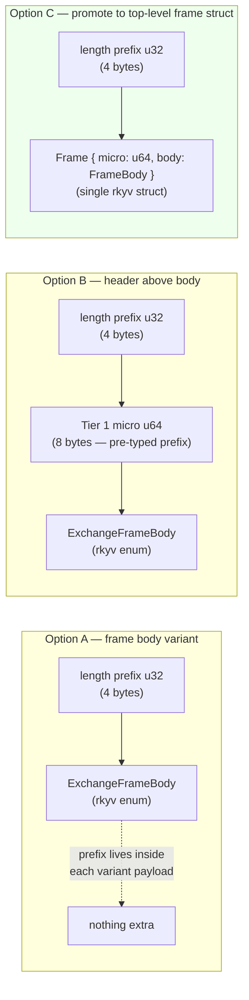
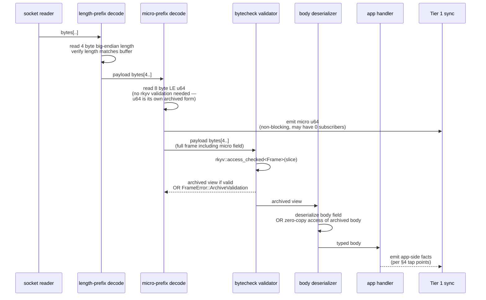
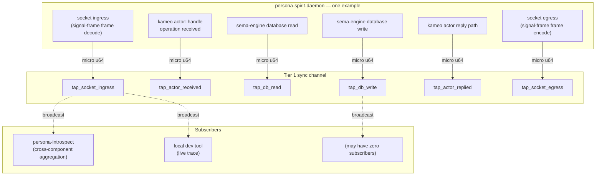
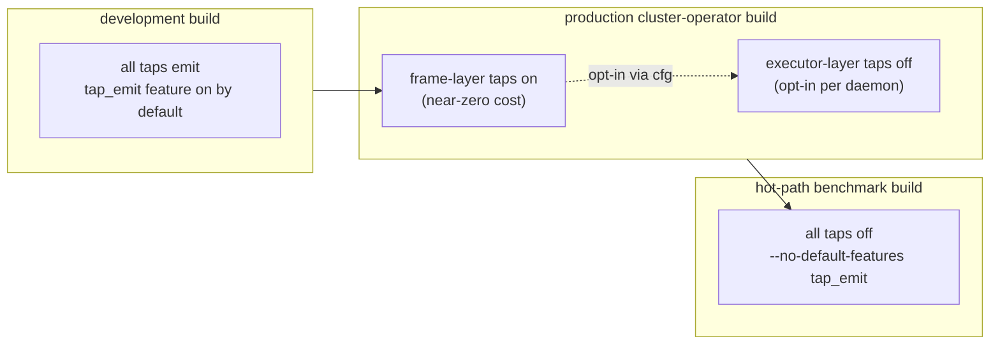
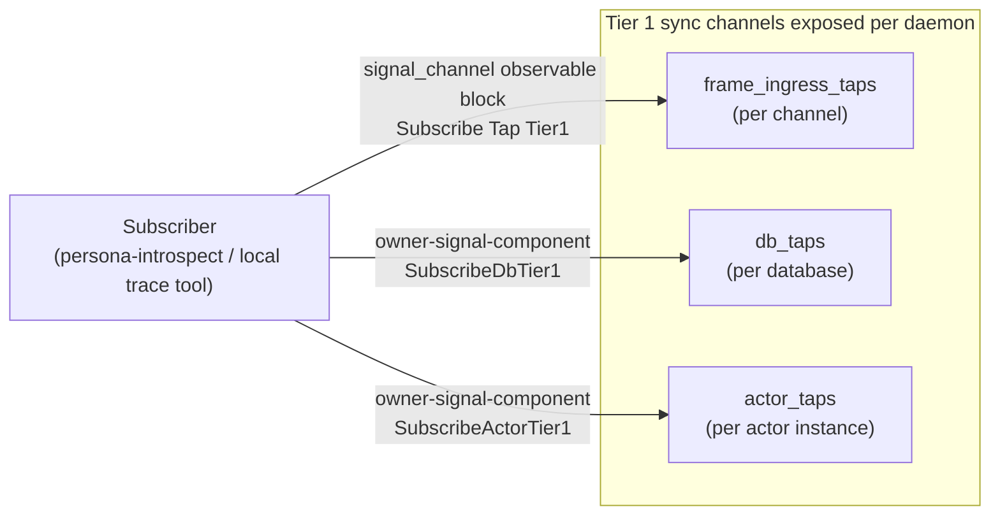
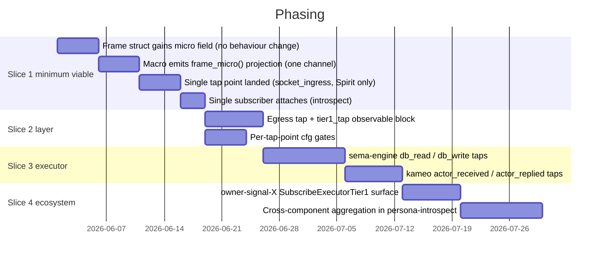

# 308 — Pre-typed message envelope + tap-anywhere observability

*Kind: Design · Topic: 64-bit-prefix-on-every-message + tap-anywhere
sync · 2026-05-23*

*Slice D2 of the prime designer's three-way parallel dispatch on
spirit records 327-330+. Sibling slices: D1 (golden-ratio split,
report /307), D3 (agent component abstraction). This report is
strictly scoped to (a) the 64-bit Tier 1 micro prefix that lands on
every message, and (b) the tap-anywhere sync emission discipline
that the prefix unlocks. Per-component byte-0 namespacing lives in
/305-v2; this report layers on top of that.*

## §1 The two psyche moves in one paragraph

Spirit record 328 (verbatim summary): *every message gets prefixed
with the 64-bit Tier 1 micro type marker. Receivers know type +
size + structure of the root object from the prefix alone. rkyv
zero-copy compat (read directly from memory after network-
fingerprint check). The prefix-of-every-message pattern doubles as
observation channel.* Two consequences fall out:

1. **Wire shape.** The envelope grows an explicit, fixed 8-byte
   prefix slot in front of the rkyv body. Decoders see the prefix
   before bytechecking the body — they know what they're about to
   parse before they parse it.
2. **Tap-anywhere observability.** Because every message already
   carries a cheap 64-bit summary, every socket boundary, every
   database read/write, and every actor reply path can emit that
   8-byte fact into a sync channel without paying a projection
   cost. The sync may or may not have a subscriber; emission is
   non-blocking. Build-time cfg toggles disable taps in
   latency-critical builds.

The two moves are tightly coupled: pre-typing the envelope IS what
makes tap-anywhere cheap. Without the prefix, every tap point would
have to project the body into a Tier 1 fact on demand. With the
prefix, the fact is already on the wire — you just hand the 8 bytes
to the sync.

## §2 Where the prefix lives — frame body or separate header?



**Recommendation: Option C.** Promote `ExchangeFrame` and
`StreamingFrame` from "newtype wrapper around body" to "struct with
two fields: `micro: u64` then `body: FrameBody`". rkyv's `Archive`
derive lays out struct fields in declaration order, and `u64` is its
own archived form (no relative pointer, fixed 8-byte alignment).
The archived `Frame` projects as `{ micro_be_u64 @ offset 0, body @
offset 8 }` — the receiver reads the first 8 bytes as a `u64`
without touching the rkyv validator, then validates the body slice
starting at byte 8. Same length-prefix machinery; the body field
carries everything `ExchangeFrameBody` carries today.

Why not Option B (header-above-body, manual layout): it would
bifurcate the wire format (rkyv body + non-rkyv header), require
hand-written serialization for the header byte, and lose the
single-rkyv-archive property that bytecheck currently spans.

Why not Option A (prefix per variant): every variant payload would
carry its own micro field. Handshake frames don't have a meaningful
contract-local Tier 1 micro (they're frame-kernel facts), but the
receiver still wants to know "this is a handshake" from the prefix.
Pushing the prefix to a top-level field gives handshake frames a
small reserved namespace at byte 0 (`FrameKind::HandshakeRequest`,
`FrameKind::HandshakeReply`) cleanly.

The chosen shape:

```rust
#[derive(Archive, RkyvSerialize, RkyvDeserialize, /* ... */)]
pub struct ExchangeFrame<RequestPayload, ReplyPayload> {
    pub micro: u64,                                          // Tier 1 prefix
    pub body: ExchangeFrameBody<RequestPayload, ReplyPayload>,
}
```

`StreamingFrame` gains the same field shape. The single 8-byte
prefix appears once per frame — not once per payload inside a
multi-payload `Request<Payload>`. The micro encodes the dominant
operation root for the frame (request frame: byte 0 = root verb of
the first payload; reply frame: byte 0 = the
`AcceptedOutcome`/`Rejected` discriminant; event frame: byte 0 =
event root verb).

## §3 Receiver decoding sequence



The critical property: **the receiver knows what to do with the
frame after reading 12 bytes** (4 length prefix + 8 micro prefix).
A frame whose micro byte 0 names a verb the receiver doesn't
recognize can be rejected before bytechecking the body. A frame
whose micro byte 0 is a handshake variant can route to the
handshake handler before the body is even validated.

**Zero-copy nuance.** rkyv 0.8's `access_checked` (formerly
`from_bytes`) validates the whole archive in one pass. The prefix
isn't read "before" rkyv in the safety sense — bytecheck still has
to walk the full slice. What "read prefix first" means is:

- The first 8 bytes are also a valid `u64` (because `u64`'s
  archived form IS `u64`), so reading them with
  `u64::from_le_bytes(&slice[0..8])` is sound *as long as the
  slice length is at least 8*.
- The 8-byte read is enough to route, log, and make decode-or-skip
  decisions; the full bytecheck happens only if the body needs to
  be touched.
- For the "high-traffic broadcaster" case (a daemon emitting many
  events that few subscribers fully decode), this is a real
  optimisation: every subscriber sees the prefix; only subscribers
  that need the full body pay the bytecheck cost.

## §4 Tap-anywhere emission points



Six tap points per daemon, each emitting an 8-byte Tier 1 micro.
The six fall into two natural sources:

| Source | Tap points | What the micro carries |
|---|---|---|
| signal-frame layer | `socket_ingress`, `socket_egress` | Frame's `micro` field directly — the byte 0 verb the frame just decoded / is about to encode. |
| executor layer (sema-engine + kameo) | `db_read`, `db_write`, `actor_received`, `actor_replied` | A LogVariant projection of the in-flight value — for reads, the `Operation` verb; for writes, the `Effect` discriminator; for kameo, the message-type's LogVariant. |

The frame-layer taps cost ~nothing (the value is already on the
stack as a `u64`). The executor-layer taps pay one `LogVariant`
projection per event (a const fold for autogen'd impls — usually
free in release builds). All six taps emit into per-tap-point sync
channels that subscribers attach to.

**Why these six.** Together they form the full life of a request:
ingress → actor handoff → database touches → reply → egress. An
observer subscribing to all six on one daemon sees the
end-to-end story at Tier 1 fidelity; subscribing across daemons
gives the workspace-wide story.

## §5 Build-time disable — per tap point or all-or-nothing?



**Recommendation: per-tap-point gating, layered cfg flags.**
signal-frame exposes one feature `tap_emit_frame` (default-on)
covering ingress + egress. signal-executor exposes
`tap_emit_executor` (default-on) covering db_read + db_write +
actor_received + actor_replied. A daemon Cargo.toml can disable
either independently. The umbrella `default = ["tap_emit_frame",
"tap_emit_executor"]` keeps dev-time observability on by default.

**Cost in numbers.** Frame-layer tap: one atomic load (subscriber
count) + branch + bounded-channel send if non-zero. With zero
subscribers: ~5ns. With one subscriber on a bounded mpsc:
~50-100ns. With the cfg flag off: zero (the compiler elides the
call entirely).

The trade-off the psyche named — "development observability vs
production latency" — gets two knobs, not one:

| Build | tap_emit_frame | tap_emit_executor | Effect |
|---|---|---|---|
| `cargo build` | on | on | full tap-anywhere; trace tools work |
| daemon production preset | on | off | frame-layer trace only; executor hot paths uncosted |
| `cargo bench --no-default-features` | off | off | zero tap cost; representative perf measurement |

Per-tap-point cfg is what lets the cluster operator dial executor
taps off without losing the frame-layer view.

## §6 Subscriber side — how do you attach?



The existing `observable` block in `signal_channel!` already
declares the channel-level observation surface (the macro emits
`Tap(<FilterType>)` / `Untap(token)` per /246-v4). This report
proposes **extending that block with explicit tier subscriptions**
rather than overloading the single `Tap` verb:

```rust
signal_channel! {
    operation Operation { /* ... */ }
    reply Reply { /* ... */ }

    observable {
        filter default;

        // Existing surface — Tier 3 subscription (full record).
        // The Tap/Untap verb pair the macro already injects.

        // New surface — Tier 1 subscription (micro prefix only).
        // Filterable per-root-verb (byte 0 mask).
        tier1_tap {
            kind: socket_ingress | socket_egress;
            filter: RootVerbMask;
        };

        // New surface — Tier 2 subscription (when LogSummary impl
        // exists). Per primary-bg9l.
        tier2_tap {
            kind: socket_ingress | socket_egress;
        };
    }
}
```

For executor-layer taps (db_read, db_write, actor_*), the
subscription surface lives on **owner-signal-<component>** because
the executor is a daemon-private concern that owners (not ordinary
clients) configure. The owner contract gets
`SubscribeExecutorTier1(ExecutorTapFilter)` per /305-v2's
owner/ordinary split.

**Cross-channel aggregation question — psyche-named.**
Subscribing to "all database writes workspace-wide" requires
attaching to each daemon's owner-signal-X executor tap stream
separately. There's no workspace-shared cross-channel tap — the
daemons own their tap channels, persona-introspect (a designated
collector) federates by subscribing to many. This is consistent
with the per-component-namespace correction in /305-v2 (no global
verb registry → no global tap aggregation; aggregation is a
collector concern).

## §7 rkyv zero-copy implications — confirmed sound

The `Frame { micro: u64, body: FrameBody }` shape works because:

1. **`u64` archived form.** `<u64 as Archive>::Archived = u64`. No
   relative pointer, no padding, no header. The archived `u64`
   IS a `u64` in little-endian (rkyv default endian).
2. **Struct field order preservation.** `derive(Archive)` on a
   struct lays out archived fields in source-declaration order
   with C-like alignment. `Frame`'s archived form is
   `#[repr(C)] struct ArchivedFrame { micro: u64, body: ArchivedFrameBody }`.
   Offset of `micro` is 0; offset of `body` is 8 (u64 alignment
   subsumes any internal body alignment up to 8).
3. **Zero-copy read.** Given a validated slice `bytes` of an
   `ArchivedFrame`, reading the micro is `u64::from_le_bytes(
   bytes[0..8].try_into()?)`. No allocation, no pointer chase.
4. **bytecheck still covers the prefix.** rkyv's bytecheck walks
   the full archive. The `micro: u64` field is bytechecked as part
   of the frame; corrupt-frame attacks can't insert a fake prefix
   without invalidating the rkyv archive as a whole.

**Caveat — alignment at read time.** The `bytes[0..8]` slice must
be 8-byte-aligned for `u64::from_le_bytes(...try_into())` to be
non-panic. The existing frame decode goes through `AlignedVec`
which gives 16-byte alignment, so this holds. A read directly from
an mmap'd file would need to confirm alignment first; for the
socket-receive path it's already satisfied.

**Caveat — endianness.** rkyv archives `u64` as little-endian by
default. The 4-byte length prefix at the front of the wire is
big-endian (per existing FrameError code). These are two different
byte-order conventions inside one frame envelope — the length
prefix is non-rkyv legacy wire protocol; the micro is rkyv-archived
little-endian. Documenting the split is cheap; mixing them is a
trap. Recommended ARCH §5 note: "length prefix is big-endian u32;
all archived integers including the micro field are little-endian
per rkyv default."

## §8 Implementation phasing — minimum viable first slice

Psyche-named timeline: *"eventually, right in implementation, it
doesn't have to be tomorrow."* What lands in the smallest first
slice?



**Slice 1 (minimum viable) — three properties land:**

1. Every frame on the wire carries an 8-byte prefix.
2. One tap point emits (socket_ingress on `signal-persona-spirit`).
3. One subscriber attaches (persona-introspect) and proves
   end-to-end the Tier 1 stream flows.

Properties NOT in Slice 1:

- Build-time cfg gates (default-on emit; perf measurement comes
  later)
- Multi-tap-point coverage (one is enough to prove the shape)
- Cross-channel aggregation (one channel + one subscriber)
- Tier 2 / Tier 3 multi-tier subscription per channel (already a
  separate bead — primary-b86d)

Slice 1's load-bearing test: a `cargo run` of spirit-daemon and
persona-introspect on one machine shows each spirit record
operation's Tier 1 micro arriving at introspect within ~10ms of the
operation hitting the spirit socket.

**Slice 2 onwards** layers tap-point coverage, perf gating, and
cross-component aggregation onto a known-working substrate.

## §9 The discipline implication — pre-typed = self-describing

Today's frame says "trust me, the bytes after the length prefix are
a valid `ExchangeFrameBody`". The pre-typed envelope says "the
first 8 bytes after the length prefix tell you what kind of body
follows; the rest of the bytes are that body." This is a small
shift in wire shape and a large shift in receiver discipline:

| Today | With pre-typed envelope |
|---|---|
| Receiver decodes whole frame to learn what it is | Receiver reads 8 bytes to learn what it is |
| Tap points must project the body to log | Tap points already have the projection |
| Frame routing happens after full decode | Frame routing happens after 12-byte read |
| Subscriber pays bytecheck cost per event | Subscriber pays bytecheck only if needed |
| Per-frame observation cost ~kB-scale | Per-frame observation cost 8B |

The discipline ROI is highest on broadcasters with many cheap
subscribers (the introspect collector, dev trace tools, dashboards)
and lowest on single-consumer point-to-point (a CLI ↔ daemon
request/reply pair). The frame envelope change is universal; the
tap-anywhere benefit accrues to the broadcaster end.

## §10 Open questions for psyche

- **Micro for handshake frames.** Handshake frames don't have a
  contract-local Tier 1 micro — they're frame-kernel facts. Propose
  a small reserved byte-0 namespace (`FrameKindMicro::HandshakeRequest
  = 0xFE`, `FrameKindMicro::HandshakeReply = 0xFF`) at the frame
  layer so the receiver routes handshake before bytecheck. Confirm?
- **Multi-payload Request micro choice.** A `Request<Payload>` may
  carry multiple operations (`NonEmpty<Payload>`). The frame micro
  carries ONE byte-0 root verb. Recommendation: the first payload's
  root verb (most common case is length-1; multi-op requests are
  already by-convention same-verb). Alternative: a reserved
  "multi-op" verb in byte 0 with byte 1 encoding the count.
  Which?
- **Owner-signal vs ordinary-signal tap surfaces.** §6 places the
  executor-layer tap subscription on `owner-signal-<component>`.
  Frame-layer tap subscription stays on ordinary `signal-<component>`
  (via the `observable` block). Is this owner/ordinary split right,
  or should ALL Tier 1 tap subscriptions be owner-only?
- **Tap fallthrough policy.** If a tap channel's bounded mpsc is
  full (slow subscriber), the producer must not block. Options:
  drop-newest (preserve history), drop-oldest (preserve recency),
  overflow-counter (record N drops, deliver next event). Per
  push-not-pull discipline, drop-oldest is the canonical choice;
  confirm before the executor work lands.
- **rkyv version pin.** This design uses rkyv 0.8 semantics
  (`access_checked`, `Archived = u64`). Workspace pin already
  matches; flag if a future rkyv upgrade breaks the
  `<u64 as Archive>::Archived = u64` assumption.

## §11 Bead proposals — sized for parallel pickup

Eight beads, each scoped for one operator session. Numbering left to
the orchestrator's filing pass.

| Bead title | Repo / target | Priority | Depends on |
|---|---|---|---|
| signal-frame: `Frame { micro: u64, body: FrameBody }` field reshape | signal-frame | P1 | — |
| signal-frame: handshake-frame reserved micro range (0xFE/0xFF byte 0) | signal-frame | P1 | reshape above |
| signal-frame-macros: macro emits `frame_micro()` projection from per-channel `LogVariant` | signal-frame-macros | P1 | primary-l02o (LogVariant autogen) |
| signal-frame: `observable` block gains `tier1_tap` declaration | signal-frame-macros | P2 | macro micro projection |
| signal-frame: socket_ingress + socket_egress tap points (frame layer) with `tap_emit_frame` cfg | signal-frame | P2 | macro micro projection |
| sema-engine: `db_read` + `db_write` tap points with `tap_emit_executor` cfg | sema-engine | P2 | frame-layer taps |
| kameo bridge: actor_received + actor_replied tap points with `tap_emit_executor` cfg | signal-executor | P2 | sema-engine taps |
| persona-introspect: cross-daemon Tier 1 collector + storage tier (~134M events/GB) | persona-introspect | P3 | all tap points |

**Slice 1 minimum-viable subset (bold for orchestrator's parallel
dispatch):**

- **Frame reshape** — single contract crate edit; rkyv round-trip
  test updates; affects every consumer trivially (new field
  default-zeroed).
- **Macro `frame_micro()` projection** — operator picks one channel
  (signal-persona-spirit) and lands the autogen.
- **Socket ingress tap (one tap point, spirit only)** — proves the
  end-to-end Tier 1 stream.
- **persona-introspect subscriber attaches** — proves a subscriber
  receives the stream.

Four beads, parallel-friendly, each ~half-day operator session.
Together they manifest spirit record 328's "every message prefixed"
and "tap-anywhere observation" claims at the smallest credible
slice.

## §12 What this report does NOT cover

- The golden-ratio byte-0 namespace split between owner and
  ordinary contracts (D1's slice — /307).
- The new `agent` component abstraction sitting between router and
  harness backends (D3's slice).
- Tier 2 (`LogSummary`) subscription mechanics (primary-bg9l +
  primary-b86d already cover this).
- Tier 3 (full-record) subscription, which is the existing
  `observable` block behaviour.
- Workspace-wide rename / refactor passes from sibling reports.
- `persona-introspect` storage design (left to operator at impl time
  per the cost/tier table in signal-frame ARCH §5.8).

## See also

- `/305-v2-design-64bit-signal-per-component-namespacing.md` —
  per-component namespacing model that this report layers on top of
- `signal-frame/ARCHITECTURE.md §5` — three-tier signal sizing
  (Tier 1 = the 8-byte prefix this report wires into every frame)
- `signal-frame/ARCHITECTURE.md §5.7` — three subscription tiers
  in the `observable` block (this report extends to per-tier-per-tap
  subscriptions)
- `signal-frame/src/frame.rs` — `ExchangeFrame` / `StreamingFrame`
  current shape (reshaped by the first bead above)
- `signal-frame/src/observable.rs` — `ObservableSet` /
  `ObservationProjection` traits (extended by `tier1_tap`)
- Spirit records 244, 251, 271-273, 314-318, 323, 326-328
- Beads `primary-l02o`, `primary-bg9l`, `primary-b86d`,
  `primary-k8cn`
- `reports/second-designer/159-intent-manifestation/1-signal-verb-namespace-arch.md`
  — the manifestation that landed signal-frame ARCH §5
