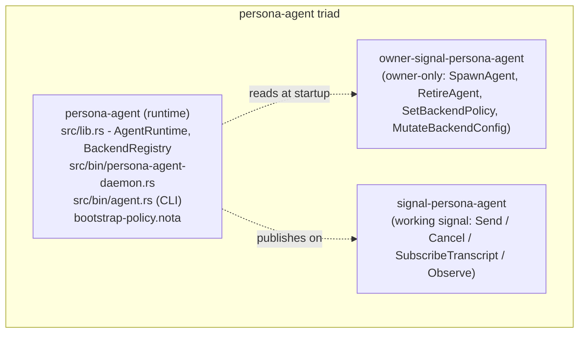
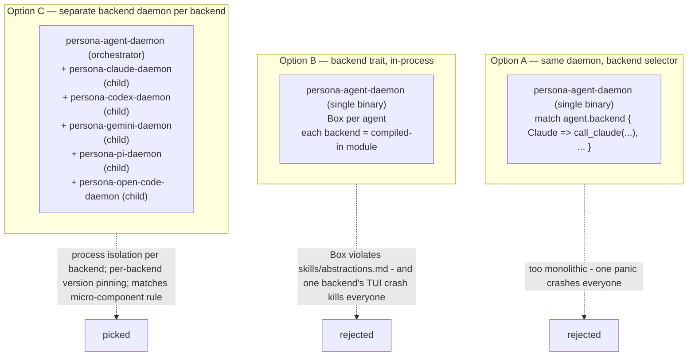
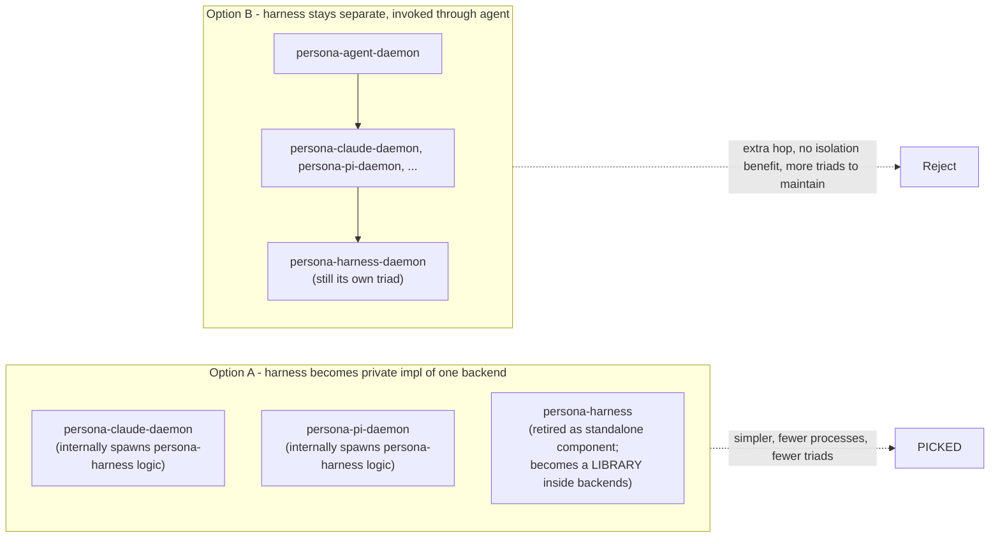
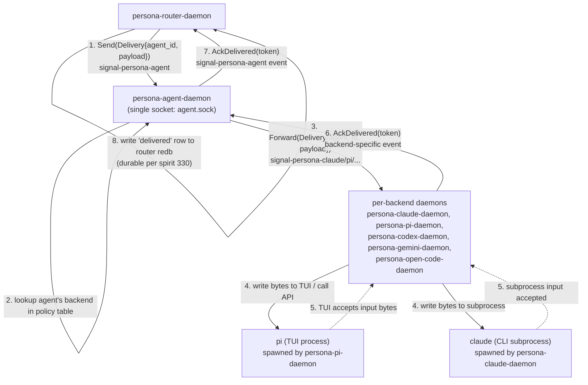
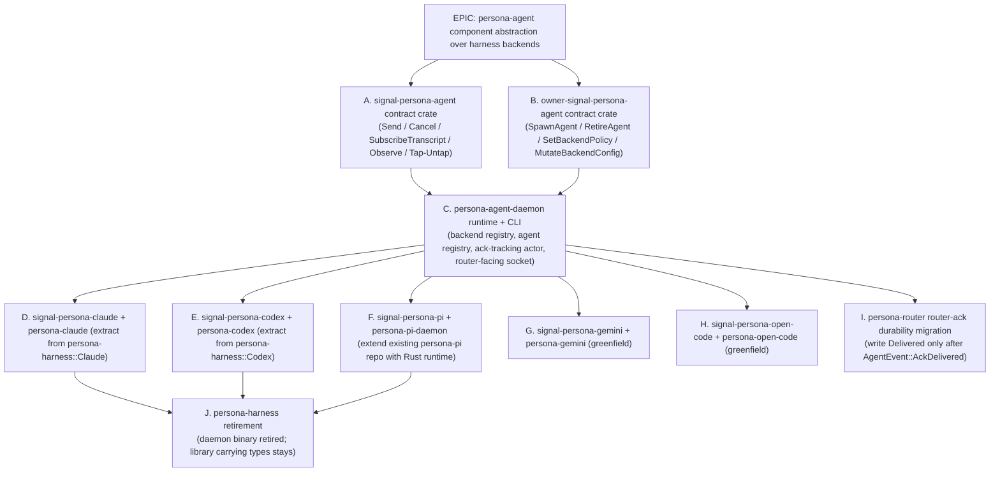
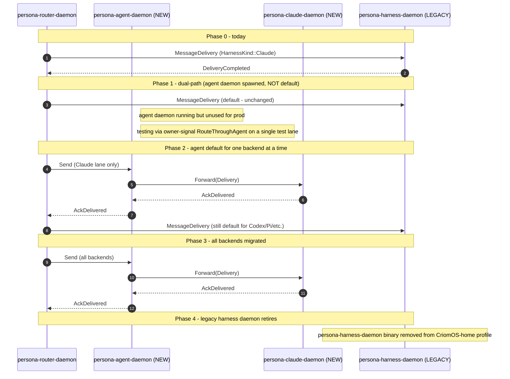

# 309 — Agent component abstraction (persona-agent triad over harness backends)

**Status:** triad shape absorbed into `primary-gvgj` epic (10 sub-beads tracked). Rename open question — `/318` recommends dropping the `persona-` prefix to `agent` / `signal-agent` / `owner-signal-agent` per spirit 371; this report's §1 KEEP-prefix framing is superseded once psyche ratifies.

*Kind: Design · Topic: persona-agent · 2026-05-23 · Parallel slice
D3 of three (D1: golden-ratio split; D2: pre-typed envelope).*

*Per spirit records 329 + 330 (psyche 2026-05-23): persona-claude,
persona-codex, persona-gemini, persona-pi, persona-open-code are
all BACKENDS for a higher-level Agent abstraction. Router talks to
agent (not to specific harnesses). Harness is implementation detail
of how an agent backend runs. Router declares message-delivered as
durable fact upon receiving acknowledgement from the harness channel
(one per agent).*

## §1 Names settled before anything else

A naming reading on the new abstraction, applying the four naming
rules from `skills/component-triad.md` §"Component binary naming"
and the persona-prefix convention:

| Surface | Name | Why |
|---|---|---|
| Component (role) | **persona-agent** | `persona-` prefix because it wraps multiple agent-runtime backends into the persona system (same shape as `persona-pi`, `persona-claude`). The role IS "the agent abstraction inside persona"; the bare `agent` is reserved for the unprefixed top-level when persona drops its prefix (spirit 310). |
| Repo (runtime) | `persona-agent` | Standard. |
| Repo (working signal) | `signal-persona-agent` | Standard. |
| Repo (owner signal) | `owner-signal-persona-agent` | Standard; rename pass to `meta-signal` deferred (spirit 290+299). |
| CLI binary | `agent` | Short role-name. Humans type `agent '(Send …)'`. |
| Daemon binary | `persona-agent-daemon` | Repo-prefixed for process-listing disambiguation. |
| HarnessKind variant | (deprecated) | The `HarnessKind` enum in `signal-persona-harness` becomes IMPLEMENTATION DETAIL of one backend (the local-harness backend); the agent contract names backends with its own enum (`AgentBackend`). |
| Backend names | `Claude`, `Codex`, `Gemini`, `Pi`, `OpenCode` | Closed enum in `signal-persona-agent`. Adding a backend is a contract PR. |

The unprefixed `agent` cli name is fine because `persona-agent` is
the only "agent" component in the persona stack — there is no other
`agent` competing for the CLI binary name. (If persona-llm-client
ever ships as the unprefixed `agent` per spirit 310, that becomes
the LLM-call abstraction, distinct from this `persona-agent` which is
the runtime-agent abstraction. Two different surfaces; names settle
when the rename pass lands.)

## §2 What changes — one paragraph

Today the workspace has `persona-harness` as a generic harness daemon
with `HarnessKind ∈ { Codex, Claude, Pi, Fixture }` chosen at startup
via `HarnessDaemonConfiguration::harness_kind`, plus `persona-pi` as a
nix-packaged Pi profile (no triad). Router talks directly to
harness via `signal-persona-harness::MessageDelivery`. After this
design: **`persona-agent` becomes the front door for the router**;
backends (Claude / Codex / Gemini / Pi / OpenCode) are separate
backend daemons owned by `persona-agent-daemon` as long-lived
children; `persona-harness` becomes the **local-harness backend's
internal implementation** of a TUI-driven agent. The router stops
caring which model or which TUI runs underneath.

## §3 The persona-agent triad shape

Five invariants from `skills/component-triad.md` apply unchanged. New
shape-level decisions:

- **Working signal** (`signal-persona-agent`) carries the
  router-facing channel: `Send(MessageDelivery)`,
  `Cancel(DeliveryToken)`, `SubscribeTranscript(AgentIdentifier)`,
  `Observe(…)`. These are peer-callable: any authorised peer (router,
  introspect) can call them.
- **Owner signal** (`owner-signal-persona-agent`) carries the
  authority/policy verbs: orchestrate orders the agent daemon to
  spawn a new agent run, retire one, change backend selection
  policy, push backend config (model, thinking level, extension
  set). Mind decides; orchestrate orders; agent daemon obeys.
- **Policy state** lives in the agent daemon's redb (`persona-agent.redb`)
  via sema-engine: backend registry (which backends are enabled),
  default-backend-per-lane policy, per-agent backend assignment,
  spawn-envelope template per backend.
- **Working state** lives in the same redb: active agent runs,
  message deliveries in flight, ack-bookkeeping for the router-ack
  durability rule (§5), subscription handles, lifecycle transitions.
- **Bootstrap-policy.nota** seeds the backend registry on first
  start: declares which backends ship (`Claude`, `Codex`, `Gemini`,
  `Pi`, `OpenCode`), each backend's spawn-envelope template, the
  default backend, and per-lane default-backend overrides.

The agent daemon is the **only consumer of backend daemons**; no
other component opens a `persona-claude-daemon` socket directly. The
router never sees `persona-claude-daemon` or `persona-pi-daemon` —
those become implementation details behind the agent abstraction.

## §4 Agent backend mechanism

Three options were considered for how backends plug in:

**Picked: Option C — one backend = one separate daemon process.**

Justification:

1. **Process isolation.** Pi's interactive TUI extension panicking
   must not kill Claude's HTTP-API path. Separate processes;
   crashes are isolated; orchestrate restarts the affected backend
   only.
2. **Per-backend version pinning.** Claude's CLI version, Codex's
   Rust ABI, Pi's Node.js runtime — each pins independently through
   Nix. Single-binary builds would force lock-step upgrades.
3. **Micro-components rule** (`skills/micro-components.md`). One
   capability per crate per repo. Each backend IS a separate
   capability (talking to a different upstream runtime).
4. **Lane discipline.** Each backend repo has its own AGENTS.md,
   skills, beads. Cluster-operator can pick up a Pi-backend change
   without touching Claude work.

**Backend daemon names** follow the persona-wrapping convention
(`skills/component-triad.md` §"Persona harness wrapping"):

| Backend | Repo | Daemon binary | CLI binary | Status |
|---|---|---|---|---|
| Claude | `persona-claude` | `persona-claude-daemon` | `claude` | NEW (extract from `persona-harness` `HarnessKind::Claude` arm) |
| Codex | `persona-codex` | `persona-codex-daemon` | `codex` | NEW (extract from `persona-harness` `HarnessKind::Codex` arm) |
| Gemini | `persona-gemini` | `persona-gemini-daemon` | `gemini` | NEW |
| Pi | `persona-pi` | `persona-pi-daemon` | `pi` | EXTEND (today a nix profile; promote to triad per spirit 304/305 — `persona-pi` repo already exists with Nix packaging; add the daemon + signal contracts) |
| OpenCode | `persona-open-code` | `persona-open-code-daemon` | `open-code` | NEW |

Each backend daemon is itself a component triad
(`signal-persona-claude` etc.). The agent daemon is a **Signal client
of each backend daemon**, matching the carve-out 3 from
`skills/component-triad.md` ("A daemon may be a Signal client of any
number of peer daemons").

Backend selection at agent-spawn time is owner-signal driven:
orchestrate's `SpawnAgent` envelope names the backend (`Claude`,
`Pi`, …). The agent daemon picks the right backend daemon's socket
from its policy table and forwards the agent's deliveries there.

## §5 Where does harness live after this?

Psyche raised the question: *"we could potentially also even abstract
away the harness behind the agent component."* Two options the prime
designer scoped:

**Picked: Option A — harness becomes a Rust LIBRARY consumed by
backend daemons; the standalone `persona-harness-daemon` retires.**

Rationale:

1. **No new isolation gained.** Harness state is per-agent-run; a
   harness crash already wants the agent run gone. The
   process-boundary between backend daemon and harness daemon adds
   one extra socket hop and a separate failure surface for the same
   per-agent-run lifetime.
2. **Triad maintenance overhead.** Keeping persona-harness as its
   own triad means three repos (runtime + working signal + owner
   signal) with their own ARCHITECTURE.md and constraint-test set,
   for a component that has exactly one consumer (the backend
   daemon).
3. **Backend daemons already differ on harness shape.** Pi's "harness"
   is a node.js extension-loading TUI process; Claude's is a
   subprocess-spawn of `claude` CLI; Codex's is an HTTP API client.
   These don't share enough shape to warrant a unified
   `persona-harness-daemon` contract — each backend's "harness" is
   already custom. The shared library (extracted from today's
   `persona-harness`) gives them transcript-event shape, lifecycle
   FSM, and adapter contracts as TYPES — not as a daemon.

Concrete migration:

- `persona-harness` repo **becomes a library** (`persona-harness-lib`
  or keep the name without the daemon binary). Keep the runtime
  types: `HarnessLifecycle`, `TranscriptEvent`, adapter contracts.
- The standalone `persona-harness-daemon` binary retires after all
  backend daemons consume the library directly.
- `signal-persona-harness` retires as a wire contract; its types
  either move into `signal-persona-agent` (the new front door) or
  into per-backend signal crates (`signal-persona-claude` etc.) for
  backend-internal command types.

**`HarnessKind` retires.** Backends are named in `signal-persona-agent`
as `AgentBackend ∈ { Claude, Codex, Gemini, Pi, OpenCode }`. The
`HarnessKind::Fixture` variant becomes
`AgentBackend::Fixture` for in-test agents that complete delivery
without spawning a real backend.

## §6 Router-to-agent channel shape

Today: `signal-persona-router` → `signal-persona-harness::MessageDelivery`
(router talks directly to a harness daemon over the harness socket).

After: router talks to agent daemon only. Single channel, multiplexed
by agent-id (one agent socket; the agent daemon dispatches internally
to backend daemons by per-agent backend selection).

### §6.1 The router-ack durability rule (spirit 330)

Per spirit record 330: *"router declares message-delivered as durable
fact upon receiving acknowledgement from the harness channel — one
ack per agent."*

The ack travels four hops: **harness → backend daemon → agent daemon
→ router**. Each hop is a typed contract operation, not an opaque
chain:

| Hop | Channel | Operation |
|---|---|---|
| 1 (harness → backend daemon) | private library callback (harness is impl-detail per §5) | `HarnessAdapter::on_input_accepted(token)` |
| 2 (backend daemon → agent daemon) | `signal-persona-claude` (or per-backend) | `BackendEvent::DeliveryAccepted { token }` |
| 3 (agent daemon → router) | `signal-persona-agent` | `AgentEvent::AckDelivered { delivery_token, agent_id }` |
| 4 (router → durable row) | router's own redb (`messages` table) | `RouterDeliveryStatus::Delivered` transition |

The router holds the message in `RouterDeliveryStatus::Routed` state
between hop 1 and hop 4. **Only on hop 4 does the router write the
delivery as a durable fact.** Hop 4 is the durability boundary —
matches spirit 330's "declares durable upon ack."

**Partial-failure semantics** (per `skills/component-triad.md`
§"Partial-failure semantics — commit-first-success-and-record-divergence"):
if the ack chain breaks at any hop, the router records divergence
(message marked `Failed` with a typed `FailureReason` naming where
the chain broke). It does not roll back; subscribed mind/introspect
sees the divergence and decides recovery.

### §6.2 Per-agent vs multiplexed channel

**Picked: single agent socket, multiplexed by agent-id.** Per-agent
sockets would create N sockets growing with active-agent count —
filesystem entries multiplying per concurrent agent. The single-
socket multiplexed approach matches every other component in the
workspace (one socket per daemon, channels keyed by typed identifiers
in the payload).

The agent-id (`AgentIdentifier`) is a SignalCore identity type per
spirit 317. Each `Send` carries the target agent id; the agent
daemon's router actor looks up the agent's backend assignment and
forwards to the right backend daemon's socket.

## §7 Existing persona-claude / persona-codex / persona-pi state

| Component | Today | Migration shape |
|---|---|---|
| **persona-harness** | One repo, one daemon, four-variant `HarnessKind` enum (Codex / Claude / Pi / Fixture), one socket. Production drives `HarnessKind::Codex` and `::Claude`. | Becomes a LIBRARY consumed by backend daemons. The daemon binary retires. `HarnessKind` retires (replaced by `AgentBackend` in signal-persona-agent). |
| **persona-claude** | Does NOT exist as a separate repo. The "Claude" path runs through `persona-harness-daemon` with `HarnessKind::Claude`. | NEW repo. Extract the Claude code-path from `persona-harness` runtime. Triad: `persona-claude` + `signal-persona-claude` + `owner-signal-persona-claude`. |
| **persona-codex** | Does NOT exist as a separate repo. The "Codex" path runs through `persona-harness-daemon` with `HarnessKind::Codex`. | NEW repo. Same shape as `persona-claude`. |
| **persona-pi** | EXISTS as repo with `pi-packages/`, `flake.nix`, `checks/`, `nix/`. NO Rust runtime; it's a nix-packaging-only repo today (spirit 304 + 305). | EXTEND. Keep the nix packaging. ADD: `signal-persona-pi`, `owner-signal-persona-pi`, the Rust `persona-pi-daemon` runtime that spawns `pi` as a subprocess (or speaks Pi's headless RPC mode per `reports/designer/281-headless-pi-research.md`). |
| **persona-gemini** | Does NOT exist. | NEW repo. Triad: `persona-gemini` + `signal-persona-gemini` + `owner-signal-persona-gemini`. Backend daemon spawns Gemini's CLI or talks to Gemini's API. |
| **persona-open-code** | Does NOT exist. | NEW repo. Triad: `persona-open-code` + `signal-persona-open-code` + `owner-signal-persona-open-code`. |
| **persona-agent** | Does NOT exist. | NEW repo. Triad: `persona-agent` + `signal-persona-agent` + `owner-signal-persona-agent`. The router-facing front door. |

**Backwards-compat note:** `persona-claude` and `persona-codex` paths
today are load-bearing in production (the workspace's main agent
infrastructure runs Claude through `persona-harness-daemon` with
`HarnessKind::Claude`). The migration sequence (§9) keeps the old
path live until the new path is verified end-to-end.

## §8 Migration path — per-backend sub-beads under one epic

Critical-path discipline:

- **A + B first** (contracts before runtime). signal-persona-agent and
  owner-signal-persona-agent ship first as empty channels with the
  agreed verb set. No code on either side yet.
- **C is the agent runtime skeleton.** Empty backend registry; the
  daemon accepts `Send` and returns `RequestUnimplemented` for every
  backend until D/E/F/G/H land. Skeleton-honest per intent on typed
  unimplemented (matches existing `persona-harness` pattern).
- **D/E/F/G/H run in parallel** as separate operator beads. Each
  backend daemon is independent; nothing in D blocks E.
- **I is gated on C being live.** Router can't migrate to agent-ack
  durability until agent daemon is emitting AckDelivered events.
  Until then router keeps using harness-direct delivery
  (old path).
- **J is the cleanup.** Retire `persona-harness-daemon` only after
  every backend has migrated and the router migration (I) is
  complete. Library types stay; daemon binary goes.

## §9 Backwards-compat / no-downtime strategy

The workspace runs Claude as its prime designer agent. Migration
cannot drop a single keystroke. Sequence:

The owner-signal verb `RouteThroughAgent { lane: LaneName }` (or
`SetDefaultDeliveryPath`) toggles per-lane routing. Phase progression
is owner-controlled; rollback at any phase means re-issuing the
mutate with the legacy path. The router holds both client
connections during the transition.

## §10 Concrete operator beads — bead proposals

Sized for parallel pickup. Each is small enough for one operator
session.

### Bead 1 — `primary-agent-A`: signal-persona-agent contract crate
**P1, NEW, sized: 1 session**
- Greenfield `signal-persona-agent` crate.
- `signal_channel! { channel Agent { request Send/Cancel/SubscribeTranscript/Observe, reply AckDelivered/DeliveryFailed/TranscriptSnapshot/TranscriptDelta/RequestUnimplemented } }` plus mandatory `observable { … }` block per `skills/component-triad.md` §"Mandatory Tap/Untap".
- Types: `AgentIdentifier` (SignalCore Criome-keyed per spirit 317), `AgentBackend ∈ { Claude, Codex, Gemini, Pi, OpenCode, Fixture }`, `DeliveryToken`, `MessageDelivery`, `TranscriptDelta`, etc.
- One round-trip test per type.
- Verb-namespace decisions per `/305-v2`: per-component root-verb enum named locally.
- ARCHITECTURE.md citing this report (309) and `skills/component-triad.md`.

### Bead 2 — `primary-agent-B`: owner-signal-persona-agent contract crate
**P1, NEW, sized: 1 session**
- Greenfield `owner-signal-persona-agent` crate.
- Owner-only verbs: `SpawnAgent { agent_id, backend, lane }`, `RetireAgent { agent_id, reason }`, `SetBackendPolicy { lane, default_backend }`, `MutateBackendConfig { backend, configuration: BackendConfiguration }`, `RouteThroughAgent { lane, enabled }`.
- Same round-trip + ARCH discipline as bead 1.

### Bead 3 — `primary-agent-C`: persona-agent runtime skeleton
**P1, NEW, sized: 2 sessions; depends on beads 1 + 2**
- Greenfield `persona-agent` repo with triad layout (`persona-agent-daemon` + `agent` CLI + `bootstrap-policy.nota`).
- Kameo actor tree: `AgentRuntime` root, `BackendRegistry`, `AgentRegistry`, `AckTrackingActor`, `RouterFacingListener` (ordinary socket), `OwnerListener` (owner socket).
- `bootstrap-policy.nota` declares the closed `AgentBackend` set with spawn-envelope template per backend.
- Daemon answers `signal-persona-agent` requests with `RequestUnimplemented` for every backend (skeleton-honest).
- Five-invariant witness tests per `skills/component-triad.md` §"Witness tests".
- ARCHITECTURE.md.

### Bead 4 — `primary-agent-D-claude`: persona-claude backend extraction
**P2, NEW, sized: 2 sessions; depends on bead 3**
- Greenfield `persona-claude` triad: `persona-claude` + `signal-persona-claude` + `owner-signal-persona-claude`.
- Extract the Claude code-path from current `persona-harness` `HarnessKind::Claude` arm.
- `persona-claude-daemon` is a Signal server for `signal-persona-claude`; backend-private contract.
- The agent daemon (bead 3) gets a backend-registry entry: backend Claude maps to `/run/persona-claude/claude.sock` (or whatever socket path the bootstrap-policy declares).
- Witness test: agent daemon receives `Send(_, Claude)`, forwards to claude backend, receives ack, forwards to caller.

### Bead 5 — `primary-agent-E-codex`: persona-codex backend extraction
**P2, NEW, sized: 2 sessions; depends on bead 3, parallel with bead 4**
- Same shape as bead 4, for Codex.

### Bead 6 — `primary-agent-F-pi`: persona-pi triad promotion
**P2, EXTEND, sized: 3 sessions; depends on bead 3, parallel with 4/5**
- Existing `persona-pi` repo gets Rust runtime added alongside the nix packaging.
- New: `signal-persona-pi`, `owner-signal-persona-pi`, `persona-pi-daemon` (uses Pi's headless RPC mode per `/281`).
- Keeps existing `pi-packages/` and `flake.nix` untouched (those are the Nix packaging for the `pi` CLI itself; the daemon SPAWNS that CLI).
- bead `primary-u7gc` (existing persona-pi v2 bead, blocked per `reports/cluster-operator/7`) folds into this. Carry the v1 extension set forward.

### Bead 7 — `primary-agent-G-gemini`: persona-gemini greenfield
**P3, NEW, sized: 2 sessions; depends on bead 3, parallel with 4/5/6**

### Bead 8 — `primary-agent-H-open-code`: persona-open-code greenfield
**P3, NEW, sized: 2 sessions; depends on bead 3, parallel with 4/5/6/7**

### Bead 9 — `primary-agent-I-router-migration`: router-ack durability migration
**P2, EXTEND, sized: 2 sessions; depends on bead 3 being live (not 4-8)**
- `persona-router-daemon` learns to send `Send` via `signal-persona-agent` instead of `MessageDelivery` via `signal-persona-harness` per lane (gated by router-owned policy).
- New router state-transition: `Routed` → wait for `AgentEvent::AckDelivered` → `Delivered`. Router writes `Delivered` row only on hop 4 of §6.1.
- Owner-signal verb `RouteThroughAgent` toggles per-lane.
- Witness test: router writes `Delivered` only after `AckDelivered` from agent daemon; never before.

### Bead 10 — `primary-agent-J-retire-harness-daemon`: persona-harness-daemon retirement
**P3, CLEANUP, sized: 1 session; depends on ALL of 4-9 landing AND router fully migrated**
- Remove the `persona-harness-daemon` binary from CriomOS-home profile.
- `persona-harness` repo's `src/main.rs` retires. Keep `lib.rs` with `HarnessLifecycle`, `TranscriptEvent`, adapter contracts as a shared library consumed by backend daemons.
- Update workspace ARCH-files: `persona-harness` no longer a triad; documented as library-only.

### Total
**10 beads, 1 epic.** ~18 operator-sessions of work, parallelizable
to ~6 wall-clock sessions for a multi-operator week.

## §11 Open questions for psyche

Each waits on psyche direction. Not blocking bead-filing; each shapes
follow-up beads.

- **Q1 — Backend daemon names.** Confirmed `persona-claude`,
  `persona-codex`, `persona-gemini`, `persona-pi`, `persona-open-code`?
  The CLI names `claude`, `codex`, `gemini`, `pi`, `open-code` will
  collide with the upstream CLIs the workspace already has installed
  (the actual `claude` binary from Anthropic, the actual `codex` from
  OpenAI, etc.). Two paths: (a) accept the collision — the workspace
  CLIs shadow the upstream ones via PATH ordering, and users invoke
  upstream via full path; (b) prefix workspace CLIs:
  `persona-claude`, `persona-codex`, etc. — clunkier but no shadowing.
  Designer lean: (b) for clarity (humans typing `pi` get the
  workspace daemon CLI, not the upstream — and there is no upstream
  `pi` CLI today, so `pi` IS the workspace name from the start;
  upstream `claude`/`codex` keep their canonical names).
- **Q2 — `persona-harness` as library vs full retirement.** Picked
  Option A (library) in §5. Alternative: types move into per-backend
  signal crates, persona-harness retires fully (no library either).
  Trade-off: library reuse vs DRY across backends. Designer lean:
  library — five backends sharing transcript-event shape and
  lifecycle FSM is a real DRY win.
- **Q3 — Backend daemon spawn ownership.** Who spawns the backend
  daemons? Two options: (a) orchestrate spawns persona-agent-daemon
  AND each backend daemon as independent supervised children
  (matches `skills/component-triad.md` §"Authority chain"); (b)
  persona-agent-daemon spawns its own backend daemon children
  internally (agent-daemon becomes a mini-orchestrator for its
  backends). Designer lean: (a) — keeps orchestrate as the
  workspace's universal supervisor; the agent daemon is then just a
  Signal client of its backend daemons, not their parent process.
- **Q4 — Per-agent vs per-message backend selection.** Backend is
  fixed at agent-spawn time per §6 — once an agent is "a Claude
  agent" it stays Claude for its whole lifetime. Alternative:
  per-message backend selection (the router or agent daemon picks
  the backend per delivery based on load, model availability, etc.).
  Designer lean: per-agent (simpler, matches today's mental model);
  per-message routing is a future extension when backend pool
  balancing becomes important.
- **Q5 — Fixture backend home.** `HarnessKind::Fixture` today lives
  in `persona-harness` for test scaffolding. After the migration:
  is `AgentBackend::Fixture` implemented inside `persona-agent-daemon`
  (no separate backend daemon needed), or as its own
  `persona-fixture-daemon`? Designer lean: inside `persona-agent`'s
  runtime (no backend daemon spawn; the agent daemon completes
  fixture-backend deliveries directly). Keeps the test path
  zero-process-spawn.
- **Q6 — Where does the `agent` CLI fit?** `persona-agent` ships an
  `agent` CLI binary per §1. What's a useful CLI verb set? `agent
  '(Send (Delivery agent-id payload))'` is the obvious one; less
  clear: does the CLI support `agent '(SpawnAgent ...)'` (which is
  an owner-signal verb — the CLI then needs owner socket access),
  or is spawn always orchestrate-mediated? Designer lean: CLI hits
  ordinary socket only; owner verbs (spawn, retire) are
  orchestrate-only. Matches §1's "agent CLI is the thin first
  client of the ordinary socket."

## §12 References

- **Spirit records (just-captured)** 329 (Agent backend abstraction
  decision), 330 (router-ack durability principle), plus
  supplementary 331 + 332 (this report's restatements).
- **Spirit records (earlier ground)** 270 (binary naming convention),
  223-227 (persona-pi design), 230 (agent provenance), 236, 304
  (create persona-pi repo), 305 (persona-pi nix packaging
  constraint), 290+299 (owner→meta rename deferred), 310
  (persona-llm-client → agent rename pending), 317-318 (SignalCore
  identity types).
- **`reports/designer/305-v2-design-64bit-signal-per-component-namespacing.md`**
  — verb-namespace shape applies to signal-persona-agent contract.
- **`reports/third-designer/20-pi-as-codex-replacement-design-2026-05-22.md`**
  — v1 Pi-as-Codex-replacement design (the persona-pi triad
  promotion path).
- **`reports/third-designer/21-audit-cluster-operator-6-pi-harness-2026-05-22.md`**
  — audit of v1 Pi shipping work; bead-6 follow-up applies here.
- **`reports/cluster-operator/6-pi-harness-defaults-and-extension-packaging-2026-05-22.md`**
  + **`/7`** + **`/8`** — current persona-pi state (nix packaging
  + extensions; no daemon yet).
- **`reports/designer/281-headless-pi-research.md`** — Pi headless
  RPC mode; bead-6 (`persona-pi-daemon`) uses this as the integration
  surface, not the interactive TUI.
- **`reports/designer/266-persona-pi-triad-design.md`** + **`/268`**
  — longer-term persona-pi triad design; this report supersedes
  parts of those where they conflict with the agent-front-door shape.
- **`signal-persona-router/ARCHITECTURE.md`** + **`/src/lib.rs`** —
  the router contract being migrated (bead 9).
- **`signal-persona-harness/src/lib.rs`** + **`persona-harness/ARCHITECTURE.md`**
  — `HarnessKind`, `MessageDelivery`, transcript subscription shape
  being absorbed (bead 10).
- **`skills/component-triad.md`** — five invariants + naming + carve-outs.
- **`skills/micro-components.md`** — one-capability-one-crate-one-repo
  rule justifying one-backend-one-repo in §4 Option C.
- **`AGENTS.md` hard override** — every identifier full English word,
  no ancestry: applied throughout (e.g. `AgentIdentifier` not
  `AgentId`; `DeliveryToken` not `DelToken`; `BackendRegistry` not
  `BackendReg`).

This report retires when bead 9 lands and router writes its first
`Delivered` row gated on agent-ack durability — the persona-agent
abstraction is then load-bearing end-to-end.
