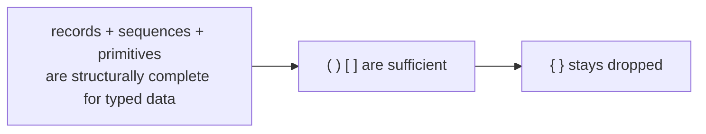
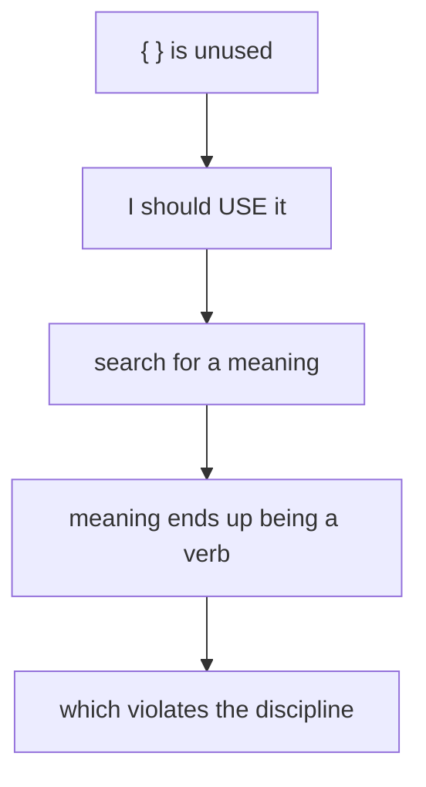
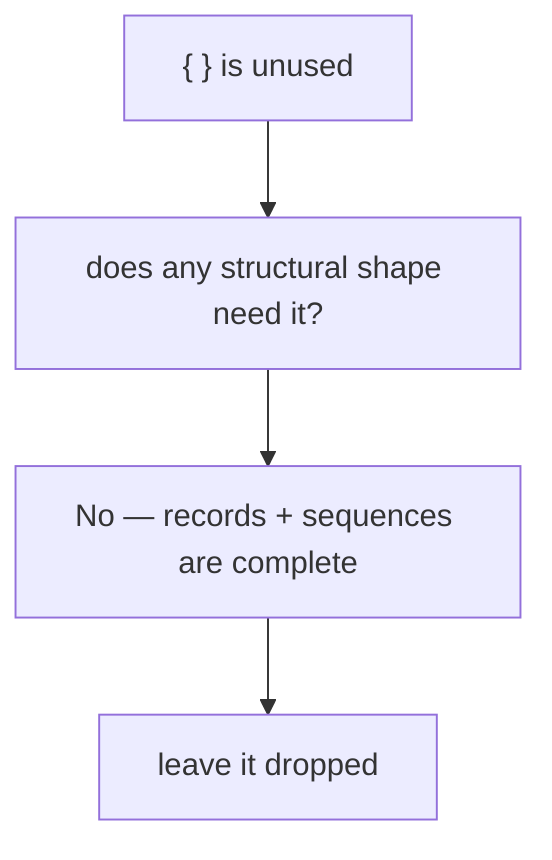

# Curly brackets — drop permanently (the honest answer)

Status: corrects and supersedes report 30
Author: Claude (designer)

The user pushed back on report 30's set-literal recommendation:

> *"Why is it so much better than an ordered vector? I just
> really fail to see why this is such a big gain."*

They're right. The honest answer this report lands on:
**there is no use for `{ }` that earns its place.** The
structural minimum (records + sequences + primitives) is
complete for typed data. Adding a third delimiter for
cosmetic-only gain is anti-beauty. **Drop `{ }`
permanently. Lock the grammar at 12 token variants.**

This report supersedes report 30 (set literals). The
brainstorm that was useful in report 29 — the catalogue of
20 candidate uses — is preserved here in §3 for the durable
record.

---

## 0 · TL;DR



The grammar's three delimiter-or-sigil obligations:
- `( )` named-positional-composite (record). **Required.**
- `[ ]` ordered collection (sequence). **Required.**
- `@` bind marker in pattern position. **Required (load-bearing for pattern semantics).**

That's the whole structural surface. `{ }` is **dropped
permanently.** No piped delimiters return. No third
collection delimiter is added. The set / sequence distinction
is schema-driven via the receiving Rust type (`BTreeSet<T>`
vs `Vec<T>`). Token vocabulary stays at 12 variants.

---

## 1 · Why set literals didn't earn their place

Report 30 recommended `{ }` as set literals. The user's
counter:

> *"Why is it so much better than an ordered vector?"*

The honest accounting:

| Argument for set literals | Holds up? |
|---|---|
| Visually distinguishes set from sequence | Cosmetic only — schema already knows |
| Reads naturally for set algebra | Only if the reader has memorised the convention; `(KindIntersection [a b c])` reads identically |
| Maps to `BTreeSet<T>` at receiver | The receiver determines this regardless of delimiter |
| Canonical encoding (sorted) | `BTreeSet::iter()` already gives sorted order; no syntactic enforcement needed |
| User wrote `{a b}` intuitively in the original example | True — but they could equally have written `[a b]`; the schema would have parsed it the same way |

Each justification reduces to **"a reader who knows the
schema already knows it's a set."** No information was being
added by the delimiter choice. The schema was carrying the
weight; the delimiter was redundant.

The discipline test:
> *Does this delimiter let me express something I couldn't
> otherwise express?*

For set literals, the answer is **no**. The schema does it.

---

## 2 · The structural completeness argument

Reading the typed-binary peers (capnp, rkyv, protobuf,
FlatBuffers): none of them have more than three structural
primitives. They all share:

| Primitive | nexus form | rkyv form |
|---|---|---|
| Record (named composite) | `( )` with head ident | `struct` |
| Variant (closed enum dispatch) | `( )` head ident in enum position | `enum` |
| Sequence (ordered, possibly duplicated) | `[ ]` | `Vec<T>` |
| Set (unordered, unique) | `[ ]` with set-typed receiver | `BTreeSet<T>` |
| Map (keyed) | `[ ]` of `( )` pairs | `BTreeMap<K, V>` |
| Primitive (int, float, bool, string, bytes) | direct token | direct |

**Sets and maps are not distinct structural shapes.** They
are sequence-shaped on the wire with semantic specialization
chosen at the receiver. The wire form doesn't need to know.

This is exactly the rkyv philosophy nexus is the text mirror
of: **structure is records and lists; everything else is a
schema decision**.

The honest test for whether a delimiter pair is needed:

> *Can the wire form be made shorter or clearer **for an
> expressive case** that records + sequences + primitives
> can't handle?*

- For sets: no. `[a b c]` works.
- For maps: no. `[(k1 v1) (k2 v2)]` works.
- For tuples (anonymous records): forbidden.
- For schemas as data: use a `(SchemaDeclaration …)` record.
- For governance proposals: use head-ident namespacing in
  `( )`.
- For capability wrappers: use a `(WithContext …)` record.
- For everything else considered in reports 29–30: same
  answer, use a record.

There is no expressive case `{ }` opens. The grammar is
structurally complete without it.

---

## 3 · The catalogue of considered uses (preserved record)

Reports 29 and 30 went through 20+ candidate uses for `{ }`.
Each is rejected here for a specific reason. Captured for
the durable record so the same brainstorm doesn't recur:

| Candidate | Why dropped |
|---|---|
| Intension form / schema declaration | Verb in delimiter ("declaring"); use `(SchemaDeclaration …)` record |
| Set literals | Cosmetic distinction; schema-driven via `BTreeSet<T>` |
| Map / dictionary literals | Reintroduces named keys against positional discipline; `[(k v) …]` works |
| Resilience-plane meta-form | Verb in delimiter ("this is governance"); use head-ident namespacing |
| Capability / context wrapper | Verb in delimiter ("with-context"); use `(WithContext …)` record |
| Olog / functor declaration | Verb in delimiter ("typing relation"); use `(IsA …)` / `(Functor …)` records |
| Closed-enum literal | Special case of intension form; same rejection |
| Path / navigation expression | Verb in delimiter ("navigate"); use `:` path separator inside record |
| Quotation / unevaluated form | Nexus has no eval; no use case |
| Type ascription | Schema already determines type; redundant |
| Optional / nullable wrapper | `None` sentinel handles absence |
| Probability / confidence | Niche; use `(WithConfidence …)` record |
| Time / temporal context | Use `(AsOf …)` record |
| Subscription template | The Subscribe verb already does this |
| Group / scope block | The Atomic verb already does this |
| Annotation / metadata sidechain | Anti-perfect-specificity; use sub-records |
| Versioning wrapper | Schema-versioning lives in the schema-version known-slot record |
| Capability namespace | Use `:` path separator |
| Currying / partial application | Use a pattern with binds |
| Bag / multiset | Niche; encode as sequence-of-(value,count) pairs |
| Tuple (anonymous record) | Forbidden by `skills/rust-discipline.md` §"One object in, one object out" |
| Pair (size-2 set) | Use a 2-field record with head |
| Empty composite | `()` with head ident covers every needed empty form |
| Reference / pointer / handle | `Slot<T>` is an integer |
| Range expression | Use `(Range a b)` record |
| Computed / virtual / derived | Use `Aggregate` / `Project` verbs |

**No survivor.** Every candidate either embeds a verb meaning
into the delimiter (the recurring failure mode) or is
schema-redundant.

---

## 4 · The recurring failure mode

A pattern across this design exploration: when I see a free
delimiter, I reach for a way to **use it**. That instinct is
backwards. The right discipline is to ask whether the
delimiter **earns its place** by expressing something that
records + sequences can't.

The trap I keep falling into:



The right cycle:



This is the corollary of the user's principle that I've now
violated four times across this design exploration:

> **Delimiters define structure; head identifiers define
> meaning. New meaning enters the language as new record
> kinds, not as new delimiter pairs.**

The corollary is:

> **A delimiter pair earns its place only when records and
> sequences cannot express the structural shape it would
> denote. Otherwise it stays dropped.**

This earns a permanent home in
`~/primary/skills/contract-repo.md` or
`~/primary/skills/language-design.md` so the failure mode
doesn't recur. (Skill update suggested in §6.)

---

## 5 · The grammar, locked

The final grammar after all of reports 22–31:

```rust
pub enum Token {
    LParen,    // (
    RParen,    // )
    LBracket,  // [
    RBracket,  // ]

    At,        // @ (bind marker, pattern position only)
    Colon,     // : (path separator)

    Ident(String),   // PascalCase / camelCase / kebab-case
    Bool(bool),
    Int(i128),
    UInt(u128),
    Float(f64),
    Str(String),
    Bytes(Vec<u8>),
}
```

**12 token variants.** No `LBrace` / `RBrace`. No
`LBracePipe` / `RBracePipe`. No `LParenPipe` / `RParenPipe`.
No `Tilde` / `Bang` / `Question` / `Star` (verb sigils
dropped per Tier 0). No `Equals` (bind aliasing dropped).

The reserved comparison tokens `< > <= >= !=` stay rejected
by the lexer (predicates land as schema records, per report
22 §6 + report 26).

This is the final grammar. Lock it.

---

## 6 · Skill update — the rule worth saving

Add to `~/primary/skills/contract-repo.md` (or
`~/primary/skills/language-design.md` if a separate
language-design skill is preferred):

> **Delimiters earn their place.** A delimiter pair belongs in
> the grammar only when records and sequences (the universal
> structural primitives) **cannot** express the shape it would
> denote. The test: *can the wire form be made shorter or
> clearer for an expressive case that records + sequences +
> primitives can't handle?* If no, the delimiter stays out.
>
> Cosmetic distinctions (set vs. ordered list, map vs.
> sequence-of-pairs) **don't earn a delimiter** — the schema
> at the receiving position already encodes them. Verb-shaped
> uses (declaring, wrapping, scoping, contexting) **don't
> earn a delimiter** — verbs go on record head identifiers,
> not in delimiter pairs.
>
> The structural minimum is records (`( )`) and sequences
> (`[ ]`). Add a third delimiter pair only when a structural
> shape genuinely outside this minimum becomes load-bearing
> in the language.

Worth landing as a one-paragraph addition. Suggested as a
follow-up to this report; defer until user confirms direction.

---

## 7 · What changes vs. report 30

| Area | Report 30 said | This report says |
|---|---|---|
| `{ }` purpose | Set literals | Stays dropped |
| Token vocabulary | 13 variants | 12 variants |
| `BTreeSet<T>` wire form | `{a b c}` | `[a b c]` (receiver-typed) |
| `Unify` | `(Unify {id})` | `(Unify [id])` |
| Constrain patterns | optionally `{pat1 pat2}` | always `[pat1 pat2]` |

The cosmetic gain in report 30 was real but small; the cost
(an extra delimiter, an extra decoder mode, an extra spec
section) wasn't worth it. The user's question made the
asymmetry visible.

---

## 8 · See also

### Library
- **Spivak, D. I. (2014).** *Category Theory for the
  Sciences.* §2.1 Sets and functions — sets in math; in
  *implementation*, the set/sequence distinction is a typed
  receiver, not a structural primitive.
  Local: `~/Criopolis/library/en/david-spivak/category-theory-for-sciences.pdf`

### Internal
- ~~`~/primary/reports/designer/29-curly-brackets-reconsidered.md`~~
  — superseded by report 30; deleted in commit `efe78700`.
- ~~`~/primary/reports/designer/30-curly-brackets-set-literals.md`~~
  — superseded by this report; deleted in the landing
  commit.
- `~/primary/reports/designer/22-nexus-state-of-the-language.md`
  §6 — the original drop of `{ }` Shape; this report makes
  it permanent.
- `~/primary/reports/designer/23-nexus-structural-minimum.md`
  §7 — Tier 0 grammar; final state confirmed here at 12
  tokens.
- `~/primary/reports/designer/26-twelve-verbs-as-zodiac.md`
  §1 — the running example reverts to `(Unify [id])`.

---

*End report.*
