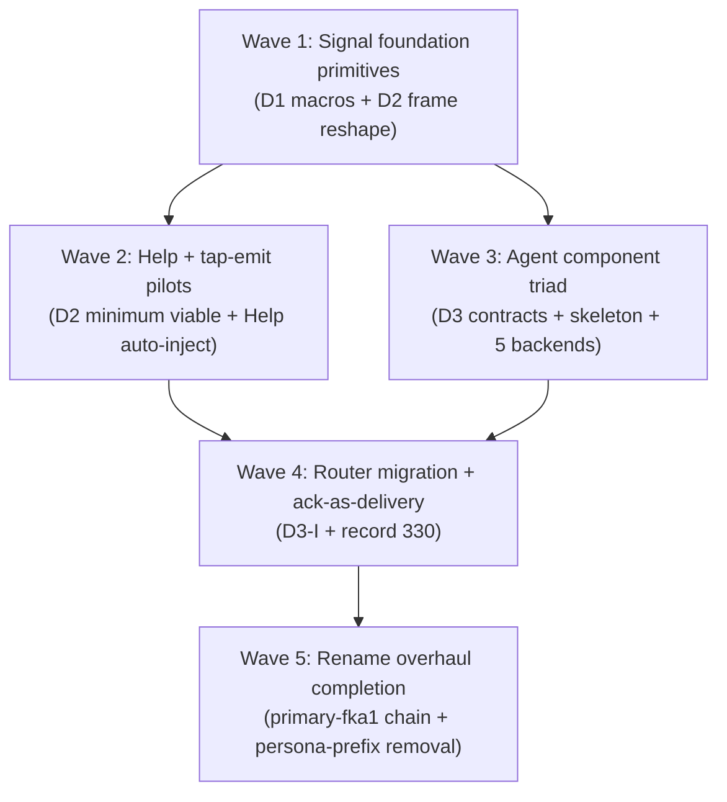
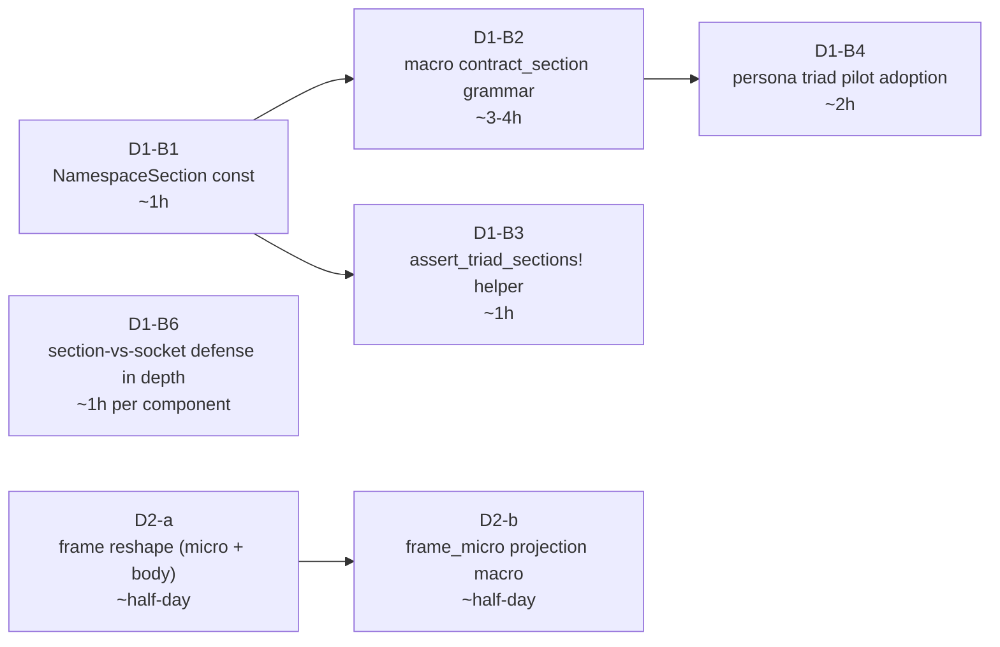
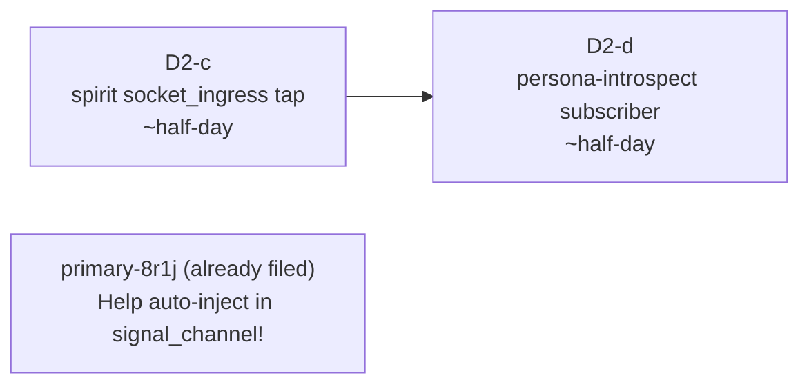
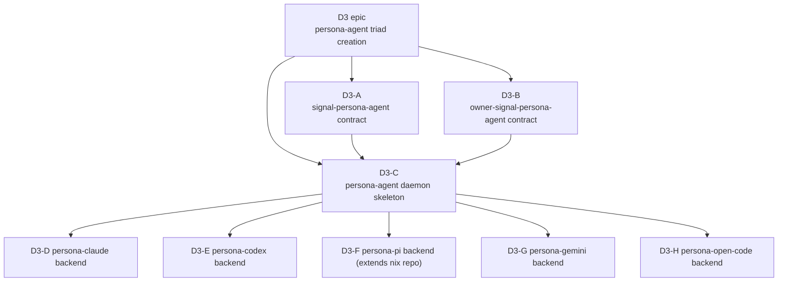
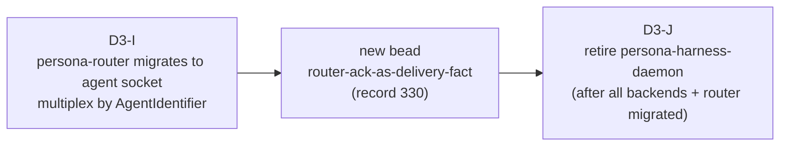

# 310 — Meta-overhaul booking roadmap

*Kind: Synthesis · Topic: meta-overhaul-booking · 2026-05-23*

*Psyche 2026-05-23: "Put it all in the meta giant booking overhaul
the whole code base with operator beaded like well, well instructed.
You know, smaller tasks for sub agents to do in parallel for the
operator." This report is the operator's roadmap: the full bead set
synthesized from prime designer + Subagents A/B/C (manifestation +
audit) + Subagents D1/D2/D3 (golden-ratio + pre-typed envelope +
agent abstraction). Each bead is sized for one-session pickup by
operator subagents in parallel.*

## §1 What this booking covers

Five waves of work, each composed of small parallel-friendly beads:

**Wave 1** is the unlock — foundation primitives in signal-frame
+ signal-frame-macros. Beads parallel-friendly within the wave.

**Wave 2** lights up the first end-to-end Tier 1 + Help slice on
persona-spirit (acts as proof for the patterns).

**Wave 3** creates the agent component triad with five backend
daemons — largest wave, most parallel-friendly (each backend bead
independent).

**Wave 4** migrates router to talk to the agent socket + lands the
router-ack-as-delivery rule (record 330).

**Wave 5** wraps the rename + persona-prefix overhauls under the
new naming conventions (records 270 + 326 + 327).

## §2 Source intent + design reports

| Record | Topic | Decision | Where it lands |
|---|---|---|---|
| 244, 251, 271, 272, 273 | Signal | Three-tier sizing + verb-namespace + universal data variants + extended 64-byte | Wave 1 (LogVariant macro) + ARCH §5 |
| 263 | Component-shape | Help operations auto-inject via signal_channel! | Wave 2 (bead `primary-8r1j`, already filed) |
| 266, 267, 268 | Component-shape | signal_cli! macro emits full CLI binary + Caller from getppid | Wave 2 (beads `primary-915w` + `primary-uxq1` + `primary-uq04*`, already filed) |
| 326 | Signal | Per-component RootVerb namespace (NOT workspace-wide) | Wave 1 (ARCH §5.2 correction — landed by prime) |
| 327 | Signal | Golden-ratio split between owner + ordinary contracts | Wave 1 (D1 beads, this report §3) |
| 328 | Signal | Pre-typed message envelope + tap-anywhere | Wave 1 + 2 (D2 beads, this report §4) |
| 329 | Persona | Agent component abstracts harness backends | Wave 3 (D3 beads, this report §5) |
| 330 | Persona | Router-ack as durable delivery fact | Wave 4 (this report §6) |
| 261, 262, 264, 269, 277 | Naming | Identifier rename + signal-persona-auth → signal-persona-origin | Wave 5 (`primary-fka1` epic, already filed + bundled) |
| 270 | Component-shape | Binary naming convention | Wave 5 (`primary-0m1u` persona-prefix removal, already filed by second-designer) |

Design reports backing the booking:

- `reports/designer/305-v2-design-64bit-signal-per-component-namespacing.md` — corrected per-component model
- `reports/designer/307-design-golden-ratio-namespace-split.md` — D1 detailed design
- `reports/designer/308-design-pretyped-envelope-and-tap-anywhere.md` — D2 detailed design
- `reports/designer/309-design-agent-component-abstraction.md` — D3 detailed design
- `reports/designer/297-301` — signal_cli! + rename + Help foundation work

## §3 Wave 1 — Signal foundation primitives (D1 + D2 reshape)

Six golden-ratio beads + two frame-envelope beads. All within
signal-frame / signal-frame-macros / persona triad. Operator
subagents can claim these in any order respecting the local
dep chain.

## §4 Wave 2 — Tap-emit pilot + Help integration

Tap-emit minimum viable slice + Help operations (existing bead).
Together they prove the cross-cutting macro-pivot pattern on a
single live triad (persona-spirit).

## §5 Wave 3 — Agent component triad (D3 epic + 10 sub-beads)

Critical path: A+B → C → D/E/F/G/H (5 backends in parallel).
Each backend is a separate daemon process (Option C from D3 §4 —
rejected single-binary backend-selector for clean per-backend
process isolation).

## §6 Wave 4 — Router migration + ack-as-delivery (D3-I + record 330)

Router migration unlocks the 4-hop router-ack durability chain
(harness library callback → backend daemon event → agent daemon
event → router state transition). Router writes `Delivered` row
only on hop 4.

## §7 Wave 5 — Rename + naming-convention completion

Bookkeeping more than design — most of this is already filed:

- `primary-fka1` epic (rename pass) — sub-beads `.1` through `.7`, all open
- `primary-7ru6` (closed, bundled into `primary-fka1.1`)
- `primary-0m1u` (persona-prefix removal, ~5 phases) — pre-existing per record 270 + `/160-persona-prefix-removal-coordinated-rename-2026-05-23.md`

Items to ADD in this wave:
- New bead: `signal-frame/ARCH §5.2 carries the per-component correction landed; signal-persona-spirit / signal-persona-message / signal-persona / etc. ARCHITECTURE.md files need parallel correction notes` (designer-lane sweep, can be one bead with per-repo checklist)

## §8 Bead pool summary

| Wave | New beads filed by this report | Existing beads it sequences |
|---|---|---|
| 1 | D1-B1, D1-B2, D1-B3, D1-B4, D1-B6, D2-a, D2-b | (primary-l02o updated scope per /305-v2) |
| 2 | D2-c, D2-d | primary-8r1j (Help auto-inject) |
| 3 | D3-EP epic + D3-A through D3-H (9 beads) | (none) |
| 4 | D3-I, D3-J, router-ack bead | (none) |
| 5 | ARCH sweep correction bead | primary-fka1.* (rename), primary-0m1u (persona-prefix), primary-915w + primary-uxq1 + primary-uq04* (CLI macro) |

**Total new beads filed by this booking: ~22.** Combined with the
existing ~30 open beads from prior sessions, the workspace has ~50
operator-actionable beads with explicit critical-path sequencing.

## §9 What operator subagents pick up first

For parallel pickup, the highest-leverage beads in dependency-free
positions:

| Priority | Bead | Why now |
|---|---|---|
| 1 | D1-B1 (NamespaceSection const) | Unblocks D1-B2 + D1-B3; ~1h |
| 1 | D2-a (frame reshape) | Unblocks D2-b + all tap-emit work; ~half-day |
| 1 | D3-A (signal-persona-agent contract) | Unblocks D3-C + downstream backends |
| 1 | D3-B (owner-signal-persona-agent contract) | Parallel with D3-A; same unblocking |
| 2 | primary-fka1.1 (signal-persona-auth → signal-persona-origin + Identifier rename, bundled) | Stops new code accumulating old names per /302 audit |
| 2 | primary-915w (signal_cli foundation) | Unlocks the per-component CLI migration sweep |
| 2 | D1-B3 (assert_triad_sections! helper) | Parallel with D1-B2 |

Four operator subagents working in parallel could land the
foundation primitives (D1-B1, D2-a, D3-A, D3-B) in one wall-clock
session and unlock the downstream work for the next session.

## §10 Open questions for psyche — consolidated

Items requiring psyche direction (none block bead filing — these
inform downstream operator decisions or future design):

**From D1 (golden-ratio):**
- (i) Confirm 100/156 split point at byte 100 boundary?
- (ii) Confirm default owner=Small / public=Big? Override mechanism via `CARGO_PKG_NAME` prefix detection good enough or want explicit attribute?
- (iii) Single-socket-per-component: pursue or hold? D1 recommends **hold** (defense-in-depth from dual sockets is load-bearing; section validation as redundant check is OK).
- (iv) Help auto-injection placement under golden-ratio split — should `Help` always go in the small section, the big section, or be component-choice?
- (v) Future `meta-` rename (owner → meta) — should default-section detection use `meta-` prefix too?
- (vi) Per-triad section column in `protocols/active-repositories.md`?

**From D2 (pre-typed envelope):**
- (i) Handshake-frame micro reservation (`0xFE`/`0xFF` byte 0)?
- (ii) Multi-payload Request micro choice (first payload's verb vs reserved multi-op verb)?
- (iii) Owner-vs-ordinary split on tap subscription surfaces — should executor-layer taps require owner-signal access (default) or be available on ordinary?
- (iv) Fallthrough policy on tap channel saturation — D2 recommends drop-oldest per push-not-pull.
- (v) rkyv version pin for the new envelope shape?

**From D3 (agent abstraction):**
- (i) Backend CLI-name collision with upstream binaries — designer lean: keep upstream names for shadowing, use unprefixed `pi` since no upstream collision.
- (ii) `persona-harness` fully retires (library + daemon) or keeps library?
- (iii) Backend daemon spawn ownership — orchestrate vs agent-daemon?
- (iv) Per-agent vs per-message backend selection?
- (v) Fixture-backend home (where the testing fixture sits)?
- (vi) Agent CLI verb scope?

**From router-ack (record 330):**
- (i) Authoritative delivery storage — durable row in persona-router's redb or persona-message's redb? Recommend persona-router (it owns the delivery fact per record 330).

**From the rename pass:**
- (i) Should the future owner→meta rename be filed as a sibling epic to `primary-fka1` now, or wait until psyche commits to the rename?

**Cross-cutting:**
- (i) Working copy commit strategy — controlled `jj split` to preserve multi-agent work cleanly, or batch after the wave-1 beads land code?

## §11 Implementation cost estimate (rough)

| Wave | Estimated wall-clock with 4 operator subagents | Estimated total operator-hours |
|---|---|---|
| 1 | 1-2 sessions | ~20-25h |
| 2 | 1 session | ~8-10h |
| 3 | 2-3 sessions (5 backends parallel-friendly) | ~30-40h |
| 4 | 1-2 sessions | ~10-15h |
| 5 | 2-3 sessions (rename + persona-prefix + CLI sweep) | ~20-30h |

**Total operator-hours estimate: ~90-120h across all waves.** With
parallel pickup, wall-clock ~7-11 sessions for a multi-operator
week. This is the comprehensive overhaul the psyche directed.

## §12 What lands AFTER this booking

Once these waves complete, the workspace has:

- Per-component verb-namespaces with golden-ratio split fully
  manifested in macros + daemon code
- Pre-typed message envelopes everywhere with tap-anywhere
  observability
- Agent component triad operational with five backend daemons
- Router-ack-as-delivery durably tracked
- Rename overhaul complete (Identifier + signal-persona-origin +
  persona-prefix removal)
- signal_cli! macro generating all CLI binaries

What's NOT in this booking (intentional):

- The owner → meta rename (psyche hold per /305-v2)
- Single-socket-per-component (D1 recommends hold)
- Persona-mind agent-error logging (record 275 — gated on persona-mind shipping)
- Cloud track (third-designer + system-specialist working independently)
- Auditor role mechanism (records 234+235 — needs more design)

## See also

- `reports/designer/305-v2-design-64bit-signal-per-component-namespacing.md`
- `reports/designer/307-design-golden-ratio-namespace-split.md`
- `reports/designer/308-design-pretyped-envelope-and-tap-anywhere.md`
- `reports/designer/309-design-agent-component-abstraction.md`
- Spirit records 244, 251, 263, 266-273, 326-330
- All beads referenced in §8 + §9
