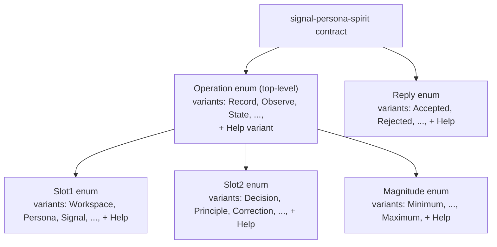
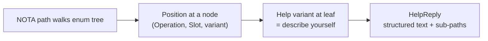

# 312 — Recursive Help-on-every-enum

*Kind: Design · Topic: recursive-help-discipline · 2026-05-23*

*Psyche 2026-05-23 (spirit record 359): "essentially most enums
should have a 'Help' variant that explains this enum namespace."
This report expands `/298`'s flat Help-at-contract-level model into
a recursive Help-on-every-enum shape: every enum the
`signal_channel!` macro emits carries a `Help` variant; the macro
auto-derives Help text from Rust `///` doc comments on every variant
of every enum; command documentation hooks through the same Help
operation infrastructure.*

## §1 What changes from `/298`

`/298` proposed Help as TWO operations on the top-level contract:

```text
(Help Main)              — list of operations + one-line descriptions
(Help (Verb "Record"))   — schema for one named operation
```

The deeper direction per spirit record 359 makes Help **recursive
on every enum** the macro emits, not just the contract's top-level
`Operation` enum:



Every enum the macro generates gets a `Help` variant auto-injected.
Walking the enum graph via Help operations reveals the full typed
vocabulary of the channel.

## §2 The recursive Help operation shape

**Help is positioned at the END of the path, not the beginning.**
The path walks the enum tree to a position; the Help variant at that
position asks that node to describe itself. Pattern: `(Command Help)`
or `(Command (Subnamespace Help))` — Help is the leaf.

```text
(Help)                                — channel-level: describes the contract itself
(Record Help)                         — describes the Record operation
(Record (Slot1 Help))                 — describes the Slot1 enum within Record
(Record (Slot1 (Workspace Help)))     — describes the Workspace variant
(Record (Slot2 (Decision Help)))      — describes the Decision variant
(Magnitude (Maximum Help))            — describes the Maximum variant of Magnitude
(Reply (Accepted Help))               — describes what Accepted means
```

Reading the structure: each NOTA position walks one level into the
enum tree; `Help` at any depth means "describe THIS node." So
`(Record (Slot1 Help))` reads as "into Record, into Slot1, ask for
help on Slot1 itself." `(Record (Slot1 (Workspace Help)))` reads as
"into Record, into Slot1, into Workspace, ask for help on Workspace."



The macro auto-injects Help as a variant of every enum it emits.
Walking to any depth and asking Help is a uniform operation. Per
spirit record 364.

## §3 Where the documentation comes from

The macro reads Rust `///` doc comments at compile time. Every
variant of every enum that the macro emits is expected to carry a
doc comment. Macro emits a `HELP_TEXT: &'static str` per variant
keyed by its discriminant.

```rust
signal_channel! {
    operation Operation {
        /// Record a new intent entry. The daemon stamps timestamp + observation source.
        Record { topic: Topic, kind: Kind, /* ... */ },

        /// Observe stored records; filter by topic and/or kind.
        Observe(Query),

        /// Submit a free-form psyche statement; lowers to an Assert.
        State(StatementText),
    }

    slot_enum Slot1 = TopicArea {
        /// The workspace as a whole — meta-decisions about how the workspace operates.
        Workspace,
        /// Persona stack — daemons in the persona engine.
        Persona,
        /// Signal layer — wire contracts and macros.
        Signal,
        /// Component-shape rules — how components are organized.
        ComponentShape,
    }

    slot_enum Slot2 = StatementKind {
        /// A specific choice made.
        Decision,
        /// A general rule.
        Principle,
        /// Pointing out a wrong state to fix.
        Correction,
        /// Explaining what was meant.
        Clarification,
        /// A fixed limitation.
        Constraint,
    }
}
```

What `(Slot1 (Workspace Help))` retrieves (the Workspace variant's
documentation noun within Slot1):

```text
HelpReply {
    name: "Workspace",
    description: "The workspace as a whole — meta-decisions about how the workspace operates.",
    parent_enum: "Slot1 (TopicArea)",
    sibling_variants: ["Persona", "Signal", "ComponentShape", "..."],
}
```

## §4 Always-fresh by construction

Because the help text is derived from doc comments on the
contract's source, it is **always in sync with the contract** —
there's no separate help-text store to maintain. Renaming a variant,
adding a new variant, or rewording a doc comment all flow through
to Help replies on the next rebuild.

This composes with `signal_channel!`'s existing auto-derive for
operations and replies. The macro layer becomes the workspace's
documentation surface.

## §5 Command documentation retrieves the Help noun via NOTA

CLIs take exactly one NOTA argument (per `AGENTS.md` hard override
"NOTA is the only argument language" + `skills/component-triad.md`
§"The single argument rule"). Help retrieval is therefore one NOTA
argument naming the path-to-Help. The CLI sends it to the daemon
and formats the returned `HelpReply` as text:

```text
$ spirit '(Help)'
spirit — capture and observe psyche intent

Operations:
  Record   — Record a new intent entry. The daemon stamps timestamp + observation source.
  Observe  — Observe stored records; filter by topic and/or kind.
  State    — Submit a free-form psyche statement; lowers to an Assert.

For sub-vocabulary, retrieve: (Record Help), (Slot1 Help), (Slot2 Help), (Magnitude Help), ...
```

```text
$ spirit '(Slot1 Help)'
Slot1 (TopicArea) — what topic area an intent record is about

Variants:
  Workspace      — The workspace as a whole — meta-decisions about how the workspace operates.
  Persona        — Persona stack — daemons in the persona engine.
  Signal         — Signal layer — wire contracts and macros.
  ComponentShape — Component-shape rules — how components are organized.
  ...

For a specific variant, retrieve: (Slot1 (Workspace Help)), (Slot1 (Persona Help)), ...
```

```text
$ spirit '(Slot1 (Workspace Help))'
Workspace — The workspace as a whole — meta-decisions about how the workspace operates.

Parent enum: Slot1 (TopicArea)
Sibling variants: Persona, Signal, ComponentShape, ...
```

The CLI never invents Help text — it formats what the daemon
returns. The daemon never hand-maintains Help text — it returns
what the macro emitted from the contract's doc comments. The CLI
respects the single-NOTA-argument rule; no shell-style multi-arg
discovery surface.

## §6 Discipline on doc comments

For the recursive Help to be useful, **every variant of every enum
the macro emits MUST carry a `///` doc comment**. The macro's
build-time emission could fail (or warn) when a variant lacks one.

This is a discipline shift — currently doc comments are optional.
Going forward, the contract's vocabulary IS its documentation
surface, and that surface is empty without doc comments.

Recommendation: the macro emits a warning (not an error) on missing
doc comments for the first release; tightens to error once the
workspace is fully doc-commented.

## §7 Reply type uniformity

All Help replies share a uniform `HelpReply` shape so the CLI's
print routine handles every depth identically:

```rust
pub struct HelpReply {
    pub name: String,                          // the entity's name
    pub description: String,                   // its /// doc comment
    pub parent: Option<HelpReplyParent>,       // breadcrumb to the parent enum
    pub children: Vec<HelpReplyChild>,         // nested enums / variants
    pub kind: HelpReplyKind,                   // Channel | Enum | Variant
}

pub enum HelpReplyKind {
    Channel,   // top-level contract help
    Enum,      // an enum
    Variant,   // a variant of an enum
}
```

The CLI prints based on `kind`. The daemon emits based on the
macro-derived data. The contract author writes one doc comment per
variant. That's the full discipline.

## §8 Recursive descent — retrieving Help nouns at depth

A user discovering the channel walks the enum tree depth-first by
sending one NOTA arg at a time (per the CLI single-argument rule):

```text
spirit '(Help)'
  → retrieves the channel's Help noun
  (top-level: Operation enum + Reply enum + sub-enums named)

spirit '(Record Help)'
  → retrieves Record operation's Help noun
  (operation summary + payload field/enum list)

spirit '(Record (Slot1 Help))'
  → retrieves Slot1's Help noun within Record's namespace
  (what Slot1 names + its variant list)

spirit '(Record (Slot1 (Workspace Help)))'
  → retrieves Workspace variant's Help noun
  (what Workspace means + its siblings)
```

Each NOTA arg navigates one level deeper into the contract's enum
tree; the leaf `Help` names the documentation noun at that position.
The HelpReply's `children` field names what's reachable from each
node (the next NOTA path the user might send).

## §9 Integration with the macro layer convergence

This work converges with the existing macro-pivot beads (per the
deeper-macro direction in spirit record 359):

| Bead | Role in the convergence |
|---|---|
| `primary-l02o` | LogVariant trait + autogen derive macro — emits the Tier 1 micro projection per enum |
| `primary-915w` | signal_cli foundation — CLI macro emits Help routing to daemon |
| `primary-8r1j` | Help operations auto-inject — extends per this report to recursive Help-on-every-enum |
| `primary-3cl1` | frame_micro projection — always-on per spirit record 359 |
| `primary-v5n2` | contract_section grammar — golden-ratio split macro |
| `primary-avog` | assert_triad_sections! helper |
| `primary-li0p` | NamespaceSection const + classify helper |
| `primary-2cjv` | frame reshape with micro + body |

All eight beads converge on the **same `signal-frame-macros`
extension surface**. Operator can satisfy multiple beads in one
PR landing per spirit record 359's "embed by default" direction.

## §10 Open questions for psyche

- **Doc-comment discipline timing.** Warn vs error on missing
  `///` comments — start lenient (warn), tighten over time? Or
  hard-error from the first release to enforce the discipline
  workspace-wide immediately?
- **Help on the universal data variants.** `U8`, `U16`, etc. live
  in `signal-frame::UniversalDataVariant` shared across channels.
  Should the macro's Help emission include the universals (always
  available in every slot enum) or list them once at the
  signal-frame level? Recommendation: signal-frame defines Help
  for universals once; per-channel Help mentions "+ universal data
  variants (see signal-frame::UniversalDataVariant)" as a
  cross-reference.
- **Help reply size budget.** Some channels (persona-router with
  many operations) could have large Help replies. Cap reply size
  or paginate? Recommendation: emit as Tier 3 (full rkyv record)
  so payload size isn't a hot-path concern; the cost is the
  client formatting the reply, not the wire.
- **Internationalization / multiple doc comments.** Today's `///`
  comments are English-only. The Help mechanism doesn't preclude
  multi-language doc comments (a future macro arm could read
  `/// @en …` / `/// @fr …`); today, English-only is enough.

## §11 Implementation scope

Per `primary-8r1j`'s updated scope (note added 2026-05-23): the
recursive Help-on-every-enum extension lands as part of the
consolidated macro PR (per spirit record 359 deeper-macro
direction). Estimated work in the macro layer:

- Macro doc-comment extraction: ~50 LOC of `proc_macro2` parsing
- `HelpReply` struct + `HelpReplyKind` enum in signal-frame: ~20 LOC
- Help arm injection per emitted enum: ~80 LOC of macro_rules
  generation
- Per-variant `HELP_TEXT` const emission: ~30 LOC of macro logic
- CLI-side print formatting (in signal_cli! emission): ~100 LOC
- Tests: round-trip on a sample contract, exhaustive variant
  coverage: ~100 LOC

Total foundation: ~400 LOC across signal-frame + signal-frame-macros
+ signal-cli-macros. Bundled in the consolidated macro PR; operator
lands once.

## See also

- `reports/designer/298-design-help-operations-in-components.md` —
  the flat Help-at-contract-level predecessor this report extends
- `reports/designer/305-v2-design-64bit-signal-per-component-namespacing.md`
  — per-component model the Help recursion respects
- `reports/designer/310-meta-overhaul-booking-roadmap.md` §3 —
  the macro-layer beads this design converges with
- Spirit records 263 (Help operations), 359 (deeper macro direction)
- Beads `primary-l02o`, `primary-915w`, `primary-8r1j`,
  `primary-3cl1`, `primary-v5n2`, `primary-avog`, `primary-li0p`,
  `primary-2cjv` — the converging macro work
