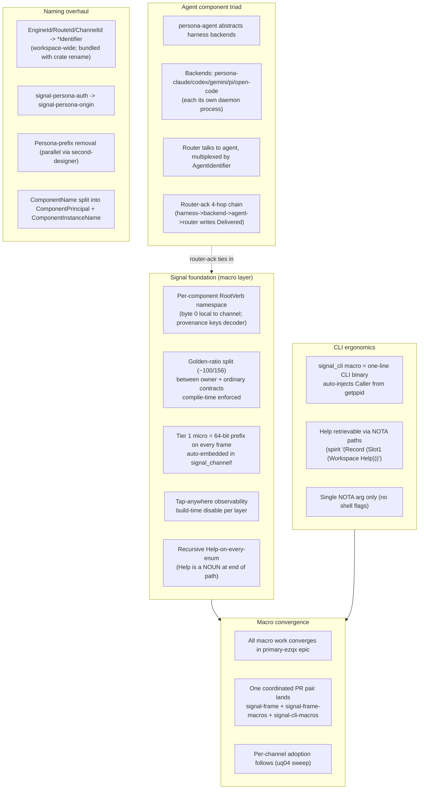

# 313 — Great-summary + handover (session 2026-05-23 / 2026-05-24)

*Kind: Handover · Topic: session-handover · 2026-05-24*

*Psyche 2026-05-24: "do a serious context-maintenance + create a
great-summary of all relevant context, focusing on most recent
work, handover report." This report is the condensed picture of
where the workspace's design is, what landed in this prime-designer
session, what's open, and where the next agent (or session) picks
up. Companion: aggressive consolidation sweep at `/314` (subagent
in flight at write time).*

## §1 The great-summary — workspace design state as of 2026-05-24

Five threads converged in this session:

The macro layer is the **convergence point** — every signal contract
crate emits Tier 1 + Help + golden-ratio split + signal_cli! for
free via the consolidated macro extension. Per-component adoption
follows once the foundation lands.

## §2 What landed this session — recent work

### Design reports written (prime designer + 4 designer subagents)

| Report | Topic | Status |
|---|---|---|
| `/297` | signal-persona-auth rename direction | Settled (rename target = signal-persona-origin per spirit 264) |
| `/298` | Help operations in components (flat model) | Superseded by /312 (recursive Help) |
| `/299` | Origin process + agent identity | Reference; informs primary-07ot (router-ack) |
| `/300` | CLI macro caller-context injection | Foundation for primary-915w |
| `/301` | Elegant signal_cli! macro with Caller | Bead pool: primary-915w + primary-uxq1 + primary-uq04 epic |
| `/302` | Audit of recent operator work | Findings ratified; corrections landed |
| `/303` | Intent manifestation sweep (Subagent A) | 7 records homed in skills/designer.md + skills/beads.md + skills/component-triad.md + signal-persona-origin ARCH |
| `/304` | Unimplemented intent audit (Subagent B) | Found only 1 net-new (c) bead (Help); 21 (b) partial items have existing beads |
| `/305-v2` | Per-component namespacing (corrected) | Supersedes /305 (which had central-enum framing — wrong) |
| `/306` | Manifestation sweep round 2 (Subagent C) | 8 intents homed across cloud/persona/arca ARCH; 4 beads filed |
| `/307` | Golden-ratio split design (Subagent D1) | Bead pool: primary-li0p, primary-avog, primary-v5n2, primary-muu2, primary-g21y, primary-9dce |
| `/308` | Pre-typed envelope + tap-anywhere (Subagent D2) | Bead pool: primary-2cjv, primary-3cl1, primary-bann, primary-145a + 4 follow-ons |
| `/309` | Agent component abstraction (Subagent D3) | Bead pool: primary-gvgj epic + 10 sub-beads |
| `/310` | Meta-overhaul booking roadmap | THE operator roadmap — Wave 1-5 sequenced |
| `/311` | Context-maintenance sweep round 1 | 100+ stale reports dropped; 9 perm-doc edits |
| `/312` | Recursive Help-on-every-enum | Help is a NOUN at end of NOTA path; per spirit 359+363+364+365 |
| `/313` | This report | Session handover |
| `/314` | Aggressive consolidation sweep | In flight at write time |

### Beads filed (this session, ~30+ new beads)

**Macro convergence epic** (primary-ezqx) covers:
- `primary-li0p` (NamespaceSection const)
- `primary-2cjv` (frame.micro field)
- `primary-l02o` (LogVariant trait + macro)
- `primary-v5n2` (contract_section grammar)
- `primary-avog` (assert_triad_sections!)
- `primary-3cl1` (frame_micro projection always-on)
- `primary-8r1j` (Help auto-inject — extended to recursive per /312)
- `primary-915w` (signal_cli foundation)
- `primary-9dce` (defense-in-depth section validation)

**Rename epic** (primary-fka1, with sub-beads .1 through .7) covers:
- .1: crate rename signal-persona-auth -> signal-persona-origin + bundled Identifier rename in same crate
- .2: ActorId workspace-wide
- .3: SnapshotId workspace-wide
- .4: SubscriptionId workspace-wide
- .5: Medium-traffic *Id sweep
- .6: Small-traffic *Id catch-all
- .7: Naming audit verification
- (primary-7ru6 closed; bundled into .1)
- (primary-uzpv closed; housekeeping)

**CLI migration sweep** (primary-uq04, with sub-beads .1-.4):
- .1: persona-orchestrate CLI
- .2: persona-terminal cluster (9 binaries)
- .3: persona-message CLI
- .4: nexus CLI (parse + render)
- (Foundation: primary-915w + first proof primary-uxq1 on persona-spirit)

**Agent component triad epic** (primary-gvgj, with sub-beads .1-.10):
- .1: signal-persona-agent contract
- .2: owner-signal-persona-agent contract
- .3: persona-agent daemon skeleton
- .4-.8: 5 backend daemons (persona-claude/codex/pi/gemini/open-code)
- .9: persona-router migration to agent socket
- .10: retire persona-harness-daemon

**Standalone beads filed this session:**
- `primary-07ot` (P1) router-ack 4-hop delivery durability
- `primary-bann` (P1) persona-spirit socket_ingress tap point
- `primary-muu2` (P1) persona triad golden-ratio pilot adoption
- `primary-145a` (P1) persona-introspect tap subscriber (first Tier-1 consumer end-to-end)
- `primary-g21y` (P2) golden-ratio sweep across remaining triads
- `primary-oa6e` (P2) designer ARCH sweep for per-component RootVerb model
- `primary-8r1j` (P1) Help auto-injection (now recursive per /312)
- `primary-ft29` (P3) winnow audit research

**Cloud track sub-beads** (filed by Subagent C in /306):
- `primary-kbmi.4` (P1) cloud Plan -> owner-signal-cloud
- `primary-kbmi.2.1` (P1) NotAuthoritative reply
- `primary-srmq` (P1) lojix nix-auth crate
- `primary-0xn7` (P2) arca schema_header redb table

### Spirit records captured (this session)

~30 new records: 308 (parallel subagent dispatch), 323-330 (signal/persona design directions), 359-365 (deeper macro + Help-as-noun + CLI single-arg corrections).

Key Maximum-certainty ratifications:
- **326** — per-component RootVerb namespace (NOT workspace-wide)
- **327** — golden-ratio byte-0 split between owner + ordinary
- **328** — pre-typed message envelope + tap-anywhere
- **329** — agent component abstracts harness backends
- **330** — router-ack as durable delivery fact
- **359** — deeper signal/sema macro (embed + standardize + derive + Help-on-every-enum)
- **363** — Help at END of NOTA path (not head)
- **364** — Help is a NOUN
- **365** — CLI single-NOTA-argument rule reinforced

### Permanent-doc edits

- `signal-frame/ARCHITECTURE.md §5.2` — corrected per-component framing (supersedes central-enum claim)
- `signal-persona-origin/ARCHITECTURE.md` — ComponentName split note (pending rename)
- `skills/designer.md` — new "Designer authority" + "Audits feed into bead filing" sections (Subagent A manifestation)
- `skills/beads.md` — duplicate-preservation subsection (Subagent A)
- `skills/component-triad.md` — Help operations section (Subagent A, before recursive expansion)
- Multiple ARCH edits via Subagent C on cloud + persona + arca

## §3 What's open — questions awaiting psyche

| # | Question | Source | Lean / status |
|---|---|---|---|
| 1 | Owner -> meta rename pursue or hold? | /305-v2 §5 | My lean: hold (Rust ecosystem alignment) |
| 2 | Initial RootVerb vocabulary ratify-whole or piecemeal? | /305-v2 §11 | My lean: whole-ratification |
| 3 | Slot naming positional (SlotN) or semantic (Target/Action/...)? | /305-v2 §11 | Open |
| 4 | Tier 2 size 64-byte vs 512-byte (single vs both tiers)? | /305-v2 §11 + record 273 | Open |
| 5 | Universal data variants — add U32/U64 now or as-needed? | /305-v2 §11 + /159/1 | Open |
| 6 | Help auto-injection placement under golden-ratio split (Small or Big)? | /307 §9 | Open |
| 7 | Single-socket-per-component pursue or hold? | /307 §5 + record 327 | D1 lean: HOLD (keep dual; defense-in-depth) |
| 8 | Handshake-frame micro reservation (0xFE/0xFF byte 0)? | /308 §10 | Open |
| 9 | Multi-payload Request micro choice (first verb vs reserved)? | /308 §10 | Open |
| 10 | Tap subscription owner-vs-ordinary split? | /308 §10 | Open |
| 11 | Tap fallthrough policy on saturation? | /308 §10 | D2 lean: drop-oldest |
| 12 | Backend CLI-name collision with upstream binaries? | /309 §11 | D3 lean: keep upstream names for shadowing |
| 13 | persona-harness fully retire (library + daemon) or keep library? | /309 §11 | Open |
| 14 | Backend daemon spawn ownership (orchestrate vs agent-daemon)? | /309 §11 | Open |
| 15 | Doc-comment discipline timing (warn vs hard-error)? | /312 §10 | My lean: warn first, tighten later |
| 16 | Per-triad section column in `protocols/active-repositories.md`? | /307 §9 | Open |
| 17 | RootVerb append-only discipline confirmation? | /305-v2 §11 | Recommended; awaits psyche affirmation |

## §4 Bead pool snapshot for operator

**~70+ open beads workspace-wide as of 2026-05-24** spanning:

- **Macro convergence** (`primary-ezqx` epic + 9 converging beads) — recommend ONE coordinated landing per spirit 359
- **Rename epic** (`primary-fka1` + 7 sub-beads) — mechanical sweeps; parallel-friendly per `*Id` type
- **CLI migration sweep** (`primary-uq04` + 4 sub-beads + foundation `primary-915w` + first-proof `primary-uxq1`)
- **Agent component triad** (`primary-gvgj` epic + 10 sub-beads) — per-backend parallel
- **Three-tier signal sizing** (`primary-l02o` + `primary-bg9l` + `primary-2py5` + `primary-b86d` + `primary-k8cn`) — five-bead chain
- **Persona engine epic** (`primary-a5hu` + 5 sub-beads .1-.5) — pre-existing
- **Triad migration batch** — 13 beads from older session
- **Cloud track** (`primary-kbmi` + sub-beads .2.1 + .4, plus `primary-srmq` + `primary-0xn7`)
- **Second-designer's parallel splits** from `/161/6` — primary-wvdl, primary-4naq, primary-devn, primary-0m1u, primary-c2da, primary-u8vo, primary-u0lh, primary-ipjx
- **Other P1/P2 standalone** — `primary-07ot`, `primary-bann`, `primary-muu2`, `primary-145a`, `primary-g21y`, `primary-oa6e`, `primary-8r1j`, `primary-9dce`, plus other older beads

**Critical-path foundation primitives** that unlock the most downstream work:
1. `primary-li0p` (NamespaceSection const) — ~1h
2. `primary-2cjv` (frame reshape) — half-day
3. `primary-gvgj.1` + `primary-gvgj.2` (agent contracts) — 2-3h each, parallel

Once those four land, the macro convergence + agent triad + tap-anywhere all unblock.

## §5 Side notes — small thoughts worth keeping

- **note:** The macro-pivot pattern is now THREE convergent capabilities — signal_channel! emits frame.micro + LogVariant + Help recursively + signal_cli! emits CLI binary. The macro layer is becoming the workspace's universal cross-component capability surface. Future capabilities (rate limiting, audit, tracing) should consider this surface as their default home before reaching for per-component code.

- **possibly useful:** The `.beads/embeddeddolt` backend is single-writer; parallel `bd` calls fail with lock errors. Worth a system-specialist task to switch to dolt-server backend for concurrent access, especially as agent dispatch grows.

- **undecided:** The "meta-report directory" pattern (spirit record 231) is being used by second-designer in /152/, /159/, /161/, /162/ — heavily. Worth tracking whether these directories themselves need a hygiene rule (e.g. retire the meta-dir when its synthesis sub-report lands as a flat report; or when the substance migrates to permanent docs).

- **note:** Per spirit record 362 (aggressive consolidation), context-maintenance can do MORE than drop-or-keep — it can REWRITE old substance against current state into new compact reports. This session demonstrated both conservative (subagent /311) and aggressive (subagent /314) modes. The choice is psyche-directed.

- **possibly useful:** The Subagent A→B→C→D1/D2/D3 dispatch pattern in this session showed that 3-4 designer subagents in parallel can substantially advance the design surface. Worth codifying the "designer-subagent batch dispatch" as a workflow shape in `skills/designer.md` if it recurs.

- **note:** The cloud track (system-specialist + third-designer) has been moving fast in parallel. Worth a brief from cloud-track agents to prime designer next session for cross-track alignment, especially as the cloud component triad starts to consume the signal-frame foundation primitives we're landing.

## §6 Next-session targets — concrete pickups

For the **next prime designer session**:

1. **Absorb /314 sweep output** — once aggressive consolidation lands, integrate any cross-cutting findings.
2. **Address the 17 open questions in §3** — bring 4-6 to psyche per session, batched by topic.
3. **Watch for operator pickup** on the macro convergence epic (`primary-ezqx`) — once foundation primitives land in code, the per-channel rollout begins.
4. **Land the second-designer rename-overhaul cross-coordination** — persona-prefix removal (`primary-0m1u`) intersects with my naming epic (`primary-fka1`); next session should reconcile.

For the **next operator session(s)**:

1. **Pick up the four foundation primitives in parallel**: `primary-li0p`, `primary-2cjv`, `primary-gvgj.1`, `primary-gvgj.2`.
2. **Once foundation lands, attack `primary-ezqx` consolidated PR pair** (signal-frame + signal-frame-macros).
3. **In parallel**: `primary-fka1.*` rename sub-beads (each independent).
4. **Persona-spirit first-proof** (`primary-uxq1`) once foundation + macro pair lands.

For the **psyche**:

- Pick lean answers for the 17 open questions from §3 (or batch the top ~5 most-blocking).
- Confirm whether to start landing the macro convergence PRs now (foundation primitives are ready) or wait for more context.
- Direct the cloud track / persona-mind / persona-orchestrate work that's been moving in parallel — those tracks intersect with the macro convergence as they evolve.

## See also

- `reports/designer/305-v2` — per-component namespacing
- `reports/designer/307` — golden-ratio split
- `reports/designer/308` — pre-typed envelope + tap-anywhere
- `reports/designer/309` — agent component abstraction
- `reports/designer/310` — meta-overhaul booking roadmap
- `reports/designer/312` — recursive Help-on-every-enum
- `reports/designer/314` (in flight) — aggressive consolidation companion to this handover
- Spirit records 308, 323-330, 359-365 — this session's intent layer
- Beads: `primary-ezqx` (macro convergence epic), `primary-fka1` (rename epic), `primary-gvgj` (agent triad epic), `primary-uq04` (CLI sweep), `primary-l02o` chain (three-tier sema sizing)
