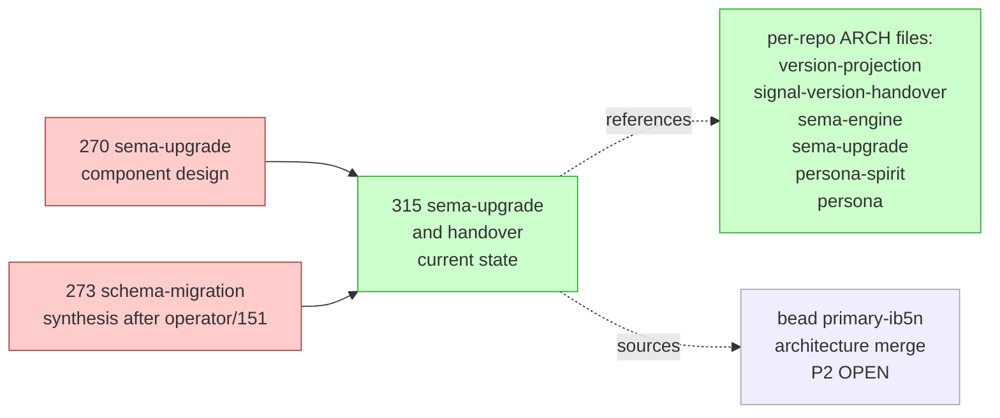
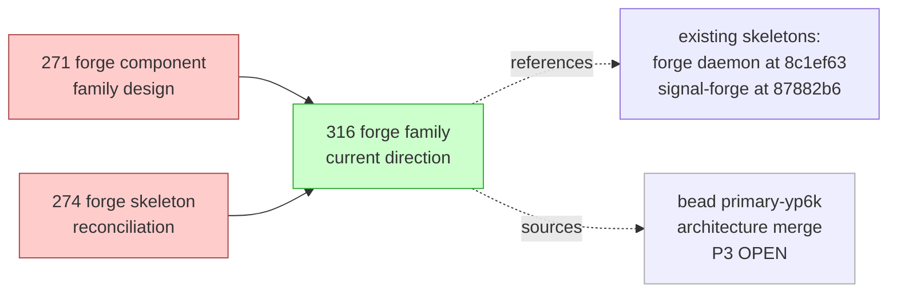

*Kind: Synthesis · Topic: aggressive-consolidation-sweep · Date: 2026-05-24*

# 314 — Aggressive consolidation sweep — 2026-05-24

## §1 Frame

Per psyche directive (spirit record 362, Maximum): *"Aggressive
consolidation: move old reports into re-contextualized new reports
leaving out stale context in the deleted old versions."* This sweep
is the aggressive complement to /311 (prior conservative sweep).

The prior sweep's "next sweep can retire" list explicitly flagged
the prime targets:

- designer/270, 271, 273, 274 (sema-upgrade + forge component
  designs) once they migrate to the respective repo ARCH files
- designer/286, 288, 289, 290 (session audit + bead snapshot +
  ARCH-distribution log + persona-diff suggestions)
- designer/295, 296 (designer-only gap closures + pattern decisions)

**In scope:** the ten reports above. Each cluster gets either
re-contextualised into a new compact report (where substance is
still load-bearing as a working artefact) or deleted (where the
substance has fully migrated to permanent docs, beads, or commits).

**Out of scope (per task constraint):** designer/303, 304, 305-v2,
305 meta-dir, 306, 307, 308, 309, 310, 311, 312, 313 — the fresh
active surface, including /313 which the prime designer is writing
in parallel. Other lanes (operator, system-specialist, third-designer,
second-designer) not touched — they are out of designer authority
for this sweep.

**Method per record 362.** For each cluster: identify still-load-
bearing substance, write ONE re-contextualised new report against
current state (vocabulary: Persona-as-orchestrator, main/next, no
`current/`, spirit records up to 365), delete the cluster's source
reports in the same commit cycle, redirect surviving citations.

## §2 Per-cluster consolidations

### §2.1 Sema-upgrade design lineage (270, 273) → /315



**Consolidated into:** `reports/designer/315-design-sema-upgrade-and-handover-current-state.md` (NEW, kind: Design).

**Substance carried forward:** the sema-upgrade-daemon shape open
question (Persona-absorbs vs separate daemon); the owner-signal-
version-handover Possible-features in three ARCH files; the Mirror
payload settled state (record 274 — raw bytes in separate container);
the recursive-bootstrap open question.

**Substance dropped:** /270 §4 (legacy `intent/*.nota` "0.01 schema"
pilot framing — superseded by spirit records 167/168 substrate
cutover); /270 §5 (boot-flow walkthrough — now permanently in
persona/ARCHITECTURE.md §1.6.7 + sema-upgrade/ARCHITECTURE.md);
/273 §2 (type-family split rationale — implicit in deployed
operator/158 layout); /273 §3 (commit-sequence high-water mark
walkthrough — fully in sema-engine/ARCHITECTURE.md); /273 §4 (Shape
A vs Shape B reconciliation — Shape A chosen, foundation landed);
/273 §5 (updated implementation picture — superseded by /287
canonical reference).

**Deleted:** `270-sema-upgrade-component-design.md`,
`273-schema-migration-synthesis-post-operator-151.md`.

**Bead updated:** `primary-ib5n` description now references /315 as
the source of substance; merge slices restated against current
state.

### §2.2 Forge family lineage (271, 274) → /316



**Consolidated into:** `reports/designer/316-design-forge-family-current-direction.md` (NEW, kind: Design).

**Substance carried forward:** the family map (forge-core /
forge-nix-builder / forge daemon / signal-forge / workspace-content-
store); the carve-outs (auth → Criome, signing → store, secrets →
mind, orchestration → orchestrate, deploy → lojix); the convergence
path from per-component wrappers to forge-core; four open design
questions; the Path A psyche-confirmation per spirit record 154.

**Substance dropped:** /271's speculative-vs-settled labelling per
section (compressed into the new report's three-line "what's
settled" summary); /271 §3 ("what is eternal in Nix's logic" —
preserved as content-addressing / hermetic builds / derivation
graphs / substitution single sentence); /271 §10 "what this report
is not" (no longer needed); /274's full reconciliation prose
(Path A is settled; the reconciliation work is complete).

**Deleted:** `271-forge-component-family-design.md`,
`274-forge-skeleton-reconciliation.md`.

**Bead updated:** `primary-yp6k` description now references /316 as
the source of substance; merge slices restated against current state.

### §2.3 Session audit + bead snapshot + ARCH distribution + persona diff (286, 288, 289, 290) — DELETE

All four are 2026-05-22 session-snapshot artefacts whose substance
has fully migrated:

- **/286 session audit** — 50+ spirit records captured (now in
  Spirit), beads filed (now in `bd ready`), session reports listed
  (each separately tracked). The historical snapshot is in the
  spirit/beads/commits triple.
- **/288 actionable beads** — bead inventory snapshot. Superseded
  by live `bd ready` and current /302 (operator audit). Bead state
  evolves; a snapshot doesn't.
- **/289 ARCH distribution log** — five commits to per-repo ARCH
  files (b5adda0c, eb80f588, 8a740ac1, 5dd65bc3, f1e2223b). Commits
  are in git log; ARCH content is in the ARCH files. The action log
  is a closed transaction.
- **/290 persona diff suggestions** — four diffs proposed for
  persona ARCH. Two landed via operator's commits + the
  spirit-per-engine commit `d0a55dc3` (per /296 §5 which is also
  retired this sweep). The remaining persona ARCH work tracks via
  active beads, not via a 2026-05-22 diff suggestion.

**No new report needed** — substance is in spirit + bd + git + ARCH;
the snapshots themselves are the stale framing record 362 targets.

**Deleted:** `286-session-audit-2026-05-22.md`,
`288-actionable-beads-2026-05-22.md`,
`289-arch-distribution-from-287-2026-05-22.md`,
`290-persona-arch-diff-suggestions-2026-05-22.md`.

### §2.4 Gap closures + pattern decisions (295, 296) — DELETE

Both are landing logs for gap-closure activity. The substance
captured is the work itself — closures landed in commits, beads
filed and visible via `bd show`, pattern-based-decision discipline
is in `skills/designer.md` (per /303 manifestation).

- **/295 designer gap closures** — Gap 3, 10, 12, 17, 22, 23, 33
  closures landed via four commits across `persona`,
  `signal-persona`, `persona-router`, `primary`. Substance is in
  the per-repo ARCH files and Persona's new INTENT.md. /304
  superseded the cross-cutting status (no need to re-state).
- **/296 pattern decisions + operator beads** — spirit-per-engine
  + Identifier rename are now in spirit (records 260, 261) and
  in persona/ARCHITECTURE.md §1.5 + signal-persona-origin/
  ARCHITECTURE.md. Eleven operator beads filed (primary-ktkc,
  primary-7x7k, primary-li3u, primary-8avm, primary-8r1o,
  primary-d1sp, primary-7ru6, primary-k92n, primary-20g4,
  primary-ogoo, primary-1cl1) — each tracked via `bd`.

**No new report needed** — substance is in spirit + bd + ARCH +
`skills/designer.md` (per /303 §2 manifestation of records 254,
255, 247, 256).

**Deleted:** `295-designer-gap-closures-2026-05-23.md`,
`296-pattern-decisions-and-operator-beads-2026-05-23.md`.

## §3 New reports created

| Path | Kind | Topic | Supersedes |
|---|---|---|---|
| `reports/designer/315-design-sema-upgrade-and-handover-current-state.md` | Design | sema-upgrade and version-handover current state | designer/270, designer/273 |
| `reports/designer/316-design-forge-family-current-direction.md` | Design | forge family current direction | designer/271, designer/274 |

Both new reports stand against current state (Persona-as-orchestrator
vocabulary, main/next, spirit records to 365), name what's already
in permanent ARCH homes vs what remains genuinely-open as design
work, and serve as sources for the respective architecture-merge
beads (`primary-ib5n`, `primary-yp6k`).

## §4 Deletions

Ten files deleted in this sweep:

```
reports/designer/270-sema-upgrade-component-design.md
reports/designer/271-forge-component-family-design.md
reports/designer/273-schema-migration-synthesis-post-operator-151.md
reports/designer/274-forge-skeleton-reconciliation.md
reports/designer/286-session-audit-2026-05-22.md
reports/designer/288-actionable-beads-2026-05-22.md
reports/designer/289-arch-distribution-from-287-2026-05-22.md
reports/designer/290-persona-arch-diff-suggestions-2026-05-22.md
reports/designer/295-designer-gap-closures-2026-05-23.md
reports/designer/296-pattern-decisions-and-operator-beads-2026-05-23.md
```

Numbers 270, 271, 273, 274, 286, 288, 289, 290, 295, 296 stay
retired in designer/ per `skills/reporting.md` §"Numbers are not
reused after deletion within a role".

## §5 Permanent-doc and surviving-report edits

Citations cleaned in surviving reports per
`skills/architecture-editor.md` §"Architecture files never reference
reports" generalised to dead-citation cleanup:

| File | Edit |
|---|---|
| `reports/designer/263-schema-specification-language-design.md` | See-also replaced /273 with /315. |
| `reports/designer/291-persona-systemd-units-for-daemon-management.md` | Removed See-also entry for /290 (dropped this sweep). |
| `reports/designer/292-designer-lane-top-issues-2026-05-22.md` | Removed See-also entries for /286 and /288 (dropped this sweep). |
| `reports/designer/302-audit-recent-operator-work-2026-05-23.md` | Removed See-also entry for /296 (dropped this sweep). |
| `reports/designer/304-unimplemented-intent-audit-2026-05-23.md` | Removed See-also entries for /295 and /296 (dropped this sweep). |
| `reports/third-designer/22-cloud-criome-design-research/2-domain-criome-component-design.md` | See-also replaced /271 with /316. |
| `reports/third-designer/22-cloud-criome-design-research/4-opt-in-feature-compilation-design.md` | See-also replaced /270 with /315; /271 + /274 with /316. |
| `reports/third-designer/23-architecture-update-2026-05-23/3-signalcore-basic-types-table.md` | See-also replaced /270 with /315. |
| `reports/second-designer/161-design-cascade-and-context-sweep/2-persona-sema-audit-and-delete-plan.md` | Final See-also replaced /270 with /315. |
| `reports/second-designer/162-contract-repo-lens-and-consolidation/4b-consolidated-current-status.md` | See-also: removed /286 and /289; added /315. |

**Bead descriptions updated:** `primary-ib5n` and `primary-yp6k`
descriptions now reference /315 and /316 as source-of-substance
for the architecture merges.

**Citations preserved as historical reasoning context** (intentionally
not edited — these are inside meta-dir prose explaining prior-sweep
decisions, not active See-also pointers): `reports/second-designer/161-design-cascade-and-context-sweep/3-context-maintenance-sweep.md`
(historical citations to designer/286, /288 in its discussion of
why /151 was KEPT); `reports/second-designer/161-design-cascade-and-context-sweep/5-intent-manifestation-gap-audit.md` (historical
mention of /289, /290 inside its manifestation-gap reasoning).

**No skill / ARCH / INTENT.md edits this sweep.** All consolidation
fit within the report tree + bead descriptions; no permanent-doc
edits needed.

## §6 Fresh designer surface after this sweep

Designer report listing after the sweep (counts: 33 files + 2
meta-dirs, down from 40 files + 2 meta-dirs):

```
249-component-intent-gap-analysis.md
257-signal-contracts-names-and-shape-audit.md
263-schema-specification-language-design.md
264-designing-protocol-and-role-spaces.md
266-persona-pi-triad-design.md
268-persona-pi-operator-input.md
279-nota-schema-language-and-version-hash.md
281-headless-pi-research.md
282-workspace-implementation-status.md
285-versionprojection-trait-and-handover-protocol-specification.md
287-version-handover-component-explained.md
291-persona-systemd-units-for-daemon-management.md
292-designer-lane-top-issues-2026-05-22.md
293-designer-and-research-batch-2026-05-23/       (meta-dir, 6 sub-reports)
294-most-important-gaps-visual.md
297-design-signal-persona-auth-rename.md
298-design-help-operations-in-components.md
299-design-origin-process-and-agent-identity.md
300-design-cli-macro-caller-context-injection.md
301-design-elegant-cli-macro-with-caller-injection.md
302-audit-recent-operator-work-2026-05-23.md
303-intent-manifestation-sweep-2026-05-23.md
304-unimplemented-intent-audit-2026-05-23.md
305-nota-user-guide-and-codec-architecture/        (meta-dir, 4 sub-reports)
305-v2-design-64bit-signal-per-component-namespacing.md
306-manifestation-sweep-round-2-2026-05-23.md
307-design-golden-ratio-namespace-split.md
308-design-pretyped-envelope-and-tap-anywhere.md
309-design-agent-component-abstraction.md
310-meta-overhaul-booking-roadmap.md
311-context-maintenance-sweep-2026-05-23.md
312-design-recursive-help-on-every-enum.md
313-great-summary-and-handover-2026-05-24.md
314-aggressive-consolidation-sweep-2026-05-24.md   (THIS REPORT)
315-design-sema-upgrade-and-handover-current-state.md
316-design-forge-family-current-direction.md
pi-api-surface-notes.md
```

Other lanes' listings unchanged from /311 §4 (operator,
second-designer, third-designer, system-specialist, cluster-operator,
etc.). This sweep stayed strictly inside the designer lane per task
scope.

## §7 Notes for prime designer

- **possibly useful:** Bead `primary-ib5n` (P2) and `primary-yp6k`
  (P3) now have re-contextualised source reports (/315, /316) that
  can land cleanly into the per-repo ARCH files. The merge work is
  shorter than the originals suggested — most of /270 + /273 has
  already migrated to ARCH; the remaining work is the four
  Possible-features sections in /315 §2.1–§2.4 and the per-skeleton
  ARCH restructure in /316 §5.

- **possibly useful:** /315 §2.3 names the Mirror payload settled
  state — three ARCH files (version-projection, signal-version-
  handover, sema-upgrade) currently carry Possible-features entries
  for the typed-vs-raw question. Per spirit record 274, raw-bytes-
  in-container wins. A small follow-up bead could collapse the
  three Possible-features entries into single-sentence statements
  per ARCH.

- **possibly useful:** /316 §3 names five carve-outs (auth → Criome,
  signing → store, secrets → mind, orchestration → orchestrate,
  deploy → lojix). The deploy carve-out (per spirit record 153) is
  signed-off but needs a bead to actually migrate the `Deploy`
  operation from `signal-forge` to `signal-lojix`. Currently
  implicit in `primary-yp6k`'s merge scope; could split out as
  smaller standalone bead if it blocks the merge.

- **note:** This sweep stayed strictly within designer/ per task
  scope; other-lane consolidations remain available for a future
  sweep (operator/157-163 are individually still load-bearing as
  cross-references from /287 and /302; third-designer/17-19 are
  still load-bearing for the cloud-track work in third-designer/22,
  /23). No retire-list candidates in other lanes' fresh surface.

- **note:** Per task constraint, /313 was not touched (prime
  designer was writing it in parallel during this sweep). All
  cross-references from this sweep's new reports are to permanent
  ARCH files, spirit records, and beads — not to /313.

- **note:** Spirit record 362 ratifies this aggressive default
  for future sweeps when psyche explicitly directs consolidation.
  The conservative drop/forward/migrate/keep frame from /311
  remains appropriate for routine periodic-review sweeps; the
  aggressive frame applies when psyche names consolidation.

## See also

- `~/primary/skills/context-maintenance.md` — the governing
  discipline; §"Per item, decide" + §3a "Design-rationale guard
  against premature DELETE" applied throughout.
- `~/primary/skills/reporting.md` §"Kinds of reports" + §"Hygiene
  — soft cap, supersession, periodic review" — the typology and
  hygiene rules.
- `reports/designer/311-context-maintenance-sweep-2026-05-23.md`
  — the prior conservative sweep this complements; flagged today's
  prime targets in its §5 retire-list.
- `reports/designer/315-design-sema-upgrade-and-handover-current-state.md`
  — sema-upgrade consolidation (this sweep's output).
- `reports/designer/316-design-forge-family-current-direction.md`
  — forge family consolidation (this sweep's output).
- Spirit records 362 (aggressive consolidation discipline), 274
  (Mirror payload settled), 154 (Path A confirmed for forge).
