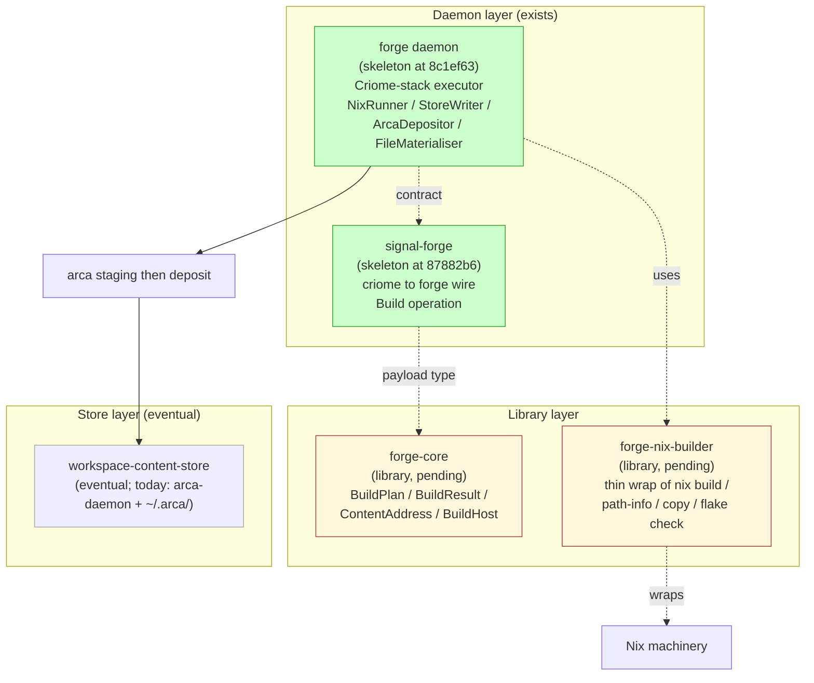
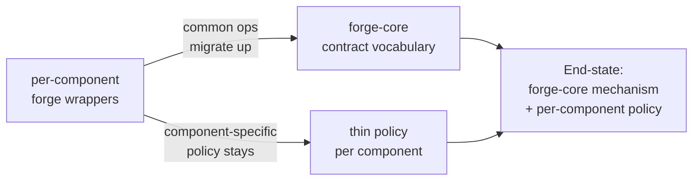

*Kind: Design · Topic: forge-family-current-direction · Date: 2026-05-24*

# 316 — Forge family current direction

*Re-contextualised consolidation of `/271` (forge component family
design, exploratory) and `/274` (forge skeleton reconciliation,
2026-05-21). Re-shaped against current intent (spirit records 153,
154, 155 — settled Path A direction) + the existing on-disk
skeletons (`forge` at `8c1ef63`, `signal-forge` at `87882b6`).
Stands as the source for bead `primary-yp6k` (canonical forge
family architecture merge).*

## §1 What forge is — and what's settled

Forge is the workspace's emerging build-system component family.
Eventual role: **replace Nix** as the workspace's build substrate.
Forge inherits the four eternal build-system abstractions —
content-addressing of inputs and outputs, derivation graphs as
build plans, hermetic builds, binary substitution from a store.
Forge sheds the cross-cutting concerns — authentication (to
Criome), binary signing (to the workspace-owned content store),
per-build secrets (probably persona-mind or a dedicated secrets
component), cross-host coordination (to persona-orchestrate).

Three pieces settled by spirit records (Maximum certainty):

- **Record 153** — `Deploy` operation moves from `signal-forge` to
  `signal-lojix`. Forge owns build; lojix owns deploy.
- **Record 154** — Existing `forge` daemon stays as the Criome-stack
  executor. `forge-nix-builder` extracts as a library *underneath*
  the existing forge, not as a replacement. Path A from /274 is
  psyche-confirmed.
- **Record 155** — Pure-Rust workspace direction; forge family
  supports the eventual Nix replacement trajectory.

## §2 The family map (current)

| Slot | Status | Purpose |
|---|---|---|
| `forge-core` | pending NEW crate | Pure-library standardisation point. `BuildPlan` / `BuildResult` / `ContentAddress` / `BuildHost` types. |
| `forge-nix-builder` | pending NEW crate (library, per record 154) | Thin wrap of Nix CLI; library underneath `forge` daemon. |
| `forge` daemon | exists at `8c1ef63` (skeleton) | Criome-stack executor; actor decomposition for NixRunner, StoreWriter, ArcaDepositor, FileMaterialiser. |
| `signal-forge` | exists at `87882b6` (skeleton) | criome ↔ forge wire contract; three-layer-aligned (commit 2026-05-20). `Deploy` operation migrates out per record 153. |
| `workspace-content-store` | eventual | Replaces Nix's store signing + substitution. Today: `arca-daemon` + `~/.arca/`. |
| Per-component forges | per-component as needed | Component-specific policy on top of `forge-core` vocabulary. |

## §3 What carves out of forge

Per /271 §4 and unchanged by current intent: forge keeps the
**build math** (content-addressing, graph walking, hermeticism)
and sheds the **cross-cutting concerns**.

| Concern | Carve-out destination | Status |
|---|---|---|
| Authentication | Criome (per-agent BLS-12-381 identity) | settled, per-agent Criome identity per record 134 |
| Binary signing | workspace-owned content-addressed store | direction settled; arca-daemon prototypes today |
| Per-build secrets | persona-mind or dedicated secrets component | speculative destination |
| Cross-host coordination | persona-orchestrate | speculative destination |
| Deploy (nixos-rebuild) | signal-lojix | settled per spirit record 153 |

## §4 The convergence path

Three steps in the convergence:

1. **Each per-component forge starts as a wrapper around
   `forge-nix-builder`**, speaking forge-nix-builder's contract and
   adding component-specific policy.
2. **Operations that prove universal migrate to `forge-core`.** As
   "build this", "substitute this address", "validate this plan"
   appear in every per-component forge, those operations move up.
3. **Eventually per-component forges are just policy.** The
   mechanism lives in `forge-core`; per-component forges become thin
   policy layers on top of the universal vocabulary.

Open question: at end-state, do per-component forges remain
distinct daemons (fault isolation, per-component owners) or
collapse into a policy record inside `forge-core`? Both shapes are
coherent.

## §5 What's deferred to bead `primary-yp6k`

The bead `primary-yp6k` (P3) carries the canonical architecture
merge into `forge/ARCHITECTURE.md` and `signal-forge/ARCHITECTURE.md`.
The merge work:

1. **`forge/ARCHITECTURE.md` — restructure existing skeleton ARCH.**
   Per record 154, the daemon stays the Criome-stack executor; add
   forge-family map (this report's §2) showing forge daemon as a
   per-component slot under the universal `forge-core` vocabulary.
   Add Possible features for forge-nix-builder extraction.
2. **`signal-forge/ARCHITECTURE.md` — narrow scope.** Per record
   153, drop `Deploy` from operations; that surface migrates to
   `signal-lojix`. Add note that `forge-core::BuildPlan` becomes
   the `Build` payload once `forge-core` lands.
3. **Possible features in both ARCH files** name the four open
   design questions (§7 below).

## §6 What forge does NOT consume

Per /274 §4d (unchanged):

- The existing `signal-forge`'s three-layer alignment.
- The criome → forge capability-token mechanism.
- The arca staging → arca-daemon deposit pattern.
- The existing forge's actor decomposition.
- Either crate's name.

## §7 Open design questions

Four questions where pattern + current intent are not strong enough
to commit — psyche affirmation likely needed at the merge step.

1. **Is `forge-core` a triad or pure-library?** Lean: pure-library
   (signal-frame precedent). The library leg has no daemon; just
   typed vocabulary.
2. **Does the workspace-owned content-addressed store consume or
   replace arca-daemon?** arca already implements content-addressing
   via Blake3 and staging-then-deposit. If arca IS the workspace's
   content-addressed store eventually, the eventual store extends
   arca rather than replacing it.
3. **How does the upgrade protocol (sema-upgrade) talk to forge?**
   Today components ship as versioned flakes; sema-upgrade keys on
   schema-addresses. Whether the protocol gets rewritten in
   forge-`BuildPlan` terms or forge exposes a flake-content
   compatibility surface is open.
4. **How do per-component forges register with forge-core?**
   Especially before `forge-core` has a daemon — registration policy
   state in `forge-nix-builder`? A `forge-registry` component?
   persona-mind? Open.

## §8 What this report supersedes

- `reports/designer/271-forge-component-family-design.md` —
  original exploratory family sketch; substance carries forward
  here updated against spirit records 153/154/155.
- `reports/designer/274-forge-skeleton-reconciliation.md` —
  Path A reconciliation; psyche-confirmed via record 154; the
  reconciliation has settled (Path A wins).

## See also

- `/git/github.com/LiGoldragon/forge/ARCHITECTURE.md` — existing
  daemon ARCH (skeleton at `8c1ef63`).
- `/git/github.com/LiGoldragon/signal-forge/ARCHITECTURE.md` —
  existing wire contract ARCH (skeleton at `87882b6`,
  three-layer-aligned).
- `skills/component-triad.md` — universal shape forge follows.
- `skills/nix-discipline.md` — what forge wraps today.
- `reports/designer/315-design-sema-upgrade-and-handover-current-state.md`
  — sibling consolidation; sema-upgrade's relationship to forge
  named in §7 question 3.
- Spirit records 153 (Deploy moves to signal-lojix), 154 (Path A
  confirmed; forge-nix-builder as library underneath), 155 (pure-
  Rust workspace direction).
- Bead `primary-yp6k` (P3) — the merge slice this report sources.
