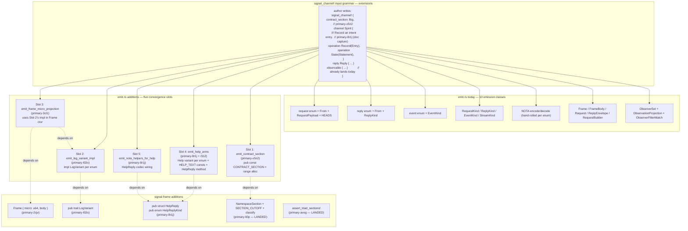

*Kind: Audit · Topic: macro-current-state · Date: 2026-05-24 · Subagent: B*

# 317-2 · Macro current state audit

## §1 Scope and method

This report audits what the current `signal_channel!` macro and
related derives emit today, then matches that surface against the
eight outstanding macro beads (`primary-l02o`, `primary-8r1j`,
`primary-915w`, `primary-3cl1`, `primary-v5n2`, `primary-avog`,
`primary-li0p`, `primary-2cjv`) and the convergence direction in
spirit records 359/363/364 plus reports /307, /308, /312.

Sources read (read-only): `signal-frame/src/*.rs` (13 modules),
`signal-frame/macros/src/*.rs` (5 modules), `nota-derive/src/
*.rs` (7 modules), `nota-codec/src/*.rs` (10 modules),
`signal-derive/src/lib.rs`, `nota-config/src/lib.rs`,
`bd show` on each of the 8 beads, tests under
`signal-frame/tests/`. All citations below use
`<file>:<line-range>` form against absolute paths under
`/git/github.com/LiGoldragon/<crate>/`.

Per the frame's §3.2, this report is strictly macro-scope; the
sema-upgrade audit (Subagent A) and next-as-dep design
(Subagent C) are out of scope. Where a gap surfaces for the
next-as-dep work, it is named at §7 for C to consume.

## §2 Per-crate current macro emission

### §2.1 `signal-frame-macros` — the `signal_channel!` proc-macro

One `#[proc_macro]` declaration, no derives or attributes
(`signal-frame/macros/src/lib.rs:51-58`):

```rust
#[proc_macro]
pub fn signal_channel(input: TokenStream) -> TokenStream {
    let spec = parse_macro_input!(input as ChannelSpec);
    if let Err(error) = validate::validate(&spec) {
        return error.into_compile_error().into();
    }
    emit::emit(&spec).into()
}
```

The crate is laid out as four modules:
- `parse.rs` — `syn::Parse` for `ChannelSpec` and every sub-block
  (301 lines, `parse.rs:1-301`).
- `model.rs` — typed model types `ChannelSpec`, `RequestBlockSpec`,
  `ReplyBlockSpec`, `EventBlockSpec`, `StreamBlockSpec`,
  `ObservableBlockSpec`, `FilterDecl`
  (`model.rs:7-116`).
- `validate.rs` — five validators called in order
  (`validate.rs:10-16`).
- `emit.rs` — codegen with 24 emit functions
  (1085 lines, `emit.rs:1-1085`).

#### §2.1.1 Public input grammar (what the author writes)

The grammar accepts one `channel <Name> { … }` block plus optional
`reply`, `event`, `stream`, `observable` siblings. Keywords are
custom: `channel`, `operation`, `reply`, `event`, `stream`, `opens`,
`belongs`, `token`, `opened`, `close`, `observable`, `filter`,
`operation_event`, `effect_event` (`parse.rs:12-27`). One `operation`
keyword introduces each request variant
(`parse.rs:112-131`); reply and event variants are bare PascalCase.

There is **no** `contract_section`, **no** `next_schema`, **no**
discriminator attribute, **no** `///` doc-comment capture. The
grammar is closed and additive — extensions land as new optional
sibling blocks or per-variant attributes.

#### §2.1.2 What gets emitted today

Per `emit::emit` (`emit.rs:16-54`) the macro produces ten classes of
output. Reading the function's call sites in order:

| # | Output | Function | Lines |
|---|---|---|---|
| 1 | Request payload enum | `emit_request_enum` | `emit.rs:238-259` |
| 2 | Reply payload enum + `From` impls | `emit_reply_enum` | `emit.rs:261-295` |
| 3 | Event payload enum (if streaming) | `emit_event_enum` | `emit.rs:297-318` |
| 4 | `impl RequestPayload + impl SignalOperationHeads` | `emit_request_payload_impl` | `emit.rs:320-333` |
| 5 | RequestKind + `kind()` projection | `emit_request_kind` | `emit.rs:335-371` |
| 6 | ReplyKind + `kind()` projection | `emit_reply_kind` | `emit.rs:373-409` |
| 7 | EventKind + `kind()` projection | `emit_event_kind` | `emit.rs:411-447` |
| 8 | StreamKind + opened/closed/stream_kind projections | `emit_stream_kind_and_witnesses` | `emit.rs:449-529` |
| 9 | `Frame`/`FrameBody`/`Request`/`ReplyEnvelope`/`RequestBuilder` aliases | `emit_frame_aliases` | `emit.rs:531-566` |
| 10 | NOTA codec impls for request/reply/event | `emit_nota_codecs` + `emit_payload_enum_codec` | `emit.rs:568-674` |

When the channel declares an `observable` block, the augmented
spec injects `Tap`/`Untap` operations, an
`ObserverSubscriptionOpened` reply variant, two event variants,
and an `ObserverStream` (`emit.rs:64-160`). Then
`emit_observable_runtime` (`emit.rs:690-963`) generates the
`ObserverSubscriptionToken` newtype + NOTA codec, the
`ObserverSubscriptionOpened` reply payload + NOTA codec, the
`ObserverFilterMatch` trait, the `ObserverSet` runtime struct,
the `ObservableSet` impl, and the `ObservationProjection`
blanket. For `filter default;`, `emit_default_filter` adds the
three-variant closed enum + codec + match impl
(`emit.rs:977-1085`).

#### §2.1.3 What the macro does NOT emit (gaps relevant to the eight beads)

Mapping the emit list to the convergence direction:

| Convergence target (spirit 359/363/364, /307/308/312) | Today? | Gap |
|---|---|---|
| Per-enum `Help` variant on Operation/Reply/Event | No | All `emit_*_enum` functions emit only the author-declared variants (`emit.rs:240-258`, `emit.rs:263-294`, `emit.rs:299-317`). |
| HelpReply / HelpReplyKind types | No | Not present in signal-frame; not emitted by the macro. |
| Per-variant `HELP_TEXT` const from `///` doc comments | No | `parse.rs:112-131` does not consume `syn::Attribute`s on variants; doc comments are dropped on the floor. |
| `frame_micro()` / `LogVariant` impl per enum | No | No `impl LogVariant` block in any `emit_*` function. |
| `CONTRACT_SECTION` const | No | `grep -n "CONTRACT_SECTION" macros/src/*.rs` returns nothing. |
| `ROOT_VERB_FIRST/LAST/COUNT` consts | No | Not in any emit fn. |
| `#[repr(u8)]` allocation of root verbs into the declared range | No | The emitted enums are plain `#[derive(...)]` enums without explicit discriminator allocation. |
| `assert_triad_sections!` helper | Yes — but landed by hand, not by macro emission. See `signal-frame/src/namespace.rs:55-86`. |
| Per-channel NOTA encode/decode | Yes — `emit_payload_enum_codec` (`emit.rs:621-674`). See §2.4 for the relationship with `NotaEnum`. |

### §2.2 `signal-frame` (top-level) — the runtime and `signal_cli!` macro

The top-level crate is not a proc-macro; it owns runtime types,
`#[macro_export]` declarative macros, and the re-export of
`signal_channel`.

#### §2.2.1 Declarative macros owned by `signal-frame`

Two declarative macros, both `#[macro_export]`:

1. `assert_triad_sections!` — `signal-frame/src/namespace.rs:55-86`.
   Takes two crate/module paths that export `CONTRACT_SECTION:
   signal_frame::NamespaceSection`, expands to a `const _: () = { …
   match … }` block that compile-fails when both contracts claim
   the same section (Small/Small or Big/Big).
2. `signal_cli!` — `signal-frame/src/command_line.rs:765-824`. Three
   arms: `signal_cli!(name, working_crate)` (convention path that
   looks up `<crate>::Frame` + `owner_<crate>::Frame`),
   `signal_cli!(name, working: <Frame>, owner: <Frame>)` (explicit
   working/owner paths), and the struct-emitting form `signal_cli!
   { pub struct N { working W; owner O; } }` (the dispatch struct
   used inside tests, see `tests/channel_macro.rs:111-116`).

#### §2.2.2 Exports and re-exports

`signal-frame/src/lib.rs:35-63` exports the runtime names the
emitted code lands against (`RequestPayload`,
`SignalOperationHeads`, `ExchangeFrame`, `StreamingFrame`,
`Request`, `Reply`, `RequestBuilder`, `SubscriptionTokenInner`,
`ObservableSet`, `ObservationProjection`). The macro itself is
re-exported (`lib.rs:62-63`) along with `paste` — load-bearing
because `signal_cli!`'s convention arm uses `paste::paste!` to
build the owner-crate ident as `[<owner_ $working_crate>]`
(`command_line.rs:767-774`).

#### §2.2.3 `NamespaceSection` const + `classify` helper (landed)

`signal-frame/src/namespace.rs:13-45` declares
`pub enum NamespaceSection { Small, Big }`,
`pub const SECTION_CUTOFF: u8 = 100`, and
`pub const fn classify(byte: u8) -> NamespaceSection`. Naming
note: the const is `SECTION_CUTOFF`, not `NAMESPACE_CUTOFF` as
/307 §1.3 named it; same 0x64/decimal-100 boundary, cosmetic
difference.

The deployed `assert_triad_sections!` (`namespace.rs:55-86`)
panics with contract names spelled into the message on
Small/Small and Big/Big arms; trybuild witnesses at
`tests/ui/namespace_sections/`.

#### §2.2.4 Gaps in `signal-frame` runtime

- **`LogVariant` trait** — not declared. ARCHITECTURE.md §349-363
  sketches the decision tree; trait itself unlanded.
- **`LogSummary` trait + 64-byte const-generic check** — bead
  `primary-bg9l` (out of the eight, cited in ARCH §468).
- **`Frame { micro: u64, body }`** — not reshaped. `frame.rs:52-60`
  still carries the single-field shape on both `ExchangeFrame` and
  `StreamingFrame`.
- **Frame-layer tap cfgs** — no `#[cfg(feature = "tap_emit_frame")]`
  anywhere in the crate.
- **`HelpReply` / `HelpReplyKind`** — not declared.

### §2.3 `nota-derive` — five `#[proc_macro_derive]` declarations

The crate exposes five derives via `nota-derive/src/lib.rs:7-99`,
all re-exported through `nota-codec` (`nota-codec/src/lib.rs:25`)
so consumers depend on a single crate.

| Derive | Lib.rs line | Codegen module | Lines |
|---|---|---|---|
| `NotaRecord` | `lib.rs:27-31` | `nota_record.rs` | `nota_record.rs:1-72` |
| `NotaEnum` | `lib.rs:37-41` | `nota_enum.rs` | `nota_enum.rs:1-169` |
| `NotaMapKey` | `lib.rs:52-56` | `nota_map_key.rs` | `nota_map_key.rs:1-39` |
| `NotaTransparent` | `lib.rs:71-75` | `nota_transparent.rs` | `nota_transparent.rs:1-46` |
| `NotaTryTransparent` | `lib.rs:94-98` | `nota_try_transparent.rs` | `nota_try_transparent.rs:1-56` |

#### §2.3.1 `NotaRecord` (struct codec)

Input: named-field struct or unit struct (tuple structs rejected
with a pointer to `NotaTransparent`, `nota_record.rs:25`). Emits
`NotaEncode` (open untagged record via `start_record_untagged`,
encode every field in declaration order, end record) and
`NotaDecode` (call `expect_positional_record_start(name_string,
field_count)`, decode each field in declaration order, end
record). Wire shape is `(field0 field1 …)` — case 2 of the
three-case PascalCase rule. Fields are positional (no labels on
the wire); the type identity is fixed by the schema position the
record occupies (`nota_record.rs:5-8`).

#### §2.3.2 `NotaEnum` (enum codec)

Input: enum where each variant is `Fields::Unit`,
`Fields::Unnamed(1)`, or `Fields::Named`. Multi-field tuple and
empty struct/tuple variants are rejected with a span'd compile
error (`nota_enum.rs:71-92`).

- Unit variant → encode as bare PascalCase identifier (`Self::V
  => encoder.write_pascal_identifier("V")`); decode from bare
  identifier (`nota_enum.rs:34-46`).
- Single-payload tuple variant `V(P)` → encode as `(V <payload>)`;
  decode by record head dispatch (`nota_enum.rs:48-69`).
- Named-field struct variant → encode fields in declaration
  order inside `(V …)`; decode in same order
  (`nota_enum.rs:94-128`).

The decoder dispatches on whether the next token opens a record
or is a bare identifier (`nota_enum.rs:144-167`); cross-form
errors are `UnitVariantInRecordForm` / `DataVariantWithoutRecord`
(`nota_enum.rs:41-46, 64-69`).

#### §2.3.3 `NotaMapKey`, `NotaTransparent`, `NotaTryTransparent`

- `NotaMapKey` (`nota_map_key.rs:12-39`) — single-field
  string-like newtype; emits `as_map_key`/`from_map_key` for
  `{key value …}` map grammar.
- `NotaTransparent` (`nota_transparent.rs:10-46`) — single-field
  tuple struct; emits codec that delegates to the inner type +
  `From` both directions; newtype invisible at the wire boundary.
- `NotaTryTransparent` (`nota_try_transparent.rs:21-56`) — like
  `NotaTransparent` but decode runs `Self::try_new(inner)` and
  maps the user's error via `Display` to `Error::Validation`;
  emits only `From<Self> for Inner` (construction is fallible).

`shared.rs` (31 lines) is a stub; not imported at audit time.

### §2.4 `nota-codec` — runtime traits the derives produce code against

`nota-codec/src/lib.rs:1-25` re-exports the runtime API:
- `Decoder` + `Encoder` (the streaming codec engines).
- `NotaDecode` + `NotaEncode` + `NotaMapKey` traits
  (`nota-codec/src/traits.rs:16-37`).
- `Error` + `Result`, `Lexer`/`Token`, `Path`.
- Re-export of the five derives from `nota-derive`.

The macro's enum codec is structurally identical to what
`NotaEnum` would emit for the same enum. Comparing
`emit_payload_enum_codec` (`emit.rs:621-674`) to `NotaEnum`
codegen (`nota_enum.rs:133-167`): same `(Variant payload)`
encode, same head-dispatch decode, same `Error::UnknownVariant`
fallback. The hand-roll is a redundant convenience — every
emitted request/reply/event variant is a single-payload tuple
variant (the grammar requires it, `parse.rs:112-131, 151-162,
182-200`), so `#[derive(NotaEnum)]` on the same enum would
produce the same wire shape.

The macro DOES use `#[derive(::nota_codec::NotaEnum)]` on the
companion `Kind` enums (`emit.rs:351, 389, 427, 499`) — those
are unit-only and sit naturally in the derive's bare-identifier
arm.

### §2.5 `signal-derive` — `#[derive(Schema)]` (orphaned)

`signal-derive/src/lib.rs:1-26` documents the derive as **role
under review**. It emits one `impl signal::Kind for T` with a
`DESCRIPTOR` const tracking shape (Record fields or Enum variants)
+ field-type mapping (String→Text, integers→Integer, Slot→SlotRef,
etc.).

The crate's continuation is tracked under `mentci-next-4v6`. **No
`LogVariant` derive exists**; `grep -n "LogVariant" signal-derive/
src/lib.rs` returns nothing. Bead `primary-l02o` proposes putting
`LogVariant` autogen into `signal-frame-macros` (the proc-macro
crate), not into `signal-derive`. If that lands, `signal-derive`'s
status as orphaned strengthens — Schema's mechanism stays in place
"pending decision" per `lib.rs:11-13`, but no live consumer rides
on it.

### §2.6 `nota-config` — declarative-macro helpers only

`nota-config/src/lib.rs:31-68` exposes two `#[macro_export]`
declarative macros:
- `impl_nota_only_configuration!(T)` — installs a
  `ConfigurationRecord` impl that returns `Error::
  RkyvNotSupported` for the rkyv-bytes path.
- `impl_rkyv_configuration!(T)` — installs a
  `ConfigurationRecord` impl that decodes rkyv bytes through
  `rkyv::from_bytes`.

These are unrelated to the eight convergence beads. The crate is
cited here only because the orchestrator frame asked: nothing in
nota-config interacts with the convergence surface.

## §3 Per-bead status

For each of the eight macro beads: (a) the design report it
realises, (b) the bead description from `bd show`, (c) whether
any code has started (grep for landmark identifiers across the
src trees of the relevant crates), (d) a 1-3 line "diff to land
it" sketch.

### §3.1 `primary-l02o` — LogVariant trait + autogen derive

**(a) Design report.** /307 §1-4 (golden-ratio split, byte-0
range), /308 §1-3 (frame micro projection), `signal-frame/
ARCHITECTURE.md` §225-360 (decision tree). Spirit records 244,
251, 326-327, 359.

**(b) Bead description.** Define `pub trait LogVariant { fn
log_variant(&self) -> u64; }` and a derive that autogens the
impl per the decision tree: flat unit-only → discriminator at
byte 0; data-carrying with LogVariant payloads → byte 0 +
recurse into payload at bytes 1-7; primitives → bit-pack;
opaque → discriminator only with warning. `signal_channel!`
must auto-derive `LogVariant` on every Operation/Reply/Effect
enum it emits.

**(c) Has code started?** No. Grep for `LogVariant`/`log_variant`
across signal-frame/macros/signal-derive returns nothing.
ARCHITECTURE.md describes the decision tree; trait undeclared.

**(d) Diff to land.** Add `LogVariant` trait to
`signal-frame/src/log_variant.rs` (~10 lines); add
`emit_log_variant_impl` to `signal-frame-macros/src/emit.rs`
that walks the augmented spec and emits one
`impl signal_frame::LogVariant for Operation` per enum (sketch
in §5.2); hook into `emit::emit` after `emit_request_payload_impl`.

### §3.2 `primary-8r1j` — Help auto-injection

**(a) Design report.** /298 (flat Help) extended by /312
(recursive Help on every enum). Spirit records 263, 271,
359/363/364.

**(b) Bead description.** Auto-inject `Help` variant into every
enum the macro emits (per /312); read `///` doc comments at
compile time + emit per-variant `HELP_TEXT` const; add
`HelpReply`/`HelpReplyKind` to signal-frame; wire daemon-side
dispatcher to the auto-generated implementation.

**(c) Has code started?** No. Grep for `HelpReply`/`HelpReplyKind`/
`HELP_TEXT` across signal-frame/nota-derive/nota-codec returns
nothing. `parse.rs:112-131` does not consume `syn::Attribute`s,
so doc-comment extraction is unbuilt.

**(d) Diff to land.** Add `HelpReply` + `HelpReplyKind` to
signal-frame (~30 LOC; sketch in §5.5); extend
`signal-frame-macros/src/parse.rs` to capture `syn::Attribute`s
into per-variant `doc_comment: Option<String>` fields; extend
each `emit_*_enum` to inject a `Help` variant + `HELP_TEXT`
const + `fn help_reply(&self) -> HelpReply` method (sketch in
§5.4). Recursion question: payload types that are enums
(Slot1, Slot2, Magnitude) need their own Help auto-injection —
either (1) require `#[derive(NotaHelp)]` on slot enums, or (2)
extend `signal_channel!` grammar to declare slot enums inline.
Open for the convergence step (§8).

### §3.3 `primary-915w` — signal_cli foundation (CLOSED)

**(a) Design report.** /301 (elegant CLI macro with Caller
injection), spirit records 263/265/266.

**(b) Bead description.** Five pieces: Caller type, Request
caller field, SingleArgument move, `ClientShape<W, O>` helper,
full `signal_cli!` main generation.

**(c) Has code started?** Yes — closed. Per `bd show`:
implemented in commit 468357ef. Verified: `Caller` at
`signal-frame/src/caller.rs:1-118`; `Request { caller, payloads
}` at `request.rs:29-33`; `SingleArgument`/`ClientShape` at
`command_line.rs` (re-exported `lib.rs:36-40`); `signal_cli!`
macro at `command_line.rs:765-824`; tests at
`tests/channel_macro.rs:174-189`.

**(d) Diff to land.** None for the bead. Remaining work under
the dependent sweep `primary-uq04.*` (per-component CLI
migrations), tracked separately.

### §3.4 `primary-3cl1` — frame_micro projection in signal_channel!

**(a) Design report.** /308 §1-2 (wire shape), §4 (tap points),
/305-v2 §7. Spirit 328.

**(b) Bead description.** Extend `signal_channel!` to emit `impl
FrameMicro for Operation` packing the root verb at byte 0 and
sub-variants in bytes 1-7. Per spirit 359, the Tier 1 micro
header is always-on by default in every `signal_channel!` invocation.

**(c) Has code started?** No. Grep for `frame_micro`/`FrameMicro`
across macros and signal-frame returns nothing.

**(d) Diff to land.** Depends on `primary-l02o` (LogVariant trait)
and `primary-2cjv` (Frame `micro: u64` field). Once both land, add
`emit_frame_micro_impl` to emit.rs that calls
`LogVariant::log_variant` on the operation; compose into the
request encoder so `Frame { micro: operation.log_variant(), body
: … }`.

### §3.5 `primary-v5n2` — contract_section grammar

**(a) Design report.** /307 §2-4 (macro mechanism, range
allocation, default vs override). Spirit 327.

**(b) Bead description.** Extend `signal_channel!` grammar to
accept `contract_section: <Small|Big>`. Default: infer from
`CARGO_PKG_NAME` prefix (`owner-`/`owner_` → Small, else Big).
Emit `pub const CONTRACT_SECTION: NamespaceSection`. Auto-allocate
variant discriminators inside the section's range
(Small=100 slots, Big=156 slots); compile-fail on overflow.

**(c) Has code started?** No. Grammar in `parse.rs:29-92` has no
`contract_section` keyword. `NamespaceSection` already exported
(`namespace.rs:13-21`); unblocking dep `primary-li0p` is closed.

**(d) Diff to land.** Add `keyword::contract_section` to
`parse.rs:12-27`; add field to `ChannelSpec` (`model.rs:7-14`);
parse the optional `contract_section: …,` before the `channel`
block, or infer from `env!("CARGO_PKG_NAME")`; add
`emit_contract_section_const` to emit.rs; extend
`emit_request_enum` with `#[repr(u8)]` + discriminator
allocation; add a validate pass on variant count ≤ section range.

### §3.6 `primary-avog` — assert_triad_sections! helper (CLOSED)

**(a) Design report.** /307 §2.2 (daemon as witness site).
Spirit 327.

**(b) Bead description.** Add `macro_rules!
assert_triad_sections!` to signal-frame so daemon crates
compile-fail on Small/Small or Big/Big collision.

**(c) Has code started?** Yes — closed. Per `bd show`: commit
c18a3fda. Verified: macro at `signal-frame/src/namespace.rs:55-86`;
trybuild witnesses at `tests/ui/namespace_sections/*.rs`; positive
test at `tests/namespace.rs:13`.

**(d) Diff to land.** None for the bead. Consumers (daemon
crates) still need to call it; tracked under `primary-muu2`
(persona triad pilot).

### §3.7 `primary-li0p` — NamespaceSection + classify helper (CLOSED)

**(a) Design report.** /307 §1 (math + canonical choice), §1.3
(symbolic names). Spirit 327.

**(b) Bead description.** Add `NamespaceSection` enum,
`SECTION_CUTOFF` const at 100, `classify` const fn.

**(c) Has code started?** Yes — closed. Per `bd show`: commit
c18a3fda. Verified: enum at `namespace.rs:13-21`; const at
`namespace.rs:29`; `classify` at `namespace.rs:32-38`; tests at
`tests/namespace.rs:16-34`.

Naming note: the bead spec called for `NAMESPACE_CUTOFF`; the
landed name is `SECTION_CUTOFF`. The auxiliary consts from /307
§1.3 (`NAMESPACE_SMALL_FIRST`, `NAMESPACE_BIG_FIRST`,
`NAMESPACE_BIG_LAST`) are not landed; inferable from the cutoff.

**(d) Diff to land.** None for the bead.

### §3.8 `primary-2cjv` — frame reshape with micro + body

**(a) Design report.** /308 §1-2 (wire shape), §7 (rkyv zero-copy
implications). Spirit 328.

**(b) Bead description.** Reshape `ExchangeFrame` and
`StreamingFrame` to add a `micro: u64` prefix field. Wire format:
4-byte length-prefix → 8-byte micro (zero-copy at offset 4) →
rkyv-encoded body. Receivers route on 12 bytes without full body
decode.

**(c) Has code started?** No — see §2.2.4. `frame.rs:52-60` still
single-field; no tap cfgs; `encode_archive`/`length_prefix`
(`frame.rs:98-116`) still over body only.

**(d) Diff to land.** (i) Add `micro: u64` at top of both Frame
structs. (ii) Update `new`/`body` ctors (`frame.rs:62-90`).
(iii) Encode/decode paths (`frame.rs:138-208`) need no codec
change — rkyv lays out fields in declaration order with `u64`
aligned to 8 bytes. (iv) Update `ClientFrame` impls
(`command_line.rs:485-564`) to populate the micro from
`LogVariant::log_variant`. (v) Cascade-fix every workspace
consumer constructing `ExchangeFrame`/`StreamingFrame` directly
— the cargo-cascade scope flagged in /308 §8 Slice 1.

### §3.9 Summary table

| Bead | Status | Repo target | Lands what | Blocks |
|---|---|---|---|---|
| `primary-l02o` | Open | signal-frame + signal-frame-macros | `LogVariant` trait + autogen derive | `primary-3cl1`, executor tap projections |
| `primary-8r1j` | Open | signal-frame + signal-frame-macros | Help on every enum + HelpReply types + doc-comment extraction | Help-discoverability across components |
| `primary-915w` | Closed | signal-frame | Caller, Request caller field, SingleArgument/ClientShape, `signal_cli!` full main | `primary-uq04.*` per-component CLI migrations |
| `primary-3cl1` | Open | signal-frame-macros | `frame_micro()` projection per channel | `primary-bann` (Spirit ingress tap point) |
| `primary-v5n2` | Open | signal-frame-macros | `contract_section:` grammar + `CONTRACT_SECTION` const + range allocation | `primary-muu2` (persona triad pilot) |
| `primary-avog` | Closed | signal-frame | `assert_triad_sections!` macro | — (witness site landed) |
| `primary-li0p` | Closed | signal-frame | `NamespaceSection` + `SECTION_CUTOFF` + `classify` | `primary-avog`, `primary-v5n2` |
| `primary-2cjv` | Open | signal-frame | `Frame { micro: u64, body }` reshape | `primary-3cl1`, `primary-bann` |

Three closed (`primary-915w`, `primary-avog`, `primary-li0p`),
five open (`primary-l02o`, `primary-8r1j`, `primary-3cl1`,
`primary-v5n2`, `primary-2cjv`). The closed beads landed the
foundation primitives (Caller/ClientShape/`signal_cli!`,
NamespaceSection, `assert_triad_sections!`); the open beads
build on those foundations.

## §4 Convergence map — one `signal_channel!` extension surface

The five open beads collapse onto five emission slots in the
existing macro pipeline. Per spirit 359/363/364 and report /312,
all five land as one consolidated extension (tracked by
`primary-ezqx`):



The five-slot extension lands in one PR per spirit 359:
embedding by default makes the Tier 1 header always-on; recursive
Help means every enum needs a Help variant; the golden-ratio
section is enforced compile-time. There is no half-state where
some enums have `LogVariant` and others don't.

### §4.1 The five convergence emissions resolved

| Emission | Driving bead | Today's state | Where it lands |
|---|---|---|---|
| (i) Per-enum Help + HelpReply | `primary-8r1j` extended by /312 | Zero — `emit_*_enum` don't inject Help; parse.rs doesn't capture doc-comments | New `emit_help_arms` + new `HelpReply`/`HelpReplyKind` in signal-frame |
| (ii) Tier 1 `frame_micro` u64 projection | `primary-3cl1` (deps: l02o + 2cjv) | Zero — no `LogVariant` impls anywhere | New `emit_frame_micro_projection` after Frame gains `micro: u64` |
| (iii) Golden-ratio-allocated discriminator range | `primary-v5n2` (deps: li0p) | Zero — no `CONTRACT_SECTION` emitted; no `#[repr(u8)]` allocation | New `emit_contract_section` + grammar arm + range validator |
| (iv) Cross-triad `assert_triad_sections!` | `primary-avog` (CLOSED) | Landed at `namespace.rs:55-86`; daemon call-site separate from `signal_channel!` | Already done; couples to (iii) at daemon compile time |
| (v) Per-channel NOTA encode/decode | (already done) | Hand-rolled in `emit_payload_enum_codec` (`emit.rs:621-674`); structurally identical to `NotaEnum` derive | No additional codec wiring needed beyond `HelpReply`/`HelpReplyKind`, which can use `NotaRecord`/`NotaEnum` derives directly in signal-frame |

Gap confirmation on (v): nota-derive's `NotaEnum` fully covers
the wire shape for the request/reply/event payload enums; the
macro's hand-rolled emission is a redundant duplicate. The
convergence needs no new NOTA codec infrastructure — only
existing derives applied to the new `HelpReply` types.

## §5 Concrete diff sketches per missing emission

Each ~10-line sketch is illustrative, not implementation. They
target `signal-frame-macros/src/emit.rs` and assume the foundation
crate-level changes (LogVariant trait, HelpReply type, Frame
reshape) have already landed in signal-frame.

### §5.1 `emit_contract_section` (Slot 1, `primary-v5n2`)

```rust
fn emit_contract_section(spec: &ChannelSpec) -> TokenStream {
    let section = spec.contract_section.unwrap_or_else(|| {
        match std::env::var("CARGO_PKG_NAME").as_deref() {
            Ok(name) if name.starts_with("owner-") || name.starts_with("owner_") => Small,
            _ => Big,
        }
    });
    let section_path = match section {
        Small => quote! { ::signal_frame::NamespaceSection::Small },
        Big   => quote! { ::signal_frame::NamespaceSection::Big   },
    };
    let first = if section == Small { 0_u8 } else { 100_u8 };
    let last  = if section == Small { 99_u8 } else { 255_u8 };
    quote! {
        pub const CONTRACT_SECTION: ::signal_frame::NamespaceSection = #section_path;
        pub const ROOT_VERB_FIRST: u8 = #first;
        pub const ROOT_VERB_LAST:  u8 = #last;
    }
}
```

Append `#[repr(u8)]` and explicit `= ROOT_VERB_FIRST + N` to each
operation enum variant in `emit_request_enum` so the macro
allocates discriminators within the range. Add a validate pass
(`validate.rs`) that variant count ≤ `last - first + 1`.

### §5.2 `emit_log_variant_impl` (Slot 2, `primary-l02o`)

```rust
fn emit_log_variant_impl(block: &RequestBlockSpec) -> TokenStream {
    let name = &block.name;
    let arms = block.variants.iter().enumerate().map(|(idx, v)| {
        let variant = &v.variant_name;
        let byte0 = idx as u8;  // resolved within section range via ROOT_VERB_FIRST
        quote! {
            Self::#variant(payload) => {
                let byte0 = #byte0 as u64;
                let upper = ::signal_frame::LogVariant::log_variant(payload) << 8;
                byte0 | upper
            }
        }
    });
    quote! {
        impl ::signal_frame::LogVariant for #name {
            fn log_variant(&self) -> u64 {
                match self { #(#arms),* }
            }
        }
    }
}
```

Variants whose payload does not implement `LogVariant` fall back
to the "discriminator only at byte 0, upper 56 bits zero" arm per
ARCHITECTURE.md §349-363; emit a `compile_warn!` (via `proc_
macro2::Diagnostic` once stable, or a deprecated stub today).

### §5.3 `emit_frame_micro_projection` (Slot 3, `primary-3cl1`)

```rust
fn emit_frame_micro_projection(spec: &ChannelSpec) -> TokenStream {
    let request_name = &spec.request.name;
    quote! {
        impl Request {
            pub fn into_frame(self, exchange: ::signal_frame::ExchangeIdentifier) -> Frame {
                let micro = ::signal_frame::LogVariant::log_variant(self.payloads().head());
                Frame::new(micro, FrameBody::Request { exchange, request: self })
            }
        }
    }
}
```

This wires the Frame's `micro: u64` (added by `primary-2cjv`) so
the constructor populates it from the head payload's
`log_variant()`. Daemons constructing frames manually keep
working; the alias gains a `micro_from_payload` constructor.

### §5.4 `emit_help_arms` (Slot 4, `primary-8r1j` extended per /312)

```rust
fn emit_help_arms(block: &RequestBlockSpec) -> TokenStream {
    let name = &block.name;
    let help_text_consts = block.variants.iter().map(|v| {
        let variant = &v.variant_name;
        let doc = v.doc_comment.as_deref().unwrap_or("");
        let const_name = format_ident!("HELP_TEXT_{}", variant);
        quote! { pub const #const_name: &'static str = #doc; }
    });
    let arms = block.variants.iter().map(|v| {
        let variant = &v.variant_name;
        let doc = v.doc_comment.as_deref().unwrap_or("");
        quote! { Self::#variant(_) => ::signal_frame::HelpReply {
            name: stringify!(#variant).into(),
            description: #doc.into(),
            kind: ::signal_frame::HelpReplyKind::Variant,
            children: vec![],
            parent: Some(stringify!(#name).into()),
        } }
    });
    quote! {
        #(#help_text_consts)*
        impl #name {
            pub fn help_reply(&self) -> ::signal_frame::HelpReply {
                match self { #(#arms),* Self::Help => Self::channel_help_reply() }
            }
            pub fn channel_help_reply() -> ::signal_frame::HelpReply { /* enumerate variants */ }
        }
    }
}
```

The `Help` variant itself is auto-injected at the end of the
operation enum (after the contract-author variants but before the
observable-injected Tap/Untap). Per /307 §4.2 the auto-injected
Help variants land at the top of the section to reserve the low
discriminators for human-meaningful operations.

### §5.5 `emit_nota_helpers_for_help` (Slot 5, `primary-8r1j`)

```rust
// In signal-frame (not emit.rs) — one-time:
#[derive(NotaRecord, Debug, Clone, PartialEq)]
pub struct HelpReply {
    pub name: String,
    pub description: String,
    pub parent: Option<String>,
    pub children: Vec<String>,
    pub kind: HelpReplyKind,
}

#[derive(NotaEnum, Debug, Clone, PartialEq)]
pub enum HelpReplyKind { Channel, Enum, Variant }
```

`HelpReply` rides the wire as a normal `(field0 field1 …)` record
via `NotaRecord`. The macro adds a `HelpReply` variant to the
reply enum (`emit_reply_enum`); the daemon's handler dispatches
to `op.help_reply()` and wraps the result in
`Reply::HelpReply(reply)`. Per /312 §7, all Help replies use the
same shape so the CLI's print routine handles every depth
identically.

## §6 Convergence dependency order

The five open beads can land in one PR (per `primary-ezqx`)
because they all extend the same `signal-frame-macros/src/emit.rs`
file. Dependency-honest ordering inside that PR:

1. `primary-2cjv` — Frame reshape; pure data-struct change.
2. `primary-l02o` — LogVariant trait + derive; independent
   addition to signal-frame + new emit.rs slot.
3. `primary-v5n2` — `contract_section` grammar + range allocation;
   parse.rs keyword + emit.rs slot; uses the landed
   `NamespaceSection`.
4. `primary-3cl1` — frame_micro projection; composes 1 + 2.
5. `primary-8r1j` — Help auto-injection per /312; extends parse.rs
   to consume doc comments + emit.rs slot; touches every emitted
   enum.

Closed deps already in place: `primary-li0p` (NamespaceSection),
`primary-avog` (assert_triad_sections!), `primary-915w`
(signal_cli foundation). The convergence map in §4 shows the
upstream relationships.

## §7 Next-as-dependency gaps (for Subagent C)

The macro is single-version today; specific gaps the next-as-dep
design must close, named here so C can pick them up:

- **(a) No version-aware emission.** Every emit fn produces code
  for one schema version (the current crate's `ChannelSpec`).
  The macro reads exactly one `signal_channel!` per call site
  (`lib.rs:51-58`); no second-spec mechanism.
- **(b) No second-schema consumption.** Grammar
  (`parse.rs:1-301`) has no `next_schema:` keyword; `ChannelSpec`
  model (`model.rs:7-14`) has no field for next-crate types.
- **(c) No projection emission.** No `impl
  VersionProjection<v0_1_0::Op> for v0_1_1::Op` is emitted. Per
  /285/287 the trait exists in signal-version-handover but the
  macro does not consume it.
- **(d) No `From<historical::T>` emission.** The Spirit
  Certainty→Magnitude widening (frame §3.3 worked example) has
  no current macro path; the macro doesn't see the historical
  type at all.
- **(e) Bootstrap surface.** At v0.1.0-land time there is no
  v0.1.1 to depend on; the macro has no concept of "absent next"
  vs "present next" — design space for C.

This audit is read-only on the design space; C resolves.

## §8 Open questions for the orchestrator

- **NOTA codec duplication.** `emit_payload_enum_codec`
  (`emit.rs:621-674`) duplicates `#[derive(NotaEnum)]`.
  Recommendation: keep the hand-roll — composes cleanly with
  augmented-spec observable injection; avoids a circular dep on
  nota-derive at proc-macro time.
- **Doc-comment discipline timing.** Per /312 §6, missing `///`
  is warn-or-error. Workspace has many undoc'd variants today
  (the macro doesn't read them). Soft-default (warn) keeps the
  PR landable without a workspace-wide sweep.
- **Recursive Help on author-declared slot enums.** Per /312 §1,
  every emitted enum gets Help — but slot enums (Slot1, Slot2,
  Magnitude) are author-declared outside `signal_channel!`.
  Options: (1) require `#[derive(NotaHelp)]` on slot enums (light,
  spreads rule); (2) extend grammar with inline `slot_enum Slot1
  = TopicArea { … }` per /312 §3 (heavier, keeps discipline in
  one place).
- **Discriminator allocation timing.** Per /307 §4.2, auto-injected
  Help variants land at the top of the section (0xFE/0xFF for Big)
  so contract-defined verbs get low discriminators. Requires emit
  order to allocate Help-discriminators first while emitting Help
  variant declaration last. Fold into `primary-v5n2` or a
  follow-up bead?
- **Schema derive post-LogVariant.** `signal-derive`'s `Schema`
  is documented as orphan (`lib.rs:11-13`). If `LogVariant` lands
  in `signal-frame-macros` per `primary-l02o`, the case for
  retiring `signal-derive` strengthens. Confirm or defer?

## See also

- Frame:
  `reports/designer/317-sema-upgrade-and-macro-convergence-audit/0-frame-and-method.md`
- Sibling slices:
  `…/1-sema-upgrade-path-audit.md` (Subagent A),
  `…/3-next-as-dependency-design.md` (Subagent C)
- `reports/designer/307-design-golden-ratio-namespace-split.md`
- `reports/designer/308-design-pretyped-envelope-and-tap-anywhere.md`
- `reports/designer/312-design-recursive-help-on-every-enum.md`
- Source citations are inline (file:line); the file list of
  read sources is in §1.
