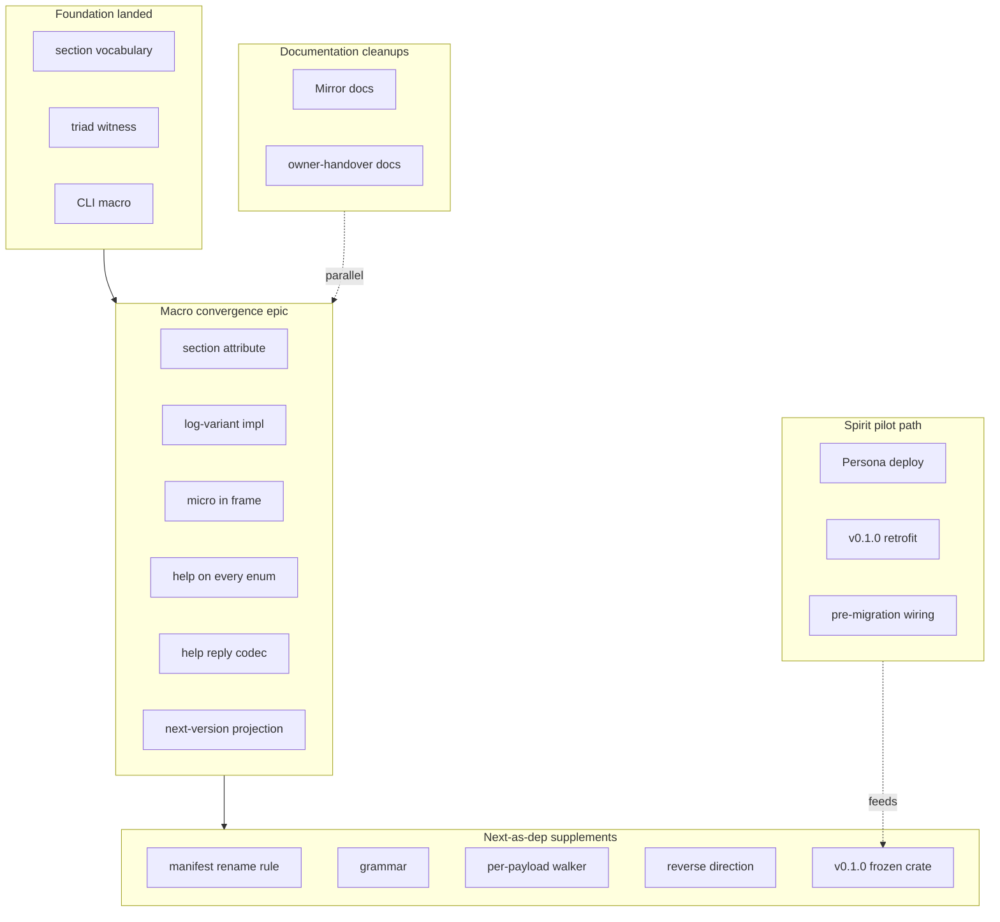
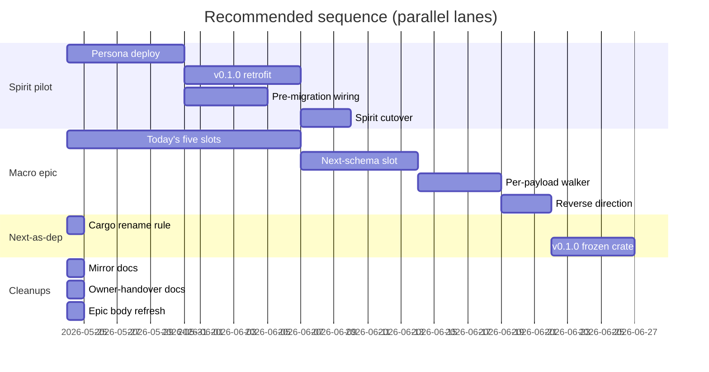

*Kind: Synthesis · Topic: sema-upgrade-and-macro-convergence-integrated-picture · Date: 2026-05-24*

# 317 / 4 — Overview (orchestrator synthesis)

Integrates the three sibling slices in this directory:

- `./1-sema-upgrade-path-audit.md` (Subagent A — sema-upgrade gap matrix + production-pilot trap)
- `./2-macro-current-state-audit.md` (Subagent B — 5 of 8 macro beads still open; 5-slot convergence map)
- `./3-next-as-dependency-design.md` (Subagent C — `next_schema:` block design; 6 new beads)

Reconciled against the operator's independent audit in
`reports/operator/166-sema-upgrade-and-schema-macro-current-state-2026-05-24.md`
(landed in parallel; confirms the 3 closed beads, names
`primary-wdl6` as the v0.1.0 retrofit gate, names `primary-l3h5`
as the open `sema-upgrade-daemon` bead).

## §1 The single integrated picture

Mapping the short labels back to the workspace identifiers and
their target locations:

| Lane | Label | Bead | What it adds |
|---|---|---|---|
| Foundation | section vocabulary | `primary-li0p` | `NamespaceSection` + `SECTION_CUTOFF` + `classify` in signal-frame |
| Foundation | triad witness | `primary-avog` | `assert_triad_sections!` macro |
| Foundation | CLI macro | `primary-915w` | `signal_cli!` foundation (Caller / ClientShape / main) |
| Macro epic | section attribute | `primary-v5n2` | `contract_section:` grammar + `CONTRACT_SECTION` const + range allocation |
| Macro epic | log-variant impl | `primary-l02o` | `LogVariant` trait + per-enum autogen impl |
| Macro epic | micro in frame | `primary-3cl1` + `primary-2cjv` | `Frame { micro, body }` reshape + projection from `log_variant()` |
| Macro epic | help on every enum | `primary-8r1j` per /312 | `Help` variant + `HELP_TEXT` consts + `help_reply()` per enum |
| Macro epic | help reply codec | `primary-8r1j` per /312 | `HelpReply` / `HelpReplyKind` types in signal-frame |
| Macro epic | next-version projection | NEW per spirit 366 | `next_schema { … }` keyword + `VersionProjection` impl emission |
| Next-as-dep | manifest rename rule | NEW | Cargo `*-next` rename convention documented in workspace |
| Next-as-dep | grammar | NEW | `next_schema` parser block in `signal-frame-macros` |
| Next-as-dep | per-payload walker | NEW | field-by-field projection emission per payload type |
| Next-as-dep | reverse direction | NEW | `reverse;` keyword inside `next_schema` block |
| Next-as-dep | v0.1.0 frozen crate | NEW | published `signal-persona-spirit` v0.1.0 + first real cutover |
| Spirit pilot | Persona deploy | `primary-a5hu` | deploy the Persona engine (code on disk) |
| Spirit pilot | v0.1.0 retrofit | `primary-wdl6` | retrofit deployed v0.1.0 daemon with upgrade socket + protocol |
| Spirit pilot | pre-migration wiring | NEW per `/317-1 §4` | run `sema-upgrade-temporary` before starting next daemon, so `commit_sequence` markers match |
| Cleanups | Mirror docs | NEW | retire Possible-features in `version-projection` + `signal-version-handover` ARCH (spirit 274 settled) |
| Cleanups | owner-handover docs | NEW | update `/315 §2.2` (`owner-signal-version-handover` EXISTS on disk per `/317-1 §2.3`) |

The picture has **four lanes that can land in parallel**:

1. **Macro convergence (Slot 1-5 today + Slot 6 from spirit 366)** —
   one PR landing all five open macro beads + the new
   `emit_next_schema_projections` per `primary-ezqx`. Touches
   `signal-frame-macros/src/emit.rs` + `signal-frame/src/lib.rs`
   only.
2. **Next-as-dep supplements** — Cargo rename convention,
   per-payload struct emission, reverse keyword, first frozen
   v0.1.0 crate. Lands after Slot 6 in the macro PR.
3. **Spirit pilot deploy gates** — Persona deploy
   (`primary-a5hu`), v0.1.0 retrofit (`primary-wdl6`), production
   pre-migration step (NEW; surfaced by `/317-1 §4`).
4. **1-PR cleanups** — Mirror Possible-features retirement
   (`/317-1 §5`); `/315 §2.2` update (`/317-1 §2.3`); `primary-ezqx`
   bead body refresh.

## §2 The consolidated epic — primary-ezqx absorbs eleven slots

Today `primary-ezqx` covers the five open macro beads (slots 1-5
in §1). The next-as-dep design adds **one slot of macro emission**
(Slot 6 = emit_next_schema_projections) plus **five supplementary
beads** outside the macro PR. Recommendation: the epic absorbs Slot
6 and re-frames the supplementary beads as dependent work tracked
under the same epic ID.

### §2.1 Inside the one consolidated macro PR (lands together)

| Slot | Bead | What it adds to `emit.rs` |
|---|---|---|
| 1 | `primary-v5n2` | `contract_section:` keyword + `CONTRACT_SECTION` const + range allocation |
| 2 | `primary-l02o` | `impl LogVariant` per Operation/Reply/Event enum |
| 3 | `primary-3cl1` | `Request::into_frame` populates `micro` field from `log_variant()` |
| 4 | `primary-8r1j` (per /312) | `Help` variant + `HELP_TEXT` consts + `help_reply()` method per enum |
| 5 | `primary-8r1j` (per /312) | `HelpReply` / `HelpReplyKind` types in signal-frame; NOTA codec via existing derives |
| 6 | NEW (per spirit 366) | `next_schema { … }` keyword + `Forward<Channel><Operation>` witness + `impl VersionProjection<Self::Op, next::Op>` |

Plus three signal-frame additions that the macro slots ride on:

| Bead | Adds to signal-frame |
|---|---|
| `primary-2cjv` | `Frame { micro: u64, body }` reshape |
| `primary-l02o` (trait half) | `pub trait LogVariant { fn log_variant(&self) -> u64; }` |
| `primary-8r1j` (types half) | `pub struct HelpReply` + `pub enum HelpReplyKind` |

**Slot 6 is the ONLY net-new bead the next-as-dep design adds to
the macro PR**. Everything else either was already tracked
(slots 1-5) or lives outside the macro layer (§2.2).

### §2.2 Outside the macro PR (lands after; can parallel-pick)

| New bead | What it does | Hours |
|---|---|---|
| NEW · Cargo `*-next` rename convention | `protocols/active-repositories.md` + `skills/component-triad.md` rule update; no component edits | ~1 |
| NEW · per-payload struct field-walk emission | extends Slot 6 with `Forward<PayloadType>` per record (`/317-3 §9.4`) | ~3-4 |
| NEW · `reverse` keyword | second direction (`/317-3 §9.5`) | ~2-3 |
| NEW · signal-persona-spirit v0.1.0 frozen crate | first real cutover, delete inline `mod historical` from sema-upgrade migration (`/317-3 §9.6`) | ~3-4 |
| NEW · production pre-migration step | wire `start_next_component_unit` to run `sema-upgrade-temporary` before next daemon starts (`/317-1 §4` trap) | ~2-4 |

**Total estimated operator-hours across both layers: ~14-19 for
the next-as-dep supplements + ~10-15 for the macro PR's five
open slots = ~25-35 total** for the whole epic (parallelisable
across 3-4 operator sessions).

## §3 Spirit pilot tie-back — what blocks `primary-x3ci`

The Spirit cutover bead (`primary-x3ci`) ships v0.1.0 → v0.1.1
in production. Pulling the critical path from `/317-1 §4`:

### §3.1 Hard blockers (must land before cutover)

- **`primary-a5hu` Persona deploy** — code on disk, deploy gate
  (`/317-1 §4`, `/315 §6`). Persona-as-orchestrator IS live in
  `persona/src/upgrade.rs` (746 lines) + `persona/src/manager.rs:260-401`;
  the deploy itself is what's missing.
- **`primary-wdl6` Spirit v0.1.0 retrofit** — the deployed v0.1.0
  daemon does NOT yet own a private upgrade socket
  (`sema-upgrade/ARCHITECTURE.md:151-156`). The retrofit
  build wires the third socket + adds the protocol handler to a
  v0.1.0-shaped daemon. Per `/166` this is the immediate gate
  blocking `primary-x3ci`.
- **NEW · production pre-migration step** — the trap surfaced by
  `/317-1 §4`:
  `HandoverDriver::ensure_next_marker_matches`
  (`persona/src/upgrade.rs:479-501`) requires both daemons'
  markers to match on `commit_sequence`; a freshly started next
  daemon has `commit_sequence == 0` and will be rejected. The
  sandbox solves this by running `sema-upgrade-temporary` BEFORE
  starting the next daemon (`sema-upgrade/flake.nix:403-407`); the
  production path needs an equivalent step that is unattested in
  `persona/ARCHITECTURE.md`. This is a NEW bead worth filing
  immediately — it's a deploy-time correctness gate, not a
  research item.

### §3.2 NOT blockers for the first cutover (deferrable)

- Full `Divergence` sink with persistence (in-memory is fine for
  forward-only cutover).
- Full `RecoverFromFailure` (partial state-machine recovery is
  enough; production stop-old / start-new is the degenerate path).
- Blake3 `ContractVersion` generator (placeholder bytes compare
  equal-to-equal for marker validation; documented non-goal at
  `version-projection/ARCHITECTURE.md:141-142`).
- Production raw-bytes side container per
  `signal-version-handover/ARCHITECTURE.md:213-216` (the daemon
  receiver decodes directly today; forward-projection-on-sender
  means the receiver always sees bytes that decode as its own
  shape).
- `sema-upgrade-daemon` triad — `/315 §2.1` lean is
  persona-absorbs.

### §3.3 The next-as-dep work is NOT a Spirit-pilot blocker

Subagent C's design is forward-looking: it lands the macro
emission shape so future cutovers (Spirit v0.1.1 → v0.1.2; second
component's first cutover) use the macro-generated
`VersionProjection` impls. The first Spirit cutover (v0.1.0 →
v0.1.1) ships with the current hand-rolled migration file. The
next-as-dep design's `/317-3 §9.6` first-real-cutover bead
RETROFITS the v0.1.0 crate after the pilot succeeds — turning the
hand-rolled `mod historical` into a real crate dependency.

Putting it crisply: **the macro convergence epic and the Spirit
pilot share an epic ID (`primary-ezqx`) but don't block each
other**. Operator can pick either lane.

## §4 Landing order — recommended sequence

Gantt row identifiers to bead / report locator:

| Row | Bead / locator |
|---|---|
| Persona deploy | `primary-a5hu` |
| v0.1.0 retrofit | `primary-wdl6` |
| Pre-migration wiring | NEW, surfaced by `/317-1 §4` |
| Spirit cutover | `primary-x3ci` |
| Today's five slots | `primary-ezqx` slots 1-5 (`v5n2`, `l02o`, `3cl1`, `8r1j`×2) |
| Next-schema slot | `primary-ezqx` slot 6 (NEW per spirit 366) |
| Per-payload walker | NEW per `/317-3 §9.4` |
| Reverse direction | NEW per `/317-3 §9.5` |
| Cargo rename rule | NEW per `/317-3 §9.1` |
| v0.1.0 frozen crate | NEW per `/317-3 §9.6` |
| Mirror docs | `/317-1 §5` (item 1) |
| Owner-handover docs | `/317-1 §2.3` |
| Epic body refresh | `primary-ezqx` description rewrite |

The sequence has three independent critical paths:

- **Spirit pilot (4 lanes parallel through deploy)** — Persona +
  Pre-migration + v0.1.0 retrofit, then cutover.
- **Macro convergence (one PR, sequential within)** — 5 today's
  slots, then Slot 6, then per-payload walk + reverse.
- **Cleanups (independent)** — three 1-PR refactors that can land
  any time without dependency.

The v0.1.0 frozen crate (`/317-3 §9.6`) lands AFTER both the
pilot succeeds AND the macro convergence ships. It RETROFITS the
hand-rolled historical shape into a real dependency; without the
pilot succeeding, freezing the wrong shape would be wasted work;
without the macro convergence, there's no macro emission to
consume the new dependency.

## §5 What to retire — three small surgical edits

Per `/317-1 §5` + `/317-1 §2.3`:

1. **`/315 §2.2` — owner-signal-version-handover entry.** Subagent
   A confirms the contract exists on disk (228 lines + 248 test
   lines). The /315 entry should retire to a one-line
   acknowledgement. Bead: 1-PR designer doc edit.
2. **Mirror-payload Possible-features in three ARCH files.** Per
   spirit 274 (Maximum), Mirror is raw bytes in a separate
   container — settled. `version-projection/ARCHITECTURE.md:159-164`
   + `signal-version-handover/ARCHITECTURE.md:244-254` should
   retire to a one-sentence Constraint pointing at spirit 274.
   `sema-upgrade/ARCHITECTURE.md:186-193` carries a DIFFERENT
   concern (divergence sink home) and stays as a genuine
   Possible-feature.
3. **`primary-ezqx` bead body refresh.** The epic was scoped
   before `primary-915w` / `primary-avog` / `primary-li0p` closed
   and before spirit 366/367 + `/317`. Update the bead description
   to reflect the 11-slot consolidated picture from `§2`.

## §6 Open psyche questions — distilled from A/B/C/166

Eight questions worth ratifying before the macro PR lands. Lean
recommendations included; each is an open answer waiting on
psyche confirmation.

### §6.1 Macro convergence — five questions from `/317-2 §8`

1. **NOTA codec duplication.** `emit_payload_enum_codec`
   duplicates `#[derive(NotaEnum)]` structurally. **Lean:** keep
   the hand-roll. Avoids a circular dep on nota-derive at
   proc-macro time and composes cleanly with the augmented-spec
   observable injection. Confirm.
2. **Doc-comment discipline timing.** Per /312 §6, missing `///`
   on a variant is warn-vs-error. **Lean:** soft-default (warn)
   for the first release; tighten to error after a workspace-wide
   doc sweep. Confirm.
3. **Recursive Help on author-declared slot enums.** Slot1, Slot2,
   Magnitude are declared OUTSIDE `signal_channel!` per the Spirit
   contract today. Options: (a) require `#[derive(NotaHelp)]` on
   slot enums; (b) extend grammar with inline `slot_enum Slot1 =
   TopicArea { … }` per /312 §3. **Lean:** (b) — keeps the
   discipline in one place (the channel macro) and matches /312's
   "every emitted enum carries Help."
4. **Discriminator allocation timing.** Per /307 §4.2, auto-injected
   Help variants land at the TOP of the section (0xFE/0xFF in Big)
   so contract-defined verbs get the low discriminators. Requires
   the emit pass to allocate Help-discriminators first while
   declaring the Help variant last in source. **Lean:** fold into
   `primary-v5n2` (the contract_section grammar bead) — same
   emission machinery.
5. **Schema derive post-LogVariant.** `signal-derive`'s `Schema`
   is "role under review" per `signal-derive/src/lib.rs:11-13`.
   If `LogVariant` lands in `signal-frame-macros` per
   `primary-l02o`, the case for retiring `signal-derive` strengthens.
   **Lean:** retire after the macro PR; the live workspace audit
   shows no consumer in production.

### §6.2 Next-as-dep — three questions from `/317-3 §10`

6. **Freezing protocol for v0.1.N.** Where does the frozen v0.1.0
   crate live? Options: (a) `v0.1.0` branch in the same repo; (b)
   separate `signal-persona-spirit-v0_1_0` repo; (c) git tag in
   the same repo. **Lean:** (a) branch-per-frozen-version — lowest
   churn under the current ghq + `branch = "main"` shape. (c)
   becomes natural once a registry exists. Confirm.
7. **`src/migration.rs` convention.** The hand-written `From`
   impls (the only domain code in the frozen crate) are
   bug-risk-load-bearing. **Lean:** every schema crate that declares
   `next_schema` puts hand-written `From` impls in
   `src/migration.rs`; workspace skill enforces; macro doesn't.
   Confirm.
8. **Owner-contract uniform discipline.** Does the macro require
   a `next_schema` declaration on owner-signal-X contracts even
   when all variants project through Identity (which they
   overwhelmingly do)? **Lean:** yes — uniform discipline; the
   explicit declaration makes the upgrade path visible; the
   Identity impls are one-line ceremonies.

## §7 What this overview does NOT cover

- **`sema-upgrade-daemon` triad emergence.** /315 §2.1 names this
  as Persona-absorbs unless a second component's cutover surfaces
  a scope problem. `primary-l3h5` tracks it per `/166`. Not
  re-litigated here.
- **`primary-bg9l` (LogSummary Tier 2).** Out of the eight macro
  beads tracked in `/317-2`; lives in its own bead pool.
- **Tap-anywhere observability beyond what `primary-3cl1` lands.**
  /308 §4 lays out six tap points; only the first is in this
  epic's scope. Operator-side wiring (`primary-bann` for Spirit
  ingress tap) lives in a downstream pool.
- **`signal-frame` API-level changes beyond the three named
  types** (Frame reshape, LogVariant trait, HelpReply types).
- **Agent component abstraction** (`/309`); separate epic.
- **Sema-upgrade prototype-to-production retirement of the
  external `sema-upgrade-handover-temporary` bin**; lands
  naturally when v0.1.0 retrofit completes (`primary-wdl6`).

## See also

- `./0-frame-and-method.md` — orchestrator frame for this dispatch
- `./1-sema-upgrade-path-audit.md` — Subagent A (deployed code
  state + gap matrix + production-pilot trap)
- `./2-macro-current-state-audit.md` — Subagent B (per-bead status
  + 5-slot convergence map + concrete diff sketches)
- `./3-next-as-dependency-design.md` — Subagent C (Cargo
  mechanic, next_schema block, worked Spirit Certainty→Magnitude
  example, 6 supplementary beads)
- `reports/operator/166-sema-upgrade-and-schema-macro-current-state-2026-05-24.md`
  — parallel operator audit (closed beads confirmation + `primary-wdl6`
  + `primary-l3h5`)
- `reports/designer/307-design-golden-ratio-namespace-split.md` —
  golden-ratio section split
- `reports/designer/308-design-pretyped-envelope-and-tap-anywhere.md`
  — Frame envelope reshape + tap discipline
- `reports/designer/312-design-recursive-help-on-every-enum.md` —
  Help-as-noun-at-end-of-path
- `reports/designer/315-design-sema-upgrade-and-handover-current-state.md`
  — sema-upgrade current state (this overview's direct upstream
  for `/315 §2.2` retirement + Mirror Possible-features cleanup)
- Spirit records 208/209/210 (Persona-as-orchestrator), 274
  (Mirror raw bytes Maximum), 327 (golden-ratio split), 328
  (Frame pre-typed envelope), 359/363/364 (recursive Help noun),
  365 (CLI single-NOTA-argument), 366 (next-as-dependency
  Maximum), 367 (macro convergence bundle Maximum).
- Beads `primary-ezqx` (macro convergence epic — absorbs Slots
  1-6), `primary-v5n2`, `primary-l02o`, `primary-3cl1`,
  `primary-8r1j`, `primary-2cjv` (open macro beads),
  `primary-915w`, `primary-avog`, `primary-li0p` (closed
  foundation), `primary-a5hu` (Persona deploy), `primary-wdl6`
  (v0.1.0 retrofit), `primary-x3ci` (Spirit cutover),
  `primary-l3h5` (sema-upgrade-daemon).
