*Kind: Audit · Topic: rename-inventory-and-dependency-graph · Date: 2026-05-24*

# 318 / 1 — Rename inventory + dependency graph (Subagent A)

Audit of every workspace surface touched by the two-move sweep ratified
psyche 2026-05-24: upgrade triad merger (spirit 369) plus persona-
prefix removal (spirit 371). The question every section answers: what
exactly changes name, who depends on it, and in what order can the
operator land each rename without ever leaving the workspace
uncompileable.

The audit is read-only. No code edits. Source-of-truth claims cite
file:line; counts cite the exact grep used. Two confirmation calls to
the deployed `spirit` daemon establish the intent baseline (see §1
and §8.4).

## §1 Inputs to this audit

- **Spirit 369** (Decision · upgrade-component · Maximum), via
  `spirit '(Observe (Records ((Some "upgrade-component") None
  SummaryOnly)))'`: merge sema-upgrade + version-handover into one
  `upgrade` triad: `upgrade` daemon + `signal-upgrade` working +
  `owner-signal-upgrade` owner. `version-projection` stays a library.
  PrototypeHandover deletes. Two MigrationIndex types collapse to
  one. AttemptHandover/AttemptUpgrade collapse to one AttemptUpgrade.
- **Spirit 371** (Decision · component-naming · Maximum), via
  `spirit '(Observe (Records ((Some "component-naming") None
  SummaryOnly)))'`: drop persona- prefix from component crate names
  workspace-wide. Exceptions that KEEP the prefix: agent-harness
  components (persona-codex, persona-claude, persona-pi,
  persona-gemini, persona-open-code). Persona itself stays persona
  (its NAME, not a prefix).
- **Spirit 280** (Decision · component-shape · Maximum): the original
  drop-the-persona-prefix decision, named the exact list of supervised
  components (spirit, router, message, mind, orchestrate, harness,
  terminal, introspect, system, engine-management). Carried forward
  by 371 with the same coverage and an expanded exception list.
- **Spirit 309** (Decision · component-shape · Maximum): **delete the
  `persona-sema` repo**. Not a rename target. Verify contents first,
  absorb anything useful, then delete from GitHub. This is the
  binding decision: persona-sema does NOT rename to `sema` — it
  retires.
- **Spirit 310** (Decision · component-shape · Maximum): rename
  persona-llm-client → `agent`. Agent is its own triad: `agent` CLI
  + `agent-daemon` + `signal-agent` + `owner-signal-agent`. Agent is
  a SUPERVISED component, not a wrapper. See §8.4 for the collision
  analysis with /309's `persona-agent` triad.
- **Active repository map**:
  `/home/li/primary/protocols/active-repositories.md`.
- **Repo directory listing**:
  `ls /git/github.com/LiGoldragon/` (140 directories total).

## §2 Full repo rename list

Every renamed crate has three citations: the current crate name in
its `[package]` block, the new crate name proposed by spirit 369/371,
and the repo path on disk. The kebab-cased package name on disk
becomes the new repo name; the snake-cased `[lib].name` follows the
same drop.

### §2.1 Persona supervised components — drop persona- prefix

These ten triads (where their parts exist) follow spirit 371. The
table includes daemon + working signal + owner signal per triad.
Tag in the "Owner sig" column shows whether the owner-signal repo
exists on disk today.

| Current crate | New crate | Repo path on disk | Reason | Agent-harness exception |
|---|---|---|---|---|
| `persona_spirit` | `spirit` | `/git/github.com/LiGoldragon/persona-spirit` | persona-prefix | no |
| `signal_persona_spirit` | `signal_spirit` | `/git/github.com/LiGoldragon/signal-persona-spirit` | persona-prefix | no |
| `owner_signal_persona_spirit` | `owner_signal_spirit` | `/git/github.com/LiGoldragon/owner-signal-persona-spirit` | persona-prefix | no |
| `persona_mind` | `mind` | `/git/github.com/LiGoldragon/persona-mind` | persona-prefix | no |
| `signal_persona_mind` | `signal_mind` | `/git/github.com/LiGoldragon/signal-persona-mind` | persona-prefix | no |
| `owner_signal_persona_mind` | `owner_signal_mind` | `/git/github.com/LiGoldragon/owner-signal-persona-mind` | persona-prefix | no |
| `persona_router` | `router` | `/git/github.com/LiGoldragon/persona-router` | persona-prefix | no |
| `signal_persona_router` | `signal_router` | `/git/github.com/LiGoldragon/signal-persona-router` | persona-prefix | no |
| `owner_signal_persona_router` | `owner_signal_router` | `/git/github.com/LiGoldragon/owner-signal-persona-router` | persona-prefix | no |
| `persona_message` | `message` | `/git/github.com/LiGoldragon/persona-message` | persona-prefix | no |
| `signal_persona_message` | `signal_message` | `/git/github.com/LiGoldragon/signal-persona-message` | persona-prefix | no |
| `persona_introspect` | `introspect` | `/git/github.com/LiGoldragon/persona-introspect` | persona-prefix | no |
| `signal_persona_introspect` | `signal_introspect` | `/git/github.com/LiGoldragon/signal-persona-introspect` | persona-prefix | no |
| `persona_system` | `system` | `/git/github.com/LiGoldragon/persona-system` | persona-prefix | no |
| `signal_persona_system` | `signal_system` | `/git/github.com/LiGoldragon/signal-persona-system` | persona-prefix | no |
| `persona_harness` | `harness` | `/git/github.com/LiGoldragon/persona-harness` | persona-prefix | no |
| `signal_persona_harness` | `signal_harness` | `/git/github.com/LiGoldragon/signal-persona-harness` | persona-prefix | no |
| `persona_terminal` | `terminal` | `/git/github.com/LiGoldragon/persona-terminal` | persona-prefix | no |
| `signal_persona_terminal` | `signal_terminal` | `/git/github.com/LiGoldragon/signal-persona-terminal` | persona-prefix | no |
| `owner_signal_persona_terminal` | `owner_signal_terminal` | `/git/github.com/LiGoldragon/owner-signal-persona-terminal` | persona-prefix | no |
| `persona_orchestrate` | `orchestrate` | `/git/github.com/LiGoldragon/persona-orchestrate` | persona-prefix | no |
| `signal_persona_orchestrate` | `signal_orchestrate` | `/git/github.com/LiGoldragon/signal-persona-orchestrate` | persona-prefix | no |
| `owner_signal_persona_orchestrate` | `owner_signal_orchestrate` | `/git/github.com/LiGoldragon/owner-signal-persona-orchestrate` | persona-prefix | no |
| `signal_persona_engine_management` | `signal_engine_management` | `/git/github.com/LiGoldragon/signal-persona-engine-management` | persona-prefix | no |

Citations:
- `persona_spirit` is the lib name at
  `/git/github.com/LiGoldragon/persona-spirit/Cargo.toml`.
  Verified via `grep "^name = " .../Cargo.toml`.
- `signal_persona_spirit` at
  `/git/github.com/LiGoldragon/signal-persona-spirit/Cargo.toml:11-13`.
- `owner_signal_persona_spirit` at
  `/git/github.com/LiGoldragon/owner-signal-persona-spirit/Cargo.toml`.
- Same shape verified across all 24 affected supervised-component
  Cargo.toml files in the batch grep.

### §2.2 Agent and persona-meta surfaces — intent-conflicting

These three crates need a psyche clarification (see §8.4). Tabling
the inventory but flagging the choice:

| Current crate | Lean A — keep persona- | Lean B — drop persona- | Repo path | Citation |
|---|---|---|---|---|
| `signal_persona_agent` | `signal_persona_agent` (unchanged) | `signal_agent` | `/git/github.com/LiGoldragon/signal-persona-agent` | `signal-persona-agent/Cargo.toml:11-13`. |
| `owner_signal_persona_agent` | `owner_signal_persona_agent` (unchanged) | `owner_signal_agent` | `/git/github.com/LiGoldragon/owner-signal-persona-agent` | `owner-signal-persona-agent/Cargo.toml`. |
| `persona-agent` (daemon repo) | `persona-agent` (unchanged) | `agent` | NOT EXIST on disk | Verified via `ls /git/github.com/LiGoldragon/persona-agent/` = "No such file". |

Spirit 309 (`/reports/designer/309-design-agent-component-abstraction.md:22-27`)
explicitly KEEPS the persona- prefix on persona-agent: *"persona-
prefix because it wraps multiple agent-runtime backends into the
persona system (same shape as `persona-pi`, `persona-claude`)"*.
Spirit 310 DROPS the prefix from the LLM-client incarnation and calls
the result `agent`. The 309 design supersedes 310's earlier framing
inside `persona-agent`'s scope — but 371's exception list does NOT
name `persona-agent`. Open question for §8.4.

### §2.3 Persona-meta — persona / signal-persona / owner-signal-persona

These KEEP their names per spirit 371's "persona itself stays
persona — that is its NAME, not a prefix on something else".

| Current crate | Action | Repo path | Citation |
|---|---|---|---|
| `persona` | UNCHANGED | `/git/github.com/LiGoldragon/persona` | `persona/Cargo.toml:2`. |
| `signal_persona` | UNCHANGED | `/git/github.com/LiGoldragon/signal-persona` | `signal-persona/Cargo.toml`. |
| `owner_signal_persona` | UNCHANGED | `/git/github.com/LiGoldragon/owner-signal-persona` | `owner-signal-persona/Cargo.toml`. |
| `signal-persona-origin` | UNCHANGED | `/git/github.com/LiGoldragon/signal-persona-origin` | `signal-persona-origin/Cargo.toml:11-13`. Note: this is the only kebab-cased `[lib].name` in the persona stack; the others are snake_case. |

`signal-persona-origin` is the "origin context" vocabulary
(`signal-persona-engine-management/Cargo.toml:19` cites it as the
canonical persona-origin types). It carries Persona's namespace —
not any specific component's namespace — so it stays under the
persona-meta umbrella.

### §2.4 Persona-pi — agent-harness exception (keeps prefix)

| Current crate | Action | Repo path | Citation |
|---|---|---|---|
| `persona-pi` (Nix package only, no Rust crate) | UNCHANGED | `/git/github.com/LiGoldragon/persona-pi` | `persona-pi/flake.nix:1`. Outputs `persona-pi`, `pi-subagents`, `pi-linkup`, `persona-pi-criomos` derivations. No Cargo.toml at the top level. |

Per spirit 371 exception list: *"agent-harness components
(persona-codex, persona-claude, persona-pi, persona-gemini,
persona-open-code) — only persona-pi exists today"*. Confirmed:
no `persona-codex`, `persona-claude`, `persona-gemini`,
`persona-open-code` directories under `/git/github.com/LiGoldragon/`.

### §2.5 Upgrade merger — collapses two triads into one + retires temp bins

Per spirit 369 + report `/315`. Five existing repos consolidate into
three new repos plus one carried-forward library.

| Current crate | Action | Repo path | Becomes | Citation |
|---|---|---|---|---|
| `sema_upgrade` (lib) | RENAME to `upgrade` (daemon) | `/git/github.com/LiGoldragon/sema-upgrade` | `upgrade` daemon crate | `sema-upgrade/Cargo.toml:11-13`. |
| `sema-upgrade-temporary` (bin) | DELETE | `/git/github.com/LiGoldragon/sema-upgrade/src/bin/sema_upgrade_temporary.rs` | gone | `sema-upgrade/Cargo.toml:16-18`. |
| `sema-upgrade-handover-temporary` (bin) | DELETE | `/git/github.com/LiGoldragon/sema-upgrade/src/bin/sema_upgrade_handover_temporary.rs` | gone | `sema-upgrade/Cargo.toml:20-22`. |
| `signal_sema_upgrade` | MERGE INTO `signal_upgrade` | `/git/github.com/LiGoldragon/signal-sema-upgrade` | `signal_upgrade` (working contract) | `signal-sema-upgrade/Cargo.toml:11-13`. |
| `signal_version_handover` | MERGE INTO `signal_upgrade` | `/git/github.com/LiGoldragon/signal-version-handover` | `signal_upgrade` (working contract) | `signal-version-handover/Cargo.toml:11-13`. |
| `owner_signal_sema_upgrade` | MERGE INTO `owner_signal_upgrade` | `/git/github.com/LiGoldragon/owner-signal-sema-upgrade` | `owner_signal_upgrade` (owner contract) | `owner-signal-sema-upgrade/Cargo.toml:11-13`. |
| `owner_signal_version_handover` | MERGE INTO `owner_signal_upgrade` | `/git/github.com/LiGoldragon/owner-signal-version-handover` | `owner_signal_upgrade` (owner contract) | `owner-signal-version-handover/Cargo.toml:11-13`. |
| `version_projection` | UNCHANGED (library) | `/git/github.com/LiGoldragon/version-projection` | `version_projection` (library, peer to signal-sema) | `version-projection/Cargo.toml:11-13`. Stays per spirit 369 + spirit 194 ("Crate name for the VersionProjection home is version-projection, peer to signal-sema"). |

### §2.6 Persona-sema — retires, not renames

| Current crate | Action | Repo path | Citation |
|---|---|---|---|
| `persona_sema` | DELETE (per spirit 309) | `/git/github.com/LiGoldragon/persona-sema` | `persona-sema/Cargo.toml:2-12`. Has one consumer file (`persona-sema/src/tables.rs`) which is internal. Zero Cargo.toml dependents outside its own repo (verified §3). |

Per spirit 309: *"Delete the persona-sema repo. It came from an older
design phase when there was thought to be a separate database crate
per component. Verify current contents first, absorb anything useful
into other repos (likely sema-engine, signal-sema, or persona daemon
code), then delete the repository from GitHub."* It is NOT a rename
candidate. The active-repositories map already lists it under
"Retired / Cleanup Targets"
(`protocols/active-repositories.md:69-70`).

### §2.7 Signal-persona-terminal-test — empty repo

| Current crate | Action | Repo path | Citation |
|---|---|---|---|
| (no crate; empty git repo) | RENAME repo only (operator choice) | `/git/github.com/LiGoldragon/signal-persona-terminal-test` | `cd /git/github.com/LiGoldragon/signal-persona-terminal-test && git log --all` returns empty; `git ls-tree -r HEAD` returns "Not a valid object name HEAD". The directory contains only `.git/`. |

This repo was created but never received an initial commit. It has
no Cargo.toml, no source. The rename target — if the operator keeps
it — would be `signal-terminal-test`. Recommendation: rename only if
the operator intends to populate it imminently; otherwise drop from
the workspace before either move.

## §3 Cargo.toml dependency graph

Source: `for c in <crate>; do grep -l "^${c}[[:space:]]*=" */Cargo.toml; done`
run in `/git/github.com/LiGoldragon/`. Self-referential lines (a
crate's own dev-dependencies on its own published name, e.g.
persona's dev-dep on `persona-spirit`) are counted.

### §3.1 Per-crate consumer counts

Only crates that have at least one external dependent are listed.
Leaf crates (zero consumers) appear in §3.2.

| Renamed crate | Dependent count | Dependent Cargo.toml files |
|---|---|---|
| `signal-persona` | 16 | owner-signal-persona-terminal, persona, persona-harness, persona-introspect, persona-message, persona-mind, persona-router, persona-sema, persona-system, persona-terminal, signal-persona-harness, signal-persona-introspect, signal-persona-message, signal-persona-router, signal-persona-system, signal-persona-terminal |
| `signal-persona-origin` | 20 | owner-signal-persona, owner-signal-persona-router, persona, persona-harness, persona-introspect, persona-message, persona-router, persona-spirit, persona-system, persona-terminal, signal-persona-agent, signal-persona, signal-persona-engine-management, signal-persona-harness, signal-persona-introspect, signal-persona-message, signal-persona-mind, signal-persona-router, signal-persona-system, signal-persona-terminal |
| `signal-persona-message` | 6 | persona, persona-message, persona-router, signal-persona-agent, signal-persona-introspect, signal-persona-router |
| `signal-persona-terminal` | 5 | owner-signal-persona-terminal, persona, persona-harness, persona-terminal, terminal-cell |
| `version-projection` | 5 | owner-signal-version-handover, persona, persona-spirit, sema-upgrade, signal-version-handover |
| `signal-persona-mind` | 3 | persona, persona-mind, persona-router |
| `signal-persona-spirit` | 3 | persona, persona-spirit, sema-upgrade |
| `signal-persona-router` | 3 | persona, persona-introspect, persona-router |
| `signal-persona-harness` | 3 | persona, persona-harness, persona-router |
| `signal-persona-engine-management` | 3 | owner-signal-persona, persona-spirit, signal-persona |
| `signal-version-handover` | 3 | persona, persona-spirit, sema-upgrade |
| `signal-persona-introspect` | 2 | persona, persona-introspect |
| `signal-persona-system` | 2 | persona, persona-system |
| `signal-persona-orchestrate` | 2 | owner-signal-persona-orchestrate, persona-orchestrate |
| `signal-sema-upgrade` | 2 | owner-signal-sema-upgrade, sema-upgrade |
| `owner-signal-version-handover` | 2 | persona, persona-spirit |
| `owner-signal-persona-orchestrate` | 2 | persona-mind, persona-orchestrate |
| `persona-terminal` | 1 | persona-harness |
| `persona-spirit` | 1 | persona (dev-dependency only) |
| `persona-orchestrate` | 1 | persona-mind |
| `owner-signal-persona-terminal` | 1 | persona-terminal |
| `owner-signal-persona-spirit` | 1 | persona-spirit |
| `owner-signal-persona` | 1 | signal-persona |
| `owner-signal-sema-upgrade` | 1 | sema-upgrade |

### §3.2 Leaf crates (zero Cargo.toml dependents)

These can rename in any order with no cross-repo Cargo.toml impact
(the only files that change are the renamed crate's own Cargo.toml +
its own src + its own flake.nix `description`):

- `persona-mind` (0 Cargo dependents; consumed only via flake.nix
  by persona)
- `persona-router` (0)
- `persona-message` (0)
- `persona-introspect` (0)
- `persona-system` (0)
- `persona-harness` (0)
- `persona-sema` (0 — but deletes per §2.6)
- `signal-persona-agent` (0)
- `owner-signal-persona-mind` (0)
- `owner-signal-persona-spirit` is consumed by persona-spirit only;
  small radius
- `owner-signal-persona-router` (0)
- `owner-signal-persona-agent` (0)
- `sema-upgrade` (0 Cargo consumers; consumed via flake only by
  its own dev path)

### §3.3 Root nodes (most-depended-on; rename last)

The two highest-radius crates:

1. **`signal-persona-origin`** (20 dependents) — touches nearly every
   persona-stack repo. Renaming this requires updating 20 Cargo.toml
   files plus their flake.lock files. Note: this crate is NOT in the
   rename list per §2.3 (carries the persona namespace), so no
   sweep needed.
2. **`signal-persona`** (16 dependents) — also NOT in the rename
   list per §2.3.

Among the ACTUALLY renamed crates:

| Crate (renames) | Dependents |
|---|---|
| `signal-persona-message` | 6 |
| `signal-persona-terminal` | 5 |
| `version-projection` (in-place, not renamed) | 5 |
| `signal-persona-mind` | 3 |
| `signal-persona-spirit` | 3 |
| `signal-persona-router` | 3 |
| `signal-persona-harness` | 3 |
| `signal-persona-engine-management` | 3 |
| `signal-version-handover` | 3 |

The Cargo dependency graph for the persona-prefix sweep is shallow —
every renamed crate has at most 6 dependents.

### §3.4 Cargo dependency diagram

The diagram shows the topological shape of the rename impact. Nodes
carry short labels per `skills/mermaid.md` §"Label sizing"; full
identifiers live in the sibling table below.

```mermaid
graph TD
    Persona[persona meta-daemon]
    Mind[mind daemon]
    Spirit[spirit daemon]
    Router[router daemon]
    Message[message daemon]
    Introspect[introspect daemon]
    System[system daemon]
    Harness[harness daemon]
    Terminal[terminal daemon]
    Orchestrate[orchestrate daemon]
    Upgrade[upgrade daemon merged]
    SigSpirit[signal spirit]
    SigMind[signal mind]
    SigRouter[signal router]
    SigMessage[signal message]
    SigIntrospect[signal introspect]
    SigSystem[signal system]
    SigHarness[signal harness]
    SigTerminal[signal terminal]
    SigOrchestrate[signal orchestrate]
    SigUpgrade[signal upgrade merged]
    SigPersona[signal-persona unchanged]
    SigOrigin[signal-persona-origin unchanged]
    SigEngMgmt[signal engine-management]
    VerProj[version-projection library]

    Persona --> SigSpirit
    Persona --> SigMind
    Persona --> SigRouter
    Persona --> SigMessage
    Persona --> SigIntrospect
    Persona --> SigSystem
    Persona --> SigHarness
    Persona --> SigTerminal
    Persona --> SigOrchestrate
    Persona --> SigUpgrade
    Persona --> SigPersona
    Persona --> SigOrigin
    Persona --> VerProj
    Mind --> SigPersona
    Mind --> SigEngMgmt
    Mind --> SigOrchestrate
    Spirit --> SigSpirit
    Spirit --> SigUpgrade
    Spirit --> SigEngMgmt
    Spirit --> SigOrigin
    Spirit --> VerProj
    Router --> SigPersona
    Router --> SigRouter
    Router --> SigMind
    Router --> SigMessage
    Router --> SigHarness
    Router --> SigOrigin
    Message --> SigPersona
    Message --> SigMessage
    Message --> SigOrigin
    Introspect --> SigPersona
    Introspect --> SigIntrospect
    Introspect --> SigRouter
    Introspect --> SigMessage
    Introspect --> SigOrigin
    System --> SigPersona
    System --> SigSystem
    System --> SigOrigin
    Harness --> SigPersona
    Harness --> SigHarness
    Harness --> SigTerminal
    Harness --> SigOrigin
    Terminal --> SigPersona
    Terminal --> SigTerminal
    Terminal --> SigOrigin
    Orchestrate --> SigOrchestrate
    Upgrade --> VerProj
```

Sibling table — diagram node to repository:

| Diagram label | Current repo | Current Cargo crate name |
|---|---|---|
| persona meta-daemon | persona | persona |
| mind daemon | persona-mind | persona_mind |
| spirit daemon | persona-spirit | persona_spirit |
| router daemon | persona-router | persona_router |
| message daemon | persona-message | persona_message |
| introspect daemon | persona-introspect | persona_introspect |
| system daemon | persona-system | persona_system |
| harness daemon | persona-harness | persona_harness |
| terminal daemon | persona-terminal | persona_terminal |
| orchestrate daemon | persona-orchestrate | persona_orchestrate |
| upgrade daemon merged | sema-upgrade (+merge) | sema_upgrade → upgrade |
| signal spirit | signal-persona-spirit | signal_persona_spirit |
| signal mind | signal-persona-mind | signal_persona_mind |
| signal router | signal-persona-router | signal_persona_router |
| signal message | signal-persona-message | signal_persona_message |
| signal introspect | signal-persona-introspect | signal_persona_introspect |
| signal system | signal-persona-system | signal_persona_system |
| signal harness | signal-persona-harness | signal_persona_harness |
| signal terminal | signal-persona-terminal | signal_persona_terminal |
| signal orchestrate | signal-persona-orchestrate | signal_persona_orchestrate |
| signal upgrade merged | signal-version-handover + signal-sema-upgrade | signal_version_handover + signal_sema_upgrade → signal_upgrade |
| signal-persona unchanged | signal-persona | signal_persona |
| signal-persona-origin unchanged | signal-persona-origin | signal-persona-origin |
| signal engine-management | signal-persona-engine-management | signal_persona_engine_management |
| version-projection library | version-projection | version_projection |

### §3.5 Topological order

Leaves first → roots last. The order minimises rebuild churn at each
step. Within each tier, any order is safe.

**Tier 1 (leaves of the rename set — no other rename target depends
on them):**
- owner-signal-persona-mind
- owner-signal-persona-router
- owner-signal-persona-spirit (consumed by persona-spirit but not
  by any other renamed contract)
- owner-signal-persona-orchestrate
- owner-signal-persona-terminal

**Tier 2 (signal contracts — depend only on Tier 1 and on
unchanging crates like signal-persona-origin):**
- signal-persona-spirit
- signal-persona-mind
- signal-persona-router
- signal-persona-message
- signal-persona-introspect
- signal-persona-system
- signal-persona-harness
- signal-persona-terminal
- signal-persona-orchestrate
- signal-persona-engine-management

**Tier 3 (daemons — depend on Tier 1 + Tier 2):**
- persona-spirit
- persona-mind
- persona-router
- persona-message
- persona-introspect
- persona-system
- persona-harness
- persona-terminal
- persona-orchestrate

**Tier 4 (apex — the persona meta-daemon depends on everything):**
- persona itself (NOT renamed; but its Cargo.toml + flake.nix must
  update every `signal-persona-X` and `persona-X` reference to the
  new names)

The upgrade merger crosses tiers; see §7.2.

## §4 Source-level reference counts

For each renamed crate, the count is the number of `*/src/**` files
under `/git/github.com/LiGoldragon/` that match the snake-cased
`use`/path reference. The exact grep is shown for each row.

| Renamed crate | Source-file count | Grep used |
|---|---|---|
| `signal_persona_spirit` | 17 | `grep -rln "signal_persona_spirit" */src/` |
| `signal_persona_mind` | 22 | `grep -rln "signal_persona_mind" */src/` |
| `signal_persona_router` | 6 | `grep -rln "signal_persona_router" */src/` |
| `signal_persona_message` | 17 | `grep -rln "signal_persona_message" */src/` |
| `signal_persona_introspect` | 7 | `grep -rln "signal_persona_introspect" */src/` |
| `signal_persona_system` | 7 | `grep -rln "signal_persona_system" */src/` |
| `signal_persona_harness` | 7 | `grep -rln "signal_persona_harness" */src/` |
| `signal_persona_terminal` | 16 | `grep -rln "signal_persona_terminal" */src/` |
| `signal_persona_orchestrate` | 19 | `grep -rln "signal_persona_orchestrate" */src/` |
| `signal_persona_engine_management` | 3 | `grep -rln "signal_persona_engine_management" */src/` |
| `signal_persona_agent` | 0 | `grep -rln "signal_persona_agent" */src/` |
| `persona_spirit` | 20 | `grep -rln "persona_spirit" */src/` |
| `persona_mind` | 24 | `grep -rln "persona_mind" */src/` |
| `persona_router` | 6 | `grep -rln "persona_router" */src/` |
| `persona_message` | 19 | `grep -rln "persona_message" */src/` |
| `persona_introspect` | 8 | `grep -rln "persona_introspect" */src/` |
| `persona_system` | 8 | `grep -rln "persona_system" */src/` |
| `persona_harness` | 7 | `grep -rln "persona_harness" */src/` |
| `persona_terminal` | 26 | `grep -rln "persona_terminal" */src/` |
| `persona_orchestrate` | 20 | `grep -rln "persona_orchestrate" */src/` |
| `persona_sema` (RETIRES) | 0 (external) | `grep -rln "persona_sema" */src/` |
| `owner_signal_persona_spirit` | 4 | `grep -rln "owner_signal_persona_spirit" */src/` |
| `owner_signal_persona_mind` | 0 | `grep -rln "owner_signal_persona_mind" */src/` |
| `owner_signal_persona_router` | 0 | `grep -rln "owner_signal_persona_router" */src/` |
| `owner_signal_persona_terminal` | 1 | `grep -rln "owner_signal_persona_terminal" */src/` |
| `owner_signal_persona_orchestrate` | 9 | `grep -rln "owner_signal_persona_orchestrate" */src/` |
| `owner_signal_persona_agent` | 0 | `grep -rln "owner_signal_persona_agent" */src/` |
| `sema_upgrade` | 6 | `grep -rln "sema_upgrade" */src/` |
| `signal_sema_upgrade` | 5 | `grep -rln "signal_sema_upgrade" */src/` |
| `owner_signal_sema_upgrade` | 0 | `grep -rln "owner_signal_sema_upgrade" */src/` |
| `signal_version_handover` | 10 | `grep -rln "signal_version_handover" */src/` |
| `owner_signal_version_handover` | 5 | `grep -rln "owner_signal_version_handover" */src/` |
| `version_projection` | 6 | `grep -rln "version_projection" */src/` |

### §4.1 Blast-radius read

- **Highest:** `persona_terminal` (26 files), `persona_mind` (24
  files), `signal_persona_mind` (22 files), `persona_orchestrate` (20
  files), `persona_spirit` (20 files), `persona_message` (19 files),
  `signal_persona_orchestrate` (19 files). These take meaningful
  edits across the workspace. Per-file changes are mechanical (rename
  the prefix); the operator should use a single rg-driven script per
  rename rather than file-by-file edits.
- **Median:** `signal_persona_spirit` (17), `signal_persona_message`
  (17), `signal_persona_terminal` (16), `signal_version_handover`
  (10), `owner_signal_persona_orchestrate` (9).
- **Low:** `signal_persona_router` (6), `version_projection` (6),
  `sema_upgrade` (6), `signal_sema_upgrade` (5),
  `owner_signal_version_handover` (5), `owner_signal_persona_spirit`
  (4), `signal_persona_engine_management` (3),
  `owner_signal_persona_terminal` (1).
- **Zero:** `owner_signal_persona_mind`, `owner_signal_persona_router`,
  `owner_signal_persona_agent`, `owner_signal_sema_upgrade`,
  `signal_persona_agent`, `persona_sema` (external). The zero-count
  owner-signal crates are recently-introduced contract surfaces that
  no daemon has wired into its src yet; their rename is purely a
  Cargo + flake operation.

### §4.2 What the count covers

The grep matches both `use ` declarations and qualified path
references (`signal_persona_spirit::Operation`). It does NOT
distinguish them; the count is the file count where the snake-cased
identifier appears at all. Per-line counts would be larger; per-file
is the right granularity for operator scoping (each file becomes one
operator edit).

The grep also does NOT cross-cite the source files. To list a
specific crate's actual file paths, the operator runs the same grep
again with `-l` removed and `-n` added.

## §5 Nix flake input inventory

Source: `find /git/github.com/LiGoldragon -maxdepth 2 -name flake.nix`
returns 114 files; `grep -lE "(<renamed crate name>)" */flake.nix`
narrows to 37 affected. See §1 of the cross-flake grep below for
the full filter.

### §5.1 Flake-input dependency graph (workspace-internal)

Only `persona/flake.nix` and `CriomOS-home/flake.nix` consume any
renamed crate as a flake input. Every other flake-listed dependency
of a renamed repo is on UNRELATED crates (nixpkgs, fenix, crane,
sema, sema-engine, nota-codec, signal-frame, etc.).

| Renamed repo | Flake-input consumers | Citation |
|---|---|---|
| persona-mind | persona/flake.nix:21 | `grep "github:LiGoldragon/persona-mind" persona/flake.nix`. |
| persona-spirit | persona/flake.nix:27, CriomOS-home/flake.nix:136 + :138, sema-upgrade/flake.nix | Three consumers; CriomOS-home pins two tagged versions. See §6. |
| persona-router | persona/flake.nix:26 | One consumer. |
| persona-message | persona/flake.nix:20 | One consumer. |
| persona-introspect | persona/flake.nix:16 | One consumer. |
| persona-system | persona/flake.nix:49 | One consumer. |
| persona-harness | persona/flake.nix:12 | One consumer. |
| persona-terminal | persona/flake.nix:53 | One consumer. |
| persona-orchestrate | persona/flake.nix:22 | One consumer. |
| signal-persona | persona/flake.nix:31 (KEEPS name; flake input stays) | UNCHANGED. |
| signal-persona-mind | persona/flake.nix:32 | One consumer. |
| signal-persona-orchestrate | persona/flake.nix:33 | One consumer. |
| signal-persona-system | persona/flake.nix:37 | One consumer. |
| signal-persona-terminal | persona/flake.nix:41 | One consumer. |
| owner-signal-persona-terminal | persona/flake.nix:45 | One consumer. |
| persona-sema | (RETIRES per §2.6) | No flake consumers. |
| sema-upgrade | (no flake consumers found) | The Nix path is sema-upgrade as a leaf input. |
| signal-sema-upgrade | (no flake consumers found) | Same — leaf. |
| owner-signal-sema-upgrade | (no flake consumers found) | Same. |
| signal-version-handover | (no flake consumers found) | Same. |
| owner-signal-version-handover | (no flake consumers found) | Same. |
| version-projection | (no flake consumers found) | UNCHANGED per §2.5; remains a leaf input. |

Notably, several signal contracts (signal-persona-router,
signal-persona-message, signal-persona-introspect,
signal-persona-harness, signal-persona-spirit) are NOT listed in
persona/flake.nix as inputs. They are consumed via Cargo + crane
through the renamed sibling repos (e.g. signal-persona-spirit is
consumed via persona-spirit's own Cargo dep). This means the
flake-input rename surface is smaller than the Cargo-dep rename
surface.

### §5.2 Diagram — flake-input dependency

```mermaid
graph TD
    PersonaFlake[persona meta flake]
    CHomeFlake[CriomOS-home flake]
    SemaUpgFlake[sema-upgrade flake]
    PersonaSpirit[persona-spirit]
    PersonaMind[persona-mind]
    PersonaRouter[persona-router]
    PersonaMessage[persona-message]
    PersonaIntrospect[persona-introspect]
    PersonaSystem[persona-system]
    PersonaHarness[persona-harness]
    PersonaTerminal[persona-terminal]
    PersonaOrchestrate[persona-orchestrate]
    SigPersona[signal-persona]
    SigMind[signal-persona-mind]
    SigOrchestrate[signal-persona-orchestrate]
    SigSystem[signal-persona-system]
    SigTerminal[signal-persona-terminal]
    OwnTerminal[owner-signal-persona-terminal]

    PersonaFlake --> PersonaSpirit
    PersonaFlake --> PersonaMind
    PersonaFlake --> PersonaRouter
    PersonaFlake --> PersonaMessage
    PersonaFlake --> PersonaIntrospect
    PersonaFlake --> PersonaSystem
    PersonaFlake --> PersonaHarness
    PersonaFlake --> PersonaTerminal
    PersonaFlake --> PersonaOrchestrate
    PersonaFlake --> SigPersona
    PersonaFlake --> SigMind
    PersonaFlake --> SigOrchestrate
    PersonaFlake --> SigSystem
    PersonaFlake --> SigTerminal
    PersonaFlake --> OwnTerminal
    CHomeFlake --> PersonaSpirit
    SemaUpgFlake --> PersonaSpirit
```

Sibling table — repository for each diagram node:

| Diagram label | Repository path | Role in graph |
|---|---|---|
| persona meta flake | /git/github.com/LiGoldragon/persona | Workspace-internal hub flake; consumes nearly every renamed input. |
| CriomOS-home flake | /git/github.com/LiGoldragon/CriomOS-home | Deploy flake; consumes persona-spirit at two pinned tags. |
| sema-upgrade flake | /git/github.com/LiGoldragon/sema-upgrade | Test flake; consumes persona-spirit for migration witness. |

### §5.3 What needs flake.lock refresh

Every consumer in §5.1 needs its flake.lock regenerated after the
corresponding input's GitHub URL changes. For the persona-prefix
rename: `persona/flake.lock` and `CriomOS-home/flake.lock` are the
only files. For the upgrade merger: no flake.lock refresh because
sema-upgrade has no flake consumers in the workspace today.

The lock refresh is a `nix flake update <input-name>` per renamed
input, OR (more atomic) a full `nix flake update` once all inputs
have been renamed. Coordinate with §7.

## §6 External CI and deploy references

Source:
`grep -rln "<renamed crate>" /git/github.com/LiGoldragon/CriomOS*/
/git/github.com/LiGoldragon/criomos*/ /git/github.com/LiGoldragon/criome*/
/git/github.com/LiGoldragon/orchestrator/ /git/github.com/LiGoldragon/substack-cli/
/git/github.com/LiGoldragon/lojix*/ /git/github.com/LiGoldragon/chroma/
/git/github.com/LiGoldragon/goldragon/`.

### §6.1 CriomOS-home — primary deploy consumer

| File | Reference shape | Citation |
|---|---|---|
| `/git/github.com/LiGoldragon/CriomOS-home/flake.nix` | `persona-spirit-v0-1-0.url = "github:LiGoldragon/persona-spirit?ref=v0.1.0"` line :136; `persona-spirit-v0-1-1` line :138. | Pinned at the persona-spirit GitHub URL. |
| `/git/github.com/LiGoldragon/CriomOS-home/flake.lock` | Lock entries for `persona-spirit` flake input. | Regenerates on flake update. |
| `/git/github.com/LiGoldragon/CriomOS-home/modules/home/profiles/min/spirit.nix` | References `persona-spirit-daemon` binary, paths under `~/.local/state/persona-spirit/`, systemd unit names like `persona-spirit-daemon-${version}`. Lines :29, :30, :35, :38, :48, :53, :55, :78, :79, :97, :119, :120. | Rendered systemd unit names + state dir names. |
| `/git/github.com/LiGoldragon/CriomOS-home/checks/persona-spirit-versioned-deployment/default.nix` | Test fixture mirrors the systemd unit naming: `persona-spirit-daemon-v0.1.0`, paths `/persona-spirit/v0.1.0/persona-spirit.redb`, etc. Lines :22, :26, :32-33, :54, :60, :64, :68, :78, :85-92. | Updates as a unit with the spirit.nix module. |

### §6.2 Other infra checked — no concrete references

- `/git/github.com/LiGoldragon/CriomOS/` (flake.nix and modules) — no
  references to any renamed crate.
- `/git/github.com/LiGoldragon/CriomOS-lib/` — no references.
- `/git/github.com/LiGoldragon/CriomOS-pkgs/` — no references.
- `/git/github.com/LiGoldragon/CriomOS-test-cluster/` — no references.
- `/git/github.com/LiGoldragon/orchestrator/` — no references.
- `/git/github.com/LiGoldragon/lojix-cli/`, `lojix/` — no references.
- `/git/github.com/LiGoldragon/goldragon/` — no references.
- `/git/github.com/LiGoldragon/chroma/` — no references.
- `/git/github.com/LiGoldragon/criome/` — only documentation
  references (`AGENTS.md:43-44, 74-76`,
  `ARCHITECTURE.md:260`); rename touches documentation but not
  active code paths.

### §6.3 Persona's own deploy scripts (not external)

Inside `/git/github.com/LiGoldragon/persona/scripts/`, four dev-stack
scripts reference daemon binary names like `persona-router-daemon`:

- `persona-dev-stack`
- `persona-dev-stack-chain`
- `persona-engine-sandbox-terminal-cell-smoke`
- `persona-daemon-three-harness-chain-smoke`

Sample lines from `persona-dev-stack`:
- `: "${PERSONA_ROUTER_PACKAGE:?...persona-router package}"`
- `router_bin="$PERSONA_ROUTER_PACKAGE/bin/persona-router-daemon"`
- `read_ready_line "persona-router" ...`

These need binary names updated (`router-daemon`, `mind-daemon`,
etc.) per the rename, plus the `PERSONA_X_PACKAGE` environment
variables renamed to `X_PACKAGE` (or kept for backward compat —
operator call). Citation:
`/git/github.com/LiGoldragon/persona/scripts/persona-dev-stack`.

## §7 Per-triad rename order recommendation

Combining §3 (Cargo deps), §4 (source counts), and §5/6 (flake +
deploy), the recommended order is:

### §7.1 Persona-prefix rename — within-prefix order

Within the persona-prefix rename, the constraint is: a daemon
rename can land only after its working signal and owner signal
rename, because the daemon imports them. The daemons themselves are
leaves of the Cargo dependency graph (only persona-meta and a few
adjacent daemons consume them — see §3.1).

**Recommended order (per triad — atomic per triad):**

1. **Mind triad first.** Reason: mind has zero owner-signal consumers
   on disk (`owner_signal_persona_mind` source-ref count = 0,
   §4.1), no Cargo dependents on `persona-mind` itself. Lowest blast
   radius. Acts as the pilot triad: validates the operator's rename
   tooling (the script must rewrite Cargo.toml `[package].name`,
   `[lib].name`, every `use persona_mind` → `use mind`, every
   `persona_mind::` → `mind::`, every `persona-mind = { ... }`
   Cargo dep → `mind = { ... }`, every flake.nix `persona-mind.url`
   → `mind.url`).
2. **Orchestrate triad** next. owner-signal-persona-orchestrate has
   9 source-refs (highest among owner-signal- crates), so a
   moderate-radius dry run.
3. **Introspect, system, harness, message** — small in radius, can
   land in parallel by separate operator beads.
4. **Router** — depends on signal-persona-mind (now signal-mind) +
   signal-persona-harness (now signal-harness), so lands after both.
5. **Terminal** — terminal has the highest source-ref count among
   renamed daemons (26 files), and the persona-terminal Cargo dep
   has one consumer (persona-harness). Lands after harness.
6. **Engine-management** — signal-only crate; safe at any tier.
7. **Spirit triad LAST among the persona-prefix sweep.** Reason:
   spirit pilot in flight (`primary-x3ci`, `primary-wdl6`); see
   §7.3.
8. **persona meta-daemon update.** persona's Cargo.toml + flake.nix
   list every signal-X + persona-X as deps and flake inputs; the
   persona repo's bulk update lands after every contract repo has
   its new name and persona then catches them all in one rename
   commit per the workspace's atomic-per-triad pattern (Subagent B
   covers the jj mechanics).

### §7.2 Upgrade merger — within-merger order

The merger creates a new `upgrade` triad and retires four current
repos plus two temp bins. The order:

1. **Land Subagent C's design.** Without §3.3 of the C report
   confirming what is in `signal-upgrade` vs `owner-signal-upgrade`
   vs `upgrade` daemon, the operator cannot mint the new contract
   crates.
2. **Create the three new repos** (`upgrade`, `signal-upgrade`,
   `owner-signal-upgrade`). Empty skeleton commits first.
3. **Mint `signal-upgrade` from the union of signal-sema-upgrade +
   signal-version-handover.** Apply spirit 369's collapse rules
   (one AttemptUpgrade verb, etc.). Land an ARCH for the new
   contract. Tag it v0.1.0.
4. **Mint `owner-signal-upgrade`** similarly from
   owner-signal-sema-upgrade + owner-signal-version-handover.
5. **Mint `upgrade` daemon** by lifting code from sema-upgrade
   (library and `src/handover.rs`) + persona's `src/upgrade.rs` +
   the HandoverDriver. Per `/315 §2.1` and Subagent C's design.
6. **Switch consumers** — every Cargo.toml that references
   signal-version-handover, signal-sema-upgrade,
   owner-signal-version-handover, owner-signal-sema-upgrade,
   sema-upgrade swaps to the new crate names. Per §3.1: persona,
   persona-spirit, sema-upgrade itself, owner-signal-version-handover,
   owner-signal-sema-upgrade.
7. **Retire the four old contract repos + the sema-upgrade lib.**
   Move to "Retired / Cleanup Targets" in
   protocols/active-repositories.md per the cutover discipline
   (`active-repositories.md:108-113`).

### §7.3 Spirit pilot collision — what blocks what

Bead `primary-wdl6` (Spirit v0.1.0 retrofit — see §3 of `/317-4`)
and `primary-x3ci` (Spirit cutover to v0.1.1) are deploy-gated.
Both ship persona-spirit daemon binaries.

- **signal-persona-spirit rename CANNOT land before primary-x3ci.**
  Reason: the deployed v0.1.0 daemon and the proposed v0.1.1 daemon
  both depend on `signal_persona_spirit` as their wire contract.
  Renaming the crate while a deploy is in flight breaks both
  pinnings. The CriomOS-home flake pins `persona-spirit-v0-1-0` +
  `persona-spirit-v0-1-1` at GitHub URL — if persona-spirit is
  renamed mid-cutover, the GitHub redirect saves the URL fetch but
  the renamed Cargo crate name in the v0.1.1 source breaks the v0.1.0
  daemon's reverse compatibility expectations under sema-upgrade.
- **upgrade merger CAN land before primary-x3ci.** Reason: the
  v0.1.0 retrofit per `/317 §3` is about wiring sema-upgrade's
  handover protocol into the deployed daemon. The merger
  RENAMES the crates but does NOT change the protocol surface.
  The v0.1.0 daemon retrofit can target `signal_upgrade` instead of
  `signal_version_handover` from the start — provided spirit
  371 + 369 land their renames in CriomOS-home before the retrofit
  ships.
- **Lean post-pilot for the persona-prefix sweep.** Frame §5 says:
  *"rename / merger work must not delay these. Lean post-pilot
  for the rename; the design beads can land in parallel"*. Subagent
  A confirms: the design beads (Subagent B mechanics, Subagent C
  upgrade structure) can land in parallel. The actual rename
  commits to signal-persona-spirit + persona-spirit hold until
  primary-x3ci completes.
- **All other persona-prefix renames CAN land in parallel with the
  spirit pilot.** Mind, router, message, introspect, system,
  harness, terminal, orchestrate, engine-management are not in
  the spirit cutover blast radius. Their rename beads can land while
  primary-x3ci is in flight. Spirit + signal-spirit hold; everything
  else proceeds.

### §7.4 Recommended landing order (combined)

Phase 1 (parallel with spirit pilot, design landed first):
- Subagent C design lands → upgrade merger beads created.
- Persona-prefix rename: mind, then orchestrate / introspect /
  system / message / harness / engine-management in parallel, then
  router, then terminal.
- Each landing is a single operator bead per triad.

Phase 2 (after primary-x3ci completes):
- Persona-prefix rename: spirit triad.
- Persona meta-daemon catch-up: persona/Cargo.toml +
  persona/flake.nix update to point at every renamed crate.
- persona/scripts/* binary names updated.

Phase 3 (after Subagent C design lands + Phase 2 complete):
- Upgrade merger lands as one coordinated commit per repo
  (Subagent B mechanics).
- Old repos move to Retired / Cleanup Targets.

Phase 4 (after all merges land):
- CriomOS-home updates: spirit module + checks point at the new
  GitHub URL (`signal-spirit` / `spirit`) instead of
  `signal-persona-spirit` / `persona-spirit`.

## §8 Special cases

### §8.1 `signal-persona-engine-management`

Confirmed: exists at `/git/github.com/LiGoldragon/signal-persona-engine-management`
with `[package].name = "signal-persona-engine-management"`,
`[lib].name = "signal_persona_engine_management"`
(`Cargo.toml:2, 11-13`). Three Cargo dependents:
owner-signal-persona, persona-spirit, signal-persona
(§3.1). Three source-ref files (§4).

The owner-signal-persona-engine-management crate does NOT EXIST on
disk. The engine-management triad is currently working-signal-only.
This is consistent with spirit 280 listing it among the
prefix-droppers: rename to `signal-engine-management`.

Note that signal-persona-engine-management is the SIGNAL CONTRACT
for the engine-management ROLE. The role itself lives in the persona
meta-daemon today (`persona/src/manager.rs` and friends). There is
no `persona-engine-management` daemon repo; the engine-management
function is a part of `persona-daemon`.

### §8.2 `signal-persona-terminal-test`

Empty repo (no commits). See §2.7. Rename only if operator intends
to populate it before either move lands. Otherwise drop from the
workspace.

### §8.3 `persona-sema` — RETIRES per spirit 309

Per §2.6: spirit 309 (Maximum certainty) directs
**delete persona-sema**. Not a rename target. The name `sema` is
already taken by the storage-kernel repo (`/git/github.com/LiGoldragon/sema`
per `active-repositories.md:33`). There is no collision risk
because persona-sema does not become `sema`; it goes away.

If the operator were to mistakenly run a mechanical persona-prefix
strip on persona-sema, the result `sema` would collide head-on with
the existing storage-kernel crate. Flag in the operator bead:
**SKIP persona-sema in the rename script; handle separately under
spirit 309 retire.**

### §8.4 `persona-agent` triad — psyche clarification needed

This is the one section where spirit 371's stated rule, /309's
explicit design, and spirit 310's earlier decision pull in three
directions. The situation:

**Spirit 371 exception list:** persona-codex, persona-claude,
persona-pi, persona-gemini, persona-open-code. These are *agent-
runtime backends* and keep persona- prefix.

**Spirit 371 statement on what drops:** every other persona-prefixed
component (spirit, router, ..., engine-management) drops.

**Spirit 310** (Maximum, 2026-05-23): rename persona-llm-client to
`agent`. Agent is its own triad (agent + agent-daemon + signal-agent
+ owner-signal-agent).

**/309 §2** (the "agent component abstraction" design,
2026-05-23): the AGENT ABSTRACTION inside persona keeps the persona-
prefix. Quoting:
*"persona- prefix because it wraps multiple agent-runtime backends
into the persona system (same shape as persona-pi, persona-claude).
The role IS 'the agent abstraction inside persona'; the bare agent
is reserved for the unprefixed top-level when persona drops its
prefix (spirit 310)."*

**Spirit 329** (2026-05-23, Maximum):
*"Agent is a new component abstraction; persona-claude /
persona-codex / persona-gemini / persona-pi / persona-open-code are
BACKENDS for agent; router talks to agent (not harness directly);
harness is given to a durable agent (harness can be abstracted
behind agent component)."*

The reading that reconciles: per /309 the "persona-agent" abstraction
WAS named with the prefix because at design time spirit 280 had
already dropped the persona- prefix from other components (so
`agent` alone would be free), and the design author chose to keep
the prefix to signal "wraps backends into persona". Spirit 371's
exception list does NOT mention persona-agent. The agent component
is NOT a backend itself — it ORCHESTRATES backends. By spirit 371's
rule ("drop persona- prefix from component crate names workspace-
wide") and spirit 310 ("agent is its own triad: agent + agent-daemon
+ signal-agent + owner-signal-agent"), the agent triad SHOULD drop
the prefix to become:

- `persona-agent` (daemon, not on disk) → `agent` (matches 310)
- `signal-persona-agent` → `signal-agent`
- `owner-signal-persona-agent` → `owner-signal-agent`

This is the "Lean B" column in §2.2 above. Spirit 371's exception
list naming only the *backends* supports this reading. The /309
design's choice to keep the prefix is from before spirit 310's
explicit rename direction.

**Recommendation:** psyche clarification needed before operator
files the rename bead. The most-recent intent (spirit 371) drops the
prefix from everything except the named backends; persona-agent is
not a backend; so persona-agent drops. But /309's design carries
weight and the operator should not rename without psyche
confirmation. **Open question for Subagent D's bead list:** does
persona-agent (and its triad) drop the persona- prefix?

### §8.5 Engine-management is not a daemon today

Mentioned for completeness: `signal-persona-engine-management`
exists as a signal contract repo. There is NO
`persona-engine-management` daemon repo on disk. Engine management
is provided BY persona-daemon today (per spirit 215:
*"Persona is the engine-management entity"*). Renaming the contract
to `signal-engine-management` is consistent with spirit 371. No
daemon rename is needed because no daemon exists; the persona
daemon implements the engine-management contract internally.

### §8.6 Re-confirming version-projection stays

Per spirit 369: *"version-projection stays as a separate library
since every contract crate depends on the VersionProjection trait."*
Per spirit 194: *"Crate name for the VersionProjection home is
version-projection, peer to signal-sema."* No rename, no merger,
no scope expansion. version-projection is the only crate in the
upgrade-merger scope that stays.

### §8.7 The `sema-upgrade-temporary` and `sema-upgrade-handover-temporary` bins

Both retire per spirit 369. Cargo.toml binaries entries (lines
:16-18 and :20-22 of `sema-upgrade/Cargo.toml`) delete; the
corresponding source files in `src/bin/` delete. Per `/315 §2.6`
and `/317-1 §2.5-2.6`: the temp bins are superseded by the spirit
daemon's production handover protocol code. No external consumers
(verified: no `sema-upgrade-temporary` or
`sema-upgrade-handover-temporary` references found in
`grep -rln "sema_upgrade_temporary\|sema_upgrade_handover_temporary"
/git/github.com/LiGoldragon/`).

## §9 Quick reference — full rename table

The operator's working summary. One row per repo that changes name
on disk (excludes UNCHANGED rows for clarity).

| Current repo (on disk) | New repo | Change reason |
|---|---|---|
| persona-mind | mind | persona-prefix |
| persona-spirit | spirit | persona-prefix |
| persona-router | router | persona-prefix |
| persona-message | message | persona-prefix |
| persona-introspect | introspect | persona-prefix |
| persona-system | system | persona-prefix |
| persona-harness | harness | persona-prefix |
| persona-terminal | terminal | persona-prefix |
| persona-orchestrate | orchestrate | persona-prefix |
| signal-persona-mind | signal-mind | persona-prefix |
| signal-persona-spirit | signal-spirit | persona-prefix |
| signal-persona-router | signal-router | persona-prefix |
| signal-persona-message | signal-message | persona-prefix |
| signal-persona-introspect | signal-introspect | persona-prefix |
| signal-persona-system | signal-system | persona-prefix |
| signal-persona-harness | signal-harness | persona-prefix |
| signal-persona-terminal | signal-terminal | persona-prefix |
| signal-persona-orchestrate | signal-orchestrate | persona-prefix |
| signal-persona-engine-management | signal-engine-management | persona-prefix |
| owner-signal-persona-mind | owner-signal-mind | persona-prefix |
| owner-signal-persona-spirit | owner-signal-spirit | persona-prefix |
| owner-signal-persona-router | owner-signal-router | persona-prefix |
| owner-signal-persona-terminal | owner-signal-terminal | persona-prefix |
| owner-signal-persona-orchestrate | owner-signal-orchestrate | persona-prefix |
| sema-upgrade | upgrade | upgrade-merger (becomes daemon) |
| signal-sema-upgrade | (deletes; merges into signal-upgrade) | upgrade-merger |
| signal-version-handover | (deletes; merges into signal-upgrade) | upgrade-merger |
| owner-signal-sema-upgrade | (deletes; merges into owner-signal-upgrade) | upgrade-merger |
| owner-signal-version-handover | (deletes; merges into owner-signal-upgrade) | upgrade-merger |
| (new) signal-upgrade | signal-upgrade | upgrade-merger |
| (new) owner-signal-upgrade | owner-signal-upgrade | upgrade-merger |
| persona-sema | (RETIRES per spirit 309) | retire |
| persona-agent (NOT on disk) | agent or persona-agent | psyche question |
| signal-persona-agent | signal-agent or signal-persona-agent | psyche question |
| owner-signal-persona-agent | owner-signal-agent or owner-signal-persona-agent | psyche question |
| signal-persona-terminal-test | signal-terminal-test or drop | operator choice |

**Repos UNCHANGED:** persona, signal-persona, owner-signal-persona,
signal-persona-origin, persona-pi (agent-harness exception),
version-projection (per spirit 369), terminal-cell, sema, sema-engine,
signal-sema, signal-core, signal, plus all non-persona / non-upgrade
workspace repos.

## §10 Operator-facing scope summary

- **Repos with name changes:** 24 confirmed (Tier 1 of the rename)
  + 5 merged into 3 new repos for the upgrade merger + 1 deletion
  (persona-sema). Net change: 29 repos affected, 3 net-new repos
  created, 6 net repos retired.
- **Cargo.toml files touched:** every renamed crate's own Cargo.toml
  + every dependent (§3.1). Total upper bound: 24 own + 60 dependent
  ≈ 84 Cargo.toml edits across the workspace.
- **Source files touched:** ~225 (sum of §4 counts for renamed
  crates; some files appear in multiple counts so the upper bound
  exceeds the unique file count).
- **flake.nix files touched:** 24 own + 2 dependent (persona,
  CriomOS-home) = 26 flake.nix edits. Two flake.lock regenerations
  (persona, CriomOS-home).
- **External deploy / infra impact:** CriomOS-home only (spirit.nix
  module, persona-spirit-versioned-deployment check, two pinned
  tags). Subagent B's mechanics report needs to cover the deploy
  re-pinning workflow.
- **Production deployment surface:** only persona-spirit (deployed
  through CriomOS-home today). Every other renamed component is
  development-only as of 2026-05-24; no production cutover needed.

## See also

- `/home/li/primary/reports/designer/318-upgrade-merger-and-persona-prefix-rename/0-frame-and-method.md`
  — orchestrator frame for the parallel three-way dispatch.
- `/home/li/primary/reports/designer/317-sema-upgrade-and-macro-convergence-audit/1-sema-upgrade-path-audit.md`
  — current-state audit of the seven sema-upgrade-path crates that
  merge in §2.5 / §7.2.
- `/home/li/primary/reports/designer/315-design-sema-upgrade-and-handover-current-state.md`
  — current-state design of sema-upgrade + handover; cited for
  §7.3 spirit-pilot collision analysis.
- `/home/li/primary/reports/designer/309-design-agent-component-abstraction.md`
  — agent component triad design, source of the §8.4 conflict.
- `/home/li/primary/protocols/active-repositories.md` — workspace
  repo map; cited throughout §2 and §6.
