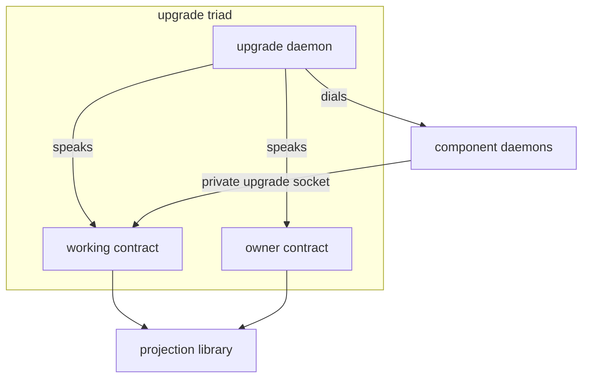

*Kind: Design · Topic: upgrade-triad-structural-design · Date: 2026-05-24*

# 318 / 3 — Upgrade triad structural design (Subagent C)

Design of the four-crate `upgrade` structure that lands per spirit
369 (Maximum). The merger collapses two parallel stacks
(`sema-upgrade` + `signal-sema-upgrade` + `owner-signal-sema-upgrade`
on the schema-migration side; `signal-version-handover` +
`owner-signal-version-handover` on the handover-protocol side) into a
single triad: `upgrade` (daemon) + `signal-upgrade` (working) +
`owner-signal-upgrade` (owner). `version-projection` stays a library
peer. The protocol witness machinery, the temporary bins, and the
duplicate `MigrationIndex` collapse out.

This report is the structural design; the operator-facing rename
mechanics and dependency graph live in sibling reports
`1-rename-inventory-and-dependency-graph.md` and
`2-rename-tooling-and-mechanics.md`.

## §1 The four-crate structure

The upgrade triad is the standard three-leg shape from
`skills/component-triad.md` (daemon + working signal + owner signal)
plus the library peer `version-projection` that every signal contract
in the workspace borrows from. Per the frame's §5 short-prose-only
mermaid discipline, the diagram carries concept labels; the sibling
table maps each label to current-crate-substance contributions.



| Node label | New crate | Current contributors | Role |
|---|---|---|---|
| upgrade daemon | `upgrade` (runtime + CLI bins) | `sema-upgrade` library (`/git/.../sema-upgrade/src/lib.rs:7-21`); production `HandoverDriver` from `persona/src/upgrade.rs:412-520`; manager dispatch from `persona/src/manager.rs:290-401` | Catalogue authority, upgrade orchestrator, handover-protocol driver |
| working contract | `signal-upgrade` | `signal-sema-upgrade` (`/git/.../signal-sema-upgrade/src/lib.rs:138-166`); `signal-version-handover` (`/git/.../signal-version-handover/src/lib.rs:179-197`) | Catalogue/flow verbs + handover-protocol verbs in one channel |
| owner contract | `owner-signal-upgrade` | `owner-signal-sema-upgrade` (`/git/.../owner-signal-sema-upgrade/src/lib.rs:123-143`); `owner-signal-version-handover` (`/git/.../owner-signal-version-handover/src/lib.rs:198-218`) | Catalogue policy (Register/Allow/Block/Query) + flip/rollback/quarantine authority |
| projection library | `version-projection` (unchanged name) | `version-projection/src/projection.rs:9-47`; `src/version.rs:33-77`; `src/index.rs:24-90` (renamed); `src/policy.rs:1-125` (designer call below) | Trait, marker, error, `ContractVersion`, decoder-lookup index, per-operation policy vocabulary |
| component daemons | per-component runtime crates (not new) | e.g. `persona-spirit`, `persona-mind`, `persona-router` | Speak the handover-protocol subset of `signal-upgrade` on their private upgrade socket |

The triad satisfies every invariant from `skills/component-triad.md`:
the daemon owns durable state (the catalogue and migration history);
the working contract carries the peer-callable surface; the owner
contract carries owner-only authority. The CLI is the `upgrade`
binary bundled with the runtime crate, taking one NOTA argument
matching either the ordinary or owner contract per the
single-argument rule.

## §2 `signal-upgrade` working contract — operation surface

Psyche 2026-05-24 (spirit 369 Maximum) ratifies a single working
contract carrying the FULL operation surface — both the catalogue/
flow verbs from `signal-sema-upgrade` and the handover-protocol
verbs from `signal-version-handover`. Splitting them produces two
contract crates with mutually-dependent semantics (the flow verb
`AttemptUpgrade` decomposes into the handover-protocol verbs); the
merger keeps them in one channel.

### §2.1 Operation list

The merged `signal_channel!` carries nine operations and a union of
reply variants:

| Operation | Payload type | From | Direction | Purpose |
|---|---|---|---|---|
| `Inspect` | `Inspection` | `signal-sema-upgrade/src/lib.rs:69-73` + `:140` | peer → upgrade daemon | List supported migrations, optionally filtered by component |
| `AttemptUpgrade` | `Attempt` | `signal-sema-upgrade/src/lib.rs:75-80` + `:141` | peer → upgrade daemon | Drive a full source-to-target upgrade flow (catalogue lookup + handover protocol orchestration) |
| `Report` | `ReportQuery` | `signal-sema-upgrade/src/lib.rs:82-86` + `:142` | peer → upgrade daemon | Read history of past completions and rejections |
| `AskHandoverMarker` | `MarkerRequest` | `signal-version-handover/src/lib.rs:85-87` + `:181` | upgrade daemon → component daemon (via private upgrade socket) | Read the component's current marker (schema hash + commit sequence + write counter + last record id + capture time) |
| `ReadyToHandover` | `ReadinessReport` | `signal-version-handover/src/lib.rs:89-93` + `:182` | upgrade daemon → component daemon | Notify component that next has copied up to a recorded marker; component transitions to HandoverMode if marker matches |
| `HandoverCompleted` | `CompletionReport` | `signal-version-handover/src/lib.rs:95-99` + `:183` | upgrade daemon → component daemon | Confirm public traffic has moved; component closes ordinary + owner sockets |
| `Mirror` | `MirrorPayload` | `signal-version-handover/src/lib.rs:101-108` + `:184` | next daemon → current daemon (over current's private upgrade socket) | Forward a write back to current's database via reverse projection; raw bytes per spirit 274 |
| `Divergence` | `DivergencePayload` | `signal-version-handover/src/lib.rs:110-118` + `:185` | next daemon → current daemon | Record a write that reverse projection cannot represent |
| `RecoverFromFailure` | `RecoveryRequest` | `signal-version-handover/src/lib.rs:120-124` + `:186` | either direction | Reconciliation after a failed transition |

The reply union takes everything from both contracts:

| Reply variant | Payload type | From |
|---|---|---|
| `InspectionReported` | `InspectionReported` | `signal-sema-upgrade/src/lib.rs:88-91` |
| `UpgradeCompleted` | `Completion` | `signal-sema-upgrade/src/lib.rs:93-100` |
| `UpgradeRejected` | `Rejection` | `signal-sema-upgrade/src/lib.rs:111-117` |
| `Reported` | `Reported` | `signal-sema-upgrade/src/lib.rs:119-123` |
| `HandoverMarker` | `HandoverMarker` | `signal-version-handover/src/lib.rs:73-82` |
| `HandoverAccepted` | `HandoverAcceptance` | `signal-version-handover/src/lib.rs:126-129` |
| `HandoverFinalized` | `HandoverFinalization` | `signal-version-handover/src/lib.rs:131-134` |
| `MirrorAcknowledged` | `MirrorAcknowledgement` | `signal-version-handover/src/lib.rs:136-140` |
| `DivergenceAcknowledged` | `DivergenceAcknowledgement` | `signal-version-handover/src/lib.rs:142-146` |
| `RecoveryCompleted` | `RecoveryResult` | `signal-version-handover/src/lib.rs:148-152` |
| `HandoverRejected` | `HandoverRejection` | `signal-version-handover/src/lib.rs:154-158` |
| `RequestUnimplemented` | `RequestUnimplemented` | `signal-sema-upgrade/src/lib.rs:133-136` |

`RequestUnimplemented` is the existing escape hatch and is load-bearing
under the new shape — see §2.3 below.

### §2.2 Merged `signal_channel!` invocation

Rough form, not literally compile-ready (operator polishes during
implementation; ordering matters because `signal_channel!` is
position-sensitive and the `observable` block needs the right
operation-event/effect-event types):

```rust
signal_channel! {
    channel Upgrade {
        // catalogue / flow verbs (peer-callable on the upgrade
        // daemon's ordinary socket; component daemons reject these
        // on their private upgrade socket — see §2.3)
        operation Inspect(Inspection),
        operation AttemptUpgrade(Attempt),
        operation Report(ReportQuery),

        // handover-protocol verbs (upgrade daemon dials component
        // daemons over their private upgrade sockets; component
        // daemons reject Inspect/AttemptUpgrade/Report; both ends
        // implement these)
        operation AskHandoverMarker(MarkerRequest),
        operation ReadyToHandover(ReadinessReport),
        operation HandoverCompleted(CompletionReport),
        operation Mirror(MirrorPayload),
        operation Divergence(DivergencePayload),
        operation RecoverFromFailure(RecoveryRequest),
    }
    reply Reply {
        // flow-side replies
        InspectionReported(InspectionReported),
        UpgradeCompleted(Completion),
        UpgradeRejected(Rejection),
        Reported(Reported),

        // handover-protocol replies
        HandoverMarker(HandoverMarker),
        HandoverAccepted(HandoverAcceptance),
        HandoverFinalized(HandoverFinalization),
        MirrorAcknowledged(MirrorAcknowledgement),
        DivergenceAcknowledged(DivergenceAcknowledgement),
        RecoveryCompleted(RecoveryResult),
        HandoverRejected(HandoverRejection),

        // shared
        RequestUnimplemented(RequestUnimplemented),
    }
    observable {
        filter default;
        operation_event OperationReceived;
        effect_event EffectEmitted;
    }
}
```

`OperationReceived` and `EffectEmitted` follow the shape both
existing contracts use — see `signal-sema-upgrade/src/lib.rs:158-166`
and `signal-version-handover/src/lib.rs:179-197` (the latter has no
`observable` clause today; the merger lands it for consistency).

`SemaObservation` (from `signal-sema`) appears on `EffectEmitted` as
in `signal-sema-upgrade/src/lib.rs:163-166`.

### §2.3 RequestUnimplemented discipline — protocol subset enforcement

The merged contract has nine operations; **the upgrade daemon
implements all nine; component daemons implement only the six
handover-protocol verbs**. When a component daemon receives `Inspect`,
`AttemptUpgrade`, or `Report` on its private upgrade socket (someone
mis-routed a request), it returns:

```text
(RequestUnimplemented (IntegrationNotLanded))
```

This is the existing escape hatch. The `UnimplementedReason` enum
already covers `NotBuiltYet` / `IntegrationNotLanded`
(`signal-sema-upgrade/src/lib.rs:126-131`); the latter is the right
reason here — the verb is supported by the contract, but THIS daemon
isn't a catalogue authority. The wording matches existing usage in
`persona/src/manager.rs:394-398` for the analogous
Tap/Untap rejection.

The asymmetry follows from the deployment topology:

- The **upgrade daemon's ordinary socket** carries the
  catalogue/flow verbs (peer-callable: operators inspect the
  catalogue, request upgrades, read reports). It also carries the
  handover-protocol verbs (because the upgrade daemon itself can be
  upgraded eventually — see §4).
- A **component daemon's private upgrade socket** (e.g.
  `/run/persona/persona-spirit/v0.1.0/upgrade.sock`) carries only
  the handover-protocol verbs. The component daemon participates as
  a current-or-next endpoint; it does not own a catalogue.

Wire vocabulary unifies; runtime implementation responsibility splits
by deployment role. This is the standard component-triad shape
(everyone speaks the contract; the daemon owns the full surface,
peers implement what their role requires) plus the existing
`RequestUnimplemented` skeleton-honesty rule for partial implementers.

A witness test belongs in `upgrade/tests/` and per-component daemon
tests: "component daemon rejects catalogue/flow verb on private
upgrade socket with RequestUnimplemented." The reverse witness
already lives implicitly in the upgrade daemon's own implementation
test.

## §3 `owner-signal-upgrade` owner contract — operation surface

The owner surface merges catalogue policy (Register / Allow / Block /
Query from `owner-signal-sema-upgrade`) with selector authority
(ForceFlip / Rollback / Quarantine from
`owner-signal-version-handover`). `AttemptHandover` from the latter
DOES NOT survive — `AttemptUpgrade` on the working contract subsumes
it. Justification in §3.3 below.

### §3.1 Operation list

| Operation | Payload type | From | Authority concern |
|---|---|---|---|
| `Register` | `Registration` | `owner-signal-sema-upgrade/src/lib.rs:21-28` + `:125` | Add a compiled migration to the catalogue, optionally with a `state: MigrationState` (Enabled/Disabled). Catalogue authority. |
| `Allow` | `PolicyRange` | `owner-signal-sema-upgrade/src/lib.rs:30-45` + `:126` | Permit a component+source+target migration range. Policy authority. |
| `Block` | `Block` | `owner-signal-sema-upgrade/src/lib.rs:66-72` + `:127` | Refuse a migration range with a typed `BlockReason` (Unsafe / Superseded / NotReviewed). Policy authority. |
| `Query` | `Query` | `owner-signal-sema-upgrade/src/lib.rs:74-78` + `:128` | Read the policy table, optionally filtered by component. Catalogue read. |
| `ForceFlip` | `ForceFlip` | `owner-signal-version-handover/src/lib.rs:103-109` + `:201` | Override the marker-validation protocol; flip a component's active selector even when the ordinary protocol would refuse. Selector authority. |
| `Rollback` | `Rollback` | `owner-signal-version-handover/src/lib.rs:111-117` + `:202` | Restore a previous version as active after a recent flip. Selector authority. |
| `Quarantine` | `Quarantine` | `owner-signal-version-handover/src/lib.rs:119-124` + `:203` | Mark a component+version as ineligible for handover participation. Selector authority. |

Reply union:

| Reply variant | Payload | From |
|---|---|---|
| `Registered` | `Registration` | `owner-signal-sema-upgrade/src/lib.rs:131` |
| `Allowed` | `PolicyRange` | `owner-signal-sema-upgrade/src/lib.rs:132` |
| `Blocked` | `Block` | `owner-signal-sema-upgrade/src/lib.rs:133` |
| `PolicyReported` | `PolicyReported` | `owner-signal-sema-upgrade/src/lib.rs:88-91` |
| `PolicyRejected` | `PolicyRejected` | `owner-signal-sema-upgrade/src/lib.rs:102-108` |
| `FlipForced` | `ForcedFlip` | `owner-signal-version-handover/src/lib.rs:140-144` |
| `RolledBack` | `RolledBack` | `owner-signal-version-handover/src/lib.rs:146-150` |
| `Quarantined` | `Quarantined` | `owner-signal-version-handover/src/lib.rs:152-156` |
| `Rejected` | `Rejected` | `owner-signal-version-handover/src/lib.rs:179-183` |
| `RequestUnimplemented` | `RequestUnimplemented` | both contracts (merge) |

Two `RejectionReason` enums exist today:
`owner-signal-sema-upgrade::PolicyRejectionReason` (UnknownMigration /
AlreadyRegistered / NotAllowed) and
`owner-signal-version-handover::RejectionReason` (8 variants including
UnknownComponent, VersionQuarantined, HandoverRejected,
UpgradeSocketUnavailable). They serve different purposes (catalogue
operations vs selector operations) and should remain distinct rather
than collapse — keep them as two enums but rename for clarity
(`CatalogueRejectionReason` + `SelectorRejectionReason`).

### §3.2 Merged `signal_channel!` invocation

```rust
signal_channel! {
    channel OwnerUpgrade {
        // catalogue authority
        operation Register(Registration),
        operation Allow(PolicyRange),
        operation Block(Block),
        operation Query(Query),

        // selector authority
        operation ForceFlip(ForceFlip),
        operation Rollback(Rollback),
        operation Quarantine(Quarantine),
    }
    reply Reply {
        // catalogue replies
        Registered(Registration),
        Allowed(PolicyRange),
        Blocked(Block),
        PolicyReported(PolicyReported),
        PolicyRejected(PolicyRejected),

        // selector replies
        FlipForced(ForcedFlip),
        RolledBack(RolledBack),
        Quarantined(Quarantined),
        Rejected(Rejected),

        // shared
        RequestUnimplemented(RequestUnimplemented),
    }
    observable {
        filter default;
        operation_event OperationReceived;
        effect_event EffectEmitted;
    }
}
```

The two `OperationReceived` + `EffectEmitted` event types in the
existing contracts (`owner-signal-sema-upgrade/src/lib.rs:145-153`
and `owner-signal-version-handover/src/lib.rs:220-228`) merge into
one pair, both carrying the union `OperationKind` enum.

### §3.3 AttemptHandover does not survive — AttemptUpgrade subsumes

Today the owner-version-handover contract has `AttemptHandover`
(`owner-signal-version-handover/src/lib.rs:134-138`), and the
working sema-upgrade contract has `AttemptUpgrade`
(`signal-sema-upgrade/src/lib.rs:75-80` + `:141`). Today these are
on different contracts (owner vs working) because the flow runs
through Persona's owner socket: the operator authorises a handover
on Persona's owner contract; Persona drives the private-socket
protocol against the component daemons.

After the merger, **the upgrade daemon owns the orchestration**. The
flow becomes:

1. Operator: `upgrade '(AttemptUpgrade (persona-spirit (0 1 0) (0 1 1)))'`
2. CLI hits the upgrade daemon's ordinary socket carrying the new
   `signal-upgrade` contract's `AttemptUpgrade` verb.
3. Upgrade daemon validates against its policy table (Register /
   Allow / Block), validates against its quarantine list, then drives
   the handover-protocol verbs against the component daemon's private
   upgrade socket — same orchestration as Persona does today, moved
   into the upgrade daemon.

`AttemptUpgrade` is therefore **a peer-callable working verb** (no
owner authority required to *request* an upgrade — only catalogue
policy decides whether it's permitted). Listing it on the owner
contract would require owner authority on every request, which is
the wrong shape per `skills/component-triad.md` invariant 4
("Contracts split by who-can-call, not by what-state-they-touch") —
authority lives in the catalogue policy (Register / Allow / Block),
which IS owner-only.

`AttemptHandover` on the owner-version-handover contract is then
redundant. The owner doesn't need a separate verb to *authorise* a
handover; they configure policy via `Allow` (owner-only), and any
peer that wants to *trigger* an upgrade calls `AttemptUpgrade`
(peer-callable, validated against policy). The two collapse to one:
`AttemptUpgrade` on the working contract.

**Confirm: `AttemptHandover` deletes.** The four-socket `Target`
payload (current + next, owner-socket-path + upgrade-socket-path)
that `AttemptHandover` carried today
(`owner-signal-version-handover/src/lib.rs:134-138`) doesn't need to
be in the contract at all under the new shape — the upgrade daemon
maintains its own component-version catalogue (Register /
Inspect), so the socket paths are an internal lookup, not a wire
payload. Operator says "upgrade persona-spirit from 0.1.0 to 0.1.1";
the daemon looks up the four sockets in its catalogue.

This removes the prototype-phase awkwardness called out in
`owner-signal-version-handover/ARCHITECTURE.md:18-22`:

> The request carries the versioned ordinary owner and private
> upgrade socket paths because the contract is still in the
> prototype phase before Persona has a full component-version
> catalog.

The upgrade daemon IS the component-version catalogue post-merger;
the awkwardness retires.

## §4 `upgrade` daemon — runtime shape

The `upgrade` daemon is the runtime that owns the catalogue, the
policy state, the migration history, and the production handover
driver. It absorbs the `sema-upgrade` library (minus the deleted
`PrototypeHandover`), the production `HandoverDriver` from persona,
and the orchestration logic from `persona/src/manager.rs`.

### §4.1 Three sockets per the standard triad shape

Per `skills/component-triad.md` invariant 4 (two authority tiers)
plus the triad rule that every triad daemon can itself be upgraded,
the upgrade daemon binds three sockets:

| Socket | Permissions | Contract | Purpose |
|---|---|---|---|
| ordinary | `0666` (or peer-readable) | `signal-upgrade` (all nine verbs implemented) | Operator + peer requests for catalogue inspection, upgrade attempts, history reads |
| owner | `0600` (owner-only) | `owner-signal-upgrade` | Operator/owner configuration of policy (Register / Allow / Block / Query), selector authority (ForceFlip / Rollback / Quarantine) |
| private upgrade | `0600`, version-suffixed | `signal-upgrade` (handover-protocol subset; catalogue/flow verbs RequestUnimplemented) | Sibling-version handover when the upgrade daemon itself is upgraded |

The private upgrade socket is **required** per the triad rule, even
though the upgrade daemon is unlikely to be the first thing upgraded
in practice. Recursive bootstrap (per `/315 §2.4`) is the open
question: "if upgrade's own contracts evolve, who upgrades upgrade?"
The handwritten-until-stable lean from `/315 §2.4` carries forward;
the socket exists so the dogfood path lands cleanly when it does.

### §4.2 Roles

The upgrade daemon has two large concerns:

1. **Catalogue authority** — durable redb state managed via
   `sema-engine`:
   - **Compiled migration index**: which `(component, source,
     target)` triples this binary knows how to migrate. Populated at
     build time from `MigrationCatalogue::prototype()` (today
     `MigrationIndex::prototype()` in
     `sema-upgrade/src/index.rs:158-162`). Owner Register operation
     records additional rows for runtime-registered migrations.
     **Policy state** per triad invariant 5 — bootstraps from
     `bootstrap-policy.nota` on first start, then mutated only via
     owner-signal.
   - **Policy table**: which migrations are Allowed vs Blocked, with
     typed reasons. Owner Allow / Block operations.
   - **Migration history**: every Completion + Rejection ever
     processed. `Working state` per invariant 5 — populated by
     ordinary operation, queryable via Report and Query.
   - **Quarantine list**: which component+version pairs are
     quarantined. Owner Quarantine operations; consulted before
     every AttemptUpgrade.
   - **Active-version event log**: ActiveVersionChanged events (from
     successful handovers, ForceFlip, Rollback). Today lives in
     `persona/src/upgrade.rs:594-654` and
     `persona/src/manager.rs:271-288`; migrates here.

2. **Upgrade orchestrator** — the production `HandoverDriver` and
   surrounding orchestration:
   - `HandoverDriver` (`persona/src/upgrade.rs:412-520`) and
     `HandoverClient` (`persona/src/upgrade.rs:305-377`) migrate
     wholesale. The `Target`, `TargetInput`, `Prepared`, `DrivenHandover`,
     `HandoverFrameCodec` types
     (`persona/src/upgrade.rs:49-303`) all move.
   - `EngineManager::drive_version_handover`
     (`persona/src/manager.rs:290-300`) — the quarantine-gate +
     prepare + start-next + drive sequence — moves here as the
     upgrade daemon's `drive_upgrade` (or similar) routine.
   - `EngineManager::handle_owner_version_handover`
     (`persona/src/manager.rs:345-401`) — the four owner-op
     dispatchers — moves here. AttemptHandover's branch deletes (per
     §3.3); the other three (ForceFlip / Rollback / Quarantine)
     become methods on the upgrade daemon's owner-actor.

3. **Component-unit starting** — the systemd-D-Bus path
   (`persona/src/manager.rs:302-315`'s `start_next_component_unit`).
   **This stays in persona** — see §7. The upgrade daemon calls
   persona over `signal-persona`'s owner contract to ask persona to
   start the next-version unit. The split keeps persona as the
   process-lifecycle authority (it talks to systemd via D-Bus); the
   upgrade daemon is the upgrade-protocol authority.

### §4.3 Daemon-internal `MigrationCatalogue` vs library `RuntimeMigrationLookup`

The current `sema-upgrade::MigrationIndex` (`src/index.rs:148-193`)
and `version-projection::MigrationIndex` (`src/index.rs:24-90`) are
two different things misleadingly carrying the same name. The audit
at `/317-1 §3` gap-matrix row "MigrationIndex runtime use" calls
this out explicitly: "different shape — wraps `MigrationModule`s;
not the same type."

The merger collapses the naming collision per `/317-overview §6`:

- `sema-upgrade::MigrationIndex` → `upgrade::MigrationCatalogue`
  (wraps `MigrationModule`s; the daemon's compile-time catalogue of
  what it knows how to migrate; runs the actual migration).
- `version-projection::MigrationIndex` → `RuntimeMigrationLookup`
  (compile-time-or-link-time per-component decoder index; finds the
  right `historical` decoder for raw mirror bytes; library-level
  lookup, not a catalogue).

The two names now reflect what each does, and there's no
duplicate-name confusion across crates. See §5 below for the
`version-projection` side of this rename.

### §4.4 CLI binary

Per `skills/component-triad.md` §"Repository name vs binary name",
the upgrade triad ships:

- Repository `upgrade`
- CLI binary `upgrade`
- Daemon binary `upgrade-daemon`

The CLI takes one NOTA argument (per the single-argument rule)
matching either a `signal-upgrade::Operation` (peer-callable working
verbs) or — when called against the owner socket path — an
`owner-signal-upgrade::Operation`. The two existing temporary bins
(`sema-upgrade-temporary` and `sema-upgrade-handover-temporary`)
retire; the upgrade daemon's CLI is the canonical entry point.

## §5 `version-projection` — what stays, what doesn't

The merger does NOT make `version-projection` a triad. It stays a
peer library that every signal contract crate in the workspace can
import. The trait is the workspace's universal vocabulary for
projecting values between adjacent versions of one logical type;
the contract crates need it without taking on a daemon dependency.

### §5.1 What stays in `version-projection`

| Type / item | File:line | Role |
|---|---|---|
| `VersionProjection<Source, Target>` trait | `src/projection.rs:9-13` | The core contract: one method `project(Source) -> Result<Target, Error>`. Generic over both endpoints. Stays. |
| `Projected` marker | `src/projection.rs:17-21` | `CONTRACT_VERSION` const + `component()` function. Every projection-participating type implements this. Stays. |
| `Identity` blanket impl | `src/projection.rs:24-32` | `VersionProjection<T, T>` for every `T: Projected`. Free no-op projection for unchanged types. Stays. |
| `ProjectionError` | `src/projection.rs:34-47` | The three-variant enum (`NotRepresentable`, `TransformFailed`, `DirectionNotImplemented`). Policy consumers branch on `NotRepresentable`. Stays. |
| `ContractVersion([u8; 32])` | `src/version.rs:33-71` | 32-byte Blake3 schema-version hash + NOTA byte-literal codec. The marker carries this; the upgrade daemon's catalogue keys on this. Stays. |
| `ContractVersionError` | `src/version.rs:73-77` | InvalidLength error from `try_from_bytes`. Stays. |
| `ComponentName` | `src/version.rs:5-18` | NotaTransparent String newtype, shared across all upgrade-related crates. Stays. |
| `RecordKind` | `src/index.rs:7-20` | NotaTransparent String newtype naming the payload kind in a Mirror frame. Stays — used by the `Mirror` payload in `signal-upgrade`. |
| `DecodeError` + `DecodeFunction` | `src/index.rs:22 + 83-90` | The decoder-function pointer signature used by `RuntimeMigrationLookup` entries. Stays. |
| `RuntimeMigrationLookup` (renamed from `MigrationIndex`) | `src/index.rs:57-81` | Compile-time-or-link-time per-component decoder index. Each entry maps `(ComponentName, ContractVersion)` to a decoder function. Stays under the new name. |
| `MigrationIndexEntry` (rename to `RuntimeMigrationLookupEntry`) | `src/index.rs:24-55` | One row of the lookup table. Renamed accordingly. |

### §5.2 What moves out of `version-projection`

Nothing structural. The trait + marker + error + version type are
all workspace vocabulary; moving them into the upgrade daemon would
force every signal contract that mentions `ContractVersion` to
depend on the upgrade triad, which violates contract-crate
boundaries (per `skills/component-triad.md` invariant 2).

### §5.3 Designer call — policy types stay in `version-projection`

The `policy.rs` module today carries:

- `OperationKind` (`src/policy.rs:6-29`) — the six classes
  `AppendWrite`/`MutateWrite`/`RetractWrite`/`Match`/`Subscribe`/`Tap`.
- `WritePolicy` (`Mirror` / `DivergenceRecord` / `Reject`)
- `ReadPolicy` (`ActiveProjectsResponse` / `DualQueryMerge` /
  `ActiveOnly`)
- `SubscribePolicy` (`ResumeAgainstNext` / `TerminateAtHandover`)
- `PerOperationPolicy`
- `OperationPolicy`
- `ComponentPolicy`

**Designer call: stay in `version-projection`.** Two reasons:

1. **Policy is library-level vocabulary, not the upgrade daemon's
   concern.** Per
   `version-projection/ARCHITECTURE.md:59-65` ("Policy is separate
   from projection. The trait converts types; per-operation policy
   decides what to do with the result"), policy is *consumed* by
   each component runtime crate, not by the upgrade daemon. The
   per-operation policy table for `persona-spirit` would live in
   `persona-spirit/src/version_policy.rs` (designed-only today per
   `/317-1 §2.1`), not in the upgrade daemon.

2. **Moving policy into `upgrade` would force component runtime
   crates to depend on the upgrade triad just to express their
   per-operation policy literals.** That's the wrong dependency
   direction. The upgrade daemon orchestrates handover; component
   daemons enforce policy locally. The two interact through the
   handover-protocol verbs, but the policy *types* are
   library-level shared vocabulary.

The current ARCH text at
`version-projection/ARCHITECTURE.md:144-169` lists "Per-operation
policy generation from contract macros" as a Possible-features
entry; that's an orthogonal direction (whether `signal_channel!`
auto-generates policy literals from operation annotations) and
doesn't affect where the types live today.

### §5.4 Mirror payload reverse projection — still not in version-projection

The current ARCH explicitly notes
(`version-projection/ARCHITECTURE.md:130-131`) that
`version-projection` does NOT depend on `signal-frame`, `signal-sema`,
or any `signal-persona-*` contract. After the merger, the same
boundary holds: `version-projection` does not depend on
`signal-upgrade`. `signal-upgrade` depends on `version-projection`
(for `ContractVersion`, `ComponentName`, `RecordKind`, the trait).
The arrow points the same way today, and the merger doesn't change
it.

## §6 What gets deleted

| Item | Current location | Why deleted | Replacement |
|---|---|---|---|
| `PrototypeHandover` state machine | `sema-upgrade/src/handover.rs:121-272` (entire `PrototypeHandover` struct + `PrototypeEndpoint` + `MirrorDecision` + `HandoverError` + `mirror_with_projection` test path + `run_atomic_handover`) | Superseded by production handover protocol in `persona-spirit/src/actors/root.rs:221-388` (real socket-backed state machine with `Active`/`HandoverMode`/`PrivateUpgradeOnly` states). The prototype was a witness; the production code is on disk and proven. Per `/317-1 §2.6`. | Production state machine in each component daemon (already live); production `HandoverDriver` in the new `upgrade` daemon (migrated from persona). |
| Two `MigrationIndex` types collapse | `sema-upgrade/src/index.rs:148-193` and `version-projection/src/index.rs:57-81` | Single name on two distinct concepts is confusing. Per `/317-overview §6`. | `upgrade::MigrationCatalogue` (the daemon's compile-time + runtime-registered catalogue of what it knows how to migrate, with `MigrationModule`s) and `version-projection::RuntimeMigrationLookup` (the per-component decoder index for raw mirror bytes). See §4.3 + §5.1. |
| `sema-upgrade-temporary` bin | `sema-upgrade/src/bin/sema_upgrade_temporary.rs:1-109` | Was the bridge while no upgrade daemon existed; the new `upgrade` CLI subsumes its role (operator runs `upgrade '(AttemptUpgrade ...)'`). | `upgrade` CLI binary. |
| `sema-upgrade-handover-temporary` bin | `sema-upgrade/src/bin/sema_upgrade_handover_temporary.rs:1-37` | Was the cross-version protocol runner for sandbox use while deployed v0.1.0 had no upgrade socket; once the upgrade daemon and the v0.1.0 retrofit land, the sandbox shifts to real daemon-to-daemon socket exchanges. Per `sema-upgrade/ARCHITECTURE.md:194-199`. | Real upgrade daemon orchestration over real private upgrade sockets. |
| `AttemptHandover` owner verb | `owner-signal-version-handover/src/lib.rs:134-138` + reply variant `HandoverSucceeded` + 4-socket `VersionEndpoint` shape | Subsumed by `AttemptUpgrade` on the working `signal-upgrade` contract; see §3.3. The 4-socket payload was a prototype-phase scaffold (per `owner-signal-version-handover/ARCHITECTURE.md:18-22`) — the upgrade daemon now owns the component-version catalogue, so socket lookup is internal. | `AttemptUpgrade` on `signal-upgrade` working contract (with the existing `Attempt` payload — just component + source + target). |
| `VersionEndpoint` (in owner-version-handover) | `owner-signal-version-handover/src/lib.rs:127-131` | Only used by `AttemptHandover`; with the verb gone, the type goes too. | Daemon-internal catalogue row (not on the wire). |
| `HandoverSucceeded` reply | `owner-signal-version-handover/src/lib.rs:159-163` | Owner-verb reply for the deleted `AttemptHandover`. The working contract's `UpgradeCompleted(Completion)` is the right reply for `AttemptUpgrade`. | `UpgradeCompleted(Completion)` on `signal-upgrade`. |
| Persona's `Target`, `TargetInput`, `Prepared`, `HandoverEndpoint`, `HandoverFrameCodec`, `ReceivedHandoverRequest`, `HandoverClient`, `DrivenHandover`, `HandoverDriver`, `PreparedEvent`, `ActiveVersionChangeSource`, `ActiveVersionChanged`, `VersionQuarantined`, `ActiveVersion` | `persona/src/upgrade.rs:49-746` (entire file except the unit-start path — see §7) | These all move to `upgrade/src/...`; they don't belong in persona once persona stops being the orchestrator. | New `upgrade/src/driver.rs` (or similar) carrying the production driver + client + types. |
| Persona's manager handover dispatch | `persona/src/manager.rs:290-301` (`drive_version_handover`), `:345-401` (`handle_owner_version_handover` except AttemptHandover arm), `:317-343` (`ensure_target_not_quarantined`), `:271-288` (`complete_upgrade`), `:260-269` (`prepare_upgrade`), `:403-412` (`handover_rejection_reason`) | Same as above: these methods belong on the upgrade daemon. | New `upgrade/src/manager.rs` or actor module. |
| Persona's `owner_signal_version_handover` dependency | `persona/Cargo.toml` (dep on `owner-signal-version-handover`) | Persona stops dispatching owner-version-handover ops (operator now talks to the upgrade daemon directly for upgrade authority). | Removed. The dep on `signal-upgrade` arrives ONLY if persona still consumes it for unit-start coordination — and even that is just an inbound contract call from `upgrade` daemon to persona, not the other way around. |
| `sema-upgrade::Engine`, `Lowering`, `Command`, `Effect`, `EngineError`, `first_reply` | `sema-upgrade/src/execution.rs:1-243` | The `signal-executor`-shaped Engine for working-contract dispatch moves wholesale to the upgrade daemon's runtime. | `upgrade::Engine` (or similar) in the daemon. |
| Library-vs-daemon ARCH text in `sema-upgrade/ARCHITECTURE.md` | `sema-upgrade/ARCHITECTURE.md:14-16` ("The crate remains library-shaped today; a future `sema-upgrade-daemon` will own…") + Possible-features at `:178-186` | The future-daemon hedge resolves: the daemon ships as `upgrade`. The Possible-features entries that named the daemon emergence as open retire. | `upgrade/ARCHITECTURE.md` (new) carrying the daemon shape. |
| Cross-ARCH "typed Mirror payload" Possible-features entries | `version-projection/ARCHITECTURE.md:159-164`, `signal-version-handover/ARCHITECTURE.md:244-254`, `sema-upgrade/ARCHITECTURE.md:186-193` (the Mirror-payload-application item) | Per `/317-1 §5` — settled by spirit 274 (Maximum: raw bytes wins). Three ARCH files redundantly carry the Possible-features text. | One-sentence Constraint in `signal-upgrade/ARCHITECTURE.md` pointing at spirit 274 + the raw-bytes discipline. |

The `sema-upgrade` library code that IS NOT deleted (the
`MigrationCatalogue` aka today's `MigrationIndex`, the per-component
`migrations` directory, the `Engine` + `Lowering` + `Command` + `Effect`
types, the `DatabaseMigration` + `DatabaseMigrationError` types)
moves into the new `upgrade` crate as its lib substance.

## §7 Persona's narrowed role

After the merger, persona's role narrows from "engine supervision +
upgrade orchestration" to "engine supervision + process-lifecycle".
The upgrade daemon is the upgrade-orchestration authority.

### §7.1 What stays in persona

The systemd-D-Bus unit-start path. Today
`persona/src/manager.rs:302-315`'s `start_next_component_unit` calls
`unit_manager.ask(StartUnit::new(unit))`; the `UnitController` trait
(`persona/src/unit.rs:21-49`) and the production implementations
(`SystemdUnitController`, `SystemdTransientUnitController`,
`SystemctlUnitController` at `persona/src/unit.rs:476-796`) own the
D-Bus conversation with systemd. **All of this stays in persona** —
persona is the process-lifecycle authority for components; the
upgrade daemon should not directly touch systemd.

Confirm: **`start_next_component_unit` stays in persona.** The
upgrade daemon's orchestration calls persona (over `signal-persona`'s
owner contract) to request "start the next-version unit of component
X"; persona dispatches to systemd; persona returns the unit receipt.
The upgrade daemon then proceeds with the handover protocol against
the now-running next daemon's upgrade socket.

This split keeps both daemons in their lane:

- **persona** is the process-lifecycle authority (it knows about
  systemd, transient units, manual unit control, the
  `ComponentUnit` value, etc.).
- **upgrade** is the upgrade-protocol authority (it knows about the
  catalogue, the handover protocol, the active-version event log,
  the quarantine list).

A clean owner-signal call from upgrade to persona carries the
process-lifecycle request without entangling either daemon in the
other's concerns.

### §7.2 What moves from persona to upgrade

| Persona today | Moves to upgrade |
|---|---|
| `src/upgrade.rs:49-122` (`Target`, `from_input`, `from_owner_attempt`, `component`/`current_version`/`next_version`/`*_socket_path` accessors, `prepare`) | `upgrade/src/target.rs` (or similar). The `from_owner_attempt` constructor changes shape per §3.3 (no more `AttemptHandover` owner verb; the catalogue produces the `Target` from `(component, source, target)` lookup). |
| `src/upgrade.rs:125-149` (`TargetInput`, `Prepared`) | Same module. |
| `src/upgrade.rs:151-303` (`HandoverEndpoint`, `HandoverFrameCodec`, `ReceivedHandoverRequest`) | `upgrade/src/codec.rs` or similar. |
| `src/upgrade.rs:305-377` (`HandoverClient` with `submit` + `ask_marker` + `ready_to_handover` + `complete_handover` + `recover_from_failure`) | `upgrade/src/client.rs`. |
| `src/upgrade.rs:379-410` (`DrivenHandover`) | `upgrade/src/driven.rs`. |
| `src/upgrade.rs:412-520` (`HandoverDriver::from_target` + `drive_current_side` + `ensure_next_marker_matches`) | `upgrade/src/driver.rs`. The production orchestration. |
| `src/upgrade.rs:522-654` (`PreparedEvent`, `ActiveVersionChangeSource`, `ActiveVersionChanged`) | `upgrade/src/event.rs`. These are the rkyv-archived event types for the active-version log; the log lives in the upgrade daemon's redb (not persona's). |
| `src/upgrade.rs:661-693` (`VersionQuarantined`) | `upgrade/src/event.rs`. |
| `src/upgrade.rs:696-746` (`ActiveVersion`) | `upgrade/src/event.rs`. The active-version snapshot type. |
| `src/manager.rs:260-269` (`prepare_upgrade`) | `upgrade/src/manager.rs` — becomes the upgrade daemon's prepare step. |
| `src/manager.rs:271-288` (`complete_upgrade`) | Same module. |
| `src/manager.rs:290-300` (`drive_version_handover`) | Same module. Becomes the upgrade daemon's top-level orchestration entry-point for `AttemptUpgrade`. |
| `src/manager.rs:317-343` (`ensure_target_not_quarantined`) | Same module. |
| `src/manager.rs:345-401` (`handle_owner_version_handover` — minus the AttemptHandover arm) | Becomes the upgrade daemon's owner-actor handlers for `ForceFlip`, `Rollback`, `Quarantine`. |
| `src/manager.rs:403-412` (`handover_rejection_reason`) | Same module. |

What's left in persona's `src/upgrade.rs`: nothing. **The file
deletes entirely** once these contents move.

What's left in persona's `src/manager.rs`: the engine-supervision
plumbing minus the upgrade-orchestration methods. Persona keeps
`unit_manager.ask(StartUnit::new(unit))` and adds an inbound
`signal-persona`-owner-contract handler for "upgrade daemon
requests unit start" — a small surface, not a rewrite.

### §7.3 Persona's owner contract — sheds `AttemptHandover`

Persona today receives `AttemptHandover` on its owner socket (via
`owner-signal-version-handover` per
`persona/src/manager.rs:350-363`). Confirm: **persona's owner
contract sheds the `AttemptHandover` verb**, along with `ForceFlip`,
`Rollback`, `Quarantine`. All four migrate to
`owner-signal-upgrade` (per §3).

The new flow is:

1. Operator → upgrade daemon owner socket → `(ForceFlip ...)` or
   `(Rollback ...)` or `(Quarantine ...)` directly.
2. For ordinary upgrades: operator → upgrade daemon **ordinary**
   socket → `(AttemptUpgrade ...)`.

Persona is *downstream* of the upgrade daemon for unit-start (the
upgrade daemon calls persona's owner contract to ask "start the
next-version unit"); persona is NOT in the operator's call path for
the upgrade protocol itself.

This narrows `owner-signal-persona`'s footprint (per
`/git/.../persona/ARCHITECTURE.md:526` mentioning the four
owner-handover ops). The current `OwnerVersionHandoverOperation` enum
dispatch in `persona/src/manager.rs:345-401` becomes a single
"start-unit" call from upgrade.

### §7.4 Concrete cutover trace — `upgrade '(AttemptUpgrade ...)'`

End-to-end walk through the production Spirit cutover under the new
architecture. Operator types:

```text
upgrade '(AttemptUpgrade (persona-spirit (0 1 0) (0 1 1)))'
```

1. The `upgrade` CLI binary takes the single NOTA argument
   (`skills/component-triad.md` §"The single argument rule"),
   decodes as `signal_upgrade::Operation::AttemptUpgrade(Attempt {
   component: "persona-spirit", source: Version{0,1,0},
   target: Version{0,1,1} })`, opens a Unix stream to the upgrade
   daemon's ordinary socket path, sends the request, awaits the
   reply, prints it as NOTA, exits.

2. Upgrade daemon's ordinary listener receives the
   `AttemptUpgrade` operation. The daemon's `signal-executor`-shaped
   `Engine::execute_atomic_batch` (today
   `sema-upgrade/src/execution.rs:185-211`) lowers
   `Operation::AttemptUpgrade` to `Command::AttemptUpgrade`.

3. The command handler:

   a. Looks up `(persona-spirit, 0.1.0, 0.1.1)` in the
      `MigrationCatalogue` (today
      `sema-upgrade/src/index.rs:148-193`). Found — the catalogue
      contains the prototype Spirit module.

   b. Looks up the policy table: is this migration `Allowed` or
      `Blocked`? If absent (no explicit Allow row), default-deny
      (or default-allow — policy decision; the catalogue must
      record). If Blocked, returns
      `Reply::UpgradeRejected(...)`.

   c. Looks up the quarantine list: is `persona-spirit@0.1.0` or
      `persona-spirit@0.1.1` quarantined? If yes, returns
      `Reply::UpgradeRejected(...)` with the quarantine reason
      (today maps in `persona/src/upgrade.rs:594-654` via
      `ActiveVersionChangeSource::ForceFlip`; analogous mapping
      lives here).

   d. Looks up the four-socket layout in the catalogue's
      component-version table (today the operator passes this in
      `AttemptHandover` per
      `owner-signal-version-handover/src/lib.rs:134-138`; under the
      new shape the catalogue knows where the per-version sockets
      live based on Register/Allow rows that name the install
      paths).

   e. Asks **persona** (over `signal-persona`'s owner contract —
      see §7.3) to start the `persona-spirit-daemon` v0.1.1 unit.
      Today this is `unit_manager.ask(StartUnit::new(unit))`
      in `persona/src/manager.rs:308`; the upgrade daemon makes
      the equivalent call as a peer.

   f. Records `UpgradePrepared` event in the upgrade daemon's
      manager event log (today `persona/src/manager.rs:263-266`).

4. With both v0.1.0 and v0.1.1 daemons running, the upgrade
   daemon's `HandoverDriver::drive_current_side` (today
   `persona/src/upgrade.rs:434-477`) dials the current upgrade
   socket and the next upgrade socket:

   a. `current.ask_marker(MarkerRequest)` — the v0.1.0 daemon
      returns its `HandoverMarker { schema_hash, commit_sequence,
      write_counter, last_record_identifier, recorded_at_date,
      recorded_at_time }` from its sema-engine state.

   b. `next.ask_marker(MarkerRequest)` — the v0.1.1 daemon
      returns its (empty-database) marker.

   c. `ensure_next_marker_matches(&marker, &next_marker)` —
      **today this REFUSES because next's commit_sequence is 0
      while current's is N > 0** (per `/317-1 §4` "Could trip the
      cutover unexpectedly" #3). The production cutover script
      must pre-populate next's database via the database-migration
      module BEFORE calling AttemptUpgrade. This pre-step is
      orthogonal to the merger; the merger doesn't make it land
      automatically. **Open item**: should the upgrade daemon's
      `AttemptUpgrade` automatically run the database migration
      before triggering the handover? Lean: yes — the catalogue's
      `MigrationModule::migrate_database` path is local and the
      orchestrator can drive it. This collapses the operator's
      "run sema-upgrade-temporary then trigger handover" two-step
      into one verb. See §10 question 1.

   d. `current.ready_to_handover(ReadinessReport)` — v0.1.0
      transitions `Active → HandoverMode{accepted_marker}`,
      `public_sockets.enter_handover_mode()` runs
      (`persona-spirit/src/daemon.rs:1410-1412`), reads pass /
      writes refuse.

   e. `current.complete_handover(CompletionReport)` — v0.1.0
      transitions `HandoverMode → PrivateUpgradeOnly`,
      `public_sockets.close()` runs (`persona-spirit/src/daemon.rs:1413-1415`),
      both ordinary and owner sockets refuse all traffic.

5. Upgrade daemon's manager-event-log appends
   `ActiveVersionChanged` with `source = HandoverMarker { commit_sequence }`
   (today `persona/src/manager.rs:284`).

6. Upgrade daemon returns
   `Reply::UpgradeCompleted(Completion { component:
   persona-spirit, source: 0.1.0, target: 0.1.1, migration:
   <ident>, changed_records: N })` to the CLI. CLI prints:

```text
(UpgradeCompleted (persona-spirit (0 1 0) (0 1 1) <migration-ident> 217))
```

Compare to the current path (`/317-1 §7`): today operator types
`persona '(AttemptHandover ...)'`, persona drives the protocol,
returns `HandoverSucceeded`. The merger collapses two daemon-roles
(persona-as-orchestrator + sema-upgrade-as-library) into one
(`upgrade` as the dedicated orchestrator), and one verb
(`AttemptUpgrade`) carries the full intent. Persona's role narrows
to "start the unit" — a single owner-signal call from upgrade.

## §8 Mirror payload coupling — re-confirm raw bytes

Per spirit 274 (Maximum): Mirror payload is raw bytes in its own
container; the typed-enum alternative is rejected because typing the
payload forces `version-projection` to import every `signal-X` crate
in the workspace.

**Does the merger change the analysis?** The merger puts the
`Mirror` operation type definition in the same crate
(`signal-upgrade`) as the `version-projection` trait import. One
might ask: now that they're co-located, does the import cost for a
typed enum drop?

**No.** Two reasons:

1. **Cross-component scope is still expensive.** A typed Mirror enum
   carries variants per component — `Mirror(PersonaSpirit::Entry)`,
   `Mirror(PersonaMind::Concept)`, `Mirror(PersonaRouter::Channel)`,
   etc. Each variant requires `signal-upgrade` to depend on the
   matching component contract crate (`signal-persona-spirit`,
   `signal-persona-mind`, `signal-persona-router`, etc.). That
   cross-component fan-out is the cost — and the cost is unchanged
   by where `signal-upgrade` lives. The library-vs-merged-crate
   distinction doesn't apply; the typed-enum cost is structural
   (the wire shape changes per-component-pair), not import-graph
   accidental.

2. **`version-projection` doesn't gain anything from co-location.**
   The trait remains free of `signal-X` dependencies; the merger
   doesn't pull them in. `version-projection`'s ARCH constraint
   ("does not depend on any `signal-persona-*` contract" at
   `version-projection/ARCHITECTURE.md:131`) holds unchanged.

**Confirm: Mirror stays raw bytes.** The receiver-side discipline
("Raw payload bytes MUST land in a SEPARATE container outside the
receiver's typed database" per `signal-version-handover/ARCHITECTURE.md:114-115`)
carries forward unchanged into `signal-upgrade/ARCHITECTURE.md`.
The three ARCH Possible-features entries from `/317-1 §5` retire to
a one-sentence Constraint in `signal-upgrade/ARCHITECTURE.md`
pointing at spirit 274 + the raw-bytes discipline.

**Trigger to revisit** (unchanged from
`signal-version-handover/ARCHITECTURE.md:251`): the second production
component handover. At that point the cost-benefit between a typed
wire (compile-time witness, observability) and per-version-pair
contract bloat becomes evaluable against two real cutovers instead
of one.

## §9 Migration path from current to new

Step-by-step landing order. Each numbered step is a coherent unit of
work (an operator-sized bead in the bead list). The order is chosen
so the workspace builds end-to-end after every step; no step leaves
broken downstream consumers. Per Subagent A's dependency-graph
report, the rename ordering constraint is "leaves first, consumers
last" — this section applies that rule to the merger.

### §9.1 Repo creation

**Step 0a — Create `upgrade` repo on GitHub and ghq.** Empty Cargo
workspace + flake.nix; no source yet. Land the README + ARCHITECTURE
skeleton. This is a one-PR setup bead.

**Step 0b — Create `signal-upgrade` repo on GitHub and ghq.** Empty
Cargo crate; `signal_channel!` declaration scaffolded but empty;
flake.nix with `version-projection` input.

**Step 0c — Create `owner-signal-upgrade` repo on GitHub and ghq.**
Same shape as 0b.

### §9.2 Contract crate population (signal contracts move first)

**Step 1 — Populate `signal-upgrade`.** Copy types from both
`signal-version-handover` and `signal-sema-upgrade`. Resolve
overlapping names:

- `ComponentName` — keep one (the `version-projection` one). Both
  contracts already use it (signal-version-handover imports from
  version-projection at `src/lib.rs:11`; signal-sema-upgrade defines
  its own at `src/lib.rs:12-25`). The version-projection one wins
  because the trait references it; the signal-sema-upgrade one
  deletes.
- `RequestUnimplemented` + `UnimplementedReason` — both contracts
  declare the same shape; one survives in the merged crate.
- `OperationReceived` + `EffectEmitted` — emit one pair each
  carrying the union `OperationKind`.
- `RejectionReason` enums — one for catalogue
  (`CatalogueRejectionReason` from sema-upgrade), one for handover
  (`HandoverRejectionReason` from version-handover); keep both
  distinct.
- Date / Time records — keep, used by `HandoverMarker`.

Land all 11 reply variants per §2. Run all round-trip tests from
both predecessor crates against the merged contract. Update
flake.nix dependencies.

**Step 2 — Populate `owner-signal-upgrade`.** Same exercise for the
owner contracts. Delete `AttemptHandover` and `VersionEndpoint` per
§3.3 + §6. Keep `Version`, `VersionLabel`, `SocketPath`,
`ForceReason`, `RollbackReason`, `QuarantineReason`, `ForceFlip`,
`Rollback`, `Quarantine` from owner-version-handover; keep
`Registration`, `PolicyRange`, `Block`, `BlockReason`, `Query`,
`PolicyEntry`, `PolicyReported`, `PolicyRejectionReason`,
`PolicyRejected`, `MigrationState` from owner-sema-upgrade.

### §9.3 Daemon crate population

**Step 3 — Populate `upgrade` crate with the sema-upgrade library.**
Move `sema-upgrade/src/migrations/` wholesale, plus
`sema-upgrade/src/index.rs` (renamed module/types per §4.3:
`MigrationCatalogue` for the daemon-side catalogue), plus
`sema-upgrade/src/execution.rs` (rename references from
`signal_sema_upgrade` to `signal_upgrade`). Delete
`sema-upgrade/src/handover.rs` (PrototypeHandover deletes per §6).
Delete the two temporary bins (`sema_upgrade_temporary.rs` and
`sema_upgrade_handover_temporary.rs`) per §6.

**Step 4 — Migrate persona's `HandoverDriver` to `upgrade`.** Move
the contents of `persona/src/upgrade.rs:49-746` per §7.2 table. The
file deletes from persona.

**Step 5 — Add the upgrade daemon's actor tree.** Build out the
three-socket daemon (ordinary + owner + private upgrade) with the
listener actors for each. The pattern mirrors
`persona-spirit/src/daemon.rs:138-140` + `:580-651` (three-socket
bind path).

**Step 6 — Add the upgrade daemon's manager event log.** Move the
`ActiveVersionChanged` / `VersionQuarantined` / `ActiveVersion` types
from persona; build the event-log table inside the daemon's redb.

**Step 7 — Add persona ↔ upgrade unit-start coordination.** Add the
signal-persona owner-contract verb that the upgrade daemon calls to
ask persona to start a unit. Implement on persona's side
(receiving) and on upgrade's side (calling). Persona's
`start_next_component_unit` (today
`persona/src/manager.rs:302-315`) becomes the handler for this
inbound verb instead of an internal method called by
`drive_version_handover`.

### §9.4 Catalogue migration

**Step 8 — Migrate `version-projection`'s `MigrationIndex` →
`RuntimeMigrationLookup`.** Rename the type, the entry type, and
all consumers per §5.1. The decoder-function lookup semantics
stay the same. Update `lib.rs` re-exports.

### §9.5 Persona cleanup

**Step 9 — Delete persona's `src/upgrade.rs` and prune
`src/manager.rs`.** Once everything that was moving has moved per
§7.2, persona's `upgrade.rs` is empty and deletes. The five manager
methods listed in §7.2 delete from `manager.rs`. Persona's
`Cargo.toml` drops dependencies on `owner-signal-version-handover`,
`signal-version-handover`, `version-projection` (last one only if no
other persona module imports it — confirm).

**Step 10 — Migrate persona's owner contract.** Per §7.3, persona's
owner contract sheds the four version-handover verbs
(`AttemptHandover`, `ForceFlip`, `Rollback`, `Quarantine`). These
already DO NOT live on `owner-signal-persona` — they're dispatched
through `owner-signal-version-handover` per
`persona/src/manager.rs:345-401`. So this step is really: confirm
`owner-signal-persona` doesn't already carry these verbs (it does
not; persona's owner contract scope is different) and update
persona's owner-actor to route the unit-start inbound verb instead.

### §9.6 Retirement

**Step 11 — Delete `sema-upgrade`, `signal-sema-upgrade`,
`owner-signal-sema-upgrade` repos.** All substance has migrated
to the new triad. Per spirit 370 (the deleted-reports-live-in-the-
commit-tree rule), the substance remains accessible via git/jj
history.

**Step 12 — Delete `signal-version-handover`,
`owner-signal-version-handover` repos.** Same as 11.

**Step 13 — Retire stale ARCH Possible-features text.** Per §8 +
`/317-1 §5`: drop the three "typed Mirror payload" Possible-features
entries from version-projection/ARCH, signal-version-handover/ARCH,
sema-upgrade/ARCH. Replace with a one-sentence Constraint in
`signal-upgrade/ARCHITECTURE.md`. This step can land in parallel
with the deletion in step 11/12 (the old ARCHs go away with their
repos).

### §9.7 Build-graph validation

Between each step the workspace must build. Concretely:

- After steps 0a-0c: empty repos, no consumers exist; workspace
  builds.
- After step 1 (signal-upgrade populated): new contract exists, no
  consumers reference it yet; workspace builds. The OLD contracts
  (signal-sema-upgrade, signal-version-handover) still exist and
  their consumers (sema-upgrade, persona, persona-spirit) still
  reference them; workspace builds.
- After step 2: same shape on the owner side; workspace builds.
- After step 3 (upgrade crate gets sema-upgrade library): the new
  daemon binary doesn't exist yet, but the lib substance is
  present in the new crate. The OLD sema-upgrade crate still
  exists. Both build.
- After step 4 (HandoverDriver moves): persona's `src/upgrade.rs` is
  smaller but persona still builds. The new upgrade crate has the
  driver code but doesn't expose it via a daemon yet.
- After step 5 (daemon actor tree): the upgrade daemon binary exists
  and runs. Persona's drive_version_handover STILL works via the
  old code path (persona still has the manager methods).
  **Switchover point**: both paths now exist; tests should cover
  both.
- After step 7 (persona ↔ upgrade unit-start coordination): upgrade
  daemon can drive an end-to-end upgrade through persona's unit
  manager. The old persona-as-orchestrator path also still works.
- After step 9 (persona cleanup): the old persona-as-orchestrator
  path deletes; only the upgrade daemon orchestrates. Any code that
  was calling `EngineManager::handle_owner_version_handover` directly
  must already have been migrated to call the upgrade daemon — this
  is a step-9-blocking dependency.
- After step 11/12 (old repos delete): everything must already have
  switched to the new crate names. Workspace builds end-to-end.

The risky cross-over is between steps 7 and 9: there's a window
where both orchestrators (persona and upgrade) exist and can be
called. Tests in that window must cover both paths; production
ought to switch over (operator command-line is the place to
intervene — point operator scripts at the new `upgrade '(...)'` CLI
instead of `persona '(AttemptHandover ...)'`) before step 9 lands.

## §10 Open psyche questions

Spirit 369 is Maximum on the direction; the corners below are
design subtleties that warrant explicit psyche disposition.

1. **Should `AttemptUpgrade` automatically run the database
   migration before triggering the handover protocol?** Today
   sandbox runs `sema-upgrade-temporary` (the migration half) and
   `sema-upgrade-handover-temporary` (the handover half) as two
   separate operator steps. After the merger, both halves run in
   the upgrade daemon. Lean: collapse to one verb — the upgrade
   daemon's `AttemptUpgrade` handler runs the database migration
   first (producing the v_next.redb path from v_current.redb),
   then starts the next-version unit on the migrated database,
   then drives the handover protocol. One operator step. The
   alternative is to keep them separate (e.g. `MigrateDatabase` +
   `AttemptHandover`) so the operator can stage the migration and
   inspect before committing to the cutover. The lean is "collapse"
   but the operator-staging concern is real; see `/317-1 §4` row
   "Could trip the cutover unexpectedly" #3 for the production
   pilot's same-step concern.

2. **Does the upgrade daemon's catalogue carry per-version socket
   path templates, or do operators pass them on every
   AttemptUpgrade?** Today `owner-signal-version-handover::AttemptHandover`
   carries the four socket paths
   (`/git/.../owner-signal-version-handover/src/lib.rs:127-138`)
   because there was no catalogue. After the merger, the upgrade
   daemon owns a catalogue. Lean: catalogue carries the templates
   ("for `persona-spirit` v0.X.Y, ordinary socket at
   `/run/persona/persona-spirit/v0.X.Y/ordinary.sock`, owner at
   `.../owner.sock`, upgrade at `.../upgrade.sock`") and the
   operator just names `(persona-spirit (0 1 0) (0 1 1))`. The
   templates land in the catalogue as Register records. This
   matches `skills/component-triad.md` invariant 5 (policy state
   bootstraps from `bootstrap-policy.nota`, then owner-mutates).
   Confirm.

3. **`OperationKind` enum union — six classes from policy.rs vs
   the operation-name enum auto-generated by `signal_channel!` —
   how do these reconcile?** `version-projection::OperationKind`
   (`src/policy.rs:6-29`) carries the six classes
   (AppendWrite/MutateWrite/RetractWrite/Match/Subscribe/Tap)
   which Persona-introspect-style observation uses to filter
   "all Asserts across the workspace." `signal_channel!` emits a
   per-channel `OperationKind` enum (e.g. one variant per
   operation: `Inspect`, `AttemptUpgrade`, ...). These two
   `OperationKind`s are distinct types; the merger doesn't
   collapse them. The macro-generated one is per-channel; the
   policy one is workspace-universal. Confirm the policy
   `OperationKind` stays in `version-projection` and the
   macro-generated `OperationKind` is per-channel as today.
   (The frame already notes the per-channel macro emit at the
   `observable` clause.)

4. **The recursive bootstrap question carries forward from
   `/315 §2.4`.** If `signal-upgrade` itself evolves, who upgrades
   the upgrade daemon? The handwritten-until-stable lean from
   `/315 §2.4` stands; the third stable release of the upgrade
   triad dogfoods its own protocol. The merger doesn't change the
   answer. Carry forward unchanged.

## See also

- `0-frame-and-method.md` — orchestrator frame for the 318 dispatch.
- `reports/designer/317-sema-upgrade-and-macro-convergence-audit/1-sema-upgrade-path-audit.md`
  — current-state audit, this design's direct upstream.
- `reports/designer/315-design-sema-upgrade-and-handover-current-state.md`
  — superseded current-state design (parts).
- `reports/designer/285-versionprojection-trait-and-handover-protocol-specification.md`
  — canonical spec for `VersionProjection` + handover protocol.
- `reports/designer/287-version-handover-component-explained.md`
  — canonical visual reference for handover.
- `/git/github.com/LiGoldragon/version-projection/ARCHITECTURE.md`
- `/git/github.com/LiGoldragon/signal-version-handover/ARCHITECTURE.md`
- `/git/github.com/LiGoldragon/owner-signal-version-handover/ARCHITECTURE.md`
- `/git/github.com/LiGoldragon/sema-upgrade/ARCHITECTURE.md`
- `/git/github.com/LiGoldragon/persona/ARCHITECTURE.md` §1.6.7
- `~/primary/skills/component-triad.md` — the universal triad shape
  and the single-argument rule.
- `~/primary/skills/mermaid.md` §"Label sizing — short prose, IDs
  out of the node".
- Spirit records 208–214 (Persona drives handover), 274 (Mirror
  payload raw bytes), 369 (Maximum — upgrade triad merger), 370
  (deleted reports live in the commit tree), 371 (drop persona-
  prefix workspace-wide).
