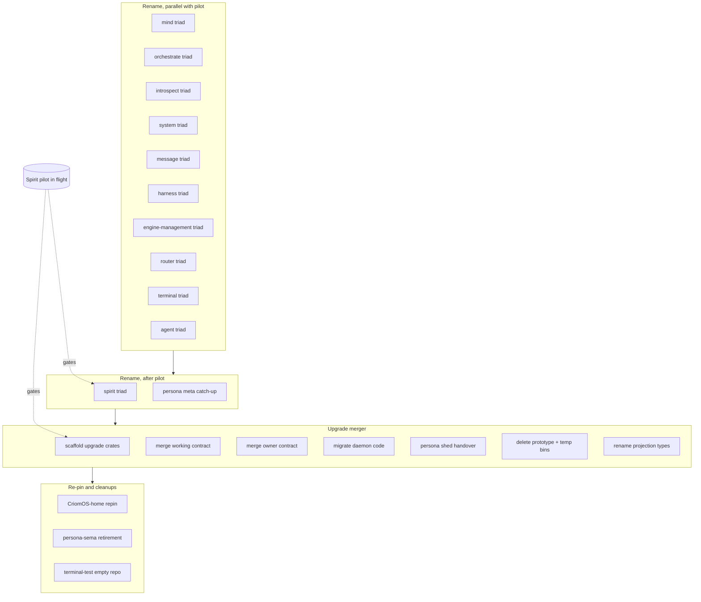

*Kind: Synthesis · Topic: upgrade-merger-and-persona-prefix-rename-integrated-picture · Date: 2026-05-24*

# 318 / 4 — Overview + bead list (orchestrator synthesis)

Integrates the three sibling slices:

- `./1-rename-inventory-and-dependency-graph.md` (Subagent A —
  29 affected repos, 24 prefix-drops + 5 merged + 1 retired)
- `./2-rename-tooling-and-mechanics.md` (Subagent B — feasibility
  verdict + worked example + tooling chain)
- `./3-upgrade-triad-structural-design.md` (Subagent C — 4-crate
  structure + 9-operation merged contract + 13-step migration)

Plus reconciled with operator's parallel `/166` + `/167` (current
state checks confirming `primary-li0p` + `primary-avog` landed,
flagging the new persona-agent contracts as rename candidates).

## §1 Feasibility verdict — feasible with prep

**Bottom line: yes, this can land.** No single tool has a blocking
limitation. Complexity is in coordination, not mechanics.

Per Subagent B §7:

- Cargo rename — clean (`[package].name` change + dependents
  update in lockstep; `package = "…"` bridge directive available
  as transitional aid; `cargo add --rename` for dependent edits).
- Nix flake mechanics — clean (flake.lock keyed by input name,
  not URL; `nix flake lock` regenerates; GitHub auto-redirects
  cover the transition window indefinitely).
- ghq + GitHub — clean (`gh repo rename` is one call; local-side
  is `mv` + `git remote set-url`; no ghq helper needed).
- jj — clean if headless-inline rule honoured (workspace's
  `ui.editor = "emacsclient -c"` would hang agent sessions; every
  commit MUST use `jj describe -m '<msg>'`).
- Source rewrite — clean via sed + `rg` for discovery (NOT
  `rg --replace`, which is preview-only); rust-analyzer LSP
  rename is editor-bound and mismatched to cross-repo sweeps.

**One per-triad rename = ~30 shell commands + ~7 commits across
~4 repos** (Subagent B §6 worked example, signal-persona-spirit
→ signal-spirit). The whole sweep is ~225 source-file edits +
~30 Cargo.toml edits + 2 flake.lock refreshes (Subagent A §3-5).

## §2 The integrated picture

Phase mapping to current-workspace identifiers:

| Phase node | Repos touched | Subagent A reference |
|---|---|---|
| mind triad | `persona-mind`, `signal-persona-mind`, `owner-signal-persona-mind` | §2 entry |
| orchestrate triad | `persona-orchestrate`, `signal-persona-orchestrate`, `owner-signal-persona-orchestrate` | §2 entry |
| introspect triad | `persona-introspect`, `signal-persona-introspect` (owner? verify) | §2 entry |
| system triad | `persona-system`, `signal-persona-system` (owner? verify) | §2 entry |
| message triad | `persona-message`, `signal-persona-message` (owner? verify) | §2 entry |
| harness triad | `persona-harness`, `signal-persona-harness` (owner? verify) | §2 entry |
| engine-management triad | `persona-engine-management`, `signal-persona-engine-management` (owner? verify) | §2 entry |
| router triad | `persona-router`, `signal-persona-router`, `owner-signal-persona-router` | §2 entry |
| terminal triad | `persona-terminal`, `signal-persona-terminal`, `owner-signal-persona-terminal` | §2 entry |
| agent triad | `persona-agent`, `signal-persona-agent`, `owner-signal-persona-agent` (NEW per `/167`) | §8.4 |
| spirit triad | `persona-spirit`, `signal-persona-spirit`, `owner-signal-persona-spirit` | §7.3 |
| persona meta catch-up | `persona`, `signal-persona`, `owner-signal-persona`, `signal-persona-origin` — names stay; their Cargo.toml deps + source must follow renamed peer crates | §7.4 |
| scaffold upgrade crates | new repos `upgrade`, `signal-upgrade`, `owner-signal-upgrade` | Subagent C §1 |
| merge working contract | `signal-sema-upgrade` + `signal-version-handover` → `signal-upgrade` (9 ops) | Subagent C §2 |
| merge owner contract | `owner-signal-sema-upgrade` + `owner-signal-version-handover` → `owner-signal-upgrade` (7 ops; `AttemptHandover` retires) | Subagent C §3 |
| migrate daemon code | `sema-upgrade` library + `persona/src/upgrade.rs` → `upgrade/src/...` | Subagent C §4, §7 |
| persona shed handover | `persona/src/upgrade.rs` mostly migrates; persona keeps systemd unit-start path; `owner-signal-persona` sheds `AttemptHandover` | Subagent C §7 |
| delete prototype + temp bins | `sema-upgrade/src/handover.rs` `PrototypeHandover` + `sema-upgrade-temporary` + `sema-upgrade-handover-temporary` | Subagent C §6 |
| rename projection types | `version-projection::MigrationIndex` → `RuntimeMigrationLookup`; new `MigrationCatalogue` in `upgrade` | Subagent C §5 |
| CriomOS-home repin | `criomos-home/flake.nix` + `spirit.nix` module + `persona-spirit-versioned-deployment` check follow all renames | Subagent A §6 |
| persona-sema retirement | `persona-sema` retires per spirit 309 (NOT renamed to `sema` — collision with storage kernel) | Subagent A §8.1 |
| terminal-test empty repo | `signal-persona-terminal-test` is empty (no commits) — delete or initialise | Subagent A §8.2 |

## §3 Bead list — operator-sized, parallel-friendly

The list below is what designer files for operator pickup.
Numbering left to the operator's `bd create` pass; this is the
shape. Each bead is sized for ~one operator session.

### §3.1 Rename epic (12 beads)

Per Subagent A's topological order. Each per-triad bead bundles
the three crates (daemon + working + owner where it exists) +
the dependents' Cargo.toml + source updates + flake.lock
refresh. Single per-triad commit per dependent repo.

| Bead | Triad | Phase | Depends on | Estimated effort |
|---|---|---|---|---|
| R1 | mind | 1 (parallel) | — | ~2 hours |
| R2 | orchestrate | 1 (parallel) | — | ~2 hours |
| R3 | introspect | 1 (parallel) | — | ~1 hour |
| R4 | system | 1 (parallel) | — | ~1 hour |
| R5 | message | 1 (parallel) | — | ~2 hours |
| R6 | harness | 1 (parallel) | — | ~2 hours |
| R7 | engine-management | 1 (parallel) | — | ~1 hour |
| R8 | router | 1 (after early leaves) | R1-R7 | ~2-3 hours |
| R9 | terminal | 1 (after router) | R8 | ~2-3 hours |
| R10 | agent | 1 (parallel; psyche-confirm name) | — | ~2 hours |
| R11 | spirit | 2 (post-pilot) | `primary-x3ci` | ~3 hours |
| R12 | persona meta catch-up + CriomOS-home repin | 4 | R1-R11 | ~2 hours |

Bead body template — each rename bead names:
- Old crate names → new crate names (3 per triad)
- Repos to edit (the renamed triad's 3 repos + dependents'
  Cargo.toml/source/flake; cross-reference Subagent A §3-5
  for the per-triad consumer list)
- Per-repo commit message pattern (`<new-name>: rename from
  <old-name>`)
- Acceptance: `cargo build` passes in all touched repos;
  witness tests still pass; flake.lock regenerates clean

### §3.2 Upgrade merger epic (7 beads)

Per Subagent C's 13-step migration path, decomposed into
operator-sized beads.

| Bead | What | Depends on | Estimated effort |
|---|---|---|---|
| U1 | Scaffold `upgrade`, `signal-upgrade`, `owner-signal-upgrade` repos (empty crates with Cargo.toml + skeleton lib.rs) | R1-R10 (some renames help; not strictly required) | ~1-2 hours |
| U2 | Move + merge: `signal-sema-upgrade` + `signal-version-handover` → `signal-upgrade` (9 ops; `signal_channel!` invocation per Subagent C §2; round-trip tests carry forward) | U1 | ~3-4 hours |
| U3 | Move + merge: owner contracts → `owner-signal-upgrade` (7 ops; `AttemptHandover` retires per Subagent C §3) | U1 | ~2-3 hours |
| U4 | Migrate `sema-upgrade` library + `persona/src/upgrade.rs` HandoverDriver → `upgrade/src/` (per Subagent C §4, §7); delete `PrototypeHandover` + two temp bins (per §6) | U2 + U3 | ~5-7 hours |
| U5 | Persona narrows role: shed `AttemptHandover` from `owner-signal-persona`; shed handover dispatch from `manager.rs`; keep systemd unit-start path; persona now consumes `signal-upgrade` instead of owning the protocol (per Subagent C §7) | U4 | ~3-4 hours |
| U6 | Rename projection types: `version-projection::MigrationIndex` → `RuntimeMigrationLookup`; add `MigrationCatalogue` in `upgrade` (per Subagent C §5; resolves the duplicate-name issue from `/317-1 §3`) | U4 | ~1-2 hours |
| U7 | CriomOS-home re-pinning for upgrade triad (deploy `upgrade` as a systemd unit per the new triad shape) | U5 + R12 | ~2 hours |

### §3.3 Cleanup beads (3 beads)

| Bead | What | Effort |
|---|---|---|
| C1 | Retire `persona-sema` per spirit 309 (do NOT rename — collision with `sema` storage kernel; just retire the repo) | ~1 hour |
| C2 | Resolve `signal-persona-terminal-test` empty-repo state (delete or initialise per terminal-test bead) | ~30 min |
| C3 | Land the `/317-4 §5` cleanups: Mirror Possible-features retirement (2 of 3 ARCH files; spirit 274 settled); `/315 §2.2` owner-handover existence update | ~1 hour |

### §3.4 Cumulative effort

- Rename epic (R1-R12): ~22-25 operator-hours
- Upgrade merger epic (U1-U7): ~17-22 operator-hours
- Cleanup beads (C1-C3): ~2-3 operator-hours
- **Total: ~41-50 operator-hours** across ~22 beads, parallelisable
  to ~3-4 operator sessions in flight per phase

## §4 Recommended landing order

Three independent critical paths:

1. **Spirit pilot (top priority)** — `primary-a5hu` Persona
   deploy + `primary-wdl6` v0.1.0 retrofit + `primary-x3ci`
   Spirit cutover + the NEW pre-migration step from `/317-1 §4`.
   Already in flight; deploy-gated.
2. **Macro convergence epic** (`primary-ezqx`) — runs in
   parallel with the pilot. From `/317-4 §2`: 11 slots in one
   PR. Independent of /318 work.
3. **Rename + merger** (THIS report) — Phase 1 rename
   parallelizable with pilot; Phase 2/3/4 sequence after pilot
   ships.

Concrete recommended sequence inside /318:

| Wave | What | Why this wave |
|---|---|---|
| 1 | R1-R10 (Phase 1 renames) + C1 (persona-sema retirement) + C2 (terminal-test) | All parallel with Spirit pilot; lowest-blast-radius triads first; no cross-dependency with pilot beads |
| 2 | R11 (spirit triad rename) — AFTER `primary-x3ci` cutover ships | Spirit pilot first-live-test must succeed on current crate name before renaming |
| 3 | R12 (persona meta catch-up + CriomOS-home repin) | After all peer triads renamed; persona consumes renamed contracts |
| 4 | U1-U4 (upgrade merger crates + daemon migration) | Independent of rename sequence after R10; can start mid-Wave-2 |
| 5 | U5-U7 (persona narrows + projection rename + CriomOS-home upgrade-repin) | After U4 lands |
| 6 | C3 (`/317-4 §5` doc cleanups) | Any time; parallelisable with anything |

## §5 Risk register

### §5.1 Spirit pilot collision (HIGH risk if mishandled)

`primary-x3ci` Spirit cutover ships v0.1.0 → v0.1.1 in
production. Renaming `signal-persona-spirit` while the cutover
is in flight would break (a) the v0.1.0 retrofit build
(`primary-wdl6`) which hard-codes the old crate name, and (b)
CriomOS-home's tagged pins (per Subagent A §6: pins at v0.1.0
and v0.1.1). **Mitigation:** R11 (spirit triad rename) gates on
`primary-x3ci` completion. Explicitly named in bead R11's
dependency.

### §5.2 CriomOS-home re-pinning blast radius (MEDIUM)

CriomOS-home pins crates by repo URL + git rev. After each
rename, CriomOS-home's `flake.nix` + the per-component `*.nix`
modules need URL updates + lock refresh. Per Subagent A §6:
`spirit.nix` module + `persona-spirit-versioned-deployment`
check name the crate explicitly. **Mitigation:** R12 + U7
explicitly cover CriomOS-home re-pinning; staged sweep per
triad family.

### §5.3 Agent triad name confirmation (LOW but blocking R10)

Subagent A §8.4 flags `persona-agent` → `agent` as
recommendation; `/309` originally kept the prefix. Spirit 371
+ 310 + 329 lean toward dropping. **Mitigation:** Open question
for psyche (see §6 below). R10 holds for confirmation.

### §5.4 Editor-prompt jj failure (LOW)

Workspace's `ui.editor = "emacsclient -c"` would hang agent
sessions on any bare `jj describe` or `jj commit`. Per Subagent
B §4: every commit MUST use `jj describe -m '<msg>'` or
`--use-destination-message`. **Mitigation:** Each bead body
restates the inline-only rule. Already covered by
`skills/jj.md`.

### §5.5 Mid-rename build window (LOW)

Per Subagent B §1: Cargo resolves crates by `[package].name`,
not by directory; the rename immediately breaks dependents that
still spell the old name. **Mitigation:** Per-triad rename
runs as ONE landing across all affected repos (rename + every
dependent's Cargo.toml + every `use` statement updated in
lockstep before commit). Subagent B §6's worked example shows
the discipline.

## §6 Open psyche questions — distilled

Four questions worth ratifying before operator picks up.

### §6.1 Agent triad name — `agent` or keep `persona-agent`?

Subagent A §8.4 + my chat-asked sharpener both recommend
**dropping the prefix → `agent`**. Per spirit 371 + 310 + 329,
agent-as-architectural-pattern (persona-agent in `/309`) is
distinct from agent-harness backends (persona-claude /
persona-codex / persona-pi etc., which keep the prefix). The
agent abstraction triad sits at the same architectural layer
as mind / router / spirit, so the rule applies uniformly.

**Lean: yes, rename to `agent` / `signal-agent` /
`owner-signal-agent`.** R10 holds for psyche confirmation.

### §6.2 AttemptHandover retires — confirm

Subagent C §3 recommends `AttemptHandover` (today's
owner-version-handover verb) does NOT survive in the merged
`owner-signal-upgrade`. `AttemptUpgrade` on the working
contract subsumes it: the operator says `(AttemptUpgrade …)`,
the upgrade daemon decomposes into the handover-protocol calls
internally.

**Lean: yes, retire `AttemptHandover`.** Simpler operator
surface; one verb for the upgrade intent.

### §6.3 Upgrade-merger sequencing relative to pilot

Subagent A §7.3 says the upgrade merger CAN land before
`primary-x3ci` provided spirit 371+369 renames are in
CriomOS-home before the v0.1.0 retrofit ships. But Subagent A
also recommends the spirit triad rename (R11) waits for the
pilot. The upgrade merger does NOT touch persona-spirit's
crate name, so it can land while the spirit triad keeps its
old name.

**Lean: upgrade merger Wave 4 starts mid-Wave-2** (after the
non-spirit renames land, before the spirit rename). The
upgrade triad consumes persona-spirit via the version-handover
wire protocol; the protocol's contract surface doesn't change,
just the crate name does. Decoupled.

### §6.4 Persona's `owner-signal-persona` contract reshape timing

Persona sheds `AttemptHandover` per U5. This is a breaking
change to `owner-signal-persona`'s wire surface. Operators
using `persona '(AttemptHandover …)'` (today) need to switch
to `upgrade '(AttemptUpgrade …)'` (after). Concurrent: the
`signal-persona-origin` consumers (highest-radius crate in the
workspace per Subagent A §3) are unaffected — origin is a
different concern.

**Lean: announce the operator-facing CLI change in the U5 bead
body**; if any deploy scripts or runbooks reference the old
verb, update them in the same bead.

## §7 What this overview does NOT cover

- The macro convergence epic (`primary-ezqx`) — separate epic,
  covered in `/317-4`.
- The Spirit pilot itself (`primary-x3ci` + dependencies) —
  covered in `/317-4 §3`.
- Long-term agent-component abstraction (`/309`) — references
  persona-agent which is renamed under R10 but the design
  itself is a separate concern.
- Forge family (`/316`) — independent epic.
- Cloud / domain-criome work — separate concern (third-designer
  `/25` flags it).

## See also

- `./0-frame-and-method.md` — orchestrator frame for this
  dispatch
- `./1-rename-inventory-and-dependency-graph.md` — Subagent A
  (29 affected repos + dependency graph + topological order)
- `./2-rename-tooling-and-mechanics.md` — Subagent B (Cargo +
  Nix + ghq + jj mechanics + worked example + feasibility
  verdict)
- `./3-upgrade-triad-structural-design.md` — Subagent C
  (4-crate structure + 9-operation surface + 13-step migration
  + persona's narrowed role)
- `reports/operator/167-recent-reports-and-intent-refresh-2026-05-24.md`
  — operator's parallel current-state check (confirms intents
  369/370/371 visible; flags persona-agent contracts as new
  rename candidates)
- `reports/operator/166-sema-upgrade-and-schema-macro-current-state-2026-05-24.md`
  — operator's prior current-state check (`primary-li0p`
  + `primary-avog` closed; `primary-l3h5` open for sema-upgrade
  daemon — superseded by the upgrade triad merger)
- `reports/designer/317-sema-upgrade-and-macro-convergence-audit/4-overview.md`
  — sibling epic (macro convergence); same operator pool;
  parallel landing
- `reports/designer/315-design-sema-upgrade-and-handover-current-state.md`
  — superseded by /318 for the daemon-shape question; the
  type-family split content in §3 remains independently
  relevant
- `reports/designer/309-design-agent-component-abstraction.md`
  — agent abstraction triad design; R10 rename targets the
  contracts /309 defines
- `skills/component-triad.md` — triad shape rules; the
  upgrade-as-triad design conforms
- `skills/mermaid.md` §"Label sizing" — applied to the diagram
  in §2 above (short labels + sibling table)
- `skills/reporting.md` §"Deleted reports live in the commit
  tree" — new section per spirit 370
- Spirit records 369 (upgrade-component Decision Maximum), 370
  (reporting Principle Maximum), 371 (component-naming Decision
  Maximum), plus upstream 274 (Mirror raw bytes), 309
  (persona-sema retirement direction)
- Beads under proposed naming — R1-R12 rename epic, U1-U7
  upgrade merger epic, C1-C3 cleanups (operator's `bd create`
  pass assigns final IDs)
