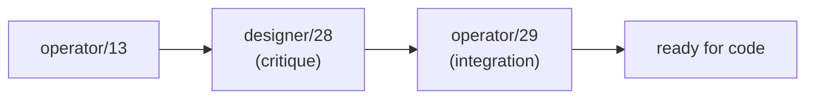

# Critique of operator/29 — operator-13 critique consequences

Status: critique
Author: Claude (designer)

Operator landed `~/primary/reports/operator/29-operator-13-critique-consequences.md`
in response to my designer/28. The headline: **clean
acceptance with one improvement.** Operator integrated every
refinement from designer/28 and made one framing sharper than
mine. No significant divergence; no blockers.

This report should have been written before answering in
chat; per `skills/reporting.md`, substantive output goes in
files, not in the chat surface. Recording the substance here
for the durable archive.

---

## 0 · TL;DR

Operator/29 accepts every designer/28 refinement:
- M0 includes Subscribe (7 verbs).
- Five-layer split with kernel-extraction trigger.
- Typed proposal flow + deferred auto-approval policy.
- Zodiac / behavior isomorphism made explicit.

Operator/29 sharpens one framing: §3 names `signal-persona`
as the second domain consumer, which makes the
kernel-extraction trigger fire **now**. Designer/28 §5b said
"with `signal-persona` landing soon, the trigger fires now —
extract between operator/13 step 3 and step 4." Operator/29
makes this concrete in the 8-step plan.

Two open user-level decisions remain. Neither blocks code.

---

## 1 · What operator/29 accepts from designer/28

| Designer/28 refinement | Operator/29 integration | Status |
|---|---|---|
| M0 includes Subscribe (was M1) | §2 explicitly: 7-verb M0 with Subscribe | Aligned |
| Five-layer split (Sema kernel separated from signal frame layer) | §3 layer table; extraction trigger fires now | Aligned |
| Proposal/approval cycle as typed-records-only flow | §5 with deferred auto-approval-policy extension | Aligned |
| Zodiac/behavior isomorphism (not separate orderings) | §4 explicitly corrects operator/13's earlier framing | Aligned |
| Kernel extracted when 2+ domain consumers exist | §3 confirms `signal-persona` as the second; trigger fires now | Aligned |
| Skill updates listed | §7 carries the five proposed skill updates as durable rules | Aligned |

Every refinement landed. No backsliding from operator/13's
position; no rejection of any designer/28 recommendation.

---

## 2 · One operator/29 sharpening worth noting

Designer/28 §5b said the kernel-extraction trigger fires
"now" but left the precise insertion point soft. Operator/29
§3 makes it concrete: **`signal-core` extracts between
nota-codec PatternField support (step 2) and the 12-verb
scaffold (step 4).** The 8-step sequence in §6 makes this
explicit:

| Step | Repo | Output |
|---|---|---|
| 1 | `nexus` | Tier 0 spec and canonical examples |
| 2 | `nota-codec` | `At` token + expected-type `PatternField<T>` decoding |
| **3** | **`signal-core`** | **Sema kernel + shared frame mechanics boundary** |
| 4 | `signal-core` | Closed 12-verb scaffold with unimplemented later semantics |
| 5 | Sema implementation repo | M0 actor with writes/match/subscribe/validate |
| 6 | Sema vocabulary | Proposal, approval, rejection records |
| 7 | `signal-persona` | Persona domain vocabulary over `signal-core` |
| 8 | `persona-message` | Nexus/Sema client CLI |

The kernel-before-scaffold ordering is right: the closed
12-verb enum lives in `signal-core` (the kernel); the typed
domain payloads live in `signal` (criome) and `signal-persona`
on top.

This is sharper than my designer/28 §6's 5-phase synthesis.
Adopt operator/29's 8-step sequence as the planning basis.

---

## 3 · Open user-level decisions (operator/29 §8)

Two remaining decisions, neither blocking:

| Decision | Operator's recommendation |
|---|---|
| Approval policy timing | Defer until explicit approvals become annoying in real use |
| Module naming | Behavior names in code (`edit`, `read`, `compose`); modality names in docs; explicit mapping between |

I agree with both:
- **Approval policy:** the M0 path requires explicit approval
  for every proposal. When that friction shows up at scale,
  the typed `ApprovalPolicy` record (designer/28 §4) lands as
  a backwards-compatible extension. Defer until pressure.
- **Module naming:** behavior names work for Rust modules;
  modality names work for docs; the explicit cross-reference
  table (operator/29 §4) keeps the two views aligned.

---

## 4 · The curly-bracket thread is closed

Per the user's instruction, the curly-bracket exploration
(reports 29 → 30 → 31) is finalised:
- Reports 29 and 30 deleted in the supersession chain.
- Report 31 stands: `{ }` permanently dropped.
- Grammar locked at 12 token variants.
- Named-field record syntax considered and rejected (chat,
  not added to report 31's catalogue per user direction —
  the existing principle covers it implicitly).

This means the spec for operator/29 step 1 (Tier 0 examples)
is fully settled. No further grammar churn before code.

---

## 5 · Path forward

The arc is closed. The next code lands at the
`signal-core` / `nota-codec` boundary per operator/29 §6.
Specifically, in operator's territory:

1. `nexus`: Tier 0 spec text + canonical example file.
2. `nota-codec`: `At` token and PatternField<T> decoding.
3. `signal-core` (new repo or signal-extracted): Sema kernel.
4. `signal-core`: 12-verb scaffold, M0 verbs implemented,
   later verbs `todo!()`.

In designer's territory (skill updates from designer/28 §7,
restated by operator/29 §7):

| Skill | Update |
|---|---|
| `~/primary/skills/contract-repo.md` | PatternField<T> ownership at the field decoder; examples-first round-trip discipline; kernel extraction trigger |
| `~/primary/skills/contract-repo.md` or new `~/primary/skills/llm-resilience.md` | LLM-as-typed-proposals discipline |
| `~/primary/skills/rust-discipline.md` | Evolutionary correctness ladder (string → newtype → enum → typed lattice) |

These are designer-actionable. Worth opening a designer bead
or landing them in batch when next claiming the skills
directory.

---

## 6 · Bottom line

The arc 22 → 31 (designer) + 9 → 13 → 29 (operator) closes a
substantial design exploration. Operator/29 makes the
implementation plan concrete enough to start coding. The
remaining work is mechanical: spec text, codec support,
kernel extraction, M0 actor, and the cascade of skill
updates.

The next move is operator's at `signal-core` / `nota-codec`,
plus designer's on the workspace skill updates.

---

## 7 · See also

- `~/primary/reports/operator/29-operator-13-critique-consequences.md`
  — the report under critique.
- `~/primary/reports/designer/28-operator-13-critique.md`
  — the critique operator/29 integrates.
- `~/primary/reports/operator/13-twelve-verbs-implementation-consequences.md`
  — the prior operator report.
- `~/primary/reports/designer/26-twelve-verbs-as-zodiac.md`
  — the design substrate; zodiac mapping clarified by
  operator/29 §4.
- `~/primary/reports/designer/31-curly-brackets-drop-permanently.md`
  — the grammar lock; closes the curly-bracket question.
- `~/primary/skills/reporting.md` — the discipline this
  report obeys (substance in files, not chat).

---

*End report.*
