*Kind: Synthesis · Topic: mvp-visual-state-of-play · Date: 2026-05-24*

# 321 — MVP visual state of play

**Status:** the visual state pre-dates `/323`'s scope expansion (ShortHeader consumption + dispatch, schema-derived projection in MVP, box-form NOTA library) and `/323 §10`'s hard-handover cutover discipline. Diagrams remain useful as foundation visuals; the integrated picture is in `/324`. Intents 405-408 (per second-designer/166) post-hoc ratify the schema-derived MVP direction this report sketched; the picture sharpened in `/322` (Spirit worked example) + `/323` (scope expansion + cutover discipline).

**The picture in one sentence:** operator's `primary-2cjv` landed
the wire-side foundation (`ShortHeader(u64)` on every Frame);
operator's `/318` Wave-4 landed the upgrade triad merger; designer's
`/164` + `/320` + spirit 388-400 close the schema-language + macro
+ header-generation design; pilot bead `primary-ezqx.1` is the
end-to-end Spirit cutover that proves the MVP works.

## §1 The MVP in one diagram

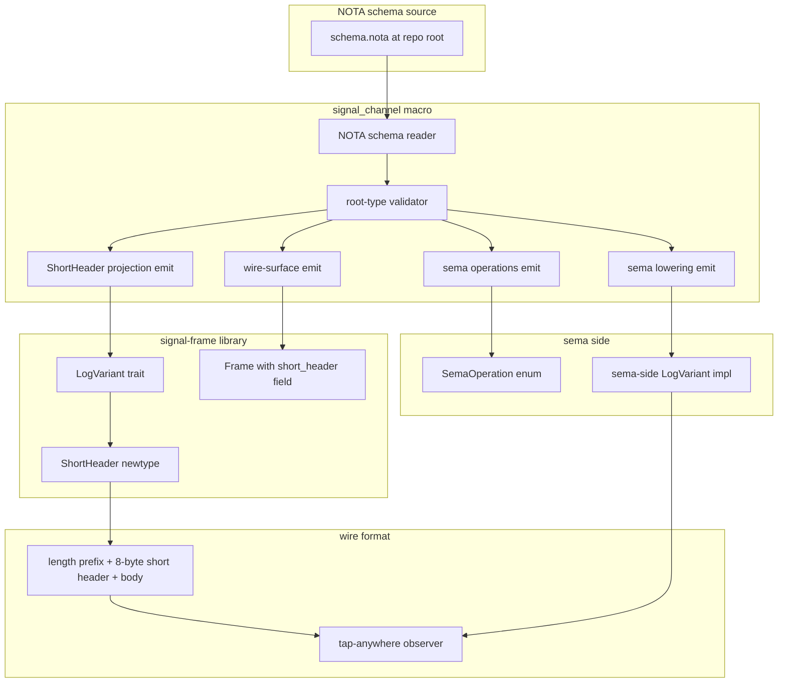

Reading the diagram clockwise from `schema.nota`:

| Step | What | Status |
|---|---|---|
| Schema source | `schema.nota` at repo root (one file per contract) | NEW for MVP |
| Schema reader | Parses NOTA-data into structured `ChannelSpec` | NEW for MVP |
| Validator | Root-type check + engine annotation validation + cycle detection | NEW for MVP |
| Wire-surface emit | Operation/Reply/Event enums + codec impls | TODAY (Rust-syntax input) |
| ShortHeader projection emit | `impl LogVariant for Operation` packing the 64 bits | NEW for MVP |
| Sema operations emit | `Command` + `Effect` + `ToSemaOperation` + `ToSemaOutcome` | NEW for MVP (today hand-written) |
| Sema lowering emit | Default dispatcher routing to `engine.assert/match/...` | NEW for MVP (today hand-written) |
| `ShortHeader` newtype | `ShortHeader(u64)` in `signal-frame/src/frame.rs:20` | LANDED via 2cjv |
| `LogVariant` trait | `signal-frame/src/log_variant.rs` | NEW for MVP |
| Frame struct | `ExchangeFrame`/`StreamingFrame` with `short_header` field | LANDED via 2cjv |
| `SemaOperation` enum | `signal-sema/src/operation.rs` (Assert/Mutate/Retract/Match/Subscribe/Validate) | LANDED |
| Sema-side `LogVariant` | Manual impl on `SemaOperation` | NEW for MVP |
| Wire envelope | u32 length + 8-byte short header + rkyv-archived body | LANDED via 2cjv |
| Tap-anywhere observer | Subscribes to short-header stream | TARGET for MVP pilot test |

## §2 What's landed — the foundation

### §2.1 Wire-side foundation (operator's `primary-2cjv`)

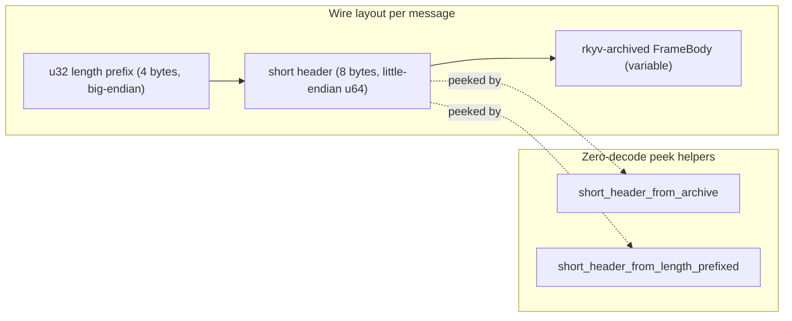

Verified at `signal-frame/src/frame.rs`:

| Element | Source | Verified |
|---|---|---|
| `ShortHeader(u64)` newtype | `frame.rs:20` | yes |
| `ExchangeFrame { short_header, body }` | `frame.rs:87-89` | yes |
| `StreamingFrame { short_header, body }` | `frame.rs:93-94` | yes |
| `with_short_header(...)` constructor | `frame.rs:103-107` | yes |
| `short_header()` accessor | `frame.rs:110-111` | yes |
| `short_header_from_archive(bytes)` | `frame.rs:191` | yes |
| `short_header_from_length_prefixed(bytes)` | (companion) | yes |
| Round-trip + peek tests | `tests/frame.rs:128+` | yes |
| `SHORT_HEADER_BYTE_COUNT = 8` | `frame.rs` | yes |
| Default `ShortHeader::empty()` (zero) | `frame.rs:27` | yes |

Operator picked up the canonical name per spirit 388 (not the
older `micro` from `/308`). Foundation is clean.

### §2.2 Upgrade triad (operator's `/318` Wave-4)

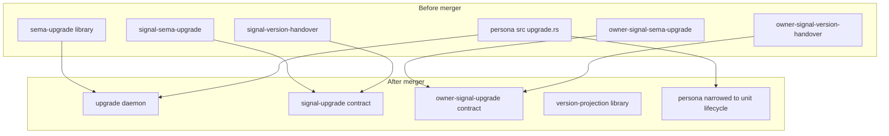

| Repo | Action | Status |
|---|---|---|
| `upgrade` | NEW daemon repo at `2f56e37d` | LANDED |
| `signal-upgrade` | merged from `signal-sema-upgrade` + `signal-version-handover` | LANDED |
| `owner-signal-upgrade` | merged from owner contracts | LANDED |
| `version-projection` | renamed `MigrationIndex` → `RuntimeMigrationLookup`; `MigrationCatalogue` new in `upgrade` | LANDED at `7ce14f0c` |
| `persona` | shed `AttemptHandover` + handover dispatch; kept systemd unit-start | LANDED at `78a4feb0` |
| `sema-upgrade` | retained as transitional; `PrototypeHandover` retired per `/317-1 §2.6` | LANDED at `734cbd98` |
| `persona-sema` | RETIRED (collision with `sema` storage kernel) | LANDED |
| `signal-persona-terminal-test` | empty repo removed | LANDED |

Beads closed: `primary-l3h5.2-.6`, `primary-wpnd`, `primary-a0m7`.
Remaining `/318` tail: `primary-0m1u.11` (R11 spirit rename),
`primary-0m1u.12` (R12 persona meta + CriomOS repin),
`primary-l3h5.7` (U7 upgrade triad deployment repin) — all
pilot-blocked.

### §2.3 Macro foundation (operator's closed beads)

| Bead | What | Where |
|---|---|---|
| `primary-li0p` | `NamespaceSection` + `SECTION_CUTOFF = 100` + `classify` | `signal-frame/src/namespace.rs:13-45` |
| `primary-avog` | `assert_triad_sections!` macro | `signal-frame/src/namespace.rs:55-86` |
| `primary-915w` | `signal_cli!` + `Caller` + `ClientShape` + full main generation | `signal-frame/src/caller.rs` + `command_line.rs:765-824` |
| `primary-2cjv` | Frame reshape with `ShortHeader` field | `signal-frame/src/frame.rs:20+` |

These four beads ground the rest of `primary-ezqx`.

## §3 What's designed — schema-language v3 + MVP closures

### §3.1 The NOTA schema-language v3 grammar (per `/164`)

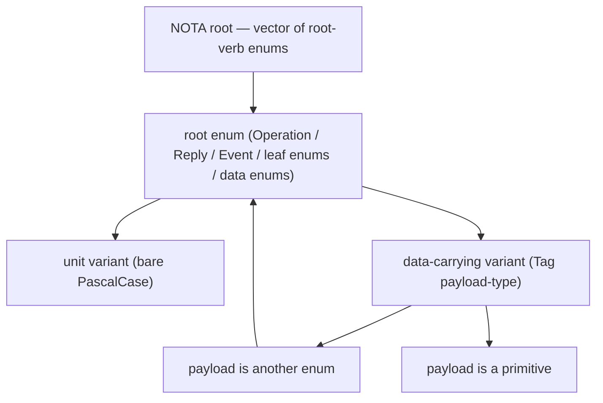

Minimal grammar (per `/164 §3`):

- Top level = NOTA vector
- Each vector element = `(EnumName variants…)`
- Variants are bare PascalCase (unit) or `(VariantName PayloadTypeName)` (data-carrying)
- Payload types reference other enums OR built-in primitives
- Two-layer minimum (per spirit 394)
- Primitives: `String`, `u8-u64`, `bool`, `Date`, `Time`, `Bytes`, `[Vec T]`, `[Option T]` (per `/320 §2.4`)
- Strings use bracket form `[text]` per `nota/example.nota` + `primary-36iq` migration

### §3.2 The macro emits three layers (per spirit 396)

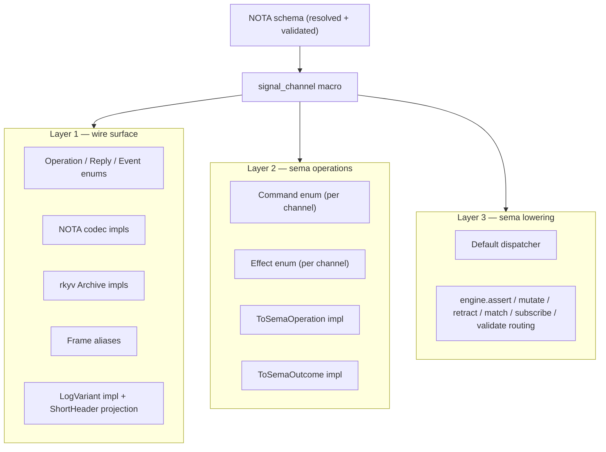

Today only Layer 1 is macro-emitted (per second-designer/163);
Layers 2 + 3 are hand-written in the daemon. The MVP brings all
three layers under macro emission, driven by the `(engine X)`
annotations in the schema.

### §3.3 The 64-bit short header layout (MVP — even byte, no packing)

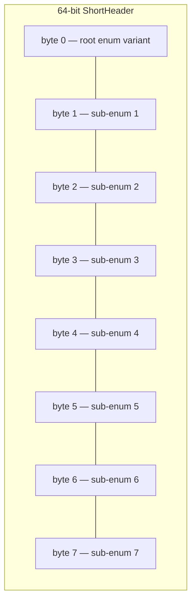

MVP-scope decisions per spirit 392 + `/320 §2.9 + §2.10`:

| Property | MVP value | Post-MVP option |
|---|---|---|
| Total size | 8 bytes (u64) | unchanged |
| Number of enums | 1 root + 7 sub | unchanged |
| Per-enum bit budget | 8 bits each | sub-byte packing (1-bit bool, 4-bit small enums, multi-byte large enums) |
| Layout model | hierarchical-positional (all 8 enums populate in parallel) | tagged-union / per-root-variant-layout |
| Version field | none (engine handles at database level) | unchanged |
| Carries data | no — discriminators only | unchanged |

### §3.4 Sema-side parallel header (per spirit 390)

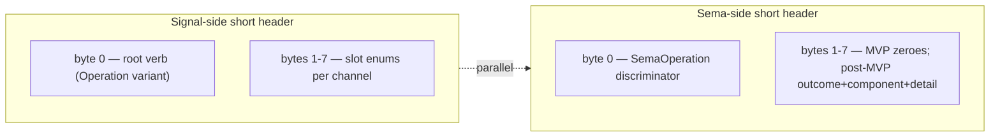

Sema-side is symmetric — same `LogVariant` trait, distinct
vocabulary. MVP populates byte 0 only; bytes 1-7 zero. Future
extension (per `/308 §4` six tap points): outcome + component
tag + operation class + sub-detail.

## §4 The MVP pilot path — operator's `primary-ezqx.1`

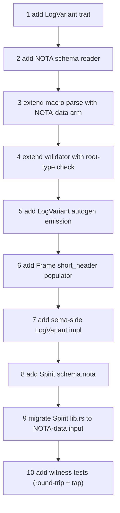

Step-to-target-file map:

| Step | Target file | Decision marker |
|---|---|---|
| 1 | `signal-frame/src/log_variant.rs` (NEW) | §2.12 |
| 2 | `signal-frame-macros/src/schema_reader.rs` (NEW) | §2.7 |
| 3 | `signal-frame-macros/src/parse.rs` (extend) | §2.8 |
| 4 | `signal-frame-macros/src/validate.rs` (extend) | §3.4 of /320 |
| 5 | `signal-frame-macros/src/emit.rs` (extend) | §2.9, §2.10 |
| 6 | `signal-frame-macros/src/emit.rs` (extend) | none |
| 7 | `signal-sema/src/operation.rs` (extend) | §2.13 |
| 8 | `signal-persona-spirit/schema.nota` (NEW) | §2.1, §2.3 |
| 9 | `signal-persona-spirit/src/lib.rs` (rewrite) | §2.2 |
| 10 | `signal-persona-spirit/tests/short_header.rs` (NEW) | — |

(§N refers to `/320 §2.N`'s closed-decision markers.)

Size: ~900 LoC macro/lib + ~70 LoC schema + ~200 LoC tests; one
focused operator session, two with verification + cleanup.

### §4.1 The pilot's end-to-end test

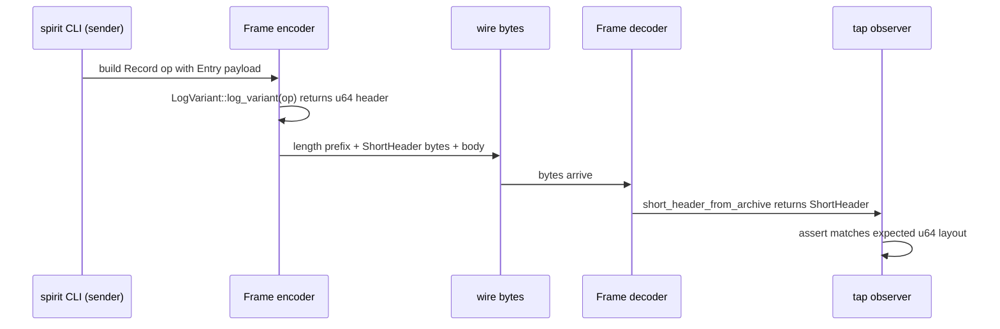

Acceptance: tap observer receives the header for a fired `Record`
op; the u64 layout matches `byte 0 = Record discriminator`,
bytes 1-7 = sub-enum slot discriminators (e.g., the `Entry`'s
`certainty: Magnitude` slot value).

## §5 What's adjacent and parallel

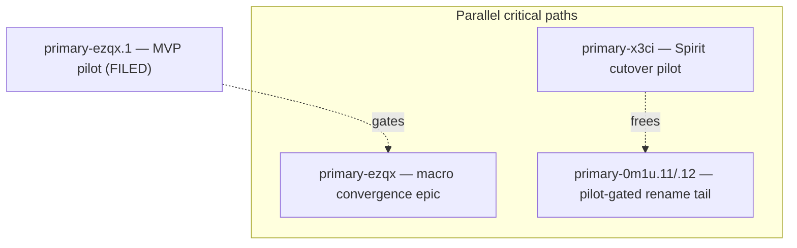

| Track | Status | Blocker |
|---|---|---|
| `primary-ezqx.1` MVP pilot | FILED today | none (ready) |
| `primary-ezqx` slots 1-5 + 6 | OPEN | depends on `primary-ezqx.1` substrate |
| `primary-x3ci` Spirit cutover | OPEN | `primary-a5hu` Persona deploy + `primary-wdl6` v0.1.0 retrofit + NEW pre-migration step |
| `primary-0m1u.11` spirit rename | BLOCKED | `primary-x3ci` |
| `primary-0m1u.12` persona meta + CriomOS repin | BLOCKED | `primary-0m1u.11` |
| `primary-l3h5.7` upgrade deploy repin | BLOCKED | `primary-0m1u.12` |
| `primary-gvgj` agent triad epic | OPEN | naming-sensitive on R10 ratification |

## §6 What's outside the MVP — deferred

```mermaid
flowchart LR
    subgraph mvp [MVP — primary-ezqx.1]
        mvp_a["NOTA schema input"]
        mvp_b["root-type validation"]
        mvp_c["ShortHeader generation"]
        mvp_d["Spirit pilot"]
        mvp_e["even-byte 8-enum split"]
    end

    subgraph post_mvp [Post-MVP — separate beads]
        pm_a["sub-byte packing optimization"]
        pm_b["schema component daemon"]
        pm_c["sema bytes 1-7 layout"]
        pm_d["recursive Help emission"]
        pm_e["next-as-dep VersionProjection"]
        pm_f["mass workspace cutover"]
        pm_g["full version-diff upgrade-marking"]
    end

    mvp -.unblocks.-> post_mvp
```

| Deferred concern | Reason | Tracking |
|---|---|---|
| Sub-byte packing (1-bit bool, 4-bit small enums, multi-byte) | spirit 392 — defer post-MVP, upgrade mechanism delivers later | spirit 389 |
| Schema component daemon (runtime registry) | MVP uses library face only | spirit 397 |
| Full sema bytes 1-7 layout | MVP zeroes; concrete need surfaces post-pilot | spirit 390 |
| Recursive Help on every enum | parallel epic slot, not pilot-critical | `primary-8r1j` |
| Next-as-dep `VersionProjection` emission | parallel epic slot | `primary-ezqx` Slot 6 |
| Mass workspace cutover from Rust-syntax to NOTA-data input | Spirit pilot only; other components per their own beads | per-component beads TBD |
| Version-diff-driven upgrade-type marking | builds on schema component daemon | post-MVP |

## §7 The full dependency graph — landed and designed

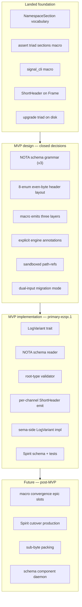

## §8 Where things live — file map for the MVP

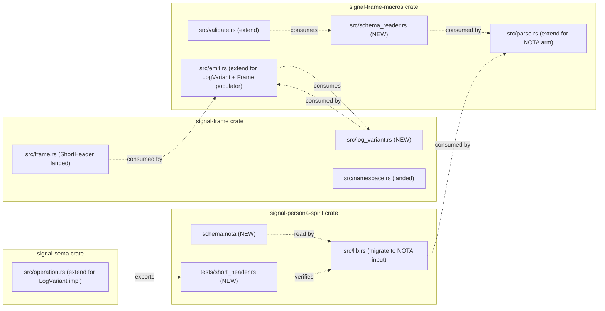

NEW files in the MVP: `signal-frame/src/log_variant.rs`,
`signal-frame-macros/src/schema_reader.rs`,
`signal-persona-spirit/schema.nota`,
`signal-persona-spirit/tests/short_header.rs`.

Extended files: `signal-frame-macros/src/{parse, validate, emit}.rs`,
`signal-sema/src/operation.rs`, `signal-persona-spirit/src/lib.rs`.

## §9 The intent chain that produced the MVP

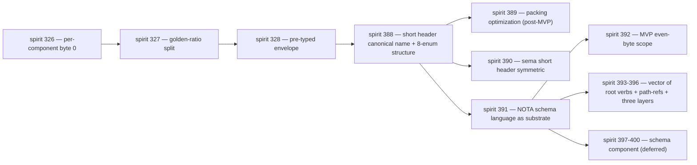

The chain reads as one direction: per-component namespacing →
asymmetric split → pre-typed envelope → canonical short header
naming + 8-enum structure → packing + symmetry + schema source +
MVP scope + grammar + runtime registry. Each step builds on the
previous; the MVP scope picks the smallest viable cut.

## §10 What designer reviews when operator delivers

Per `/320 §5`:

| Check | Acceptance |
|---|---|
| `LogVariant` trait shape | Matches `/320 §2.12`; re-exported from `signal-frame` |
| NOTA schema reader | Resolves path-refs sandboxed per `/320 §2.7`; rejects out-of-sandbox refs with clear error |
| Validator | Root-type check per `/320 §3.4`; engine annotations validated; cycle detection works |
| Macro NOTA-data arm | Detects `[` first token; falls through cleanly to Rust-syntax otherwise |
| `LogVariant` autogen | Emits byte 0 = root variant discriminator; bytes 1-7 = sub-enum slot discriminators in parallel per `/320 §2.10` |
| Sema-side impl | `SemaOperation::log_variant()` packs byte 0 correctly; bytes 1-7 zero (MVP) |
| Schema file | Spirit schema matches `/164 §6.1`; engine annotations Shape A per `/320 §2.1` |
| Spirit `lib.rs` migration | NOTA-data form replaces Rust-syntax; existing tests still pass |
| Round-trip test | Asserts the expected u64 layout |
| Tap test | Observer receives the header for a fired `Record` op |
| **Markers inlined** | Every `/320 §2` marker present in the corresponding code site |

If operator hits a blocker, they bd-comment; designer responds
with a revised decision + updated marker per `/320 §5`.

## §11 Notable disciplines that hold across the MVP

- **NOTA bracket-string form** per `nota/example.nota` and
  `primary-36iq` migration — all NOTA authoring uses `[text]`
  for strings, `[|...|]` for multi-line text. The legacy `"..."`
  form is being retired across the workspace.
- **`jj` headless commits only** — every operator bead body
  restates the `-m '<msg>'` inline-only rule per `skills/jj.md`.
- **`max-jobs 0` for Nix calls** per psyche directive.
- **No `/nix/store` filesystem search** — use `nix eval` /
  `nix flake show` / `nix path-info`.
- **Mermaid label discipline per `skills/mermaid.md`** — short
  prose nodes, IDs in sibling tables (this report follows).
- **Substance migrations cite permanent homes** — every
  retire-able report carries a successor pointer; commit tree
  is the archive per spirit 370.
- **`// DESIGN-DECISION-REVIEW (designer/320 §N)` markers**
  inlined at every closed-decision site per psyche directive.

## §12 See also

### Latest design (consumed by this report)

- `reports/second-designer/164-nota-schema-language-vector-of-root-verb-enums-2026-05-24.md`
  — schema-language v3 grammar (vector of root-verb enums,
  two-layer mandatory, path-refs, macro emits three layers)
- `reports/designer/320-mvp-schema-language-pilot-unblock.md`
  — MVP design closing 13 decisions; operator bead spec
- `reports/designer/319-schema-stack-context-maintenance-sweep/4-overview-and-retirement-list.md`
  — designer-lane current state after sweep
- `reports/designer/318-upgrade-merger-and-persona-prefix-rename/4-overview-and-bead-list.md`
  — upgrade triad merger + persona-prefix rename roadmap
- `reports/designer/317-sema-upgrade-and-macro-convergence-audit/4-overview.md`
  — macro convergence epic context
- `reports/operator/169-post-318-refresh-and-next-work-2026-05-24.md`
  — operator's confirmation of Wave-4 landing + next-work
  recommendation

### Landed code (consumed by this report)

- `signal-frame/src/frame.rs:20-200` — `ShortHeader` newtype +
  `ExchangeFrame`/`StreamingFrame` with `short_header` field +
  peek helpers (operator's `primary-2cjv`)
- `signal-frame/src/namespace.rs:13-86` — `NamespaceSection` +
  `SECTION_CUTOFF` + `assert_triad_sections!` (operator's
  `primary-li0p` + `primary-avog`)
- `signal-frame/src/caller.rs` + `command_line.rs:765-824` —
  `signal_cli!` foundation (operator's `primary-915w`)
- `/git/github.com/LiGoldragon/upgrade/` — NEW upgrade triad
  daemon (operator's `/318` U4)
- `/git/github.com/LiGoldragon/signal-upgrade/` and
  `owner-signal-upgrade/` — NEW merged contracts (operator's
  `/318` U2 + U3)
- `nota/example.nota` — canonical bracket-string syntax example

### Beads in flight

- `primary-ezqx.1` — MVP pilot (filed today; ready)
- `primary-ezqx` — macro convergence epic (parent)
- `primary-x3ci` — Spirit cutover (pilot-blocked tail)
- `primary-a5hu` — Persona deploy (Spirit cutover blocker)
- `primary-wdl6` — v0.1.0 protocol-aware retrofit (Spirit
  cutover blocker)
- `primary-0m1u.11/.12` — pilot-gated rename tail
- `primary-l3h5.7` — upgrade triad deployment repin

### Spirit records cited

- 326-328 (upstream namespacing + envelope direction)
- 388-389 (short header naming + packing — packing deferred to
  post-MVP)
- 390 (sema short header symmetric)
- 391 (NOTA schema language)
- 392 (MVP even-byte scope — load-bearing constraint)
- 393-396 (vector of root verbs + path-refs + three-layer emit)
- 397-400 (schema component — runtime registry + library +
  macro substrate + separate-repo option; deferred post-MVP)

### Skills cited

- `skills/mermaid.md` §"Label sizing" — short prose nodes, IDs
  in sibling tables (this report follows)
- `skills/reporting.md` §"Deleted reports live in the commit
  tree" — supersession + retrieval discipline (spirit 370)
- `skills/nota-design.md` — positional-record rules; bracket
  strings; bare identifiers
- `skills/component-triad.md` — triad shape rules the upgrade
  triad conforms to
- `skills/context-maintenance.md` — sweep methodology (`/319`
  applied)
