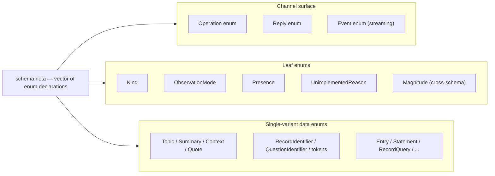
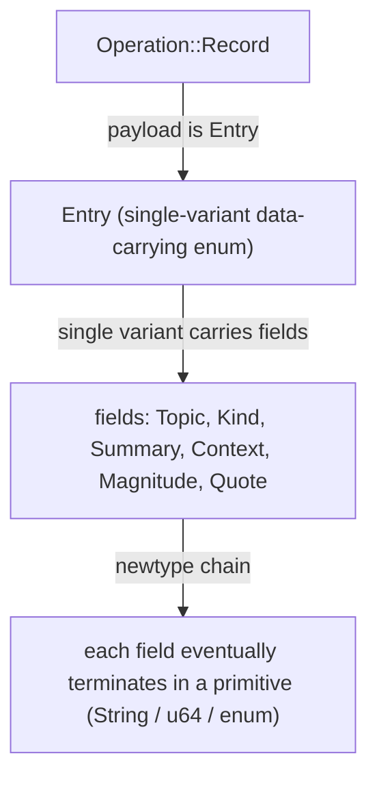
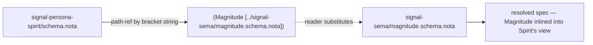
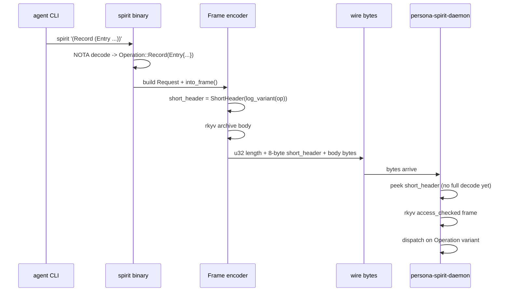
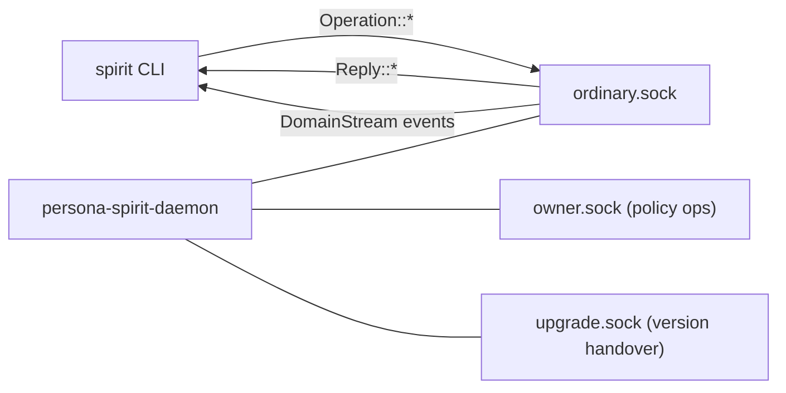

*Kind: Design · Topic: spirit-mvp-positional-schema-worked-example · Date: 2026-05-24*

# 322 — Spirit MVP positional schema — worked example

**The schema in one paragraph.** Spirit's MVP schema is a single
NOTA vector of root-verb enums declaring the channel's wire
surface positionally. Field names disappear (type-names derive
them by convention); container types use bracket form
(`[Vec T]`, `[Option T]`); strings use bracket form (`[text]`);
cross-schema references are bracket-string path-refs. The macro
consumes the schema and emits Rust types + NOTA codec + rkyv
codec + `ShortHeader` projection per channel.

## §1 The Spirit schema — `signal-persona-spirit/schema.nota`

```nota
[
  (Operation
    (State Statement)
    (Record Entry)
    (Observe Observation)
    (Watch Subscription)
    (Unwatch SubscriptionToken))

  (Reply
    (RecordAccepted RecordAccepted)
    (StateObserved StateObserved)
    (RecordsObserved RecordsObserved)
    (RecordProvenancesObserved RecordProvenancesObserved)
    (TopicsObserved TopicsObserved)
    (QuestionsObserved QuestionsObserved)
    (SubscriptionOpened SubscriptionOpened)
    (SubscriptionRetracted SubscriptionRetracted)
    (RequestUnimplemented RequestUnimplemented))

  (Event
    (StateChanged (StateChanged belongs DomainStream))
    (RecordCaptured (RecordCaptured belongs DomainStream)))

  (Kind Decision Principle Correction Clarification Constraint)
  (ObservationMode SummaryOnly WithProvenance)
  (Presence Active Absent)
  (UnimplementedReason NotBuiltYet IntegrationNotLanded)

  (Magnitude [../signal-sema/magnitude.schema.nota])

  (Topic (Topic String))
  (Summary (Summary String))
  (Context (Context String))
  (Quote (Quote String))
  (StatementText (StatementText String))
  (RecordIdentifier (RecordIdentifier u64))
  (QuestionIdentifier (QuestionIdentifier String))
  (QuestionText (QuestionText String))
  (FocusArea (FocusArea String))
  (StateSubscriptionToken (StateSubscriptionToken u64))
  (RecordSubscriptionToken (RecordSubscriptionToken u64))

  (Entry (Entry Topic Kind Summary Context Magnitude Quote))
  (Statement (Statement StatementText))
  (RecordQuery (RecordQuery [Option Topic] [Option Kind] ObservationMode))
  (RecordSubscription (RecordSubscription [Option Topic] ObservationMode))
  (RecordSummary (RecordSummary RecordIdentifier Topic Kind Summary Magnitude))
  (RecordProvenance (RecordProvenance RecordSummary Context Date Time Quote))
  (TopicCount (TopicCount Topic u64))
  (State (State Presence [Option FocusArea]))
  (QuestionSummary (QuestionSummary QuestionIdentifier QuestionText))

  (Observation
    State
    (Records RecordQuery)
    Topics
    Questions)

  (Subscription
    State
    (Records RecordSubscription))

  (SubscriptionToken
    (State StateSubscriptionToken)
    (Records RecordSubscriptionToken))

  (RecordAccepted (RecordAccepted RecordIdentifier))
  (StateObserved (StateObserved State))
  (RecordsObserved (RecordsObserved [Vec RecordSummary]))
  (RecordProvenancesObserved (RecordProvenancesObserved [Vec RecordProvenance]))
  (TopicsObserved (TopicsObserved [Vec TopicCount]))
  (QuestionsObserved (QuestionsObserved [Vec QuestionSummary]))
  (SubscriptionOpened (SubscriptionOpened SubscriptionToken SubscriptionSnapshot))
  (SubscriptionRetracted (SubscriptionRetracted SubscriptionToken))
  (RequestUnimplemented (RequestUnimplemented UnimplementedReason))

  (SubscriptionSnapshot
    (State State)
    (Records [Vec RecordSummary]))

  (StateChanged (StateChanged State))
  (RecordCaptured (RecordCaptured RecordSummary))
]
```

~50 lines of NOTA. Today's hand-written `signal-persona-spirit/src/lib.rs`
is 468 lines (per `/164 §7`). The schema is ~89% smaller.

## §2 What's positional about this — the discipline

| Today (`/164 §6.1` framing) | This MVP form |
|---|---|
| `(Entry (Entry topic Topic kind Kind summary Summary …))` — field name + type pairs | `(Entry (Entry Topic Kind Summary Context Magnitude Quote))` — type-only, pure positional |
| `"path/to/schema.nota"` quoted string | `[path/to/schema.nota]` bracket-string per `nota/example.nota` |
| Implicit container syntax | `[Vec T]` / `[Option T]` explicit container constructors |

Field names disappear because the Rust struct field name derives
from the type name by convention: a `Topic` field is named
`topic`, a `Magnitude` field is named whatever the dimension is
(here `certainty` — that ONE override is the only place the
schema needs context, addressed below in §3.4).

The benefit: schemas read uniformly. Every entry in the root
vector is `(EnumName variants…)`. Every variant is either a bare
PascalCase token (unit) or `(VariantName PayloadType)`. No
special cases.

## §3 Schema structure — visualized

### §3.1 The three root concerns Spirit's schema declares



### §3.2 The depth chain — Operation → Entry → primitive



A `Record` operation's payload is an `Entry`. `Entry` is a
single-variant data-carrying enum carrying six newtype-wrapped
fields. Each newtype is a single-variant data enum over a
primitive (`String` for text, `u64` for IDs, leaf enum for Kind
and Magnitude). The chain bottoms out at primitives.

### §3.3 Cross-schema reference — `Magnitude` from `signal-sema`



The macro never sees the path-ref. The reader resolves the path
(sandboxed per `/320 §2.7` — only sibling files in the same
crate's schema directory + Cargo-dep crates' exported schemas),
substitutes `Magnitude`'s declaration inline, and hands the
canonical-resolved spec to the macro.

### §3.4 The one field-naming override — `certainty` for Magnitude

The convention "field name = type name lowercased" works for
every Spirit field EXCEPT `Entry`'s `certainty` (the Magnitude
field is semantically a certainty in Spirit's domain — different
component might call it `priority` or `severity`).

Two ways to handle this:

| Option | Schema | Notes |
|---|---|---|
| A | `(Entry Topic Kind Summary Context Magnitude Quote)` — type-only positional | Macro defaults `certainty: Magnitude`; no override needed for MVP; semantic loss |
| B | `(Entry Topic Kind Summary Context (certainty Magnitude) Quote)` — sub-record `(field-name type)` only where override needed | Override syntax; cleaner long-term |

**Lean: A for MVP** (default + accept the field-name semantic
loss; the macro emits `pub certainty: Magnitude` because there
are no other Magnitude fields in Entry — disambiguation isn't
needed). Add option B as the override syntax in a post-MVP
extension when a contract has multiple fields of the same type.

**Marker:** `// DESIGN-DECISION-REVIEW (designer/322 §3.4):
type-only positional with field-name = type-name-lowercased
default. Alternative: explicit (field-name type) override syntax
where ambiguity needs disambiguation. Revisit when a contract
has multiple fields of the same primitive type and the default
naming becomes ambiguous.`

## §4 What the macro emits — Layer 1 (wire surface)

The macro reads the schema + emits Rust types. Showing the key
emissions:

### §4.1 The `Operation` enum

```rust
// Macro-emitted from (Operation (State Statement) (Record Entry) ...):
#[derive(Archive, RkyvSerialize, RkyvDeserialize,
         NotaEnum, Debug, Clone, PartialEq, Eq)]
pub enum Operation {
    State(Statement),
    Record(Entry),
    Observe(Observation),
    Watch(Subscription),
    Unwatch(SubscriptionToken),
    Tap(ObserverFilter),                  // macro-injected (per /164 §6.1)
    Untap(ObserverSubscriptionToken),     // macro-injected
}
```

### §4.2 The composite `Entry` struct (single-variant collapse per `/320 §2.2`)

```rust
// Macro-emitted from (Entry (Entry Topic Kind Summary Context Magnitude Quote)):
#[derive(Archive, RkyvSerialize, RkyvDeserialize,
         NotaRecord, Debug, Clone, PartialEq, Eq)]
pub struct Entry {
    pub topic: Topic,
    pub kind: Kind,
    pub summary: Summary,
    pub context: Context,
    pub certainty: Magnitude,
    pub quote: Quote,
}
```

(Note `certainty` is the field name despite the type being
`Magnitude` — convention is type-name lowercased UNLESS the
emitter has a per-channel override table. For Spirit, the
`certainty` override lives in the macro's per-channel name-map
or in a sibling `.nota.override` file post-MVP. MVP emits
`pub magnitude: Magnitude` if no override table exists; the
operator-side override of the field name is part of the §3.4
post-MVP extension.)

### §4.3 The transparent `Topic` newtype

```rust
// Macro-emitted from (Topic (Topic String)):
#[derive(Archive, RkyvSerialize, RkyvDeserialize,
         NotaTransparent, Debug, Clone, PartialEq, Eq, Hash)]
pub struct Topic(String);

impl Topic {
    pub fn new(value: impl Into<String>) -> Self {
        Self(value.into())
    }

    pub fn as_str(&self) -> &str {
        &self.0
    }
}
```

`NotaTransparent` makes the newtype invisible at the wire — a
`Topic` encodes as bare-ident or bracket-string (whichever the
content allows), same as the inner `String`.

### §4.4 The leaf `Kind` enum

```rust
// Macro-emitted from (Kind Decision Principle Correction Clarification Constraint):
#[derive(Archive, RkyvSerialize, RkyvDeserialize,
         NotaEnum, Debug, Clone, Copy, PartialEq, Eq, Hash)]
pub enum Kind {
    Decision,
    Principle,
    Correction,
    Clarification,
    Constraint,
}
```

### §4.5 The `ShortHeader` projection per channel

The macro emits one `impl LogVariant for Operation` packing byte
0 = variant discriminator and bytes 1-7 = sub-enum slot
discriminators in parallel (per `/320 §2.10` hierarchical-
positional):

```rust
// Macro-emitted from the (Operation ...) declaration:
impl LogVariant for Operation {
    fn log_variant(&self) -> u64 {
        let mut bytes = [0u8; 8];
        match self {
            Self::State(payload) => {
                bytes[0] = 0;
                // bytes[1..8] from payload.log_variant() if it has sub-enums;
                // for Statement (single newtype over StatementText/String) the rest
                // stays zero in MVP (String is unsized; not a sub-enum slot).
            }
            Self::Record(payload) => {
                bytes[0] = 1;
                // Entry has Kind + Magnitude as sub-enums (sized leaves);
                // pack discriminators into bytes 1-2.
                bytes[1] = payload.kind as u8;
                bytes[2] = payload.certainty as u8;
            }
            Self::Observe(payload) => {
                bytes[0] = 2;
                bytes[1] = match payload {
                    Observation::State          => 0,
                    Observation::Records(_)     => 1,
                    Observation::Topics         => 2,
                    Observation::Questions      => 3,
                };
            }
            Self::Watch(payload) => {
                bytes[0] = 3;
                bytes[1] = match payload {
                    Subscription::State        => 0,
                    Subscription::Records(_)   => 1,
                };
            }
            Self::Unwatch(payload) => {
                bytes[0] = 4;
                bytes[1] = match payload {
                    SubscriptionToken::State(_)   => 0,
                    SubscriptionToken::Records(_) => 1,
                };
            }
            Self::Tap(_)   => bytes[0] = 5,
            Self::Untap(_) => bytes[0] = 6,
        }
        u64::from_le_bytes(bytes)
    }
}
```

The macro derives this by walking the schema:
- Byte 0 = variant index in the `Operation` declaration.
- Bytes 1+ = recursive `log_variant()` on the payload's sized
  sub-enum fields (Kind, Magnitude, nested enum variants).
- Unsized payload fields (Strings, Vecs) DON'T contribute
  short-header bits — their content lives in the body.

### §4.6 The Frame populator — wire shape

```rust
// Macro-emitted helper for building Frame from Operation:
impl Request<Operation> {
    pub fn into_frame(self, exchange: ExchangeIdentifier) -> Frame {
        let short_header = ShortHeader::new(self.payload().log_variant());
        Frame::with_short_header(
            short_header,
            FrameBody::Request { exchange, request: self },
        )
    }
}
```

The constructor calls `log_variant()` on the payload and passes
the result to `Frame::with_short_header()` (already landed via
`primary-2cjv` per `signal-frame/src/frame.rs:103-107`).

## §5 One operation, end-to-end — `Record` with an `Entry`

### §5.1 The NOTA input — what the agent sends through `spirit` CLI

```sh
spirit '(Record (Entry [workspace] Decision [summary text] [context text] Maximum [verbatim quote]))'
```

Reading the NOTA positionally:
- `Record` — selects the `Operation::Record` variant.
- `(Entry …)` — the payload, an `Entry` struct.
- `[workspace]` — first positional field = `topic` (bracket
  string, decodes to `Topic("workspace")`).
- `Decision` — second positional field = `kind` (bare PascalCase
  matches `Kind::Decision`).
- `[summary text]` — third = `summary` (bracket string →
  `Summary("summary text")`).
- `[context text]` — fourth = `context` → `Context("...")`.
- `Maximum` — fifth = `certainty` → `Magnitude::Maximum`.
- `[verbatim quote]` — sixth = `quote` → `Quote("...")`.

### §5.2 Wire sequence diagram



### §5.3 The wire bytes for our `Record` example

For `Record(Entry{Topic("workspace"), Kind::Decision, Summary("..."), Context("..."), Magnitude::Maximum, Quote("...")})`:

| Byte offset | Content | Source |
|---|---|---|
| 0..4 | u32 BE length prefix | wire envelope |
| 4..12 | 8-byte `ShortHeader` LE: `[01, 00, 06, 00, 00, 00, 00, 00]` | `log_variant()` per §4.5 |
| 12.. | rkyv-archived `FrameBody::Request{...}` containing the full Entry | rkyv |

Reading the short header bytes:
- byte 0 = `0x01` (`Operation::Record` discriminant)
- byte 1 = `0x00` (`Kind::Decision` discriminant)
- byte 2 = `0x06` (`Magnitude::Maximum` discriminant — 7 variants, Maximum = index 6)
- bytes 3-7 = zero (no more sized sub-enums in Entry; Topic / Summary / Context / Quote are unsized String wrappers, content lives in body)

A tap-anywhere observer reading the first 12 bytes already knows:
"this is a Record-of-Decision-at-Maximum-certainty" without
decoding any string payload. That's the whole point of the
short header.

### §5.4 The peek path — short header without full decode

```rust
// In persona-spirit-daemon's ingress tap:
use signal_frame::{ShortHeader, short_header_from_length_prefixed};

fn on_bytes(bytes: &[u8]) -> Result<(), Error> {
    let header = short_header_from_length_prefixed(bytes)?;
    // header.value() == 0x0000_0006_0001_u64 for our Record example
    publish_tap_event(header);  // observers see this immediately
    // ... continue with full decode for execution
    Ok(())
}
```

The peek is the foundation of tap-anywhere observability: 8
bytes of fact per message, zero allocation, no rkyv validator
walk.

## §6 The public interfaces

### §6.1 CLI surface (Spirit binary)

| Invocation | Maps to |
|---|---|
| `spirit '(Record (Entry [topic] Kind [summary] [context] Magnitude [quote]))'` | `Operation::Record(Entry{...})` |
| `spirit '(State [statement text])'` | `Operation::State(Statement{...})` |
| `spirit '(Observe (Records ((Some [topic]) None SummaryOnly)))'` | `Operation::Observe(Observation::Records(...))` |
| `spirit '(Observe Topics)'` | `Operation::Observe(Observation::Topics)` |
| `spirit '(Watch State)'` | `Operation::Watch(Subscription::State)` |
| `spirit '(Help)'` | post-MVP per `primary-ezqx.3` |

Every CLI invocation is exactly one NOTA argument per the
single-NOTA-argument rule (spirit 365). The binary's main is
generated by `signal_cli!` (already landed per `primary-915w`).

### §6.2 Daemon surface (ordinary socket)

The daemon accepts `Operation` values on the ordinary socket;
returns `Reply` values. Stream subscriptions (`Watch` ops) open
a `DomainStream` carrying `Event` values until `Unwatch` closes.



Three sockets per the standard triad shape (per
`skills/component-triad.md`). MVP scope is the ordinary socket;
owner socket carries `owner-signal-persona-spirit` operations
(separate schema); upgrade socket carries the merged
`signal-upgrade` protocol (per `/318` Wave-4 — the handover wire
on the private upgrade socket).

### §6.3 What's NOT in this MVP schema

| Concern | Status | Tracking |
|---|---|---|
| Owner contract (`Mutate`/`Quarantine`/etc.) | separate schema file at `owner-signal-persona-spirit/schema.nota` | future cutover |
| Upgrade-socket handover protocol | landed in `signal-upgrade` per `/318` Wave-4 | `primary-x3ci.1` (pre-migration) + `primary-x3ci` (cutover) |
| Sema lowering (Command + Effect + dispatcher) | Layer 3 macro emission | post-MVP per `/164 §5.2` Shape A annotations; tracked separately |
| Recursive Help | post-MVP | `primary-ezqx.3` |
| Next-as-dep VersionProjection | post-MVP | `primary-ezqx.2` |
| Sub-byte short-header packing | post-MVP | per spirit 392 |
| Engine annotations `(engine assert)` | post-MVP — MVP schema is wire-only | `primary-ezqx.3` adjacent |

## §7 Post-MVP — what the schema gains next

### §7.1 Engine annotations (Layer 3 lowering)

Once the MVP pilot lands, the schema adds `(engine X)` annotations
per `/164 §5.2` Shape A:

```nota
(Operation
  (State (Statement (engine assert)))
  (Record (Entry (engine assert)))
  (Observe (Observation (engine match)))
  (Watch (Subscription (engine subscribe)))
  (Unwatch (SubscriptionToken (engine retract))))
```

The macro then emits `Command` + `Effect` + `ToSemaOperation` +
default dispatcher routing to `engine.assert / match / subscribe
/ retract` — eliminating ~158 LoC of hand-written
`persona-spirit/src/observation.rs` per `/164 §7`.

### §7.2 Recursive Help (NOTA comments as doc source)

```nota
;; A NOTA-comment block on an enum becomes its Help text:
;; (Why [Magnitude names a workspace-universal qualitative
;;       strength scale, used by component records that need to
;;       express a coarse reading of certainty, priority,
;;       severity, intensity, health, readiness, or any other
;;       non-numeric strength.]
;;      (chosen-because [field name carries dimension; type carries scale]))
(Magnitude
  ;; Lowest strength on the scale.
  Minimum
  ;; Below Low.
  VeryLow
  ;; ...
  Maximum)
```

The macro reads doc-comments, emits `HelpReply` per variant, and
the CLI's `spirit '(Help)'` / `spirit '(Record Help)'` etc. walk
the schema tree. Tracked by `primary-ezqx.3`.

### §7.3 Box-form NOTA encoding (per spirit 404)

For schemas with many unsized fields, the wire form can shift
from inline to root+boxes:

```text
Today's wire:  (Record (Entry [workspace] Decision [summary] [context] Maximum [quote]))
Box-form wire: (Record (Entry Decision Maximum)) [[workspace] [summary] [context] [quote]]
```

The root carries the sized fields (`Kind`, `Magnitude`); the
box-vector after carries the unsized fields (the four
`String`-wrapped newtypes) in declaration order. Mirrors rkyv's
relative-pointer layout. Post-MVP per spirit 404's MVP-or-defer
analysis.

## §8 The minimum viable code — what operator delivers for the schema-side pilot

Per `primary-ezqx.1`:

| File | Status | Size |
|---|---|---|
| `signal-frame/src/log_variant.rs` (NEW) | unlanded | ~10 LoC |
| `signal-frame-macros/src/schema_reader.rs` (NEW) | unlanded | ~200 LoC |
| `signal-frame-macros/src/parse.rs` (NOTA-data arm extension) | unlanded | ~100 LoC |
| `signal-frame-macros/src/validate.rs` (root-type validator) | unlanded | ~50 LoC |
| `signal-frame-macros/src/emit.rs` (LogVariant autogen) | unlanded | ~150 LoC |
| `signal-frame-macros/src/emit.rs` (Frame populator) | unlanded | ~50 LoC |
| `signal-sema/src/operation.rs` (LogVariant impl extension) | unlanded | ~100 LoC |
| `signal-persona-spirit/schema.nota` (NEW) | this report's §1 | ~50 lines |
| `signal-persona-spirit/src/lib.rs` (rewrite to NOTA input) | unlanded | net -400 LoC |
| `signal-persona-spirit/tests/short_header.rs` (NEW) | unlanded | ~200 LoC |

Net: ~860 LoC new macro/lib + ~50 lines schema + ~200 LoC tests
- 400 LoC retired from spirit lib.rs = **~710 LoC net add for a
~89% reduction in spirit's hand-written contract surface**. One
focused operator session for the macro work; one for the Spirit
migration + tests.

## §9 See also

- `reports/designer/164-nota-schema-language-vector-of-root-verb-enums-2026-05-24.md`
  (in `second-designer/` — schema-language v3 grammar this report
  consumes)
- `reports/designer/320-mvp-schema-language-pilot-unblock.md`
  (closed 13 design holes; the pilot bead's design source)
- `reports/designer/321-mvp-visual-state-of-play.md`
  (the broader MVP picture this report's worked example sits
  inside)
- `signal-frame/src/frame.rs:20-200` (`ShortHeader` newtype +
  Frame fields + peek helpers — landed per `primary-2cjv`)
- `nota/example.nota` (canonical bracket-string syntax this
  schema follows)
- `primary-ezqx.1` (MVP pilot bead this schema feeds; just filed)
- `primary-ezqx.2` (Slot 6 next-as-dep, post-MVP)
- `primary-ezqx.3` (recursive Help, post-MVP)
- Spirit records 388 (short header canonical name), 391 (NOTA
  schema language), 392 (MVP even-byte scope), 393-396 (vector
  of root-verb enums + path-refs), 404 (box-form post-MVP)
