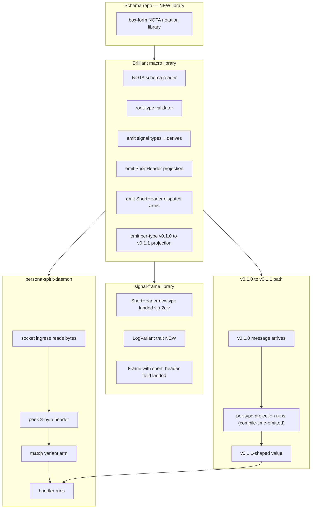
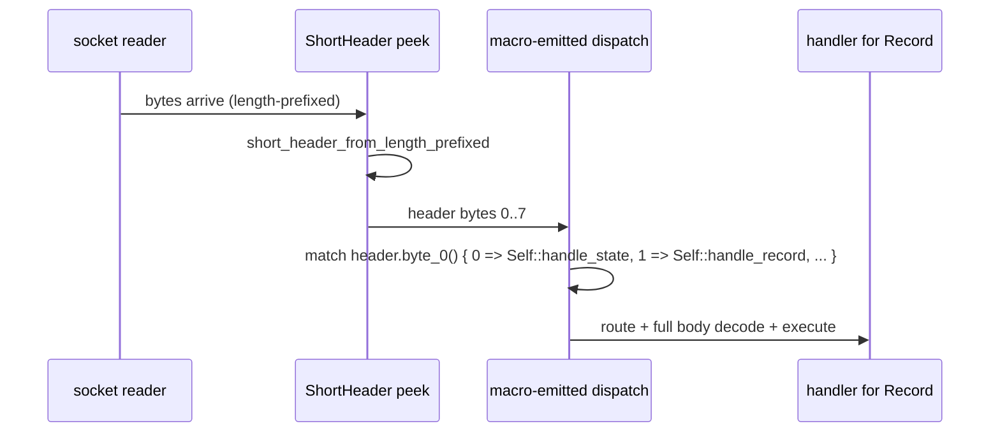
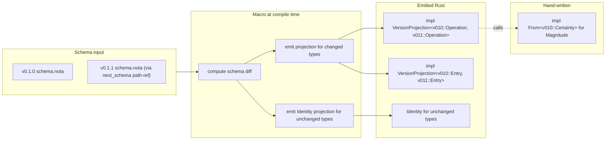
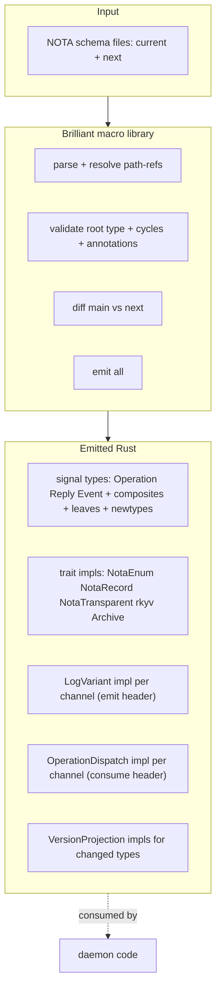
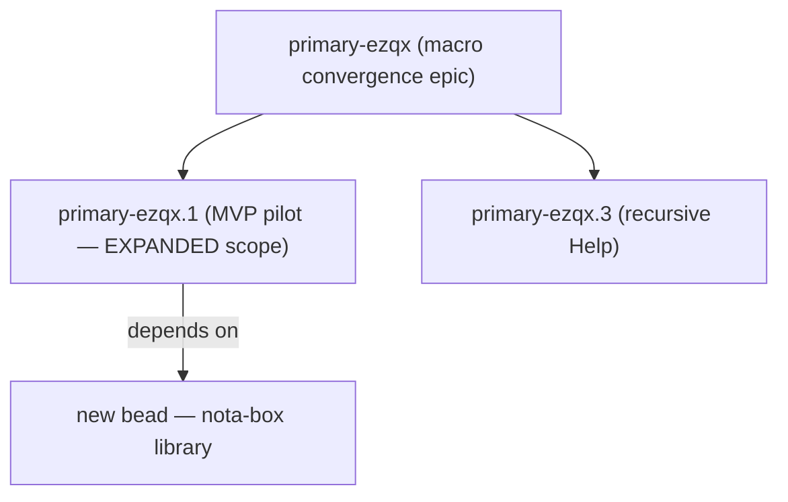

*Kind: Design · Topic: mvp-scope-expansion · Date: 2026-05-24*

# 323 — MVP scope expansion per operator directive

**Supersedes the scope sections of `/320`** (the original MVP design)
and **extends `/322`** (Spirit positional schema worked example).
The psyche's directive to operator pulled three concerns INTO the
MVP that I had previously deferred. This report names them, names
the bead-graph adjustments, and adds the missing design details.

The psyche gave the substance to operator (operator will capture
intent); designer's job is to absorb into the design + adjust the
bead graph so operator's pickup is unambiguous.

## §1 What changed — the directive

> Get a running `/321` MVP spirit with new NOTA schema-based
> testable implementation which can update between v0.1.0 → v0.1.1
> signal format using only the schema to derive all the
> schema-change implementations on the types that have it (optional
> compile-time code that is called on the objects that get upgraded
> on this turn main/next pair), and 64-bit header emitting AND
> consumption for signal/receiving dispatch triage (by matching the
> variant arms), all in a brilliant macro library that creates all
> the corresponding signal types and their trait impls using the
> structured ordered-vector-of-boxes variable length (length
> prefixed) NOTA notation (this alone deserves its own library in
> the schema repo).

Three things the directive PULLS INTO MVP that I previously had
as post-MVP or as separate beads:

1. **v0.1.0 → v0.1.1 schema-derived projection** — was
   `primary-ezqx.2` (Slot 6 next-as-dep). NOW part of `primary-ezqx.1`.
2. **Short-header CONSUMPTION + dispatch triage** — was implicit /
   downstream. NOW explicit MVP item: receiver matches variant
   arms by reading the header.
3. **Box-form NOTA notation** (ordered-vector-of-boxes, length-
   prefixed) — was spirit 404 deferred post-MVP. NOW the wire
   form the MVP uses, with its own library in the schema repo.

And one new architectural element:

4. **Consolidated "brilliant macro library"** — emit types + trait
   impls + ShortHeader emit + ShortHeader consume + dispatch +
   per-type projection — all from one macro library, not scattered.

## §2 The expanded MVP picture



Mapping the diagram labels to identifiers and target files:

| Diagram label | Identifier | Target file |
|---|---|---|
| box-form NOTA notation library | NEW crate `nota-box` (or similar; under `nota` repo) | `nota-box/src/` (NEW) |
| NOTA schema reader | NEW | `signal-frame-macros/src/schema_reader.rs` |
| root-type validator | NEW | `signal-frame-macros/src/validate.rs` |
| emit signal types + derives | NEW | `signal-frame-macros/src/emit.rs` |
| emit ShortHeader projection | NEW | `signal-frame-macros/src/emit.rs` |
| emit ShortHeader dispatch arms | NEW (was implicit) | `signal-frame-macros/src/emit.rs` |
| emit per-type projection | NEW (was `primary-ezqx.2`) | `signal-frame-macros/src/emit.rs` |
| ShortHeader newtype | landed | `signal-frame/src/frame.rs:20` |
| LogVariant trait | NEW | `signal-frame/src/log_variant.rs` |
| Frame with short_header | landed via `primary-2cjv` | `signal-frame/src/frame.rs:87-94` |

## §3 The three new MVP elements

### §3.1 ShortHeader consumption + dispatch triage

**What it adds:** The macro emits a dispatch function per channel
that takes a `ShortHeader` (peeked from the wire), matches its
byte-0 root-verb against the contract's `Operation` variants, and
routes to the handler for that variant — all before the full rkyv
decode of the body.



**The macro emits:**

```rust
// Macro-emitted dispatch trait per channel:
pub trait OperationDispatch {
    type Error;
    fn dispatch(&mut self, header: ShortHeader, body_bytes: &[u8])
        -> Result<Reply, Self::Error>;
}

// Macro-emitted default impl using header byte 0:
impl<H: SpiritHandler> OperationDispatch for H {
    type Error = SpiritError;

    fn dispatch(&mut self, header: ShortHeader, body_bytes: &[u8])
        -> Result<Reply, Self::Error>
    {
        let header_bytes = header.to_le_bytes();
        match header_bytes[0] {
            0 => {
                let statement: Statement = decode_body(body_bytes)?;
                self.handle_state(statement)
            }
            1 => {
                let entry: Entry = decode_body(body_bytes)?;
                self.handle_record(entry)
            }
            2 => {
                let obs: Observation = decode_body(body_bytes)?;
                self.handle_observe(obs)
            }
            3 => {
                let sub: Subscription = decode_body(body_bytes)?;
                self.handle_watch(sub)
            }
            4 => {
                let tok: SubscriptionToken = decode_body(body_bytes)?;
                self.handle_unwatch(tok)
            }
            5 => {
                let filter: ObserverFilter = decode_body(body_bytes)?;
                self.handle_tap(filter)
            }
            6 => {
                let tok: ObserverSubscriptionToken = decode_body(body_bytes)?;
                self.handle_untap(tok)
            }
            n => Err(SpiritError::UnknownVariant(n)),
        }
    }
}
```

The daemon implements the `SpiritHandler` trait (handler methods
per operation); the macro handles the dispatch routing. Today
this dispatch logic is hand-written in `persona-spirit/src/actors/dispatch.rs`
(per second-designer/163 §5.4).

### §3.2 v0.1.0 → v0.1.1 schema-derived projection (folded from `primary-ezqx.2`)

**What it adds:** The macro reads BOTH schemas at compile time
(current + next via the `next_schema` declaration) and emits
projection code ONLY for types that differ between the two
versions. Types unchanged across versions get an `Identity`
projection (zero-cost); types with schema changes get the macro-
emitted projection that calls into hand-written `From` impls for
the actual transform logic (the only domain-specific code).



**The macro decides per type:**
- Same shape in v0.1.0 and v0.1.1 → emit `Identity` projection.
- Different shape → emit projection that delegates per-field via
  `Into::into`; failing fields require a hand-written `From` impl
  in the current crate's `src/migration.rs` per `/317-3 §10.2`.

**For the Spirit Certainty→Magnitude case (the only domain-
specific transform):**

```rust
// Hand-written ONCE in signal-persona-spirit/src/migration.rs:
impl From<v010::Certainty> for v011::Magnitude {
    fn from(certainty: v010::Certainty) -> Self {
        match certainty {
            v010::Certainty::Maximum => Self::Maximum,
            v010::Certainty::Medium  => Self::Medium,
            v010::Certainty::Minimum => Self::Minimum,
        }
    }
}

// Macro-emitted in v0.1.0's expanded source:
impl VersionProjection<v010::Entry, v011::Entry> for ForwardEntry {
    type Error = ProjectionError;
    fn project(source: v010::Entry) -> Result<v011::Entry, Self::Error> {
        Ok(v011::Entry {
            topic: source.topic.into(),         // Identity (Topic unchanged)
            kind: source.kind.into(),           // Identity (Kind unchanged)
            summary: source.summary.into(),     // Identity (Summary unchanged)
            context: source.context.into(),     // Identity (Context unchanged)
            certainty: source.certainty.into(), // calls hand-written From
            quote: source.quote.into(),         // Identity (Quote unchanged)
        })
    }
}
```

The macro emits the `VersionProjection` impl mechanically from
the schema diff; the operator hand-writes ONE `From` impl per
type that genuinely changed semantics. For Spirit's
v0.1.0 → v0.1.1 widening, that's ONE impl
(`Certainty → Magnitude`).

### §3.3 Box-form NOTA notation as its own library

**What it adds:** A new library crate `nota-box` (or similar
naming) in the schema repo (`nota` repo or a new dedicated
schema repo). It implements the ordered-vector-of-boxes variable-
length (length-prefixed) NOTA encoding per spirit 404.

**Why the split is correct:** Per spirit 400's principle and the
psyche's "this alone deserves its own library" framing, the
box-form codec has a release cadence independent of both the
schema-language macro and the daemon work. Other crates that
need only the box-form codec can depend on `nota-box` without
pulling in macro/daemon scaffolding.

**The box-form encoding** (per spirit 404):

```text
Root object (sized fields inline)
[length-prefix][box-1-bytes]
[length-prefix][box-2-bytes]
...
```

Each box is length-prefixed (u32 BE per the workspace's existing
length-prefix convention) so a decoder can skip over a box
without parsing its contents — useful for partial decode, peek,
and lazy validation.

For Spirit's `Entry`:

| Wire region | Content | Source |
|---|---|---|
| Root | sized fields: `Kind` (1 byte discriminant) + `Magnitude` (1 byte discriminant) | inline in root |
| Box 1 | length-prefix + `Topic` String bytes | unsized |
| Box 2 | length-prefix + `Summary` String bytes | unsized |
| Box 3 | length-prefix + `Context` String bytes | unsized |
| Box 4 | length-prefix + `Quote` String bytes | unsized |

Reading: `(Record (Entry Decision Maximum)) [[workspace] [summary text] [context text] [verbatim quote]]`

The order of boxes matches the declaration order in the schema's
`Entry` definition (per spirit 404 — positional, no naming).

## §4 The brilliant macro library — consolidated picture

The directive frames everything as "one brilliant macro library
that creates all the corresponding signal types and their trait
impls". The library:



**What the macro library produces from one schema declaration:**

| Output | Purpose | When |
|---|---|---|
| Signal types | Operation/Reply/Event + composites + leaves + newtypes | always |
| NOTA codec derives | `NotaEnum`/`NotaRecord`/`NotaTransparent` impls | always |
| rkyv derives | `Archive`/`Serialize`/`Deserialize` | always |
| `LogVariant` per channel | byte-0=variant + bytes 1-7=sub-enum slots | always (per `/320 §2.10`) |
| `OperationDispatch` per channel | match-header-byte-0 → handler routing | always (new per `§3.1`) |
| `VersionProjection` impls | for types that differ between v0.1.0 and v0.1.1 | only if `next_schema` block exists |
| `Frame::with_short_header()` constructor wrapping | builds Frame with the header populated | always |

The library's surface is: one entry point (the `signal_channel!`
macro), one schema input (NOTA file), N output types/impls. All
the cross-cutting concerns (header emit, header consume,
projection, codec) consolidated into one macro emission pass.

## §5 Bead-graph adjustments

### §5.1 `primary-ezqx.1` scope expanded

Update the bead body to incorporate §3.1 + §3.2 + §3.3 + §4. The
sub-tasks grow from 10 to roughly 14:

| Old sub-task | Status |
|---|---|
| 1-10 (per `/320 §4`) | KEEP, extend |
| NEW 11 | Emit `OperationDispatch` trait + impl per channel (§3.1) |
| NEW 12 | Emit `VersionProjection` for types differing between v0.1.0/v0.1.1 (§3.2) |
| NEW 13 | Create `nota-box` library in `nota` repo with box-form codec (§3.3) |
| NEW 14 | Wire box-form into the macro's NOTA codec emission |

Per-step file impact ~doubles. Sized: now ~5-8 operator hours
across ~2 sessions instead of 1.

### §5.2 `primary-ezqx.2` retires (substance moves to `.1`)

`primary-ezqx.2` was Slot 6 (next-as-dep `VersionProjection`).
Per §3.2 this folds into `primary-ezqx.1` as sub-task 12.

Recommended action: `bd close primary-ezqx.2` with breadcrumb
pointing at `primary-ezqx.1`. The Slot 6 substance carries
forward but lives under `.1` to match the directive's "all in
one brilliant macro library" framing.

### §5.3 NEW bead — `nota-box` library

A new bead under the `nota` repo to create the box-form NOTA
codec library:

```text
Create nota-box library — ordered-vector-of-boxes variable-length
(length-prefixed) NOTA encoding per spirit 404.

Scope:
- New crate at nota-box/ in the nota repo (or under a new schema
  repo if the workspace prefers).
- Implements the wire format: root object (sized fields inline) +
  N length-prefixed boxes after, in declaration order.
- API: encode (root, boxes) → bytes; decode bytes → (root, boxes);
  peek box N from bytes without full decode.
- Witness tests: round-trip for a representative complex type
  (Spirit's Entry); peek correctness.

Dependencies: nota repo + nota-codec for the inline codec
fallback path (the box codec wraps the inline codec for each
box's internals).

Acceptance: cargo test passes; can encode + decode Spirit's
Entry in box form.

Used by: primary-ezqx.1 (the brilliant macro library) which
emits NOTA codec impls using nota-box for unsized field
containers.
```

Place this as a CHILD of `primary-ezqx.1` since `.1` depends on
it, OR as a sibling that `.1` depends on. Sibling is cleaner —
the box library is its own concern that can advance independently
of macro work.

### §5.4 Bead-graph after adjustments



`primary-ezqx.2` retires (substance absorbed into `.1`).
`primary-ezqx.3` (recursive Help) stays as parallel slot.
New `nota-box` bead is the box-form codec library MVP depends on.

## §6 Updated Spirit worked example (extending `/322`)

`/322`'s schema (§1) is unchanged structurally. What changes is
the emitted code and the wire form.

### §6.1 New emitted code per channel — dispatch trait

Adding to `/322 §4`:

```rust
// Macro-emitted from the Operation enum + per §3.1:
pub trait SpiritHandler {
    type Error;
    fn handle_state(&mut self, payload: Statement) -> Result<Reply, Self::Error>;
    fn handle_record(&mut self, payload: Entry) -> Result<Reply, Self::Error>;
    fn handle_observe(&mut self, payload: Observation) -> Result<Reply, Self::Error>;
    fn handle_watch(&mut self, payload: Subscription) -> Result<Reply, Self::Error>;
    fn handle_unwatch(&mut self, payload: SubscriptionToken) -> Result<Reply, Self::Error>;
    fn handle_tap(&mut self, payload: ObserverFilter) -> Result<Reply, Self::Error>;
    fn handle_untap(&mut self, payload: ObserverSubscriptionToken) -> Result<Reply, Self::Error>;
}
```

The daemon implements `SpiritHandler` to plug its actor/store/
classifier logic into the dispatch. The macro-emitted
`OperationDispatch` routes incoming bytes to the right `handle_*`
method.

### §6.2 New wire form — box-form encoding for `Record(Entry{...})`

Today's inline form:
```text
(Record (Entry [workspace] Decision [summary] [context] Maximum [quote]))
```

Box-form per §3.3:
```text
Root region:
(Record (Entry Decision Maximum))

Boxes region (each length-prefixed):
[length=9][workspace]
[length=14][summary text]
[length=14][context text]
[length=14][verbatim quote]
```

The root carries only sized fields (`Kind` discriminant + `Magnitude`
discriminant). The four unsized `String` newtypes become four
length-prefixed boxes after the root. Decoder reads root + counts
boxes; partial decode can peek box N without parsing boxes 1..N-1.

### §6.3 The Spirit v0.1.0 → v0.1.1 schema diff

For Spirit's actual migration:

| Type | v0.1.0 shape | v0.1.1 shape | Macro decision |
|---|---|---|---|
| `Operation::State` | `(State Statement)` | `(State Statement)` | Identity |
| `Operation::Record` | `(Record Entry)` | `(Record Entry)` | per-Entry diff |
| `Topic` | `(Topic String)` | `(Topic String)` | Identity |
| `Summary` | `(Summary String)` | `(Summary String)` | Identity |
| `Context` | `(Context String)` | `(Context String)` | Identity |
| `Quote` | `(Quote String)` | `(Quote String)` | Identity |
| `Kind` | 5 variants | 5 variants (unchanged) | Identity |
| `Certainty` (v0.1.0) / `Magnitude` (v0.1.1) | 3 variants | 7 variants | **HAND-WRITTEN From** |
| `Entry` | `Topic Kind Summary Context Certainty Quote` | `Topic Kind Summary Context Magnitude Quote` | macro-emitted (calls hand-written From for the changed field) |

ONE hand-written `From` impl in
`signal-persona-spirit/src/migration.rs`:

```rust
impl From<v010::Certainty> for Magnitude {
    fn from(c: v010::Certainty) -> Self {
        match c {
            v010::Certainty::Maximum => Self::Maximum,
            v010::Certainty::Medium  => Self::Medium,
            v010::Certainty::Minimum => Self::Minimum,
        }
    }
}
```

The macro emits everything else.

## §7 What this expansion buys

| Capability | Before this directive | After |
|---|---|---|
| Wire-side ShortHeader emission | MVP | MVP (unchanged) |
| Wire-side ShortHeader consumption + dispatch | hand-written in daemon | macro-emitted (MVP) |
| v0.1.0 → v0.1.1 schema-derived projection | post-MVP (separate slot) | MVP, derived from schema diff |
| Per-type optional projection code | implicit hand-write | optional compile-time emission |
| Box-form NOTA wire encoding | post-MVP | MVP, in its own library |
| Schema-language macro consolidation | scattered slots | one brilliant macro library |
| Hand-written contract surface for Spirit | 468 LoC | ~50-line schema + ~30 LoC migration.rs From impl |

Net: the MVP now delivers a fully-running v0.1.0 → v0.1.1
Spirit cutover with the macro deriving everything except the
one `From` impl for the genuine schema change. That's the
"running spirit MVP" the directive asks for.

## §8 Risks worth surfacing

### §8.1 Scope creep risk — operator pushback

Original MVP per `/320`: ~900 LoC macro/lib + ~70 LoC schema +
~200 LoC tests, ~1-2 operator sessions. Expanded MVP per this
report: ~5-8 operator-hours across ~2 sessions; possibly more
once `nota-box` library work is sized. Operator may push back
on the breadth. Mitigation: file `nota-box` as a separate bead
that can advance in parallel; pragmatically scope `primary-ezqx.1`
to the dispatch trait + projection + NOTA-data input + macro
extensions, deferring box-form to follow as `primary-ezqx.1.1`
if operator hits time pressure.

### §8.2 Box-form codec library naming

The directive says "schema repo" — ambiguous between (a) the
existing `nota` repo getting a new `nota-box` library; (b) a
new `schema` or `schema-language` repo. The cleaner shape
depends on whether the schema-language macro itself ALSO moves
into the schema repo (vs staying in `signal-frame-macros`).
**Lean: keep the macro in `signal-frame-macros`; place
`nota-box` under the `nota` repo as a sibling library to
`nota-codec`.** Future split if a dedicated schema repo
materializes.

### §8.3 The dispatch trait shape

§3.1 sketched `SpiritHandler` with one method per `Operation`
variant. Two design corners:
- **Per-variant handler vs typed-channel handler.** Should the
  trait be one method per operation (clean per-variant routing)
  OR one `handle(op: Operation)` method (simpler but loses
  exhaustiveness)? **Lean: per-variant** — gives the daemon
  compiler-enforced exhaustiveness.
- **Async vs sync handlers.** Spirit's existing daemon is
  Kameo-actor-based (async). The trait must accommodate. **Lean:
  the macro emits `async fn handle_*` signatures**; sync handlers
  are a subset.

Both lean to operator pickup; markers per `/320` discipline:
`// DESIGN-DECISION-REVIEW (designer/323 §8.3): per-variant
async handler trait. Alternative: typed-channel monolithic
handler / sync. Revisit if dispatch ergonomics or async runtime
fights this shape.`

## §9 What's STILL outside the MVP (per `/320 §3.2` + this report)

| Concern | Status | Tracking |
|---|---|---|
| Sub-byte short-header packing | post-MVP per spirit 392 | unchanged |
| Schema component daemon (runtime registry) | post-MVP per spirit 397-400 | unchanged |
| Full sema-side bytes 1-7 layout | post-MVP | unchanged |
| Recursive Help on every enum | parallel slot under epic | `primary-ezqx.3` |
| Mass workspace cutover from Rust-syntax to NOTA-data | Spirit pilot only | per-component beads TBD |
| Owner-contract schema migration (`owner-signal-persona-spirit`) | post-MVP | separate cutover bead |

## §10 See also

- `reports/designer/320-mvp-schema-language-pilot-unblock.md`
  (original MVP design; `§3` scope partly superseded by this
  report's `§3` + `§5`)
- `reports/designer/322-spirit-mvp-positional-schema-worked-example.md`
  (Spirit worked example; `§4-§6` extended by this report's
  `§6`)
- `reports/designer/321-mvp-visual-state-of-play.md`
  (broader visual map; `§3` ShortHeader picture extends to
  include consumption per `§3.1` here)
- `reports/designer/317-sema-upgrade-and-macro-convergence-audit/3-next-as-dependency-design.md`
  (the next-as-dep design substance folded into MVP per `§3.2`
  of this report)
- `reports/second-designer/164-nota-schema-language-vector-of-root-verb-enums-2026-05-24.md`
  (schema-language v3 grammar this report's macro library
  consumes)
- `signal-frame/src/frame.rs:20-200` (`ShortHeader` + Frame +
  peek helpers landed via `primary-2cjv`)
- `nota/example.nota` (canonical bracket-string syntax)
- `primary-ezqx.1` (MVP pilot — bead body needs update per
  `§5.1`)
- `primary-ezqx.2` (Slot 6 — retires per `§5.2`)
- `primary-ezqx.3` (recursive Help — stays parallel)
- NEW bead per `§5.3` — `nota-box` library
- Spirit records 388-392 (short header MVP scope), 393-396
  (vector of root-verb enums + path-refs), 397-400 (schema
  component direction), 404 (box-form NOTA notation — pulled
  into MVP per this report)
