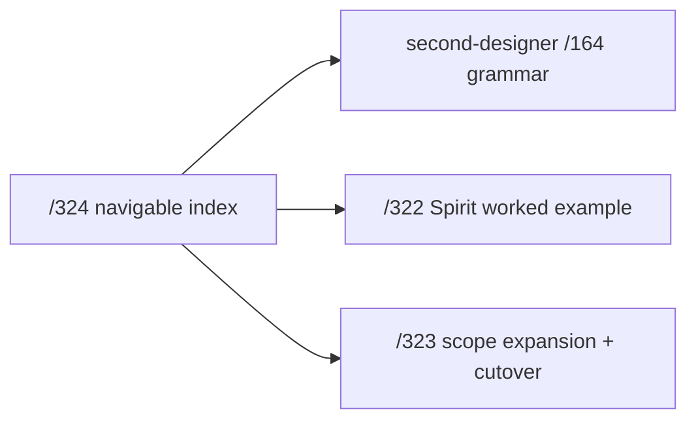
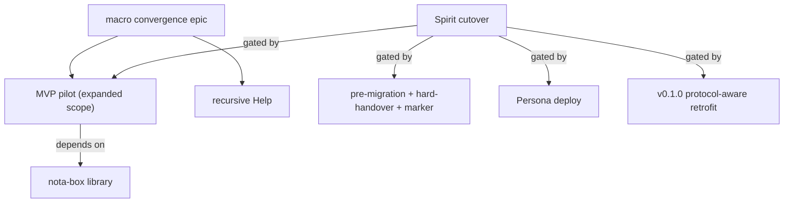

*Kind: Synthesis · Topic: migration-mvp-spirit-handover-re-specification · Date: 2026-05-24*

# 324 — Migration MVP Spirit + handover — re-specification

**Status:** canonical current-state re-specification for the Spirit MVP + v0.1.0 → v0.1.1 handover work. Consolidates `/320` (closed decisions) + `/322` (worked example) + `/323` (scope expansion + cutover discipline) into one navigable index. Aligned with intents 388-408 per `second-designer/166`'s catalog. Supersedes the scope of `/320 §3-§4` + `/321` (both STATUS-BANNERed in place pointing here).

## §1 The migration MVP in one paragraph

Spirit's v0.1.0 → v0.1.1 cutover ships via a hard-handover (manual, chosen-moment downtime; per `/323 §10`) running on schema-derived signal code (per intent 405). The `signal_channel` macro emits everything from a NOTA schema (per intent 391's v3 grammar in `/164`): the wire types, the NOTA + rkyv codecs, the ShortHeader emission AND consumption (per intent 407), the schema-derived `VersionProjection` for changed types (per intent 406, compile-time-optional per main/next pair), and the dispatch trait routing on header byte 0. The box-form NOTA encoding lives in its own library per intent 408. The cutover lands via offline-test + "database-test passed" marker (per `/323 §10.1-§10.5`); subsequent cutovers can use the now-installed smart-handover protocol.

## §2 The eight intents driving this MVP

| Intent | Topic | Kind | What it adds |
|---|---|---|---|
| 388 | signal-short-header | Principle Maximum | "short header" canonical name; 8-enum 64-bit layout |
| 390 | sema-short-header | Decision Maximum | sema gets its own short header symmetric with signal |
| 391 | nota-schema-language | Decision Maximum | macro consumes NOTA schema, not Rust syntax |
| 392 | signal-short-header | Constraint Maximum | MVP scope: even-byte 7-sub-enum split |
| 401 | nota | Constraint Maximum | bracket-string form `[text]`; quote-strings retire |
| 405 | schema-macro | Decision Maximum | MVP Spirit runs on schema-derived code |
| 406 | schema-macro | Principle Maximum | upgrade code compile-time-optional per main/next pair |
| 407 | signal-short-header | Decision Maximum | short headers drive receive-side dispatch triage |
| 408 | nota-schema-language | Decision Maximum | ordered-vector-of-boxes NOTA notation deserves own library |

Plus contextual intents: 393-396 (vector of root-verb enums + path-refs + macro emits three layers per /164), 397-400 (schema component triad direction; deferred post-MVP), 402 (block-string form), 404 (root + boxes layout per /323 §3.3).

## §3 The current canonical references

Source-to-locator map:

| Concern | Canonical reference |
|---|---|
| NOTA schema language grammar | `reports/second-designer/164-nota-schema-language-vector-of-root-verb-enums-2026-05-24.md` (v3 — needs absorption of intents 397-408 per /166) |
| Spirit schema source (the schema.nota file) | `/322 §1` (~50 lines, bracket-string form, positional, no field names) |
| Schema validator + reader design | `/322 §3` + `/320 §3.4` |
| Wire-side emissions per channel | `/322 §4` |
| End-to-end Record example | `/322 §5` |
| Public interfaces (CLI + daemon sockets) | `/322 §6` |
| ShortHeader CONSUMPTION + dispatch trait | `/323 §3.1` (per intent 407) |
| Schema-derived v0.1.0→v0.1.1 projection | `/323 §3.2` (per intent 406) |
| Box-form NOTA notation | `/323 §3.3` (per intent 408; library bead `primary-l6pc`) |
| Brilliant macro library consolidation | `/323 §4` |
| Hard-handover cutover mechanics | `/323 §10` |
| 13 closed design decisions + markers | `/320 §2` (unchanged) |

## §4 The current bead graph

| Bead | Status | What |
|---|---|---|
| `primary-ezqx` | OPEN epic | macro convergence parent |
| `primary-ezqx.1` | OPEN P1 | MVP pilot — expanded per `/323 §5.1` |
| `primary-ezqx.2` | CLOSED | absorbed into `.1` per `/323 §5.2` |
| `primary-ezqx.3` | OPEN P1 | recursive Help on every enum per `/312` |
| `primary-l6pc` | OPEN P1 | nota-box library per `/323 §3.3` + spirit 408 |
| `primary-x3ci.1` | OPEN P1 | pre-migration + hard-handover + marker per `/323 §10.5` |
| `primary-x3ci` | OPEN P1 | Spirit production cutover |
| `primary-a5hu` | OPEN P1 | Persona deploy (cutover blocker) |
| `primary-wdl6` | OPEN P1 | v0.1.0 protocol-aware retrofit (cutover blocker) |
| `primary-2cjv` | CLOSED | `ShortHeader` newtype + Frame field landed |
| `primary-li0p` | CLOSED | `NamespaceSection` + `SECTION_CUTOFF` landed |
| `primary-avog` | CLOSED | `assert_triad_sections!` macro landed |
| `primary-915w` | CLOSED | `signal_cli!` foundation landed |
| `primary-8r1j` | CLOSED | superseded by `primary-ezqx.3` |

## §5 What operator delivers — file map

| File | Action | Source |
|---|---|---|
| `signal-frame/src/log_variant.rs` | NEW | `/320 §2.12` |
| `signal-frame-macros/src/schema_reader.rs` | NEW | `/320 §3.1.A` |
| `signal-frame-macros/src/parse.rs` | extend (NOTA-data arm) | `/320 §2.8` |
| `signal-frame-macros/src/validate.rs` | extend (root-type + cycles) | `/320 §3.4` |
| `signal-frame-macros/src/emit.rs` | extend (LogVariant + Frame populator + OperationDispatch + VersionProjection) | `/320 §3.1.D-E` + `/323 §3.1-§3.2` |
| `signal-sema/src/operation.rs` | extend (LogVariant impl) | `/320 §3.1.F` |
| `signal-persona-spirit/schema.nota` | NEW | `/322 §1` |
| `signal-persona-spirit/src/lib.rs` | rewrite to NOTA input | `/320 §3.1` + `/322 §1` |
| `signal-persona-spirit/src/migration.rs` | NEW (one `From<v010::Certainty> for Magnitude`) | `/323 §3.2` |
| `signal-persona-spirit/tests/short_header.rs` | NEW | `/320 §3.1.H` |
| `nota/nota-box/src/lib.rs` | NEW library | `/323 §3.3` + `primary-l6pc` |
| `sema-engine/src/log.rs` (CommitLogEntry kind extension) | extend (DatabaseTestPassed marker) | `/323 §10.4` |
| `persona-spirit/src/daemon.rs` (OfflineTest mode + startup gating) | extend | `/323 §10.5` |

Total: ~1450 LoC net new across 2-3 focused operator sessions split across `primary-ezqx.1`, `primary-l6pc`, `primary-x3ci.1`.

## §6 Out of MVP — explicit deferrals

| Concern | Deferred to | Tracking |
|---|---|---|
| Sub-byte short-header packing | post-MVP per intent 392 | future bead |
| Schema component daemon (runtime registry) | post-MVP per intents 397-400 | future epic |
| Full sema bytes 1-7 layout | post-MVP per intent 390 | future bead |
| Mass workspace cutover from Rust-syntax to NOTA-data input | Spirit pilot only | per-component beads after pilot succeeds |
| Owner-contract schema migration | post-MVP | separate cutover bead |
| Recursive Help on every enum | parallel slot | `primary-ezqx.3` |
| Smart-handover live cutover (Mirror + Divergence + zero-downtime) | post-pilot — installed FROM the hard-handover cutover | downstream of `primary-x3ci` |

## §7 Designer review checklist

Per `/320 §5` + `/321 §10` + `/323 §3` + `/323 §10.5`:

| Check | Acceptance |
|---|---|
| `LogVariant` trait shape | `/320 §2.12`; re-exported from `signal-frame` |
| NOTA schema reader sandboxing | `/320 §2.7` |
| Root-type validator | `/320 §3.4` |
| Dual-input macro arm | `/320 §2.8` |
| `LogVariant` autogen | `/320 §2.10` — hierarchical-positional |
| `OperationDispatch` autogen | `/323 §3.1` |
| `VersionProjection` autogen | `/323 §3.2` — Identity for unchanged; field-walk for changed |
| Sema-side `LogVariant` | `/320 §2.13` + `/323 §3.2` |
| Spirit schema file | `/322 §1` — bracket strings, positional |
| `signal-persona-spirit/src/migration.rs` | ONE `From<v010::Certainty> for Magnitude` |
| Short-header round-trip test | encode `Record(Entry{...})` → frame bytes → decode → expected u64 |
| Tap-anywhere test | observer receives the header for a fired `Record` op |
| OfflineTest mode | `/323 §10.1` |
| Database-test-passed marker | `/323 §10.4` Option A |
| Production startup gating | `/323 §10.5` |
| Box-form NOTA codec | `primary-l6pc` library lands; `signal_channel` emits via library |
| Markers inlined | every `/320 §2.N` + `/323 §2.N/§3.N/§10.N` marker at code site |

## §8 What this supersedes

- `/320 §3 + §4` — scope sections superseded by `/323 §3 + §5` + this report's `§5`. `/320 §2` (closed decisions) remains authoritative; `/320` STATUS-BANNERed.
- `/321` — visual state pre-dated `/323`'s scope expansion; STATUS-BANNERed. Diagrams remain useful as foundation visuals.

## §9 What carries forward unchanged

- `/322` — canonical Spirit worked example.
- `/323` — canonical scope + cutover discipline.
- `/320 §2` — canonical closed-decision markers.
- `/317-3` — next-as-dep design rationale (absorbed operationally into `/323 §3.2`).
- `/164` — schema language grammar (v3; per /166 v4 absorption pending).
- `/166` — second-designer self-audit cross-referencing this report's scope.

## §10 Open psyche questions

Three corners worth ratifying:

### §10.1 Single-variant collapse + field naming

Lean: keep type-name-derived default for MVP; add explicit `(field-name type)` override syntax post-MVP per `/322 §3.4 Option B`.

### §10.2 `OperationDispatch` async-by-default

Lean: macro emits `async fn handle_*` signatures per channel. Spirit's daemon is Kameo-actor-based (async); sync handlers are a subset.

### §10.3 Box-form codec library location

Lean: `nota-box/` as a peer library under the `nota` repo (sibling to `nota-codec`). Alternative: a dedicated `schema/` repo.

## §11 See also

- `reports/designer/322-spirit-mvp-positional-schema-worked-example.md`
- `reports/designer/323-mvp-scope-expansion-per-operator-directive.md`
- `reports/designer/320-mvp-schema-language-pilot-unblock.md` (closed-decision markers §2; rest STATUS-BANNERed)
- `reports/designer/321-mvp-visual-state-of-play.md` (foundation visuals; STATUS-BANNERed)
- `reports/designer/317-sema-upgrade-and-macro-convergence-audit/3-next-as-dependency-design.md`
- `reports/second-designer/164-nota-schema-language-vector-of-root-verb-enums-2026-05-24.md`
- `reports/second-designer/166-self-audit-2026-05-24.md`
- `reports/operator/169-post-318-refresh-and-next-work-2026-05-24.md`
- `signal-frame/src/frame.rs:20-200` — `ShortHeader` + Frame + peek helpers
- `nota/example.nota` — canonical bracket-string syntax
- `primary-ezqx.1`, `primary-l6pc`, `primary-x3ci.1` — current operator beads
- Spirit records 388-408 per `/166 §2` catalog
