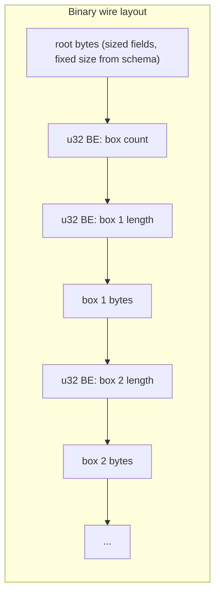
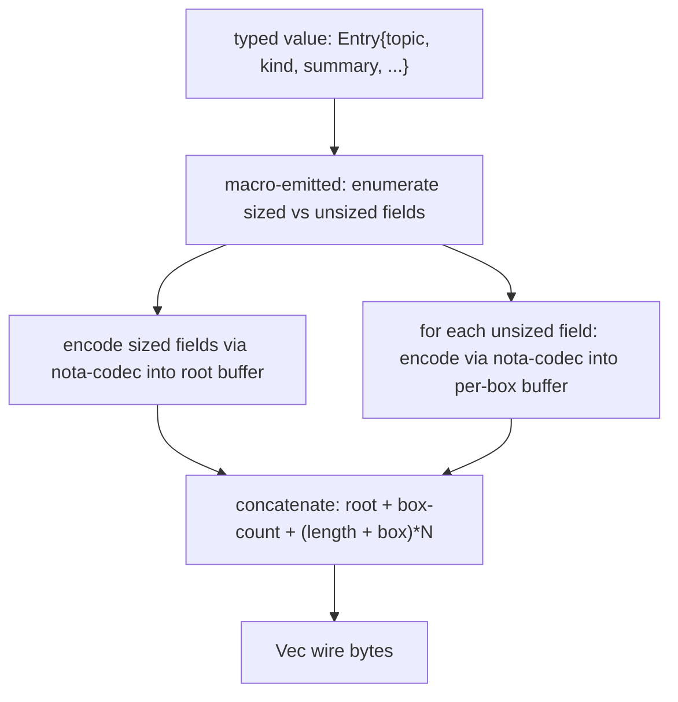
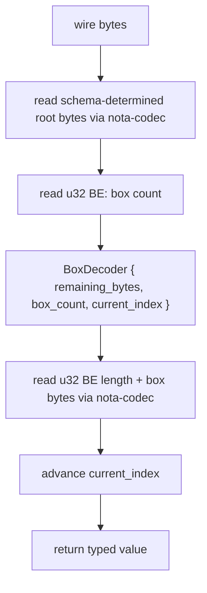
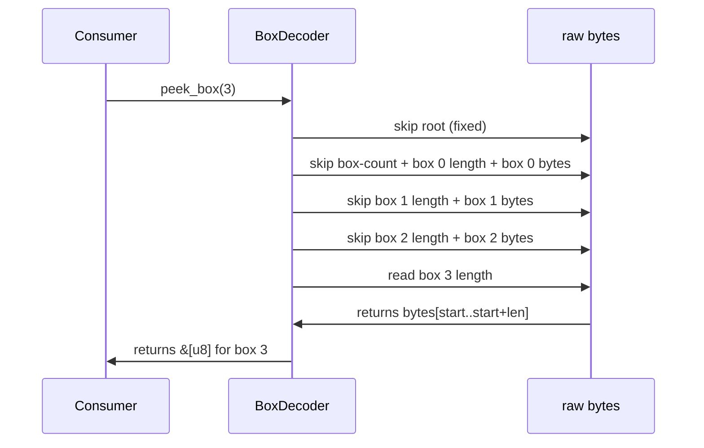

*Kind: Design · Topic: nota-box-library-design-and-implementation · Date: 2026-05-24*

# 325 — `nota-box` library — design + implementation handoff

**Status:** operator-ready. Tracks `primary-l6pc`. Implements spirit 404 (root + boxes layout) + spirit 408 (notation deserves own library). Layers over `nota-codec` (existing inline codec is the per-box internals primitive).

## §1 The library in one paragraph

`nota-box` is a peer library to `nota-codec` under the `nota` repo. It implements the **ordered-vector-of-boxes variable-length (length-prefixed) NOTA encoding**: a wire form where a record's sized fields stay inline in the root, and its unsized/growing fields (`String`, `Vec<T>`, `Option<unsized>`, nested records with growth) become length-prefixed boxes appearing AFTER the root in declaration order. The library exposes encode/decode traits + a peek API that lets a decoder skip to box N without parsing earlier boxes. The brilliant macro library (`primary-ezqx.1`) uses `nota-box` when emitting NOTA codec impls for types whose schema has unsized fields.

## §2 The wire format

### §2.1 Binary (length-prefixed) form



| Region | Size | Encoded by |
|---|---|---|
| Root bytes | fixed (schema-determined) | `nota-codec` inline form for the sized field tuple |
| Box count | 4 bytes (u32 BE) | nota-box |
| Per-box length prefix | 4 bytes (u32 BE) per box | nota-box |
| Per-box bytes | variable | `nota-codec` inline form for each box's content |

The root size is known at decode time from the schema (compile-time fixed for each registered type). No length-prefix on the root needed.

### §2.2 Text form

```text
(EnumName (Variant sized-field-1 sized-field-2 ...))
[box-1-content]
[box-2-content]
[box-3-content]
...
```

For Spirit's `Record(Entry{topic, kind, summary, context, certainty, quote})`:
- Root: `(Record (Entry Decision Maximum))` — sized fields (`Kind` + `Magnitude`) inline.
- Boxes: `[workspace] [summary text] [context text] [verbatim quote]` — four unsized `String`-newtype fields as bracket strings, in declaration order.

Boxes are space-separated bracket strings after the root record. The reader knows the box count from the schema (compile-time).

### §2.3 Two modes, one library

| Mode | Use | Tooling |
|---|---|---|
| Binary | wire transport (over sockets, in rkyv frames) | encode/decode functions returning `Vec<u8>` |
| Text | human-readable authoring, NOTA files, CLI input | encode/decode functions returning `String` |

Both modes share the same logical structure (root + N boxes); only the byte/character encoding differs. The library exposes both APIs from the same trait shapes.

## §3 Visuals — encoder + decoder flow

### §3.1 Encoder



### §3.2 Decoder



### §3.3 Peek-box-N flow



Peek is O(N) in box count to walk past earlier boxes (just reading length prefixes), but does NOT parse box content. Useful for partial decode + lazy validation.

## §4 Public API

### §4.1 Traits (in `nota-box/src/lib.rs`)

```rust
//! nota-box — ordered-vector-of-boxes variable-length NOTA encoding.
//!
//! Per spirit records 404 + 408. Layers over nota-codec for per-box
//! and root inline-encoding primitives.

use nota_codec::{Decoder, Encoder, Error as CodecError};

/// Encode a value as root inline + N length-prefixed boxes after.
pub trait BoxedNotaEncode {
    /// Encode the value's sized fields inline into the root region.
    fn encode_root(&self, encoder: &mut Encoder) -> Result<(), CodecError>;

    /// Number of unsized boxes this value carries.
    fn box_count(&self) -> usize;

    /// Encode the box at the given index. Boxes are declared in
    /// the schema's order; index 0 is the first unsized field.
    fn encode_box(&self, index: usize, encoder: &mut Encoder) -> Result<(), CodecError>;
}

/// Decode a value from root inline + N length-prefixed boxes.
pub trait BoxedNotaDecode: Sized {
    /// Decode the sized root from the decoder.
    fn decode_root(decoder: &mut Decoder) -> Result<RootProvisional<Self>, CodecError>;
}

/// Holds a partially-decoded value whose unsized boxes still need
/// to be supplied. The macro emits a method for each box that
/// completes the value:
///
/// ```ignore
/// let provisional = Entry::decode_root(&mut decoder)?;
/// let with_topic = provisional.with_topic_box(box0_bytes)?;
/// let with_summary = with_topic.with_summary_box(box1_bytes)?;
/// // ... finally a complete typed Entry value
/// ```
pub struct RootProvisional<T> {
    inner: T,
    boxes_supplied: usize,
}
```

### §4.2 Wire-level helpers

```rust
/// Encode a `BoxedNotaEncode` value into wire bytes (binary form):
///   root inline | u32 BE box count | (u32 BE length + box bytes)*N
pub fn encode_binary<T: BoxedNotaEncode>(value: &T) -> Result<Vec<u8>, Error> {
    let mut out = Vec::new();

    // 1. Root inline
    let mut root_encoder = Encoder::new(&mut out);
    value.encode_root(&mut root_encoder)?;

    // 2. Box count
    let n = value.box_count() as u32;
    out.extend_from_slice(&n.to_be_bytes());

    // 3. Per-box: length + bytes
    for i in 0..value.box_count() {
        let mut box_buf = Vec::new();
        let mut box_encoder = Encoder::new(&mut box_buf);
        value.encode_box(i, &mut box_encoder)?;

        let len = box_buf.len() as u32;
        out.extend_from_slice(&len.to_be_bytes());
        out.extend(box_buf);
    }

    Ok(out)
}

/// Decode wire bytes into a `BoxedNotaDecode` value.
pub fn decode_binary<T: BoxedNotaDecode>(bytes: &[u8]) -> Result<T, Error> {
    let mut decoder = Decoder::new(bytes);

    // The decoder walks root inline then reads box count + boxes
    // via the macro-emitted per-type method.
    let value = T::decode_full_binary(&mut decoder)?;
    Ok(value)
}

/// Peek box N's bytes without fully decoding earlier boxes.
/// O(N) — walks past length prefixes only.
pub fn peek_box(bytes: &[u8], root_size: usize, box_index: usize) -> Result<&[u8], Error> {
    let after_root = &bytes[root_size..];
    let (box_count, after_count) = read_u32_be(after_root)?;

    if box_index >= box_count as usize {
        return Err(Error::BoxIndexOutOfRange { requested: box_index, count: box_count as usize });
    }

    let mut cursor = after_count;
    for i in 0..box_index {
        let (box_len, after_len) = read_u32_be(cursor)?;
        cursor = &after_len[box_len as usize..];
    }

    let (box_len, after_len) = read_u32_be(cursor)?;
    Ok(&after_len[..box_len as usize])
}
```

### §4.3 Errors

```rust
#[derive(Debug, thiserror::Error)]
pub enum Error {
    #[error("nota-codec error: {0}")]
    Codec(#[from] CodecError),

    #[error("box index {requested} out of range (count = {count})")]
    BoxIndexOutOfRange { requested: usize, count: usize },

    #[error("truncated wire bytes: expected at least {expected} bytes, found {found}")]
    Truncated { expected: usize, found: usize },

    #[error("box length prefix overflows remaining bytes")]
    BoxLengthOverflow,
}
```

## §5 Skeleton implementation — files

### §5.1 Crate layout

```text
nota/                                  (existing nota repo)
├── nota-codec/                        (existing inline codec)
├── nota-box/                          (NEW — this bead)
│   ├── Cargo.toml
│   ├── README.md
│   ├── src/
│   │   ├── lib.rs                     (public API + traits + helpers)
│   │   ├── encode.rs                  (encode_binary + encode_text)
│   │   ├── decode.rs                  (decode_binary + decode_text)
│   │   ├── peek.rs                    (peek_box helpers)
│   │   └── error.rs                   (Error type)
│   └── tests/
│       ├── round_trip.rs              (Spirit Entry encode-decode equality)
│       ├── peek_box.rs                (peek correctness)
│       └── empty_boxes.rs             (zero-box values)
└── ...
```

### §5.2 Cargo.toml sketch

```toml
[package]
name = "nota-box"
version = "0.1.0"
edition = "2021"
publish = false

[dependencies]
nota-codec = { path = "../nota-codec" }
thiserror = "1"
```

### §5.3 lib.rs skeleton

```rust
//! nota-box — ordered-vector-of-boxes variable-length NOTA encoding.
//!
//! Per spirit records 404 + 408 (Maximum).
//!
//! Layers over nota-codec: root inline-fields use nota-codec's
//! encode/decode; per-box contents also use nota-codec; the box
//! count + per-box length prefixes are nota-box's own machinery.
//!
//! DESIGN-DECISION-REVIEW (designer/325 §2.1): u32 big-endian
//! length prefix matches signal-frame's existing length-prefix
//! convention. Alternative: u64 LE. Revisit if box sizes routinely
//! exceed 4 GB (no current use case requires this).

pub mod encode;
pub mod decode;
pub mod peek;
pub mod error;

pub use encode::{encode_binary, encode_text};
pub use decode::{decode_binary, decode_text};
pub use peek::peek_box;
pub use error::Error;

pub trait BoxedNotaEncode {
    fn encode_root(&self, encoder: &mut nota_codec::Encoder) -> Result<(), nota_codec::Error>;
    fn box_count(&self) -> usize;
    fn encode_box(&self, index: usize, encoder: &mut nota_codec::Encoder) -> Result<(), nota_codec::Error>;
}

pub trait BoxedNotaDecode: Sized {
    fn decode_full_binary(decoder: &mut nota_codec::Decoder) -> Result<Self, Error>;
    fn decode_full_text(text: &str) -> Result<Self, Error>;
}
```

### §5.4 encode.rs skeleton

```rust
use crate::{BoxedNotaEncode, Error};
use nota_codec::Encoder;

pub fn encode_binary<T: BoxedNotaEncode>(value: &T) -> Result<Vec<u8>, Error> {
    let mut out = Vec::new();

    // Root region — sized fields inline via nota-codec
    {
        let mut encoder = Encoder::new(&mut out);
        value.encode_root(&mut encoder)?;
    }

    // Box count — u32 BE
    let n = value.box_count() as u32;
    out.extend_from_slice(&n.to_be_bytes());

    // Per-box: length prefix + box bytes
    for i in 0..value.box_count() {
        let mut box_buf = Vec::new();
        {
            let mut encoder = Encoder::new(&mut box_buf);
            value.encode_box(i, &mut encoder)?;
        }

        let len = box_buf.len() as u32;
        out.extend_from_slice(&len.to_be_bytes());
        out.extend(box_buf);
    }

    Ok(out)
}

pub fn encode_text<T: BoxedNotaEncode>(value: &T) -> Result<String, Error> {
    // Text form: root as NOTA inline + space-separated bracket strings for each box
    let mut out = String::new();

    // Root encoded as a single NOTA record via nota-codec
    let mut root_bytes = Vec::new();
    {
        let mut encoder = Encoder::new(&mut root_bytes);
        value.encode_root(&mut encoder)?;
    }
    out.push_str(&String::from_utf8(root_bytes).map_err(|_| Error::Truncated { expected: 0, found: 0 })?);

    // Each box as a bracket string
    for i in 0..value.box_count() {
        out.push(' ');
        let mut box_bytes = Vec::new();
        {
            let mut encoder = Encoder::new(&mut box_bytes);
            value.encode_box(i, &mut encoder)?;
        }
        out.push('[');
        out.push_str(&String::from_utf8(box_bytes).map_err(|_| Error::Truncated { expected: 0, found: 0 })?);
        out.push(']');
    }

    Ok(out)
}
```

### §5.5 decode.rs skeleton

```rust
use crate::{BoxedNotaDecode, Error};
use nota_codec::Decoder;

pub fn decode_binary<T: BoxedNotaDecode>(bytes: &[u8]) -> Result<T, Error> {
    let mut decoder = Decoder::new(bytes);
    T::decode_full_binary(&mut decoder)
}

pub fn decode_text<T: BoxedNotaDecode>(text: &str) -> Result<T, Error> {
    T::decode_full_text(text)
}

pub(crate) fn read_box_count(decoder: &mut Decoder) -> Result<u32, Error> {
    let bytes = decoder.read_bytes(4)?;
    Ok(u32::from_be_bytes([bytes[0], bytes[1], bytes[2], bytes[3]]))
}

pub(crate) fn read_box_length(decoder: &mut Decoder) -> Result<u32, Error> {
    let bytes = decoder.read_bytes(4)?;
    Ok(u32::from_be_bytes([bytes[0], bytes[1], bytes[2], bytes[3]]))
}
```

### §5.6 peek.rs skeleton

```rust
use crate::Error;

pub fn peek_box(bytes: &[u8], root_size: usize, box_index: usize) -> Result<&[u8], Error> {
    if bytes.len() < root_size + 4 {
        return Err(Error::Truncated { expected: root_size + 4, found: bytes.len() });
    }

    let after_root = &bytes[root_size..];
    let box_count = u32::from_be_bytes([after_root[0], after_root[1], after_root[2], after_root[3]]);

    if box_index >= box_count as usize {
        return Err(Error::BoxIndexOutOfRange {
            requested: box_index,
            count: box_count as usize,
        });
    }

    let mut cursor_pos = 4_usize;
    for _ in 0..box_index {
        if after_root.len() < cursor_pos + 4 {
            return Err(Error::Truncated { expected: cursor_pos + 4, found: after_root.len() });
        }
        let len = u32::from_be_bytes([
            after_root[cursor_pos],
            after_root[cursor_pos + 1],
            after_root[cursor_pos + 2],
            after_root[cursor_pos + 3],
        ]);
        cursor_pos += 4 + len as usize;
    }

    if after_root.len() < cursor_pos + 4 {
        return Err(Error::Truncated { expected: cursor_pos + 4, found: after_root.len() });
    }
    let target_len = u32::from_be_bytes([
        after_root[cursor_pos],
        after_root[cursor_pos + 1],
        after_root[cursor_pos + 2],
        after_root[cursor_pos + 3],
    ]);
    cursor_pos += 4;

    if after_root.len() < cursor_pos + target_len as usize {
        return Err(Error::BoxLengthOverflow);
    }
    Ok(&after_root[cursor_pos..cursor_pos + target_len as usize])
}
```

## §6 Worked example — Spirit's `Entry`

### §6.1 The type + impl

```rust
// Macro-emitted from (Entry (Entry Topic Kind Summary Context Magnitude Quote)):
pub struct Entry {
    pub topic: Topic,          // unsized — box 0
    pub kind: Kind,            // sized — root
    pub summary: Summary,      // unsized — box 1
    pub context: Context,      // unsized — box 2
    pub certainty: Magnitude,  // sized — root
    pub quote: Quote,          // unsized — box 3
}

// Macro-emitted BoxedNotaEncode impl:
impl BoxedNotaEncode for Entry {
    fn encode_root(&self, encoder: &mut nota_codec::Encoder) -> Result<(), nota_codec::Error> {
        // Root opens a record, writes (Entry kind certainty), closes.
        encoder.start_positional_record("Entry", 2)?;
        self.kind.encode(encoder)?;
        self.certainty.encode(encoder)?;
        encoder.end_record()?;
        Ok(())
    }

    fn box_count(&self) -> usize { 4 }

    fn encode_box(&self, index: usize, encoder: &mut nota_codec::Encoder) -> Result<(), nota_codec::Error> {
        match index {
            0 => self.topic.encode(encoder),
            1 => self.summary.encode(encoder),
            2 => self.context.encode(encoder),
            3 => self.quote.encode(encoder),
            _ => Err(nota_codec::Error::Other("box index out of range".into())),
        }
    }
}
```

### §6.2 Binary wire bytes

For `Entry { topic: Topic("workspace"), kind: Decision, summary: Summary("summary text"), context: Context("context text"), certainty: Magnitude::Maximum, quote: Quote("verbatim quote") }`:

| Offset | Content | Size | What |
|---|---|---|---|
| 0..N | `(Entry Decision Maximum)` nota bytes | ~24 | root inline |
| N..N+4 | `0x00000004` | 4 | box count = 4 |
| N+4..N+8 | `0x0000000B` | 4 | box 0 length = 11 (workspace) |
| N+8..N+19 | `[workspace]` | 11 | box 0 bytes |
| N+19..N+23 | `0x0000000E` | 4 | box 1 length = 14 |
| N+23..N+37 | `[summary text]` | 14 | box 1 bytes |
| ...etc... | | | |

### §6.3 Text form

```text
(Record (Entry Decision Maximum)) [workspace] [summary text] [context text] [verbatim quote]
```

Reads as: a Record operation wrapping an Entry with sized fields Decision + Maximum inline; four bracket-string boxes follow carrying the unsized text fields in declaration order.

## §7 Test plan

### §7.1 `nota-box/tests/round_trip.rs`

```rust
use nota_box::{encode_binary, decode_binary, encode_text, decode_text};

#[test]
fn entry_round_trip_binary() {
    let entry = Entry {
        topic: Topic::new("workspace"),
        kind: Kind::Decision,
        summary: Summary::new("summary text"),
        context: Context::new("context text"),
        certainty: Magnitude::Maximum,
        quote: Quote::new("verbatim quote"),
    };

    let bytes = encode_binary(&entry).unwrap();
    let decoded: Entry = decode_binary(&bytes).unwrap();
    assert_eq!(decoded, entry);
}

#[test]
fn entry_round_trip_text() {
    let entry = Entry { /* same as above */ };
    let text = encode_text(&entry).unwrap();
    let decoded: Entry = decode_text(&text).unwrap();
    assert_eq!(decoded, entry);
}
```

### §7.2 `nota-box/tests/peek_box.rs`

```rust
use nota_box::{encode_binary, peek_box};

#[test]
fn peek_box_2_skips_earlier_boxes() {
    let entry = Entry { /* ... */ };
    let bytes = encode_binary(&entry).unwrap();

    // Root size: known from schema. For Entry's sized fields
    // (Kind discriminant + Magnitude discriminant) the root is
    // roughly: (Entry Decision Maximum) ≈ 24 NOTA-text bytes
    // or 2 bytes for the binary discriminants + record framing.
    let root_size = Entry::root_byte_size_binary();

    let box_2_bytes = peek_box(&bytes, root_size, 2).unwrap();
    assert_eq!(box_2_bytes, b"[context text]");
}

#[test]
fn peek_box_out_of_range_errors() {
    let entry = Entry { /* ... */ };
    let bytes = encode_binary(&entry).unwrap();
    let root_size = Entry::root_byte_size_binary();

    let err = peek_box(&bytes, root_size, 99).unwrap_err();
    assert!(matches!(err, nota_box::Error::BoxIndexOutOfRange { requested: 99, count: 4 }));
}
```

### §7.3 `nota-box/tests/empty_boxes.rs`

```rust
#[test]
fn zero_box_value_encodes_with_zero_count() {
    // A type with no unsized fields encodes with box_count == 0.
    // The wire form is: root + u32 BE 0 (count) + no box data.
    #[derive(BoxedNotaEncode, BoxedNotaDecode)]
    pub struct Empty {
        pub flag: bool,
    }
    let value = Empty { flag: true };
    let bytes = encode_binary(&value).unwrap();

    // Verify the last 4 bytes are 0u32 BE.
    assert_eq!(&bytes[bytes.len() - 4..], &[0u8; 4]);

    let decoded: Empty = decode_binary(&bytes).unwrap();
    assert_eq!(decoded, value);
}
```

## §8 What operator does next

Per `primary-l6pc`'s 6 sub-tasks (now sharpened):

1. **Create `nota/nota-box/Cargo.toml`** with the dependency on `nota-codec` per §5.2.
2. **Create `nota-box/src/lib.rs`** with the traits + module structure per §5.3.
3. **Implement `encode.rs`** per §5.4 (binary + text encoder helpers).
4. **Implement `decode.rs`** per §5.5 (binary + text decoder helpers).
5. **Implement `peek.rs`** per §5.6 (box-peek without full decode).
6. **Add tests** at `tests/round_trip.rs`, `tests/peek_box.rs`, `tests/empty_boxes.rs` per §7.
7. **Add README** at `nota-box/README.md` documenting the wire format + when to reach for box-form vs inline-form.
8. **Run `nix flake check --option max-jobs 0`** + `cargo test` + `cargo fmt`.

**Out of scope** for this bead (handled by `primary-ezqx.1` extension):
- The macro-emitted `BoxedNotaEncode` + `BoxedNotaDecode` impls for schema-declared types (`Entry`, `RecordSummary`, etc.). The macro library calls into `nota-box` when emitting codecs for types with unsized fields.

**Closed decisions to inline** (operator inlines `// DESIGN-DECISION-REVIEW (designer/325 §N)` markers):
- §2.1 u32 big-endian length prefix (matches signal-frame convention)
- §4 trait split (encode-root / box-count / encode-box separate methods for ergonomics + per-box laziness)
- §6.1 sized-vs-unsized field categorization derived from schema type (String/Vec/Option-of-unsized → unsized → box; primitives + sized enums → sized → root)

## §9 Open psyche questions (3 corners)

### §9.1 Text-form box delimiter — space vs newline

§2.2 + §6.3 use space-separated bracket strings after the root. Alternative: newline-separated for visual readability of complex records. **Lean: space-separated for compact one-line form; can extend to multi-line if box count grows large.**

### §9.2 Root size discovery for `peek_box`

§4 + §7.2 require the consumer to know the root size in bytes when peeking. Two options:
- (a) Macro emits `Entry::root_byte_size_binary() -> usize` per type (compile-time constant).
- (b) Library reads root size from the encoded bytes via a leading length prefix.

**Lean: (a)** — root sizes are compile-time-known from the schema; no need to pay the length-prefix cost on every encode.

### §9.3 Cross-schema box references

A box could itself be a `BoxedNotaEncode` value (nested boxes). MVP scope: boxes contain leaf primitives (strings, primitive containers). Nested boxes are post-MVP. **Confirm or pull nested into MVP if Spirit's schema has nested-box cases (it doesn't today).**

## §10 See also

- `reports/designer/322-spirit-mvp-positional-schema-worked-example.md` — the Spirit schema this library encodes
- `reports/designer/323-mvp-scope-expansion-per-operator-directive.md` §3.3 — box-form integration in the brilliant macro library
- `reports/designer/324-migration-mvp-spirit-handover-re-specification.md` — current canonical state
- `nota/nota-codec/` — peer library; `nota-box` layers over it
- `nota/example.nota` — canonical bracket-string syntax this library produces
- `signal-frame/src/frame.rs` — `u32 BE` length-prefix convention this library matches
- `primary-l6pc` — the operator bead this report addresses
- Spirit records 404 (root + boxes), 408 (notation deserves own library)
